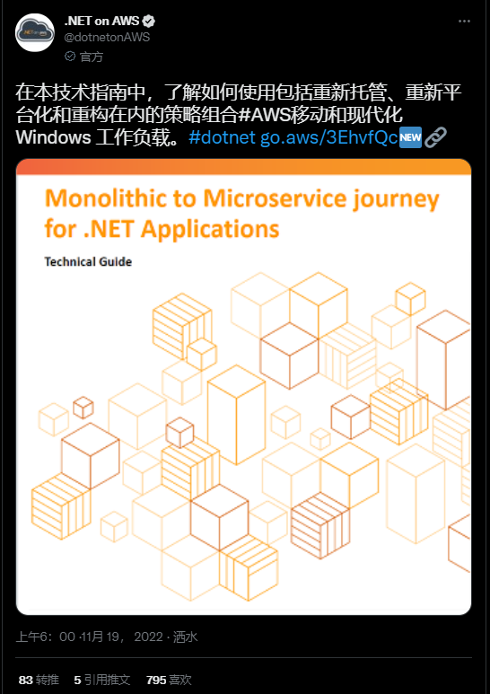
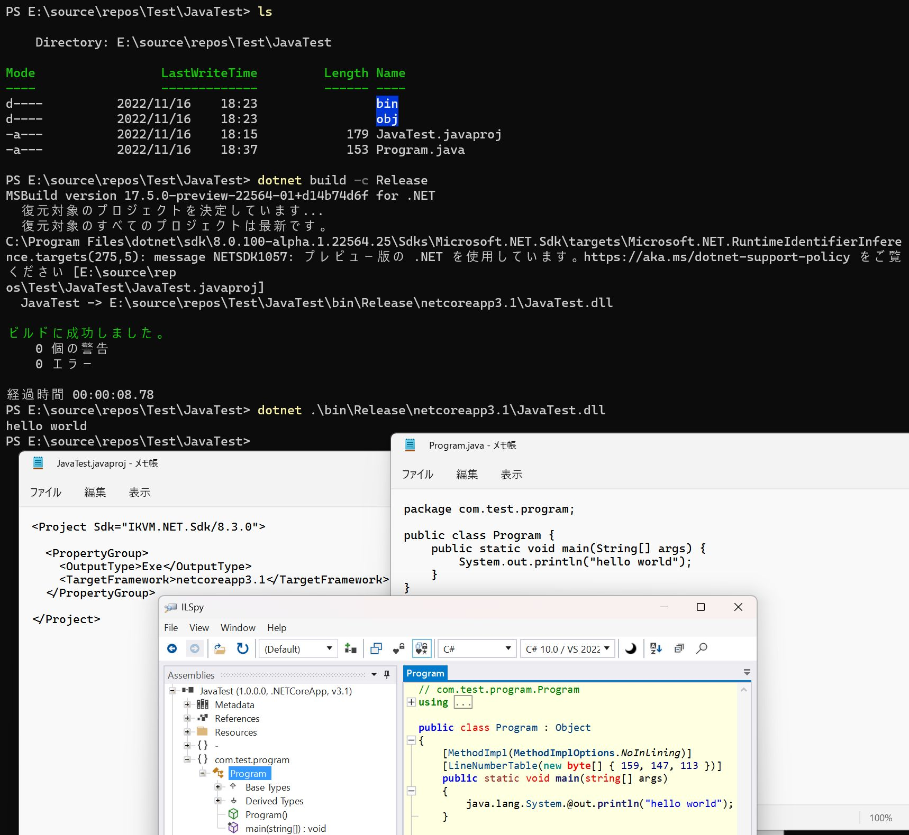
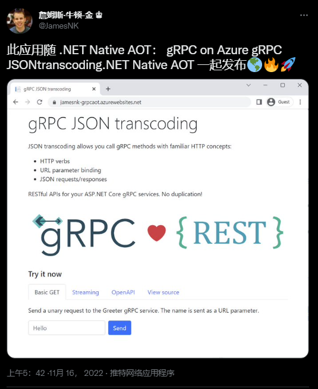
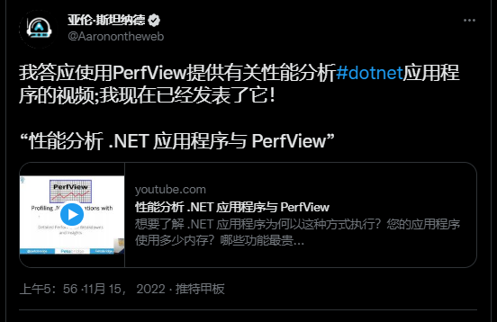

## 国内文章

### .NET Conf China 2022 第一批讲师阵容大揭秘！整个期待了！

https://mp.weixin.qq.com/s/4p89hhBPw6qv-0OB_T_TOg

**目光看过来** 2022年12月3-4日，一场社区性质的**国内规模最大的** **线上线下.NET Conf 2022技术大会** **即将盛大开幕**。目前大会正紧锣密鼓地进行中，第一批大咖讲师及主题已确定，小编迫不及待想和大家分享。

### 如何像使用AspNetCore中的Controllers 和 Actions一样处理MQTT消息

https://mp.weixin.qq.com/s/KyATJd47ctCVg9ZLTyGikA

在物联网项目中， 处理MQTT的topic时费工费力， 代码一团乱， 什么才是最好的姿势？这里面我们极力介绍 MQTTnet.AspNetCore.Routing  项目，这个组件是通过MQTTnet 实现了定义控制类和属性来路由处理消息的topic , 就像Asp.Net Core 的WebApi 写法一样简单容易。 

### 定制ASP.NET Core的身份认证

https://www.cnblogs.com/jackyfei/archive/2022/11/15/16879926.html

在本章，我们将学习如何定制ASP.NET Core认证机制。微软把安全认证当做ASP.NET Core框架的一部分，足以看见它是应用程序非常最重要的内容。在文将介绍如何定制ASP.NET Core认证UI的基本实现，以及如何向IdentityUser添加自定义信息。

### 从 WinDbg 角度理解 .NET7 的AOT玩法

https://www.cnblogs.com/huangxincheng/archive/2022/11/16/16895110.html

前几天 B 站上有位朋友让我从高级调试的角度来解读下 .NET7 新出来的 AOT，毕竟这东西是新的，所以这一篇我就简单摸索一下。

### C#多线程（三）线程高级篇

https://www.cnblogs.com/xiaolipro/archive/2022/11/15/16891311.html

抛开死锁不谈，只聊性能问题，尽管锁总能粗暴的满足同步需求，但一旦存在竞争关系，意味着一定会有线程被阻塞，竞争越激烈，被阻塞的线程越多，上下文切换次数越多，调度成本越大，显然在高并发的场景下会损害性能。在高并发高性能且要求线程安全的述求下，无锁构造（非阻塞构造）闪亮登场。

### .Net Core 实现WebSocket Server 的另外三种方式

https://mp.weixin.qq.com/s/8kXURygrPDmRi2mGcGt5nQ

之前已经写过关于《WebSocket 原生socket实现》和《.Net Core WebSocket 服务端与客户端完整示例》以及《基于.Net TcpListener 实现 WebSocketServer 通讯》。本文介绍了实现WebSocket Server 的另外三种方式。

### C# 11：接口中的静态抽象成员

https://mp.weixin.qq.com/s/fjnICBu61TA2JVHx9A8eww

本文介绍了C# 11中的新特性，在接口中支持静态抽象成员以及它的使用方法和样例代码。

### 聊聊FASTER和进程内混合缓存

https://mp.weixin.qq.com/s/kg_SpcY6TiPznYKogZaokw

本文简单的体验了微软FASTER KV Store，进行性能测试和解读了官方论文的性能数据，并给出了FASTER是否可以作为进程内混合缓存的可能性。

### 使用Jupyter记事本记录和制作.NET可视化笔记

https://mp.weixin.qq.com/s/hvDEopMXqVRmk_hsoEq2hg

对于记录笔记的工具特别多，不过对于程序员来说，记录笔记+程序代码+运行结果演示可以同时存在，无疑会极大增加我们的笔记的可读性和体验感。以前在写python的时候，使用jupyter的体验很好，所以此处做一个基于jupyter的记录C#代码的笔记简易教程，供大家围观。

### 使用BeetleX.MQTT构建服务

https://mp.weixin.qq.com/s/8ucY869v4mxFO4DAgx7f8g

已经有很长一段时间没有写代码，为了不让自己的代码技能有所下降所以针对BeetleX扩展了一个MQTT协议来保持自己的代码设计和编写能力。接下来简单介绍一下如何使用BeetleX.MQTT来构建对应的TCP或WebSocket服务。

### 【赏析】.NET跨平台框架-Avalonia UI

这是Avalonia UI官方的一个Demo，站长对部分Nuget包进行了升级，网友【小飞机MLA】对Linux版本修复了字体Bug得以正常运行、演示。

https://mp.weixin.qq.com/s/0MWOq8EznrzzK269phsKnw

## 主题

#### Fleet公开预览版中的C#支持 | .NET工具博客

https://blog.jetbrains.com/dotnet/2022/11/17/csharp-support-in-fleet/

Fleet中的C#支持现已进入公开预览阶段。

与Rider一样，实现是基于ReSharper的，但不支持Xamarin或Unity，所以Rider和Fleet将在可预见的未来共存。 在.NET支持下，Rider和Fleet将暂时共存。 作为一个限制条件，在.NET 5或更高的版本中。

支持的功能包括代码分析、导航、名称重构、代码完成、模板、格式化、文档弹出、应用程序配置和执行、调试包括断点。

文章还谈到了实现支持的步骤和未来计划。

### 宣布.NET虚拟单体库 - 问题#241 - dotnet/announcements

https://github.com/dotnet/announcements/issues/241

.NET虚拟单体资源库，是一个镜像和收集构建.NET所需的一切的资源库。

.NET产品的构建是由许多存储库组成的，这使得微软以外的任何人都很难复制构建，并增加了构建和发布基础设施的复杂性，其目标是简化构建和运输过程，并使其对社区透明。 储存库的目的是简化构建和运输，并对社区透明。

- [包括所有从.NET SDK构建所需的代码](https://github.com/dotnet/dotnet)

### ASP.NET Core到底有多快？

https://dusted.codes/how-fast-is-really-aspnet-core

一篇深入探讨最近关于ASP.NET Core性能的TechEmpower Benchmark结果的文章，其中吹捧了它的速度，以及相应的代码是什么样子。

基准代码包括仅使用Kestrel和最小部件编写的 "平台"、使用ASP.NET Core中间件的 "微型 "和甚至使用Razor模板引擎的 "完整"，每个实现都被讨论和推广。平台，但是否可以说它 "比其他语言/平台更快"。

### Git Action：自我托管的运行器现在支持Windows ARM64 - 问题#616 - github/roadmap

https://github.com/github/roadmap/issues/616#event-7826802074

GitHub Actions 的自我托管运行器现在支持 Windows ARM64 环境。

### 宣布Oracle对.NET 7的支持 - Alex Keh - Medium

https://medium.com/@alex.keh/announcing-oracle-support-for-net-7-c011b0dc4558

ODP.NET Core现在支持.NET 7。

NuGet软件包3.21.80版本或更高版本支持Oracle数据库11g Release 2（11.2.0.4）或更高版本。

### Visual Studio 2022 版本 17.4.1 - Visual Studio 2022 发行说明 | Microsoft Learn

https://learn.microsoft.com/en-us/visualstudio/releases/2022/release-notes#17.4.1

Visual Studio 2022的17.4.1版本已经发布。

它修复了ML.NET Model Builder、集成终端屏幕阅读器的问题，以及在Linux上打开.NET 7核心转储时的崩溃。

### VS Git多库支持已发布!

https://devblogs.microsoft.com/visualstudio/multi-repository-support-released/

一篇解释Visual Studio 2022 17.4中发布的Git的多仓库支持的文章。

多资源库支持允许你在打开一个解决方案的同时处理多个资源库。 由于性能的限制，目前可以同时处理的存储库的数量限制在10个。

文章介绍了跨多个仓库的分支管理、变更跟踪、推送以及Git仓库的设置，如Fetch时是否启用Prune。

### Visual Studio中用于ASP.NET Core项目的开发隧道的公开预览 - Visual Studio博客

https://devblogs.microsoft.com/visualstudio/public-preview-of-dev-tunnels-in-visual-studio-for-asp-net-core-projects/

关于可在Visual Studio中用于ASP.NET Core开发的dev tunnels公开预览的文章。

"dev tunnel "是一种提供从互联网到本地环境的隧道（端口转发）的服务。 它已经从一个私人预览变成了公开预览。
这篇文章描述了如何启用隧道，如何配置它以用于调试启动，以及自最初发布以来的变化。

未来的路线图是增加诸如持久性URL、隧道管理和各种UI的内容。

### Visual Studio 2022性能提升17.4 - Visual Studio博客

https://devblogs.microsoft.com/visualstudio/visual-studio-2022-performance-enhancements-17-4/

一篇关于Visual Studio 2022 17.4中性能改进的介绍性文章。

- 按文件夹搜索
- 更快地编制C++项目的索引
- 在Git分支切换过程中，减少了解决方案的重新加载
- .NET中配置切换时的响应性
- 单元测试
  - 平行测试探索
  - 高效的并行测试执行
  - 优化了Visual Studio和测试运行器进程之间的通信
- 提高了文件保存的响应速度

### 发布版本 v2.50.0 - grpc/grpc-dotnet

https://github.com/grpc/grpc-dotnet/releases/tag/v2.50.0

grpc-dotnet 2.50.0已经发布。

在这个版本中没有重大的功能变化，主要是一些错误的修复。

### .NET框架程序集支持添加到Azure Logic Apps（标准）XSLT转换中（预览）。

 https://techcommunity.microsoft.com/t5/integrations-on-azure-blog/net-framework-assembly-support-added-to-azure-logic-apps/ba-p/3669120

在Azure Logic Apps（标准）XSLT转换中增加了对.NET框架组件的支持。

## 文章、幻灯片等

### .NET 7.0对动态PGO的性能改进是令人难以置信的 | Petabridge

https://petabridge.com/blog/dotnet7-pgo-performance-improvements/

关于.NET 7的DynamicPGO与Akka.NET性能改进的文章。

### 试用.NET 7中引入的内置容器支持 - 银光和蓝天

https://tech.tanaka733.net/entry/2022/11/builtin-container-support

关于.NET 7中内置容器支持的文章（从dotnet发布中构建容器镜像）。

这篇文章解释了如何实际使用它，各种设置和限制。

### 用.NET NativeAOT编写一个OBS插件

https://sharovarskyi.com/blog/posts/dotnet-obs-plugin-with-nativeaot/

关于用.NET 7的NativeAOT编写OBS插件的文章。

它实现了一个例子，即为OBS插件导出一个带有`UnmanagedCallersOnly`的函数，并在它作为插件加载时进行记录。

### 在同一事务中一起使用Entity Framework Core和Dapper - Qiita

https://qiita.com/jun1s/items/212a95b73e68625a3674

关于在一起使用Entity Framework Core和Dapper时处理事务和连接的文章。

### .NET现在被IBM Power支持，试试吧 - Qiita

https://qiita.com/tom_m_m/items/9a729f462c0622a5ece3

关于安装和运行64位IBM Power(ppc64le)的文章，.NET 7中支持该功能。

### HashSet vs SortedSet in C# - Code Maze

https://code-maze.com/csharp-hashset-vs-sortedset/

文章总结了 "`HashSet<T>`"和 "`SortedSet<T>`"之间的区别，它们的特点和性能差异。

### 如何在没有[授权]的情况下启用 - Qiita

https://qiita.com/mkuwan/items/bd5ff882108998d76dca

关于如何通过后退授权策略统一指定`Authorize'属性，而不是将其指定给控制器或方法的文章。

### C#的安全静态代码分析器的快速比较

https://dev.to/dbalikhin/a-quick-comparison-of-security-static-code-analyzers-for-c-2l5h

文章比较了C#静态代码安全分析工具。

文章比较了CodeQL、SonarCloud、Semgrep、安全代码扫描和Snyk代码等工具针对样本代码的运行结果。 其他方面，如速度、IDE支持和价格也进行了比较。

### BlazorBindings.Maui - Preview 10

https://dev.to/dreamescaper/blazorbindingsmaui-preview-10-5c35

关于BlazorBindings.Maui for MAUI forked from MobileBlazorBindings的预览10的文章。

对.NET 7的支持，导航的改进，外壳属性，组件生成器的改进等。

### 断言范围，你不知道你需要的FluentAssertions功能

https://dev.to/this-is-learning/assertion-scopes-the-one-fluentassertions-feature-you-didnt-know-you-needed-4pn

一篇关于断言分组机制的文章，称为FluentAssertions中的断言范围。

在一个断言范围内失败的断言可以被分组并报告（因此，如果一个断言失败，后续的断言也被执行）。

### 如何在.NET中绘制2D图形 MAUI的GraphicsView

https://dev.to/syncfusion/how-to-draw-2d-graphics-in-net-mauis-graphicsview-daj

关于如何在.NET MAUI中创建一个绘制2D图形的视图的文章。

GraphicsView和Microsoft.Maui.Graphics可以用来绘制形状等。

### 面向.NET开发者的LiteDB介绍：包含WebApp Demo

https://platform.uno/blog/intro-to-litedb-for-net-developers-sample-webapp-included/

介绍LiteDB，一种适用于.NET的NoSQL数据库，并使用它实现一个Uno平台的示例应用程序。

#### C#11的必要成员 - NDepend

https://blog.ndepend.com/c-11-required-members

关于C#11中 "required"（必填）成员的文章。

文章介绍了用法、限制以及何时有用。

### 用Visual Studio管理模板（ADMX）启用组策略设置 - Visual Studio博客

https://devblogs.microsoft.com/visualstudio/enable-group-policy-settings-with-visual-studio-administrative-templates-admx/

关于使用Visual Studio管理模板来启用组策略设置的文章。

### EF Core 7来了 - 欢迎键入实体ID 🍾

https://dev.to/maxx_don/ef-core-7-is-here-welcome-typed-entity-id-1k3p

关于在Entity Framework Core 7中支持具有自定义类型ID的实体的文章。

## 开源库、资源库、工具等

### le-nn/blazor-transition-group: 当Blazor组件进入或离开DOM时执行动画的一种简单方法。

https://github.com/le-nn/blazor-transition-group

用于为Blazor中的列表类组件实现添加/删除动画的库。

- [在Blazor中执行列表添加/删除动画的简单方法[BlazorTransitionGroup]](https://zenn.dev/remrem/articles/3e13d64bcba6b5)

### asmichi/ChildProcess: Asmichi.ChildProcess是一个.NET库，提供了创建子进程的功能。 一个替代的方法是 `System.Diagnostics.Process.Start`。

https://github.com/asmichi/ChildProcess

ChildProcess是一个.NET库，提供创建子进程的功能。

### dd + gzip自制工具（镜像+恢复物理磁盘，dd + gzip与Linux兼容）在Windows 11上运行，用于ARM64 - Qiita

https://qiita.com/dnobori/items/59cc61b7f35449182b98

一个对物理磁盘进行镜像和回写的工具，可用于ARM64版本的Windows。

### pythonnet/pythonnet：Python for .NET是一个软件包，为Python程序员提供了与.NET通用语言运行时几乎无缝的集成。(CLR)，并为.NET开发者提供了一个强大的应用脚本工具。

https://github.com/pythonnet/pythonnet

譬如从Python到.NET，或者从Python到.NET调用Python。

- [如何使用Pythonnet从C#调用Python - Qiita](https://qiita.com/hiron_rgkr/items/e0f110d75fb35584e6ed)

## 网站、文件等

### .NET应用程序的单体到微服务之旅

https://d1.awsstatic.com/developer/Monolith-to-Microservice-Journey-net-framework-application-v1.5.pdf

.NET应用程序的单体到微服务之旅

https://twitter.com/dotnetonAWS/status/1593725744554835973

## 社交媒体

介绍如何简单使用IKVM.NET将Java编译成.NET，开箱即用的 Java on .NET 。甚至能用 MavenReference 直接引用Java maven 上的包。

https://www.zhihu.com/pin/1576268620421865474

---

Azure，gRPC JSON转码和.NET Native AOT（服务器端） 在一个系统上组合上运行的故事。

https://twitter.com/jamesnk/status/1592634240310861824?s=12

---

关于用PerfView分析.NET应用程序性能的视频

https://twitter.com/aaronontheweb/status/1592275255426711553?s=12

## 版权声明

* 国内板块由 InCerry 进行整理 : https://github.com/InCerryGit/WeekRef.NET/blob/master/input_zh-CN/2022/2022-11-22.md
* 其余内容来自 Myuki WeekRef，由InCerry翻译（已获得授权） : https://github.com/mayuki/WeekRef.NET/blob/master/input/2022/2022-11-22.md

**由于笔者没有那么多时间对国内的一些文章进行整理，欢迎大家为《.NET周报-国内文章》板块进行贡献，需要推广自己的文章或者框架、开源项目可以下方的项目地址提交Issue或者在我的微信公众号私信。**

格式如下：

* 10~50字左右的标题
* 对应文章或项目网址访问链接
* 200字以内的简介，如果太长会影响阅读体验

https://github.com/InCerryGit/.NET-Weekly
