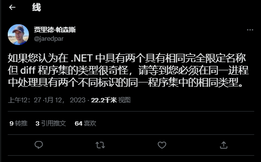

## 国内文章 

### 【ASP.NET Core】按用户等级授权

https://www.cnblogs.com/tcjiaan/p/17024363.html

本文介绍了ASP.NET Core如何按照用户等级进行授权。

### 在 C# 9 中使用 foreach 扩展

https://www.cnblogs.com/newbe36524/archive/2023/01/06/17018770.html

在 C# 9 中，foreach 循环可以使用扩展方法。在本文中，我们将通过例子回顾 C# 9 中如何扩展 foreach 循环。

### MassTransit 知多少 | 基于StateMachine实现Saga编排式分布式事务

https://www.cnblogs.com/sheng-jie/archive/2023/01/02/17019926.html

本文介绍了如何通过MassTransit实现saga编排式分布事务。

### 『 再看.NET7』让json序列化体现多态

https://mp.weixin.qq.com/s/L3-vkd2e3mLPcopjUTEzfg

从System.Text.Json诞生，就在努力增加功能和提升性能，在.NET7中，又带来了多态的适配。

### 『 再看.NET7』新的访问修饰符——file

https://mp.weixin.qq.com/s/sQQZuC2VLyvq8pNpfe6VJg

NET7到来时，C#11中添加了file访问修饰符。对，就是文件的意思，file是只能用来定义类型的访问修饰符，不能定义类型中的类成员，即使嵌套类也不可以。file是用来定义使用范围最小的类型访问修饰符，只限于在当前文件中，其他类型的成员内访问。

### 使用 .NET 标记游戏地图关键坐标点

https://mp.weixin.qq.com/s/-aUlTsI2IzbMNrq94OHVgQ

本文以天涯明月刀 OL 游戏的云上之城探索玩法为例，介绍如何使用 .NET 在游戏地图中标记大量关键坐标点。

### .NET性能优化-使用RecyclableMemoryStream替代MemoryStream

https://mp.weixin.qq.com/s/fnWo-TcxgC_jepkC2ZQUPQ

今天给大家带来的这个优化技巧其实就是池化MemoryStream的版本RecyclableMemoryStream，它通过池化MemoryStream底层buffer来降低内存占用率、GC暂停时间和GC次数达到提升性能目的。

### SqlServer 的主键索引真的是物理有序吗？

https://mp.weixin.qq.com/s/wU5L1hWItRuV90tUAlUBow

最近在看 SQL SERVER 2008 查询性能优化，书中说当一个表创建了聚集索引，那么表中的行会按照主键索引的顺序物理排列，这里有一个关键词叫：物理排列，如果不了解底层原理，真的会被忽悠过去，其实仔细想一想不可能实现严格的 物理排列 ，那对性能是非常大的损害，本篇我们就从底层出发聊一聊到底是怎么回事。

### SQLSERVER 居然也能调 C# 代码 ?

https://mp.weixin.qq.com/s/g-AmmPIeMsW7ja9pO-yzEg

前些天看到一个奇怪的 Function 函数，调用的是 C# 链接库中的一个 UserLogin 方法，这就让我产生了很大的兴趣，众所周知 SQLSERVER 是 C++ 写的，那这里的 C++ 怎么和 C# 打通呢？而且 C# 是一门托管语言，需要 JIT 将其 native 化，这个 JIT 又在哪里呢？带着这些疑问一起研究下吧。

## 主题
### 【英文】paint.net 5.0 正式发布!
https://forums.getpaint.net/topic/121643-paintnet-50-is-now-available/

Paint.NET 5.0已经发布。

这个版本包括对压力检测的支持，基于GPU的渲染和图像处理，一个新的效果插件系统和各种性能的提升和改进。

它现在也使用.NET 7构建，传统的C++/CLI代码已被[TerraFX.Interop.Windows](https://github.com/terrafx/terrafx.interop.windows)取代。 .

### 【英文】ReSharper 2023.1 路线图 | .NET工具博客
https://blog.jetbrains.com/dotnet/2023/01/10/resharper-2023-1-roadmap/

ReSharper 2023.1 路线图。

- 快捷方式方式修复
- 过渡到进程外模型
- 语法检查
    - 从内置拼写检查器迁移到JetBrains Grazie
- 单元测试自动化
- 本地化
    - 简体中文、日文、韩文
- UX/UI重新设计
- 其他
    - 网络开发
    - 更新对话

### 【英文】Rider 2023.1 路线图 | .NET工具博客
https://blog.jetbrains.com/dotnet/2023/01/10/rider-2023-1-roadmap/

Rider 2023.1的路线图。

- 配置同步插件
- 改进对Docker的支持
- 数据库模式比较
- 游戏开发
    - Unity
        - DOTS支持
    - 虚幻引擎
- 语法检查
    - 从内置拼写检查器迁移到JetBrains Grazie
- 杂项
    - UI
    - 新的用户界面调整
    - 本地化
        - 简体中文、日文、韩文

### 【英文】domaindrivendev/Swashbuckle.AspNetCore 发布v6.5.0版本
https://github.com/domaindrivendev/Swashbuckle.AspNetCore/releases/tag/v6.5.0

Swashbuckle.AspNetCore 6.5.0已经发布。

在这个版本中，.NET 7已经被添加到目标框架中，并且Swagger用户界面已经被更新。

### 【英文】grpc/grpc 发布v1.46.6版本
https://github.com/grpc/grpc/releases/tag/v1.46.6

gRPC 1.46.6（C-Core）已经发布。

该版本解决了zlib中的一个漏洞，并修复了几个bug。

### 【英文】fluentassertions/fluentassertions 发布v6.9.0版本
https://github.com/fluentassertions/fluentassertions/releases/tag/6.9.0

FluentAssertions 6.9.0已经发布。

增加了与TimeOnly相关的断言方法和对类型、方法等。

## 文章、幻灯片等。
### 【日文】[C#] 在DateTime中显示日本日历 - Qiita
https://qiita.com/ikuzak/items/b0fa005d267041890ed6

如何像R(2021)那样用日文字母格式化DateTime。

### 【日文】C#中的真正异步IO
https://zenn.dev/k_taro56/articles/csharp-true-async-io

关于是否使用FileStream的异步I/O，默认的`useAsync`设置为`false`，所以它不是异步I/O。

### 【英文】Entity Framework Core 7中的继承策略
https://medium.com/abp-community/inheritance-strategies-in-entity-framework-core-7-e0cfd42877a5

简要介绍一下EF 7中支持的TPC（Tables per Concrete Type），作为Entity Framework Core中存储继承模型的一种方式，以及EF 7之前支持的TPH和TPT。

### 【英文】SQLitePCLRaw和开源的可持续性
https://ericsink.com/entries/sqlitepclraw_sustainability.html

维护SQLitePCLRaw（SQLite的本地绑定）的现状、担忧和好处。

### 【英文】用C#和Pidgin解析模板语言| Zach on Code
https://zachoncode.dev/blog/parsing-template-language-with-csharp-and-pidgin/

描述了如何使用解析器库Pidgin实现模板语言。

### 【日文】ReactiveProperty v9.0.0的预发布版本出来了!
https://zenn.dev/okazuki/articles/reactiveproperty-v9-0-0-pre1

描述了ReactiveProperty v9.0.0预发布中的改进、重组和新类。

### 【英文】进程外ReSharper之路：异步类型化 | .NET工具博客
https://blog.jetbrains.com/dotnet/2023/01/05/resharper-out-of-process/

解释了我们在将ReSharper移至与Visual Studio分开的进程中（进程外）运行时遇到的障碍和正在做的事情。

### 【日文】[点播] .NET大会2022年回顾活动东京~微软日本社区活动之旅系列
https://info.microsoft.com/JA-ModApps-VDEO-FY23-12Dec-23-MKTO-FY23-dotnetconf-2022-Recap-Tokyo-Gated-video-SRGCM8691_LP01- 

.NET大会2022年回顾活动东京会议的会议视频，可按需观看。

- [议程（PDF）](https://www.microsoft.com/cms/api/am/binary/RE5c8Zg)

### 【日文】确定你是否不需要管理员权限就能在C#中写入文件夹 - Qiita
https://qiita.com/Alone-and-Slow/items/a2332bcb500051e19fbc

如何在Windows环境下检查你是否有对一个文件夹的写入权限。

### 【英文】测试 ASP.NET Core FastEndpoints | Khalid Abuhakmeh
https://khalidabuhakmeh.com/testing-aspnet-core-fastendpoints

对使用FastEndpoints（一个建立在ASP.NET Core上的框架）时的单元测试的解释。

### 【英文】在.NET 7中实现一个自定义配置提供者
https://medium.com/@gokerakce/implement-a-custom-configuration-provider-in-net-7-c0a195dcd05f

描述了如何在.NET 7中为Microsoft.Extensions.Configuration实现一个自定义配置提供者。

这篇文章实现了一个可以从SQL Server读取和重读数值的提供者。

### 【英文】如何为你的测试运行一次性数据库。 用Testcontainers提高你的集成测试准确性
https://blog.genezini.com/p/how-to-run-disposable-databases-for-your-tests.-improve-your-integration-tests-accuracy-with-testcontainers/

描述了如何使用Testcontainers为你的单元和集成测试运行一次性的数据库。

### 【英文】提高生产力的五个快捷键 - Visual Studio Blog
https://devblogs.microsoft.com/visualstudio/the-visual-studio-editor-can-do-that/

Visual Studio 提高生产力的五个快捷键

- <kbd>Ctrl</kbd>+<kbd>D</kbd>: 复制一行
- <kbd>Ctrl</kbd>+<kbd>Shift</kbd>+<kbd>L</kbd>: 删除整个行
- <kbd>Shift</kbd>+<kbd>Alt</kbd>+<kbd>.</kbd>: 选择下一个相同的词
- <kbd>Alt</kbd>+选择：方框（矩形）选择
- <kbd>Alt</kbd>+<kbd>Ctrl</kbd>+鼠标点击：插入多个光标

### 【英文】令人困惑的.NET调试器：代理对象
https://washi.dev/blog/posts/debugger-proxy-objects/

描述了一种通过插入代理对象来欺骗反编译器和相关调试器的技术。

### 【日文】[C# 12候选] lambda表达式的默认参数和params参数 | UFCPP博客
https://ufcpp.net/blog/2023/1/lambda-default/

关于在lambda表达式中允许默认参数和params参数的改进，这是C#12的一个候选功能。

### 【英文】Rider 2022.3中的语言注入改进｜The .NET Tools Blog
https://blog.jetbrains.com/dotnet/2023/01/12/language-injection-improvements-in-rider-2022-3/

对Rider 2022.3的语言注入改进的介绍。

支持原始字符串字面，支持字符串连接中的完成字符串，支持LanguageInjection属性，支持.NET 7中的StringSyntax属性，等等。

### 【英文】调试编码文本 - Visual Studio博客
https://devblogs.microsoft.com/visualstudio/debugging-encoded-text/

对最新的Visual Studio预览版中的调试器文本可视化器的介绍。

预览中的文本可视化器可以显示编码和解码Base64和URL的结果，以及解码JWT的结果。

### 【英文】从最小的API处理程序中提取元数据：最小的API的幕后 - 第二部分
https://andrewlock.net/behind-the-scenes-of-minimal-apis-2-extracting-metadata-from-a-minimal-api-handler/

解释了如何从作为处理程序传递给Minimal API端点的Delegate中提取元数据，以及如何创建RequestDelegate。

## 开源库、资料库、工具等

### 【英文】jellyfin/jellyfin: 自由软件媒体系统
https://github.com/jellyfin/jellyfin

一个建立在.NET上的媒体服务器，如Emby或Plex。

- [自由软件媒体系统|Jellyfin](https://jellyfin.org/)
- [FOSS聚焦：📺Jellyfin](https://dev.to/awsmfoss/foss-spotlight-jellyfin-452g)

### 【英文】JonPSmith/Net.LocalizeMessagesAndErrors: 这个库提供了额外的代码，使其更容易在你的.NET系统中支持不同的语言。掌握了这些信息后，我们就可以为客户提供服务了。
https://github.com/JonPSmith/Net.LocalizeMessagesAndErrors

属于.NET应用程序。

- [在.NET应用程序中改进对多语言的支持-改革的程序员](https://www.thereformedprogrammer.net/improving-the-support-of-multiple-languages-in-net-applications/)

### 【英文】LINQ Me Up
https://linqmeup.com/

使用AI将SQL SELECT语句转换为LINQ的工具。

## 网站，文件，等等
### 推文

---

**故事是这样的：C#有这么多的上下文关键字，你可以用看似保留字的标识符来定义东西，写出奇怪的代码。**

https://twitter.com/jaredpar/status/1613615815231934468?s=12

---

**在一些情况下，具有相同完全合格名称的同一个程序集在同一过程中被识别为不同的类型。 (例如，当AssemblyLoadContext不同时）。 这对大多数用户来说不是问题，但在Analyzer或Source Generator等情况下可能是个问题。**

https://twitter.com/jaredpar/status/1613211080918192133?s=12

## 深入研究
**【英文】重写Matrix3x2和Matrix4x4的实现方式 tannergooding - Pull Request #80091 - dotnet/runtime**

https://github.com/dotnet/runtime/pull/80091

## 版权声明

* 国内板块由 InCerry 进行整理 : https://github.com/InCerryGit/WeekRef.NET
* 其余内容来自 Myuki WeekRef，由InCerry翻译（已获得授权） : https://github.com/mayuki/WeekRef.NET

**由于笔者没有那么多时间对国内的一些文章进行整理，欢迎大家为《.NET周报-国内文章》板块进行贡献，需要推广自己的文章或者框架、开源项目可以下方的项目地址提交Issue或者在我的微信公众号私信。**

格式如下：

* 10~50字左右的标题
* 对应文章或项目网址访问链接
* 200字以内的简介，如果太长会影响阅读体验

https://github.com/InCerryGit/.NET-Weekly

## .NET性能优化交流群

相信大家在开发中经常会遇到一些性能问题，苦于没有有效的工具去发现性能瓶颈，或者是发现瓶颈以后不知道该如何优化。之前一直有读者朋友询问有没有技术交流群，但是由于各种原因一直都没创建，现在很高兴的在这里宣布，我创建了一个专门交流.NET性能优化经验的群组，主题包括但不限于：

* 如何找到.NET性能瓶颈，如使用APM、dotnet tools等工具
* .NET框架底层原理的实现，如垃圾回收器、JIT等等
* 如何编写高性能的.NET代码，哪些地方存在性能陷阱

希望能有更多志同道合朋友加入，分享一些工作中遇到的.NET性能问题和宝贵的性能分析优化经验。**目前一群已满，现在开放二群，可以直接扫码进入。**

如果提示已经达到200人，可以加我微信，我拉你进群: **ls1075**

另外也创建了**QQ群**，群号: 687779078，欢迎大家加入。

