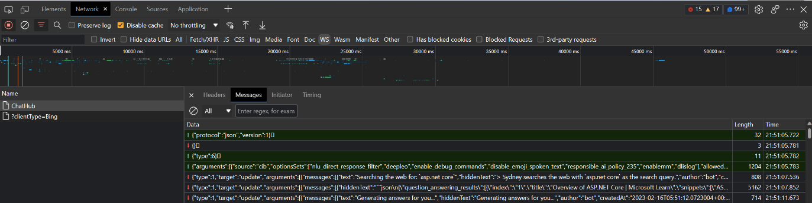
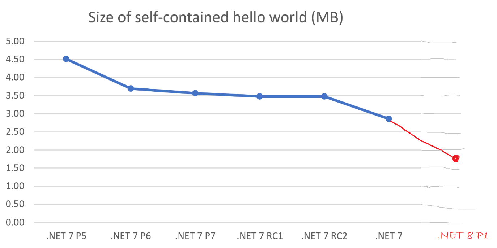

## 国内文章

### 2023 年.NET仓库社区年度调查已经开始

https://mp.weixin.qq.com/s/H9xUAO_yAdqm5CIHBs_eqA

中国地区是 .NET 的一个重要的市场和社区，有着众多的 .NET 开发者和爱好者。中国地区也有着很多优秀的 .NET 相关的项目和资源。这些项目和资源为中国地区的 .NET 开发者提供了很多学习和交流的机会和平台。为了更好地了解全球 .NET 开发者的情况和需求，并且为未来 .NET 的发展提供参考和建议，dotnet 官方特别推出了 dotnet 仓库社区生态调查。进入该链接，通过第一个 comment 便可以加入调查。

https://github.com/dotnet/runtime/issues/81866

### 记一次 .NET 某游戏网站 CPU爆高分析

https://www.cnblogs.com/huangxincheng/archive/2023/02/13/17115916.html

这段时间经常有朋友微信上问我这个`真实案例分析连载`怎么不往下续了，关注我的朋友应该知道，我近二个月在研究 SQLSERVER，也写了十多篇文章，为什么要研究这东西呢？ 是因为在 dump 中发现有不少的问题是 SQLSERVER 端产生的，比如：`遗留事务`，`索引缺失` ，这让我产生了非常大的兴趣，毕竟他们是一对黄金搭档。回到本话题上来，年前有位朋友找到我，说他的程序在业务高峰期的时候CPU一直居高不下，咨询一下是什么问题？ 按照老规矩，上 WinDbg 说话。

### 从 Newtonsoft.Json 迁移到 System.Text.Json

https://www.cnblogs.com/stulzq/archive/2023/02/14/17118904.html

System.Text.Json 是 .NET Core 3 及以上版本内置的 Json 序列化组件，刚推出的时候经常看到踩各种坑的吐槽，现在经过几个版本的迭代优化，提升了易用性，修复了各种问题，是时候考虑使用 System.Text.Json 了。本文将从**使用**层面来进行对比。

### .NET遍历二维数组-先行/先列哪个更快？

https://www.cnblogs.com/InCerry/p/dotNET-Traversing-Two-Dimensional-Array-Row-First-or-Column-First-Faster.html

上周在.NET性能优化群里面有一个很有意思的讨论，讨论的问题"二维数组，用C#先遍历行再遍历列，或者先遍历列再遍历行，两种方式在性能上有区别吗？"看了群里面激烈的讨论，刚好今天有时间，我们就来看看真实情况是怎么样的？实践出真知，我们编写一个Benchmark一测便知。

### 使用ML.NET做一个人脸检测

https://mp.weixin.qq.com/s/lqfH4nFTEkv1da9TjjW4Dw

介绍了如何使用ML.NET实现一个人脸检测的应用。

### ASP.NET Core 7.0 的新增功能你使用了吗?

https://mp.weixin.qq.com/s/7YuvMQbkvDb2y0MQw0NUGw

 .NET7在去年11月份发布，它属于短期支持版本，尽管如此，也新增加了比较多的功能功能改进，包括ASP.NET Core 7.0等模块也有较大的改进，你目前用过几个新特性呢？本文将从6个方面来简单介绍ASP.NET Core 7.0的新增功能和改进。

### WPF跨平台方案？

https://mp.weixin.qq.com/s/n2mAkF8_4kWKqsBsvxv79A

**Avalonia XPF**[1] 通过我们的跨平台UI框架，释放现有WPF应用程序的全部潜力，使WPF应用程序能够在macOS和Linux上运行，而不需要昂贵和有风险的重写。

### 关于C#方法中引用类型参数传递

https://mp.weixin.qq.com/s/soNkJ7hpg3z4CspP9iXRZA

本文叙述的问题的根源在于对C#基础知识掌握不牢固，从而在遇到难以理解的问题时浪费了大量时间；在此也警示自己，该啃啃基础书籍了！话不多说，先上代码。

### 我不想再传递 nameof 了

https://mp.weixin.qq.com/s/iDq51PY78vZJEItJL-0TWQ

有的时候抛出一个异常，我们需要知道是哪个方法抛出的异常。那么，我们可以通过传递 nameof 来获取调用者的方法名。但是，感觉很烦，每次都要传递 nameof。那么，有没有更好的方法呢？

### .NET 8 Preview 1 即将发布

https://mp.weixin.qq.com/s/qwPwcawvYcJ7WZbOS-JRCw

.Net 8 Preview 1 即将到来，让我们来提前看看都要发布什么吧。

## 主题

### 【英文】Avalonia UI - XPF
https://avaloniaui.net/XPF

跨平台的商业解决方案，用于在非Windows环境下运行现有的WPF应用程序，如Linux和macOS。本产品提供了与.NET 6兼容的库，可以在Linux和macOS上运行WPF应用程序，而不需要重写它们。 第三方组件也被支持。与Avalonia UI不同，它只在商业许可下提供，因为它被定位为一个面向企业的解决方案。

### 【英文】Rider 2023.1 EAP 4 来了! | .NET工具博客
https://blog.jetbrains.com/dotnet/2023/02/13/rider-2023-1-eap-4/

Rider 2023.1 EAP 4已经发布。

它包括一些改进，如IDE缩放支持、WASM应用程序启动的调试、额外的Astro支持、改进的Angular支持和Vue模板中的TypeScript支持。

### 【英文】ReSharper 2023.1 EAP 5 来了! | .NET工具博客
https://blog.jetbrains.com/dotnet/2023/02/17/resharper-2023-1-eap-5/

ReSharper 2023.1 EAP 5已经发布。

这个版本包括对不活跃的预处理器分支的重新格式化、改进的重命名重构以及对macOS、Linux x64和ARM64上独立dotTrace的支持。

### 【英文】在NuGet.org上如何按目标框架搜索

https://devblogs.microsoft.com/nuget/introducing-search-by-target-framework-on-nuget-org/

现在NuGet.org上的搜索可以通过目标框架来缩小范围。

如果选择".NET"，目标框架是net5.0到net7.0，必要时还可以缩小到net7.0，以此类推。 当指定net7.0时，NET 7运行时支持，但不管它是否包含在库的`TargetFrameworks`中。

### 【中文】在装有Apple® M1®和M2™芯片的Mac®电脑上使用Windows 11的选项 - 微软支持
https://support.microsoft.com/zh-cn/windows/%E7%94%A8%E4%BA%8E%E5%B0%86windows-11%E4%B8%8E%E5%85%B7%E6%9C%89-apple-m1-%E5%92%8C-m2-%E8%8A%AF%E7%89%87%E7%9A%84-mac-%E8%AE%A1%E7%AE%97%E6%9C%BA%E9%85%8D%E5%90%88%E4%BD%BF%E7%94%A8%E7%9A%84%E9%80%89%E9%A1%B9-cd15fd62-9b34-4b78-b0bc-121baa3c568c

Microsoft 正式批准了 Parallels Desktop for Mac 上的 Windows 11 Pro 和 Enterprise for Arm。

不支持 WSL、Windows Subsystem for Android、Windows Sandbox 以及依赖嵌套虚拟化的虚拟化安全。 运行32位Arm应用程序也不被支持（这在Windows中也被废弃）。

- [使用 Parallels Desktop for Mac 在 Arm 上运行 Windows 11](https://www.parallels.com/blogs/windows-11-arm-apple-m-series/)

## 文章、幻灯片

### 【日文】ReactiveProperty v9.0.0已经发布!

https://zenn.dev/microsoft/articles/reactiveproperty-v9-0-0

ReactiveProperty v9.0.0已经发布。

它提高了性能，扩大了独立于System.Reactive的开发范围，并增加了ReactiveCommandSlim, ValidatableReactiveProperty&lt;T>等类。

### 【日文】C#通过类型来限制对象是否可以被销毁 - 铃铛为猫响

https://ikorin2.hatenablog.jp/entry/2023/02/13/072121

关于如何通过创建一个可以明确说明对象是否可以被销毁的类型来明确销毁对象的责任所在。

### 【日文】[.NET 7] P/Invoke的陷阱备忘录

https://zenn.dev/shimat/articles/77c00c1f421a47

关于P/Invoke的隐患，如幕后处理导致的开放。

### 【日文】C# 12候选特性`params Span` 修订后`params ReadOnlySpan`

https://ufcpp.net/blog/2023/2/params-ros

正在考虑在C# 12中接受非数组的params（可变长度的参数）的规范的现状。

### 【英文】省略async / await

https://guriysamarin.medium.com/omitting-async-await-723a04d8f56b

关于省略async/await并直接返回Task的做法不被推荐。

堆栈痕迹和AsyncLocal泄露的差异。 (顺便说一下，也有通过使用错误处置的常见例子)。

### 【英文】使用ASP.NET Core和React与Vite.js

https://blog.codeinside.eu/2023/02/11/aspnet-core-react-with-vitejs/

如何在ASP.NET Core应用程序中使用React和Vite.js。

### 【日文】[C#] 使用GetTypesByMetadataName而不是GetTypeByMetadataName可能更安全 - 尼诺的花园

https://blog.neno.dev/entry/2023/02/11/161723

当你在Roslyn中使用`GetTypeByMetadataName`从编译中通过元数据名称获得类型时，从Roslyn 4.1开始最好使用`GetTypesByMetadataName`，因为如果你使用`GetTypeByMetadataName`通过元数据名称获得一个类型，将不会得到预期的相同名称。 下面是对此的简要解释。

### 【英文】Visual Studio AI-Assistance: 开发者的好朋友 - Visual Studio Blog

https://devblogs.microsoft.com/visualstudio/visual-studio-ai-assistance-a-developers-best-friend/

介绍一下Visual Studio中的IntelliCode的作用。

### 【英文】在C#中确定两个日期范围是否重叠 - 代码迷宫

https://code-maze.com/csharp-determine-whether-two-date-ranges-overlap/

如何比较两个日期范围的重叠情况。

### 【英文】.NET中的Consul - 一个服务网状结构解决方案和服务发现工具

https://medium.com/@KeivanDamirchi/consul-in-net-a-service-mesh-solution-and-service-discovery-tool-eff18292c771

如何使用HashiCorp Consul in .NET实现服务网格和服务发现？

### 【英文】将Xamarin.iOS和Xamarin.Android升级到.NET for iOS和Android的技巧和窍门 - Xamarin博客

https://devblogs.microsoft.com/xamarin/upgrade-xamarin-ios-android-to-dotnet6-dotnet7/

从Xamarin.iOS和Xamarin.Android升级到.NET for iOS &amp; Android（本地绑定，不是.NET MAUI）的技巧。

### 【英文】什么是.NET，以及为什么要选择它？

https://devblogs.microsoft.com/dotnet/why-dotnet/

关于什么是.NET以及为什么你应该选择它的文章，重点是为开发人员提供的.NET运行时间。

- [关于 "什么是.NET，为什么要选择它？"的思考](https://andrewlock.net/thoughts-on-what-is-dotnet-and-why-should-you-choose-it/)

### 【日文】NuGet软件包版本依赖性解析规则 - Qiita

https://qiita.com/ZiYuCai1984/items/dbb069f5ade08d242acb

关于引用NuGet包时的版本解析规则。

### 【英文】入门：Entity Framework Core 7 JSON支持 | The .NET Tools Blog

https://blog.jetbrains.com/dotnet/2023/02/14/getting-started-entity-framework-core-7-json-support/

如何使用Entity Framework Core 7中添加的JSON支持。

### 【英文】使用编译查询加速EF Core

https://woodruff.dev/accelerating-ef-core-with-compiled-queries/

关于Entity Framework Core的编译查询。

### 【日文】使用.NET Blazor + Radzen - Qiita

https://qiita.com/tinymouse/items/01b1bc4a74429ddc0b17

关于使用Radzen，一个用于Blazor的UI组件库。

## 网站、文件
### 推文

https://twitter.com/davidfowl/status/1626097506286436352

**New Bing的AI聊天功能是使用SignalR实现的。**

---

https://twitter.com/MStrehovsky/status/1625702785516994565

**.NET NativeAOT 大小的进化史，从.NET7 Preview5创建Hello World程序需要4.5MB到现在.NET8 Preview 1只需要1.7MB。**

## 深入探索
### Blazor United · Issue #46636 · dotnet/aspnetcore
https://github.com/dotnet/aspnetcore/issues/46636

.NET 8中Blazor United的问题。

## 版权声明

* 国内板块由 InCerry 进行整理 : https://github.com/InCerryGit/WeekRef.NET
* 其余内容来自 Myuki WeekRef，由InCerry翻译（已获得授权） : https://github.com/mayuki/WeekRef.NET

**由于笔者没有那么多时间对国内的一些文章进行整理，欢迎大家为《.NET周报-国内文章》板块进行贡献，需要推广自己的文章或者框架、开源项目可以下方的项目地址提交Issue或者在我的微信公众号私信。**

格式如下：

* 10~50字左右的标题
* 对应文章或项目网址访问链接
* 200字以内的简介，如果太长会影响阅读体验

https://github.com/InCerryGit/.NET-Weekly

## .NET性能优化交流群

相信大家在开发中经常会遇到一些性能问题，苦于没有有效的工具去发现性能瓶颈，或者是发现瓶颈以后不知道该如何优化。之前一直有读者朋友询问有没有技术交流群，但是由于各种原因一直都没创建，现在很高兴的在这里宣布，我创建了一个专门交流.NET性能优化经验的群组，主题包括但不限于：

* 如何找到.NET性能瓶颈，如使用APM、dotnet tools等工具
* .NET框架底层原理的实现，如垃圾回收器、JIT等等
* 如何编写高性能的.NET代码，哪些地方存在性能陷阱

希望能有更多志同道合朋友加入，分享一些工作中遇到的.NET性能问题和宝贵的性能分析优化经验。**目前一群已满，现在开放二群。**

如果提示已经达到200人，可以加我微信，我拉你进群: **ls1075**

另外也创建了**QQ群**，群号: 687779078，欢迎大家加入。