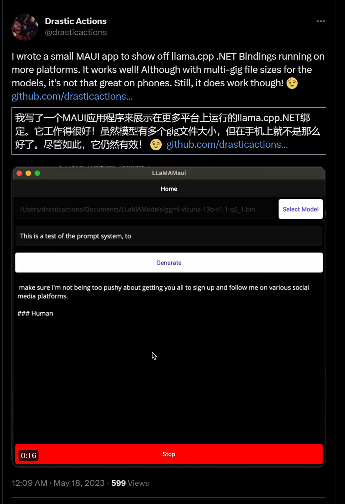
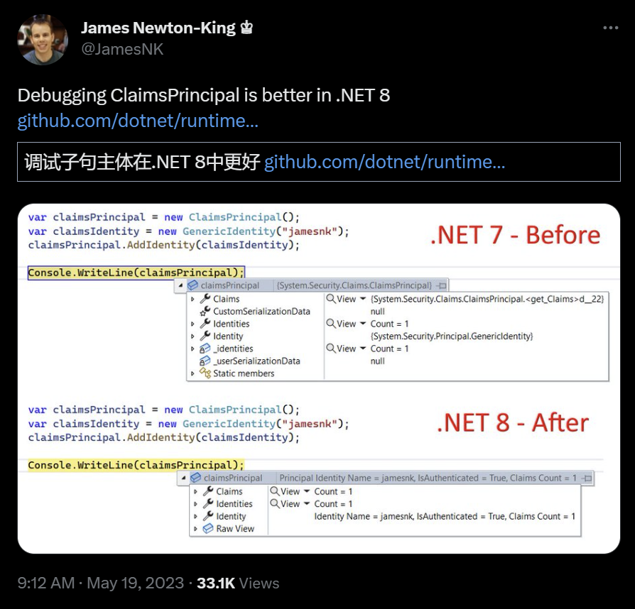
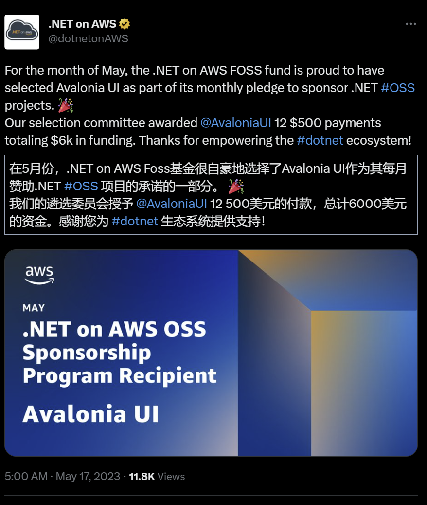
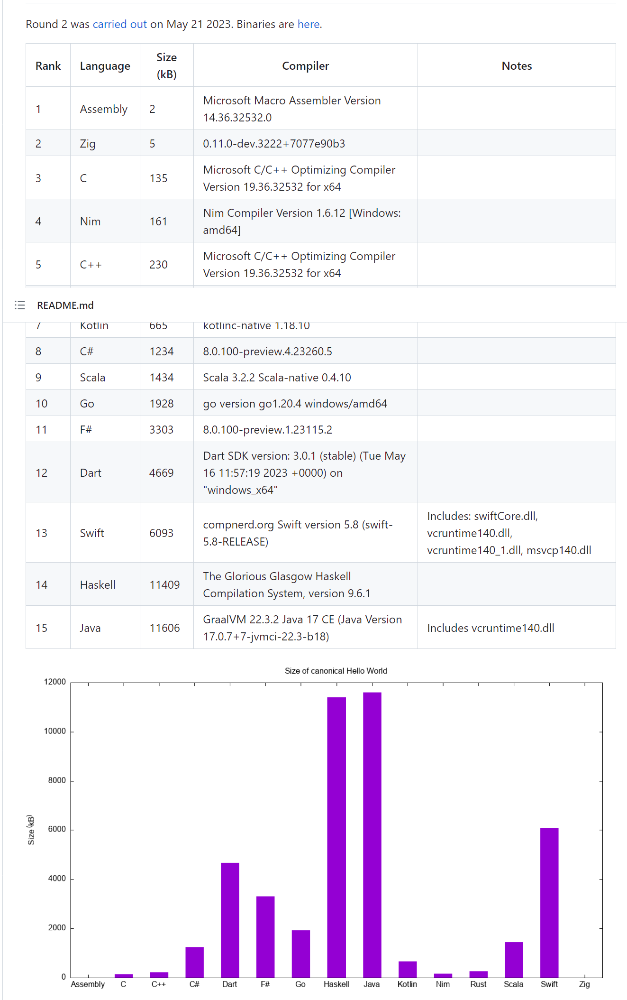
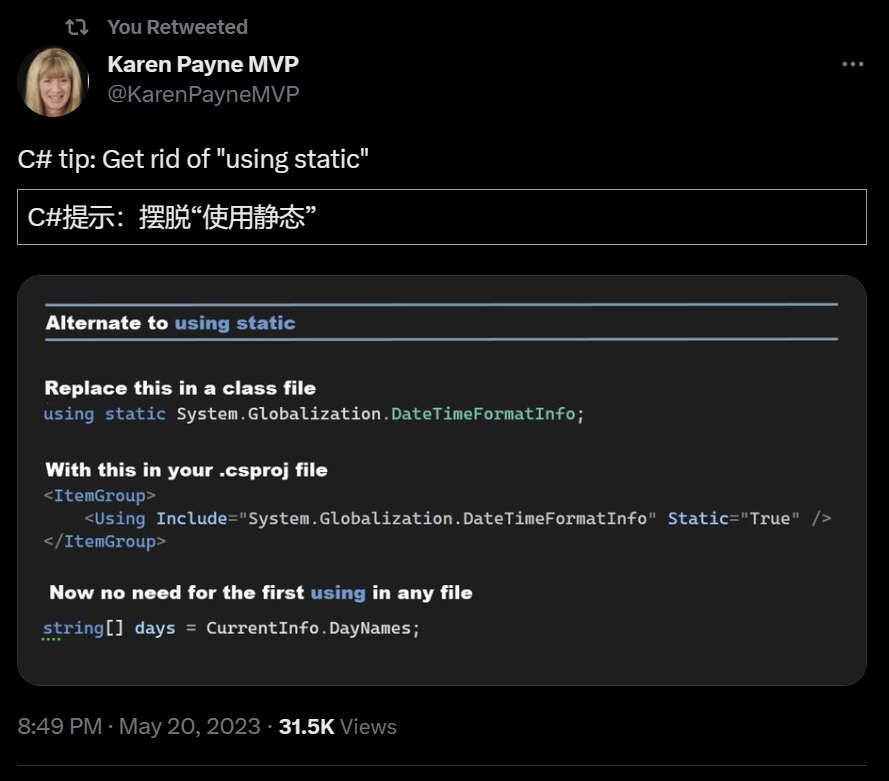
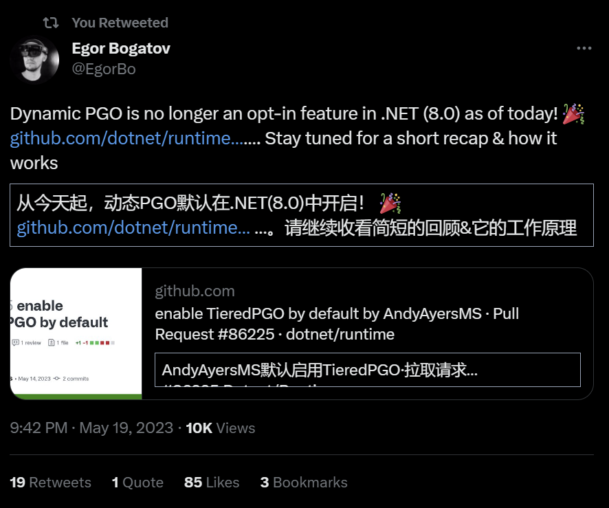
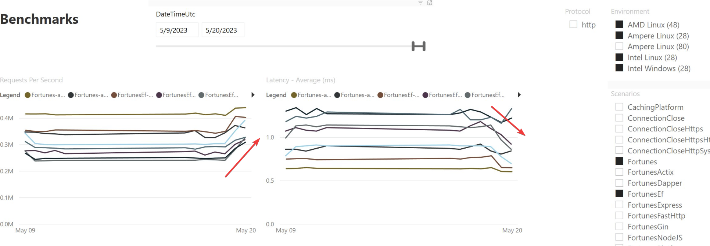
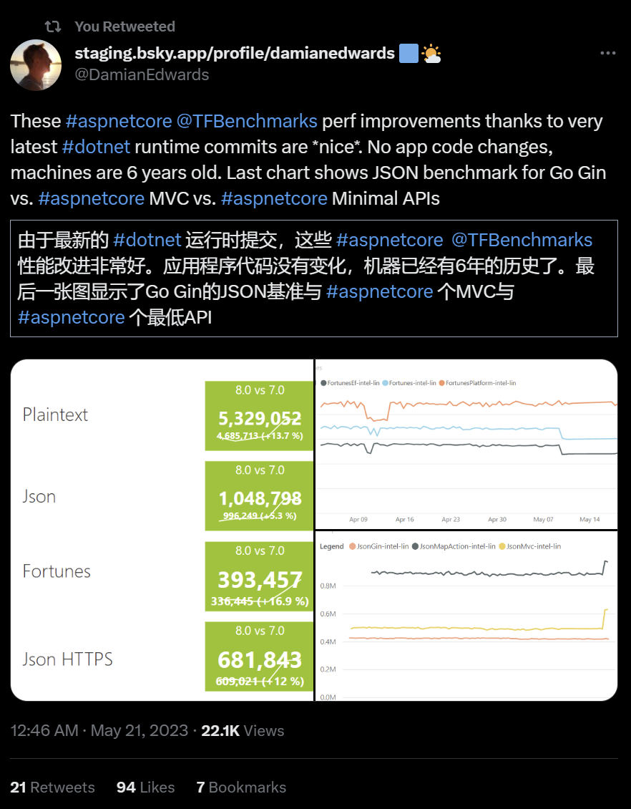

## 国内文章

### C# 实现 Linux 视频会议（源码，支持信创环境，银河麒麟，统信UOS）

https://www.cnblogs.com/shawshank/p/17390248.html

信创是现阶段国家发展的重要战略之一，面对这一趋势，所有的软件应用只有支持信创国产化的基础软硬件设施，在未来才不会被淘汰。那么，如何可以使用C#来实现支持信创环境的视频会议系统吗？答案是肯定的。

本文讲述如何使用C#来实现视频会议系统的Linux服务端与Linux客户端，并让其支持国产操作系统（如银河麒麟，统信UOS）和国产CPU（如鲲鹏、龙芯、海光、兆芯、飞腾等）。 

###  [MAUI】在.NET MAUI中复刻苹果Cover Flow

https://www.cnblogs.com/jevonsflash/p/17419483.html

这篇文章介绍了Cover Flow，它是iTunes和Finder中的一个视图选项，允许用户使用水平滚动的图像查看他们的音乐库或文件。文章详细介绍了Cover Flow的交互设计和实现原理，以及如何使用.NET MAUI实现跨平台支持。Cover Flow的核心算法是对专辑图片进行3D变换（3DTransform），在Skia中，3D变换是通过矩阵乘法实现的。文章还介绍了视图元素的3D变换（3DTransform）中，以视图元素的Y或X轴作为旋转中心做旋转，称之为3D旋转。最后，文章提到了Skia 本身是一个开源图形库，它提供适用于各种语言和硬件平台的通用 API，根据本博文提到的算法，你可以用Skia尝试在你擅长的平台上实现相同的效果。

### 在Winform中一分钟入门使用好看性能还好的Blazor Hybrid

https://www.cnblogs.com/hejiale010426/p/17419290.html

这篇文章介绍了如何使用Masa Blazor组件库，通过创建 ServiceCollection ，用于注册服务，在和BlazorWebView进行绑定，将指定的html和BlazorWebView绑定以后在对于html内的id为 app 的元素进行Blazor组件的绑定绑定到Blazor组件的 App 组件中。文章详细介绍了Masa Blazor组件库的使用方法，包括如何在Winform的MainFrom的文件中创建 ServiceCollection ，用于注册服务，在和BlazorWebView进行绑定，将指定的html和BlazorWebView绑定以后在对于html内的id为 app 的元素进行Blazor组件的绑定绑定到Blazor组件的 App 组件中；以及如何在 MApp 中使用 Masa Blazor 的组件，所有 Masa Blazor 的组件都必须在 MApp 中使用。

### 【源码解读】asp.net core源码启动流程精细解读

https://www.cnblogs.com/1996-Chinese-Chen/p/17417300.html

自从ASP.NET Core发布至今已7年，我接触了4年并一直关注源码。尽管主要使用Winform，但始终积极参与QQ群讨论。几年前曾计划解读ASP.NET Core源码，但因篇幅有限，未能详述。上月底决定以直播形式讲解源码，于5月18日在微信直播和哔哩哔哩录制。由于不熟悉直播及源码众多，节奏欠佳，导致观众较少，为此道歉。之后总结直播内容并补充原计划未说之话，包括直播总结、开发者提升认知与逻辑思维能力的建议。现已完成整理ASP.NET Core源码解读文档，希望对大家有所帮助。

### C#中BitConverter.ToUInt16、BitConverter.ToUInt32原理与用法详解

https://www.cnblogs.com/event/p/17414103.html

如题，该文章讨论了C#中BitConverter.ToUInt16、BitConverter.ToUInt32原理与用法详解。

### 一个.Net开发的功能强大、易于使用的流媒体服务器和管理系统

https://www.cnblogs.com/chingho/p/17393098.html

这是基于.Net Core开发的，跨平台的开源项目；支持多种音视频格式，如MP3、MP4、AVI、WMV、FLV等；支持本地管理与远程管理，让管理员可以轻松的管理视频资源。

而且该项目还提供多平台的客户端，支持Web、桌面、Liunx、安卓、苹果等平台的客户端，让用户可以随时随地观看视频。

### 记一次 Visual Studio 2022 卡死分析

https://www.cnblogs.com/huangxincheng/p/17412584.html

最近不知道咋了，各种程序有问题都寻上我了，你说 .NET 程序有问题找我能理解，Windows 崩溃找我，我也可以试试看，毕竟对 Windows 内核也知道一丢丢，那 Visual Studio 有问题找我就说不过去了，但又不好拒绝，就让朋友发下卡死的 dump 我看一看。

### 原来.NET写的Linux桌面这么好看？

https://www.cnblogs.com/hejiale010426/p/17410664.html

本文将讲解如何使用`Blazor`运行跨平台应用，应用到的技术有以下几点

- [Blazor](https://learn.microsoft.com/zh-cn/aspnet/core/blazor/?WT.mc_id=dotnet-35129-website&view=aspnetcore-7.0)
- [Masa Blazor](https://docs.masastack.com/blazor/getting-started/installation)
- [Photino.Blazor](https://github.com/tryphotino/photino.Blazor)
- Ubuntu

用于验证跨平台性，并且是否提高开发效率，Blazor和Photino一块使用的技术称为`Blazor Hybrid`。

### .NET通过源码深究依赖注入原理

https://www.cnblogs.com/Z7TS/p/17402544.html

依赖注入 (DI) 是.NET中一个非常重要的软件设计模式，它可以帮助我们更好地管理和组织组件，提高代码的可读性，扩展性和可测试性。在日常工作中，我们一定遇见过这些问题或者疑惑。

1. Singleton服务为什么不能依赖Scoped服务？
2. 多个构造函数的选择机制？
3. 源码是如何识别循环依赖的？

虽然我们可能已经知道了答案，但本文将通过阅读CLR源码的方式来学习DI实现机制,同时也更加深入地理解上述问题。如果您不想阅读源码，可以直接跳至文末的解决方案。

### C# 中的“智能枚举”：如何在枚举中增加行为

https://www.cnblogs.com/liqingwen/p/17407424.html

- 枚举的基本用法回顾
- 枚举常见的设计模式运用
  - 介绍
- 智能枚举
  - 代码示例
  - 业务应用
- 小结

### 记一次 .NET 某医院门诊软件 卡死分析

https://www.cnblogs.com/huangxincheng/p/17401330.html

前几天有位朋友找到我，说他们的软件在客户那边卡死了，让我帮忙看下是怎么回事？我就让朋友在程序卡死的时候通过 `任务管理器` 抓一个 dump 下来，虽然默认抓的是 wow64 ，不过用 `soswow64.dll` 转还是可以的.

### 常用设计模式之.Net示例代码合集

https://www.cnblogs.com/chingho/p/17237462.html

每一次初学者粉丝朋友，在后台向我咨询编程问题，我除了给他们指导学习路线，我都会建议他们学完基础知识后，**一定要要注重编程规范，学习设计模式，修炼内功。**

虽然说很多程序员，他们日常主要工作是CRUD，但是学习设计模式也是有助于学习公司的框架，另外设计模式是为了可重用代码、让代码更容易被他人理解、保证代码可靠性，所以学习设计模式对提升编程能力还是很有帮助的。

所以，今天给大家分享一个采用C#编写的，常用设计模式源码合集。

## 主题

### 【英文】Visual Studio 2022 - 17.6 现已可用 - Visual Studio 博客
https://devblogs.microsoft.com/visualstudio/visual-studio-2022-17-6-now-available/

Visual Studio 2022 版本 17.6 已经发布。

- 提高生产力
    - 改进的性能
        - 提高打开和关闭解决方案的速度
        - 改进了性能分析器收集停止速度
    - 增强编辑器
        - 粘性卷轴
        - 多合一搜索
        - 括号对着色
        - 拼写检查器
    - 调试和诊断功能
        - 断点组
        - .NET远程调试
        - Visual Studio 探查器
        - Visual Studio Profiler 中的检测
    - Git 协作工具
        - 改进的合并对话框
        - Git 行取消暂存
        - 链接到 GitHub 问题
- 构建现代 .NET 和云原生应用程序
  
    - Android 清单编辑器
    
    - JavaScript/TypeScript 中的 CodeLens
    - JavaScript/TypeScript 语法高亮显示
    - ASP.NET Core Web API 开发
- 高效的游戏开发
    - 虚幻引擎日志查看器
    - Tim Jones 的 HLSL 工具扩展
- 引入 C++ 跨平台代码库
  
    - CMake调试器
    
    - z/用于 Unix 的远程文件资源管理器
    - 导入STM32CubeIDE工程
    - Vcpkg
- 企业管理
    - 在组织的 Intranet 网站上托管和部署 Visual Studio 布局
    - 支持存储库中任何位置的多个 .vsconfig

### 【英文】宣布 .NET 8 预览版 4 - .NET 博客
https://devblogs.microsoft.com/dotnet/announcing-dotnet-8-preview-4/

- MSBuild：新的现代终端构建输出
- MSBuild：新的现代终端构建输出
- SDK：更新输出路径简化
    - 人工制品
- 模板引擎：来自 Nuget.org 的包的安全体验
- NuGet：在 Linux 上验证签名包
- NuGet：审计安全漏洞的包依赖
- 库：改进的 UTF-8 支持
    - IUtf8SpanFormattable
- 引入时间抽象
    - TimeProvider
- System.Runtime.Intrinsics.Vector512 和 AVX-512
- 改进的原生 AOT
- Linux发行版支持
- System.Text.Json：收集只读成员
- 改进的 System.Text.Json
    - JsonSerializer.IsReflectionEnabledByDefault
    - JsonSerializerOptions.TypeInfoResolverChain
    - JsonSerializerOptions.TryGetTypeInfo
- 代码生成
    - 连续寄存器分配
    - 优化 ThreadStatic 字段访问
    - Arm64
    - 矢量化代码

### 【英文】EF Core 8 预览版 4：原始集合和改进的包含 - .NET 博客
https://devblogs.microsoft.com/dotnet/announcing-ef8-preview-4/

Entity Framework Core 8 Preview 4 已经发布。

此版本包括支持在 LINQ 中转换 Contains、支持 OPENJSON、指定目标 SQL Server 的兼容级别、对原始集合的列支持等。

### 【英文】.NET 8 Preview 4 中的 ASP.NET Core 更新 - .NET 博客
https://devblogs.microsoft.com/dotnet/asp-net-core-updates-in-dotnet-8-preview-4/

.NET 8 Preview 4 中对 ASP.NET Core 的更新。

-Blazor
    - Blazor 组件的流式渲染
    - 处理 Blazor SSR 表单提交
    - 路由到 Blazor 中的命名元素
    - 用于 Blazor WebAssembly 应用程序的 Webcli 打包
- API创作
    - 扩展了对最小 API 中表单绑定的支持
    - 带有 .http 文件的 API 项目模板
    - 原生AOT
    - 使用编译时生成的最小 API 进行日志记录和异常处理
    - 修剪 ASP.NET Core 顶级 API 中的警告注释
    - 通过可配置的 HTTPS 支持减少应用程序大小
    - 更新工人服务模板
    - 添加在 slim builder 中配置的默认服务
    - 更改 API 模板 JSON 配置
    - 对编译器生成的 IAsyncEnumerable 特殊类型的 JSON 序列化支持- 身份验证和授权
    - 身份 API 端点
    - 更好地支持 IAuthorizationRequirementData 中的自定义授权策略
- ASP.NET 核心指标

### 【英文】Rx.NET v6.0 现已可用 
https://endjin.com/blog/2023/05/rx-dotnet-v6-released

Rx.NET v6.0 已经发布。

此版本包括 .NET 6/7 支持、修整支持、使用 snupkg 提供符号以及其他改进。

本文包括对 Async Rx.NET alpha 的介绍、v6.0 中的更新以及未来的发展。

### 【英文】Visual Studio 2022 17.7 预览版 1 已发布！- Visual Studio 博客
https://devblogs.microsoft.com/visualstudio/visual-studio-2022-17-7-preview-1-is-here/

Visual Studio 2022 版本 17.7 Preview 1 已经发布。

- 生产力
    - 比较文件
    - 改进的多分支图和 Git 存储库
    - 复制文本并删除缩进
    - 增强的多合一搜索
- .NET 和云开发
    - 对 .NET 6 和 .NET Standard 的 IntelliTest 支持
    - 将 Blazor WebAssembly 发布到 Azure 静态 Web 应用
- C++ 和游戏开发
    - 虚幻引擎 C++ 宏格式
    - 虚幻引擎 C++ 命名约定检查器

### 【英文】Hot Reload 支持修改泛型！ - .NET 博客
https://devblogs.microsoft.com/dotnet/hot-reload-generics/

在更改泛型代码时讨论 .NET 8 对热重载的支持。

现在在以下场景中支持热重载：

- 向（非）泛型类型添加新的（静态、实例）方法
- 向（非）泛型类型添加新的（静态、实例）泛型方法
- 编辑（非）通用类型的现有（静态，实例）方法
- 编辑（非）通用类型的现有（静态，实例）通用方法

### 【英文】使用 System.ServiceModel 6.0 调用 WCF/CoreWCF 的客户端支持就在这里！ - .NET 博客
https://devblogs.microsoft.com/dotnet/wcf-client-60-has-been-released/

发布 System.ServiceModel 6.0，这是一个调用 WCF/CoreWCF 的 WCF 客户端。

System.ServiceModel 是 Microsoft 支持的 WCF 客户端库。

此版本包括添加 NetNamedPipe 支持、删除 .NET Standard 和 .NET Framework 支持以及弃用 System.ServiceModel.Duplex 和安全性的更新。
### 【英文】ReSharper 和 Rider 2023.1.2 – 发布了更多错误修复 | .NET 工具博客
https://blog.jetbrains.com/dotnet/2023/05/17/rsrp-and-rider-2023-1-2-bug-fixes/

ReSharper 和 Rider 2023.1.2 发布。

此版本修复了各种错误。

### 【英文】Xamarin.Forms 和 Essentials 现在以 Android 13（预览版）为目标 - Xamarin 博客
https://devblogs.microsoft.com/xamarin/xamarin-forms-essentials-target-android13-preview/

Xamarin.Forms 和 Essentials 现在可以面向 Android 13（预览版）。

.NET 和 .NET MAUI 已经支持 Android 13。

### 【英文】在 Build 2023 上为 Visual Studio 做好准备：加入数以万计的在线人群！- Visual Studio 博客
https://devblogs.microsoft.com/visualstudio/get-ready-for-visual-studio-at-build-2023-join-tens-of-thousands-online/

在 5 月 23 日至 25 日的 Microsoft Build 2023 上介绍与 Visual Studio 相关的会议。

## 文章、幻灯片等

### 【英文】ML.NET 模型生成器中的对象检测 - .NET 博客
https://devblogs.microsoft.com/dotnet/object-detection-ml-dotnet-model-builder/

使用 ML.NET 模型生成器进行对象检测的介绍。

### 【英文】.NET 中的 ChatGPT 入门 - .NET 博客
https://devblogs.microsoft.com/dotnet/get-started-chatgpt-azure-dotnet/

使用 .NET 中的 OpenAI API 的系列。 ChatGPT（聊天和提示）的描述。

### 【英文】Sticky Scroll：保持在正确的上下文中 - Visual Studio 博客
https://devblogs.microsoft.com/visualstudio/sticky-scroll-stay-in-the-right-context/

介绍 Visual Studio 2022 17.6 中添加的粘性滚动功能。

### 【英文】在 .NET MAUI 上从零开始的日历控件
https://dev.to/serhii_korol_ab7776c50dba/calendar-control-from-scratch-on-net-maui-5dh6

一篇关于使用 .NET MAUI 从头开始​​创建日历控件的文章。

### 【英文】使用 Octokit.GraphQL 与 GitHub 讨论 API 交互
https://andrewlock.net/using-octokit-graphql-to-interact-with-the-github-discussions-api/

如何使用 Octokit.GraphQL NuGet 包的 GitHub 讨论中的 API。

本文介绍了如何获取和创建讨论、速率限制等。

### 【英文】AWS 无服务器解决方案的集成测试
https://dev.to/ohalay/integration-tests-for-aws-serverless-solution-12aj

如何在 AWS 无服务器配置中集成测试您的应用程序。

它介绍了如何通过使用 LocalStack 运行本地容器来运行单元测试。

### 【英文】如何从外部应用程序控制 Visual Studio - Gérald Barré
https://www.meziantou.net/control-visual-studio-from-an-external-application.htm

如何通过 COM 获取和操作 Visual Studio 实例。

### 【英文】编译查询在 C# EF Core 上真的有效吗？
https://goatreview.com/are-compiled-queries-efficient-efcore/

关于 Entity Framework Core 的编译查询是否有效。

编译查询对某些模式有效，但有许多模式无效，因此我们建议在使用之前测试和检查查询本身。

### 【英文】.NET 8 中的并发托管服务启动和停止 - Steve Gordon - Code with Steve
https://www.stevejgordon.co.uk/concurrent-hosted-service-start-and-stop-in-dotnet-8

.NET 8 的 Microsoft.Extensions.Hosting 并行启动和停止主机。

本文解释了并行化启动和停止的影响以及如何禁用并行化。

### 【日文】从 .NET NuGet 包自动将全局使用添加到您的应用程序
https://zenn.dev/nuits_jp/articles/2023-05-15-global-usings

如何创建在安装时自动添加全局使用的 NuGet 包。

### 【英文】Microsoft Build | 云技能挑战
https://www.microsoft.com/en-US/cloudskillschallenge/build/officialrules/2022

活动与 Build 2023 保持一致。完成挑战后，您将有权参加一次免费的 Microsoft 认证考试。

## 库、存储库、工具等。
### drasticactions/LLaMAMaui
https://github.com/drasticactions/llamamaui

llama.cpp 中 .NET MAUI 的绑定。

https://twitter.com/drasticactions/status/1658867229637898240?s=12

## 站点、文档等
### 【英文】简介 - 面向 C#/.NET 开发人员的 Rust 文档
https://microsoft.github.io/rust-for-dotnet-devs/latest/

面向 C#/.NET 开发人员的 Rust 文档。

它解释了 .NET 中的事物如何在 Rust 中表示。

- [microsoft/rust-for-dotnet-devs：C#/.NET 开发人员的 Rust](https://github.com/microsoft/rust-for-dotnet-devs)

### 推文

**ClaimsPrincipal 调试器上的显示变得更好的故事。还支持其他 ASP.NET Core 类型。**

- [ASP.NET Core ❤️ 调试问题 #48205 dotnet/aspnetcore](https://github.com/dotnet/aspnetcore/issues/48205)

https://twitter.com/jamesnk/status/1659366431920898049?s=12

---

**AWS FOSS 基金赞助了 Avalonia UI。**

https://twitter.com/dotnetaws/status/1658578068762394625?s=12

---

**这个repo由一组规范的多种语言的Hello World静态编译（AOT）的程序和一个GitHub操作组成，该操作对它们进行编译并汇总大小信息。**

https://twitter.com/MStrehovsky/status/1660256662975029248

---

https://twitter.com/KarenPayneMVP/status/1659904138858360832

---

https://twitter.com/EgorBo/status/1659555222677585922

---

https://twitter.com/DamianEdwards/status/1659963802400731141

## 深入探索

### .NET 8.0 Preview 3 和 .NET 8 Preview 4 之间的 API 差异 by carlossanlop Pull Request #8469 dotnet/core
https://github.com/dotnet/core/pull/8469 .NET 8 Preview 3 到 4 API的区别

## 版权声明

* 国内板块由 InCerry 进行整理 : https://github.com/InCerryGit/WeekRef.NET
* 其余内容来自 Myuki WeekRef，由InCerry翻译（已获得授权） : https://github.com/mayuki/WeekRef.NET

**由于笔者没有那么多时间对国内的一些文章进行整理，欢迎大家为《.NET周报-国内文章》板块进行贡献，需要推广自己的文章或者框架、开源项目可以下方的项目地址提交Issue或者在我的微信公众号私信。**

格式如下：

* 10~50字左右的标题
* 对应文章或项目网址访问链接
* 200字以内的简介，如果太长会影响阅读体验

https://github.com/InCerryGit/.NET-Weekly

## .NET性能优化交流群

相信大家在开发中经常会遇到一些性能问题，苦于没有有效的工具去发现性能瓶颈，或者是发现瓶颈以后不知道该如何优化。之前一直有读者朋友询问有没有技术交流群，但是由于各种原因一直都没创建，现在很高兴的在这里宣布，我创建了一个专门交流.NET性能优化经验的群组，主题包括但不限于：

* 如何找到.NET性能瓶颈，如使用APM、dotnet tools等工具
* .NET框架底层原理的实现，如垃圾回收器、JIT等等
* 如何编写高性能的.NET代码，哪些地方存在性能陷阱

希望能有更多志同道合朋友加入，分享一些工作中遇到的.NET性能问题和宝贵的性能分析优化经验。**目前一群已满，现在开放二群。**

如果提示已经达到200人，可以加我微信，我拉你进群: **lishi-wk**

另外也创建了**QQ群**，群号: 264167610，欢迎大家加入。 