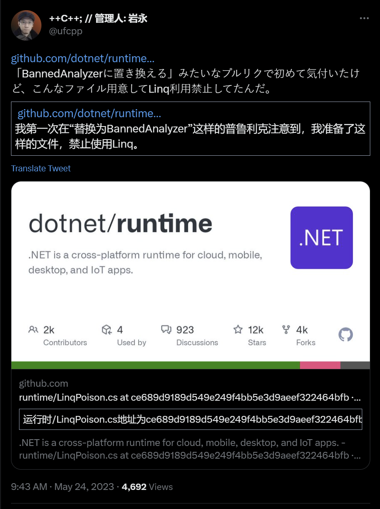
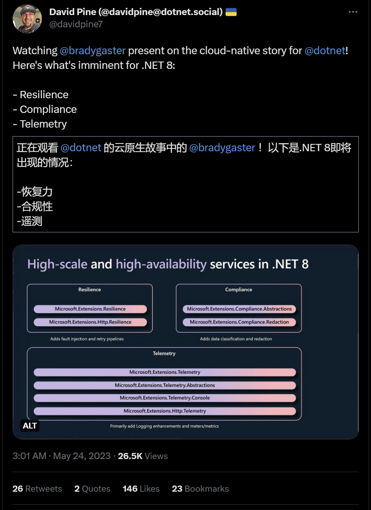

## 国内文章

### C#使用词嵌入向量与向量数据库为大语言模型(LLM)赋能长期记忆实现私域问答机器人落地之openai接口平替

https://www.cnblogs.com/gmmy/p/17430613.html

在上一篇[文章](https://www.cnblogs.com/gmmy/p/17385868.html)中我们大致讲述了一下如何通过词嵌入向量的方式为大语言模型增加长期记忆，用于落地在私域场景的问题。其中涉及到使用openai的接口进行词嵌入向量的生成以及chat模型的调用。

### 使用ML.Net轻松接入AI模型！

https://www.cnblogs.com/Big-Head/p/17429185.html

这是一篇介绍如何使用 ML.Net 轻松接入 AI 模型的博客文章，文章分为四个部分，分别介绍了：

- 使用 Visual Studio 的 Model Builder 训练和使用模型，包括选择模型类型、训练环境、数据源、评估结果和生成代码的步骤。
- 使用 ONNX 模型进行分类预测，包括下载现有的 ONNX 模型，理解输入输出和预处理后处理的流程，以及使用 ML.Net 接入 ONNX 模型的方法。
- 使用 ONNX 模型进行识别分割，包括下载现有的 ONNX 模型，理解输入输出和预处理后处理的流程，以及使用 ML.Net 接入 ONNX 模型的方法。
- 其他相关内容，包括 ML.Net 的优势、适用场景、版本要求等。

文章中还提供了一些代码示例和图片展示，以及 GitHub 链接和参考资料。

### [MAUI]模仿Chrome下拉标签页的交互实现

https://www.cnblogs.com/jevonsflash/p/17438596.html

今天来说说怎样在[.NET MAUI ](https://learn.microsoft.com/zh-cn/dotnet/maui/fundamentals/gestures/pan?view=net-maui-7.0)中制作一个灵动的类标签页控件，这类控件常用于页面中多个子页面的导航功能。

比如在手机版的Chrome中，当用户在网页中下拉时将出现“新建标签页”，“刷新”，“关闭标签页”三个选项，通过不间断的横向手势滑动，可以在这三个选项之间切换。选项指示器是一个带有粘滞效果的圆。

### 【C#/.NET】使用ASP.NET Core对象池

https://www.cnblogs.com/xuyd/p/17438313.html

使用对象池的好处主要是减少初始化/资源分配，提高性能。这一条与线程池同理，有些对象的初始化或资源分配耗时长，复用这些对象减少初始化和资源分配。比如:我有一个执行耗时约500毫秒，内存空间 2KB的任务为此创建一个新线程异步执行，而创建线程耗时1秒，内存空间占用1MB则得不偿失。

### 基于Expression Lambda表达式树的通用复杂动态查询构建器

https://www.cnblogs.com/ls0001/p/17395510.html

如题所示：基于Expression Lambda表达式树的通用复杂动态查询构建器，一共是5篇文章的合集，这是第一篇文章。

### CSharp初体验

https://www.cnblogs.com/tsecer/p/17435695.html

这篇文章介绍了 CSharp 语言的一些语法特点和结构，例如源文件的整体结构，lambda 表达式，local function，namespace 等。文章通过分析官方文档，开源项目和语言规范，来展示 CSharp 语言的特点和优势。

### 记一次 .NET 某汽贸店 CPU 爆高分析

https://www.cnblogs.com/huangxincheng/p/17420753.html

上周有位朋友在 github 上向我求助，说线程都被卡住了，让我帮忙看下，`时隔两年` 终于有人在上面提 `Issue` 了，看样子这块以后可以作为**求助专区**来使用，既然来求助，必须得免费帮忙解决，从朋友这边拿到 dump 之后，接下来就可以分析了。

### Blazor HyBrid在香橙派（Ubuntu Arm）运行的效果

https://www.cnblogs.com/hejiale010426/p/17422087.html

本文介绍了如何在 ARM 设备上使用 Blazor HyBrid 和 .NET 7 创建桌面应用。首先，需要安装一些依赖库和下载 .NET SDK 的压缩包。然后，可以使用 dotnet 命令创建一个 Blazor HyBrid 的项目模板，并修改一些配置文件。最后，可以运行 dotnet publish 命令将项目发布到 ARM 设备上，并在设备上运行应用。

### C# 面向对象教程合集

https://www.cnblogs.com/BoiledYakult/p/17422301.html

作者本人编写的C#面向对象的教程，现在更新了三个章节。作者很用心，内容很丰富，非常适合初学者进行学习。

### 如何使用 Blazor 框架在前端浏览器中导入和导出 Excel

https://www.cnblogs.com/powertoolsteam/p/17422415.html

Blazor 是一个相对较新的框架，用于构建具有 .NET 强大功能的交互式客户端 Web UI。一个常见的用例是将现有的 Excel 文件导入 Blazor 应用程序，将电子表格数据呈现给用户，并且能够允许进行任何更改，最后将该数据导出回 Excel 文件或将其保存到数据库。

以下是在 Blazor 中导入/导出电子表格文件的步骤：

1. 创建 SpreadJS Blazor 组件
2. 创建 Blazor 应用程序
3. 在 Blazor 应用程序中导入 Excel
4. Blazor 应用程序中的 Excel 导出

### 基于.NetCore开源的Windows的GIF录屏工具

https://www.cnblogs.com/chingho/p/17414352.html

这是基于.Net Core + WPF 开发的、开源项目，可将屏幕截图转为 GIF 动画。它的核心功能是能够简单、快速地截取整个屏幕或者选定区域，并将其转为 GIF动画，还支持自定义 GIF 动画效果、字幕、背景音乐。

### 基于Quartz的可视化UI操作组件GZY.Quartz.MUI更新说明(附:在ABP中集成GZY.Quartz.MUI可视化操作组件) 

https://www.cnblogs.com/GuZhenYin/p/17434965.html

总而言之，这个组件主要想做的就是：**像swaggerUI一样,项目入侵量小,仅需要在Startup中注入的UI组件**，时隔2年，(PS:其实陆陆续续在优化,不过没发博客).本组件又迎来了新的更新。

### Simple Factory Pattern 简单工厂模式简介与 C# 示例【创建型】【设计模式来了】

https://www.cnblogs.com/czzj/p/SJMSLL_SimpleFactory.html

简单工厂模式（Simple Factory Pattern）是日常开发中常用的设计模式。其是一种简单的创建型模式，它通过一个工厂类来创建对象，客户端只需要知道如何使用工厂类，而不需要知道对象的实现细节。工厂类负责创建对象的整个生命周期，并且负责处理与具体实现有关的逻辑。

### 【C#】插件编程框架 MAF 开发总结 

https://www.cnblogs.com/mrf2233/p/17434368.html

MEF和MEF微软官方介绍：https://learn.microsoft.com/zh-cn/dotnet/framework/mef/

MEF是轻量化的插件框架，MAF是复杂的插件框架。

因为MAF有进程隔离和程序域隔离可选。我需要插件进程隔离同时快速传递数据，最后选择了MAF。

如果不需要真正的物理隔离还是建议使用简单一点的MEF框架。

## 主题

### 【英文】微软 Build 2023

在 Microsoft Build 2023 上录制 .NET 相关会议。

- [Microsoft Build 2023 上的 .NET - YouTube](https://www.youtube.com/playlist?list=PLdo4fOcmZ0oV0mbay2wxFS_ZVRg6cxjdM)
- [使用 .NET MAUI 进行所有客户端和移动应用程序开发 - Microsoft Build](https://build.microsoft.com/en-US/sessions/52f77215-c8fa-49eb-844b-46ad4b006987?source=sessions)
- [Blazor + .NET MAUI – 完美的“混合”- Microsoft Build](https://build.microsoft.com/en-US/sessions/7ac85686-2fee-4ce5-82d0-c239a005eb7e?source=sessions)
- [Visual Studio 中的高级开发人员提示和技巧 - Microsoft Build](https://build.microsoft.com/en-US/sessions/5ee143d2-5336-4e2f-b345-7daf606e7629?source=sessions)
- [实时学习：使用 Blazor 构建 Web 应用程序 - Microsoft Build](https://build.microsoft.com/en-US/sessions/bac92828-29c3-4043-b886-14b181d1ec11?source=sessions)
- [使用 RWA 模式启动您的 .NET 现代化之旅 - Microsoft Build](https://build.microsoft.com/en-US/sessions/c4fe357e-2bb2-4201-a956-ca35c3497e06?source=sessions)
- [.NET 多平台应用程序 UI (MAUI) 中的新增功能，问答 - Microsoft Build](https://build.microsoft.com/en-US/sessions/2215f254-3fc3-4529-aa2f-3578b3bfdac9)
- [ASP.NET Core 和 Blazor 期货，问答 - Microsoft Build](https://build.microsoft.com/en-US/sessions/4cfe374e-a9a0-4a82-a9b6-890bd90df931?source=sessions)
- [深入了解 .NET 性能和本机 AOT - Microsoft Build](https://build.microsoft.com/en-US/sessions/28588f70-fb54-447a-b778-7ef02c8ffdf8?source=sessions)
- [Web、前端、后端和未来的 .NET 8 中有哪些新功能？- Microsoft Build](https://build.microsoft.com/en-US/sessions/da223f08-abb2-4f38-87de-0856ffa22317)
- [C# 12 及更高版本的新增功能 - Microsoft Build](https://build.microsoft.com/en-US/sessions/7bdbc522-10ed-4114-a0f1-afd45acbf7ee?source=sessions)
- [使用 .NET 8 进行云原生开发 - Microsoft Build](https://build.microsoft.com/en-US/sessions/92aa8923-2720-49a4-81a3-d117f08488fe?source=sessions)
- [将云和 AI 的力量注入您的开发工作流程 - Microsoft Build](https://build.microsoft.com/en-US/sessions/01f6a7ae-d371-43d5-9e6c-9ed2cf853d94?source=sessions)
- [Windows 中的新开发人员体验 - Microsoft Build](https://build.microsoft.com/en-US/sessions/5017d756-1ed1-468c-bd43-1ac98079f71e?source=sessions)

### 【英文】发布 ILSpy 8.0 icsharpcode/ILSpy
https://github.com/icsharpcode/ILSpy/releases/tag/v8.0

ILSpy 8.0 已经发布。

它支持 C# 10 和 11 等新语言功能，并包含各种改进和修复。

此版本还从 .NET Framework 迁移到 .NET 6，并且需要 .NET 6 运行时才能运行

### 【英文】将 AI 的力量带入 Windows 11 – 通过 Windows Copilot 和 Dev Home 为客户和开发人员开启生产力新纪元

https://blogs.windows.com/windowsdeveloper/2023/05/23/bringing-the-power-of-ai-to-windows-11-unlocking-a-new-era-of-productivity-for-customers-and-developers-with-windows-copilot-and-dev-home/

在 Microsoft Build 2023 上宣布 Windows 11 的消费者和开发人员更新。

* Windows Copilot

- 必应聊天插件支持
- 用于跨平台人工智能开发和新芯片支持的混合人工智能循环
- 开发主页
    - 仪表板
    - 开发驱动
- 新的 WinGet 配置
- 适用于 Windows 终端的 GitHub Copilot X 集成
- Windows 改进
    - 任务栏改进：取消分组、隐藏日期、结束任务
    - 支持资源管理器中的tar、7-Zip、RAR、gz等
    - 单独的 Windows 终端选项卡
- 手臂上的窗户
    - Visual Studio 中的 .NET MAUI，Linux C++ 开发支持
    - 支持 LLVM v12、Node.js、WiX
    - 支持Qt、CMake、Bazel、OpenSSL、OpenBLAS、Python等中间件
    - 统一播放器支持
    - GCC、Flutter、PyTorch、GIMP 支持即将推出
    - 介绍其他支持的应用程序
- 微软商店更新
    - Microsoft Store 人工智能中心
    - Microsoft Store AI 生成关键词
    - 人工智能生成的评论摘要
    - 微软商店广告的区域扩张
    - 应用程序备份和恢复

### 【英文】Dev Drive 和 Copy-on-Write 以提高开发人员性能 - Engineering@Microsoft
https://devblogs.microsoft.com/engineering-at-microsoft/dev-drive-and-copy-on-write-for-developer-performance/

使用 Dev Drive 和 Copy-on-Write 讨论开发性能。

Dev Drive 是一个旨在为开发人员处理文件和提高性能的驱动器。 Dev Drive 随 Windows 11 23H2 一起提供，现在已经在 Windows Insider Builds 中可用。

通过采用 ReFS 作为文件系统，Dev Drive 可以受益于 Copy-on-Write 等功能。在文章中，内测中的效果、CoW 解释、NuGet 包介绍和移动包目录中都解释了如何操作。

- [microsoft/CopyOnWrite：.NET 库封装了操作系统和文件系统在创建写入时复制文件链接的能力方面的差异](https://github.com/microsoft/CopyOnWrite)

### 【英文】Windows Dev Drive 提高 Visual Studio 和 Dev Box 的性能! - Visual Studio 博客
https://devblogs.microsoft.com/visualstudio/devdrive/

讨论即将推出的 Windows Dev Drive 如何提高 Visual Studio 和 Dev Box 的性能。

使用 Dev Drive 可将性能平均提高 25%。

### 【英文】Rider 2023.2 EAP 2：MAUI 的热重载、重新设计的构建工具窗口、源生成器的改进等 | .NET 工具博客
https://blog.jetbrains.com/dotnet/2023/05/22/rider-2023-2-eap-2/

Rider 2023.2 EAP 2 已经发布。

* C# 更新

- 改进的构建工具窗口
- 适用于 MAUI 的 XAML 热重载
- 新 UI 中的窗口着色
- 改进的源代码生成器
- 骑手的特征训练器
- 设置同步插件
- 其他改进和错误修复

### 【英文】Visual Studio 2022 版本 17.6.2 - Visual Studio 2022 发行说明
https://learn.microsoft.com/en-us/visualstudio/releases/2022/release-notes#17.6.2

Visual Studio 2022 版本 17.6.2 已经发布。

该版本修复了一些错误。

### 【英文】发布 v1.4-experimental1 microsoft/WindowsAppSDK
https://github.com/microsoft/WindowsAppSDK/releases/tag/v1.4-exp1

Windows App SDK v1.4-experimental1 发布。

此版本包含一些错误修复和实验性 API 添加和更改## 文章、幻灯片等
### 【英文】API 验证器：ReSharper 插件的新时代 | .NET 工具博客
https://blog.jetbrains.com/dotnet/2023/05/26/the-api-verifier/

ReSharper 的内置机制用于在安装期间验证插件 API 和检查兼容性。

### 【英文】[C#] C# 中的 async/await 是如何工作的？ - 尼诺的花园。
https://blog.neno.dev/entry/2023/05/27/152855

它详细解释了 C# 中的 async/await 是如何实际部署和执行的。

### 【英文】为 .NET 引入 Auth0 模板
https://auth0.com/blog/introducing-auth0-templates-for-dotnet/

使用 Auth0 for .NET 的模板已经发布。

提供了将 Auth0 与 ASP.NET Core 和 Blazor 结合使用的模板。

### 【英文】使用 Microsoft Dev Box 增强您的 Visual Studio 体验 - Visual Studio 博客
https://devblogs.microsoft.com/visualstudio/turbocharge-your-visual-studio-experience-with-microsoft-dev-box/

改善 Dev Box 中的 Visual Studio 体验。

使用登录 Dev Box 的帐户自动登录 Visual Studio，即将对 Git Credentials Manager 进行改进，对 Azure Marketplace Images 进行改进等。

### 【英文】使用 ASP.NET Core Identity 进行经过身份验证的跨域请求
https://andrewlock.net/making-authenticated-cross-origin-requests-with-aspnetcore-identity/

使用 ASP.NET Core Identity 启用跨源身份验证请求的实现。

### 【英文】好的（Blazor）组件是...？
https://jonhilton.net/good-blazor-components/

关于制作好的 Blazor 组件。

它引入了诸如保持事物尽可能小、使它们可重用以及将业务逻辑保持在单独的组件中之类的东西。

### 【英文】使 URL 相对路径的 Visual Studio 代码片段
https://blog.ploeh.dk/2023/05/23/visual-studio-code-snippet-to-make-urls-relative/

介绍如何使用 Visual Studio Code 中的代码片段将范围选择的 URL 重写为相对路径。

### 【英文】如何在创建 HttpContent 时改进内存分配
https://hashnode.devindran.com/how-to-improve-memory-allocation-when-creating-httpcontent

引入一种在创建 HttpContent 时减少内存分配的方法。

文章介绍了一种使用CommunityToolkit.HighPerformance的ArrayPoolBufferWriter和ReadOnlyMemoryContent的方法和一种使用RecyclableMemoryStream的方法。

### 【英文】将 .NET HTTP 客户端重构为类型化 HTTP 客户端
https://timdeschryver.dev/blog/refactor-your-net-http-clients-to-typed-http-clients#refactor-to-ihttpclientfactory

关于使用 HttpClient 重构 HTTP 客户端以创建类型化客户端。

### 【日文】3 天的 .NET - 3 个社区联合活动

Fukuoka.NET (Fukuten)、.NET Lab 和 C# Tokyo 的联合 .NET 活动。

- [3 Days of .NET (Day 1) ~3 Community Joint Event~ (2023/05/31 19:00~)](https://dotnet-communities.connpass.com/event/277868/)
- [3 Days of .NET (Day 2) ~3 Community Joint Event~ (2023/06/01 19:00~)](https://dotnet-communities.connpass.com/event/277869/)
- [3 Days of .NET (Day 3) ~3 Community Joint Event~ (2023/06/02 19:00~)](https://dotnet-communities.connpass.com/event/277870/)

### 【英文】微软软件供应链安全之旅 - Engineering@Microsoft
https://devblogs.microsoft.com/engineering-at-microsoft/the-journey-to-secure-the-software-supply-chain-at-microsoft/

介绍 Microsoft 对软件供应链安全的承诺。

### 【英文】EF Core 8.0 中的可查询 PostgreSQL 数组
https://www.roji.org/queryable-pg-arrays-in-ef8

PostgreSQL 对 Entity Framework Core 8.0 中引入的可查询集合原语的支持介绍## 站点、文档等

## 推文

**据说有一种技术可以通过包含一个空 System.Linq 类的代码来禁止 LINQ。**

https://twitter.com/ufcpp/status/1661186143776325632?s=12

---

**.NET 8 将为 Microsoft.Extensions 添加 Resilience、Compliance 和 Telemetry。**

https://twitter.com/davidpine7/status/1661084920553283590?s=12

## 版权声明

* 国内板块由 InCerry 进行整理 : https://github.com/InCerryGit/WeekRef.NET
* 其余内容来自 Myuki WeekRef，由InCerry翻译（已获得授权） : https://github.com/mayuki/WeekRef.NET

**由于笔者没有那么多时间对国内的一些文章进行整理，欢迎大家为《.NET周报-国内文章》板块进行贡献，需要推广自己的文章或者框架、开源项目可以下方的项目地址提交Issue或者在我的微信公众号私信。**

格式如下：

* 10~50字左右的标题
* 对应文章或项目网址访问链接
* 200字以内的简介，如果太长会影响阅读体验

https://github.com/InCerryGit/.NET-Weekly

## .NET性能优化交流群

相信大家在开发中经常会遇到一些性能问题，苦于没有有效的工具去发现性能瓶颈，或者是发现瓶颈以后不知道该如何优化。之前一直有读者朋友询问有没有技术交流群，但是由于各种原因一直都没创建，现在很高兴的在这里宣布，我创建了一个专门交流.NET性能优化经验的群组，主题包括但不限于：

* 如何找到.NET性能瓶颈，如使用APM、dotnet tools等工具
* .NET框架底层原理的实现，如垃圾回收器、JIT等等
* 如何编写高性能的.NET代码，哪些地方存在性能陷阱

希望能有更多志同道合朋友加入，分享一些工作中遇到的.NET性能问题和宝贵的性能分析优化经验。**目前一群已满，现在开放二群。**

如果提示已经达到200人，可以加我微信，我拉你进群: **lishi-wk**

另外也创建了**QQ群**，群号: 264167610，欢迎大家加入。 