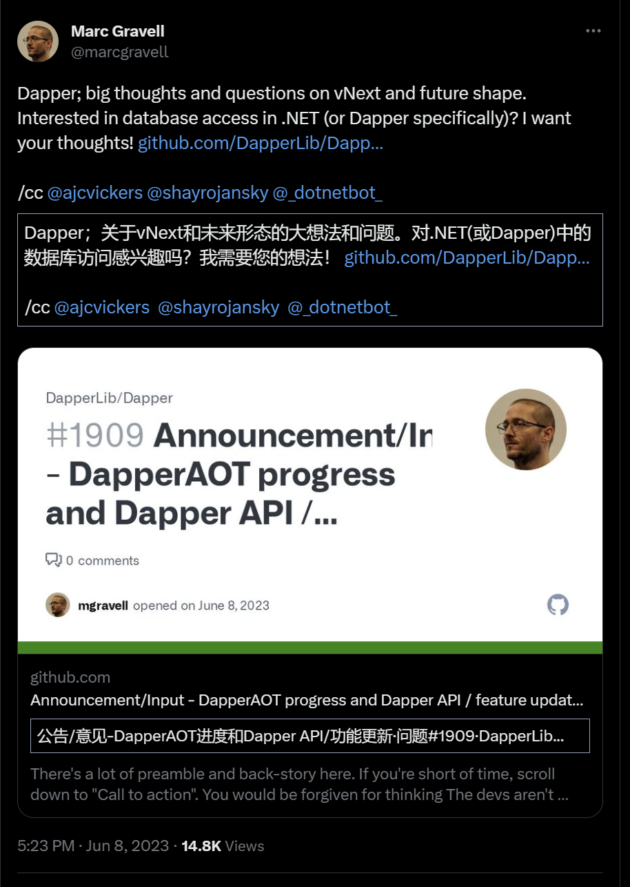
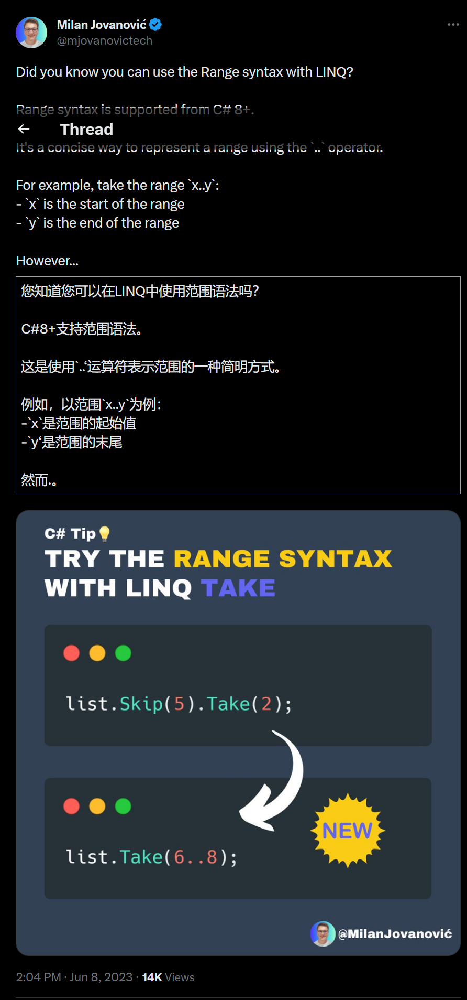

## 国内文章

### 如何计算一个实例占用多少内存？

https://www.cnblogs.com/artech/p/size-calculation.html

我们都知道CPU和内存是程序最为重要的两类指标，那么有多少人真正想过这个问题：一个类型（值类型或者引用类型）的实例在内存中究竟占多少字节？我们很多人都回答不上来。其实C#提供了一些用于计算大小的操作符和API，但是它们都不能完全解决我刚才提出的问题。本文提供了一种计算值类型和引用类型实例所占内存字节数量的方法。源代码从[这里](https://files.cnblogs.com/files/artech/SizeCalculator.7z?t=1685930731&download=true)下载。

### 如何将一个实例的内存二进制内容读出来？

https://www.cnblogs.com/artech/p/17456172.html

在《[如何计算一个实例占用多少内存？](https://www.cnblogs.com/artech/p/size-calculation.html)》中我们知道一个值类型或者引用类型的实例在内存中占多少字节。如果我们知道这段连续的字节序列的初始地址，我们就能够将代表该实例的字节内容读取出来。在接下来的内容中，我们将利用一个简单的方法输出指定实例的字节序列，并此次分析值类型和引用类型实例在内存的布局。

### 如何在.net6webapi中实现自动依赖注入

https://www.cnblogs.com/SaoJian/p/17462782.html

本文介绍了IOC和DI的概念，原理和应用。IOC是一种设计思想，将控制权从程序员转移到容器中，容器负责管理对象之间的依赖关系。DI是IOC的一种实现方式，通过在运行时动态地将依赖关系注入到对象中。本文还给出了一些代码示例，展示了如何使用.NET Core的依赖注入机制，以及如何实现自动注入的方法。

### .netcore中的虚拟文件EmbeddedFile

https://www.cnblogs.com/sunyuliang/p/17464934.html

以前一直比较好奇像swagger,cap,skywalking等组件是如何实现引用一个dll即可在网页上展示界面的，难道这么多html,js,css等都是硬编码写死在代码文件中的？后面接触apb里面也有虚拟文件的功能，一直没去深入了解，最近仔细看了一下他们的代码，发现内部其实就是用**嵌入式文件(EmbeddedFile)**来实现的，在项目中将html,css,js等文件的属性修改为“嵌入的资源”。

### WinUI（WASDK）使用HelixToolkit加载机器人3D模型并进行项目实践

https://www.cnblogs.com/GreenShade/p/17462143.html

本人之前开发了一个叫[电子脑壳](https://github.com/maker-community/ElectronBot.DotNet)的上位机应用，给稚晖君[ElectronBot](https://github.com/peng-zhihui/ElectronBot)开源机器人提供一些功能，但是由于是结合硬件才能使用的软件，如果拥有硬件的人员太少，就会导致我的软件没什么人用，于是我就想着能不能将机器人硬件的模型加载到软件里，这样用户就可以不使用硬件也可以使用我的软件了。于是就有了在WinUI（WASDK）里使用3D模型的需求。

### Taurus.mvc .Net Core 微服务开源框架发布V3.1.7：让分布式应用更高效。

https://www.cnblogs.com/cyq1162/p/17459719.html

自首个带微服务版本的框架发布：[Taurus.MVC V3.0.3 微服务开源框架发布：让.NET 架构在大并发的演进过程更简单](https://www.cnblogs.com/cyq1162/p/16540197.html)

已经过去快1年了，在这近一年的时间里，版本经历了N个版本的迭代。如今，是时候写文章介绍一下了：以下介绍中，仅以.Net Core 6 为示例代码。框架支持在.Net Framework 2.0+、.Net Core 2.1+ 任意版本运行。

### Asp-Net-Core开发笔记：API版本管理

https://www.cnblogs.com/deali/p/17460791.html

### 【C#/.NET】record介绍

https://www.cnblogs.com/xuyd/p/17459936.html

record是.NET 5中的一种新特性，可以看作是一种概念上不可变的类。records可以帮助我们在C#中更容易地处理数据，同时提供了重要的功能，如对象相等性、hashcode和解构。

### Asp-Net-Core开发笔记：API版本管理

https://www.cnblogs.com/deali/p/17460791.html

本文介绍了如何在.NET 6.0中使用Asp.Versioning.Mvc包来实现Web API的版本管理。作者讲解了API版本的概念，格式，指定方法和访问方式，并给出了代码示例。作者还介绍了如何使用swagger来生成API文档，并分享了自己的学习经历。

###  C# 客户端程序 Visual Studio 远程调试方法

https://www.cnblogs.com/BoiledYakult/p/17459749.html

传统桌面客户端的远程调试相比`UWP`，`ASP`等项目来说，配置比较麻烦，因为它是非部署的应用程序，原理是复制编译的文件到远程计算机，通过网络来连接和`VS`的通信,本文主要讲述`WPF`,`WinForm`应用程序的远程调试。

### C# 版本特性一览

https://www.cnblogs.com/gaoyunpeng/p/17459660.html

使用 C# 作为开发语言已经 15 个年头了，受惠于 C# 的不断更新，伴随着大量的新特性与大量语法糖，让我更加容易写出简洁、高效的代码。日常中大量特性早已信手拈来，当然从未尝试过的特性更是难以尽数，但是每每回忆代码中的特性究竟是哪个版本引入的，却颇为含糊。索性简单整理记录下来，用以备忘，进而能够更精确地根据想使用的特性确定程序需要的 Framework 版本。

### 如何获取 C#程序 内核态线程栈

https://www.cnblogs.com/huangxincheng/p/17458487.html

在这么多的案例分析中，往往会发现一些案例是卡死在线程的内核态栈上，但拿过来的dump都是用户态模式下，所以无法看到内核态栈，这就比较麻烦，需要让朋友通过其他方式生成一个蓝屏的dump，这里我们简单汇总下。

## 主题

### 【英文】宣布推出适用于 Visual Studio Code 的 C# 开发工具包 - Visual Studio 博客
https://devblogs.microsoft.com/visualstudio/announcing-csharp-dev-kit-for-visual-studio-code/

- [Microsoft 发布“C# Dev Kit”预览版～用“VS Code”搭建C#开发环境/从“Visual Studio”到“Visual Studio Code”的概念](https://forest.watch.impress.co. jp/docs/news/1507140.html)

### 【英文】发布 4.9.17 unoplatform/uno
https://github.com/unoplatform/uno/releases/tag/4.9.17

### 【英文】发布 v7.0.430602 dotnet/diagnostics
https://github.com/dotnet/diagnostics/releases/tag/v7.0.430602

### 【英文】ReSharper 2023.2 EAP 3：使用原始字符串和更多 C++ 功能的改进。| .NET 工具博客
https://blog.jetbrains.com/dotnet/2023/06/06/resharper-2023-2-eap-3/

### 【英文】Rider 2023.2 EAP 4 已发布！| .NET 工具博客
https://blog.jetbrains.com/dotnet/2023/06/09/rider-2023-2-eap-4/

### 【英文】Rider 2023.2 EAP 3：对原始字符串、GitLab 集成、内存快照分析等的改进 | .NET 工具博客
https://blog.jetbrains.com/dotnet/2023/06/06/rider-2023-2-eap-3/

## 文章、幻灯片等
### 【日文】如何使用 System.Formats.Tar - Qiita
https://qiita.com/skitoy4321/items/3ffe5ea62c9a75b6e397

### 【英文】在 ASP.NET Core 中调试 JwtBearer 声明问题 – Tore Nestenius | 培训师和高级软件开发人员
https://nestenius.se/2023/06/02/debugging-jwtbearer-claim-problems-in-asp-net-core/

### 【英文】增强 .NET IOptions 模式中的数据验证：利用命名和类型化 IOptions 进行稳健配置。
https://dev.to/ahmedshahjr/enhancing-data-validation-in-net-ioptions-pattern-utilizing-named-and-typed-ioptions-for-robust-configuration-1oo4

### 【英文】Docker 快速模式如何在 Rider 中工作 | .NET 工具博客
https://blog.jetbrains.com/dotnet/2023/06/07/how-docker-fast-mode-works-in-rider/

### 【英文】HackTogether：Microsoft Teams Global Hack - Keynote Recap and What's Coming - .NET 博客
https://devblogs.microsoft.com/dotnet/hacktogether-recap-whats-coming/

### 【英文】了解 .NET Core 中的依赖注入
https://auth0.com/blog/dependency-injection-in-dotnet-core/

### 【英文】Visual Studio 的 IntelliSense 列表现在可以引导 GitHub Copilot 代码完成。- Visual Studio 博客
https://devblogs.microsoft.com/visualstudio/github-copilot-visual-studio-intellisense/

### 【日文】[.NET] 使用 CommunityToolkit.HighPerformance 编写图像处理
https://zenn.dev/shimat/articles/c08c3522cdbfbb

### 【英文】Hey Yara，找到一些漏洞 | MSRC 博客 | Microsoft 安全响应中心
https://msrc.microsoft.com/blog/2023/06/hey-yara-find-some-vulnerabilities/

### 【英文】Avalonia UI - Vision Pro 对 Windows 开发人员意味着什么？
https://avaloniaui.net/Blog/what-does-vision-pro-mean-for-windows-developers,3103cff3-0aa4-4952-a9a3-24eab63e7a6f

### 【日文】Blazor .NET 开发人员开启未来的新机会 - connpass
https://infragistics.connpass.com/event/286490/

### 【日文】[VisualStudio2022] 我尝试使用 LiveUnitTesting-Qiita
https://qiita.com/yusuke-sasaki/items/3cd31a6ab288e1791b3c

### 【英文】DevCamp 2023：Meadow v1.0、Meadow Cellular、Meadow.Cloud 等！– blog.wildernesslabs.co
https://blog.wildernesslabs.co/devcamp-2023-announcements/

### 【日文】批量更新EntityFramework Core - Qiita
https://qiita.com/karuakun/items/d2626b2b518d57420a39

### 【日文】玩转 C# 开发工具包
https://zenn.dev/tnagata012/articles/play-csharp-dev-kit-2e404533dd7e99

### 【日文】【研发DevOps交流】研发部.NET基础架构介绍-三三科技博客

https://buildersbox.corp-sansan.com/entry/2023/04/13/110000

### 【英文】.NET 月刊 | 2023 年 6 月 | .NET 工具博客
https://blog.jetbrains.com/dotnet/2023/06/01/net-annotated-monthly-june-2023/

### 【英文】使用 Respawn 在 .NET 中轻松重置测试数据库
https://medium.com/@kova98/easy-test-database-reset-in-net-with-respawn-d5a59f995e9d

### 【英文】.NET 的 Avalonia UI：Mike James 的项目概述
https://www.infoq.com/news/2023/06/avalonia-mike-james/

### 【日文】在 C# 中制作您自己的响应式编程：Select 和 Where 运算符 - Qiita
https://qiita.com/fsdg-adachi_h/items/01018ab1e0d3e71df9bd

### 【英文】介绍 Sep - 可能是世界上最快的 .NET CSV 解析器
https://nietras.com/2023/06/05/introducing-sep/

### 【英文】探索新的 Visual Studio 功能：.http 文件
https://dev.to/iamprincejkc/exploring-the-new-visual-studio-feature-http-files-1i99

### 【英文】UWP 应用中的依赖注入
https://kidjenius.medium.com/dependency-injection-in-uwp-apps-82e6eebf9e23

### 【英文】nameof get 在 C# 12 中好一点
https://steven-giesel.com/blogPost/5b0bcb83-4508-4cde-9299-80940bf4709a

### 【英文】C# 中的对象分配在哪里？
https://gevorgchobanyan.medium.com/where-are-objects-allocated-in-c-understanding-heap-and-stack-951febcac8fe

### 【英文】在 C# 12 中拥抱简单性：Lambda 表达式中的默认参数
https://medium.com/@dilshanprasad3/embracing-simplicity-in-c-12-default-parameters-in-lambda-expressions-f72f566b63eb

## 库、存储库、工具等
## 站点、文档等
### 推文 
https://twitter.com/marcgravell/status/1666737677922705409?s=12

---

https://twitter.com/mjovanovictech/status/1666687568832872448?s=12 

## 版权声明

* 国内板块由 InCerry 进行整理 : https://github.com/InCerryGit/WeekRef.NET
* 其余内容来自 Myuki WeekRef，由InCerry翻译（已获得授权） : https://github.com/mayuki/WeekRef.NET

**由于笔者没有那么多时间对国内的一些文章进行整理，欢迎大家为《.NET周报-国内文章》板块进行贡献，需要推广自己的文章或者框架、开源项目可以下方的项目地址提交Issue或者在我的微信公众号私信。**

格式如下：

* 10~50字左右的标题
* 对应文章或项目网址访问链接
* 200字以内的简介，如果太长会影响阅读体验

https://github.com/InCerryGit/.NET-Weekly

## .NET性能优化交流群

相信大家在开发中经常会遇到一些性能问题，苦于没有有效的工具去发现性能瓶颈，或者是发现瓶颈以后不知道该如何优化。之前一直有读者朋友询问有没有技术交流群，但是由于各种原因一直都没创建，现在很高兴的在这里宣布，我创建了一个专门交流.NET性能优化经验的群组，主题包括但不限于：

* 如何找到.NET性能瓶颈，如使用APM、dotnet tools等工具
* .NET框架底层原理的实现，如垃圾回收器、JIT等等
* 如何编写高性能的.NET代码，哪些地方存在性能陷阱

希望能有更多志同道合朋友加入，分享一些工作中遇到的.NET性能问题和宝贵的性能分析优化经验。**目前一群已满，现在开放二群。**

如果提示已经达到200人，可以加我微信，我拉你进群: **lishi-wk**

另外也创建了**QQ群**，群号: 687779078，欢迎大家加入。 

## 抽奖送书活动预热！！！

感谢大家对我公众号的支持与陪伴！为庆祝公众号一周年，抽奖送出一些书籍，请大家关注公众号后续推文！

