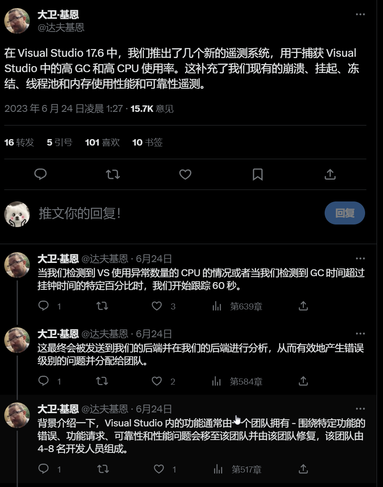

## 国内文章

### 如何在long-running task中调用async方法

https://www.cnblogs.com/eventhorizon/p/17497359.html

long-running task 是指那些长时间运行的任务，比如在一个 while True 中执行耗时较长的同步处理。本文带你了解在long-running task中调用async方法的姿势。

### 使用 C# 进行AI工程开发-基础篇（二）：NativeAOT

https://zhuanlan.zhihu.com/p/638859407

NativeAOT 是 dotnet 新增加的运行模式。其中，AOT是 Ahead-Of-Time 的缩写，和 JIT 边运行边编译不同，NativeAOT 直接将 IL 代码编译为目标平台的机器码发布，它的文件大小、启动时间和内存占用均比 JIT 低。

### C#使用企业微信群机器人推送生产数据

https://www.cnblogs.com/hello-momo/p/17504219.html

在日常的工作生产中，经常会有将将生产数据或者一些信息主动推送给相关的管理人员，我们公司在开发WMS系统时，为了仓库的储存安全，需要在危废品库存达到一定的储量时，自动通知仓管员去处理危废品，所以就需要程序自动的通过企业微信告知仓管员，这个时候就需要用到企业微信的机器人了。

### 如何取消Blazor Server烦人的重新连接？

https://www.cnblogs.com/hejiale010426/p/17498629.html

许多Blazor用户在开发内部系统时会选择更快的Blazor Server模式。由于基于SignalR实现，它在访问时会建立WebSocket长连接，用于交互和界面渲染。这可能导致用户在操作界面时，服务器宽度被占用。会在无操作情况下自动断开连接，导致不美观的重连接界面及灰色效果。我们将使用微软提供的解决方案来处理这个问题。

### C#/.Net的多播委托到底是啥？彻底剖析下

https://www.cnblogs.com/tangyanzhi1111/p/17489381.html

委托在.Net里面被托管代码封装了之后，看起来似乎有些复杂。但是实际上委托即是函数指针，而多播委托，即是函数指针链。本篇来只涉及底层的逻辑，慎入。

### 聊聊 ASP.NET 6 整洁架构开发模板

https://www.cnblogs.com/edisonchou/p/aspnet6_clean_architecture_template_sample.html

大家好，我是Edison。最近看了一些整洁架构（CleanArchitecture）的文章，自己和同事也简单写了一个基于整洁架构的ASP.NET 6开发模板在玩。这里就仅仅抛个砖，案例主要以自己根据小组实际情况做了一些裁剪，可能不具有通用的应用性，大家看看就好。

### 记一次 .NET 某企业内部系统 崩溃分析

https://www.cnblogs.com/huangxincheng/p/17490807.html

前些天有位朋友找到我，说他的程序跑着跑着就崩溃了，让我看下怎么回事，其实没怎么回事，抓它的 crash dump 就好，具体怎么抓也是被问到的一个高频问题，这里再补一下链接： [.NET程序崩溃了怎么抓 Dump ? 我总结了三种方案] https://www.cnblogs.com/huangxincheng/p/14811953.html ，采用第二种 AEDebug 的形式抓取即可。

### ASP.NET Core 6框架揭秘实例演示[39]：使用最简洁的代码实现登录、认证和注销

https://www.cnblogs.com/artech/p/inside-asp-net-core-6-39.html

认证是一个确定请求访问者真实身份的过程，与认证相关的还有其他两个基本操作——登录和注销。ASP.NET Core利用AuthenticationMiddleware中间件完成针对请求的认证，并提供了用于登录、注销以及“质询”的API，本篇文章利用它们使用最简单的代码实现这些功能。（本文提供的示例演示已经同步到《[ASP.NET Core 6框架揭秘-实例演示版](https://www.cnblogs.com/artech/p/inside-asp-net-core-6.html)》）

## 主题

### 发布版本 v2.54.0 grpc/grpc-dotnet
https://github.com/grpc/grpc-dotnet/releases/tag/v2.54.0

grpc-dotnet (gRPC for .NET) v2.54.0 已发布。

此版本包含多项改进和错误修复，包括在身份验证拦截器中支持 CancellationToken。

### Microsoft Forms Service 的 .NET 6 之旅 - .NET 博客
https://devblogs.microsoft.com/dotnet/microsoft-forms-services-journey-to-dotnet-6/

将 Microsoft Forms（一种用于创建调查的服务）微服务迁移到 .NET 6 的案例研究。

Microsoft Forms 是使用 .NET Framework 4.7.2 的 WebForms 和 Web API 构建的微服务，但前端 REST API 和后端 REST API 服务已迁移到 .NET 6。

本文介绍了迁移方法和实施结果。迁移的方法是首先删除HttpContext，然后更新依赖项并将项目更改为多目标构建，例如netstandard2.0、net472、net6.0。当时我们还介绍了多目标构建增加带来的问题。引入后，CPU使用率和响应延迟得到了极大的改善。

### ReSharper 和 Rider 2023.1.3 – 另一组错误修复现已发布 | .NET 工具博客
https://blog.jetbrains.com/dotnet/2023/06/23/rsrp-and-rd-2023-1-3-bug-fix/

ReSharper 和 Rider 2023.1.3 发布。

它包括对 Visual Studio 中 ReSharper 性能问题的修复、对 dotTrace 和 dotMemory 错误的修复、对 Rider 更新程序崩溃问题的修复以及其他 IDE 错误的修复。

### NPOI 2.6.1 中的新增功能
https://tonyqus.medium.com/whats-new-in-npoi-2-6-1-92b5f07c479c

NPOI 2.6.1 已发布。

此版本包括多项改进和错误修复，包括增加了对面积图和饼图的支持。

### 为 fsharpConf 2023 做好准备！-.NET 博客
https://devblogs.microsoft.com/dotnet/tune-in-for-fsharpconf-2023/

介绍 F# 社区活动 fsharpConf 2023 的文章。

fsharpConf 2023 是 6 月 26 日举行的虚拟 F# 社区活动。文章介绍了活动的时间表。

- [fsharpConf：F# 社区虚拟会议](https://fsharpconf.com/)

### 介绍适用于 .NET 的新 T4 命令行工具 - .NET 博客
https://devblogs.microsoft.com/dotnet/t4-command-line-tool-for-dotnet/

推出适用于 .NET 的 T4 命令行工具，自 Visual Studio 2022 17.6 起可用。

Visual Studio 2022 17.6 及更高版本现在附带可与 .NET 6 配合使用的新版本 T4（文本模板）执行命令行工具。

该工具的新版本可与 .NET 6 运行时配合使用，允许您使用 T4 模板中的现代 .NET 库。当前的限制是不支持从 IDE 运行和使用 MSBuild Task 运行。

我们还要求您提供反馈，甚至文章中还链接了一项调查。

## 文章、幻灯片等
### 【日文】使用 C# 中的 MSTest 的精细代码覆盖率测量覆盖率 - Qiita
https://qiita.com/YoshijiGates/items/efc700574edbf8eb1ab2

如何在 Visual Studio 2022 社区中检查代码覆盖率。

本文介绍如何安装和检查 Fine Code Coverage 扩展。

- [精细代码覆盖 - Visual Studio Marketplace](https://marketplace.visualstudio.com/items?itemName=FortuneNgwenya.FineCodeCoverage2022)

### 【英文】如何使用 Memgraph、C# 和 D3.js 构建基于航班网络分析图的 ASP.NET 应用程序
https://memgraph/how-to-build-a-flight-network-analysis-graph-based-asp-net-application-with-memgraph-c-and-d3-js-601d7e7a6bdb

 有关使用内存图形数据库 Memgraph 在 ASP.NET 应用程序中通过 D3.js 构建可视化工具的教程。

### 【日文】C# 中的 ChatGPT API：与 AI 组合（使用函数调用）- Qiita
https://qiita.com/fsdg-adachi_h/items/7b2e75fa916cd6d4d804

如何使用ChatGPT的API与AI进行音乐创作并创建MIDI文件文章中是使用ChatGPT的Function Calling来实现的。

### 【英文】使用 Html Agility Pack 或 AngleSharp 解析 C# 网站
https://blog.elmah.io/parsing-websites-in-c-with-html-agility-pack-or-anglesharp/

如何使用 Html Agility Pack 和 AngleSharp 抓取网站。

### 【英文】通过源链接改进 .NET 调试体验 - NDepend
https://blog.ndepend.com/improved-net-debugging-experience-with-source-link

介绍如何使用 Source Link 改善 .NET 调试体验。

### 【英文】使用 YubiKey .NET SDK 在 C# 中进行哈希签名和签名验证
https://medium.com/@matt.heimlich/hash-signing-and-signature-validation-in-c-using-the-yubikey-net-sdk-dbaa227255dd

如何使用 YubiKey 的 .NET SDK 通过 YubiKey 进行哈希签名和签名验证。

### 【英文】如何在 Java 中构建共享库并从 .NET 代码调用它
https://medium.com/@sixpeteunder/how-to-build-a-shared-library-in-java-and-call-it-from-dotnet-code-b47c22300456

如何从 .NET 调用构建为共享库的 Java 库。

本文介绍了如何通过 C 语言包装器从 .NET 调用 GraalVM 的本机库。

### 【日文】使用 GitHub Actions 自动部署用 C# 创建的 AWS Lambda 函数 - Qiita
https://qiita.com/shin4488/items/20660044f6c86cfdead2

了解如何从 GitHub Actions 部署适用于 .NET 的 AWS Lambda 函数。

### 【日文】NCMB 的 C# (MAUI/Xamarin) SDK 现在支持推送通知操作 - Qiita
https://qiita.com/goofmint/items/585b63dcb6374382afb1

关于 Nifuku 移动后端 (NCMB) 社区对 SDK 的推送通知操作的支持以及如何使用它。

### 【日文】nanoFramework 从 XIAO ESP32C3 ~ADC~ 开始
https://zenn.dev/matsujirushi/articles/8bdbccd464d571

如何在 Seeed Studio XIAO ESP32C3 中使用 nanoFramework 读取 ADC 值。

### 【日文】告别 Xamarin.Mac 并转向 .NET 7
https://zenn.dev/dogfortune/articles/51d1b2aa17be27

一篇文章总结了从 Xamarin.Mac 到 .NET 7 的迁移工作中的一些要点。

### 【日文】关于在 Power 上运行 .NET 的故事 #4 - 使用 ODBC 驱动程序连接到 MariaDB - Qiita
https://qiita.com/Nakaji1106/items/429034b3707c65c4d6ff

关于在 Power 架构上运行 .NET 并使用 ODBC 驱动程序连接到 MariaDB 的文章。

### 【日文】尝试将应用提交到 Microsoft Store-Qiita
https://qiita.com/dhq_boiler/items/781b2ef98ce26a090566

说明从向 Microsoft Store 提交应用程序到发布应用程序的过程。

### 【英文】使用委派权限和 Microsoft Graph 在 ASP.NET Core 中重置密码
https://damienbod.com/2023/06/19/reset-passwords-in-asp-net-core-using-delegated-permissions-and-microsoft-graph/

了解如何在 ASP.NET Core 应用程序中使用 Microsoft Graph 重置用户密码。

### 【英文】使用自定义运行时检查器和安装程序安装 .NET 桌面运行时
https://weblog.west-wind.com/posts/2023/Jun/21/Creating-a-Runtime-Checker-and-Installer-for-a-NET-Core-WPF-Application

用于检查 .NET 运行时的安装状态并安装它的自定义安装程序。

本文涵盖了运行时分发、独立分发、共享运行时以及安装程序的实现说明。

### 【日文】修复WSL2的.NET SDK无法识别的现象 - kkamekawa的博客
https://kkamegawa.hatenablog.jp/entry/2023/06/24/191525

当 WSL 2 不再正确识别 .NET SDK 时进行故障排除。

### 【英文】使用 MiniValidation 递归地验证嵌套的 DataAnnotation IOptions
https://andrewlock.net/validating-nested-dataannotation-options-recursively-with-minivalidation/

使用标准“ValidateDataAnnotations”作为 IOptions 验证时如何解决缺少嵌套验证的问题本文介绍了如何使用MiniValidation进行验证。

### 【日文】可以创建Windows安装程序的wixtoolset概述（v4） - Qiita
https://qiita.com/skitoy4321/items/194888be042e5c4c32ad

关于 WiX v4 的概述文章。它解释了 WiX 使用的文件以及如何构建它。

### 【日文】C# 12.0 中的新增功能
https://ufcpp.net/study/csharp/cheatsheet/ap_ver12/

C# 12 中引入的新功能的描述（当前为预览版）。

### 【日文】在 .NET 字符串比较中检测未指定的区域性 
https://ufcpp.net/blog/2023/6/ca-specify-culture/

当未指定区域性时，如何在字符串比较中发出警告/错误，以便提前通知您。

本文介绍了一种使用 .NET 5 中引入的 NetAnalyzers 和 .editorconfig 来出错的方法。

### 【英文】宣布在 Visual Studio 中创建拉取请求 - Visual Studio 博客
https://devblogs.microsoft.com/visualstudio/create-a-pull-request-in-visual-studio/

引入了创建 Visual Studio 2022 17.7 预览版 2 中添加的拉取请求的功能。

### 【英文】如何检测堆分配
https://bartwullems.blogspot.com/2023/06/how-to-detect-heap-allocations.html

关于如何检测堆分配。

本文介绍了使用 Visual Studio 的探查器和 ClrHeapAllocationAnalyzer 进行代码检测。

### 【英文】将您的 .NET Minimal API 端点视为应用程序层
https://timdeschryver.dev/blog/treat-your-net-minimal-api-endpoint-as-the-application-layer

将 ASP.NET Core 的最小 API 视为架构应用程序层的配置。

### 【英文】List 在 .NET 的底层是如何工作的？
https://steven-giesel.com/blogPost/06e2c8e8-0119-4e8d-9227-3cb922a8c916

`List<T>` 内部实现的简要描述。

## 网站、文档等
### 推文

在 Visual Studio 2022 17.6 中，GC 和 CPU 现在能够通过遥测看到高负载情况。

在接下来的线程中，我解释了它如何在什么样的系统中使用。

https://twitter.com/davkean/status/1672295235026829312?s=12

## 版权声明

* 国内板块由 InCerry 进行整理 : https://github.com/InCerryGit/WeekRef.NET
* 其余内容来自 Myuki WeekRef，由InCerry翻译（已获得授权） : https://github.com/mayuki/WeekRef.NET

**由于笔者没有那么多时间对国内的一些文章进行整理，欢迎大家为《.NET周报-国内文章》板块进行贡献，需要推广自己的文章或者框架、开源项目可以下方的项目地址提交Issue或者在我的微信公众号私信。**

格式如下：

* 10~50字左右的标题
* 对应文章或项目网址访问链接
* 200字以内的简介，如果太长会影响阅读体验

https://github.com/InCerryGit/.NET-Weekly

## .NET性能优化交流群

相信大家在开发中经常会遇到一些性能问题，苦于没有有效的工具去发现性能瓶颈，或者是发现瓶颈以后不知道该如何优化。之前一直有读者朋友询问有没有技术交流群，但是由于各种原因一直都没创建，现在很高兴的在这里宣布，我创建了一个专门交流.NET性能优化经验的群组，主题包括但不限于：

* 如何找到.NET性能瓶颈，如使用APM、dotnet tools等工具
* .NET框架底层原理的实现，如垃圾回收器、JIT等等
* 如何编写高性能的.NET代码，哪些地方存在性能陷阱

希望能有更多志同道合朋友加入，分享一些工作中遇到的.NET性能问题和宝贵的性能分析优化经验。**目前一群已满，现在开放二群。**

如果提示已经达到200人，可以加我微信，我拉你进群: **lishi-wk**

另外也创建了**QQ群**，群号: 687779078，欢迎大家加入。 

## 抽奖送书活动预热！！！

感谢大家对我公众号的支持与陪伴！为庆祝公众号一周年，抽奖送出一些书籍，请大家关注公众号后续推文！