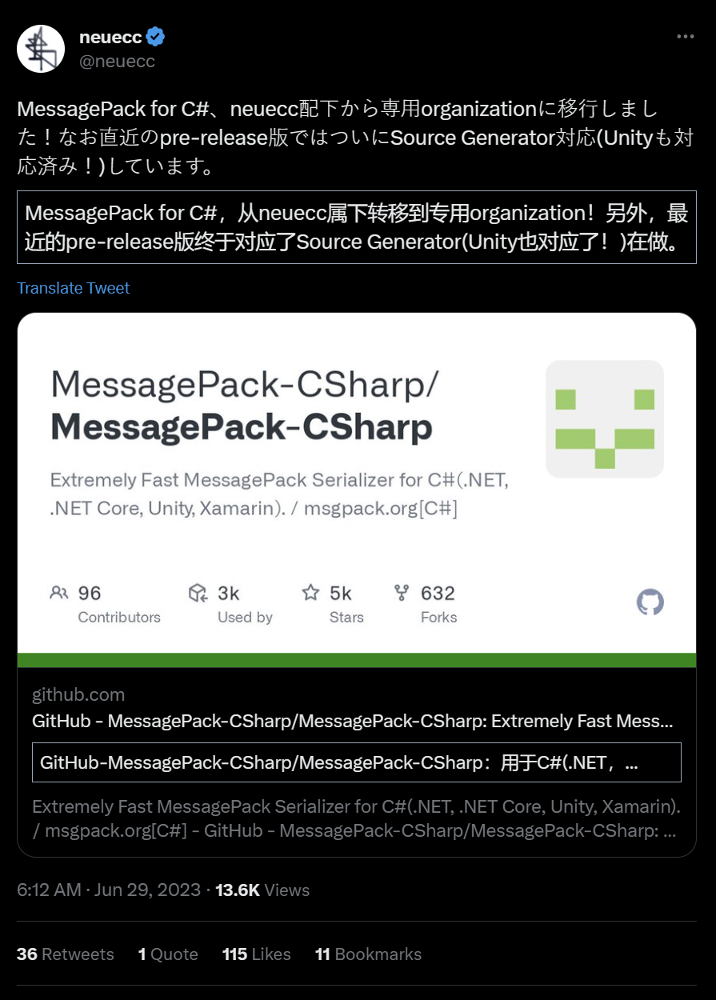
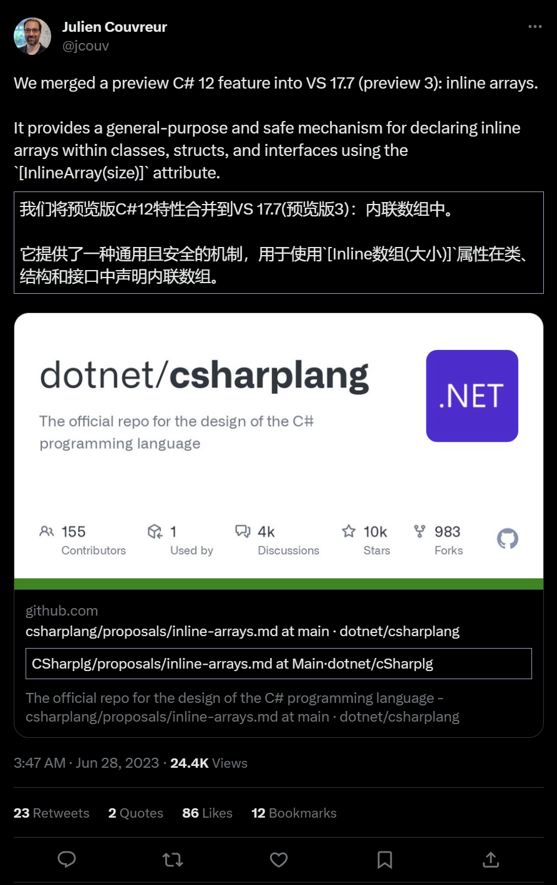

## 国内文章

### C# 实现 Linux 视频聊天、远程桌面（源码，支持信创国产化环境，银河麒麟，统信UOS）

https://www.cnblogs.com/shawshank/p/17420469.html

 园子里的有朋友在下载并了解了《[C# 实现 Linux 视频会议（源码，支持信创环境，银河麒麟，统信UOS）](https://www.cnblogs.com/shawshank/p/17390248.html)》中提供的源码后，留言给我说，这个视频会议有点复杂了，代码比较多，看得有些费劲。问我能不能整个简单点的Demo，只要有视频聊天和远程桌面的功能就可以。于是，我就又写了一个Demo来供大家参考，它可以在Windows和Linux（包括国产OS，如银河麒麟、统信UOS、深度Deepin等）上运行。

### [MAUI]用纯C#代码写两个漂亮的时钟

https://www.cnblogs.com/jevonsflash/p/17519792.html

本文介绍了如何在.NET MAU中实现Material You风格的时钟小部件，包括锯齿表盘、时钟指针和文本路径的绘制方法。文中给出了详细的代码示例和效果图，以及相关的字体配置和Xaml文件。

### Linux 上的 .NET 如何自主生成 Dump

https://www.cnblogs.com/huangxincheng/p/17516112.html

本文介绍了如何在Windows和Linux平台上自主生成dump文件，以便于诊断.NET程序的异常情况。文中分别介绍了使用Win32 API的MiniDumpWriteDump方法和使用Microsoft.Diagnostics.NETCore.Client库的WriteDump方法的代码示例和运行结果。

### 使用C#编写.NET分析器-第二部分

https://www.cnblogs.com/InCerry/p/writing-a-net-profiler-in-c-sharp-part-2.html

这篇文章介绍了Kevin Gosse大佬使用C#编写.NET分析器的系列文章之一。.NET分析器常被用于APM（应用性能诊断）、IDE、诊断工具中，比如Datadog的APM，Visual Studio的分析器以及Rider和Reshaper等等。本文主要讲述了如何将COM对象映射到.NET中的一个实际对象实例，以及如何使用GCHandle来获取与该句柄关联的固定地址，并使用GCHandle.FromIntPtr从该地址检索句柄。

### 以管道的方式来完成复杂的流程处理

https://www.cnblogs.com/artech/p/17469614.html

之前参与一个机票价格计算的项目，为他们设计了基本的处理流程，但是由于整个计算流程相当复杂，而且变化非常频繁，导致日常的修改、维护和升级也变得越来越麻烦，当我后来再接手的时候已经看不懂计算逻辑了。为了解决这个问题，我借鉴了“工作流”的思路，试图将整个计算过程设计成一个工作流。但是我又不想引入一个独立的工作流引擎，于是写了一个名为Pipelines的框架。顾名思义，Pipelines通过构建Pipeline的方式完成所需的处理流程，整个处理逻辑被分解并实现在若干Pipe中，这些Pipe按照指定的顺序将完成的Pipeline构建出来。Pipeline本质上就是一个简单的顺序工作流，它仅仅按序执行注册的Pipe。这个简单的Pipelines框架被放在这里，这里我不会介绍它的设计实现，只是简单地介绍它的用法，有兴趣的可以查看[源代码](https://github.com/jiangjinnan/Pipelines)。

### 【.NET源码解读】深入剖析中间件的设计与实现

https://www.cnblogs.com/Z7TS/p/17494203.html

.NET本身就是一个基于中间件（middleware）的框架，它通过一系列的中间件组件来处理HTTP请求和响应。在之前的文章[《.NET源码解读kestrel服务器及创建HttpContext对象流程》](https://www.cnblogs.com/Z7TS/p/17459777.html)中，已经通过源码介绍了如何将HTTP数据包转换为.NET的HttpContext对象。接下来，让我们深入了解一下.NET是如何设计中间件来处理HttpContext对象。

### 记一次 .NET 某埋线管理系统 崩溃分析

https://www.cnblogs.com/huangxincheng/p/17513935.html

经常有朋友跟我反馈，说看你的文章就像看天书一样，有没有一些简单入手的dump 让我们先找找感觉，哈哈，今天就给大家带来一篇入门级的案例，这里的入门是从 WinDbg 的角度来阐述的，这个问题如果你通过 记日志，分析代码 的方式，可能真的无法解决，不信的话继续往下看呗！

前段时间有位朋友微信上找到我，说他的程序崩溃了，也没找出是什么原因，然后就让朋友抓一个崩溃的dump让我看看。

### 老生常谈：值类型 V.S. 引用类型

https://www.cnblogs.com/artech/p/17509624.html

我在面试的时候经常会问一个问题：“谈谈值类型和引用的区别”。对于这个问题，绝大部分人都只会给我两个简洁的答案：“值类型分配在栈中，引用类型分配在堆中”，“在默认情况下，值类型参数传值（拷贝），引用类型参数传引用”。其实这个问题有很大的发挥空间，如果能够从内存布局、GC、互操作、跨AppDomain传递等方面展开，相信会加分不少。这篇文章独辟蹊径，从“变量”的角度讨论值类型和引用类型的区别。

### .NET Core 允许跨域的两种方式实现（IIS 配置、C# 代码实现）

https://www.cnblogs.com/czzj/p/NETCoreCors.html

当把开发好的 WebApi 接口，部署到 Windows 服务器 IIS 后，postman 可以直接访问到接口并正确返回，这并不意味着任务完成，毕竟接口嘛是要有交互的，最常见的问题莫过于跨域了。若前端文件是在当前接口文件下的 wwwroot 文件夹下，那么接口的访问就没问题，因为是**同协议（http、https）、同地址（域名）、同端口，不存在跨域问题**。但是，若前端和接口不是部署在一起的，那么一般都会存在跨域问题，本文将通过两种方式介绍如何使接口允许跨域请求。

### 记一次 .NET 某企业采购平台 崩溃分析

https://www.cnblogs.com/huangxincheng/p/17508154.html

前段时间有个朋友找到我，说他们的程序有偶发崩溃的情况，让我帮忙看下怎么回事，针对这种 crash 的程序，用 AEDebug 的方式抓取一个便知，有了 dump 之后接下来就可以分析了。

### Docker 中的 .NET 异常了怎么抓 Dump

https://www.cnblogs.com/huangxincheng/p/17505313.html

有很多朋友跟我说，在 Windows 上看过你文章知道了怎么抓 Crash, CPU爆高，内存暴涨 等各种Dump，为什么你没有写在 Docker 中如何抓的相关文章呢？瞧不上吗？哈哈，在DUMP的分析旅程中，跑在 Docker 中的 .NET 占比真的不多，大概10个dump有 1-2 个是 docker 中的，市场决定了我的研究方向，为了弥补这一块的空洞，决定写一篇文章来分享下这三大异常下的捕获吧。

## 主题

### 【英文】AI Assistant 来到 ReSharper | .NET 工具博客
https://blog.jetbrains.com/dotnet/2023/06/26/resharper-ai-assistant/

ReSharper 2023.2 EAP 6 已发布。

此版本包含一个利用大型语言模型的人工智能助手。这将允许您通过 Visual Studio 中的聊天询问有关改进代码的问题。

更多 C# 支持、LINQ 嵌入提示、dotTrace Linux、macOS 源代码视图等。

### 【英文】Rider 推出 AI 助手！ | .NET 工具博客
https://blog.jetbrains.com/dotnet/2023/06/26/rider-ai-assistant/

Rider 2023.2 EAP 6 已发布。

此版本包含一个利用大型语言模型的人工智能助手。这提供了诸如聊天式帮助、提交消息生成和文件生成等功能。

其他更新的 C# 支持、新用户的新 UI 默认值、每个项目的自定义颜色、可访问性改进、添加的结构视图过滤器和排序、Roslyn（源生成器）改进和模板、远程调试器，例如 ARM32 支持

### 【英文】Cysharp/MagicPhysX：.NET PhysX 5 绑定到所有平台（win、osx、linux），用于 3D 引擎、深度学习、游戏专用服务器。
https://github.com/Cysharp/MagicPhysX

物理引擎 PhysX 5 的 .NET 绑定库已发布。

https://twitter.com/neuecc/status/1674688540339499010?s=12

## 文章、幻灯片等
### 【英文】从 .NET 8 SDK Preview 4 开始，AssemblyInformationalVersion 属性现在具有哈希值
https://devadjust.exblog.jp/29614447/?fbclid=IwAR0xwYcrAFtldsg6H1-jr9OHBo4zSBNIOA7sof4LTakIpqWyyzOpaVvdyco

关于使用.NET 8 Preview 4 SDK构建的程序集的AssemblyInformationVersion现在有源代码修订。

文章还介绍了防止修改的设置方法。

### 【英文】在 ASP.NET Core 6.0 上实现 WebSocket 客户端和服务器（C#）
https://medium.com/bina-nusantara-it-division/implementing-websocket-client-and-server-on-asp-net-core-6-0-c-4fbda11dbceb

如何在 ASP.NET Core 中实现 WebSocket 服务器并与客户端通信。

### 【日文】C# 中的语义内核：协调多个插件 - Qiita
https://qiita.com/fsdg-adachi_h/items/1fe094f4f1a0556045ae

如何使用语义内核链接多个插件。

- [C# 中的语义内核：与 AI 组合（协调多个插件）- Qiita](https://qiita.com/fsdg-adachi_h/items/875583d556552ff14d4d)

### 【英文】使用 Qodana 提升 C# 代码质量：迈向完美之旅 | .NET 工具博客
https://blog.jetbrains.com/dotnet/2023/06/29/elevating-csharp-code-quality-with-qodana-a-journey-towards-perfection/

隆重推出 Jetbrains Qodana，它可以分析和报告 C# 代码。

### 【英文】Visual Studio Marketplace 的开源替代品避免退役 -- Visual Studio 杂志
https://visualstudiomagazine.com/articles/2023/06/27/open-vsx-registry.aspx

关于 Open VSX 注册表，它是 Visual Studio Marketplace 的替代方案。

### 【英文】Microsoft Store 开源系列 — 应用服务库 - #ifdef Windows
https://devblogs.microsoft.com/ifdef-windows/microsoft-store-open-source-series-appservices-library/

它引入了一种名为 AppService 的机制，该机制与 Microsoft Store 应用程序和完全受信任的 Win32 应用程序中使用的 UWP 进行通信，以及一个利用它的库。

本文提到使用一种机制通过 Community Kit Lab 的 Source Generator 生成代理。

### 【英文】使用新的配置绑定程序源生成器：探索 .NET 8 预览 - 第 1 部分
https://andrewlock.net/exploring-the-dotnet-8-preview-using-the-new-configuration-binder-source-generator/

对 .NET 8 Preview 3 中引入的 Microsoft.Extensions.Configuration 的基于源生成器的绑定器的讨论。

本文涉及如何安装它、它的实际工作原理以及当前的问题/限制。

### 【日文】ASP.NET Core 中通过 cookie 身份验证 + AntiForgery + JWT 与远程服务器共享身份验证信息以及 400 Bad Request 对策 - Qiita
https://qiita.com/jun1s/items/903570264d1bfb62cf14

在配置为使用 cookie 身份验证和 JWT 的 ASP.NET Core 应用程序中，如果使用 AntiForgery 并发生 JWT 刷新，AntiForgery 令牌验证失败以及如何解决它。

### 【英文】如何使用 RuntimeHelpers.IsReferenceOrContainsReferences 来微优化集合 - Gérald Barré
https://www.meziantou.net/how-to-use-runtimehelpers-isreferenceorcontainsreferences-to-micro-optimize-coll.htm

关于使用 RuntimeHelpers.IsReferenceOrContainsReferences 进行集合微优化。

例如，对于引用类型，在 Pop 等情况下需要从内部数组中删除引用，但对于值类型来说，有减少索引而不删除元素等技巧，IsReferenceOrContainsReferences 就很有用那时。

### 【英文】使用 StringBuilder 替换值
https://khalidabuhakmeh.com/using-stringbuilder-to-replace-values

关于使用 StringBuilder 进行字符串替换。

与使用 String 的 Replace 替换相比，使用 StringBuilder 可以减少分配。

### 【日文】我对 System.Diagnostics.Process.GetProcessesByName 的分配感到绝望，决定到另一个世界报仇 - Qiita
https://qiita.com/gazf/items/085a93cabf10e745e227

尝试以较少分配的方式重新实现 Process.GetProcessesByName。

### 【日文】模块初始值设定项的调用顺序
https://ufcpp.net/blog/2023/6/init-order/

存在多个模块初始值设定项（“ModuleInitializer”）时执行顺序的描述。

### 【英文】用 C# 编写 .NET 分析器 - 第 4 部分
https://minidump.net/writing-a-net-profiler-in-c-part-4-c54df903b9ce

使用 C# (NativeAOT) 创建 .NET 分析器系列的第 4 部分。

### 【英文】处理 Swashbuckle.AspNetCore.Cli 中的 FileLoadException - xin9le.net
https://blog.xin9le.net/entry/2023/06/25/230203

针对Swashbuckle.AspNetCore.Cli不支持Top-level statements导致生成失败问题的对策。

它展示了如何实现创建专门称为 IHost 的方法。

### 推文

**MessagePack-CSharp 从个人帐户移至组织（预发行版本支持源生成器）。**

https://twitter.com/neuecc/status/1674179032349306884?s=12

---

**您可以通过设置 .csproj 中的 MapPath 属性来更改堆栈跟踪中显示的路径。**

https://twitter.com/karenpaynemvp/status/1674152970668351488?s=12

---

**C# 12 内联数组合并到 Visual Studio 2022 17.7 Preview 3 中。**

https://twitter.com/jcouv/status/1673780113434091520?s=12

## 版权声明

* 国内板块由 InCerry 进行整理 : https://github.com/InCerryGit/WeekRef.NET
* 其余内容来自 Myuki WeekRef，由InCerry翻译（已获得授权） : https://github.com/mayuki/WeekRef.NET

**由于笔者没有那么多时间对国内的一些文章进行整理，欢迎大家为《.NET周报-国内文章》板块进行贡献，需要推广自己的文章或者框架、开源项目可以下方的项目地址提交Issue或者在我的微信公众号私信。**

格式如下：

* 10~50字左右的标题
* 对应文章或项目网址访问链接
* 200字以内的简介，如果太长会影响阅读体验

https://github.com/InCerryGit/.NET-Weekly

## .NET性能优化交流群

相信大家在开发中经常会遇到一些性能问题，苦于没有有效的工具去发现性能瓶颈，或者是发现瓶颈以后不知道该如何优化。之前一直有读者朋友询问有没有技术交流群，但是由于各种原因一直都没创建，现在很高兴的在这里宣布，我创建了一个专门交流.NET性能优化经验的群组，主题包括但不限于：

* 如何找到.NET性能瓶颈，如使用APM、dotnet tools等工具
* .NET框架底层原理的实现，如垃圾回收器、JIT等等
* 如何编写高性能的.NET代码，哪些地方存在性能陷阱

希望能有更多志同道合朋友加入，分享一些工作中遇到的.NET性能问题和宝贵的性能分析优化经验。**目前一群已满，现在开放二群。**

如果提示已经达到200人，可以加我微信，我拉你进群: **lishi-wk**

另外也创建了**QQ群**，群号: 687779078，欢迎大家加入。 

## 抽奖送书活动预热！！！

感谢大家对我公众号的支持与陪伴！为庆祝公众号一周年，抽奖送出一些书籍，请大家关注公众号后续推文！

