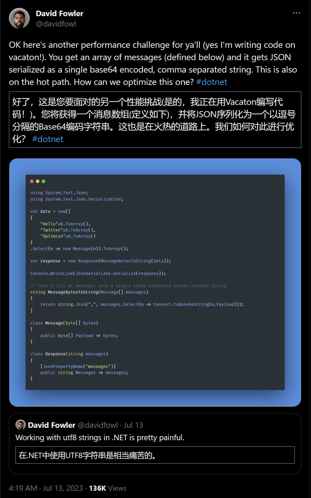
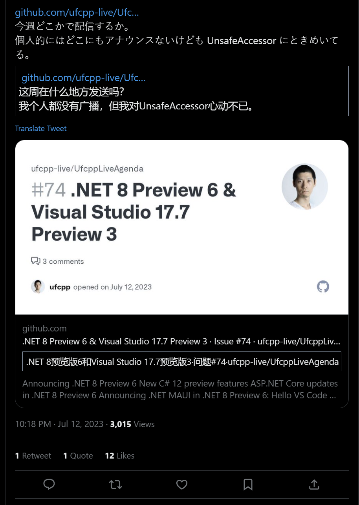
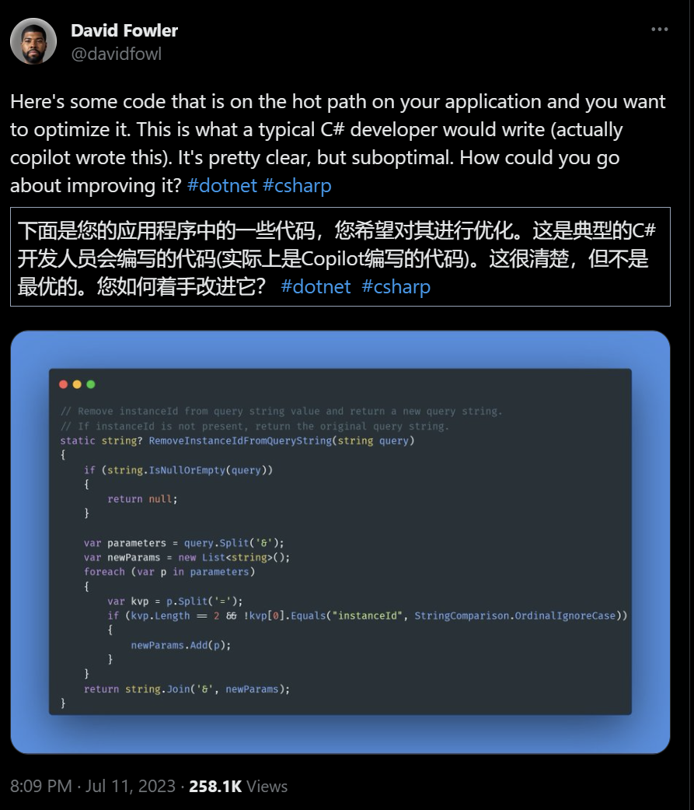

## 国内文章

### 揭秘 .NET 中的 TimerQueue（上）

https://www.cnblogs.com/eventhorizon/p/17557821.html

TimerQueue 是.NET中实现定时任务的核心组件，它是一个定时任务的管理器，负责存储和调度定时任务。它被用于实现很多 .NET 中的定时任务，比如 System.Threading.Timer、Task.Delay、CancellationTokenSource 等。

笔者将用两篇文章为大家介绍 TimerQueue 的实现原理，本篇文章将以 System.Threading.Timer 为入口，揭秘 TimerQueue 对定时任务基本单元 TimerQueueTimer的管理和调度，下一篇文章将介绍 TimerQueue 又是如何通过 native timer 被触发的。

### 如何使用C#中的Lambda表达式操作Redis Hash结构，简化缓存中对象属性的读写操作

https://www.cnblogs.com/anech/p/17556457.html

Redis是一个开源的、高性能的、基于内存的键值数据库，它支持多种数据结构，如字符串、列表、集合、散列、有序集合等。其中，Redis的散列（Hash）结构是一个常用的结构，今天跟大家分享一个我的日常操作，如何使用Redis的散列（Hash）结构来缓存和查询对象的属性值，以及如何用Lambda表达式树来简化这个过程。

### Thread 和 ThreadPool 简单梳理（C#）【并发编程系列】

https://www.cnblogs.com/czzj/p/ThreadPool.html

对于 Thread 和 ThreadPool 已经是元老级别的类了。Thread 是 C# 语言对线程对象的封装，它从 .NET 1.0 版本就有了，然后 ThreadPool 是 .Net Framework 2.0 版本中出现的，都是相当成熟的存在。
当然，现在已经出现了 Task 和 PLinq 等更高效率的并发类，线程和线程池在实际开发中逐渐减少了，但是不能不知道他们的用法，因为总有需要对接的内容，别人用了你也得能看懂。
本文将结合示例，简单介绍下 Thread 和 ThreadPool。

### Blazor资源大全，很棒的Blazor

https://www.cnblogs.com/hejiale010426/p/17553901.html

一个收集了很棒的Blazor资源的集合。

Blazor是一个使用C#/Razor和HTML在浏览器中运行的.NET Web框架。

欢迎贡献！请先查看贡献指南。感谢所有的贡献者，你们真棒，没有你们就不可能实现这个！

如果你需要在这个列表中搜索，你可以尝试这个很棒的网站：Awesome Blazor Browser。感谢@jsakamoto提供这个！源代码

### 以纯二进制的形式在内存中绘制一个对象

https://www.cnblogs.com/artech/p/17551034.html

一个对象总是映射一块连续的内存序列（不考虑对象之间的引用关系），如果我们知道了引用类型实例的内存布局，以及变量引用指向的确切的地址，我们不仅可以采用纯“二进制”的方式在内存“绘制”一个指定引用类型的实例，还能直接通过改变二进制内容来更新实例的状态。

### WinUI（WASDK）使用MediaPipe检查人体姿态关键点

https://www.cnblogs.com/GreenShade/p/17552324.html

之前有用这个MediaPipe.NET .NET包装库搞了手势识别，丰富了稚晖君的ElectronBot机器人的第三方上位机软件的功能，MediaPipe作为谷歌开源的机器视觉库，功能很丰富了，于是就开始整活了，来体验了一把人体姿态关键点检测。

### 记一次 .NET 某游戏服务后端 内存暴涨分析

https://www.cnblogs.com/huangxincheng/p/17550195.html

前几天有位朋友找到我，说他们公司的后端服务内存暴涨，而且CPU的一个核也被打满，让我帮忙看下怎么回事，一般来说内存暴涨的问题都比较好解决，就让朋友抓一个 dump 丢过来，接下来我们用 WinDbg 一探究竟。

### 调用内部或私有方法的N种方法

https://www.cnblogs.com/artech/p/17547246.html

非公开的类型或者方法被“隐藏”在程序集内部，本就不希望从外部访问，但是有时候调用一个内部或者私有方法可能是唯一的“救命稻草”，这篇文章列出了几种具体的实现方式。以如下这个Foobar类型为例，它具有一个内部属性InternalValue，我们来看看有多少种方式可以从外部获取一个Foobar对象的InternalValue属性值。

```cs
public class Foobar
{
    internal int InternalValue => 123;
}
```

### 使用C#编写.NET分析器（完结）

https://www.cnblogs.com/InCerry/p/writing-a-net-profiler-in-c-sharp-part-4.html

这是在Datadog公司任职的Kevin Gosse大佬使用C#编写.NET分析器的系列文章之一，在国内只有很少很少的人了解和研究.NET分析器，它常被用于APM（应用性能诊断）、IDE、诊断工具中，比如Datadog的APM，Visual Studio的分析器以及Rider和Reshaper等等。之前只能使用C++编写，自从.NET NativeAOT发布以后，使用C#编写变为可能。

笔者最近也在尝试开发一个运行时方法注入的工具，欢迎熟悉MSIL 、PE Metadata 布局、CLR 源码、CLR Profiler API的大佬，或者对这个感兴趣的朋友留联系方式或者在公众号留言，一起交流学习。

### 零基础如何自学C#?

https://www.cnblogs.com/Can-daydayup/p/17539010.html

本文来源于知乎的一个提问，提问的是一个大一软件工程专业的学生，他想要自学C#但是不知道该怎么去学，这让他感到很迷茫，希望有人能给他一些建议和提供一些学习方向。

### .NET 8 Preview 6发布，支持新的了Blazor呈现方案 和 VS Code .NET MAUI 扩展

https://www.cnblogs.com/shanyou/p/17546509.html

2023年7月11日 .NET 8 Preview 6，.NET 团队在官方博客发布了系列文章：

- [Announcing .NET 8 Preview 6](https://devblogs.microsoft.com/dotnet/announcing-dotnet-8-preview-6/)[1]
- [ASP.NET Core updates in .NET 8 Preview 6](https://devblogs.microsoft.com/dotnet/asp-net-core-updates-in-dotnet-8-preview-6/)[2]
- [Announcing .NET MAUI in .NET 8 Preview 6: Hello VS Code & VS for Mac](https://devblogs.microsoft.com/dotnet/announcing-dotnet-maui-in-dotnet-8-preview-6/)[3]
- [New C# 12 preview features](https://devblogs.microsoft.com/dotnet/new-csharp-12-preview-features/)[4]

这个版本是倒数第二个预览版，其中包含大量库更新、新的 WASM 模式、更多source generators、持续的性能改进以及 iOS 上的 NativeAOT 支持等。

### 为什么应该尽可能避免在静态构造函数中初始化静态字段？

https://www.cnblogs.com/artech/p/17535283.html

C#具有一个默认开启的代码分析规则：[CA1810]Initialize reference type static fields inline，推荐我们以内联的方式初始化静态字段，而不是将初始化放在静态构造函数中。

### C/C++包装器SWIG使用指南

[SWIG包装器使用指南——（一）基本概念](https://catshitone.blog.csdn.net/article/details/129838746)
[SWIG包装器使用指南——（二）C++代码的包装](https://catshitone.blog.csdn.net/article/details/129895200)
[SWIG包装器使用指南——（三）Typemap 类型映射](https://catshitone.blog.csdn.net/article/details/129896510)
[SWIG包装器使用指南——（四）C#使用SWIG简介与实践](https://catshitone.blog.csdn.net/article/details/129899584)

SWIG （Simplified Wrapper and Interface Generator）是一个exe小工具，主要用来包装已有的 C/C++ 代码并生成目标语言（C#、Java、Lua、Python等）代码。可以极大简化目标语言到C/C++的调用。上述文章对SWIG的使用做了基本介绍并结合C#调用到C++时的一些常见问题做了举例说明。

## 主题

### 宣布 .NET 8 预览版 6 - .NET 博客
https://devblogs.microsoft.com/dotnet/announcing-dotnet-8-preview-6/

.NET 8 预览版 6 已发布。

- 改进的System.Text.Json
    - `JsonStringEnumConverter<TEnum>`
    - JsonConverter.Type
- 基于流的 ZipFile.CreateFromDirectory 和 ExtractToDirectory 方法重载
- MetricCollector 指标 API
- 选项验证源生成器
- 扩展 LoggerMessageAttribute 构造函数重载以增强功能
- 改进的配置绑定源生成器
- COM 与源生成器的互操作性
- HTTPS代理支持
- 系统安全：SHA-3 支持
- SDK：容器发布性能和兼容性
- WASM 中的混合全球化模式
- 支持针对 iOS 平台的 NativeAOT
- 代码生成器
    - 改进的JIT
    - AVX-512 支持
    - 改进的 Arm64

### 在 .NET 8 预览版 6 中宣布 .NET MAUI：Hello VS Code 和 VS for Mac - .NET 博客
https://devblogs.microsoft.com/dotnet/announcing-dotnet-maui-in-dotnet-8-preview-6/

.NET 8 Preview 6 中对 .NET MAUI 的更新。

除了 Visual Studio Preview 之外，此版本还包含 Visual Studio Code 的扩展作为预览版。它还可作为 Visual Studio for Mac 中的预览功能使用。


### 宣布推出 Visual Studio Code 的 .NET MAUI 扩展 - Visual Studio 博客
https://devblogs.microsoft.com/visualstudio/announcing-the-dotnet-maui-extension-for-visual-studio-code/

Visual Studio Code 的 .NET MAUI 扩展预览版。

此扩展提供 Windows、macOS 和 Linux 上的 .NET MAUI 开发，并支持在任何目标（例如不同的设备或模拟器）上进行开发和调试。许可证是 Visual Studio 许可证，就像 C# Dev Kit 一样。

### .NET 8 Preview 6 中的 ASP.NET Core 更新 - .NET 博客
https://devblogs.microsoft.com/dotnet/asp-net-core-updates-in-dotnet-8-preview-6/

.NET 8 Preview 6 中 ASP.NET Core 的更新。

- 改进启动调试体验
- Blazor
  - 服务器端渲染表单模型绑定和验证
    - 增强的页面导航和表单处理
    - 在流式渲染中保留现有的 DOM 元素
    - 在调用者中指定组件渲染模式
    - Blazor WebAssembly 交互式渲染
    - 部分改进
    - 将查询字符串级联到 Blazor 组件
    - 用于服务器交互的 Blazor Web App 模板选项
    - Blazor 模板集成指标
    - ASP.NET Core 应用程序的测试指标
  - 新的、改进的和重命名的计数器
- API 编写
    - 最小 API 中的复杂表单绑定支持
- 服务器和中间件
    - HTTP.sys 内核响应缓冲
    - 基于Redis的输出缓存

### 新的 C# 12 预览功能 - .NET 博客
https://devblogs.microsoft.com/dotnet/new-csharp-12-preview-features/

引入新的 C# 12 预览功能。

- 通过“nameof”访问接口成员
- 内联数组
- 拦截器
    - 干预源生成器现有方法调用的机制
    - 作为实验性功能实现，需要自己的开关启用

### .NET 2023 年 7 月更新 – .NET 7.0.9、.NET 6.0.20 - .NET 博客
https://devblogs.microsoft.com/dotnet/july-2023-updates/

.NET 7.0.9 和 6.0.20 发布。

此版本包含多项安全修复和改进。

- CVE-2023-33127 – .NET 远程代码执行漏洞
    - .NET 诊断服务器中的权限提升和代码执行
- CVE-2023-33170 – .NET 安全功能绕过漏洞
    - 帐户锁定最大尝试次数未在 ASP.NET Core 中更新

### .NET Framework 2023 年 7 月安全和质量汇总更新 - .NET 博客
https://devblogs.microsoft.com/dotnet/dotnet-framework-july-2023-security-and-quality-rollup-updates/.NET Framework 2023 年 7 月累积安全和质量更新已发布。

### 引入带有新 API 和场景的 System.Web Adaptor v1.2 - .NET 博客
https://devblogs.microsoft.com/dotnet/systemweb-adapters-1_2/

System.Web Adaptor v1.2 已发布。

此版本添加了对 IHttpModule 的支持和模拟，包括 ASP.NET Core 中的 HttpApplication、自定义会话密钥序列化程序、IHtmlString 支持和其他 API。

本文还提供了增量迁移的指导。

### ReSharper 和 Rider 2023.2 EAP 9 中的扩展 C# 支持 | .NET 工具博客
https://blog.jetbrains.com/dotnet/2023/07/14/rsrp-rider-2023-2-eap9/

ReSharper 和 Rider 2023 EAP 9 发布。

此版本带来了一些改进，例如对主构造函数的更好的 C# 12 预览支持、IAsyncDisposable 支持以及更好的丢弃“_”支持。

### 通过 Microsoft Dev Box 充分利用 Visual Studio - 现已全面上市 - Visual Studio 博客
https://devblogs.microsoft.com/visualstudio/get-the-most-from-visual-studio-with-microsoft-dev-box-now-generally-available/

Microsoft Dev Box 现已全面上市。


## 文章、幻灯片等
### ReSharper 2023.2 EAP 8：比较 ReSharper 和 dotPeek 中的程序集，以及更多 C++ 功能 | .NET 工具博客
https://blog.jetbrains.com/dotnet/2023/07/10/resharper-2023-2-eap-8/

引入 ReSharper 2023.2 EAP 8 中的新功能。

添加了在 ReSharper 和 dotPeek 中查看程序集比较差异的功能。

### 集成测试 Postgres 与 testcontainers-dotnet
https://dev.to/kashifsoofi/integration-test-postgres-with-testcontainers-dotnet-1gkn

如何使用 testcontainers-dotnet 与 PostgreSQL 进行集成测试。

### Silverlight 不会消亡：“XAML for Blazor”到来 -- Visual Studio 杂志
https://visualstudiomagazine.com/articles/2023/07/13/xaml-blazor.aspx

Blazor 的 XAML 简介，它允许您从 Userware 将 XAML 与 Blazor 结合使用。

### 如何防止屏幕在 Blazor 中运行一段时间后关闭
https://dev.to/this-is-learning/how-to-prevent-the-screen-turn-off-after-a-while-in-blazor-4b29

如何使用 Blazor 中的屏幕唤醒锁定 API 防止屏幕休眠。

### 最小的 .NET Hello World 二进制文件有多小？
https://blog.washi.dev/posts/tinysharp/

尝试使显示 Hello World 的 .NET 应用程序尽可能小。

本文使用各种技术将 4.6KB 的可执行文件缩小到 834 字节。

### 最小 API AOT 编译模板：探索 .NET 8 预览 - 第 2 部分
https://andrewlock.net/exploring-the-dotnet-8-preview-the-minimal-api-aot-template/

.NET 8 预览版中最小 API 的 AOT 模板说明。

### 我终于在 .NET 中找到了登录的用途！
https://martinjt.me/2023/07/14/i-finally-found-a-use-for-logging-in-net/

在错误配置对 OpenTelemetry 的跟踪时获取错误日志的技术。

由于导出器在后台运行，即使发生错误，也不会出现在表中，因此事件由EventListener获取。

### 在题为“如何优化 .NET + Lambda 性能”的视频会议中发表讲话 #devio2023 | DevelopersIO
https://dev.classmethod.jp/articles/devio2023-video-57-dotnet/

将 .NET 与 AWS Lambda 结合使用时，使用 NativeAOT 提高冷启动性能。

### 探索 .NET 8 中的 Blazor 更改 - 服务器端渲染 (SSR)
https://jonhilton.net/blazor-ssr/

.NET 8 中 Blazor 的服务器端渲染简介

### Azure AD 重命名为 Microsoft Entra ID 对于 .NET 开发人员意味着什么？ - .NET 博客

https://devblogs.microsoft.com/dotnet/azure-ad-microsoft-entra/

Azure Active Directory (Azure AD) 品牌重塑为 Entra Identity 对 .NET 开发人员有何影响。

对现有代码不会产生影响，因为库和 URL 不会更改。

### 在 JetBrains Rider 中调试源生成器 | .NET 工具博客
https://blog.jetbrains.com/dotnet/2023/07/13/debug-source-generators-in-jetbrains-rider/

Rider 中的源生成器调试简介。

本文涵盖了调试 Source Generator 生成的代码、调试 Source Generator 本身以及 Roslyn 模板。

### 标题栏和主题：WinUI 冒险
https://inthehand.com/2023/07/11/titlebars-and-themes-a-winui-adventure/

有关调整 WinUI 标题栏中的窗口按钮和任务栏预览中的图标以匹配 Windows 外观的提示。

### 如何在 C# 单元测试中的测试输出中显示 ILogger 日志
https://zenn.dev/jtechjapan/articles/d10e9e9c0d5bbe

如何在单元测试中通过Microsoft.Extensions.Logging的ILogger进行测试输出。

本文展示了如何使用 MartinCostello.Logging.XUnit 包。

### dotTrace 加入 BenchmarkDotNet | .NET 工具博客
https://blog.jetbrains.com/dotnet/2023/07/11/dottrace-comes-to-benchmarkdotnet/

关于 BenchmarkDotNet 0.13.6 中引入的 dotTrace 集成。

DotTraceDiagnoser 允许在基准测试期间进行分析。打开快照需要 dotTrace 许可证。

### 将 WebApplication.CreateBuilder() 与新的 CreateSlimBuilder() 方法进行比较：探索 .NET 8 预览 - 第 3 部分
https://andrewlock.net/exploring-the-dotnet-8-preview-comparing-createbuilder-to-the-new-createslimbuilder-method/

关于 .NET 8 中 ASP.NET Core 中引入的“WebApplication.CreateSlimBuilder”。

它详细介绍了使用 AOT 受限配置启动的构建器。

### 里程碑：VideoLAN .NET NuGet 包下载量达到 200 万次
https://dev.to/mfkl/milestone-2-million-downloads-for-videolan-net-nuget-packages-k1e

VideoLAN .NET NuGet包账户总下载量突破200万次下载及未来发展。

它涉及 LibVLC 4 支持、Unity、Uno 平台和商业许可证。

### Windows、Visual Studio 和 .NET 的支持状态 (2023.07) - Qiita
https://qiita.com/mmake/items/946aea0d9a195aa5e3d4

Windows 和 Visual Studio、.NET 和 .NET Framework 支持日期以及支持的操作系统组合的摘要。

### Cake v3.1.0 发布
https://cakebuildnet.medium.com/cake-v3-1-0-released-c42728359d25

Cake v3.1.0 已发布。

此版本包含多项改进。

### 尝试了 Dev Drive，在 Build 2023 上宣布并在 Windows 11 Insider Preview 中提供 - Shibayan 其他
https://blog.shibayan.jp/entry/20230710/1688920344

关于尝试在 Windows 11 Insider Preview 中提供的开发卷 Dev Drive。

它还涉及使用 .NET 实际构建的结果以及如何利用写入时复制。

### 让我们学习 .NET - Web 开发（日语）- YouTube
https://www.youtube.com/watch?v=YbYwWaJsbwM

用于学习使用 Visual Studio Code 通过 HTML/CSS、ASP.NET Core Razor Pages 等进行 .NET 开发的视频。

https://twitter.com/aspnet/status/1678569803554930689?s=12


## 库、存储库、工具等。

### MSBuild 编辑器 - Visual Studio Marketplace
https://marketplace.visualstudio.com/items?itemName=mhutch.MSBuildEditor

用于在 Visual Studio 中编辑 MSBuild 文件的扩展。

https://twitter.com/mjhutchinson/status/1679272936195194885?s=12## 网站、文档等
### 推文
https://twitter.com/davidfowl/status/1679223885256957952?s=12



---

https://twitter.com/ufcpp/status/1679133008882704384?s=12



---



https://twitter.com/davidfowl/status/1678738294933159937?s=12&t=ggvrrZ7oLogHyNoIGNgjbw

## 版权声明

* 国内板块由 InCerry 进行整理 : https://github.com/InCerryGit/WeekRef.NET
* 其余内容来自 Myuki WeekRef，由InCerry翻译（已获得授权） : https://github.com/mayuki/WeekRef.NET

**由于笔者没有那么多时间对国内的一些文章进行整理，欢迎大家为《.NET周刊-国内文章》板块进行贡献，需要推广自己的文章或者框架、开源项目可以下方的项目地址提交Issue或者在我的微信公众号私信。**

格式如下：

* 10~50字左右的标题
* 对应文章或项目网址访问链接
* 200字以内的简介，如果太长会影响阅读体验

https://github.com/InCerryGit/.NET-Weekly

## .NET性能优化交流群

相信大家在开发中经常会遇到一些性能问题，苦于没有有效的工具去发现性能瓶颈，或者是发现瓶颈以后不知道该如何优化。之前一直有读者朋友询问有没有技术交流群，但是由于各种原因一直都没创建，现在很高兴的在这里宣布，我创建了一个专门交流.NET性能优化经验的群组，主题包括但不限于：

* 如何找到.NET性能瓶颈，如使用APM、dotnet tools等工具
* .NET框架底层原理的实现，如垃圾回收器、JIT等等
* 如何编写高性能的.NET代码，哪些地方存在性能陷阱

希望能有更多志同道合朋友加入，分享一些工作中遇到的.NET性能问题和宝贵的性能分析优化经验。**目前一群已满，现在开放二群。**

如果提示已经达到200人，可以加我微信，我拉你进群: **lishi-wk**

另外也创建了**QQ群**，群号: 687779078，欢迎大家加入。 

## 抽奖送书活动预热！！！

感谢大家对我公众号的支持与陪伴！为庆祝公众号一周年，抽奖送出一些书籍，请大家关注公众号后续推文！

