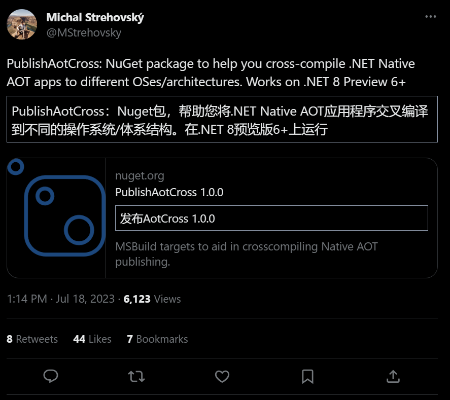
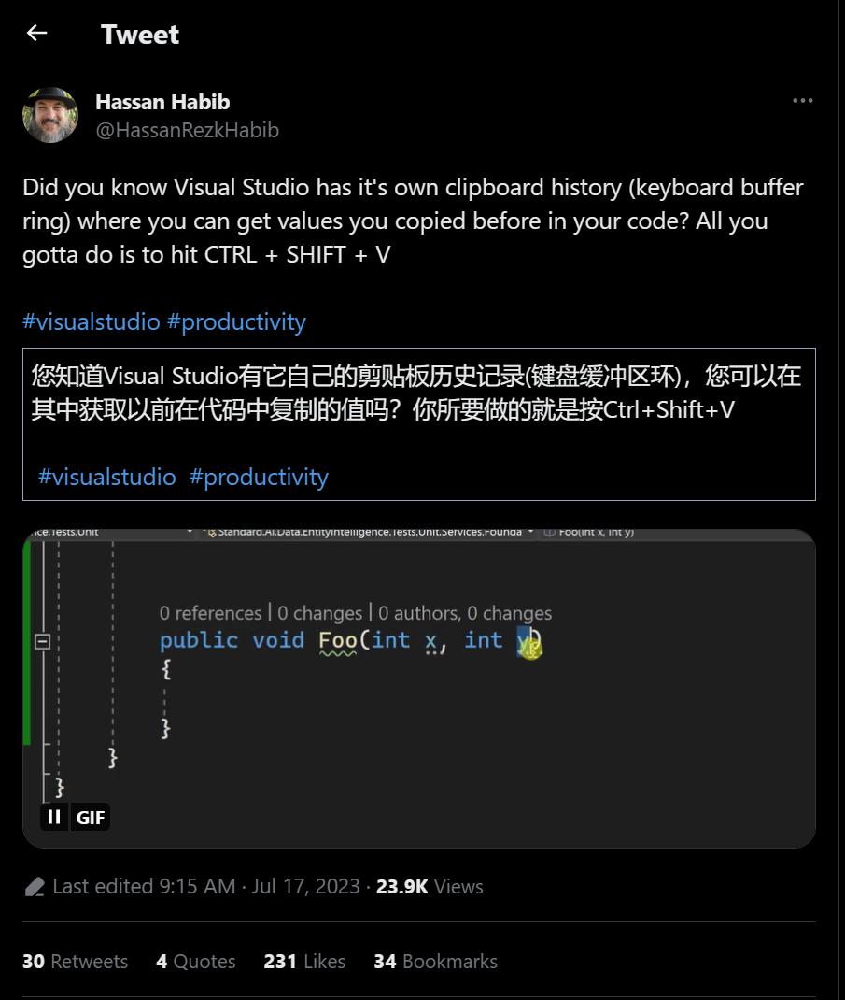
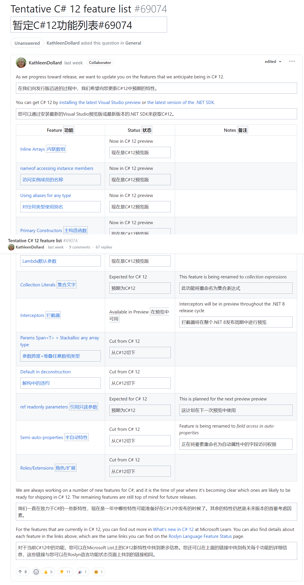

## 国内文章

### 你知道.NET的字符串在内存中是如何存储的吗？

https://www.cnblogs.com/artech/p/string-memory-layout.html

毫无疑问，字符串是我们使用频率最高的类型。但是如果我问大家一个问题：“一个字符串对象在内存中如何表示的？”，我相信绝大部分人回答不上来。我们今天就来讨论这个问题。

### 使用 C# 进行AI工程开发-基础篇（四）：dotnet script 与 Polyglot

https://zhuanlan.zhihu.com/p/645258959

本篇介绍两个工具，有了它们，csharp 可以获得类似 python 的使用体验。这两个工具，一个是脚本工具 dotnet script，另一个是笔记工具 polyglot，vscode 对它们的支持都非常好。

### Int64针对32位架构是按照4字节还是8字节对齐？

https://www.cnblogs.com/artech/p/17560866.html

作为构建.NET的标准，CLI Spec（[ECMA-335](https://github.com/stakx/ecma-335/blob/master/docs/i.12.6.2-alignment.md)）针对基元类型的对齐规则具有如下的描述。按照这个标准，我们是这么理解的：8字节的数据类型（int64、unsigned int64和float64）根据采用的机器指令架构选择4字节或者8字节对其。进一步来说，它们在x86/x64机器上的对其字节分别为4字节和8字节。

### 关于 async 和 await 两个关键字（C#）【并发编程系列】

https://www.cnblogs.com/czzj/p/async_await.html

对于 async 和 await 两个关键字，对于一线开发人员再熟悉不过了，到处都是它们的身影。

从 C# 5.0 时代引入 async 和 await 关键字，我们使用 async 修饰符可将方法、lambda 表达式或匿名方法指定为异步。 如果对方法或表达式使用此修饰符，则其称为异步方法。async 和 await 通过与 .NET Framework 4.0 时引入的任务并行库（TPL：Task Parallel Library）构成了新的异步编程模型，即 TAP(基于任务的异步模式 Task-based asynchronous pattern)。

但是如果对他们不太了解的话，会有很多麻烦出现，所以最近查了一些资料，也看了几个大佬的介绍，今天来记录汇总下。

### PerfView专题 (第十五篇)： 如何洞察 C# 中的慢速方法

https://www.cnblogs.com/huangxincheng/p/17571032.html

在 dump 分析旅程中，经常会遇到很多朋友反馈一类问题，比如：

- 方法平时都执行的特别快，但有时候会特别慢，怎么排查？
- 我的方法第一次执行特别慢，能看到慢在哪里吗？

相信有朋友肯定说，加些日志不就好了，大方向肯定是没问题的，但加日志的颗粒度会比较粗而且侵入性也比较大，比如说这个方法不是你的，或者说这个方法是操作系统的，一般情况下对他们无法干涉，那如何洞察在你作用域之外的方法性能呢？作为 CLR团队首推的 PerfView 性能分析工具，必须要 KO 这些问题，接下来我们就简单聊一聊。

### PerfView专题 (第十四篇)： 洞察那些 C# 代码中的短命线程

https://www.cnblogs.com/huangxincheng/p/17564671.html

这篇文章源自于分析一些疑难dump的思考而产生的灵感，在dump分析中经常要寻找的一个答案就是如何找到死亡线程的生前都做了一些什么？

### 用 perfcollect 洞察 Linux 上.NET程序 CPU爆高

https://www.cnblogs.com/huangxincheng/p/17561965.html

如果要分析 Linux上的 .NET程序 CPU 爆高，按以往的个性我肯定是抓个 dump 下来做事后分析，这种分析模式虽然不重但也不轻，还需要一定的底层知识，那有没有傻瓜式的 CPU 爆高分析方式呢？

### 理解ASP.NET Core - 限流（Rate Limiting） 

https://www.cnblogs.com/xiaoxiaotank/p/17560251.html

在微服务化的架构设计中，网关扮演着重要的看门人角色，它所提供的功能之一就是**限流**。而对于众多非微服务化的系统来说，可能并不会部署网关（无论是因为成本还是复杂度），在这种场景下，为了实现**限流**，微软在 .NET 7 中提供了官方的限流中间件。下面我们一起来看一下。

### PerfView专题 (第十三篇)：洞察 .NET程序 的非托管句柄泄露

https://www.cnblogs.com/huangxincheng/p/17559370.html

前几天写了一篇 `如何洞察 .NET程序 非托管句柄泄露` 的文章，文中使用 WinDbg 的 `!htrace` 命令实现了句柄泄露的洞察，在文末我也说了，WinDbg 是以侵入式的方式解决了这个问题，在生产环境中大多数情况下是不能走附加进程的模式，所以这也是它最大的局限性。

那如何以`非侵入`的方式解决这个问题呢？这就是本篇讨论的重点，对，就是用 `CLR 团队` 鼎力推荐的 Perfview 来解决这个问题，哈哈，是我昨天看文档无意发现的 😁😁😁。

### MAUI 框架开发 将 MAUI 嵌入到 WPF 控件里 

https://www.cnblogs.com/lindexi/p/17566552.html

本文将介绍如何将 MAUI 的底层替换为 WPF 框架层，且将 MAUI 的内容嵌入到 WPF 的一个控件里面，无 UI 框架嵌入的空域问题

本文是 MAUI 框架开发博客，而不是 MAUI 应用开发博客，本文更多介绍的是进行 MAUI 这个框架的开发内容。

### MAUI Blazor 显示本地图片的新思路

https://www.cnblogs.com/Yu-Core/p/17571292.html

好久没写文章了，水一篇，关于MAUI Blazor 显示本地图片这个问题，有大佬发过了。就是 [token](https://www.cnblogs.com/hejiale010426) 大佬的那篇[Blazor Hybrid （Blazor混合开发）更好的读取本地图片](https://www.cnblogs.com/hejiale010426/p/17073079.html)，主要思路就是读取本地图片，通过C#与JS互操作，将byte[]传给js，生成blob，图片的src中填写根据blob生成的url。

我之前一直使用这个办法，简单的优化了一下，无非也就是增加缓存。但是这种方法的弊端也是很明显的：

1. img的src每一次并不固定，需要替换
2. Android端加载体积比较大的图片的速度，特别特别慢

所以有没有一种办法能够解决这两个问题，思考了很久，终于有了思路，**拦截网络请求/响应，读取本地文件并返回响应**搜索了一下，C#/MAUI中没有太好的拦截办法，只能从Webview下手，理论已有，实践开始。

## 主题

### 【英文】.NET Lambda 注释框架现已全面推出 | Amazon Web Services
https://aws.amazon.com/jp/blogs/developer/net-lambda-annotations-framework/

.NET Lambda 注释框架现已正式发布。

.NET Lambda Annotations Framework 是一种允许您通过基于 Source Generator 设置属性来实现 AWS Lambda 函数的机制。

### 【英文】宣布推出 Appwrite .NET SDK（测试版）🚀 · appwrite/appwrite · 讨论 #5820
https://github.com/appwrite/appwrite/discussions/5820

.NET SDK for Appwrite（自托管 BaaS）发布 Beta 版。

- [使用 .NET 和 Appwrite 构建 Todo API](https://dev.to/appwrite/build-a-todo-api-with-net-and-appwrite-218d)

### 【英文】NATS .NET 客户端 v2 Alpha 发布，支持Core NATS
https://nats.io/blog/nats-dotnet-v2-alpha-release/

.NET alpha 版本的 NATS 客户端 v2 已发布。

新版本基于 AlterNats，旨在成为使用现代 .NET 功能的高性能库。当前版本仅支持Core NATS，但我们计划将来支持JetStream。

- [neue cc - AlterNats 已被官方 NATS .NET 客户端 v2 接管](https://neue.cc/2023/07/20_nats_client_v2.html)

### 【英文】ReSharper 和 Rider 2023.1.4 错误修复版本已发布！ | .NET 工具博客
https://blog.jetbrains.com/dotnet/2023/07/18/rsrp-rd-2023-1-4-bugfix/

ReSharper 和 Rider 2023.1.4 发布。

此版本修复了一些错误。

### 【英文】Rider 2023.2 EAP 10 已发布！ | .NET 工具博客
https://blog.jetbrains.com/dotnet/2023/07/21/rider-2023-2-eap-10/

Rider 2023.2 EAP 10 已发布。

此版本将 AI 助手分离为插件，支持实时编码和 Unreal 热重载。

### 【英文】ReSharper 2023.2 EAP 10 来了！ | .NET 工具博客
https://blog.jetbrains.com/dotnet/2023/07/21/resharper-2023-2-eap-10/

ReSharper 2023.2 EAP 10 已发布。

此版本取消了 AI 助手的捆绑，并将其作为 dotUltimate 的独立产品安装。

## 文章、幻灯片等

### 【英文】引入强大的新扩展管理器 - Visual Studio 博客
https://devblogs.microsoft.com/visualstudio/introducing-a-powerful-new-extension-manager/

在 Visual Studio 17.7 Preview 3 中引入新的扩展管理器。

### 【英文】使用 Entity Framework Core 对现有数据库进行逆向工程 | .NET 工具博客
https://blog.jetbrains.com/dotnet/2023/07/20/reverse-engineering-existing-databases-with-entity-framework-core/

如何使用 Entity Framework Core 从现有数据库（脚手架）创建定义。

### 【日文】函数调用来到了Azure OpenAI，所以我尝试使用.NET SDK检查操作
https://zenn.dev/microsoft/articles/dotnet-sdk-openai-functioncalling

关于尝试使用 Azure.AI.OpenAI 调用 Azure OpenAI 服务的函数。

### 【英文】ASP.NET 中的响应压缩
https://dev.to/fabriziobagala/response-compression-in-aspnet-8ba

关于 ASP.NET Core 中的响应压缩。

它涵盖了如何启用它以及实现自定义压缩提供程序等内容。

### 【日文】使用语义内核将人工智能合并到应用程序中
https://zenn.dev/microsoft/articles/semantic-kernel-17

使用语义内核将人工智能嵌入到 Web 应用程序中。

### 【日文】.NET 8 Preview 6 中的新 BlazorWebApp 模板
https://zenn.dev/tomokusaba/articles/0eb9cdbb616d10

在 .NET 8 Preview 6 中引入新的 Blazor Web 应用程序模板。

### 【英文】EditorConfig、代码样式和配置代码检查 | .NET 工具博客

https://blog.jetbrains.com/dotnet/2023/07/18/editorconfig-code-style-and-configuring-code-inspections/

使用 EditorConfig 在 Rider 和 ReSharper 中引入代码样式和代码检查。

### 【英文】使用 C#/.NET 中的 SIMD 矢量化代码实现 10 倍性能 | xoofx
https://xoofx.com/blog/2023/07/09/10x-performance-with-simd-in-csharp-dotnet/

解释如何优化 SIMD 性能以使速度提高 10 倍。

例如通用 SIMD 版本和 CPU 特定 SIMD 中的优化。

### 【英文】探索新的最小 API 源生成器：探索 .NET 8 预览 - 第 4 部分
https://andrewlock.net/exploring-the-dotnet-8-preview-exploring-the-new-minimal-api-source-generator/

解释 .NET 8 预览版中 ASP.NET Core Minimal API 中的源生成器支持及其工作原理。

### 【英文】打开的选项卡太多？没问题！- Visual Studio 博客
https://devblogs.microsoft.com/visualstudio/too-many-tabs-open-no-problem/

关于在 Visual Studio 中显示多个选项卡时尝试允许滚动。

它现在作为扩展提供，并开放征求反馈。

* [滚动选项卡 - Visual Studio Marketplace](https://marketplace.visualstudio.com/items?itemName=MadsKristensen.ScrollTabs)

### 【日文】 (C#) 重载不同的通用类型约束 - Bell Tolls for Cats
https://ikorin2.hatenablog.jp/entry/2023/07/18/145555

创建具有不同泛型约束的重载方法的技术。

### 【英文】使用 nanoFramework 控制我的空调设备
https://dev.to/mrcsharp/controlling-my-ac-unit-with-nanoframework-1a5k

尝试使用 nanoFramework 和 ESP32 控制空调。

### 【英文】从明天开始就可以使用的 ASP.NET Core 日志记录技术！
https://speakerdeck.com/nenonaninu/ming-ri-karashi-eru-asp-dot-net-core-rogingushu

有关 ASP.NET Core 中日志记录的讨论。它还介绍了请求跟踪等内容。

## 库、存储库、工具等。
### microsoft/semantic-memory：使用 LLM 和自然语言索引和查询任何数据。
https://github.com/microsoft/semantic-memory

用于使用与语义内核配合使用的自定义数据管道进行索引和查询的库。

### riok/mapperly：用于生成对象映射的 .NET 源生成器。无运行时反射。
https://github.com/riok/mapperly

用于映射（传输数据）基于源生成器的对象的库。

## 网站、文档等
### 推文

一个 NuGet 包，允许您为不同的平台和操作系统执行 NativeAOT。

https://twitter.com/mstrehovsky/status/1681170442269364225?s=12

---

Avalonia XPF（跨平台 WPF 产品）私人预览版提交开放。

https://twitter.com/avaloniaui/status/1681189307023851520?s=12

---

Visual Studio 有自己的剪贴板历史。

https://twitter.com/hassanrezkhabib/status/1680748023729762304?s=12

## 深入探索

### 暂定 C# 12 功能列表 dotnet/roslyn 讨论 #69074
https://github.com/dotnet/roslyn/discussions/69074

目前的初步 C# 12 功能列表。

## 版权声明

* 国内板块由 InCerry 进行整理 : https://github.com/InCerryGit/WeekRef.NET
* 其余内容来自 Myuki WeekRef，由InCerry翻译（已获得授权） : https://github.com/mayuki/WeekRef.NET

**由于笔者没有那么多时间对国内的一些文章进行整理，欢迎大家为《.NET周刊-国内文章》板块进行贡献，需要推广自己的文章或者框架、开源项目可以下方的项目地址提交Issue或者在我的微信公众号私信。**

格式如下：

* 10~50字左右的标题
* 对应文章或项目网址访问链接
* 200字以内的简介，如果太长会影响阅读体验

https://github.com/InCerryGit/.NET-Weekly

## .NET性能优化交流群

相信大家在开发中经常会遇到一些性能问题，苦于没有有效的工具去发现性能瓶颈，或者是发现瓶颈以后不知道该如何优化。之前一直有读者朋友询问有没有技术交流群，但是由于各种原因一直都没创建，现在很高兴的在这里宣布，我创建了一个专门交流.NET性能优化经验的群组，主题包括但不限于：

* 如何找到.NET性能瓶颈，如使用APM、dotnet tools等工具
* .NET框架底层原理的实现，如垃圾回收器、JIT等等
* 如何编写高性能的.NET代码，哪些地方存在性能陷阱

希望能有更多志同道合朋友加入，分享一些工作中遇到的.NET性能问题和宝贵的性能分析优化经验。**目前一群已满，现在开放二群。**

如果提示已经达到200人，可以加我微信，我拉你进群: **lishi-wk**

另外也创建了**QQ群**，群号: 687779078，欢迎大家加入。 

## 抽奖送书活动预热！！！

感谢大家对我公众号的支持与陪伴！为庆祝公众号一周年，抽奖送出一些书籍，请大家关注公众号后续推文！

