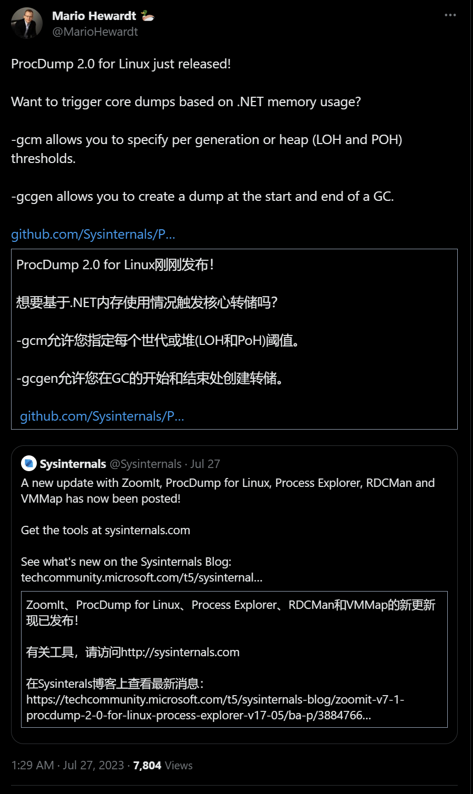
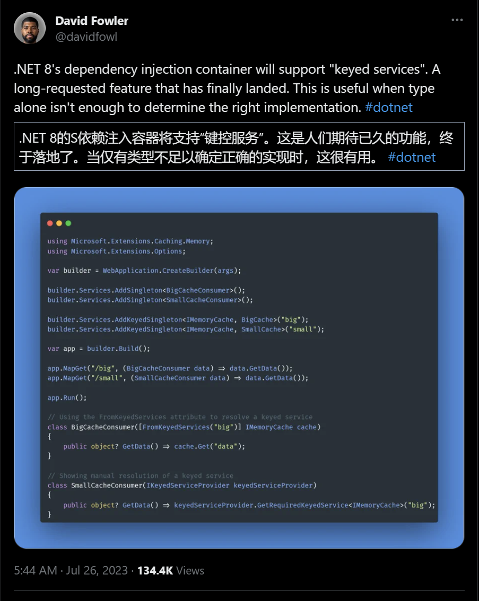
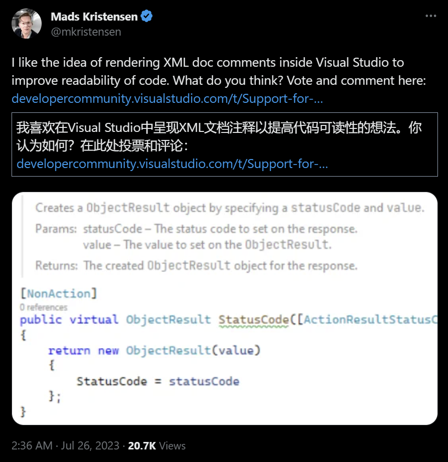

## 国内文章

### PaddleSharp：跨越一年的版本更新与亮点

https://www.cnblogs.com/sdflysha/p/20230724-paddlesharp-in-a-year.html

我始终坚信，开源社区是技术进步的重要推动力，也是我抽出我业余时间，投入到`PaddleSharp`这个项目的原因，这个项目充分展现了.NET在复杂计算领域的潜力。今天很高兴地告诉大家，`PaddleSharp`有了新版本！

先来说说背景，有的朋友可能知道，`PaddleSharp`过去老版本存在一些东西过时或者无法使用的情况。但是，时光恰恰是优化和革新的好理由和契机，我在距离上一篇文章发布之后，做了许多优化，下面我挑重要的部分做介绍。

### 跟进 .NET 8 Blazor 之 ReuseTabs 支持 Query 属性绑定

https://www.cnblogs.com/ElderJames/p/ant-blazor-reusetabs-supports-supply-parameter-form-query.html

ASP.NET 团队和社区在 .NET 8 继续全力投入 Blazor，为它带来了非常多的新特性，特别是在服务端渲染（SSR）方面，一定程度解决之前 WASM 加载慢，Server 性能不理想等局限性，也跟原来的 MVC，Razor Pages 框架在底层完成了统一。

### .NET 如何实现ChatGPT的Stream传输

https://www.cnblogs.com/hejiale010426/p/17583803.html

ChatGPT是如何实现不使用websocket进行一个一个字返回到前端的？下面我们会介绍一下`EventSource`。

### DateTime和DateTimeOffset是同胞兄弟吗？

https://www.cnblogs.com/fengjq/p/17583940.html

小编在日常开发中，用得最多的时间类型就是DateTime，直到一次偶然的邂逅，让小编遇见了DateTimeOffset。当时小编也是一脸迷茫，因为在小编的C#编程字典里就没出现过DateTimeOffset的字样，实属惭愧。于是心中立马产生疑惑：DateTimeOffset是用来干嘛的？它和DateTime之间又是什么关系？带着种种疑问和不解，小编今天就带你一起一窥究竟！

### 超越.NET极限：我打造的高精度数值计算库

https://www.cnblogs.com/sdflysha/p/20230725-sdcb-arithmetic-intro.html

今年(2023)年初趁过年放假期间，我把自己关在家里，连续几个晚上熬夜工作，基于`GMP`和`MPFR`两个知名的开源项目，最终成功开发了`.NET`的高精度数值计算库：[Sdcb.Arithmetic](https://github.com/sdcb/Sdcb.Arithmetic)，现在经过多个版本的迭代，已经相当稳定了。

### .NET程序的 GDI句柄泄露 的再反思

https://www.cnblogs.com/huangxincheng/p/17579180.html

上个月我写过一篇 [如何洞察 C# 程序的 GDI 句柄泄露](https://www.cnblogs.com/huangxincheng/p/17474733.html) 文章，当时用的是 GDIView + WinDbg 把问题搞定，前者用来定位泄露资源，后者用来定位泄露代码，后面有朋友反馈两个问题：

- GDIView 统计不准怎么办？
- 我只有 Dump 可以统计吗？

于是这篇文章我们继续研究下。

### PerfView专题 (第十六篇)： 如何洞察C#托管堆内存的 "黑洞现象" 

https://www.cnblogs.com/huangxincheng/p/17576542.html

首先声明的是这个 `黑洞` 是我定义的术语，它是用来表示 `内存吞噬` 的一种现象，何为 `内存吞噬`，我们来看一张图。

### Avalonia中用FluentAvalonia+DialogHost.Avalonia实现界面弹窗和对话框

https://www.cnblogs.com/raok/p/17575878.html

本文是项目中关于 **`弹窗界面`** 设计的技术分享，通过 **`FluentAvalonia`+`DialogHost.Avalonia`** 开源nuget包来实现项目中需要 **`弹框显示的界面`** 和所有的 **`对话框`** 的展示。

### 关于 yield 关键字（C#）

https://www.cnblogs.com/czzj/p/yield.html

yield 关键字推迟指令执行，使得程序可以更细致地控制集合元素产生的时机。对于大型集合，可以先返回部分内容，让系统展示目标内容，类似于在餐馆吃饭时做好一个菜就上桌。此外，使用 yield 还可以提高内存使用效率。当一个方法需要返回一个集合时，如果不使用 yield，则需要把集合数据装载到内存中等待被使用，这可能导致数据在内存中占用较长的时间。下面就一起来看下怎么用 yield 关键字吧。

### asp.net core之依赖注入

https://www.cnblogs.com/fanshaoO/p/17579976.html

ASP.NET Core 支持依赖关系注入 (DI) 软件设计模式，这是一种在类及其依赖关系之间实现[控制反转 (IoC)](https://learn.microsoft.com/zh-cn/dotnet/standard/modern-web-apps-azure-architecture/architectural-principles#dependency-inversion) 的技术。
按照官方文档的描述：
依赖关系注入通过以下方式解决了这些问题：

- 使用接口或基类将依赖关系实现抽象化。
- 在服务容器中注册依赖关系。 ASP.NET Core 提供了一个内置的服务容器 [IServiceProvider](https://learn.microsoft.com/zh-cn/dotnet/api/system.iserviceprovider)。 服务通常已在应用的 Program.cs 文件中注册。
- 将服务注入到使用它的类的构造函数中。 框架负责创建依赖关系的实例，并在不再需要时将其释放。

**由于Myuki大佬比较忙，本周国际内容板块只有标题和链接。**

## 主题

### 【英文】ReSharper 2023.2 候选版本现已推出 | .NET 工具博客
https://blog.jetbrains.com/dotnet/2023/07/26/resharper-2023-2-rc/

### 【英文】Rider 2023.2 候选版本现已推出 | .NET 工具博客
https://blog.jetbrains.com/dotnet/2023/07/26/rider-2023-2-rc/

### 【英文】Avalonia for Visual Studio Code（抢先体验）
https://dev.to/avalonia/avalonia-for-visual-studio-code-early-access-34bh

### 【英文】宣布 ODP.NET 23c 开发版本
https://medium.com/@alex.keh/announcing-odp-net-23c-dev-release-fbd92861e466

### 【英文】F# 中字符串插值的新语法 - .NET 博客
https://devblogs.microsoft.com/dotnet/new-syntax-for-string-interpolation-in-fsharp/

### 【英文】预测性调试简介：对未来的颠覆性展望 | .NET 工具博客
https://blog.jetbrains.com/dotnet/2023/07/27/introducing-predictive-debugging-a-game-changing-look-into-the-future/

### 【英文】.NET Framework 2023 年 7 月累积更新预览 - .NET 博客
https://devblogs.microsoft.com/dotnet/dotnet-framework-july-2023-cumulative-update-preview/

### 【英文】版本 2.2.7 · mysql-net/MySqlConnector
https://github.com/mysql-net/MySqlConnector/releases/tag/2.2.7

## 文章、幻灯片等
### 【日文】在AvaloniaUI中构建Android🚀 - Qiita
https://qiita.com/tkhshiq/items/f3a363d24cbdf5bd2793

### 【英文】如何设置 XUnit 测试的全局设置 - Event-Driven.io
https://event-driven.io/en/xunit_global_settings/

### 【英文】使用 SharpFuzz 对 .NET 进行模糊测试的五年经验
https://mijailovic.net/2023/07/23/sharpfuzz-anniversary/

### 【英文】在 .NET 中使用 Azure Web PubSub 和 Protobuf 子协议
https://dev.to/corcav/using-azure-web-pubsub-with-protobuf-subprotocol-in-net-58li

### 【英文】.NET 8 中您可能错过的 7 个新功能（或错误修复🐛）
https://dev.to/bytehide/7-new-features-or-bug-fixes-you-might-have-missed-in-net-8-4f11

### 【英文】通过电子邮件订阅 Visual Studio 博客 - Visual Studio 博客
https://devblogs.microsoft.com/visualstudio/subscribe-to-the-visual-studio-blog-via-email/

### 【英文】使用 Visual Studio Code Docker 工具调试 .NET 容器 - .NET 博客
https://devblogs.microsoft.com/dotnet/debugging-dotnet-containers-with-visual-studio-code-docker-tools/

### 【英文】震撼您的调试游戏：您需要了解的并行堆栈窗口技巧！ - Visual Studio 博客
https://devblogs.microsoft.com/visualstudio/rock-your-debugging-game-parallel-stack-window-tips-you-need-to-know/

### 【英文】Rider 2023.2 中 Unity 着色器文件的改进 | .NET 工具博客
https://blog.jetbrains.com/dotnet/2023/07/25/improvements-to-unity-shader-files-in-rider-2023-2/

### 【英文】用拦截器替换方法调用：探索 .NET 8 预览 - 第 5 部分
https://andrewlock.net/exploring-the-dotnet-8-preview-changing-method-calls-with-interceptors/

### 【英文】GA4 数据 API 与 .NET
https://dev.to/chuac/ga4-data-api-with-net-1n00

### 【英文】.NET 中的后台任务和计划作业？认识Hangfire🔥
https://dev.to/bytehide/background-tasks-and-scheduled-jobs-in-net-meet-hangfire-30pd

### 【英文】使用 .NET 项目增强 GitLab 上的测试可视化

https://medium.com/@dejandjenic/enhancing-test-visualization-on-gitlab-with-net-projects-47f65a90c19

### 【英文】将您的 Chromebook 变成一台 .Net 开发机器！
https://dev.to/brunosilvadev/turn-your-chromebook-into-a-net-developer-machine-2bk6

### 【英文】.NET Framework 4.8 到 .NET 6 迁移
https://steven-giesel.com/blogPost/f531dded-44af-4341-871c-d54875877900

### 【英文】C# 中的日志格式化程序 - Bruno Sonnino
https://blog.revolution.com.br/2023/07/17/log-formatters-in-c/

### 【英文】如何使用带有 WSL 的测试容器运行集成测试
https://medium.com/@NelsonBN/how-to-run-integration-tests-using-testcontainers-with-wsl-52c77a2acbbb

### 【英文】在 Blazor 和 MAUI 中使用 Session- 和 LocalStorage
https://medium.com/@kxmliebl/using-session-and-localstorage-in-blazor-and-maui-b01fbb41d14c

## 库、存储库、工具等。

### Cysharp/YetAnotherHttpHandler：将 HTTP/2（和 gRPC）的强大功能引入 Unity 和 .NET Standard。

https://github.com/Cysharp/YetAnotherHttpHandler

- [neue cc - Unity HTTP/2(gRPC) 客户端，发布 YetAnotherHttpHandler](https://neue.cc/2023/07/28_yetanotherhttphandler.html)

### matthewrdev/UnityUaal.Maui：将 Unity 游戏引擎嵌入到 .NET MAUI 中。
https://github.com/matthewrdev/UnityUaal.Maui

https://twitter.com/matthewrdev/status/1684349416210337793?s=12

## 网站、文档等
### 推文

https://twitter.com/mariohewardt/status/1684254752891346944?s=12

---

https://twitter.com/davidfowl/status/1683956501570879489?s=12

---

https://twitter.com/mkristensen/status/1683909106783105025?s=12

## 深入探索

### 为 CoreCLR 实现常量泛型的最小可行性产品部分

https://github.com/dotnet/runtime/pull/89636

“Const Generics”支持开发人员需要通过类型参数传递 const 值的用例。

典型的用例是诸如 shuffle（它基本上是一个有保证的常量）
以及数字、向量、矩阵等的模板。

例如，固定缓冲区 [1]、多维数组/Span [2] 和数组的约束形状 [3]。

对于[1]，我们可以用一个类型`struct ValueArray<T, int N>`来定义具有 N 个元素的 T 数组的类型。
这对于可变参数也很有用。例如，a`params ValueArray<int, 5>`可以表示仅接收 5 个参数的可变参数`int`。

对于[2]，我们可以使用 const 类型参数来定义 a `Span<T, int Dim>`，因此我们`Span`也可以用于多维数组。

对于[3]，我们可以约束数组的形状。当您处理矩阵/向量计算时，这特别有用。
例如，您现在可以使用定义矩阵`class Matrix<T, int Row, int Col>`。当你实现乘法算法时，你可以简单地放一个签名`Matrix<T, Row, NewCol> Multiply<NewCol>(Matrix<T, Col, NewCol> rMatrix)`。这可以确保用户在进行乘法运算时传递正确的矩阵形状。

## 版权声明

* 国内板块由 InCerry 进行整理 : https://github.com/InCerryGit/WeekRef.NET
* 其余内容来自 Myuki WeekRef，由InCerry翻译（已获得授权） : https://github.com/mayuki/WeekRef.NET

**由于笔者没有那么多时间对国内的一些文章进行整理，欢迎大家为《.NET周刊-国内文章》板块进行贡献，需要推广自己的文章或者框架、开源项目可以下方的项目地址提交Issue或者在我的微信公众号私信。**

格式如下：

* 10~50字左右的标题
* 对应文章或项目网址访问链接
* 200字以内的简介，如果太长会影响阅读体验

https://github.com/InCerryGit/.NET-Weekly

## .NET性能优化交流群

相信大家在开发中经常会遇到一些性能问题，苦于没有有效的工具去发现性能瓶颈，或者是发现瓶颈以后不知道该如何优化。之前一直有读者朋友询问有没有技术交流群，但是由于各种原因一直都没创建，现在很高兴的在这里宣布，我创建了一个专门交流.NET性能优化经验的群组，主题包括但不限于：

* 如何找到.NET性能瓶颈，如使用APM、dotnet tools等工具
* .NET框架底层原理的实现，如垃圾回收器、JIT等等
* 如何编写高性能的.NET代码，哪些地方存在性能陷阱

希望能有更多志同道合朋友加入，分享一些工作中遇到的.NET性能问题和宝贵的性能分析优化经验。**目前一群已满，现在开放二群。**

如果提示已经达到200人，可以加我微信，我拉你进群: **lishi-wk**

另外也创建了**QQ群**，群号: 687779078，欢迎大家加入。 

## 抽奖送书活动预热！！！

感谢大家对我公众号的支持与陪伴！为庆祝公众号一周年，抽奖送出一些书籍，请大家关注公众号后续推文！

