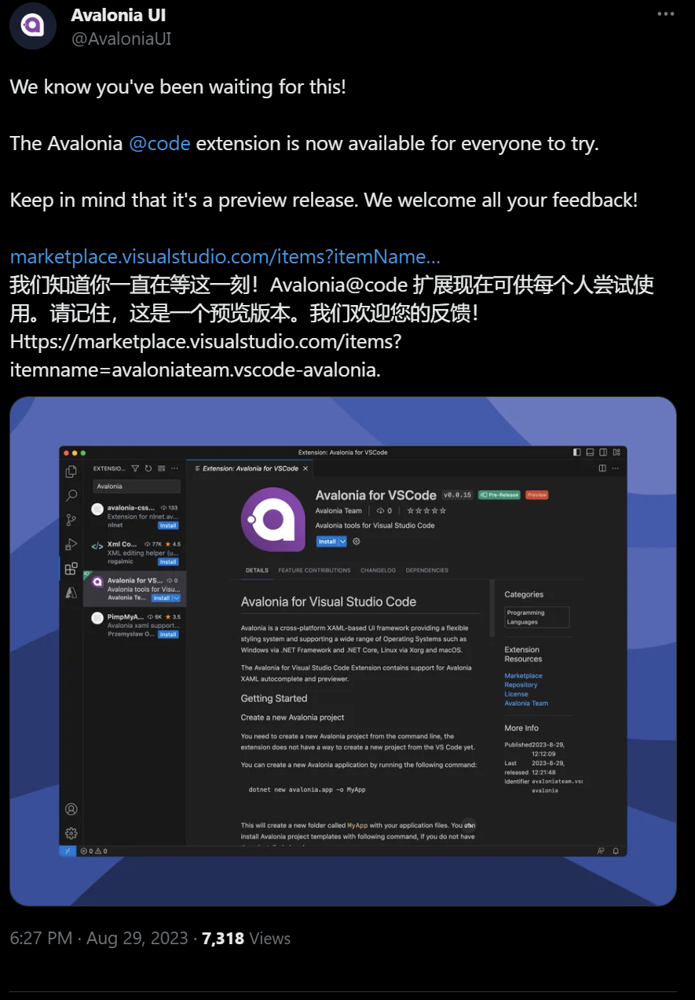
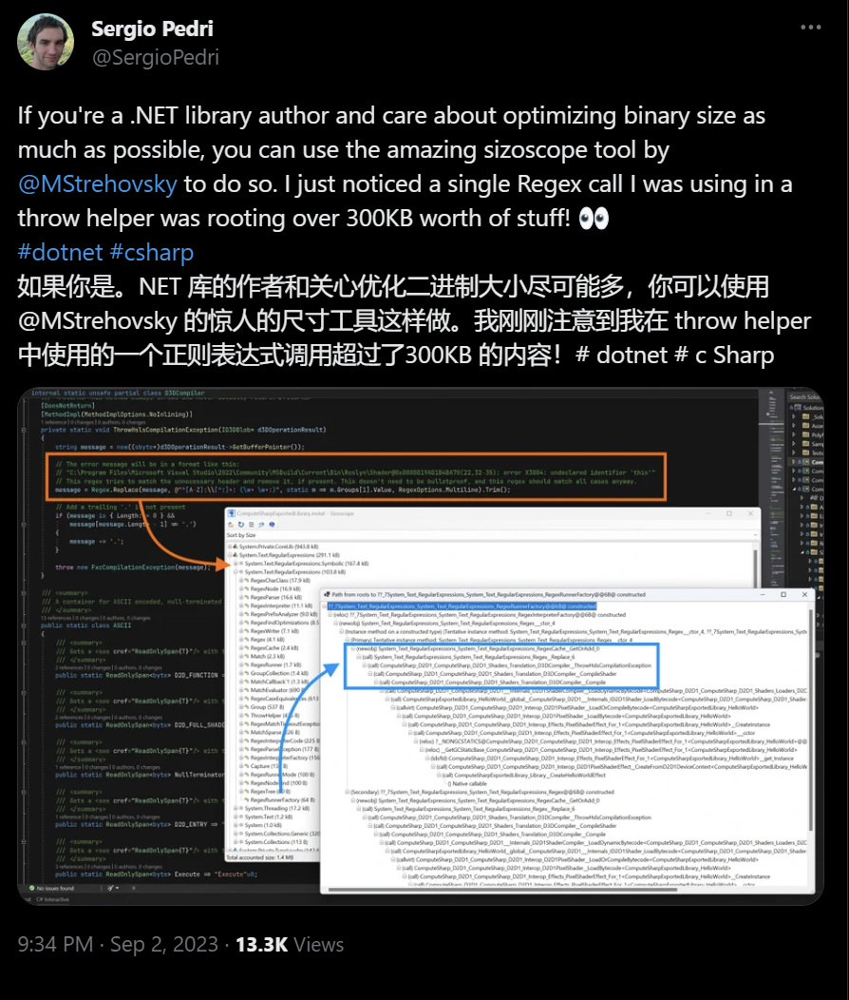
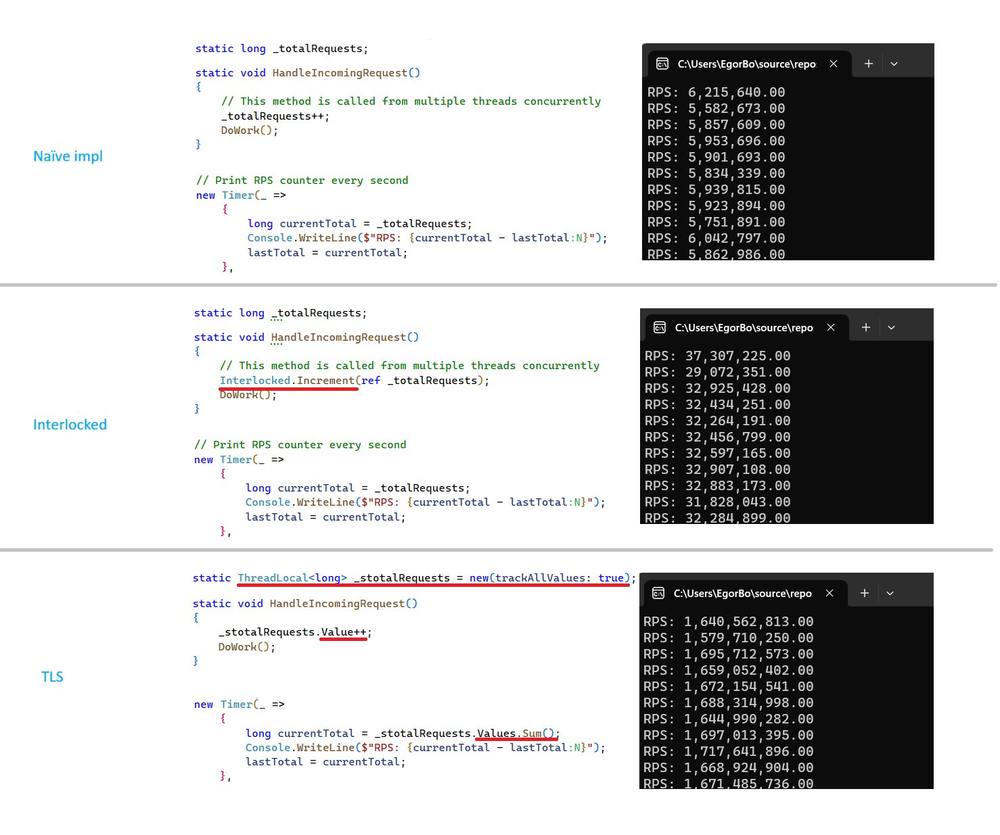
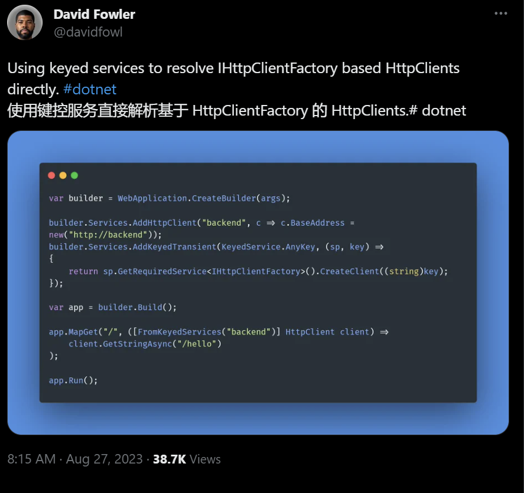

## 国内文章

### 如何正确实现一个自定义 Exception

https://www.cnblogs.com/kklldog/p/how-to-design-exception.html

最近在公司的项目中，编写了几个自定义的 Exception 类。提交 PR 的时候，sonarqube 提示这几个自定义异常不符合 ISerializable patten. 花了点时间稍微研究了一下，把这个问题解了。今天在此记录一下，可能大家都会帮助到大家。

### 细聊C# AsyncLocal如何在异步间进行数据流转

https://www.cnblogs.com/wucy/p/17654645.html

在异步编程中，处理异步操作之间的数据流转是一个比较常用的操作。`C#`异步编程提供了一个强大的工具来解决这个问题，那就是`AsyncLocal`。它是一个线程本地存储的机制，可以在异步操作之间传递数据。它为我们提供了一种简单而可靠的方式来共享数据，而不必担心线程切换或异步上下文的变化。本文我们将探究`AsyncLocal`的原理和用法，并进行相关源码解析。探讨它如何在异步操作之间实现数据的流转，以及它是如何在底层工作的。

### 【微信自动化】使用C#实现微信自动化

https://www.cnblogs.com/1996-Chinese-Chen/p/17663064.html

上个月，在一个群里摸鱼划水空度日，看到了一个老哥分享的一个微信自动化的一个类库，便下载了他的Demo，其本意就是模拟鼠标来操作UI，实现UI自动化；然后自己在瞎琢磨研究，写了一个简单的例子，用来获取好友列表，获取聊天列表，以及最后一次接收或者发送消息的时间，以及最后一次聊天的内容，还有自动刷朋友圈，获取朋友圈谁发的，发的什么文字，以及配的图片是什么，什么时候发的，再就是一个根据获取的好友列表，来实现给指定好友发送消息的功能。

### 在.NET Framework中使用RocketMQ（阿里云版）实战

https://www.cnblogs.com/kimiliucn/p/17662052.html

https://www.cnblogs.com/kimiliucn/p/17667200.html

在开发某一个需求的时候，领导要求使用RocketMQ(阿里云版) 作为消息队列。使用的版本是5.x，目前也已经没有4.x购买的入口了，所以只能买5.x系列。公司项目还是用的比较老的技术.NET Framework 4.8，生产者主要有WebAPI/MVC/JOB(控制台应用程序)，然后消费者采用的是Windows服务进行长链接消费信息。这期间因为各种原因踩过很多坑，然后咨询了客服说RocketMQ(阿里云版)5.0不支持.NET Framework，但最终操作下来竟然能使用（只支持集群模式，不支持订阅模式），那今天[西瓜程序猿]来记录一下如何使用RocketMQ(阿里云版)，给各位小伙伴作为参考防止踩坑。

### 如何将项目打包上传到NuGet服务器（图文教程）

https://www.cnblogs.com/kimiliucn/p/17675287.html

在我写[在.NET Framework中使用RocketMQ(阿里云版)]这篇博客的时候，因为封装了很多代码在单独的DLL中，包括生产者、消费者以及官方SDK等等，然后都在博客中体现出来导致博客大量代码，然后有位读者就建议打包成NuGet包，大家也可以直接安装引入调用，我也觉得很不错，于是就有了这篇文章啦！

### C#/.NET/.NET Core优秀项目和框架8月简报

https://www.cnblogs.com/Can-daydayup/p/17672682.html

收集了8月份一些优秀的.NET项目和框架。

### WPF使用Blazor的快速案例

https://www.cnblogs.com/hejiale010426/p/17671769.html

下面我们将讲解在WPF中使用Blazor，并且使用Blazor做一些文件编辑操作，下面是需要用到的东西：WPF、Blazor、Masa Blazor、Monaco。

### MAUI+Masa Blazor APP 各大商店新手发布指南（三）vivo篇

https://www.cnblogs.com/MASA/p/17669118.html

上架vivo商店，使用厂家的离线推送当然是一个重要原因，与小米不同，vivo的推送服务可以在应用未上架的情况下通过添加测试手机的方式进行测试。

### C#中的浅拷贝与深拷贝

https://www.cnblogs.com/wml-it/p/17667229.html

众所周知，C#中有两种类型变量：那就是**值类型**和**引用类型**。对于值类型而言，copy就相当于是全盘复制了，真正的实现了复制，属于**深拷贝**；而对于引用类型而言，一般的copy只是**浅拷贝**，只是copy到了引用对象的地址，相当于值传递了一个引用指针，新的对象通过地址引用仍然指向原有内存中的对象。

### .NET Core WebAPI 基础 文件上传

https://www.cnblogs.com/ysmc/p/17666170.html

昨天分享了一个在WebApi中如何接收参数的文章 [传送门](https://www.cnblogs.com/ysmc/p/17663663.html)，然后有新人小伙伴就问了，那文件上传呢，这个怎么弄，借此我写了一个小demo，分享给大家。

通常来说，上传文件，我们是使用POST，还是老规矩先上代码。

###  Adapter 适配器模式简介与 C# 示例【结构型1】【设计模式来了_6】

https://www.cnblogs.com/hnzhengfy/p/SJMSLL_Adapter.html

如题，使用C#实现适配器模式。

### .NET WebAPI 基础 FromRoute、FromQuery、FromBody 用法

https://www.cnblogs.com/ysmc/p/17663663.html

最近技术交流群里，还有不少小伙伴不知道 FromRoute、FromQuery、FromBody 这几个特性是怎么使用的，也不清楚它们之间的区别在哪里，特意写下这个文章，希望可以帮助到迷茫的小伙伴。

### 如何将现有的`Blazor`项目的主题切换写的更好看?

https://www.cnblogs.com/hejiale010426/p/17662123.html

在现有的系统当中，我们的主题切换会比较生硬，下面我们将基于Masa Blazor实现好看的扩散主题切换的样式效果。

###  WPF-封装自定义雷达图控件

https://www.cnblogs.com/liushuiruobing/p/17661556.html

如题，使用WPF封装自定义雷达图控件。

## 主题

### 【英文】Visual Studio for Mac 停用公告 - Visual Studio 博客
https://devblogs.microsoft.com/visualstudio/visual-studio-for-mac-retirement-announcement/

Visual Studio for Mac 开发结束的公告。

未来的开发将集中在 Visual Studio 和 Visual Studio Code 上，因此 Visual Studio for Mac 17.6 将是最终版本。将支持到2024年8月31日，即12个月后，以后不会添加新功能或对新框架的支持。

作为替代解决方案，我们建议使用 Visual Studio Code 和 C# Dev Kit、在 Mac 上的 VM 上使用 Visual Studio，以及在 Dev Box（云上的 VM）上使用 Visual Studio。

- [JetBrains Rider 欢迎 Visual Studio for Mac 用户购买新个人订阅可享受 65% 折扣 | .NET 工具博客](https://blog.jetbrains.com/dotnet/2023/09/01/65-off-rider /)
    - 公告发布后，JetBrains Rider 个人订阅可享受 65% 折扣，截止时间为 UTC 时间 6 月 4 日上午 6:00（日本时间 6 月 4 日 15:00）

### 【英文】发布 v1.4.0 · microsoft/WindowsAppSDK
https://github.com/microsoft/WindowsAppSDK/releases/tag/v1.4.0

Windows App SDK 1.4.0 发布。

此版本中的 XAML 岛不再是实验性的，添加了 ItemsView、DesktopAcrylicController 和 MicaController 的可用性改进等等。

### 【英文】发布 8.0.0-beta.1 · App-vNext/Polly
https://github.com/App-vNext/Polly/releases/tag/8.0.0-beta.1

Polly 8.0.0-beta.1 已发布。

此版本正在接受从 alpha 到 beta 的 API 审核。

### 【英文】新的 .NET 升级助手版本，具有功能更新和 .NET MAUI 改进！ - .NET 博客
https://devblogs.microsoft.com/dotnet/upgrade-assistant-august-2023-update/

关于 .NET Upgrade Assistant 的 8 月更新。

除了仅将项目文件更新为 SDK 样式的功能之外，此版本还包括对 .NET MAUI 迁移的改进，例如使用 CLI 在 macOS 上升级的功能。

### 【英文】加入我们的 JetBrains .NET Day Online ’23 | .NET 工具博客
https://blog.jetbrains.com/dotnet/2023/08/30/dotnet-day-online-23/

关于 JetBrains .NET Day Online '23 的公告。

由 JetBrains 主办的活动将于 9 月 26 日举行，在线提供 .NET 会议。文章介绍了当前的议程。

### 【英文】宣布 freeCodeCamp 推出新的基础 C# 认证 - .NET 博客
https://devblogs.microsoft.com/dotnet/announcing-foundational-csharp-certification/

freeCodeCamp 现在提供基本的 C# 认证。

freeCodeCamp 是一家提供编程等学习资源的慈善机构，现在增加了 C# 认证考试。与 Microsoft Learn 合作以获得考试和认证。

### 【英文】发布诊断版本 - v7.0.442301 · dotnet/diagnostics
https://github.com/dotnet/diagnostics/releases/tag/v7.0.442301

.NET 诊断工具 v7.0.442301 发布。

此版本修复了 dotnet-dump/SOS 中的错误并添加了 dumpexception 命令。

### 【英文】宣布 Appwrite 的新 .NET SDK
https://dev.to/appwrite/announcing-appwrites-new-net-sdk-5028

Appwrite 的 .NET SDK 已发布。

通过使用此 SDK，您可以在 .NET 中使用 AppWrite 的服务器端功能。

## 文章、幻灯片等
### 【英文】并非所有 O(1) 操作都被视为相等
https://ayende.com/blog/200033-B/not-all-o-1-operations-are-considered-equal?Key=9b63efc3-8651-43b1-a301-6051e87361da

为了减少`Dictionary`的查找，我采用了使用`List`来保存索引的方法。

### 【英文】生成 ASCII Art — C# 中的简单操作方法
https://medium.com/@devleaderca/generate-ascii-art-a-simple-how-to-in-c-1b3f53a972f0

如何生成使用图像中的 ASCII 字符表达阴影的 ASCII 艺术作品。

### 【英文】NET 8 随机性指南：探索 2023 年新方法和技术
https://www.thatamazingprogrammer.com/the-art-of-randomness-in-net-8-new-methods-and-techniques

在 .NET 8 中引入新的随机 API（“GetItem”、“Shuffle”）。

### 【英文】掌握跨平台部署：使用 Electron.js 的 Blazor WASM 应用程序并通过 GitHub Actions 自动更新
https://medium.com/@dejandjenic/mastering-cross-platform-deployment-blazor-wasm-applications-with-electron-js-509dc4338450

了解如何使用 Electron 打包 Blazor WASM 应用程序，并使用 GitHub Actions 启用自动更新。

### 【日文】为什么C# 8.0中引入的数组索引器的范围规范是独占结束 - Qiita
https://qiita.com/jun1s/items/a56b80eb5a2dead6617f

关于为什么 C# 8 中可用于数组索引器的数组表示法是排他性结束的讨论。

### 【英文】LINQ 内部原理：速度优化
https://antao-almada.medium.com/linq-internals-speed-optimizations-1d99b53750bb

介绍 LINQ 中的运算符内发生的优化。

### 【英文】最小 API 中的表单绑定：探索 .NET 8 预览版 - 第 7 部分
https://andrewlock.net/exploring-the-dotnet-8-preview-form-binding-in-minimal-apis/

.NET 8 中最小 API 中表单绑定的讨论。

文章还解释了如何处理 CSRF 对策令牌和各种限制。

### 【英文】C# Lambda：代码拆解
https://ricomariani.medium.com/c-lambdas-a-code-teardown-b345ce255212

关于使用 C# lambda 时机器语言级别的代码大小。

### 【日文】如何在 Azure 应用服务的应用程序设置中设置对象和数组
https://zenn.dev/microsoft/articles/app-service-array

如何通过 Azure 应用服务应用程序设置中的 Microsoft.Extensions.Configuration 中的环境变量设置来设置对象和数组。

### 【英文】使用 C# 测量 Unicode 字符串长度 
https://khalidabuhakmeh.com/measuring-unicode-string-lengths-with-csharp

关于如何获取 Unicode 字符串的长度。

### 【英文】Visual Studio 中你可能不知道的 9 个“隐藏”功能
https://blog.elmah.io/9-hidden-features-in-visual-studio-that-you-may-not-know/

介绍 Visual Studio 的 9 个隐藏便利功能。

### 【英文】在 Kubernetes 上收集 .NET Core 的内存转储
https://cezarypiatek.github.io/post/memory-dump-on-kubernetes/

如何从 Kubernetes 上运行的 .NET 应用程序获取内存转储。

### 【英文呢】为.NET 编译 Rust，只用茶和固执！
https://fractalfir.github.io/generated_html/rustc_codegen_clr_v0_0_1.html

关于我们尝试将 Rust 编译为 .NET 的 IL。

### 【日文】如何使用 System.Text.Josn 将字符串数字 `"Foo":"1"` 反序列化为 `int Foo {get;set;}` 
https://devadjust.exblog.jp/29682981/

当数字表示为 JSON 值的字符串时，如何使用 System.Text.Json 将数字转换并接收为数字。

### 【英文】实现基于功能标志的端点过滤器
https://timdeschryver.dev/blog/implementing-a-feature-flag-based-endpoint-filter

关于如何根据端点过滤器中的功能标志进行操作。

### 【英文】结构体内存布局优化，实际考虑
https://ayende.com/blog/199841-A/struct-memory-layout-optimizations-practical-considerations?Key=a53d68c5-1801-429b-af30-3fd406eabc6e&

关于class和struct的内存布局差异及优化。

## 网站、文档等
### 推文

**Visual Studio Code 的 Avalonia UI 扩展已发布。**

- [Avalonia VS Code 工具现已向所有人提供预览版 -- Visual Studio 杂志](https://visualstudiomagazine.com/articles/2023/08/30/avalonia-vs-code-ga.aspx)

https://x.com/avaloniaui/status/1696469591138972127?s=12

---

**您可以使用名为 [sizscope](https://github.com/MichalStrehovsky/sizscope) 的工具检查.NET AOT以后的二进制大小。**

https://x.com/sergiopedri/status/1697966324759048459?s=12

---

**一个关于使用`Interlocked.Increment`计算 RPS 等内容如何影响性能的故事。如何有效地计算 RPS (每秒的请求) :**

https://x.com/egorbo/status/1697579906106896652?s=12

---

如何使用 .NET 8 Keyed Service 直接解析 HttpClient。

https://x.com/davidfowl/status/1695590701294145803?s=12

## 版权声明

* 国内板块由 InCerry 进行整理 : https://github.com/InCerryGit/WeekRef.NET
* 其余内容来自 Myuki WeekRef，由InCerry翻译（已获得授权） : https://github.com/mayuki/WeekRef.NET

**由于笔者没有那么多时间对国内的一些文章进行整理，欢迎大家为《.NET周刊-国内文章》板块进行贡献，需要推广自己的文章或者框架、开源项目可以下方的项目地址提交Issue或者在我的微信公众号私信。**

格式如下：

* 10~50字左右的标题
* 对应文章或项目网址访问链接
* 200字以内的简介，如果太长会影响阅读体验

https://github.com/InCerryGit/.NET-Weekly

## .NET性能优化交流群

相信大家在开发中经常会遇到一些性能问题，苦于没有有效的工具去发现性能瓶颈，或者是发现瓶颈以后不知道该如何优化。之前一直有读者朋友询问有没有技术交流群，但是由于各种原因一直都没创建，现在很高兴的在这里宣布，我创建了一个专门交流.NET性能优化经验的群组，主题包括但不限于：

* 如何找到.NET性能瓶颈，如使用APM、dotnet tools等工具
* .NET框架底层原理的实现，如垃圾回收器、JIT等等
* 如何编写高性能的.NET代码，哪些地方存在性能陷阱

希望能有更多志同道合朋友加入，分享一些工作中遇到的.NET性能问题和宝贵的性能分析优化经验。**目前一群已满，现在开放二群。**

如果提示已经达到200人，可以加我微信，我拉你进群: **ls1075**

另外也创建了**QQ群**，群号: 687779078，欢迎大家加入。 

## 抽奖送书活动预热！！！

感谢大家对我公众号的支持与陪伴！为庆祝公众号一周年，抽奖送出一些书籍，请大家关注公众号后续推文！

