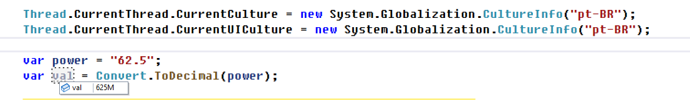
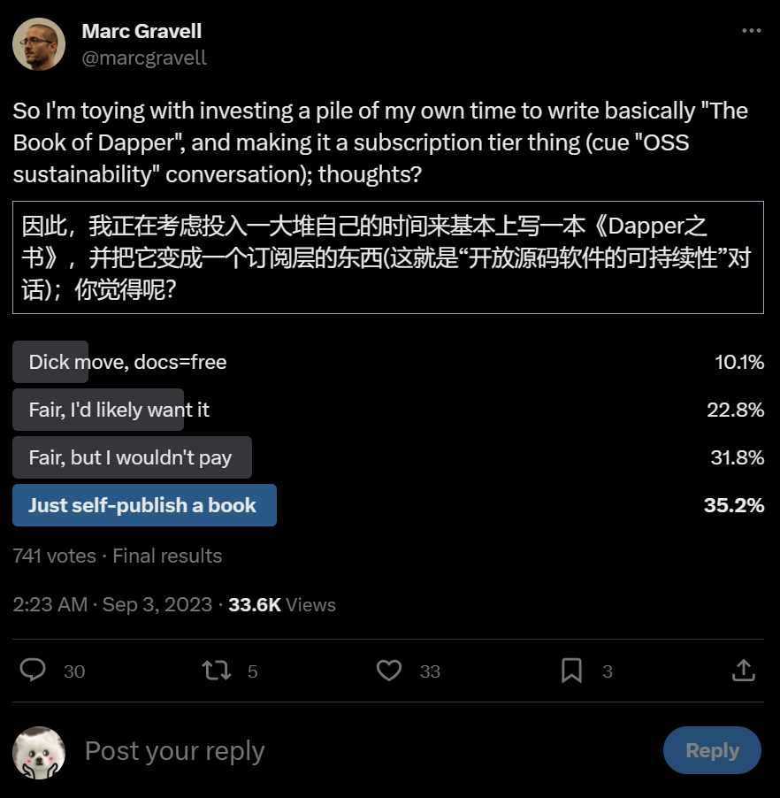

## 国内文章

### 使用 OpenTelemetry 构建 .NET 应用可观测性（2）：OpenTelemetry 项目简介

https://www.cnblogs.com/eventhorizon/p/17678251.html

目录

- 前世今生
  - [OpenTracing](https://www.cnblogs.com/eventhorizon/p/17678251.html#opentracing)
  - [OpenCensus](https://www.cnblogs.com/eventhorizon/p/17678251.html#opencensus)
  - [OpenTelemetry](https://www.cnblogs.com/eventhorizon/p/17678251.html#opentelemetry)
- OpenTelemetry 项目介绍
  - OpenTelemetry Specification
    - [Signals](https://www.cnblogs.com/eventhorizon/p/17678251.html#signals)
    - [Context & Propagation](https://www.cnblogs.com/eventhorizon/p/17678251.html#context--propagation)
    - [OpenTelemetry Protocol](https://www.cnblogs.com/eventhorizon/p/17678251.html#opentelemetry-protocol)
  - OpenTelemetry SDK
    - [OpenTelemetry SDK架构](https://www.cnblogs.com/eventhorizon/p/17678251.html#opentelemetry-sdk架构)
  - [OpenTelemetry Collector](https://www.cnblogs.com/eventhorizon/p/17678251.html#opentelemetry-collector)
- [下期预告](https://www.cnblogs.com/eventhorizon/p/17678251.html#下期预告)

### NET应用多语言-葡萄牙语软件，如何处理本地化，特别是数字的转换和计算

https://www.cnblogs.com/tianqing/p/17686679.html

在葡萄牙语软件中，数字本地化通常涉及小数点和千位分隔符的使用。在葡萄牙语中，小数点用“，”表示，而不是英语中使用的“.”。千位分隔符通常是一个空格或一个点。

例如：62.5，其实代表的不是62.5 而是625M

为了正确地处理数字本地化，可以使用.NET框架中提供的CultureInfo类。此类允许您指定当前线程的区域设置，以便在处理数字时使用正确的格式和分隔符。

### 循序渐进介绍基于CommunityToolkit.Mvvm 和HandyControl的WPF应用端开发(1)

https://www.cnblogs.com/wuhuacong/p/17687598.html

在我们的SqlSugar的开发框架中，整合了Winform端、Vue3+ElementPlus的前端、以及基于UniApp+Vue+ThorUI的移动前端几个前端处理，基本上覆盖了我们日常的应用模式了，本篇随笔进一步介绍前端应用的领域，研究集成WPF的应用端，循序渐进介绍基于CommunityToolkit.Mvvm 和HandyControl的WPF应用端开发。

### C#结合OpenCVSharp4使用直方图算法比较图片相似度

https://www.cnblogs.com/ycit/p/17689380.html

直方图有`灰度直方图`、`颜色直方图`,如果是灰度图像，那么就用`灰度直方图`,这里使用`颜色直方图`来计算两个图片的相似度。

> 这里只记录如何使用，至于算法原理，问就是不会。

直方图算法效率高，但精度不够，适合快速比较，例如`以图搜图`。

### C#结合OpenCVSharp4图片相似度识别

https://www.cnblogs.com/ycit/p/17688625.html

需求背景：需要计算两个图片的相似度，然后将相似的图片进行归纳。

### 基于ASP.NET ZERO，开发SaaS版供应链管理系统

https://www.cnblogs.com/freedyang/p/17679280.html

在园子吸收营养10多年，一直没有贡献，目前园子危机时刻，除了捐款+会员，也鼓起勇气，发篇文助力一下。

2018年下半年，公司决定开发一款SaaS版行业供应链管理系统，经过选型，确定采用ABP（ASP.NET Boilerplate）框架。为了加快开发效率，购买了商业版的 ASP.NET ZERO（以下简称ZERO），选择**ASP.NET Core + Angular**的SPA框架进行系统开发（ABP.IO届时刚刚起步，还很不成熟，因此没有选用）。

关于[ABP](https://aspnetboilerplate.com/)与[ZERO](https://aspnetzero.com/)，园子里已经有诸多介绍，因此不再赘述。本文侧重介绍我们基于ZERO框架开发系统过程中进行的一些优化、调整、扩展部分的内容，方便有需要的园友们了解或者参考。

### C#中的ConcurrentExclusiveSchedulerPair类

https://www.cnblogs.com/baibaomen-org/p/17679008.html

现实生活中的例子是一个停车场的入口和出口，多辆车可以同时进入和离开停车场，但是只有一个车辆可以进入或离开一次。

这时候就需要保证同时只有一个车辆能够访问停车场的入口或出口，避免出现多辆车同时进出停车场的竞态条件和导致车辆堵塞的问题。

使用ConcurrentExclusiveSchedulerPair可以将需要独占访问的停车场入口和出口操作加入ExclusiveScheduler中，从而保证在任何时候都只有一个车辆能够进入或离开停车场，避免了竞态条件和数据不一致的情况。

### 【译】.NET 8 拦截器（interceptor）

https://www.cnblogs.com/MeteorSeed/p/17663658.html

　通常情况下，出于多种原因，我不会说我喜欢写关于预览功能的文章。我的大多数帖子旨在帮助人们解决他们可能遇到的问题，而不是找个肥皂盒或打广告。但是我认为我应该介绍这个 .NET 预览特性，因为它是我在 .NET 生态系统中渴望已久的东西（猴子补丁，monkey patching，在运行时动态修改模块、类或函数，通常是添加功能或修正缺陷，猴子补丁在代码运行时内存中发挥作用，不会修改源码，因此只对当前运行的程序实例有效；因为猴子补丁破坏了封装，而且容易导致程序与补丁代码的实现细节紧密耦合，所以被视为临时的变通方案，不是集成代码的推荐方式）的姊妹主题。如果你不熟悉这个话题，我建议你阅读我关于猴子打补丁的帖子。一般来说，猴子补丁允许你用一个实现代替另一个实现，你知道吗，. NET 8引入了拦截器的概念。

## 主题

### 【英文】发布版本 v2.57.0 · grpc/grpc-dotnet
https://github.com/grpc/grpc-dotnet/releases/tag/v2.57.0

### 【英文】2013 年 10 月 4 日发布 · unoplatform/uno
https://github.com/unoplatform/uno/releases/tag/4.10.13

### 【英文】宣布推出 Windows 社区工具包 v8.0 
https://devblogs.microsoft.com/ifdef-windows/announcing-windows-community-toolkit-v8-0/

### 【英文】.NET 8 中的 WPF 文件对话框改进 - .NET 博客
https://devblogs.microsoft.com/dotnet/wpf-file-dialog-improvements-in-dotnet-8/

### 【英文】绿色线程实验结果 · 问题 #2398 · dotnet/runtimelab
https://github.com/dotnet/runtimelab/issues/2398

## 文章、幻灯片等
### 【英文】在 JetBrains Rider 中调试 Docker Compose 解决方案：深入探讨
https://dev.to/maxarshinov/debugging-docker-compose-solutions-in-jetbrains-rider-a-deep-dive-2a2d

### 【英文】Daniel Cazzulino，Moq 和 SponsorLink 的创建者 · Code Code Ship
https://codecodeship.com/blog/2023-09-07-daniel-cazzulino

### 【英文】关于 .NET 中的配置和秘密管理您需要了解的一切
https://stenbrinke.nl/blog/configuration-and-secret-management-in-dotnet/

### 【英文】.NET 每月刊 | 2023 年 9 月 | .NET 工具博客
https://blog.jetbrains.com/dotnet/2023/09/07/net-annotated-monthly-september-2023/

### 【英文】通过自动反编译和外部源提升调试 - Visual Studio 博客
https://devblogs.microsoft.com/visualstudio/elevating-debugging-with-auto-decompilation-and-external-sources/

### 【英文】将图像直接从 Vulkan 复制到 WPF - Qiita
https://qiita.com/moka76203078/items/70d5cb4530f7994f7374

### 【英文】使用 .NET 揭秘检索增强生成 - .NET 博客
https://devblogs.microsoft.com/dotnet/demystifying-retrieval-augmented-generation-with-dotnet/

### 【英文】通过保留大小写的查找和替换来保留大小写 - Visual Studio 博客
https://devblogs.microsoft.com/visualstudio/keep-your-casing-with-case-preserving-find-and-replace/

### 【英文】介绍 Identity API 端点：探索 .NET 8 预览版 - 第 8 部分
https://andrewlock.net/exploring-the-dotnet-8-preview-introducing-the-identity-api-endpoints/

### 【英文】ReDoS 攻击：正则表达式如何瘫痪您的系统以及如何避免它们
https://levelup.gitconnected.com/redos-attacks-how-regex-can-bring-down-your-system-and-how-to-avoid-them-355f269c1f9d

### 【英文】ReSharper 2023.3 路线图 | .NET 工具博客
https://blog.jetbrains.com/dotnet/2023/09/05/resharper-2023-3-roadmap/

### 【英文】Rider 2023.3 路线图 | .NET 工具博客
https://blog.jetbrains.com/dotnet/2023/09/05/rider-2023-3-roadmap/

### 【日文】尝试将日历组件与 Blazor 结合使用 - Qiita
https://qiita.com/HAGITAKO/items/7c091a0ca5ed6ca917ba

### 【英文】使用 Grafana 仪表板增强您的 .NET 数据可视化 — 了解具体方法！
https://blog.devops.dev/supercharge-your-net-data-visualizations-with-grafana-dashboards-find-out-how-4d955904629b

### 【英文】BlazingStory：Blazor 组件开发游戏规则的改变者
https://medium.com/@mariekie/blazingstory-a-blazor-component-development-game-changer-9b249dc7de34

### 【日文】编辑 WPF 应用程序的 Main 方法
https://zenn.dev/hat_kotap/articles/1652558a2aaa48

### 【英文】使用适用于 Linux 的 Sysinternals ProcDump 调查 .NET 内存不足异常
https://medium.com/@marioh_78322/investigating-net-out-of-memory-exceptions-using-sysinternals-procdump-for-linux-8a59c8b289

### 【日文】即使Task/ValueTask可以直接返回，一般还是使用异步方法（async/await）更好
https://zenn.dev/mayuki/articles/96a17916096714

### 【英文】.NET 迁移的故事 - 空代理
https://www.jimmybogard.com/tales-from-the-net-migration-trenches-empty-proxy/

### 【英文】BearerToken：.NET 8 中的新身份验证处理程序 – Tore Nestenius | 培训师和高级软件开发人员
https://nestenius.se/2023/08/29/bearertoken-the-new-authentication-handler-in-net-8/

### 【英文】C# 中的“弱事件”模式
https://steven-giesel.com/blogPost/675b75fc-2c1b-43da-9ff8-42962ca8159b

### 【日文】[C#] .NET Worker 服务运行状况检查。 - 尼诺的花园。
https://blog.neno.dev/entry/2023/09/10/153014

### 【英文】将 DateOnly 和 TimeOnly 与 EF Core 6、7 和 8 以及 Azure SQL/SQL Server 结合使用
https://erikej.github.io/efcore/sqlserver/2023/09/03/efcore-dateonly-timeonly.html

## 库、存储库、工具
## 网站、文档等
### 推文
https://twitter.com/marcgravell/status/1698357724470276104?s=12

## 版权声明

* 国内板块由 InCerry 进行整理 : https://github.com/InCerryGit/WeekRef.NET
* 其余内容来自 Myuki WeekRef，由InCerry翻译（已获得授权） : https://github.com/mayuki/WeekRef.NET

**由于笔者没有那么多时间对国内的一些文章进行整理，欢迎大家为《.NET周刊-国内文章》板块进行贡献，需要推广自己的文章或者框架、开源项目可以下方的项目地址提交Issue或者在我的微信公众号私信。**

格式如下：

* 10~50字左右的标题
* 对应文章或项目网址访问链接
* 200字以内的简介，如果太长会影响阅读体验

https://github.com/InCerryGit/.NET-Weekly

## .NET性能优化交流群

相信大家在开发中经常会遇到一些性能问题，苦于没有有效的工具去发现性能瓶颈，或者是发现瓶颈以后不知道该如何优化。之前一直有读者朋友询问有没有技术交流群，但是由于各种原因一直都没创建，现在很高兴的在这里宣布，我创建了一个专门交流.NET性能优化经验的群组，主题包括但不限于：

* 如何找到.NET性能瓶颈，如使用APM、dotnet tools等工具
* .NET框架底层原理的实现，如垃圾回收器、JIT等等
* 如何编写高性能的.NET代码，哪些地方存在性能陷阱

希望能有更多志同道合朋友加入，分享一些工作中遇到的.NET性能问题和宝贵的性能分析优化经验。**目前一群已满，现在开放二群。**

如果提示已经达到200人，可以加我微信，我拉你进群: **ls1075**

另外也创建了**QQ群**，群号: 687779078，欢迎大家加入。 

## 抽奖送书活动预热！！！

感谢大家对我公众号的支持与陪伴！为庆祝公众号一周年，抽奖送出一些书籍，请大家关注公众号后续推文！

