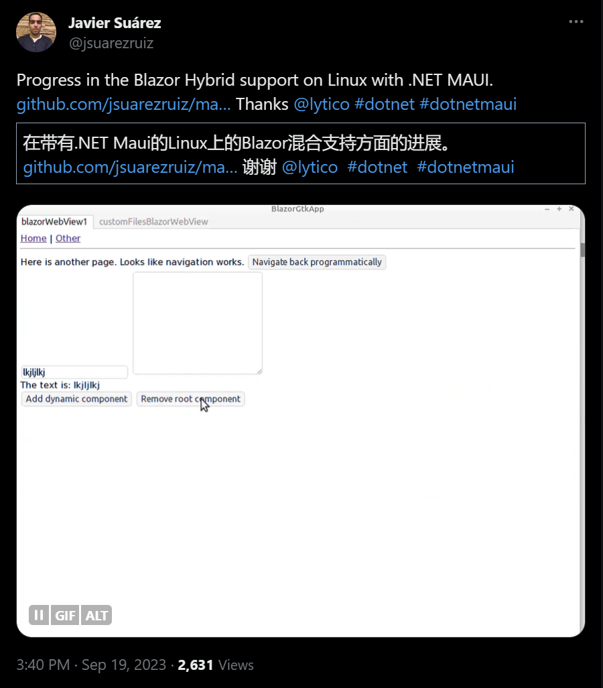
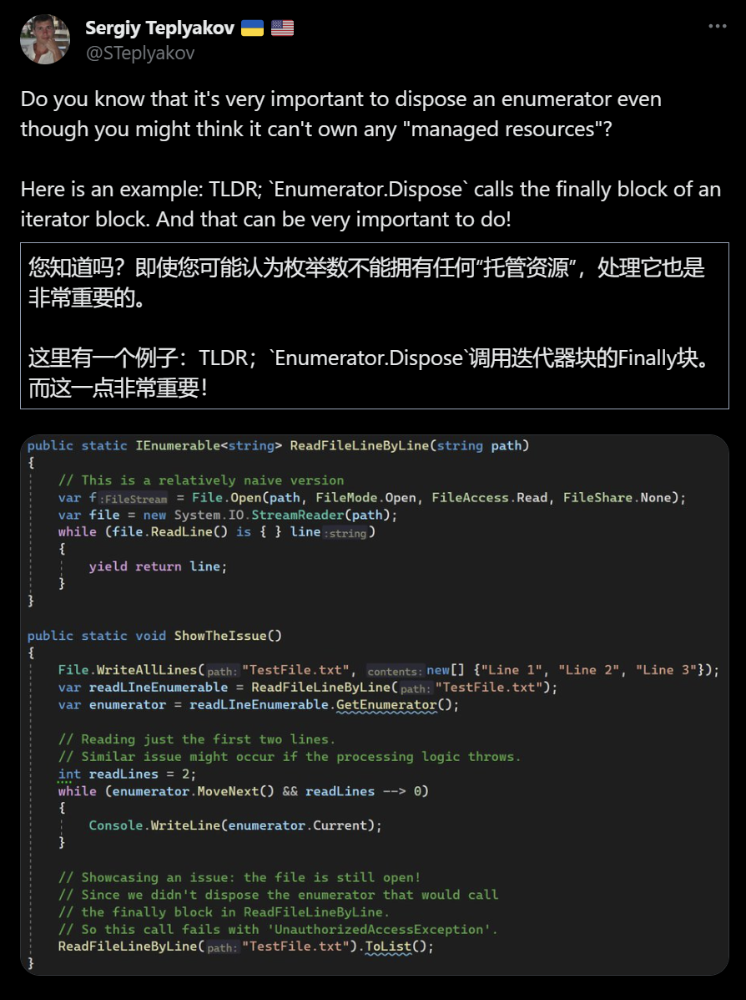
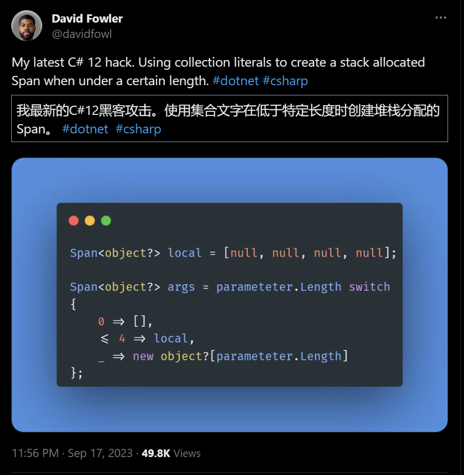

## 国内文章

### 有趣的“可扩展近似计数”算法

https://zhuanlan.zhihu.com/p/656817283

在编程的世界里看见数学的身影，会让我充满好奇和兴奋。这不，在一年一度介绍.NET新版本的官方开发博客[《Performance Improvements in .NET 8》](https://link.zhihu.com/?target=https%3A//devblogs.microsoft.com/dotnet/performance-improvements-in-net-8/%23tiering-and-dynamic-pgo)中，我看到了这样一个有趣的算法：可扩展近似计数（Scalable Approximate Counting）。

### 【逆向专题】（一）使用C#+Win32Api实现进程注入到wechat

https://www.cnblogs.com/1996-Chinese-Chen/p/17715870.html

本文主要介绍了如何使用Flaui实现微信自动化，破解Windows微信的本地Sqlite数据库，并使用Openssl和Win32Api获取解密密钥。文章详细解释了如何使用Cheat Engine软件获取微信的静态数据，包括微信昵称、微信号、手机号和所在地区等。同时，文章还介绍了如何使用C#代码获取静态数据，并通过远程注入调用自己编写的库。最后，文章列举了在这个过程中需要用到的所有Win32Api函数，并详细解释了每个函数的用途和参数。

### 关于.Net 6.0 在Linux ,Docker容器中，不安装任何依赖就生成图形验证码

https://www.cnblogs.com/Thayou/p/17717102.html

本文介绍了在.Net 6中使用SkiaSharp生成验证码的过程。作者首先提到在.Net Framework时代，验证码的生成主要依赖于System.Drawing，但这个库依赖于Windows GDI+，不利于跨平台使用。因此，作者选择使用微软推荐的SkiaSharp库。作者详细介绍了如何使用SkiaSharp生成验证码的代码，并在Windows机器上成功运行。然而，在部署到Linux环境时遇到了问题，因为SkiaSharp在Linux上需要一些依赖，而这些依赖在内网环境下难以安装。作者通过使用SkiaSharp.NativeAssets.Linux.NoDependencies这个nuget包解决了依赖问题，但在Linux上生成的验证码没有文字。最后，作者发现Linux上没有字体文件，提出了提供一个字体文件让程序指定读取的解决思路。

### 2023版：深度比较几种.NET Excel导出库的性能差异

https://www.cnblogs.com/baibaomen-org/p/17721587.html

本文深度比较了几种.NET Excel导出库的性能差异，包括EPPlus、NPOI、Aspose.Cells和DocumentFormat.OpenXml。这些库的开源情况、许可证和支持的Excel版本都有所不同。文章还详细介绍了测评电脑的配置，包括CPU、内存、操作系统等信息。为了进行性能测评，作者使用Bogus库生成了6万条标准化的测试数据，并创建了公共类以便于测评使用。通过这种方式，开发人员可以根据实际的性能指标和数据选择最适合自己的电子表格处理库。

### 深度比较常见库中序列化和反序列化性能的性能差异

https://www.cnblogs.com/baibaomen-org/p/17710883.html

本文介绍了四个常用的序列化和反序列化库，包括System.Text.Json、Newtonsoft.Json、Protobuf-Net和MessagePack-Net，并对它们进行了性能测试。System.Text.Json是.NET Core 3.0及以上版本的内置JSON库，Newtonsoft.Json是.NET中最常用的JSON序列化库，Protobuf-Net是.NET版本的Google's Protocol Buffers序列化库，MessagePack-Net是一个高效的二进制序列化格式。性能测试包括内存分配和执行时间的测量，以及生成随机数据的函数。测试结果显示，System.Text.Json的文件大小为14.3MB，分配内存为1,429,688,200，内存提高为67,392，耗时为2494毫秒。

### 【.NET8】访问私有成员新姿势UnsafeAccessor（上）

https://www.cnblogs.com/InCerry/p/dotnet8-access-private-member-new-method-1.html

本文介绍了.NET8中新增的特性UnsafeAccessor，它可以访问私有成员。在.NET8之前，访问私有成员的方法包括反射、Emit和Expression，但这些方法性能较差或代码复杂。而UnsafeAccessor通过定义一个static extern ref方法，并在方法上添加UnsafeAccessor特性，可以直接访问私有成员，性能更好，代码更简洁。此外，UnsafeAccessor还可以访问私有构造方法和私有的方法，提供了更多的可能性。

### C#开源、功能强大、免费的Windows系统优化工具 - Optimizer

https://www.cnblogs.com/Can-daydayup/p/17726833.html

本文推荐了一款由C#开源的Windows系统优化工具 - Optimizer。Optimizer功能强大，可以提高计算机性能，加强隐私和安全保护。它支持22种语言，提供了许多实用功能，如关闭不必要的Windows服务、停止Windows自动更新、卸载UWP应用、清理系统垃圾文件和浏览器配置文件、修复常见的注册表问题等。此外，Optimizer还提供了硬件检测工具、IP连通性和延迟测试工具、快速更改DNS服务器、编辑HOSTS文件、识别和终止文件锁定句柄等实用工具。Optimizer的本体只有2M多的大小，不用安装，打开即用。

### .NET 8 的 green thread 异步模型被搁置了

https://www.cnblogs.com/shanyou/p/17713668.html

.NET平台上的green thread异步模型实验结果表明，虽然在.NET和ASP.NET Core中实现Green Thread是可行的，但Green Thread与现有的异步模型async/await之间的交互非常复杂，因此决定暂停绿色线程试验，继续改进现有的async/await模型。文章指出，.NET的异步编程模型简化了应用程序的异步代码编写，对于增强I/O绑定方案的可伸缩性非常关键。Green thread的目的是简化编程模型，使得所有代码可以以同步方式编写，但仍保持可伸缩性和性能。然而，Green thread与现有的异步模型之间的交互是复杂的，特别是从Green thread代码调用异步方法需要转换到异步代码的同步模式，这在常规线程上不是一个好的选择。

### 记一次 .NET 某电力系统 内存暴涨分析

https://www.cnblogs.com/huangxincheng/p/17710972.html

本文主要讲述了作者帮助朋友解决程序内存暴涨问题的过程。首先，作者通过抓取程序的内存dump来分析问题。然后，使用Windbg工具进行分析，通过命令“!address -summary”查看程序的内存使用情况，发现内存使用并不多。接着，通过命令“!eeheap -gc”观察托管堆，发现问题出在托管层。最后，通过命令“!dumpheap -stat”查看托管堆的现状，发现一个1.69G的Free对象占用了大量内存。为了找出原因，作者决定进一步观察这个Free对象的分布情况。

### 记一次 .NET 某餐饮小程序 内存暴涨分析

https://www.cnblogs.com/huangxincheng/p/17719366.html

本文主要讲述了作者帮助朋友分析程序内存异常高的问题。首先，作者使用vs诊断工具查看了程序的内存使用情况，发现托管堆的内存占用高达10G+，主要是由于Small object heap的内存占用过高。进一步分析发现，xxxxxxLogEntity对象数量高达5063万，占据了6G的内存。通过使用!gcroot命令，作者发现这些对象的根可能在线程栈里。最后，作者建议进一步观察托管堆，看看哪个对象的占比最大。

### 【.NET8】访问私有成员新姿势UnsafeAccessor（下）

https://www.cnblogs.com/InCerry/p/dotnet8-access-private-member-new-method-2.html

本文讨论了.NET8中新增的`UnsafeAccessor`的性能测试。通过`BenchmarkDotNet`进行测试，包括使用`UnsafeAccessor`特性、反射、`Emit`+动态方法、表达式树+委托以及直接访问私有成员等方法。`UnsafeAccessor`可以方便地访问私有成员，但也存在一些局限性。本文通过实际代码和测试，对其性能进行了深入的探讨。

### 理解并掌握C#的Channel：从使用案例到源码解读（一）

https://www.cnblogs.com/yyfh/p/mastering-csharp-channels-part-one.html

本文介绍了C#并发编程中的Channel数据结构，通过两个实际案例展示了其使用方法和优势。第一个案例是文件遍历和过滤，通过创建有界和无界的Channel，实现了文件的并行遍历和过滤，提高了程序性能和响应性。第二个案例是Excel文件的读取和翻译，通过异步数据流处理，提高了翻译效率。这两个案例都展示了Channel在解耦任务和提高程序性能方面的优势。

### 4款免费且实用的.NET反编译工具

https://www.cnblogs.com/Can-daydayup/p/17723508.html

本文介绍了四款.NET反编译工具：ILSpy、dnSpy、JetBrains dotPeek和JustDecompile。这些工具可以将已编译的.NET程序集转换为易于理解的源代码，帮助开发人员恢复丢失的源代码、理解和分析第三方组件dll、学习其他人的代码、查找修复bug或进行逆向工程。每款工具都有其特点，选择哪一款取决于个人的偏好和需求。同时，文章强调在法律允许的范围内合理使用这些工具，并保护他人的知识产权。最后，文章还提供了一个.NET技术交流群，供开发者分享经验、学习资料和交流问题。

### C#集成ViewFaceCore人脸检测识别库

https://www.cnblogs.com/deali/p/17716884.html

本文介绍了在C#上使用ViewFaceCore库进行人脸检测和识别的过程。ViewFaceCore是基于SeetaFace6的.NET人脸识别解决方案，支持年龄预测、眼睛状态检测、性别预测、人脸检测、口罩检测等功能。在C#中使用非常简单，但由于调用了C++的库，部署时可能会遇到一些问题。文章详细记录了如何添加依赖、进行人脸检测、使用ImageSharp图片库等步骤，并提供了相关代码示例。

### [MAUI]实现动态拖拽排序网格

https://www.cnblogs.com/jevonsflash/p/17712687.html

本文介绍了如何使用.NET MAUI实现实时拖拽排序功能。首先，创建一个.NET MAUI项目，然后在页面中创建CollectionView控件作为Tile的容器。接着，设置DropGestureRecognizer中的拖拽悬停、离开、放置时的命令，并创建IDraggableItem接口，定义拖动相关的属性和命令。最后，创建一个TileSegement类，用于描述磁贴可显示的属性，如标题、描述、图标、颜色等。这样，当拖拽条目放置在另一个条目上方时，即可将条目位置变更，实现实时拖拽排序。

### 如何在没有第三方.NET库源码的情况，调试第三库代码？

https://www.cnblogs.com/Dotnet9-com/p/17723454.html

本文由沙漠尽头的狼首发于Dotnet9，介绍了如何使用dnSpy调试第三方.NET库源码。dnSpy是一款强大的.NET程序反编译工具，可以在没有源码的情况下调试程序，甚至修改程序。文章通过一个示例程序，详细介绍了如何安装dnSpy，编写示例程序，调试示例程序和.NET库原生方法。此外，dnSpy还能直接监视第三方代码的变量、修改值等，就像使用VS开发自己的程序一样。文章最后，作者提到了如何在没有源码的情况下纠正示例程序中的错误，并预告了下一篇文章将讲解第三方库拦截，实现不修改第三方库达到修改方法逻辑和返回结果的效果。

### 记一次 .NET 某仪器测量系统 CPU爆高分析

https://www.cnblogs.com/huangxincheng/p/17722077.html

本文主要讨论了CPU爆高的问题。作者分享了两个案例，通过WinDbg工具进行分析。首先，作者提醒我们，别人说CPU爆高不一定真的爆高，我们需要用数据说话。然后，作者通过观察线程池中的所有工作线程，发现所有线程都在全力运行。通过仔细观察各个线程的线程栈，作者发现最多的是某个方法。这个方法是由线程池工作线程创建的。最后，作者通过分析代码，找出了CPU爆高的原因：一是无脑往线程池丢任务，导致线程增多；二是线程中方法的时间复杂度高。

### 关于Unity 如何与Blazor Server结合

https://www.cnblogs.com/LinSr/p/17717402.html

本文详细介绍了如何将Unity与Blazor Server结合的过程。首先，创建一个Unity项目并进行发布设置，然后将Unity项目发布为WebGL。接着，创建一个net7.0的Blazor Server项目，并在Program.cs中进行配置，将Unity作为静态文件引入。最后，将Unity项目的Build文件夹拷贝到Blazor Server的项目根目录下，并修改目录名称为BlazorServerTest。完成这些步骤后，启动Blazor Server项目，在地址栏输入相应的URL，即可看到Unity画面。通过这种方式，成功实现了Blazor Server和Unity的结合。

### 【C#版本Openfeign】.NET 8 自带OpenFeign实现远程接口调用

https://www.cnblogs.com/1996-Chinese-Chen/p/17724792.html

本文介绍了.Net 8中的新功能AutoClient，这是一个内置的OpenFeign，可以自动生成代理类，调用远程Api接口。使用AutoClient，我们只需要定义一个接口，添加AutoClient特性，系统就会自动生成一个对应的类。例如，我们定义了一个名为IBussiness的接口，并添加了AutoClient特性，系统就会自动生成一个名为Bussiness的类，包含了我们定义的TestPost方法和路由信息。这个功能使得调用远程Api接口变得更加简单和高效。

### 前端设计模式：单例模式（Singleton）

https://www.cnblogs.com/anding/p/17625710.html

本文介绍了单例模式，这是一种设计模式，全局或某一作用域范围内只有一个实例对象，可以减少内存开销。单例模式在全局状态vuex，Jquery中的全局对象$，浏览器中的window、document等场景中常见。实现单例模式的关键是保证对象实例只创建一次，后续的引用都是同一个实例对象。实现方式有全局对象、构造函数.静态方法getInstance、闭包-new和ES6模块Module等。全局对象方式简单，但会存在全局污染，不推荐使用。构造函数.静态方法getInstance方式通过构造函数的静态方法来获取实例，唯一实例对象存储在构造函数的instance上。闭包-new方式利用JS的闭包来保存唯一对象实例。ES6模块Module方式中，模块中导出的对象就是单例的，多次导入其实是同一个引用。

### 如何在.NET电子表格应用程序中创建流程图

https://www.cnblogs.com/powertoolsteam/p/17711691.html

本文介绍了如何在.NET WinForms应用程序中创建流程图。流程图是一种图形化工具，用于展示过程中的事件、决策和操作的顺序和关系。在.NET WinForms中创建流程图的步骤包括设置项目、启用增强形状引擎、添加形状和文本到电子表格流程图、应用样式到形状、分组流程图形状，以及在应用程序中保存并显示流程图。这些步骤可以通过Visual Studio软件和电子表格设计器组件来完成。最后，还可以将创建的流程图导出为Excel文件，或者导入现有的Excel文件流程图。

## 主题

### Docker Desktop 4.23：Docker Init 更新、新配置完整性检查、快速搜索改进、性能增强等 | Docker
https://www.docker.com/blog/docker-desktop-4-23/

Docker Desktop 4.23 已发布。

此版本在 docker init 中添加了对 ASP.NET Core 的支持，从而可以更轻松地创建项目中容器化所需的 Dockerfile 和其他文件。

### .NET 8 中 System.Text.Json 的新增功能 - .NET 博客
https://devblogs.microsoft.com/dotnet/system-text-json-in-dotnet-8/

.NET 8 中 System.Text.Json 的新增功能。

- 改进的源生成器
    - 支持“required”和“init”成员
    - 源发生器组合
    - 支持不可发音的类型名称
    - `JsonStringEnumConverter<TEnum>`
    - `JsonSourceGenerationOptionsAttribute` 功能增强
    - 默认禁用反射
    - 尺寸减小
    - Bug修复
- 只读成员集合
- 处理不存在的成员
- 蛇箱和烤肉串命名政策
- 接口层次结构支持
- 内置支持“Half”、“Int128”、“UInt128”
- 内置支持 `Memory<T>`、`ReadOnlyMemory<T>`
- `JsonSerializerOptions` 一次性分析器
- 扩展了对非公共成员的“JsonIncludeAttribute”和“JsonConstructorAttribute”支持
- `IJsonTypeInfoResolver.WithAddedModifier`
- `JsonSerializerOptions.MakeReadOnly()`
- `JsonNode` 的附加功能
- `JsonNode.ParseAsync` API
- 对“System.Net.Http.Json”的改进
    - `IAsyncEnumerable` 扩展
    - 重载接受“JsonTypeInfo”的“JsonContent.Create”
- `JsonConverter.Type` 属性
- 性能改进

### HTTPS 无处不在更新 - NuGet 博客
https://devblogs.microsoft.com/nuget/https-everywhere-update/

更新以在 NuGet 上强制使用 HTTPS。

在 NuGet 6.8 中，可以通过在指定源时在“allowInsecureConnections”属性中指定“true”来允许非 HTTP 连接。

### 新的 React TypeScript SPA 模板等 - Visual Studio 博客
https://devblogs.microsoft.com/visualstudio/new-react-typescript-spa-templates-and-more/

在 Visual Studio 2022 预览版中使用 TypeScript 更新了 React SPA 应用程序的模板。

通过使用 Vite，新模板的创建和运行速度将更快，并且还有其他好处。

### 发布 Windows App SDK 1.4.1 (1.4.230913002) · microsoft/WindowsAppSDK
https://github.com/microsoft/WindowsAppSDK/releases/tag/v1.4.1

Windows App SDK 1.4.1 已发布。

此版本修复了多个错误。

### Azure Service Fabric 10.0 版本 | Azure 更新 | Microsoft Azure
https://azure.microsoft.com/en-us/updates/azure-service-fabric-100-release/

Azure Service Fabric 10.0 已发布。

## 文章、幻灯片等
### 收听 C# 认证培训系列 - .NET 博客
https://devblogs.microsoft.com/dotnet/csharp-certification-training-series/

推出直播会议来庆祝 freeCodeCamp 推出 C# 认证培训。

### 检查 .NET 8 + ASP.NET Core + EFCore 的启动速度 - Qiita
https://qiita.com/karuakun/items/def89f1a1fe4e07b2cfd

研究组合 .NET 8、ASP.NET Core 和 Entity Framework Core 时的启动性能。

本文还包括使用 Dapper、普通 ADO.NET 和 NativeAOT 构建的结果。

### Godot 不是新的 Unity - Godot API 调用的剖析
https://sampruden.github.io/posts/godot-is-not-the-new-unity/

关于C# API调用效率低下的观点，以Godot的raycast部分为例。

https://x.com/reduzio/status/1704875838833897788?s=12

### 使用 Entity Framework Core 进行急切、延迟和显式加载 | .NET 工具博客
https://blog.jetbrains.com/dotnet/2023/09/21/eager-lazy-and-explicit-loading-with-entity-framework-core/

解释 Entity Framework Core 中的急切加载、延迟加载和显式加载。

### 使用 AddTransient 添加的类的 Dispose 何时被调用？ - Qiita
https://qiita.com/karuakun/items/4f300d84e366a125c60d

关于何时为使用 AddTransient 添加到 Microsoft.Extensions.DependencyInjection 容器的类型调用 Dispose。

### 使用 C# 在 Vulkan 中进行光线追踪 — 第 1 部分
https://jenskrumsieck.medium.com/raytracing-in-vulkan-using-c-part-1-997cb284f7e8

有关在 C# 中使用 Vulkan 实现光线跟踪的系列。

### 尝试为 .NET8 创建 DevContainer - Qiita
https://qiita.com/karuakun/items/4695cfbdfbf623600c98

了解如何为 .NET 8 创建开发容器。

### [C#/Windows] 一个关于使用 DateTime 的 ToString 陷入西方/日本日历（Windows 设置）陷阱的故事 - Qiita
https://qiita.com/nobushi95/items/c4d5877fadef29c16d74

关于 DateTime 自定义格式中的年份 (`yyyy`)，这取决于 Windows 格式。

### 使用新的“while!”关键字简化 F# 计算 - .NET 博客
https://devblogs.microsoft.com/dotnet/simplifying-fsharp-computations-with-the-new-while-keyword/

关于使用新的“while!”关键字简化 F# 计算表达式。

### IntelliTest 简化了单元测试的编写和维护 - Visual Studio 博客
https://devblogs.microsoft.com/visualstudio/intellitest-simplizes-writing-and-maintaining-unit-tests/

关于 Visual Studio Enterprise Edition 中提供的新 IntelliTest（测试用例生成）。

新的 IntelliTest 现在支持在 .NET 6 (x64) 上作为预览版运行。

### 使用 OpenTelemetry 观察 .NET 微服务 - 日志、跟踪和指标
https://blog.codingmilitia.com/2023/09/05/observing-dotnet-microservices-with-opentelemetry-logs-traces-metrics/

关于使用 OpenTelemetry 和 Grafana 进行日志和跟踪、指标收集和测量。本文还介绍了如何使用自定义跟踪和指标。

### 【杂记】InlineArray 
https://ufcpp.net/study/csharp/datatype/inline-array/

C# 12 中的新功能 InlineArray 的说明。

### 您应该使用 .NET 8 Identity API 端点吗？
https://andrewlock.net/should-you-use-the-dotnet-8-identity-api-endpoints/

.NET 8 Identity API 端点是什么以及是否应该使用它们？

作者表示，.NET 8 发布时可用的版本存在多个问题，无法推荐。

### [C#] 使用TaskCompletionSource 时需要注意的事项。 - 尼诺的花园。
https://blog.neno.dev/entry/2023/09/17/191002

关于哪个线程执行TaskCompletionSource继续处理的注意事项和推荐设置。

### 如何在 Windows 11 上的 Docker Desktop (KinD) 中使用 YARP 作为 Kubernetes 中的入口控制器
https://blog.baslijten.com/how-to-deploy-yarp-ingress-controller-on-kubernetes-in-docker-desktop-kind/

如何在 Docker Desktop 中使用 Yarp 作为 Kubernetes 的入口。

## 库、存储库、工具等。
### Cysharp/PrivateProxy：源生成器和基于 .NET 8 UnsafeAccessor 的高性能强类型私有访问器，用于单元测试和运行时。
https://github.com/Cysharp/PrivateProxy

源生成器，生成用于使用 .NET 8 的 UnsafeAccessor 访问私有成员的代理。

- [neue cc - 利用 .NET 8 UnsafeAccessor 的 Library PrivateProxy 已发布](https://neue.cc/2023/09/21_privateproxy.html)## 网站、文档等
### 推文

**关于尝试在 Linux 上运行 Blazor Hybrid 和 .NET MAUI 的故事。**

https://x.com/jsuarezruiz/status/1704037700435611699?s=12

---

**请注意，除非已释放，否则枚举器可能不会释放资源。**

https://x.com/steplyakov/status/1703814740374679858?s=12

---

**一种允许您使用 C# 12 集合文字在堆栈上分配特定长度的 Span 的技术。**

https://x.com/davidfowl/status/1703437753390924070?s=12

## 版权声明

* 国内板块由 InCerry 进行整理 : https://github.com/InCerryGit/WeekRef.NET
* 其余内容来自 Myuki WeekRef，由InCerry翻译（已获得授权） : https://github.com/mayuki/WeekRef.NET

**由于笔者没有那么多时间对国内的一些文章进行整理，欢迎大家为《.NET周刊-国内文章》板块进行贡献，需要推广自己的文章或者框架、开源项目可以下方的项目地址提交Issue或者在我的微信公众号私信。**

格式如下：

* 10~50字左右的标题
* 对应文章或项目网址访问链接
* 200字以内的简介，如果太长会影响阅读体验

https://github.com/InCerryGit/.NET-Weekly

## .NET性能优化交流群

相信大家在开发中经常会遇到一些性能问题，苦于没有有效的工具去发现性能瓶颈，或者是发现瓶颈以后不知道该如何优化。之前一直有读者朋友询问有没有技术交流群，但是由于各种原因一直都没创建，现在很高兴的在这里宣布，我创建了一个专门交流.NET性能优化经验的群组，主题包括但不限于：

* 如何找到.NET性能瓶颈，如使用APM、dotnet tools等工具
* .NET框架底层原理的实现，如垃圾回收器、JIT等等
* 如何编写高性能的.NET代码，哪些地方存在性能陷阱

希望能有更多志同道合朋友加入，分享一些工作中遇到的.NET性能问题和宝贵的性能分析优化经验。**目前一群已满，现在开放二群。**

如果提示已经达到200人，可以加我微信，我拉你进群: **ls1075**

另外也创建了**QQ群**，群号: 687779078，欢迎大家加入。 

## 抽奖送书活动预热！！！

感谢大家对我公众号的支持与陪伴！为庆祝公众号一周年，抽奖送出一些书籍，请大家关注公众号后续推文！

