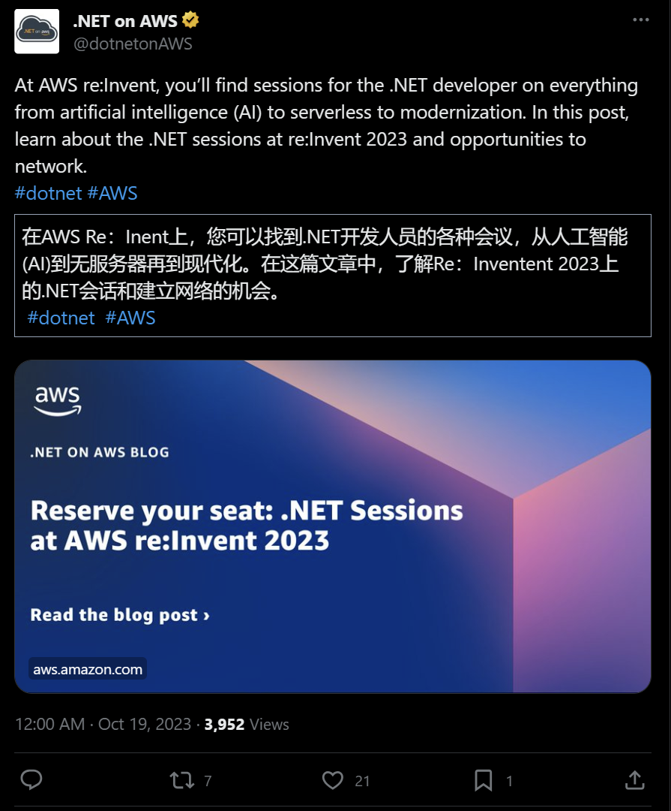

## 国内文章

### C#/.NET/.NET Core优秀项目和框架2023年10月简报

https://www.cnblogs.com/Can-daydayup/p/17804085.html

本文主要介绍了公众号“追逐时光者”定期推广和分享的C#/.NET/.NET Core优秀项目和框架。其中包括SKIT.FlurlHttpClient.ByteDance和SwashbucklerDiary两个项目。SKIT.FlurlHttpClient.ByteDance是全网唯一的C#版字节跳动SDK，封装了全部已知的字节跳动API，可跨平台，持续随官方更新。SwashbucklerDiary是一个.NET开源、跨平台的本地日记APP。公众号的推文中包含了项目和框架的介绍、功能特点以及部分截图等内容。

### NativeBuffering,一种高性能、零内存分配的序列化解决方案[性能测试篇]

https://www.cnblogs.com/artech/p/17789432.html

本文介绍了NativeBuffering的优化和性能测试。NativeBuffering是一种特别的序列化解决方案，它将数据对象转换成连续的字节序列，然后通过新的数据类型对这段字节序列进行封装。这种方法提高了数据读取的性能，但并不适用于跨平台。NativeBuffering的编程模式是围绕“Source Generator”进行的，通过定义部分类和使用BufferedMessageSource属性，可以为数据类型生成额外的类型成员。本文还对NativeBuffering和.NET新版本的原生JSON序列化（System.Text.Json）的性能进行了比较。

### .NET中的数组在内存中如何布局？

https://www.cnblogs.com/artech/p/array-memory-layout.html

本文主要讨论了.NET中值类型和引用类型的内存布局，特别是字符串和数组。对于引用类型对象，除了存储其所有字段成员外，还需要存储一个Object Header和TypeHandle。对于数组类型，其内存布局中，前置4个字节以UInt32的形式存储数组的长度，后面依次存储每个数组元素的内容。对于值类型的数组，Payload部分直接存储元素自身的值。文章通过代码示例详细解释了如何将一个字节数组对象在内存中的字节序列读出来。

### 记一次 .NET 某工厂无人车调度系统 线程爆高分析

https://www.cnblogs.com/huangxincheng/p/17802523.html

本文讲述了一位朋友程序中线程数爆高的问题。通过使用命令观察，发现确实存在4600+的线程，问题确实存在。进一步观察每个线程的活动，发现大量线程卡在RoutingService.Push上。查看Push方法的逻辑，发现问题出在Result上，异步方法无法完成。代码中的GetSerial()方法使用了SemaphoreSlim，但这看起来非常多余。既然Result无法得到值，说明异步方法无法完成。为了找出原因，还需要进一步观察slim信号量的情况。

### 实现一个极简的字节数组对象池

https://www.cnblogs.com/artech/p/byte-array-pool.html

.NET使用`ArrayPoolPool<T>`和`MemoryPool<T>`为`Array/Memory<T>`提供对象池功能。在一个项目中，作者需要使用大型字节数组的对象池，希望将它们分配到POH上以降低GC的压力。由于`ArrayPoolPool<T>`无法提供支持，作者提供了一个简单的实现。首先，作者定义了Bucket类，用于管理池化的字节数组。然后，作者创建了ByteArrayOwner类，它封装了字节数组和所在的Bucket。如果数组长度超过阈值，意味着Bucket不存在，借出的字节数组也不需要归还。ByteArrayOwner实现了IDisposable接口，Dispose方法调用Bucket的Add方法完成了字节数组的归还。

### .NET8 起步

https://www.cnblogs.com/xiaolipro/p/17809633.html

.NET是一个免费的跨平台开源开发人员平台，用于生成各种类型的应用，如Web、移动和桌面、机器学习、游戏开发、IOT等。它提供高效生产力，包括泛型、LINQ和异步编程等高级语言功能，广泛的类库和多语言支持，以及一致性Standard标准和应用程序模板。.NET是面向重视生产力、性能、安全性和可靠性的开发人员的终极平台。它支持跨应用、跨语言、跨平台开发，使开发人员能够以更少的成本，更快地构建应用。.NET还拥有强大的生态，位于.NET Foundation基金会下，已有100,000+ OSS贡献，3,700+ OSS公司参与者，得到Microsoft的官方支持，并受到数以千计的公司和数百万开发人员的信任。

### 不可复制的PDF转成双层可复制PDF

https://www.cnblogs.com/xiaohemiao/p/17803534.html

本文介绍了如何使用开源库PdfiumViewer、PDFsharp和PaddleSharp创建一个可以编辑和复制扫描或虚拟打印机生成的PDF的工具。首先，使用PdfiumViewer渲染显示PDF并将其转换为图片。然后，使用PaddleSharp对提取的图片内容和bbox坐标进行OCR识别。最后，将坐标转换为PDF的坐标，并使用PDFsharp重新生成PDF。如果需要保持原有格式，需要将转换的图片重新写入生成的PDF。这样就实现了双层PDF的效果。

### dotnet 探究 SemanticKernel 的 planner 的原理

https://www.cnblogs.com/lindexi/p/17810633.html

本文介绍了SemanticKernel的工作原理。SemanticKernel的底层通过AI层的输入和输出只有文本，而Planner需要执行编排调度多个功能任务以实现功能。工程师提供各种功能能力，AI根据用户输入的需求描述，配合工程师提供的各种功能能力完成用户的需求。例如，实现使用某个语言的作诗需求，用户描述需求，工程师提供作诗和翻译的函数或插件，AI层进行编排调度，先调用作诗函数进行作诗，然后将作诗结果作为翻译函数的翻译进行翻译，最后将翻译结果返回给用户。在SemanticKernel的辅助下，这个需求将非常简单实现。

### Dapper.Lite 扩展

https://www.cnblogs.com/s0611163/p/17807007.html

本文介绍了Dapper.Lite和LiteSql，两款经过重构和精简的ORM。Dapper.Lite是Dapper的扩展，支持Lambda表达式的单表查询和SQL拼接查询条件，适用于多种数据库。LiteSql则是不依赖Dapper的版本。这两款ORM的目标是简单易用，稳定可靠。如果你不想用EF或SqlSugar，喜欢写SQL，打算用Dapper，可以试试Dapper.Lite。

### Net 高级调试之三：类型元数据介绍（同步块表、类型句柄、方法描述符等）

https://www.cnblogs.com/PatrickLiu/p/17788818.html

这篇文章是《Net 高级调试》的第三篇，详细讨论了Net类型在内存中的具体样子。文章首先介绍了测试环境，包括操作系统、调试工具、开发工具和Net版本等。然后，文章详细解释了栈和堆的概念，以及Net程序中的基本编程单元类型，包括值类型和引用类型。值类型包括枚举、结构和其他简单类型，一般存放在线程栈上。引用类型包括接口、数组、类和自定义的Class，一般存在托管堆中。文章还详细介绍了值类型布局、引用类型布局、同步块表、类型句柄和方法描述符等概念。

### Net 高级调试之五：如何在托管函数上设置断点

https://www.cnblogs.com/PatrickLiu/p/17804823.html

本文是《Net 高级调试》的第五篇，主要讲解如何在托管方法和非托管方法设置断点。文章首先介绍了调试环境，包括操作系统、调试工具、开发工具、Net版本和CoreCLR源码。然后，详细解释了如何在非托管函数和托管函数下断点。对于非托管函数，可以直接在机器代码上设置断点。对于托管函数，由于可能还未生成机器码，需要采用三种方式：在编译后的函数上下断点、在未编译的函数上下断点和对泛型方法下断点。最后，文章通过具体的调试操作过程，实际演示了如何设置断点。

### 两种基于时间窗口的限流器的简单实现

https://www.cnblogs.com/artech/p/window-based-rate-limiter.html

本文讲述了作者为OpenTelemetry的Tracing组件开发的基于速率限制的跟踪采样策略。作者认为现有的RateLimiter解决方案过于复杂，因此尝试实现了一种简单且无锁的解决方案。作者定义了一个IRateLimiter接口，并提供了基于“滑动时间窗口”的实现类型SliddingWindowRateLimiter。这种实现方式利用了BoundedChannel对象，将指定的阈值作为它的最大容量，从而实现了速率限制。

### EFCore 使用FluntApi配置 全局查询筛选器

https://www.cnblogs.com/cyfj/p/17810311.html

本文介绍了如何在使用efCore时通过配置查询筛选器实现全局软删除。在类中通常有一个IsDel属性表示软删除，每次查询都要指定IsDel为false，这很麻烦。在efCore中，可以在DbContext类中重写OnModelCreating方法，为SysUser类配置查询筛选器。但如果项目中有很多实体类，可以新建EntityBase文件夹，实现IEntityTypeConfiguration接口，对实体类进行配置。然后在OnModelCreating方法中，通过modelBuilder.ApplyConfigurationsFromAssembly方法自动应用所有实体配置类。如果不在同一个程序集，可以加载指定程序集。这样就可以实现全局查询筛选了。

### Web SSH 的原理与在 ASP.NET Core SignalR 中的实现

https://www.cnblogs.com/aobaxu/p/17799346.html

本文介绍了如何在前端管理终端实现SSH到主控机的终端。使用伪终端模拟输入输出设备执行相应进程，如vim等程序可以在终端中运行。设计包括建立连接、监听终端输出和前端输入，以及处理超时和关闭。依赖库包括portable_pty用于建立终端，xterm.js用于前端展示终端界面，SignalR用于.NET系列Web实时通信。最后，提供了Rust代码示例，用于建立伪终端并和.NET服务通信。

### 使用 Docker Compose 部署 RabbitMQ 的一些经验与踩坑记录

https://www.cnblogs.com/morang/p/devops-rabbitmq-install.html

本文主要介绍了开源消息队列系统RabbitMQ的部署安装和使用经验。RabbitMQ具有成熟稳定、消息持久化、灵活的消息路由、高性能、高可用性、高扩展性等特点，还支持插件系统和.NET/Java的SDK。在项目中，RabbitMQ被用于日志记录、消息发送、数据同步等，表现稳定可靠。本文还详细介绍了如何使用Docker Compose V2安装RabbitMQ v3.12.6，包括准备工作、使用Docker Compose安装、配置说明和配置文件等内容。最后，展示了部署成功的界面，并介绍了如何安装延迟消息插件。

### 利用一段字节序列构建一个数组对象

https://www.cnblogs.com/artech/p/manually-build-array.html

本文详细介绍了.NET下数组对象的内存布局，并展示了如何根据这个布局规则创建一段字节序列来表示一个数组对象。文章首先回顾了数组对象的内存布局，然后通过BuildArray方法构建一个指定长度的数组，数组元素类型由泛型参数决定。根据内存布局规则计算出目标数组占据的字节数，并据此创建一个对应的字节数组来表示构建的数组。最后，将数组类型的TypeHandle的值写入对应的位置，紧随其后的4个字节写入数组的长度，从而构建出一个指定元素类型/长度的空数组。

### ASP.NET Core+Vue3 实现SignalR通讯

https://www.cnblogs.com/cyfj/p/17808647.html

本文介绍了如何在ASP.NET Core 3.0及更高版本中使用SignalR的Hub。Hub已集成到ASP.NET Core框架中，无需单独引用Microsoft.AspNetCore.SignalR包。创建一个类继承Hub，实现CreateConnection和SendMessageToUser方法，分别用于创建连接和向特定用户发送消息。在程序中注册Hub，然后在前端Vue项目中安装@microsoft/signalr包，创建myHub.js文件，建立SignalR连接。最后，模拟了数据库登录的API部分。

### .NET8 WebApplication剖析

https://www.cnblogs.com/xiaolipro/p/17810161.html

"WebApplication"是用于配置HTTP管道和路由的web应用程序。它实现了"IHost"接口，代表程序的抽象，具备启动、停止生命周期，并通过"IServiceProvider"获取服务。"WebApplication"还实现了"IApplicationBuilder"接口，具有管道机制，这是.NET中的一个洋葱模型。在"Build"方法中，会执行四个钩子，完成服务的配置和注册。此外，"IStartupValidator"、"IHostedService"、"IHostedLifecycleService"等提供了不同的钩子，可以加入自定义的业务逻辑。

### Apollo 配置中心的部署与使用经验

https://www.cnblogs.com/morang/p/devops-apollo-install.html

本文主要介绍了携程开源的分布式配置管理中心Apollo的部署安装和使用经验。Apollo特点包括成熟稳定，支持管理多环境/多集群/多命名空间的配置，配置修改发布实时通知到应用程序，支持权限控制、配置继承，版本管理，灰度发布，使用监控等。Apollo在微服务项目中作为配置中心，表现稳定，体验良好。Apollo的部署包括准备阶段和使用Docker Compose安装阶段。准备阶段需要准备apollo-db，apollo-configservice，apollo-adminservice，apollo-portal，Deureka等组件。使用Docker Compose安装阶段需要准备好compose.yml和./initsql/初始化脚本，修改其中的IP，拷贝到服务器，然后运行。

### C#winform软件实现一次编译，跨平台windows和linux兼容运行，兼容Visual Studio原生界面Form表单开发

https://www.cnblogs.com/easywebfactory/p/17790016.html

本文讨论了如何让C#桌面软件在Linux系统上运行的问题。由于微软的.net core开发工具并未支持Linux系统下的winform界面软件，作者提出了一个解决方案，即自定义封装软件的System.Windows.Forms组件，将支持Windows和Linux的界面框架GTK封装进System.Windows.Forms中。这个方案兼容原生C#表单控件，不需要重新开发，只需换成该组件重新编译即可。同时，它还支持Visual Studio可视化开发，只需引用DLL即可。作者还开发了组件GTKSystem.Windows.Forms，它的控件类库命名空间和类名称沿用了原生System.Windows.Forms的类库名称，可以在原生开发的C#软件工程里，直接引用GTKSystem.Windows.Forms就能兼容运行。

### 浅析 C# Console 控制台为什么也会卡死

https://www.cnblogs.com/huangxincheng/p/17782167.html

本文主要探讨了控制台卡死的原因和底层原理。作者指出，控制台卡死通常是由于触动了"快速编辑窗口"。尽管这个问题的原因已知，但底层原理却鲜有人知。控制台能响应窗口事件，是因为它开启了一个配套的conhost窗口子进程，用来承接UI事件。此外，文章还探讨了进程间如何通信，详细解释了客户端通过Console.WriteLine写入的内容如何被Server端的conhost!ConsoleIoThread方法接收到的过程。

### Net 高级调试之二：CLR和Windows加载器及应用程序域介绍

https://www.cnblogs.com/PatrickLiu/p/17784634.html

本文是关于.Net高级调试的学习记录，主要介绍了调试工具和.Net框架的相关概念。文章中提到的调试工具是Windbg，开发工具是Visual Studio 2022，测试环境是Net Framework 4.8。文章还解释了.Net框架的基本构成，包括虚拟执行引擎（CLR）和相关的框架类库。此外，文章还详细介绍了.Net程序的编译过程，包括编译器编译和JIT编译两个阶段。编译器编译阶段将C#源码编译成IL代码，JIT编译阶段则将IL代码编译成可以直接运行的机器代码。

### .net core中你的MD5用对了吗？

https://www.cnblogs.com/broadm/p/17789951.html

本文介绍了在.net环境中获取字符串MD5的几种方法，包括StringBuilder版本、BitConverter版本和StringConcat版本，并进行了性能对比。结果显示，StringBuilder和BitConverter的性能相对较好，而StringConcat的性能最差。然而，从.net 5.0开始，提供了两个更高效的方法：Convert.ToHexString和MD5.HashData。特别是MD5.HashData静态版本，其性能相对于StringBuilder，单线程性能提高了3倍，多线程性能提高了5倍。

### 一个简单高效低内存的.NET操作Excel开源框架 - MiniExcel

https://www.cnblogs.com/Can-daydayup/p/17790798.html

本文介绍了.NET操作Excel的开源框架MiniExcel，它能有效避免大数据量操作时的内存溢出问题。MiniExcel以流的角度写底层算法逻辑，将原本占用的1000多MB内存降低到几MB，避免内存不足的情况。它的特点包括低内存耗用，支持即时操作每行数据，兼具LINQ延迟查询特性，轻量，不需要安装Microsoft Office、COM+，DLL小于150KB，以及简便操作的API风格。性能对比显示，MiniExcel在导入、查询、导出、创建Excel方面都表现出色。

### ExcelPatternTool 开箱即用的Excel工具包现已发布！

https://www.cnblogs.com/jevonsflash/p/17787878.html

本文介绍了基于NPOI开发的ExcelPatternTool，这是一个用于处理Excel的工具包，特别强调单元格样式的控制，提升了初始数据导入和报表导出等功能的易用性。ExcelPatternTool具有数据校验、数据导入和自定义样式填充数据导出等功能，还提供了独立的Excel校验工具，CLI版本和带UI（WPF）版本的程序，以及ODBC扩展。用户可以通过引用ExcelPatternTool.Core在项目中使用，支持从Excel导入数据和导出数据到Excel。

### Net 高级调试之一：开始认识一些调试工具

https://www.cnblogs.com/PatrickLiu/p/17781974.html

本文是关于.Net高级调试的学习记录，作者通过学习.Net高级调试，对以前模糊的地方有了更深入的理解。虽然学习过程中遇到了困难，但作者坚持下来，收获颇丰。作者感谢一线码农的视频教程，对其学习有很大帮助。文章中还介绍了调试环境，包括操作系统Windows Professional 10，调试工具Windbg Preview，开发工具Visual Studio 2022，Net版本Net Framework 4.8，以及CoreCLR源码。作者强调，好的调试工具对于程序调试至关重要，接下来将介绍一些调试工具。此外，文章还提供了一些测试代码，以便读者更好地理解Windbg的使用过程和方法。

### C#版字节跳动SDK - SKIT.FlurlHttpClient.ByteDance

https://www.cnblogs.com/Can-daydayup/p/17793395.html

本文介绍了一款C#开源的字节跳动SDK：SKIT.FlurlHttpClient.ByteDance，它封装了全部已知的字节跳动API，包括字节小程序开放平台、抖音开放平台等模块，支持跨平台使用。该项目基于Flurl.Http，支持.NET Framework 4.6.1+、.NET Standard 2.0+、.NET Core 2.0+、.NET 5+，并且支持Windows / Linux / macOS多平台部署。此外，它还提供了全异步式编程，强类型接口模型，以及完整、完善、完全的字节跳动HTTP API封装。

### 简单实现.NET Hook与事件模拟

https://www.cnblogs.com/podolski/p/17791537.html

作者分享了他在玩《星露谷物语》时，为了提高效率，自己编写了一个自动点击的程序。他使用了.NET的SharpHook组件，设置了全局快捷键来控制自动点击的开关。在程序中，他设置了每隔两秒钟模拟鼠标左键点击一次。这样，只要游戏在前台运行，按下设定的快捷键，鼠标悬停在物品上就能自动拿起或放下，再按另一个快捷键就能停止自动点击。他提醒，很多游戏会单独监听鼠标的按下与松开，所以在模拟点击时需要设置适当的延时。

### Util应用框架快速入门(4) - 集成测试开发入门

https://www.cnblogs.com/xiadao521/p/17789607.html

本文主要讲述了如何在Util应用框架开发的项目中编写集成测试。自动化测试对于Util应用框架的开发非常重要，能保证基础功能的稳定性。测试分为单元测试和集成测试，单元测试隔绝外部依赖，仅测试自身的某些功能，集成测试则直接访问外部依赖，对关联的所有类型进行测试。自动化测试可以帮助开发者拦截代码逻辑出现变化的错误，但也存在维护成本高的问题。测试框架选型包括XUnit.Net，XUnit.DependencyInjection，Moq，Bogus和AutoBogus等。最后，文章介绍了在Util项目中如何开发集成测试，包括运行示例项目和数据访问层集成测试等内容。

### Facade 外观模式简介与 C# 示例【结构型5】【设计模式来了_10】

https://www.cnblogs.com/hnzhengfy/p/SJMSLL_Facsde.html

本文介绍了外观模式，这是一种设计模式，通过提供一个统一的接口，使客户端可以访问子系统中的一组接口，而无需关心子系统中接口的具体实现。外观模式的优点包括提供统一接口，隐藏子系统复杂性，提高代码可扩展性。缺点包括可能增加系统复杂性，违反开闭原则，增加系统耦合度，降低系统灵活性。适用场景包括子系统复杂，系统结构层次复杂，需要隐藏子系统细节，需要降低耦合度等。最后，文章通过一个家庭影院的示例代码，展示了如何实现外观模式。

### 浅析 C# 控制台的 Ctrl+C 是怎么玩的

https://www.cnblogs.com/huangxincheng/p/17784301.html

本文主要讲述了Windows控制台程序中Ctrl+C事件的底层实现。首先，通过C#代码示例，展示了如何订阅Console.CancelKeyPress事件，以便在用户按下Ctrl+C时执行特定逻辑。然后，通过反编译和调试，揭示了Console.CancelKeyPress事件是如何通过Win32 API的Kernel32.SetConsoleCtrlHandler方法注册的。这表明C#的Ctrl+C事件实际上是基于Win32 API封装的。

### 使用aop(肉夹馍)为BlazorServer实现统一异常处理

https://www.cnblogs.com/jionsoft/p/17783675.html

本文主要讨论了在web开发中如何处理异常。通常，用户的一个操作对应一个http请求，一个controller的action会执行这个处理。在asp.net core中，常见的方式是定义一个“异常处理中间件”，在catch中捕获异常，记录日志，并返回一个统一的异常json结构。在blazor server中，服务端和浏览器建立了长连接websocket，后续的浏览器和服务端的交互没有类似http这种请求响应了，那在哪里做全局异常拦截呢？blazor中提供了ErrorBoundary组件，当ChildContent中的组件发生了异常，则ChildContent隐藏ErrorContent会被显示出来。BootstrapBlazor是一套bootstrap风格的blazor ui组件库，它提供了全局异常处理方式，它的方式是在根组件上截获异常，这样应用中的任何组件发生异常时它都能处理。

### Util应用框架快速入门(5) - 权限入门

https://www.cnblogs.com/xiadao521/p/17794174.html

本文介绍了Util平台，这是一个基于.NET的应用框架，提供了基于资源和角色的权限模块，可以控制前端菜单和按钮，同时也能控制API的访问。Util平台分为三个项目，分别满足单体架构和微服务架构的需求。其中，Util.Platform.Single是单体架构版本，Util.Platform.Dapr是微服务架构版本，Util.Platform.Share是共享库，抽取了单体架构和微服务架构的共享代码。此外，Util平台还提供了系统功能和权限管理模块，包括应用程序管理、声明管理、资源管理、用户管理、角色管理和权限管理等功能。

### 升讯威在线客服系统的并发高性能数据处理技术：为多线程处理同步数据

https://www.cnblogs.com/sheng_chao/p/17784851.html

本文介绍了作者开发的升讯威在线客服系统，这是一个免费开源的项目，已经获得了许多用户的认可。最近，该系统成功通过了客户组织的压力测试，表现稳定，无异常和掉线，消息实时到达，无任何延迟。作者还计划通过一系列的文章详细分析升讯威在线客服系统的并发高性能技术是如何实现的，包括使用了哪些方案以及具体的做法。本文主要介绍了如何为多线程处理同步数据，包括同步代码区域、手动同步、同步上下文等多种策略。

## 主题

### 代表 5 倍生产力。宣布 Uno Platform 5.0
https://platform.uno/blog/uno-platform-5-0/

Uno平台5.0已发布。

此版本包括 C# 标记（XAML 的 Fluent 风格 UI 描述替代方案）、Figma 到 C# 标记插件、改进的热重载、MVUX（模型-视图-更新扩展）的改进、删除对 Xamarin 和 .NET 6 的支持，等等。包含各种改进和更改。

### 版本 2.7.4 · StackExchange/StackExchange.Redis
https://github.com/StackExchange/StackExchange.Redis/releases/tag/2.7.4

StackExchange.Redis 2.7.4 已发布。

此版本增加了对 RESP3 协议的支持。对于RESP3，结果的格式存在一些差异，因此您需要在代码或连接字符串中显式指定它才能使用它，如果您直接处理命令，则这是必要的。

- [RESP3 和 StackExchange.Redis | StackExchange.Redis](https://stackexchange.github.io/StackExchange.Redis/Resp3)

### 版本 8.1.0 · App-vNext/Polly
https://github.com/App-vNext/Polly/releases/tag/8.1.0

Polly 8.1.0 已发布。

此版本包括改进，例如改进与 AOT 的兼容性以及从 DI 配置 ResilienceContextPool。

### BenchmarkDotNet v0.13.10 · dotnet/BenchmarkDotNet · 讨论 #2457
https://github.com/dotnet/BenchmarkDotNet/discussions/2457

BenchmarkDotNet v0.13.10 已发布。

此版本增加了对 .NET 9 的支持。

### .NET MAUI 中的 .NET 8 性能改进 - .NET 博客
https://devblogs.microsoft.com/dotnet/dotnet-8-performance-improvements-in-dotnet-maui/

关于 .NET 8 中的 .NET MAUI 性能改进。

- 新功能
- 构建、内循环性能
- 改进的性能和应用程序大小
- 内存泄漏
- 工具和文档

### 在 WinAppSDK 1.4.2 中发布 WinUI 3 · microsoft/microsoft-ui-xaml · GitHub
https://github.com/microsoft/microsoft-ui-xaml/releases/tag/winui3/release/1.4.2

Windows App SDK 1.4.2 已发布。

该版本主要修复崩溃等bug。 [源代码也可用](https://github.com/microsoft/microsoft-ui-xaml/tree/winui3/release/1.4.2)。

### 发布诊断版本 - v8.0.452401 · dotnet/diagnostics

https://github.com/dotnet/diagnostics/releases/tag/v8.0.452401

.NET 诊断工具 8.0.452401 发布。

此版本包括 dotnet-monitor 和计数器集成，以及对 dotnet-dump/SOS 的一些改进。

### .NET Framework 2023 年 10 月累积更新预览 - .NET 博客
https://devblogs.microsoft.com/dotnet/net-framework-october-2023-cumulative-update-preview/

.NET Framework 2023 年 10 月累积更新的预览版。

此版本修复了解析 XAML/XPS 时出现的问题。

## 文章、幻灯片等

### Microsoft Ignite 2023 即将到来！（11 月 14 日至 17 日）- Visual Studio 博客
https://devblogs.microsoft.com/visualstudio/microsoft-ignite-2023-is-around-the-corner-nov-14-17/

介绍 Microsoft Ignite 2023（11 月 14 日至 17 日）以及该活动中的 Visual Studio 会议。

### Win32 API 早期访问中的写入时复制 - Engineering@Microsoft
https://devblogs.microsoft.com/engineering-at-microsoft/copy-on-write-in-win32-api-early-access/

关于 CopyFile API 现在支持 Windows 11 Insider Canary 频道上的 ReFS (DevDrive) 写入时复制。

这消除了构建引擎和工具来支持 CoW 的需要。

### 新的 F# 编译器功能：基于图形的类型检查 - .NET 博客
https://devblogs.microsoft.com/dotnet/a-new-fsharp-compiler-feature-graphbased-typechecking/

关于 F# 编译器中新的基于图形的类型检查机制。

### 使用 Testcontainers 尝试 MongoDB 与 EF Core - .NET 博客
https://devblogs.microsoft.com/dotnet/efcore-mongodb/

了解如何使用 Testcontainers 来试验 Entity Framework Core 支持的 MongoDB 操作。

### 集成 OmniSharp-Vim 和 fzf - Qiita
https://qiita.com/lx-sasabo/items/b2226eb3594a2acaeafb

关于如何通过链接 OmniSharp-Vim 和 fzf 来实现 Find Usations，以便在 Vim 中编写 C#。

### 使用 Entity Framework Core 保存和恢复对象，而不依赖于特定的具体类型
https://zenn.dev/oyasumi731/articles/4a9e30385d0736

如何在 Entity Framework Core 中使用抽象类型和继承（每层次结构 (TPH) 模式）进行映射。

### [C#] 使用 AES 的加密和解密步骤
https://zenn.dev/nekojoker/articles/670824eeaa1ba8

使用 AES 加密和解密数据的实用指南。

### 避免使用 TimeProvider 和 ITimer 进行不稳定测试：探索 .NET 8 预览版 - 第 12 部分
https://andrewlock.net/exploring-the-dotnet-8-preview-avoiding-flaky-tests-with-timeprovider-and-itimer/

如何使用“TimeProvider”和“ITimer”（.NET 8 中引入的时间和计时器抽象），以及如何使用它们来确保稳定的单元测试。

### 使用 Kiota 生成 .NET API 客户端的开发人员指南
https://medium.com/@ismailozcelik/developers-guide-to-generate-net-api-client-with-kiota-29ef9ec3ba87

了解如何使用 Kiota 为 OpenAPI 中定义的 REST API 生成客户端。

### 组织 ASP.NET Core 最小 API
https://www.tessferrandez.com/blog/2023/10/31/organizing-minimal-apis.html

介绍使用 ASP.NET Core Minimal API 定义和实现 API 时组织代码的技术。使用扩展方法进行聚合、使用MapGroup进行分组等。

### .NET 8 让您每天都更快。
https://medium.com/medialesson/net-8-makes-you-faster-everyday-233f9740379d

.NET 8 及更早版本中一些基本类的性能比较。

### 将 Unity 移植到 CoreCLR | Unity 博客
https://blog.unity.com/engine-platform/porting-unity-to-coreclr

有关将 Unity 移植到 CoreCLR 的说明。本文解释了如何在 CoreCLR 上运行带有 GC 的 Unity。

### 使用 ASP.NET Core Minimal API 的全局端点过滤器
https://khalidabuhakmeh.com/global-endpoint-filters-with-aspnet-core-minimal-apis

引入一种技术，允许您使用“.MapGroup(string.Empty)”创建一个空组，并通过为其指定端点过滤器将其定义为全局过滤器。

### 关于 .NET 8 中默认启用的动态 PGO - Neno's Garden。
https://blog.neno.dev/entry/2023/10/29/131336

关于 .NET 8 中默认启用的动态 PGO，解释了 PGO 的机制及其优化行为。

- [关于.NET 8中默认启用的动态PGO](https://speakerdeck.com/nenonaninu/dot-net-8-deji-ding-deyou-xiao-ninatuta-dynamic-pgo-nituite)

### F# 8 中的新增功能
https://amplify-fsharp.github.io/files/sessions/amplify-fsharp-october-2023.pdf

F# 8 中的更改摘要幻灯片。

### 如何将 Testcontainers 与 .NET 单元测试结合使用 | .NET 工具博客
https://blog.jetbrains.com/dotnet/2023/10/24/how-to-use-testcontainers-with-dotnet-unit-tests/

了解如何使用 Testcontainers 在容器中使用临时数据库编写单元测试。

本文还介绍了如何为每个集合或类使用容器，以及如何测试 ASP.NET Core 应用程序。

### .NET 8 中的短路路由：探索 .NET 8 预览版 - 第 11 部分
https://andrewlock.net/exploring-the-dotnet-8-preview-short-circuit-routing/

对 .NET 8 中 ASP.NET Core 中引入的短路路由的说明。

短路路由是一种允许您在处理端点时跳过中间件的机制。

### 集合表达式 
https://ufcpp.net/study/csharp/datatype/collection-expression/

C# 12 中引入的集合表达式的说明。

### 使用 TLS=true 从 .NET6 连接到 Amazon DocumentDB - Qiita
https://qiita.com/ishiyama0530/items/0c5dd19ab4df548c2c5f

我从启用了 TLS 的 .NET 6 容器连接到 Amazon DocumentDB 时遇到证书问题。

### .NET 8 中 Blazor 的新增功能“AddCascadingValue 方法”
https://zenn.dev/microsoft/articles/dotnet8-blazor-01

关于在 .NET 8 中添加到 Blazor 的 AddCascadingValue。提供了一种通过将级联值注册到服务而不是从组件来提供级联值的方法。

### Rider 2023.3 EAP 4：改进了运行多个项目、类型依赖关系图等的体验 | .NET 工具博客
https://blog.jetbrains.com/dotnet/2023/10/23/rider-2023-3-eap-4/

Rider 2023.3 EAP 4 已发布。

此版本包括对运行多个项目、保存解决方案过滤器、类型依赖关系图、中央包管理中的代码完成以及性能分析的改进。

### neue cc - 当您的主要语言是另一种语言时如何使用 Rust - csbindgen 的 C# x Rust FFI 实际示例
https://neue.cc/2023/10/23_rusttokyo.html

根据我使用 Rust 的 C# 绑定库 csbindgen 的经验，关于如何使用 Rust 的会议和后续活动。

- [当你的主要语言是 C# x Rust FFI 时如何使用 Rust](https://speakerdeck.com/neuecc/ta-yan-yu-gameinnochang-he-norustnohuo-yong-fa-csbindgenniyoruc-number-x-rust-ffishi-jian-shi-li)

### 在 C# 中使用 FluentScheduler

https://dev.to/karenpayneoregon/using-fluentscheduler-with-c-29ck

## 库、存储库、工具等。

### jsakamoto/Toolbelt.Blazor.ViewTransition：一个路由器组件和一项服务，使您的 Blazor 应用程序通过视图转换 API 在页面之间具有漂亮的动画转换效果。
https://github.com/jsakamoto/Toolbelt.Blazor.ViewTransition

在 Blazor 上提供页面到页面转换的路由器组件。

https://x.com/jsakamoto/status/1718257011740312011?s=12
## 网站、文档等

### .NET 会议日历
https://dotnetconf-calendar.azurewebsites.net/

以 iCalender 格式提供 .NET Conf 2023 日程表的网站。

- [.NET Conf 2023 会议日程将以 iCal 格式发布 | @jsakamoto](https://devadjust.exblog.jp/29731751/)

### 推文

https://x.com/ericlippert/status/1717203249898619248?s=12

---

https://x.com/dotnetonaws/status/1714672688369701286?s=12

---

描述了如果不注意C#的异常处理机制的话，编写的代码可能会导致在管理员权限下运行低信任的代码。

https://x.com/kstrubeg/status/1716101506200433073?s=12

## 版权声明

* 国内板块由 InCerry 进行整理 : https://github.com/InCerryGit/WeekRef.NET
* 其余内容来自 Myuki WeekRef，由InCerry翻译（已获得授权） : https://github.com/mayuki/WeekRef.NET

**由于笔者没有那么多时间对国内的一些文章进行整理，欢迎大家为《.NET周刊-国内文章》板块进行贡献，需要推广自己的文章或者框架、开源项目可以下方的项目地址提交Issue或者在我的微信公众号私信。**

格式如下：

* 10~50字左右的标题
* 对应文章或项目网址访问链接
* 200字以内的简介，如果太长会影响阅读体验

https://github.com/InCerryGit/.NET-Weekly

## .NET性能优化交流群

相信大家在开发中经常会遇到一些性能问题，苦于没有有效的工具去发现性能瓶颈，或者是发现瓶颈以后不知道该如何优化。之前一直有读者朋友询问有没有技术交流群，但是由于各种原因一直都没创建，现在很高兴的在这里宣布，我创建了一个专门交流.NET性能优化经验的群组，主题包括但不限于：

* 如何找到.NET性能瓶颈，如使用APM、dotnet tools等工具
* .NET框架底层原理的实现，如垃圾回收器、JIT等等
* 如何编写高性能的.NET代码，哪些地方存在性能陷阱

希望能有更多志同道合朋友加入，分享一些工作中遇到的.NET性能问题和宝贵的性能分析优化经验。**目前一群已满，现在开放二群。**

如果提示已经达到200人，可以加我微信，我拉你进群: **ls1075**

另外也创建了**QQ群**，群号: 687779078，欢迎大家加入。 

## 抽奖送书活动预热！！！

感谢大家对我公众号的支持与陪伴！为庆祝公众号一周年，抽奖送出一些书籍，请大家关注公众号后续推文！

