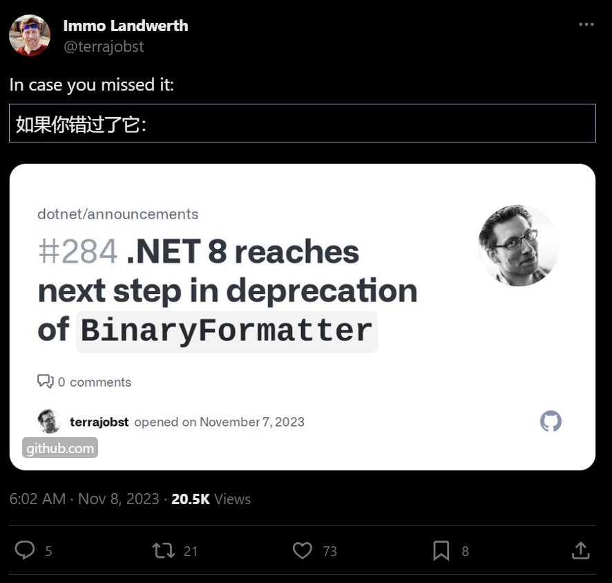

## 国内文章

### 一个基于百度飞桨封装的.NET版本OCR工具类库 - PaddleOCRSharp

https://www.cnblogs.com/Can-daydayup/p/17818557.html

本文介绍了PaddleOCRSharp，这是一个基于百度飞桨PaddleOCR的.NET OCR工具类库。它由C++编写，优化了小图识别准确率，并支持多种开发语言的API调用。PaddleOCRSharp包含文本识别、检测和表格识别功能，支持多种.NET版本。OCR技术帮助将图像中的文字转换为可编辑文本，PaddleOCR旨在提供实用的OCR工具库。项目源码和示例项目说明了如何在.NET环境中使用该工具类库。

### 就是这么坑：DateTime的字符串格式

https://zhuanlan.zhihu.com/p/666195280

本文讲述了.NET开发中一个关于日期格式化的问题，即DateTime.ToString("yyyy/MM/dd")的输出可能会因操作系统设置的更改而变化。作者指出，斜杠("/")在.NET中是一个占位符，代表系统的日期分隔符。为了避免这个问题，可以通过使用IFormatProvider如InvariantInfo，或将斜杠写为'/'来确保输出格式不变。这个细节在.NET文档中不够突出，作者建议应该加强提示。

### 基于.NET、Uni-App开发支持多平台的小程序商城系统 - CoreShop

https://www.cnblogs.com/Can-daydayup/p/17811656.html

本文介绍了基于.NET和Uni-App开发的小程序商城系统CoreShop，它支持多平台部署，具备丰富的营销和管理功能，如分销、代理、团购秒杀等，并提供完整的商品、订单、会员管理系统。CoreShop支持多数据库，可进行二次开发，适用于微信、支付宝等多个小程序平台。后端技术包括Asp.net Core MVC、WebApi、Redis等，前端则使用Uni-App和uView UI。商城系统强调可视化布局和跨平台兼容性，适合快速构建多功能电商平台。

### .net core 到底行不行！超高稳定性和性能的客服系统：性能实测

https://www.cnblogs.com/sheng_chao/p/17812296.html

本文介绍了作者利用业余时间用.net core开发的升讯威在线客服系统，并分享了开发过程。该系统性能优越，每日可处理超过16万次HTTPS请求，内存占用低于300MB，CPU占用低于5%。安全性方面，采用https和wss安全连接，客服端数据报文使用AES加密。系统支持私有化部署，稳定性强，即使在网络不稳定情况下也能保证消息不丢失。系统已在官网免费提供下载，作者希望通过开放、开源、共享的理念，为.net社区贡献优秀的开源产品。

### 模拟ASP.NET Core MVC设计与实现

https://www.cnblogs.com/artech/p/mvc-mini-framework.html

本文介绍了ASP.NET Core MVC框架的设计和请求处理流程。通过简化代码构建Mini版MVC框架，展示了Action方法的描述、路由终结点的注册、参数绑定、方法执行、执行结果响应和整个流程的编排。特别指出Action方法与ActionDescriptor对象是一对多关系，举例说明了如何通过代码注册路由和创建ActionDescriptor。

### TIOBE 11月榜单：Java和 C# 之间的差距缩小到0.7

https://www.cnblogs.com/shanyou/p/17826446.html

TIOBE在2023年11月公布的编程语言排行榜显示，Kotlin排名上升至第15位，而C#与Java的差距从10月的1.2%缩小到0.7%。C#因其能高效对接C/C++代码，在中国产业生态上升中，岗位增量超过Java。Unity中国支持OpenHarmony操作系统，推动高品质游戏和3D内容发展。中科龙芯的.NET编译器团队与Unity中国合作，完成Loongarch架构下Mono适配。开放原子开源基金会积极推进.NET社区合作，中国.NET开发者峰会得到openEuler社区支持。中国积极拥抱开源，推动科技产业发展，贡献于全球科技创新。

### 支持C#的开源免费、新手友好的数据结构与算法入门教程

https://www.cnblogs.com/Can-daydayup/p/17825678.html

本文推荐了Hello算法，这是一个适合初学者的开源免费数据结构与算法教程。教程采用动画图解，内容易懂，支持多种编程语言。读者可以通过GitHub下载源代码，并在Visual Studio2022中打开运行，包括链表、贪心算法、二分查找等示例。还提供了在线预览功能。

### 龙芯发布 .NET 8 SDK 8.0.100-rc2 LoongArch64

https://www.cnblogs.com/shanyou/p/17827640.html

龙芯.NET团队宣布，Loongarch .NET 8将于2023年11月14日发布，与.NET社区同步。自2019年起，龙芯.NET团队已将LoongArch64架构代码合并至.NET主干，确保同步更新。2023年10月27日，龙芯发布基于.NET 8.0-SDK的LoongArch64架构.NET 8.0-SDK试用版，将持续更新。开发者可通过龙芯Nuget源下载所需资源。新版.NET特性包括OSR堆栈替换、PE32+格式核心库文件，以及crossgen2支持，旨在提升LoongArch64平台性能。龙芯平台.NET支持多个64位操作系统，包括Loongnix和统信UOS，提供安全更新、错误修复和性能优化。

### .net 温故知新【13】：Asp.Net Core WebAPI 使用依赖注入DI

https://www.cnblogs.com/SunSpring/p/17816564.html

本文讲述了在WebAPI中使用DI依赖注入的方法。首先创建WebAPI项目，通过Program.cs中的IServiceCollection对象注册服务。示例中创建DITestClass类，并在WeatherForecastController控制器中通过构造函数注入。文章还介绍了[FromService]注入，它允许在请求时注入服务，避免初始化耗时对象影响其他接口。最后，讨论了多层架构注入，即在主项目中注册其他项目类，以便使用。

### NativeBuffering,一种高性能、零内存分配的序列化解决方案[性能测试续篇]

https://www.cnblogs.com/artech/p/native-buffering-buffered-string.html

本文讨论了NativeBuffering序列化方案，它在性能测试中显示出对System.Text.Json的显著优势，尤其在处理字符串时。作者最近优化了字符串序列化性能，使用Person类型数据进行测试，展示了新版的性能提升和优化原理。

### 【.NET】多线程：自动重置事件与手动重置事件的区别

https://www.cnblogs.com/tcjiaan/p/17826114.html

本文讨论了多线程编程中的线程同步问题，介绍了同步事件对象的两种行为：等待和发出信号。通过一个野外烤鱼的例子，说明了线程间的协作。接着，介绍了四种同步事件：Mutex、AutoResetEvent、ManualResetEvent和CountdownEvent。重点分析了自动重置信号和手动重置信号的区别，自动事件在发出信号后会立即重置，而手动事件需要手动重置。最后，通过代码示例展示了自动重置事件的使用。

### 编写高性能C#代码 —— Span&lt;T&gt;

https://www.cnblogs.com/YKAndXLL520/p/17814671.html

本文介绍了.NET Core 2.1中引入的Span类型，它提供了对任意内存连续区域的类型安全和内存安全的读写视图，可以指向堆栈、本机或托管内存。性能测试显示，Span在数组切片操作中速度快且几乎无内存开销。Span还有只读版本ReadOnlySpan，适用于字符串等不可变对象。但Span有局限性，如只能存在于堆栈上，不能作为非堆栈类型字段、被装箱、用于异步方法或被lambda表达式捕获。

### 记录一次内存泄漏排查过程

https://www.cnblogs.com/cplemom/p/17803265.html

本文描述了服务器内存告警处理过程。服务器出现卡顿后，重启服务释放内存，发现可能存在内存泄漏。服务器环境为CentOS 7.6和.NET SDK 5.0。安装了dotnet-counters和dotnet-dump工具，解决了安装中的Https证书和版本兼容问题。通过Top命令和dotnet-counters监控，发现Gen 2和LOH内存占用高，提示可能的内存泄漏问题。

### .NET的各种对象在内存中如何布局[博文汇总]

https://www.cnblogs.com/artech/p/net-memory-layout.html

本文汇总了关于.NET对象类型布局的系列文章，包括值类型和引用类型的内存布局、字符串和数组的特殊存储方式。介绍了如何计算实例内存大小、读取实例内存二进制内容、以二进制形式在内存中构建对象、字符串和数组的内存布局，以及如何用字节序列手动构建数组对象。

### .NET Conf 2023 将在 11 月 15日-17 日 举行 ，附中文日程表

https://www.cnblogs.com/shanyou/p/17826023.html

.NET Conf 2023将于北京时间11月15-17日举行，发布.NET 8，为参与者提供虚拟体验。会议内容涵盖云原生、Blazor全栈、.NET MAUI和.NET智能应用等主题。11月14日将直播.NET Conf Student Zone，介绍人工智能、网络、移动和游戏开发。12月16-17日，.NET Conf China 2023将展示更多内容。活动还邀请赞助商参与，详情可访问官网查看日程。会议将探讨.NET 8的新功能，Blazor在.NET 8中的全栈Web UI，云原生应用开发，性能改进，C# 12的新特性，以及VS Code和C#开发工具包。

### Net 高级调试之六：对象检查之值类型、引用类型、数组和异常的转储

https://www.cnblogs.com/PatrickLiu/p/17812156.html

本文是《Net 高级调试》系列的第六篇，深入探讨了C#中值类型和引用类型的内存形态，以及数组的内存布局，并介绍了如何通过调试工具分析未捕捉异常导致的程序崩溃。作者分享了个人学习经验，强调理解基础知识的重要性，并提供了调试环境的详细说明。文章还讲述了对象检查、内存转储、值类型和引用类型的转储方法，以及如何分析异常。最后，作者强调了通过实际代码测试来验证学到的知识的重要性。

### 聊一聊 tcp/ip 在.NET故障分析的重要性

https://www.cnblogs.com/huangxincheng/p/17815469.html

本文通过.NET程序网络故障分析强调计算机网络基础知识的重要性，特别是对tcpip协议的理解。作者通过两个例子展示tcp协议在故障分析中的应用。第一个例子是程序偶发性超时，原因是代理服务器不稳定。作者用WebAPI和HttpClient代码示例，并用wireshark监控流量，发现代理服务器故障导致的通讯问题。

### Asp.Net Core webapi+net6 使用资源筛选器(过滤器) 做缓存

https://www.cnblogs.com/cyfj/p/17815126.html

本文介绍了如何在ASP.NET Core中使用ResourceFilter特性和MemoryCache实现方法级别的缓存。首先定义ResourceFilterAttribute类，标记需要缓存的方法。然后创建ResourceFilter过滤器，利用IMemoryCache接口存取缓存，以请求IP和方法名作为缓存键。在ResourceFilter中，若缓存存在则直接返回结果，否则执行方法并缓存结果。在程序启动时，需注入MemoryCache服务并配置ResourceFilter。最后，在控制器的Action上加上ResourceFilter特性以启用缓存。注意，避免缓存IQueryable和IEnumerable等延迟执行类型，以免失去缓存的效果。

### 四个id 生成器性能比较记录

https://www.cnblogs.com/fs7744/p/17823881.html

本文介绍了Seata改进的雪花算法IdGenerator，是一个分布式UUID生成器。文章提供了C#语言的移植代码，包含初始化时间戳、序列号和工作节点ID的方法，以及生成下一个ID的逻辑。该算法通过位运算保证ID的唯一性和顺序性，适用于分布式系统中生成唯一标识符。

### Welcome to YARP - 5.身份验证和授权

https://www.cnblogs.com/condding-y/p/17818749.html

本文介绍了YARP反向代理服务的身份验证和授权功能。身份验证确认用户身份，授权决定用户权限，两者在ASP.NET Core中有详细文档。YARP利用.NET的认证授权机制，通过策略和中间件实现，可减轻目标服务器负载，保护应用程序。

### 开发现代化的.NetCore控制台程序：(2)创建一个C#项目模板

https://www.cnblogs.com/deali/p/17823731.html

本文介绍了FluentConsole.Templates脚手架模板，用于快速创建.NetCore控制台应用。模板提供依赖注入、日志、配置等现代化功能，并展示了如何安装和使用模板创建项目。还详细说明了项目目录结构和如何创建自己的项目模板。

## 话题

### System.IO的便利性 - .NET博客
https://devblogs.microsoft.com/dotnet/the-convenience-of-system-io/

### .NET 8中身份认证的新特性 - .NET博客
https://devblogs.microsoft.com/dotnet/whats-new-with-identity-in-dotnet-8/

### 发布ILSpy 8.2 · icsharpcode/ILSpy
https://github.com/icsharpcode/ILSpy/releases/tag/v8.2

### 发布v6.1.0：新版本发布了！· CommunityToolkit/Maui
https://github.com/CommunityToolkit/Maui/releases/tag/6.1.0

### 发布版本v2.59.0 · grpc/grpc-dotnet
https://github.com/grpc/grpc-dotnet/releases/tag/v2.59.0

### 发布2.3.0 Beta 4 · mysql-net/MySqlConnector
https://github.com/mysql-net/MySqlConnector/releases/tag/2.3.0-beta.4

### 发布Microsoft.UI.Xaml v2.8.6 · microsoft/microsoft-ui-xaml
https://github.com/microsoft/microsoft-ui-xaml/releases/tag/v2.8.6

### 更多的Bug修复：ReSharper 2023.2.3和Rider 2023.2.3已发布！| .NET工具博客
https://blog.jetbrains.com/dotnet/2023/11/03/resharper-rider-2023-2-3/

## 文章、幻灯片等
### 【C#】用反射操作固定长度数组
https://zenn.dev/ruccho/articles/c000525edfaffe

### 在ASP.NET Core中从multipart/form-data部分读取JSON和二进制数据
https://andrewlock.net/reading-json-and-binary-data-from-multipart-form-data-sections-in-aspnetcore/

### .NET注释月刊 | 2023年11月 | .NET工具博客
https://blog.jetbrains.com/dotnet/2023/11/09/net-annotated-monthly-november-2023/

### 时隔多时的梯子游戏适配
https://zenn.dev/panda728/articles/1846b923cfab6a

### ReSharper 2023.3 EAP 6：代码分析性能提升，支持C# 12拦截器，以及更多。| .NET工具博客
https://blog.jetbrains.com/dotnet/2023/11/08/resharper-2023-3-eap-6/

### MoonSharp - 在.NET中运行Lua脚本
https://khalidabuhakmeh.com/moonsharp-running-lua-scripts-in-dotnet

### 如何深入CLR
https://chnasarre.medium.com/how-to-dig-into-the-clr-bd67d884f8da

### JetBrains Rider是如何实现.NET WebAssembly调试的 | .NET工具博客
https://blog.jetbrains.com/dotnet/2023/11/07/how-jetbrains-rider-implemented-net-webassembly-debugging/

### .NET 8中的ConfigureAwait
https://blog.stephencleary.com/2023/11/configureawait-in-net-8.html

### 探索对象布局 - 杀死一个模拟bug
https://vannevel.net/posts/exploring-object-layouts/

### .NET HttpClient的可扩展性：支持Unix域套接字和命名管道
https://medium.com/@madhus.bsg/net-httpclient-extensibility-support-for-unix-domain-sockets-named-pipes-abe3c66ffb6e

### 【C#】关于zero-byte reads的优化和钉住 - ねののお庭。
https://blog.neno.dev/entry/2023/11/11/215353

### 使用ASP.NET Core的Native AOT - 概述
https://www.thinktecture.com/en/net/native-aot-with-asp-net-core-overview/

### .NET Conf 2023回顾日本 - 学习最新的.NET | 微软活动
https://mktoevents.com/Microsoft+Event/415522/157-GQE-382

### .NET Conf 2023仙台 - connpass
https://minamimachi.connpass.com/event/298198/

## 库、仓库、工具等
### microsoft/inshellisense：IDE风格的命令行自动完成
https://github.com/microsoft/inshellisense

### mikihiro-t/NormalizeJapaneseAddressesNET: 开源的地址规范化库。.NET版本
https://github.com/mikihiro-t/NormalizeJapaneseAddressesNET

- [开源地址规范化库 NormalizeJapaneseAddresses .NET版本发布 - Qiita](https://qiita.com/hiro_t/items/8884e817bd40642c63e8)

## 网站、文档等
### 推文
https://x.com/terrajobst/status/1722011787053424825?s=12

---

https://x.com/ufcpp/status/1720646144139911476?s=12&t=ggvrrZ7oLogHyNoIGNgjbw

## 版权声明

* 国内板块由 InCerry 进行整理 : https://github.com/InCerryGit/WeekRef.NET
* 其余内容来自 Myuki WeekRef，由InCerry翻译（已获得授权） : https://github.com/mayuki/WeekRef.NET

**由于笔者没有那么多时间对国内的一些文章进行整理，欢迎大家为《.NET周刊-国内文章》板块进行贡献，需要推广自己的文章或者框架、开源项目可以下方的项目地址提交Issue或者在我的微信公众号私信。**

格式如下：

* 10~50字左右的标题
* 对应文章或项目网址访问链接
* 200字以内的简介，如果太长会影响阅读体验

https://github.com/InCerryGit/.NET-Weekly

## .NET性能优化交流群

相信大家在开发中经常会遇到一些性能问题，苦于没有有效的工具去发现性能瓶颈，或者是发现瓶颈以后不知道该如何优化。之前一直有读者朋友询问有没有技术交流群，但是由于各种原因一直都没创建，现在很高兴的在这里宣布，我创建了一个专门交流.NET性能优化经验的群组，主题包括但不限于：

* 如何找到.NET性能瓶颈，如使用APM、dotnet tools等工具
* .NET框架底层原理的实现，如垃圾回收器、JIT等等
* 如何编写高性能的.NET代码，哪些地方存在性能陷阱

希望能有更多志同道合朋友加入，分享一些工作中遇到的.NET性能问题和宝贵的性能分析优化经验。**目前一群已满，现在开放二群。**

如果提示已经达到200人，可以加我微信，我拉你进群: **ls1075**

另外也创建了**QQ群**，群号: 687779078，欢迎大家加入。 

## 抽奖送书活动预热！！！

感谢大家对我公众号的支持与陪伴！为庆祝公众号一周年，抽奖送出一些书籍，请大家关注公众号后续推文！

