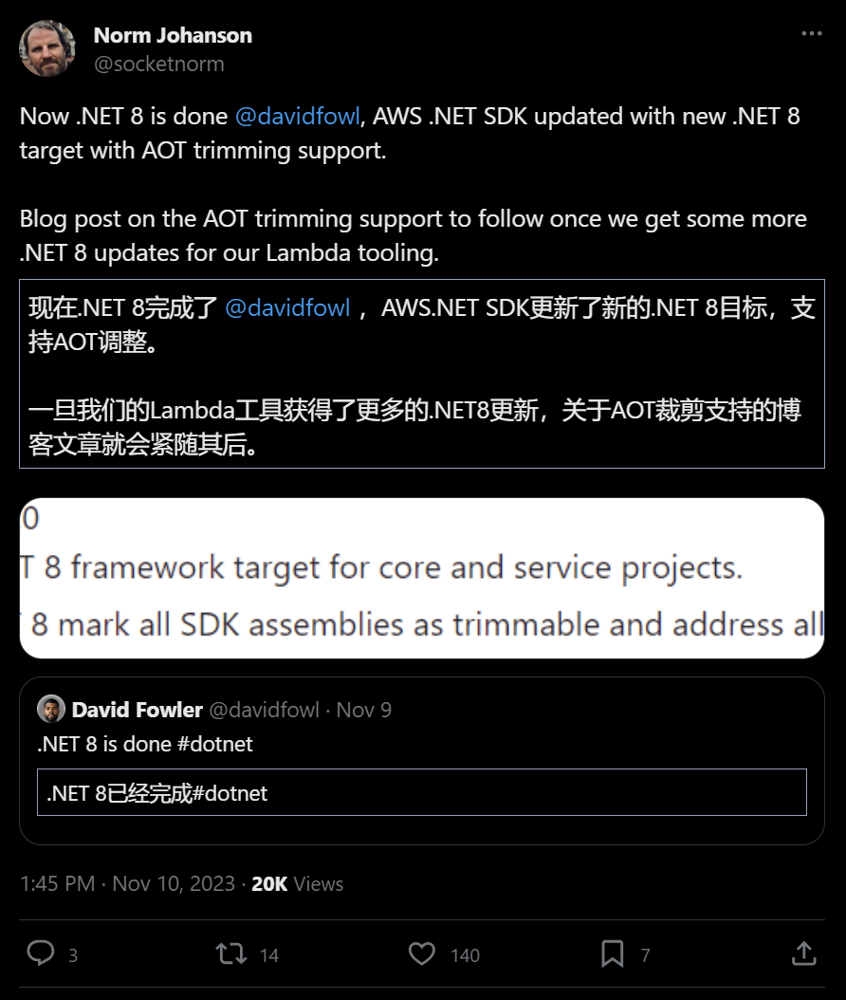

## 国内文章

### .NET8.0 AOT 经验分享 FreeSql/FreeRedis/FreeScheduler 均已通过测试

https://www.cnblogs.com/FreeSql/p/17836000.html

2023年11月15日，.net 8.0正式发布，引起开发者关注。作者关注AOT编译体验，更新了多个开源项目以支持.net 8.0，包括FreeRedis、CSRedisCore、FreeSql和FreeScheduler。FreeRedis 1.2.5和FreeSql 3.2.805发布后，作者测试了FreeRedis的AOT支持，初次失败后安装桌面版C++成功。整个过程记录了.net 8.0的适配和AOT功能的实践。

### .NET8.0 AOT 经验分享 - 专项测试各大 ORM 是否支持

https://www.cnblogs.com/FreeSql/p/17842391.html

本文讨论了.NET 8.0 AOT的特点和经验，强调了其减少磁盘空间、缩短启动时间和降低内存需求的优势。作者分享了.NET 8.0 AOT的使用体验，提出了改进发布速度、编译前错误检查、调试加强和修复特定问题的建议。同时，作者创建了一个测试AOT发布的开源项目，并对FreeSql、SqlSugar和EFCore三个ORM框架进行了AOT测试，展示了发布耗时和操作性能。

### .NET 8正式发布

https://www.cnblogs.com/shanyou/p/17833047.html

.NET 8在.NET Conf 2023活动中发布，强调了云服务、性能提升、全栈Blazor、AI和.NET MAUI等特点。它支持将大型语言模型集成到应用中，优化了Blazor的Web UI处理，通过.NET MAUI简化了移动应用部署，并在C# 12中引入了新的语言特性。作为长期支持版本，.NET 8提供三年支持和补丁。此外，.NET团队推进原生提前编译（NativeAOT），以减少内存使用并加快应用启动。.NET 8还包括性能、稳定性和安全性的改进，新的代码生成器和AVX-512指令集支持，以及基元类型的新格式化和解析接口，这些都有助于提高开发效率和应用性能。

### .NET 8.0 中有哪些新的变化？

https://www.cnblogs.com/powertoolsteam/p/17833417.html

.NET 8在整个技术栈中实现了大量性能改进，包括动态配置文件引导优化（PGO）和AVX-512指令集支持，提升应用性能高达20%。.NET Aspire是一个云原生应用堆栈，提供遥测、弹性、配置和健康检查等组件。.NET 8容器功能增强，包括非root用户默认配置和更小的基础映像，提高了安全性和部署速度。原生AoT允许应用在不支持JIT编译器的环境中运行。.NET 8集成了AI功能，增强了与生成式AI工作负载的兼容性，并与多种AI模型和服务平台合作，提供了客户聊天机器人和检索增强生成等示例模板，以便开发人员快速上手。

### .NET 8来了，那就开发一套基于.NET 8的快速开发框架吧，就叫Simple

https://www.cnblogs.com/Start201505/p/17841087.html

本文介绍了基于.NET 8的快速开发框架Simple Framework，旨在简化开发流程，减少学习成本。框架特点包括基于.NET 8、少用第三方库、基本授权鉴权、CRUD实现和后台管理前端。规划了使用NLog、Redis、Json库等，并支持多数据库结构。框架包含基础库、Web项目扩展库、EFCore扩展库、代码生成器和定时任务模块，以提高开发效率和灵活性。

### 基于C# Socket实现的简单的Redis客户端

https://www.cnblogs.com/wucy/p/csharp_socket_redis_client.html

本文介绍了Redis，一种支持多种数据结构的内存数据库，主要用于缓存、消息队列等。文章重点展示如何用C# Socket实现Redis客户端通信，而非开发完整工具包。Redis提供丰富命令集和RESP协议，用于数据操作和通信。常用命令包括GET、SET、DEL等，支持键值对存储和多种数据结构操作。

### .NET开源全面方便的第三方登录组件集合 - MrHuo.OAuth

https://www.cnblogs.com/Can-daydayup/p/17832805.html

本文介绍了MrHuo.OAuth，这是一个.NET开源框架，用于集成各种第三方平台的登录授权，如微信、支付宝等。该框架支持多个平台，方便.NET Core和.NET Framework项目使用。文章还提供了支付宝登录的示例代码，并建议阅读支付宝对接文档以便更高效地进行对接。

### Blazor入门教程

https://www.cnblogs.com/baibaomen-org/p/17837980.html

本文介绍了Blazor，这是一个基于.NET的Web UI框架，由Microsoft开发，允许使用C#和HTML创建单页应用程序。Blazor有两种托管模型：服务器端的Blazor Server和客户端的Blazor WebAssembly。开发Blazor应用需要.NET 6.0 SDK和Visual Studio 2022，并包含ASP.NET和Web开发工作负载。创建Blazor Server应用的步骤包括启动Visual Studio，选择Blazor Server应用模板，配置项目，查看项目内容，最后运行应用。项目内容包括程序入口点Program.cs，根组件App.razor，示例网页目录Pages，项目定义文件BlazorApp.csproj，以及本地开发环境配置文件launchSettings.json。

### TechEmpower 22轮Web框架 性能评测：.NET 8 战绩斐然

https://www.cnblogs.com/shanyou/p/17828353.html

本文报告了TechEmpower的第22轮Web框架性能测试结果，显示.NET 8和ASP.NET Core在302个框架中排名第15，是主流编程语言中的第二。测试覆盖了多种场景，源代码和配置公开，具有高参考性。性能好的框架能降低成本，提升用户体验，避免搜索引擎降级。在无服务器和容器流行的今天，行业竞争激烈，测试包括冷启动和内存消耗。Fortunes测试涉及ORM和数据库，是Web服务常见用例。服务器性能取决于多线程编码、系统调用和锁争用的优化。报告建议升级至.NET 8，即将发布RTM版本，并提到即将举行的.NET Conf 2023。同时，文章邀请赞助即将举行的2023中国.NET开发者峰会。

### 16个值得推荐的.NET ORM框架（含使用情况统计的投票，欢迎参与）

https://www.cnblogs.com/Can-daydayup/p/17834846.html

本文解释了ORM（对象关系映射）是一种程序设计技术，用于实现面向对象编程语言与关系型数据库数据转换。选择ORM框架时，应考虑业务场景和团队需求。文章列举了.NET环境下多个优秀ORM框架，并提供了投票链接以了解使用情况。同时，推荐关注C#、.NET领域的最新动态。特别介绍了EF Core和Dapper两个框架，EF Core是微软官方的轻量级ORM，支持多种数据库；Dapper是速度极快的微型ORM，通过扩展IDbConnection简化数据库操作。

### 记一次 .NET 某券商论坛系统 卡死分析

https://www.cnblogs.com/huangxincheng/p/17831401.html

本文描述了一个Web程序出现无响应、内存和线程数异常高的问题。作者通过调试工具观察到线程栈空间异常，线程数达到2405个。进一步分析发现许多线程在等待网络请求的结果，这可能是问题的根源。

### 可怕！.Net 8正式发布了，.Net野心确实不小！

https://www.cnblogs.com/chingho/p/17834546.html

本文宣布了.NET 8的正式发布，这是迄今为止性能最快的版本，带来了大量性能、稳定性和安全性的改进，以及平台和工具的增强功能。.NET 8重塑了构建智能、云原生应用和可扩展高流量服务的方式，支持多平台部署。MAUI的升级使得.NET不仅能在PC端运行，还能开发iOS和Android应用。原生AOT的加持提升了应用性能，.NET Aspire预览版发布，便于应用监控和维护。Blazor增强了Web UI框架的功能，同时.NET 8为AI模型和服务提供了SDK，方便开发人员快速开发。总体而言，.NET 8在多端进行了升级优化，展现出卓越性能，使得.NET开发者能够轻松应对各种开发任务。

### NET8 ORM 使用AOT SqlSugar

https://www.cnblogs.com/sunkaixuan/p/17839825.html

本文介绍了.NET 8的AOT（Ahead-of-Time）编译技术，它使用C#几乎完全自举，包括虚拟机、GC和内存模型。文章还提到SqlSugar ORM已支持.NET AOT，展示了如何使用AOT进行数据库操作，包括建表、插入、查询、删除和更新。最后，文中提供了AOT配置教程，包括创建AOT项目、添加rd.xml配置文件和修改项目文件。

### C#中Dictionary&lt;TKey, TValue&gt;的存储结构分析

https://www.cnblogs.com/pengze0902/p/17830689.html

本文讲述了Dictionary<TKey, TValue>的使用和原理。Dictionary以哈希表形式实现，键值对添加快速，检索接近O(1)。文中以创建字典和添加键值对为例，引出对Dictionary内部实现原理的探讨，包括初始化、赋值、取值和扩容。强调分析源码时要避免先入为主，按逻辑解读，记录疑点，最后对比理解差异。最后，简述了Dictionary的构造方法和核心源码。

### .NET8 Blazor新特性 流式渲染

https://www.cnblogs.com/chenyishi/p/17839086.html

本文介绍了Blazor中的流式渲染和服务端渲染（SSR）。与Razor Pages或MVC不同，Blazor提供了可重用组件和客户端交互性。流式渲染通过多次响应改善用户体验，首次快速返回页面占位符，耗时操作后再更新内容。在Blazor中，通过添加指令即可实现流式渲染组件，如修改Weather组件的延迟时间，可以体验到数据流式返回的效果。

### .Net8 Blazor 尝鲜

https://www.cnblogs.com/densen2014/p/17833038.html

本文介绍了.NET 8发布的Blazor全栈Web UI框架，它支持静态和交互式服务器呈现，以及客户端呈现。Blazor结合流式渲染和组件状态保留技术，提高了页面加载速度和用户体验。文章还讨论了自动模式，它结合了服务器端和WebAssembly，实现了快速加载和高效运行。最后，介绍了如何在Blazor Web App工程中设置不同的呈现模式，以及如何将这些模式应用于组件实例。

### 如何通过 wireshark 捕获 C# 上传的图片

https://www.cnblogs.com/huangxincheng/p/17836202.html

本文介绍了如何使用Wireshark抓取图片。首先通过HTTP上传图片，然后在服务器端部署Wireshark，设置捕获过滤器以避免界面卡死。上传图片后，Wireshark显示图片被分割成多个TCP段。通过选择Follow -> TCP Stream，可以查看HTTP传输的全部内容，并将数据以Raw格式保存到本地。

### 快速入门：构建您的第一个 .NET Aspire 应用程序

https://www.cnblogs.com/powertoolsteam/p/17835864.html

本文介绍了.NET Aspire，它帮助简化云原生应用程序与服务的连接配置。要使用.NET Aspire，需安装.NET 8.0、.NET Aspire工作负载、Docker Desktop和IDE。创建.NET Aspire应用程序模板，可通过Visual Studio或.NET CLI，Visual Studio提供项目模板简化初始设置。创建项目时，需选择.NET 8.0版本，启用Redis缓存。最终，Visual Studio将创建一个结构化的.NET Aspire解决方案。

### .NET 6.0 中的 await 原理浅析

https://www.cnblogs.com/broadm/p/17833442.html

本文通过分析源码，阐述了await关键字背后的原理。作者通过VS2022和.NET 6环境，运行示例代码，揭示编译器将异步代码转换为状态机的过程。文章展示了简化后的编译代码，解释了状态机如何通过管理状态和回调来实现异步操作。

## 主题

### 宣布 .NET 8 - .NET 博客
https://devblogs.microsoft.com/dotnet/announcing-dotnet-8/

- [.NET 8 中的新特性](https://learn.microsoft.com/en-us/dotnet/core/whats-new/dotnet-8)
- [宣布 ASP.NET Core 在 .NET 8 中的更新 - .NET 博客](https://devblogs.microsoft.com/dotnet/announcing-asp-net-core-in-dotnet-8/)
- [宣布 C# 12 - .NET 博客](https://devblogs.microsoft.com/dotnet/announcing-csharp-12/)
- [宣布 .NET MAUI 在 .NET 8 中的更新 - .NET 博客](https://devblogs.microsoft.com/dotnet/announcing-dotnet-maui-in-dotnet-8/)
- [Entity Framework Core 8 (EF8) 现已可用 - .NET 博客](https://devblogs.microsoft.com/dotnet/announcing-ef8/)
- [宣布 F# 8 - .NET 博客](https://devblogs.microsoft.com/dotnet/announcing-fsharp-8/)
- [宣布 NuGet 6.8 - 轻松维护安全性 - NuGet 博客](https://devblogs.microsoft.com/nuget/announcing-nuget-6-8-maintaining-security-with-ease/)

### Visual Studio 17.8 现已可用！ - Visual Studio 博客
https://devblogs.microsoft.com/visualstudio/visual-studio-17-8-now-available/

### 介绍 .NET Aspire：简化 .NET 8 的云原生开发 - .NET 博客
https://devblogs.microsoft.com/dotnet/introducing-dotnet-aspire-simplifying-cloud-native-development-with-dotnet-8/

- [.NET Aspire 文档（预览版）](https://learn.microsoft.com/en-us/dotnet/aspire/)
- [dotnet/aspire: .NET Aspire](https://github.com/dotnet/aspire/)

### .NET 框架 2023年11月 安全性和质量汇总更新 - .NET 博客
https://devblogs.microsoft.com/dotnet/dotnet-framework-november-2023-security-and-quality-rollup/

### .NET 2023年11月更新 – .NET 7.0.14, .NET 6.0.25 - .NET 博客
https://devblogs.microsoft.com/dotnet/november-2023-updates/

### 介绍 Visual Studio 17.9 - 预览版 1 现已推出！ - Visual Studio 博客
https://devblogs.microsoft.com/visualstudio/introducing-visual-studio-17-9-preview-1-is-here/

### Visual Studio UI 刷新预览版现已推出！ - Visual Studio 博客
https://devblogs.microsoft.com/visualstudio/the-visual-studio-ui-refresh-preview-is-here/

### LINQPad 8
https://www.linqpad.net/LINQPad8.aspx

https://x.com/linqpad/status/1724762440330793436?s=12

### 发布 2.3.1 版本 · mysql-net/MySqlConnector
https://github.com/mysql-net/MySqlConnector/releases/tag/2.3.1

- [发布 2.3.0 版本 · mysql-net/MySqlConnector](https://github.com/mysql-net/MySqlConnector/releases/tag/2.3.0)

### 发布 Windows App SDK 1.4.3 (1.4.231115000) 版本 · microsoft/WindowsAppSDK
https://github.com/microsoft/WindowsAppSDK/releases/tag/v1.4.3

- [发布 WinUI 3 在 WinAppSDK 1.4.3 中的更新 · microsoft/microsoft-ui-xaml](https://github.com/microsoft/microsoft-ui-xaml/releases/tag/winui3/release/1.4.3)

### 发布 8.2.0 版本 · App-vNext/Polly
https://github.com/App-vNext/Polly/releases/tag/8.2.0

### 发布 4.10.0 版本 · openiddict/openiddict-core
https://github.com/openiddict/openiddict-core/releases/tag/4.10.0

### 介绍 .NET 语义内核 SDK v1.0.0 Beta6 | 语义内核
https://devblogs.microsoft.com/semantic-kernel/introducing-v1-0-0-beta6-for-the-net-semantic-kernel-sdk/

### 宣布 MonoGame 基金会 - 新闻 - 社区 | MonoGame
https://community.monogame.net/t/announcing-the-monogame-foundation/19809

## 文章、幻灯片等

### .NET Conf2023 推荐视频汇总
https://zenn.dev/tomokusaba/articles/3dd75339210ddc

### .NET 8 — ASP.NET Core 度量
https://medium.com/abp-community/net-8-asp-net-core-metrics-e69c908e583b

### 自动分析 ASP.NET Core 性能与动态程序分析 | .NET 工具博客
https://blog.jetbrains.com/dotnet/2023/11/14/automatically-analyze-asp-net-core-performance-with-dynamic-program-analysis/

### 优化 C# 代码分析以更快编译 .NET
https://dev.to/asimmon/optimizing-c-code-analysis-for-quicker-net-compilation-4e3d

### .NET 8 中的 ConfigureAwait
https://blog.stephencleary.com/2023/11/configureawait-in-net-8.html

### .NET 8 的 ASP.NET Core Blazor 新功能概览
https://zenn.dev/microsoft/articles/aspnetcore-blazor-dotnet8-overview

### 从 C# 调用 Rust，反之亦然：第 1 部分 - Aaron Schlesinger 的个人网站
https://ecomaz.net/blog/csharp-rust/

- [从 C# 调用 Rust，反之亦然：第 2 部分 - Aaron Schlesinger 的个人网站](https://ecomaz.net/blog/csharp-rust-2/)

### .NET 8 中新增的 LINQ 方法 - Qiita
https://qiita.com/RyotaMurohoshi/items/aa57e96a01c6627ec08d

### 微软 Fluent UI Blazor 组件版本 4.0.0 的新功能
https://baaijte.net/blog/microsoft-fluentui-aspnetcore.components-4/

### .NET 和 C# 版本 - 8/12 更新
https://nietras.com/2023/11/14/dotnet-and-csharp-versions/

### 在 ASP.NET Core 中使用多个身份提供者进行身份验证
https://damienbod.com/2023/11/13/authentication-with-multiple-identity-providers-in-asp-net-core/

### .NET 中更多的 SQLite 加密
https://www.bricelam.net/2023/11/10/more-sqlite-encryption.html

## 图书馆、仓库、工具等
### SuperJMN/DotnetPackaging: .NET 的更简单打包
https://github.com/SuperJMN/DotnetPackaging

### microsoft/dev-proxy: Dev Proxy 是一个命令行工具，可以在本地模拟 HTTP API 的真实世界行为，包括 Microsoft Graph。
https://github.com/microsoft/dev-proxy

### dotNETConf/2023/DigitalSWAG at main · dotnet-presentations/dotNETConf
https://github.com/dotnet-presentations/dotNETConf/tree/main/2023/DigitalSWAG

## 网站、文档等
### 推文

https://x.com/higenekotech/status/1724641578109776215?s=12

---

https://x.com/skitoy4321/status/1724577626235523483?s=12

---

https://x.com/marcgravell/status/1724473162094505999?s=12&t=ggvrrZ7oLogHyNoIGNgjbw

---

https://x.com/socketnorm/status/1722853028435538060?s=12

---

https://x.com/debugprivilege/status/1723679401466880039?s=12

## 深入了解
### .NET 7 与 .NET 8 之间的 API 差异 by carlossanlop · 拉取请求 #8921 · dotnet/core
https://github.com/dotnet/core/pull/8921

### 提高 BigInteger.Multiply(large, small) 的性能 by kzrnm · 拉取请求 #92208 · dotnet/runtime
https://github.com/dotnet/runtime/pull/92208

