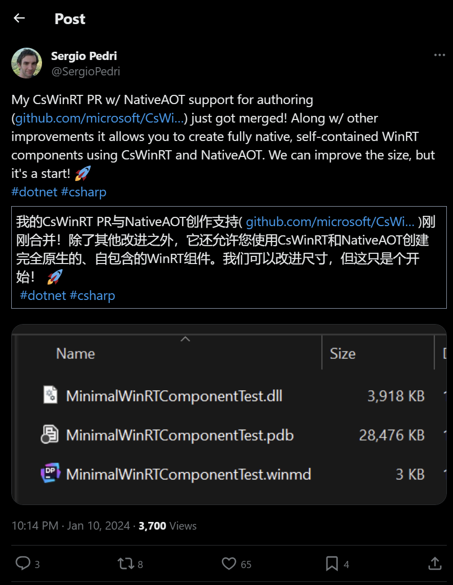

## 国内文章

### NCC Mocha v0.1.0 发布，.NET 开发的基于 OpenTelemetry 的 APM 系统

https://mp.weixin.qq.com/s/gUx-dqlYqcwgQNf8NROZ4A

Mocha 是一个基于 .NET 开发的 APM 系统，同时提供可伸缩的可观测性数据分析和存储平台。

项目地址：https://github.com/dotnetcore/mocha

目前项目处于早期阶段，已经完成了对 Trace 的基础支持，可以通过 OTel SDK 上报数据到 Mocha Distributor，然后通过 Grafana 展示。

**v0.1.0 发布内容：**

- 支持 OTel Trace 数据上报
- 支持通过 Grafana 展示 Trace 数据
- 提供 Docker Compose 本地体验方案

### 微软用它取代了`Nginx`吞吐量提升了百分之八十！

https://www.cnblogs.com/hejiale010426/p/17954360

本文介绍了YARP（Yet Another Reverse Proxy），这是微软开发的一个.NET平台上的开源反向代理库，具有模块化、高性能、配置驱动等特点。YARP适用于.NET 5及以上版本，支持自定义请求路由、负载均衡策略、健康检查等功能，并可用作反向代理、API网关和边缘服务。文章还展示了如何通过Nuget包安装YARP，并在WebApi项目中配置和使用它，包括如何通过代码控制代理转发到指定地址，以及如何修改代理响应内容。Azure应用服务采用YARP替代Nginx后，吞吐量提升超过80%，每天处理超过1600亿请求，显示出YARP的高效能力。

### 如何使用.NET在2.2秒内处理10亿行数据（1brc挑战）

https://www.cnblogs.com/InCerry/p/17964592/7-1brc-in-dotnet-even-faster-than-java-cpp

本文介绍了.NET开发者Victor Baybekov在"One Billion Row Challenge"中的成就，他的.NET实现在性能上超越了Java和C++。这个挑战旨在快速处理大量数据，最初只有Java参与，后来开放给其他语言。Baybekov的代码优化包括内存映射文件和自定义哈希函数等，展示了.NET的速度和易用性。文章还提到了.NET的不安全选项，并不会自动导致代码不安全。对.NET开发者而言，这是学习代码性能优化的宝贵资源，也向非.NET开发者证明了.NET的强大性能。总体上，文章强调了通过.NET功能和代码优化，可以实现高性能，尤其在处理大数据时表现出色。

### .NET使用QuestPDF高效地生成PDF文档

https://www.cnblogs.com/Can-daydayup/p/17971576

本文介绍了QuestPDF，这是一个.NET平台下的开源库，用于生成PDF文档，如发票等。QuestPDF提供了C# Fluent API和布局引擎，支持分页，不依赖HTML转PDF。文章还讲述了如何创建控制台应用，安装QuestPDF包，并快速实现发票PDF生成。

### C# 成为2023年度编程语言之王

https://www.cnblogs.com/shanyou/p/17955343

本文分析了C#语言在2023年TIOBE年度编程语言中首次获得桂冠的原因。C#因其在Web后端和游戏领域的流行及逐渐侵蚀Java市场份额而受到关注。文章由.NET平台开发专家张善友撰写，探讨了C#的诞生、设计理念、发展现状和未来。C#起源于90年代末，旨在提高开发者生产力和代码质量，强调易用性、面向对象、安全性、高性能和跨平台。微软的开源政策和.NET基金会的成立提升了C#的可访问性和社区合作。C#支持跨平台开发、高级GC、跨语言复用性，并且与C的互操作性强。C#的标准库功能全面，社区活跃，有助于其在多个应用场景中的应用。

### 轻量化动态编译库 Natasha v8.0 正式发布！

https://www.cnblogs.com/NMSLanX/p/17901708.html

本文介绍了.NET8.0及其动态编译特性，以及Natasha v8.0版本的更新。作者于2024年1月10日发布Natasha新版本，主版本号与Runtime同步增长。.NET8.0带来多项改进，如异步状态机、ConfigureAwait、线程池优化、Socket和字符操作性能提升。特别提到"SearchValues"性能优化。动态编译在.NET中非常重要，Source Generators和AOT提供了性能和兼容性解决方案。.NET8.0全面支持AOT，Natasha作为动态编译库，利用.NET8.0的动态PGO优化，提供高效、轻量、智能的运行时动态编译方案。Natasha基于Roslyn，易用、可扩展，并减少用户编译成本。新版Natasha改进了开发流程，应用CI/CD Runner，并在PR和ISSUE管理上进行了改造。

### 比Nginx更好用的Gateway！

https://www.cnblogs.com/hejiale010426/p/17978605

本文介绍了Token新开源的Gateway，这是一个基于yarp的反向代理，支持在线配置域名证书和集群路由，无需重启服务即可生效。它具有日志监控、高扩展性，并使用FreeSql和MiniApis技术。技术栈包括.NET 8、FreeSql、Yarp等。文章还详细说明了如何通过docker-compose和docker run命令快速部署Gateway，并展示了界面登录、代理设置和证书管理的操作流程。

### Asp .Net Core 系列：集成 Ocelot+Nacos+Swagger+Cors实现网关、服务注册、服务发现

https://www.cnblogs.com/vic-tory/p/17973528

本文介绍了Ocelot、Nacos、Swagger和CORS这四种技术。Ocelot是ASP.NET Core微服务网关，提供路由、认证、限流等功能，易于扩展和集成。Nacos是服务发现和配置管理平台，支持动态服务发现和多种服务注册方式。Swagger是RESTful Web服务的规范框架，用于生成、描述、调用和可视化API。CORS是跨域资源共享机制，允许Web应用通过浏览器发送跨域请求。文章还介绍了如何在ASP.NET Core中集成Ocelot，包括安装NuGet包和添加配置文件。

### .NET开源、强大的Web报表统计系统

https://www.cnblogs.com/Can-daydayup/p/17959334

本文介绍了CellReport，一个.NET开源的Web报表统计系统，旨在快速制作统计报表。它支持多种数据源，如数据库和excel文件，提供类excel界面设计报表，并内置多种集合函数。CellReport特点包括基于.NET6的高性能、适用于中国式报表、多样的展现组件、自由扩展功能和通用数据源兼容性。前端采用vue等技术，后端基于.NET6。项目源代码和在线演示可通过官方链接访问，同时项目被收录于C#/.NET/.NET Core优秀项目和框架精选中。

### 记一次 .NET某道闸收费系统 内存溢出分析

https://www.cnblogs.com/huangxincheng/p/17972069

本文讲述了一位朋友的程序因内存溢出而频繁崩溃，作者通过WinDbg工具分析dump文件。分析显示，程序受32位内存限制，但不仅仅是地址空间问题，还需排查是否为程序bug。托管堆占用过大，特别是OverlappedData对象异常增多，暗示大量异步请求未响应。进一步检查AsyncCallback回调函数，以确定问题性质。

### 记一次 .NET某MES自动化桌面程序 卡死分析

https://www.cnblogs.com/huangxincheng/p/17966932

本文讲述了作者帮助朋友分析客户端程序卡死的原因。通过WinDbg工具分析dump文件，发现主线程在执行Graphics操作时触发了垃圾回收（GC），导致程序暂停（STW）。进一步分析显示，是48号线程在标记阶段触发了FullGC。原因是32位程序受到2GB虚拟地址空间限制，内存不足频繁触发FullGC。作者建议检查内存使用情况，以解决卡死问题。

### 确定了-C#是2023年度的编程语言！

https://www.cnblogs.com/Dotnet9-com/p/17950286

本文报告C#在2023年被评为年度编程语言，这是C#首次在TIOBE指数中获此殊荣。C#因在一年内增长了1.43%的市场份额而胜出，超过了Scratch和Fortran。C#正侵蚀Java的市场份额，在Web后端和游戏开发等领域越来越流行。C#是免费且开源的，每个新版本都在不断进步。TIOBE指数显示Fortran和Kotlin进入了前20名，而R和Perl被替代。尽管Julia在2023年曾短暂进入前20名，但未能保持。TIOBE指数每月更新，反映了编程语言的流行度，有助于了解技能是否过时或选择构建新系统的语言。

### 大龄码农的业余作品：升讯威在线客服系统：系统架构设计

https://www.cnblogs.com/sheng_chao/p/17959457

本文介绍了使用.net core和WPF开发的升讯威在线客服与营销系统，该系统支持多租户、横向扩展、高安全性、简易部署和稳定性。系统采用分布式架构，客户网站通过JavaScript与服务器通信，服务端程序基于.net core，数据库兼容MySQL和SQL Server。客服端程序使用WPF框架，提高了开发效率和程序稳定性。文章还提到系统可根据需求弹性配置，简化私有化部署。产品目前免费，可在作者网站下载。

### .NET Conf China 2023分享-.NET应用国际化-AIGC智能翻译+代码生成

https://www.cnblogs.com/tianqing/p/17963525

本文分享了.NET Conf China 2023技术大会上关于.NET应用国际化的议题，包括国际化挑战、技术方案和智能翻译服务。介绍了使用ChatGPT和Roslyn技术解决国际化问题，如自动化代码分析和替换、词条服务设计，以及结合Azure AI和GPT4进行机器翻译和专业术语的翻译优化。最后，通过改进Prompt，提高了翻译的专业性。

### Blazor快速开发框架Known-V2.0.0

https://www.cnblogs.com/known/p/17958786

本文介绍了基于Blazor的企业级快速开发框架Known2.0，特点是低代码、跨平台、模块化，支持单页和混合桌面应用。它集成了AntDesign等UI组件，包含模块管理、数据字典、组织架构、角色权限、用户管理等功能，支持国际化，易于扩展。通过dotnet命令可快速安装和创建项目，项目结构清晰，包括框架类库、界面库、示例模块等。主要功能还涵盖系统日志、消息、工作流和定时任务管理。

### 一个小巧、快速、轻量级的 .NET NoSQL 嵌入式数据库

https://www.cnblogs.com/Can-daydayup/p/17955585

本文介绍了LiteDB，一种.NET平台下的NoSQL嵌入式数据库，特点是小巧、快速、轻量级。它提供了类似MongoDB的API，支持.NET 4.5/NETStandard，并以单个DLL形式存在。LiteDB具备线程安全、ACID事务、数据恢复、数据加密等功能，并能通过属性或API将类映射为BsonDocument，支持文件存储和LINQ查询。适用于桌面应用、小型网站等场景，开源免费。文章还展示了如何在.NET项目中安装LiteDB包，定义数据模型，以及创建、插入、查询和删除数据的基本操作。

### 正确理解c# default关键字

https://www.cnblogs.com/netry/p/17965805/csharp-default-keyword

本文讨论了C#中`default`关键字的误解和正确理解。原以为`default`会返回一个空的WeatherForecast对象，但实际上返回的是`null`，导致API返回204 No Content。`default`关键字用于生成类型的默认值，对于引用类型是`null`，而值类型则是初始化为0。通过查看中间语言代码，发现引用类型赋默认值使用`ldnull`，值类型使用`initobj`。此外，`FirstOrDefault`方法返回的默认值也是通过`default`实现的。文章还提到，`default`可以作为判断是否为空的一个新选项，提供了相关文档链接作为参考。

### C#/.NET学习值得推荐的在线论坛和技术社区

https://www.cnblogs.com/Can-daydayup/p/17964008

本文推荐了C#/.NET程序员学习的在线资源，包括DotNetGuide充电站栏目、.NET官网、.NET开发者社区、.NET官方博客、Visual Studio Blog、Stack Overflow的C#和.NET问题专栏、CSDN.NET社区论坛和博客园.NET技术专区。这些资源涵盖了基础知识、学习路线、开发实战、视频、文章、书籍等，旨在帮助开发者提升技能、解决问题。

### 编写一个小而强大的 Windows 动态屏保壁纸

https://www.cnblogs.com/he55/p/17959763

本文介绍了作者开发的新开源软件，它能将macOS Sonoma的4k动态屏保壁纸带到Windows 11。软件特点是小巧强大，支持多语言、高分辨率、深色模式等，并可多任务下载。使用方法是选中视频壁纸，开启屏保功能，系统闲置2分钟后自动播放。作者还分享了视频播放功能的代码实现，说明了如何在WPF中通过NuGet包使用UWP控件播放120帧4k视频。

### Windows桌面自动化测试工具：WinAppDriver

https://www.cnblogs.com/jinjiangongzuoshi/p/17711689.html

本文介绍了WinAppDriver，这是一个开源的Windows桌面自动化测试工具，能与Selenium、Appium等框架集成。它通过API与应用程序交互，支持功能测试、回归测试等，提高测试效率。WinAppDriver的优势包括专为Windows设计、兼容性广泛、社区活跃、支持多种编程语言、跨平台测试和强大的元素定位功能。它能自动化测试包括桌面应用、UWP应用、Microsoft Store应用、Office应用、控制台应用和Web浏览器等多种Windows程序。文章还提供了使用Python和WinAppDriver对WPF桌面程序和Microsoft Word进行自动化测试的示例代码。

### 用C#实现最小二乘法（用OxyPlot绘图）✨

https://www.cnblogs.com/mingupupu/p/17976196

本文介绍了最小二乘法，这是一种优化技术，用于最小化模型预测值与观测值差异。通过对参数求偏导并令其为零，可以得到最小化残差平方和的参数值。文章还展示了如何用C#和NumSharp库创建数据点，实现最小二乘法。

### 在WPF应用中使用FastReport.WPF报表模块

https://www.cnblogs.com/wuhuacong/p/17969163

本文介绍了FastReport报表组件，特别是针对WPF应用的FastReport.WPF模块。FastReport用于设计、预览、打印和导出报表，支持多种格式。文章回顾了作者之前的FastReport应用案例，展示了其强大的报表处理能力。FastReport.WPF模块可通过Nugget添加到WPF应用，支持报表预览和设计。作者还展示了在WPF应用中测试报表处理的界面和步骤，包括创建报表对象、加载文件和数据、调用设计或预览功能。

### C#开源免费的Blazor图表库

https://www.cnblogs.com/Can-daydayup/p/17967468

本文介绍了基于ApexCharts.js的C#开源图表库Blazor-ApexCharts，它提供了丰富的交互式数据可视化选项，支持多种图表类型，适用于商业和非商业项目。文章还提到了其他推荐的Blazor UI组件库和ASP.NET Core Blazor的资源。Blazor-ApexCharts项目的源码和在线演示可以在GitHub找到，同时该项目也被收录在C#/.NET/.NET Core优秀项目和框架精选中。此外，文章还提到了DotNetGuide技术社区，这是一个.NET开发者的开源技术社区，提供学习资料、技术分享、项目推荐和招聘信息。

### 在ASP.NET Core微服务架构下使用RabbitMQ如何实现CQRS模式

https://www.cnblogs.com/powertoolsteam/p/17951775

本文讲述了在ASP.NET Core微服务架构中使用RabbitMQ实现CQRS模式的方法。微服务架构通过拆分应用为多个独立服务提高了系统的可伸缩性和灵活性。RabbitMQ作为消息代理，在服务间提供了异步通信，保证了消息的可靠传输和系统的可扩展性。CQRS模式通过分离读写操作，优化了性能和可维护性。文章还讨论了RabbitMQ与CQRS集成时需要考虑的消息结构、错误处理、消息持久性等因素。

### 使用WPF开发自定义用户控件，以及实现相关自定义事件的处理

https://www.cnblogs.com/wuhuacong/p/17960328

本文讨论了Winform和WPF中自定义用户控件的性能问题，并介绍了WPF中通过虚拟化技术提高性能的方法。Winform在控件数量多时会出现性能下降，而WPF利用虚拟化技术，只渲染可视区域的元素，减少了UI资源消耗。文章还解释了如何在WPF中实现虚拟化容器，并提供了使用VirtualizingPanel的示例代码，以及介绍了lepoco/wpfui项目中的VirtualizingItemsControl控件。

### 快速批量升级 NugetPackage 版本

https://www.cnblogs.com/Chendaqian/p/17959532

本文介绍了如何在Visual Studio中批量升级Nuget包。作者分享了一个通过PowerShell脚本自动化升级过程的方法，避免了手动更新每个项目中的Nuget包的麻烦。脚本会检查并更新指定的包到新版本，例如将Newtonsoft.Json从13.0.1升级到13.0.3。这个过程在Visual Studio的程序包管理控制台中执行，提高了升级效率。

### Visual Studio实用的搜索、查找、替换技巧

https://www.cnblogs.com/Can-daydayup/p/17978016

本文介绍了Visual Studio中提高.NET开发效率的搜索和替换技巧，包括代码和功能搜索（Ctrl + T）、快速查找（Ctrl + F）、快速替换（Ctrl + H）以及查找所有引用（Shift + F12）。这些技巧可以帮助开发者避免长时间加班。文章还推荐了DotNetGuide技术社区，这是一个.NET开发者的开源技术交流平台，提供学习资料、技术分享、项目推荐和招聘信息，旨在帮助开发者成长和解决问题。

### 聊一聊为什么我要整合Microsoft.Extensions.DependencyInjection和Castle.Core

https://www.cnblogs.com/gainorloss/p/17965140

本文讨论了在使用动态代理时，作者选择整合Microsoft.Extensions.DependencyInjection和Castle.Core的原因。文中提到了Autofac+Castle、AspectCore和DoraInterception等动态代理选项。作者通过事件处理接口的源码展示了动态代理在程序解耦、异步处理等场景的应用，并提出了为事件处理器添加幂等拦截器的想法。然而，在使用AspectCore时遇到了方法不可覆写的错误，并已向AspectCore-Framework提出问题。作者还展示了DoraInterception的使用，但未提及其结果。

### 七天.NET 8操作SQLite入门到实战 - 第七天BootstrapBlazor UI组件库引入（1）

https://www.cnblogs.com/Can-daydayup/p/17954319

本文分三篇详细介绍了.NET 8操作SQLite的教程，包括SQLite简介、环境配置、快速入门、项目框架搭建、ORM封装和接口完善。同时提供了EasySQLite项目源码地址。文中还简述了Blazor和BootstrapBlazor的基本信息，BootstrapBlazor是基于Bootstrap和Blazor的组件库，适合喜欢Bootstrap风格的开发者。教程指导如何安装BootstrapBlazor类库，将其注入ASP.NET Core项目，并导入相关命名空间，以便在Blazor应用中使用。

### 如何实现纯网页语音视频聊天和桌面分享？（附源码，PC版+手机版）

https://www.cnblogs.com/zhuweisky/p/17967600

本文介绍了一个网页版视频聊天和桌面分享Demo，支持一对一视频聊天、远程桌面观看和自动重连功能。它兼容多种操作系统和CPU架构，适用于所有主流浏览器，也可嵌入APP的WebView控件。服务端使用C#开发，Web端分为PC版和手机版，分别使用Vue和uni-app开发。Demo支持在本地运行和部署到服务器，但公网部署需使用HTTPS和WSS协议。Web端代码逻辑相同，定义了10种消息类型以实现通信。

### 从C++CLI工程的依赖库引用问题看.Net加载程序集机制

https://www.cnblogs.com/zhangchen-trunk/p/17962927

本文讨论了在MFC项目中为C++/CLI工程插件添加.Net依赖时遇到的问题。由于MFC项目不允许将.Net依赖放在执行目录，尝试通过SetDllDirectory和修改PATH环境变量加载第三方库均失败。问题通过手动加载程序集的AssemblyResolve事件解决。文章解释了.Net程序集搜索与加载机制，包括依赖版本号信息、是否已加载、GAC检查、配置文件探测等步骤。探测过程中，配置文件中的<codebase>和<probing>节点影响加载路径。注意事项包括使用probing工具检查路径、强签名程序集的版本号检查、子目录内程序集的加载规则，以及路径必须在执行应用程序根目录内。

### Asp .Net Core 系列：集成 Ocelot+Consul+Swagger+Cors实现网关、服务注册、服务发现

https://www.cnblogs.com/vic-tory/p/17968857

本文介绍了Ocelot，这是一个开源的ASP.NET Core微服务网关，具备路由、认证、限流、监控等API网关功能。Ocelot易于集成和扩展，支持与Kubernetes、Consul等服务集成。集成Ocelot到ASP.NET Core需要安装NuGet包、添加配置文件和配置服务。Ocelot还可与Consul集成实现服务发现，需要安装相应NuGet包并配置Ocelot服务。通过这些步骤，Ocelot能帮助保护、监控和扩展微服务。

### Blazor Wasm 身份验证和授权之 OpenID 与 OAuth2

https://www.cnblogs.com/densen2014/p/17959842

本文提供了关于OpenID和OAuth2的基础知识，解释了OpenID Connect (OIDC)是基于OAuth 2.0的身份验证层，使用JWT来验证用户身份和获取用户信息。文章还介绍了如何使用OIDC和OAuth2配置应用程序，以及Auth0中应用程序的分类和单点登录(SSO)的概念。此外，提供了相关源码链接和进一步阅读的参考资料。

### Asp .Net Core 系列： 集成 CORS跨域配置

https://www.cnblogs.com/vic-tory/p/17959577

本文解释了CORS机制，它是Web安全的一部分，用于控制不同源间的资源交互。CORS通过浏览器的头部信息检查，允许或拒绝跨域请求。文章还详细介绍了在ASP.NET Core中配置CORS的步骤，包括安装必要的包、在Startup.cs文件中添加CORS服务和启用CORS中间件。此外，还介绍了CorsPolicyBuilder类的方法，如允许任何请求头、方法、源，以及如何处理带凭证的请求。这些配置和方法有助于开发者控制资源访问，增强应用安全。

### 【OpenVINO】 使用 OpenVINO CSharp API 部署 PaddleOCR 项目介绍

https://www.cnblogs.com/guojin-blogs/p/17956244

本文介绍了基于OpenVINO™ CSharp API的新项目，用于部署PaddleOCRv4模型，以实现图片文字识别等功能。项目支持最新的OpenVINO CSharp API版本，简化了部署步骤，提高了跨平台部署的速度。项目环境依赖于OpenVINO.CSharp.API、OpenVINO.runtime.win和OpenCvSharp4等NuGet包，可通过Visual Studio或dotnet命令安装。用户可从GitHub获取项目源码和预测模型，其中模型下载脚本已提供，但表格识别模型需转换后使用。项目链接为：https://github.com/guojin-yan/PaddleOCR-OpenVINO-CSharp。

### Net 高级调试之十六：平台互用性及P/Invoke和内存泄漏调试

https://www.cnblogs.com/PatrickLiu/p/17951826

本文是《Net 高级调试》系列的最后一篇，基于“一线码农”的视频内容，介绍了互用性调试，包括P/Invoke调用、内存泄漏和COM互用性调试。作者强调了多次实践的重要性，并提供了调试环境的详细信息，如Windows 10、Windbg Preview、Visual Studio 2022和Net Framework 4.8。文章还讨论了P/Invoke的崩溃问题，如调用协定不一致、委托异步和非托管内存泄漏，并通过具体代码示例进行了解释。最后，作者分享了项目源码Example_16_1_1，以实际操作加深理解。

### Asp .Net Core 系列： 集成 Consul 实现 服务注册与健康检查

https://www.cnblogs.com/vic-tory/p/17961740

本文介绍了Consul，一款开源的服务发现与配置管理工具，具备服务发现、健康检查、键/值存储和多数据中心支持等特性。Consul使用Raft算法保证一致性，支持多数据中心部署，简化了安装和部署流程。文章还讲述了如何在Windows上安装Consul，并通过命令行启动它。接着，详细说明了在ASP.NET Core中集成Consul，实现服务注册和健康检查的步骤，包括安装Consul客户端SDK、配置服务注册信息，并通过Consul的API进行服务注册。

### 用Roslyn玩转代码之一: 解析与执行字符串表达式

https://www.cnblogs.com/BaiCai/p/17952057

本文介绍了如何使用Roslyn框架将C#代码字符串解析成Linq表达式并执行。首先通过语法树和语义分析获取信息，然后创建ExpressionParser类，通过ParseCode方法解析字符串表达式，检查语义错误，并将Roslyn解析的类型信息转换为C#运行时类型。这一过程涉及到语法分析、语义分析和语法转换的相关知识。

### 【csharp】抽象类与接口有哪些不同？什么时候应该使用抽象类？

https://www.cnblogs.com/liutongqing/p/17950786

本文阐述了抽象类与接口的区别。抽象类可包含抽象和具体方法、字段、属性、构造函数，成员有不同访问修饰符，仅支持单继承，可有状态。接口仅包含抽象方法和属性，成员默认公开，不含构造函数，支持多继承，无状态。两者均不可实例化，派生类需实现其抽象成分，抽象类用于共享实现和状态，接口强调行为契约。使用抽象类或接口取决于设计需求，抽象类适用于需要共享代码或有状态需求的场景，而接口适用于定义行为规范。

### Kernel Memory 中使用 PaddleSharp OCR

https://www.cnblogs.com/xbotter/p/17950933/kernel_memory_custom_ocr

本文介绍了在Kernel Memory中使用PaddleSharp OCR进行图片文字识别的方法。首先，可以通过Azure服务进行OCR，只需在构建Kernel Memory时调用`WithAzureAIDocIntel`方法。若无Azure服务，可实现`IOcrEngine`接口，使用PaddleSharp OCR。安装所需Nuget包后，创建`PaddleSharpOcrEngine`类实现接口，并在构建Kernel Memory时注册该服务。此后，处理图片文件时将自动使用PaddleSharp OCR。代码示例和相关资源已上传至GitHub。

### 聊一聊如何整合Microsoft.Extensions.DependencyInjection和Castle.Core(完结篇)

https://www.cnblogs.com/gainorloss/p/17962327

本文讲述了如何在Microsoft.Extension.Dependency和Castle中整合拦截器，以便默认容器支持拦截功能。首先定义一个拦截器基类，继承并覆写InterceptAsync方法即可创建特定功能的拦截类。作者感谢DynamicProxy.AsyncInterceptor库的贡献，并展示了如何通过Microsoft.Extension.DependencyInjection实现拦截器功能的扩展类。该扩展类通过替换原有ServiceType的注册，使用代理对象实现拦截。实现过程包括识别带有InterceptorBaseAttribute特性的ServiceType，并处理ServiceDescriptor中的三种生成场景，最终创建代理并注册。

### 聊一聊如何整合Microsoft.Extensions.DependencyInjection和Castle.Core(二)

https://www.cnblogs.com/gainorloss/p/17961414

本文讲述了如何将Microsoft.Extensions.DependencyInjection与Castle.Core整合，重点介绍了使用ProxyGenerator创建代理对象的方法。代理对象分为基于具体类和接口两种方式，且根据是否传入原始对象，分为WithTarget和WithoutTarget。示例说明了如何为具体类SampleService及其接口ISampleService生成代理，并解释了为何SampleService的ShowAsync方法需要virtual关键字，以支持Castle的代理机制。最后，文中提到了Castle文档，供读者深入了解。

### 开源：Taurus.DTS 微服务分布式任务框架，支持即时任务、延时任务、Cron表达式定时任务和广播任务。

https://www.cnblogs.com/cyq1162/p/17971549

本文介绍了Taurus.DTS，这是一个微服务分布式任务框架，支持.Net和.Net Core版本。它基于Taurus.DTC框架，增加了任务发布订阅功能，并考虑是否引入延时发布功能。Taurus.DTS支持即时、延时、基于Cron表达式的定时和广播群发任务。它支持RabbitMQ和Kafka消息队列，可根据需要选择合适的Nuget包。此外，框架兼容多种数据库，如MSSQL、MySql等，通过配置文件设定数据库连接。开发者可以在GitHub上找到源代码和详细说明。

### Json Schema介绍 和 .net 下的实践 - 基于Lateapexearlyspeed.Json.Schema - 基础1 - type关键字和string类型

https://www.cnblogs.com/dotnet-diagnostic/p/17963484

本文介绍了Json Schema及其在.net库Lateapexearlyspeed.Json.Schema中的应用。Json Schema用于描述和验证Json数据，最简单的Schema是空对象，表示所有Json数据都有效。type关键字指定数据类型，支持string、number等。String类型可用minLength和maxLength限定长度，pattern关键字配合正则表达式进行匹配。还有format关键字定义常见数据格式，如email、uri等，方便使用。Lateapexearlyspeed.Json.Schema库支持这些功能，提高了数据验证的效率和准确性。

### 掌握语义内核(Semantic Kernel)：如何精进你的提示词工程

https://www.cnblogs.com/xuzeyu/p/17951326

本文探讨了提示语工程，一种关键技能，用于设计输入以引导大型语言模型（LLM AI）生成期望的输出。提示语的精确性和相关性至关重要，可通过参数调整模型行为。提示语工程师通过精心设计的提示语，提升LLM AI的价值。Semantic Kernel是一个工具，它通过通用界面测试不同提示语，帮助工程师优化输出。提示语工程需要对LLM AI深入了解、领域知识、实验性、反馈迭代和持续学习。文章还介绍了Semantic Kernel与Visual Studio Code集成，简化开发流程，并展示了如何创建和改进检测用户意图的提示语。

### .net 温故知新【17】：Asp.Net Core WebAPI  中间件

https://www.cnblogs.com/SunSpring/p/17969336

本文总结了.NET "温故知新"系列，作者通过系统学习.NET core和ASP.NET CORE，加深了对它们的理解。作者强调理解原理对软件设计和问题解决有益，虽然平时主要开发winform桌面程序，但仍关注.NET发展，涉猎微服务、NLP等多个领域。文章接着解释中间件在ASP.NET CORE中的作用，通过示例展示如何使用Run、Map和Use方法构建请求管道，以及如何通过Map创建管道分支来处理不同路由的请求。作者强调中间件的执行顺序和Run方法在终止管道中的作用。

### 开源：Taurus.DTC 微服务分布式事务框架，支持 .Net 和 .Net Core 双系列版本

https://www.cnblogs.com/cyq1162/p/17959791

本文介绍了为.Net及.Net Core微服务框架贡献的组件Taurus.DTC，经过长期技术积累和一个月的开发完成。该组件支持RabbitMQ和Kafka消息队列，可减少不必要的依赖。Taurus.DTC是一个分布式事务框架，区分客户端和服务端，允许选择不同的数据存储和传输方式，采用异步最终一致性设计，无需改动业务数据库。支持多种数据库，如MSSQL、MySql等，也可用分布式缓存如Redis、MemCache。开源地址为：https://github.com/cyq1162/Taurus.DTC。

### C#开源的一款友好的.NET SDK管理器

https://www.cnblogs.com/Can-daydayup/p/17952265

本文推荐了Dots，一款由C#开发的.NET SDK管理器，支持安装、卸载和切换.NET SDK版本，适用于Windows和macOS，未来将支持Linux。Dots使用Avalonia UI框架，源代码和下载链接可在GitHub找到。此外，Dots项目被收录在C#/.NET/.NET Core优秀项目和框架精选中，有助于.NET开发者了解行业动态和最佳实践。DotNetGuide技术社区提供.NET相关资源和交流，欢迎开发者加入。

### Docker下的SqlServer发布订阅启用

https://www.cnblogs.com/wei325/p/17948345

本文介绍了如何在Docker中准备一个SQL Server，并配置分发服务器。首先，创建数据和日志文件夹，并设置权限，然后运行SQL Server容器。安装后，通过SQL Server Management Studio连接。配置分发服务器时，不应使用数据库管理工具的图形界面，这是错误的做法，会导致错误提示。正确的方法是查询数据库所在Docker的hostname，然后在数据库中创建分发数据库。这样配置可以避免错误，确保分发服务器正确设置。

### 降本增笑：记一次首页并发白屏优化过程

https://www.cnblogs.com/Sientuo/p/17961130

本文讲述了作者负责优化一款服务于众多大企业的培训软件的经历。该软件首页加载缓慢，处理效率低下，尤其在大型活动时问题频发。作者分析了软件的复杂流程和设计问题，提出了优化方案，包括缓存重复数据、解耦首页业务逻辑、权限功能拆分等。通过简单的Redis拆分和分布式锁应用，将系统的tps从20提升至120。文章批评了快速迭代和成本压缩导致的问题，并指出了管理层对系统问题的不当态度。

### C#基于ScottPlot进行可视化

https://www.cnblogs.com/mingupupu/p/17963079

本文介绍了如何使用C#和ScottPlot库进行数据可视化，并对比了Python中matplotlib的使用。ScottPlot是一个适用于.NET的开源绘图库，能够交互式地展示大数据集。文章展示了在C#控制台程序中添加ScottPlot包，并修改了之前文章中的C#代码以实现可视化效果。同时，提供了Python代码的可视化示例，以及通过动画展示线性回归过程的效果图。

### 在Winform系统开发中，对表格列表中的内容进行分组展示

https://www.cnblogs.com/wuhuacong/p/17972289

本文介绍了如何在Winform开发中使用DevExpress的GridView实现数据分组展示。首先，创建并填充测试数据的原料表。接着，基于SqlSugar开发框架生成基础数据库操作类，并整合到现有项目中。最后，生成Winform界面，包括数据绑定、编辑、删除等功能，并通过增加复选框实现分组展示。通过这些步骤，可以在Winform界面中有效地对数据进行分组管理。

### 使用Winform开发自定义用户控件，以及实现相关自定义事件的处理

https://www.cnblogs.com/wuhuacong/p/17956908

本文讲述了如何在Winform中开发自定义用户控件及其事件处理。通过界面分析，将复杂界面拆分为多个自定义控件，利用布局如TableLayoutPanel或FlowLayoutPanel组合。每个控件可承载不同内容，通过定义接口属性和事件来处理逻辑，实现更丰富的单元格内容展示。

### [活动(深圳)] .NET Love AI 之 .NET Conf China 2023 Party 深圳

https://www.cnblogs.com/shanyou/p/17963336

.NET Conf China 2023于2023年12月16日在北京举行，尽管下雪，但热情的.NET开发者们依然踊跃参加。活动照片可在网上查看，详情访问官网。错过北京活动的开发者可参加全国各城市的.NET Conf China 2023 Party，如深圳站已有超100人报名，武汉站正在招募。本次活动由多方联合主办，提供线上直播和.NET生态调研。特别鸣谢深圳大童、中国.NET社区和ABP社区的支持。

### AntDesignBlazor示例——暗黑模式

https://www.cnblogs.com/known/p/17962686

本文是关于`AntDesign Blazor`的入门教程，旨在帮助新手学习并分享知识。教程包括暗黑模式切换、组件样式查找和覆写。首先，通过在`MainLayout.razor`中添加`Switch`组件实现暗黑模式的切换。接着，使用浏览器开发者工具查找并记录组件的样式类，如`.ant-picker`。然后，在`app.css`中覆写暗黑模式下的组件样式，使用`.dark .xxx {}`的方式来指定新样式。最后，运行程序查看效果。教程还提供了示例代码仓库链接和视频教学，方便学习和操作。

### PowerDotNet平台化软件架构设计与实现系列（17）：PCRM个人用户管理平台

https://www.cnblogs.com/jeffwongishandsome/p/pcrm-design-and-implement.html

本文讨论了个人用户管理系统在业务系统中的重要性，强调了用户数据安全的必要性。作者分享了个人用户管理平台的基础功能，并提到不同公司会根据主业务需求调整侧重点。文章中提到作者在开发公共服务系统中遇到的挑战，尤其是在订单、支付、财务等复杂系统中。作者还讨论了混合支付的设计挑战，以及虚拟货币（账户）、积分和票券系统的复杂性。文章强调了支付平台、财务平台和个人用户管理平台的重要性，并列出了PowerDotNet平台开发所需的环境准备。最后，文章简要介绍了用户管理的基础功能，包括用户资料、等级、状态和黑名单管理。

### TeeChart 的使用从入门到精通

https://www.cnblogs.com/LowKeyCXY/p/17950737

本文介绍了nutGet的使用方法，包括激活官方Key和提供了一个Demo代码示例。代码展示了如何在Windows表单应用程序中使用TeeChart控件来创建图表，并初始化组件。

## 国际主题

### 发布 Windows App SDK 1.4.4 (1.4.231219000) · microsoft/WindowsAppSDK
https://github.com/microsoft/WindowsAppSDK/releases/tag/v1.4.4

Windows App SDK 1.4.4 已发布。

此版本修复了多个错误，包括修复了 WinUI 3 诊断安全问题以及在密码框中使用触摸操作时不显示屏幕键盘的问题。

- [版本 1.4.4 (1.4.231219000) | Windows App SDK 的稳定渠道发行说明 - Windows 应用](https://learn.microsoft.com/en-us/windows/apps/windows-app-sdk/稳定通道#version-144-14231219000)
- [在 WinAppSDK 1.4.4·microsoft/microsoft-ui-xaml·GitHub 中发布 WinUI 3](https://github.com/microsoft/microsoft-ui-xaml/releases/tag/winui3/release/1.4.4)

### .NET 2024 年 1 月更新 – .NET 8.0.1、7.0.15、.NET 6.0.26 - .NET 博客
https://devblogs.microsoft.com/dotnet/january-2024-updates/

.NET 8.0.1、7.0.15、6.0.26 发布。

此版本修复了三个漏洞以及其他几个错误。

- [CVE-2024-0056 - 安全更新指南 - Microsoft - Microsoft.Data.SqlClient 和 System.Data.SqlClient SQL 数据提供程序安全功能绕过漏洞](https://msrc.microsoft.com/ update-guide/vulnerability/ CVE-2024-0056)
- [CVE-2024-0057 - 安全更新指南 - Microsoft - NET、.NET Framework、Visual Studio 安全功能绕过漏洞](https://msrc.microsoft.com/update-guide/vulnerability/CVE-2024-0057)
- [CVE-2024-21319 - 安全更新指南 - Microsoft - Microsoft ID 拒绝服务漏洞](https://msrc.microsoft.com/update-guide/vulnerability/CVE-2024-21319)

### .NET Framework 2024 年 1 月安全和质量汇总 - .NET 博客
https://devblogs.microsoft.com/dotnet/dotnet-framework-january-2024-security-and-quality-rollup/

2024 年 1 月 .NET Framework 安全和质量汇总版本。

此版本包括四个漏洞修复，但没有质量修复。

- [CVE-2023-36042 - 安全更新指南 - Microsoft - Visual Studio 拒绝服务漏洞](https://msrc.microsoft.com/update-guide/vulnerability/CVE-2023-36042)
- [CVE-2024-0056 - 安全更新指南 - Microsoft - Microsoft.Data.SqlClient 和 System.Data.SqlClient SQL 数据提供程序安全功能绕过漏洞](https://msrc.microsoft.com/ update-guide/vulnerability/ CVE-2024-0056)
- [CVE-2024-0057 - 安全更新指南 - Microsoft - NET、.NET Framework、Visual Studio 安全功能绕过漏洞](https://msrc.microsoft.com/update-guide/vulnerability/CVE-2024-0057)
- [CVE-2024-21312 - 安全更新指南 - Microsoft - .NET Framework 拒绝服务漏洞](https://msrc.microsoft.com/update-guide/vulnerability/CVE-2024-21312)

### 在拉斯维加斯的 Visual Studio LIVE! 进行编码、连接和学习。- Visual Studio 博客
https://devblogs.microsoft.com/visualstudio/visual-studio-live-2024-las-vegas/

关于 Visual Studio LIVE! 活动的公告。

Visual Studio LIVE! 是 3 月 3 日至 8 日在拉斯维加斯举办的针对 IDE、Azure、GitHub 等开发者的活动。

该文章还包括 2 月 9 日之前的特别折扣优惠。

### 我们转向使用生成式 SDK
https://github.blog/2024-01-03-our-move-to-generated-sdks/

宣布将 GitHub 的 API 访问 SDK Octokit 迁移到使用 Kiota 生成的 SDK。

新的 SDK 将使用 Kiota 从 OpenAPI 定义生成 Go 和 .NET 客户端。

- [octokit/dotnet-sdk](https://github.com/octokit/dotnet-sdk)

### 版本 8.2.1 · App-vNext/Polly

https://github.com/App-vNext/Polly/releases/tag/8.2.1

Polly 8.2.1 已发布。

此版本修复了重试和断路器的多个问题。

### 发布诊断版本 - v8.0.505301 · dotnet/diagnostics
https://github.com/dotnet/diagnostics/releases/tag/v8.0.505301

.NET 诊断工具 v8.0.505301 发布。

此版本包括多项功能改进、错误修复以及 RISC-V 的 SOS 相关代码的实现。

## 文章、幻灯片等
### 使用 SortableJS 组件的 Blazor 可排序列表 - .NET 博客
https://devblogs.microsoft.com/dotnet/introducing-blazor-sortable/

隆重推出 Bazor Sortable，这是一个使用 SortableJS 在 Blazor 上启用可排序列表的组件。

### 所有 Windows UI 框架和库的简短历史
https://www.irrlicht3d.org/index.php?t=1626

Windows UI 框架和库的简史。

### 使用 JetBrains AI Assistant 帮助您了解代码中的更改 | .NET 工具博客
https://blog.jetbrains.com/dotnet/2024/01/10/use-jetbrains-ai-assistant-to-help-you-understand-changes-in-your-code/

介绍您可以使用 ReSharper 和 Rider 中提供的 JetBrains AI Assistant 执行哪些操作。

本文提供了任务示例，例如汇总多个 Git 提交的日志以及查看聊天中提交所做的代码更改的概述。

### 在 Blazor Web App (.NET8) 中实现多语言支持功能。
https://zenn.dev/tkeproject/articles/3069d23ab78123

了解如何使用语言资源在 Blazor Web App 中实现多语言支持。

### 将日志从 C# 程序发送到 syslog (rsyslog) 服务器
https://zenn.dev/techmadot/articles/rsyslog-csharp

如何使用 Serilog 的 syslog 接收器将日志发送到 syslog/rsyslog 服务器。

### 2023 – 社区实验的一年 - Visual Studio 博客
https://devblogs.microsoft.com/visualstudio/2023-a-year-of-community-experiments/

回顾 2023 年社区中的 Visual Studio 功能实验。

- 区分 Visual Studio 实例
- 为括号对添加颜色
- 在 Visual Studio 中比较文件
- 复印时适当缩进
- 获取您的开发者新闻
- 环绕声选择
- 滚动文档选项卡
- 图像预览悬停

在提供这些功能作为实验性扩展之后，它描述了收到的反馈数量以及它们是否包含在 Visual Studio 中。

### StringValues 简介
https://andrewlock.net/a-brief-look-at-stringvalues/

对 ASP.NET Core 代码中经常出现的“StringValues”的解释。

文章讲解了String和数组的区别以及实际实现的内容。

### OpenTelemetry 与 .NET 通用主机 - Qiita
https://qiita.com/kwhrkzk/items/1f31759dd570b3be4fa2

了解如何将 OpenTelemetry 与 .NET 通用主机结合使用。

本文介绍了使用 Zipkin 显示 Entity Framework Core 信息的步骤。

### Visual Studio 2023 年性能亮点 - Visual Studio 博客
https://devblogs.microsoft.com/visualstudio/visual-studio-performance-highlights-delivered-in-2023/

回顾 2023 年 Visual Studio 性能改进文章。

有关从 17.5 到 17.8 的性能改进的文章的链接及其内容简介。

### .NET 摘要 | 2024 年 1 月 | .NET 工具博客
https://blog.jetbrains.com/dotnet/2024/01/08/net-digest-january-2024/

JetBrains 1 月号 .NET 时事通讯。

以前的名称是 JetBrains .NET Annotated，但现在称为 JetBrains .NET Digest。

### ASP.NET Core 8.0 使用 C# 12.0 的实验性拦截器启用 AOT | endjin
https://endjin.com/blog/2024/01/asp-dotnet-8-aot-csharp-12-interceptors

C# 12 预览功能拦截器和 ASP.NET Core 中使用的部分的说明。

.NET 8 中的 ASP.NET Core 在使用 NativeAOT 时使用拦截器生成代码。这篇文章解释了它是如何工作的。

### 如何通过 NuGet 分发 Roslyn 分析器
https://aaronstannard.com/roslyn-nuget/

如何使用 .nuspec 将 Roslyn 分析器转换为 NuGet 包。

### 如何基于 WPF 构建具有侧视图的 Blazor 混合应用程序
https://zenn.dev/tkeproject/articles/59eb1b20381e41

如何使用 WPF 实现配置以在 Blazor 混合应用程序中显示侧边菜单。

### 在 Blazor Hybrid 中显示文本框右键菜单
https://zenn.dev/microsoft/articles/blazor-hybrid-editable-context-menu

如何使上下文菜单显示在 Windows 上的 Blazor 混合应用程序内的文本框中。

### 我想禁用特定于浏览器的按键操作，例如在 Blazor Hybrid 上使用 F5 键刷新
https://zenn.dev/microsoft/articles/blazor-hybrid-disable-fkeys

如何在 Windows 上的 Blazor 混合应用程序中禁用 F5 等浏览器快捷键。

### [WPF] 使用 GitHub Actions 自动发布 - Qiita
https://qiita.com/thinva/items/904191e7c8bdaf0441f8

了解如何使用 GitHub Actions 部署 WPF 应用程序。

### 【Tips】如何获取.NET程序集所在的目录路径名（支持发布到单个文件的版本） - Qiita
https://qiita.com/rougemeilland/items/3bd5f302778737df5b56

即使发布单个文件，如何获取程序集所在目录的路径。

### 组织起来并了解 .NET 8 中的 Blazor
https://zenn.dev/microsoft/articles/blazor-dotnet8-all

.NET 8 中所谓的 Blazor 以及适合选择哪种操作模式的摘要。

### .NET 8 — 新的随机方法
https://henriquesd.medium.com/net-8-new-randomness-methods-f2422f55320f

一篇介绍.NET 8中Random类中添加的GetItems、Shuffle等的文章。

## 库、存储库、工具等。

### Cysharp/R3：dotnet/reactive 和 UniRx 的新未来。
https://github.com/Cysharp/R3

Rx 旨在基于现有 Rx 和 UniRx 的知识，实现现代的、全新的、更好的实施。

### unny-Silkie/LongArrayLib：64位有符号整数长度数组的实现
https://github.com/Funny-Silkie/LongArrayLib

一个实现类似数组的库，其元素数量可以超过 Array.MaxLength (2147483591)。

- [我创建了一个可以处理大于 Array.MaxLength 的数组的库 - Qiita](https://qiita.com/Funny_Silkie/items/171598f9e7e6eb280328)

### mayuki/dotnet-sail：从 Gist、GitHub、Git 或 Web 下载 .NET 项目并在容器中运行它。
https://github.com/mayuki/dotnet-sail

直接从 Gist、GitHub、Git 存储库和其他网站下载并运行 C# 项目和源代码的容器映像。

## 网站、文档等
### F# 函数式编程简介（第一卷）
https://zenn.dev/midoliy/books/85dd010d0b2ce7

关于使用 F# 进行函数式编程的在线介绍书籍。

### 推文

我听说 CsWinRT 正在致力于 NativeAOT 支持。

https://x.com/sergiopedri/status/1745086760244191523?s=12

## 版权声明

* 国内板块由 InCerry 进行整理 : https://github.com/InCerryGit/WeekRef.NET
* 其余内容来自 Myuki WeekRef，由InCerry翻译（已获得授权） : https://github.com/mayuki/WeekRef.NET

**由于笔者没有那么多时间对国内的一些文章进行整理，欢迎大家为《.NET周刊-国内文章》板块进行贡献，需要推广自己的文章或者框架、开源项目可以下方的项目地址提交Issue或者在我的微信公众号私信。**

格式如下：

* 10~50字左右的标题
* 对应文章或项目网址访问链接
* 200字以内的简介，如果太长会影响阅读体验

https://github.com/InCerryGit/.NET-Weekly

## .NET性能优化交流群

相信大家在开发中经常会遇到一些性能问题，苦于没有有效的工具去发现性能瓶颈，或者是发现瓶颈以后不知道该如何优化。之前一直有读者朋友询问有没有技术交流群，但是由于各种原因一直都没创建，现在很高兴的在这里宣布，我创建了一个专门交流.NET性能优化经验的群组，主题包括但不限于：

* 如何找到.NET性能瓶颈，如使用APM、dotnet tools等工具
* .NET框架底层原理的实现，如垃圾回收器、JIT等等
* 如何编写高性能的.NET代码，哪些地方存在性能陷阱

希望能有更多志同道合朋友加入，分享一些工作中遇到的.NET性能问题和宝贵的性能分析优化经验。**目前一群已满，现在开放二群。**

如果提示已经达到200人，可以加我微信，我拉你进群: **ls1075**

另外也创建了**QQ群**，群号: 687779078，欢迎大家加入。 

