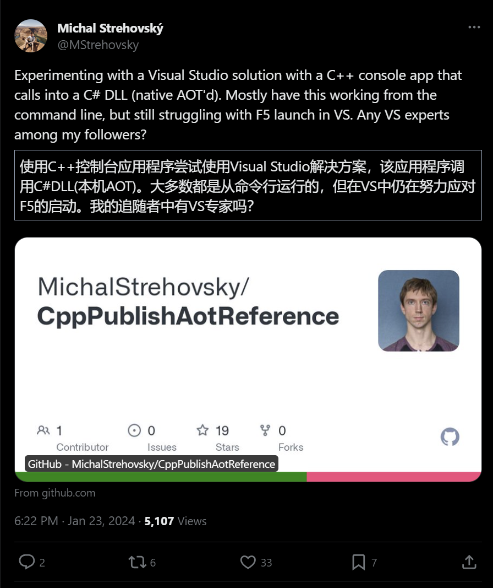
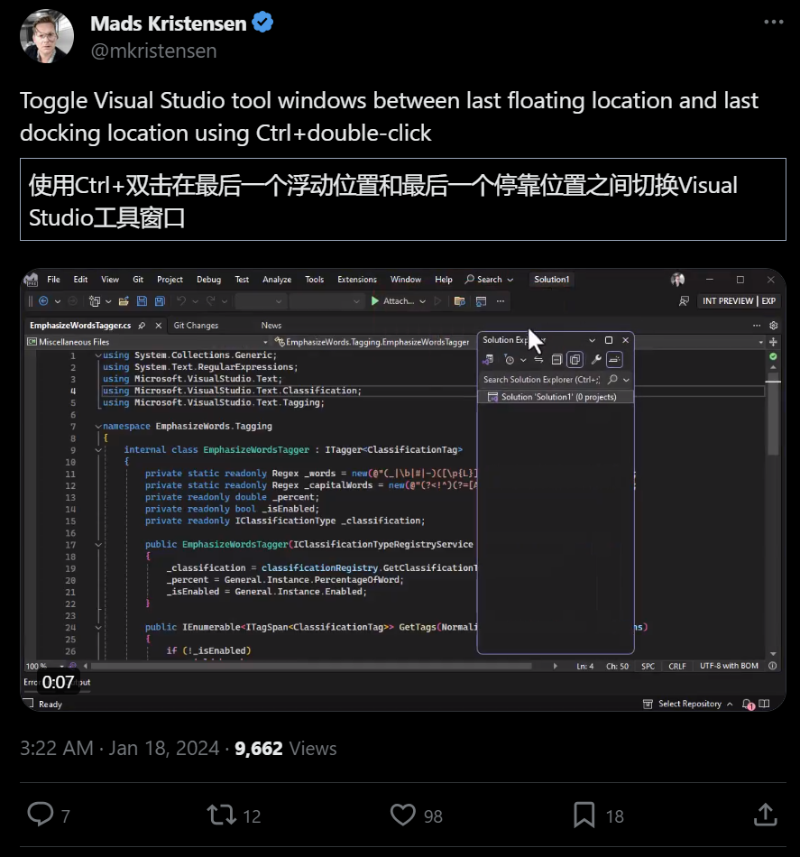
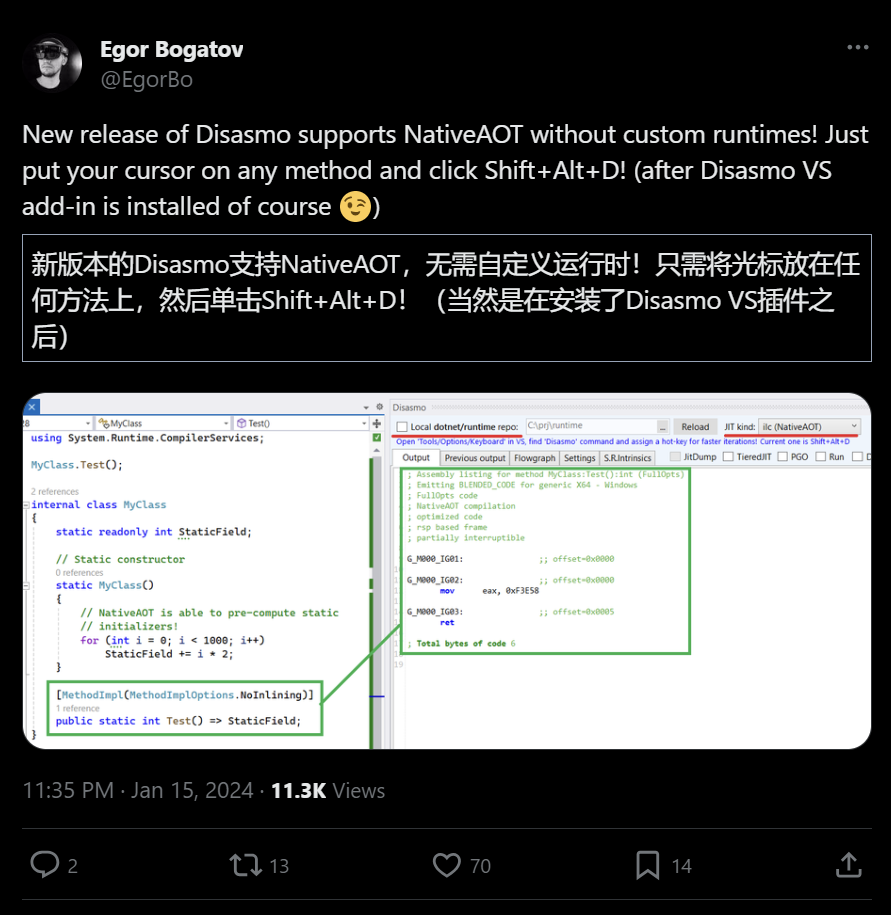

## 国内文章
### .NET开源的简单、快速、强大的前后端分离后台权限管理系统

https://www.cnblogs.com/Can-daydayup/p/17980851

本文介绍了中台Admin，一款基于Vue3和.NET8的开源后台权限管理系统。它具备前后端分离架构，支持多租户、接口和数据权限、动态Api等功能，并集成了多种中间件和服务。系统模块包括用户、角色、部门等管理功能。文章还提供了后端和前端代码的获取方式，并说明了如何使用源码或项目模板新建项目。最后，提供了在线体验地址和功能截图，方便用户了解系统界面和操作。

### C#开源免费的开发效率提升利器：DevToys开发人员的瑞士军刀！

https://www.cnblogs.com/Can-daydayup/p/17986955

本文介绍了DevToys，这是一款基于C#的开源Windows开发者工具箱，提供28+种实用工具，如格式化、JWT解码、URL编码/解码等，支持离线使用。适用于Windows 10 build 1903+版本。工具可从微软应用商店或GitHub下载。项目源码和更多功能可在GitHub和官网查看，欢迎给予Star支持。

### .NET集成IdGenerator生成分布式全局唯一ID

https://www.cnblogs.com/Can-daydayup/p/17983468

本文讲述了.NET集成IdGenerator生成分布式全局唯一ID的方法。分布式ID用于解决分布式系统中的唯一性和性能问题，需满足全局唯一、高性能、高可用、易用和压缩性等条件。IdGenerator基于优化的雪花算法，支持多种编程语言和环境，能在容器环境下自动扩容，兼容所有雪花算法。它在处理系统时间回拨问题时，采用预留序数生成新ID。性能测试显示，雪花漂移算法的处理速度显著快于传统雪花算法。最后，文章提供了在.NET环境下如何创建控制台、引入NuGet包和调用IdGenerator的示例。

### 纯c#运行开源本地大模型Mixtral-8x7B

https://www.cnblogs.com/gmmy/p/17989497

本文介绍了如何在C#环境下本地部署和运行Mixtral-8x7B大模型，利用LLamaSharp包实现。该模型与GPT-3.5相比，在多项任务上表现出色。LLamaSharp支持CPU和N卡CUDA推理，提高了运行效率。作者还分享了项目代码和使用Nous-Hermes微调版Mixtral-8x7B模型的经验，强调了内存对于提升推理速度的重要性。

### 使用Visual Studio调试 .NET源代码

https://www.cnblogs.com/Can-daydayup/p/17989098

本文讲述了如何在Visual Studio中调试.NET源代码，提升开发效率。首先，取消“工具”中“调试”选项下的“启用仅我的代码”，然后启用“源链接支持”和“符号服务器”，包括“Microsoft符号服务器”和“NuGet.org符号服务器”。可选地，开启“在模块加载时取消JIT优化(仅限托管)”以便更准确调试。设置后初次加载可能较慢。文章以System.Text.Json的`JsonSerializer.Deserialize`方法为例，展示了如何进行源码调试。

### Semantic Kernel 通过 LocalAI 集成本地模型

https://www.cnblogs.com/shanyou/p/17988059

本文介绍了如何使用LocalAI集成Meta开源的LLama 2大语言模型，并通过Semantic kernel（SK）实现本地部署。LocalAI是一个兼容OpenAI API的本地推理框架，支持多种模型，无需GPU，使用C++优化速度。通过修改HttpClient指向LocalAI，可以将本地模型以OpenAI格式通过SK访问。文中提供了详细的集成步骤和代码示例，方便开发者在自己的服务器上部署和运行大模型。

### WebAssembly入门笔记[1]：与JavaScript的交互

https://www.cnblogs.com/artech/p/17982714/hello_wasm_1

本文介绍了WebAssembly，一种类似汇编的低级语言，用于提高Web应用性能，不取代而是辅助JavaScript。WebAssembly以二进制格式运行，可由多种高级语言编译而成，支持四种基本数据类型。文章通过S-expression文本形式的示例，展示了WebAssembly程序的编写和JavaScript的交互。

### C# WPF 开发一个 Emoji 表情查看软件

https://www.cnblogs.com/he55/p/17988464

微软发布Windows 11时推出了开源Emoji表情库fluentui-emoji，共有1545个表情。作者为方便查找表情，制作了表情查看器，可快速浏览并定位表情文件。表情文件夹内包含元数据和png/svg图片，作者通过解析元数据和图片文件，不引入外部库，使用TinyJson解析库将json转为Model，实现了数据的解析和分组，并在界面上展示。开源地址为：https://github.com/he55/EmojiViewer。

### NCC Mocha v0.1.0 发布，.NET 开发的基于 OpenTelemetry 的 APM 系统

https://www.cnblogs.com/eventhorizon/p/17979677

本文介绍了Mocha，这是一个基于.NET的APM系统，提供了可扩展的数据分析和存储平台。项目支持通过OTel SDK上报Trace数据，并可通过Grafana展示。Mocha项目旨在解决可观测性数据的存储和分析问题，提供了一套完整的功能集合，包括APM、基础设施监控、日志、报警和数据探索。技术架构包括数据分发、流处理、存储和查询等组件。快速体验指南介绍了如何使用Docker Compose启动项目、发送Trace数据和配置Grafana中的Jaeger数据源。

### 程序员必备！10款实用便捷的Git可视化管理工具

https://www.cnblogs.com/Can-daydayup/p/17991511

本文分享了10款Git可视化管理工具，强调合适的工具能降低技术门槛，提高团队协作效率。Git是高效的分布式版本控制系统，记录文件变更历史，支持多人协作。文章列举了Sourcetree、GitHub Desktop和Visual Studio等工具，它们提供图形界面简化Git操作，如提交、分支管理等，并附有使用教程链接。

### Nginx被它打败了？

https://www.cnblogs.com/hejiale010426/p/17988975

本文讨论了Nginx和微软开发的YARP在代理服务器场景的应用。Nginx通常足够应对大多数代理需求，但在复杂业务中，通过lua脚本扩展功能可能不够便捷。YARP作为一个SDK，为.NET开发者提供了便利。文章展示了如何部署Nginx和YARP环境，并进行了性能测试。测试结果显示，YARP与Nginx在性能上相当，对原接口的性能影响微乎其微。此外，文章还提供了Kestrel相关资料链接，说明Kestrel与Nginx在传输层上的相似性，并邀请读者加入技术交流群。

### 记一次 .NET某工控自动化系统 崩溃分析

https://www.cnblogs.com/huangxincheng/p/17989081

本文分析了一个微信朋友程序偶发崩溃的问题。作者使用WinDbg工具，通过命令`!analyze -v`定位到崩溃发生在GC标记阶段，原因是访问了坏内存。进一步分析发现，虽然托管堆未损坏，但托管对象`o`出现问题。作者通过`!verifyheap`和`!address`命令检查，发现托管地址与托管段之间的空间距离特征，为解决问题提供了线索。

### C# AsyncLocal 是如何实现 Thread 间传值

https://www.cnblogs.com/huangxincheng/p/17987389

本文讲述了.NET中`AsyncLocal`的实现原理。作者在`.NET高级调试训练营`中被问及此问题，决定用文字和图表详细解释。C#中线程间传值可通过`Thread`、`Task`、`await/async`实现，而`AsyncLocal`是托管C#实现，与coreclr、Windows无关。例子展示了如何在新线程中获取`_asyncLocal`的值，源码分析揭示了值是如何存储和传递的。主线程的`_executionContext`被复制到新线程，通过`ExecutionContext.Capture()`实现。最后，作者通过调试验证了新线程确实接收到了正确的`_executionContext`。

### 使用 NuGet.Server 创建和部署 ASP.NET Web 应用程序搭建私有Nuget服务器

https://www.cnblogs.com/hudean/p/17993315

本文介绍了如何使用NuGet.Server在ASP.NET Web应用程序中创建私有NuGet服务器。首先，在Visual Studio中创建一个新的ASP.NET Web应用程序项目，设置.NET Framework版本为4.6，并选择空模板。然后，通过管理NuGet包安装NuGet.Server，将空Web应用程序转换为NuGet包源。安装过程中会修改web.config文件，创建Packages文件夹，并可能产生重复元素，需要手动检查并删除。本地运行应用程序后，NuGet.Server会根据NuGet 3.3的本地存储布局重建Packages文件夹。部署应用程序后，可以通过设置web.config中的apiKey值，使用nuget push命令向服务器推送包。从NuGet.Server 3.0.0开始，推送包的URL为`http://<domain>/nuget`。

### 如何为开源项目和社区做贡献 -- 你应该知道的十件事

https://www.cnblogs.com/guojin-blogs/p/17984535

本文作者颜国进分享了他从技术新手成长为开源项目负责人的经历。他从机械专业研一新生起步，通过学习C++、C#和Python等语言，以及深入研究OpenCV图像处理和模型部署技术，最终发布了OpenVINO C# API开源项目，并撰写了多篇技术文章。他强调参与开源项目对个人技术提升、建立声誉和职业发展有显著益处，同时对行业和企业发展也有正面影响。开源软件促进了技术创新，降低了成本，提高了灵活性，并建立了活跃的社区。作者通过开源贡献，不仅提升了自己的技术能力，还获得了英特尔边缘计算创新大使、百度飞桨开发者专家等荣誉，增强了社区影响力。

### C# 线程本地存储 为什么线程间值不一样

https://www.cnblogs.com/huangxincheng/p/17982804

本文讲述了`ThreadStatic`属性在多线程中的行为。作者通过实验代码发现，使用`ThreadStatic`标记的字段，在不同线程中有不同的初始值。通过分析汇编代码和CoreCLR源码，解释了这一现象：每个线程有自己的`ThreadLocalBlock`，其中包含`ThreadLocalModule`字典，`ThreadStatic`字段存储于此。作者用图示和windbg工具验证了结构和存储位置。

### Advanced .Net Debugging 1：你必须知道的调试工具

https://www.cnblogs.com/PatrickLiu/p/17965068

本文讲述了调试工具的重要性和如何使用它们来提高开发效率。作者分享了自己过去未使用工具而直接审查代码的经历，并推荐了《Net 高级调试》一书，强调了使用更新的工具进行调试的必要性。文中介绍了Windows调试工具集，包括用户态调试工具NTSD、CDB和WinDbg，以及内核态调试器KD。这些工具使用相同的调试引擎，但有不同的界面和用途。作者还提到了配置环境变量的便利性，并说明了如何获取调试工具集，可以作为WDK或Windows SDK的一部分，或作为独立工具集安装。最后，作者提到了自己使用的Windows SDK版本，强调了其对最新Windows版本的支持。

### Net Core中使用EF Core连接Mysql数据库

https://www.cnblogs.com/huangqian/p/17985122

本文介绍了Entity Framework Core（EF Core），一种微软推出的ORM框架，它封装了ADO.NET，支持多种数据库。EF Core有四种使用模式：Code First自动创建数据库结构，DB First根据数据库生成类，Model First通过可视化设计数据库，以及灵活模式分离数据库和代码的开发。文章详细说明了如何引入EF Core，创建数据上下文DbContext，并配置数据库连接。通过实体类与数据库表的映射，可以进行数据操作，如添加、更新和多表查询。这些操作示例展示了EF Core的实用性和便捷性。

### 精通 VS 调试技巧,学习与工作效率翻倍!

https://www.cnblogs.com/bett/p/17985492

本文介绍了调试的概念和方法。调试是编程中查找和修正错误的过程。在Visual Studio中，有Debug和Release两种编译选项，Debug便于调试但体积大，Release体积小但无法调试。文章还介绍了常用的调试快捷键，如F5启动调试，F9设置断点等。断点帮助程序在特定位置停止，以便检查执行细节。监视功能可以观察变量值的变化，而内存观察则用于查看变量在内存中的存储情况。通过这些工具和方法，可以有效地进行代码调试。

### FluentValidation在C# WPF中的应用

https://www.cnblogs.com/Dotnet9-com/p/17986383

本文探讨了在.NET开发中使用FluentValidation进行C# WPF项目属性验证的方法。FluentValidation适用于多种.NET应用，特别是与WPF和MVVM模式结合时，能够提供强大的数据验证功能。文章介绍了如何构建WPF应用程序，实现基本数据类型和复杂属性的验证，并提供用户友好的错误提示。通过实践发现，虽然官方文档对WPF支持有限，但可以通过实现IDataErrorInfo接口和使用FluentValidation库有效地进行属性验证。

### 基于CefSharp开发浏览器（十）CefSharp.Wpf中文输入法偏移处理

https://www.cnblogs.com/mchao/p/17985041

本文讨论了CefSharp WPF版本中文输入法显示问题。作者首先尝试了官方的WpfImeKeyboardHandler解决方案，但效果不佳。随后，作者发现CefSharp.Wpf.HwndHost能够解决输入法框偏移问题，但使用HwndHost会带来空域规则遵守、细节处理复杂性增加等问题。最后，作者测试了CefSharp.WinForms，并发现其对中文输入法支持更好。鉴于CefSharp.WinForms和CefSharp.WPF接口相似，作者建议在WPF项目中使用WindowsFormsHost承载CefSharp.WinForms来解决中文输入法问题，并欢迎更好的解决方案分享。

### 【译】解开托管内存的秘密：深入了解事件处理程序泄漏！

https://www.cnblogs.com/MeteorSeed/p/17987012

本文讨论了WPF开发中常见的事件处理程序泄漏问题，这种泄漏由于忘记取消事件订阅而引起，难以发现和修复。Visual Studio更新了托管内存使用工具，简化了泄漏的发现和修复过程。该工具能显示泄漏对象和其订阅的事件。文章通过一个示例说明了如何使用该工具诊断和解决泄漏问题，还提到了该工具的其他潜在用途，并鼓励用户下载最新版Visual Studio并提供反馈。

### 一个例子形象地理解同步与异步

https://www.cnblogs.com/s0611163/p/17979998

本文通过示例分析了同步请求接口的问题和改进方法。原代码中使用for循环创建500个while(true)循环进行同步请求，但只有一个循环得到执行。建议使用线程或Task.Run改进。通过添加Thread.Sleep(1)或await Task.Delay(1)，尝试提高效率，但前者无效，后者则显著提升了请求速度，多个while(true)能并行执行。最后，将同步请求改为异步请求，进一步优化性能。

### 【解决方案】如何使用 Http API 代替 OpenFeign 进行远程服务调用

https://www.cnblogs.com/Apluemxa/p/17979942

本文讨论了为何替换OpenFeign，主要是出于安全性考虑，减少外部依赖，为Spring 6做准备。OpenFeign基于Feign增加SpringMVC注解支持，使用URLConnection，通过@FeignClient注解实现服务调用。注解属性包括url、name、value、path、configuration和fallback。远程服务调用分为注册中心服务和单独http接口两种情况。文章还提到了Apache HttpClient等Http API，但认为它们设计臃肿，不如OpenFeign简洁。最后重点介绍了Spring的RestTemplate，它是一个同步客户端Http请求模板，提供了多种便捷方法执行HTTP请求和处理响应。

### C#对象二进制序列化优化：位域技术实现极限压缩

https://www.cnblogs.com/Dotnet9-com/p/17981055

本文探讨了如何优化C#对象的二进制序列化，以便在操作系统中高效传输进程信息。文章首先定义了进程对象的字段和数据类型，然后通过位域技术减小数据包大小。通过创建C#类`SystemProcess`，文章展示了如何将进程信息转换为二进制格式，以便网络传输。

### 单层应用升级到多层应用3

https://www.cnblogs.com/fanshaoO/p/17982859

本文讲述了如何优化软件项目结构，通过将Core项目中的基础功能细分，提高了模块化程度。文章详细描述了从单层结构向多层结构迁移的过程，包括依赖注入、授权、缓存、用户信息、权限检查、工具类、事件总线和文件存储等组件的拆分。每个组件被封装到独立的类库中，以便根据需要进行引用，从而提高了代码的可维护性和可重用性。例如，EventBus被拆分为基础接口和不同实现的类库，FileStorages也采用了类似的拆分方法。这种拆分策略使得项目结构更加清晰，便于管理和扩展。

### 【译】Visual Studio 2013 退役 ：旧版本 Visual Studio 的支持提醒

https://www.cnblogs.com/MeteorSeed/p/17979787

本文提醒用户Visual Studio 2013将于2024年4月9日停止支持，建议升级至Visual Studio 2022。Visual Studio 2019将于2024年4月9日进入扩展支持阶段。Visual Studio 2022是64位IDE，具备生产力改进、Git支持、GitHub集成和人工智能代码完成等功能。旧版Visual Studio用户应注意关键支持日期，确保使用最新更新版本以获得安全修复。Visual Studio 2022提供预览、当前和长期服务通道，以适应不同用户需求。微软鼓励用户通过开发者社区提供反馈，并通过社交媒体平台与Visual Studio团队保持联系。

### 深度解析C#数组对象池ArrayPool&lt;T&gt;底层原理

https://www.cnblogs.com/pengze0902/p/17951360

本文讲述了.NET中的池化技术，包括连接池、线程池、对象池、网络套接字池和资源池，这些技术通过重复使用资源提高性能。介绍了.NET的MemoryPool、ArrayPool、MemoryManager等对象，以及它们在内存管理、数据库连接和线程管理中的应用。特别强调了`ArrayPool<T>`的作用，它通过管理数组重用减少垃圾回收压力和内存碎片，尤其适用于高性能应用和多线程环境。最后提到ArrayPool的底层实现是ConfigurableArrayPool。

### 在Winform系统开发中，使用MediatR来实现类似事件总线的消息处理

https://www.cnblogs.com/wuhuacong/p/17984987

本文介绍了MediatR框架，它是.NET平台下的进程内消息处理框架，支持请求/响应、命令、查询等消息类型，实现了消息与处理器的解耦。文章详细说明了如何在Winform系统开发中使用MediatR，包括通过NuGet安装、服务注入、以及创建ServiceLocator静态类来全局存储和获取IServiceProvider实例。通过这些步骤，开发者可以方便地在Winform应用中实现类似事件总线的功能。

### 码农的转型之路-IoTBrowser（物联网浏览器）雏形上线

https://www.cnblogs.com/yizhuqing/p/17981140

本文讲述了作者近期的几项工作进展：首先，他测试了一个工控盒子，运行win10系统的物联网服务，除了一次自动更新重启外，运行稳定。其次，作者学习了MQTT、HMI、SCADA等新概念，并研究了几个物联网开源项目。接着，他开发了IoTBrowser（物联网浏览器）的初版，并在Gitee上发布，还计划推出两个版本，一个免费但带有Logo，另一个是企业版，去除Logo需付费。最后，作者提到将开启新系列，围绕IoTBrowser的介绍和二次开发教程。

### 物联网浏览器(IoTBrowser)-Web串口自定义开发

https://www.cnblogs.com/yizhuqing/p/17984857

本文介绍了物联网浏览器(IoTBrowser)的Web串口自定义开发过程。IoTBrowser通过封装API，允许前端用js进行串口的打开、关闭、数据发送和接收，利用SignalR实现客户端的实时通讯。开发步骤包括创建控制台工程、添加引用、新增类并实现接口、初始化驱动、编写打开关闭串口和发送数据的代码。本机测试后，将编译的exe文件放入指定插件目录进行系统测试。最后，提供了示例代码链接，用于开发实际串口交互程序。

### 如何让你的.NET WebAPI程序支持HTTP3？

https://www.cnblogs.com/hejiale010426/p/17985452

本文介绍了如何在Token Gateway项目中实现Http3。首先，使用Http3需要Windows 11版本22000以上或Windows Server 2022，以及TLS 1.3以上的连接；在Linux上需要安装`libmsquic`包。实现过程中，先通过Git拉取代码，然后配置`Program.cs`文件，包括FreeSql类型转换、Kestrel服务器选项、Jwt认证、跨域策略等。最后，注册了多个服务和中间件，完成了Http3的配置和启动。

### 单元测试中如何Mock HttpContext

https://www.cnblogs.com/tianqing/p/17983832

本文讲述了在C#单元测试中模拟HttpContext的方法。使用Moq库，可以在不发起实际HTTP请求的情况下测试代码。通过安装Moq并编写代码，可以创建模拟的HttpContext、HttpRequest、HttpResponse、HttpSessionState、HttpServerUtility等对象，从而实现对各种HTTP上下文组件的模拟。这样的模拟有助于测试与HTTP上下文相关的逻辑。

### 基于Basic auth 的一个C# 示例

https://www.cnblogs.com/moonstars/p/17993139

本文讲述了在项目中遇到客户系统仍使用不太安全的BASIC认证的情况。BASIC认证通过明文传输经Base64编码的用户名和密码，容易遭受中间人攻击，通常需搭配HTTPS使用。文章还提供了C#语言实现BASIC认证的示例代码，包括设置请求头、传输参数、发起请求和处理响应等步骤。

### 用CI/CD工具Vela部署Elasticsearch + C# 如何使用

https://www.cnblogs.com/IWings/p/17982449

本文介绍了Vela工具的使用，它能编译、部署程序，并支持docker镜像部署，如RabbitMQ、PostgreSQL、Elasticsearch等。文中详细说明了如何部署Elasticsearch，包括创建文件夹、权限设置、端口和文件夹映射、环境变量配置以及Dockerfile内容。还提到了如何以非root用户运行docker容器，关闭Elasticsearch的密码安全验证，安装IK分词器，并重启容器。最后，展示了如何在C#中使用Elasticsearch，包括连接、插入、更新、删除、获取和搜索数据的代码示例。

### 单层应用升级到多层应用2

https://www.cnblogs.com/fanshaoO/p/17980628

本文讲述了如何进一步拆分单层应用，将基础设施代码和业务代码分离。作者创建了Api和Application两个类库，分别用于存放接口代码和业务应用代码，并调整了项目结构，使得Host项目更加简洁。同时，提到了未来需要进一步细化基础设施功能的拆分，以及考虑如何处理既属于基础设施又具有业务属性的代码。最后，作者预告了后续文章将继续探讨多层应用升级的优化。

## 主题

### ReSharper 和 Rider 2023.3 的另一组错误修复现已发布！ | .NET 工具博客
https://blog.jetbrains.com/dotnet/2024/01/22/2023-3-3-rsrp-rd/

ReSharper 和 Rider 2023.3.3 已发布。

此版本修复了重命名、拼写检查、QuickFix 等方面的多个错误。

### 版本 2.3.5 · mysql-net/MySqlConnector
https://github.com/mysql-net/MySqlConnector/releases/tag/2.3.5

MySQL 连接器 2.3.5/2.3.4 已发布。

此版本删除了 TLS 版本回退，支持 NuGet 包中 DLL 的数字签名，并修复了其他几个问题。

- [版本 2.3.4·mysql-net/MySqlConnector](https://github.com/mysql-net/MySqlConnector/releases/tag/2.3.4)

### 版本 11.0.7 · AvaloniaUI/Avalonia
https://github.com/AvaloniaUI/Avalonia/releases/tag/11.0.7

Avalonia 11.0.7 已发布。

此版本修复了内存泄漏、XAML 编译器错误和各种其他错误。

### 2.7.17 版 · StackExchange/StackExchange.Redis
https://github.com/StackExchange/StackExchange.Redis/releases/tag/2.7.17

StackExchage.Redis 2.7.17 已发布。

修复了多个错误，例如在连接关闭期间防止出现 NullReferenceException，以及在事务命令映射中取消对 SELECT 命令的破坏。

### 发布 v8.0.0 · autofac/Autofac
https://github.com/autofac/Autofac/releases/tag/v8.0.0

Autofac 8.0.0 已发布。

此版本将 .NET 8 添加到目标框架并删除 .NET Core 3.1。

## 文章、幻灯片等
### .NET Framework 2024 年 1 月累积更新预览 - .NET 博客
https://devblogs.microsoft.com/dotnet/dotnet-framework-january-2024-cumulative-update-preview/

2024 年 1 月 .NET Framework 累积更新已作为预览版发布。

这包括修复在 ASP.NET MVC 请求处理期间引发 ArgumentException 的问题，以及解决旧版本 zlib 库的问题。

### .NET 8 — 新数据注释
https://henriquesd.medium.com/net-8-new-data-annotations-4434575db48b

.NET 8 中新的 System.ComponentModel.DataAnnotations 属性简介。

### 通过中级和高级系列提升您在 Visual Studio 中的 Git 和 GitHub 技能 - Visual Studio 博客
https://devblogs.microsoft.com/visualstudio/intermediate-and-advanced-git/

介绍一个视频系列，以提高您在 Visual Studio 中的 Git 和 GitHub 技能。

### 避免增量生成器中的性能陷阱：创建源生成器 - 第 9 部分
https://andrewlock.net/creating-a-source-generator-part-9-avoiding-performance-pitfalls-in-incremental-generators/

了解如何避免增量源生成器的性能陷阱。

本文介绍了使用 Source Generator 的 API 时的执行模式以及性能方面需要注意的事项。

### 测试增量生成器管道输出是否可缓存：创建源生成器 - 第 10 部分
https://andrewlock.net/creating-a-source-generator-part-10-testing-your-incremental-generator-pipeline-outputs-are-cacheable/

有关如何使增量源生成器管道输出可缓存的说明。

### [Rider] 如何调试 SourceGenerator - Qiita

https://qiita.com/amenone_games/items/0a99f38fd08911b62c3a

了解如何使用 JetBrains Rider 调试源生成器。

### 2023 年 Visual Studio 生产力功能 - Visual Studio 博客
https://devblogs.microsoft.com/visualstudio/visual-studio-productivity-features-in-2023/

一篇文章总结了 2023 年发布的 Visual Studio 2022 与生产力相关的功能。

### 通过启用 ETW 分析 WPF 性能 | endjin
https://endjin.com/blog/2024/01/wpf-performance-enable-etw

使用 ETW 衡量 WPF 性能的步骤说明。如何从 ETW 获取数据并将其显示在 PerfView 中。

### 使用 Porting Assistant for .NET CLI 支持不支持的组件 - Qiita
https://qiita.com/miyamacchi/items/99c098ebab1c4f8053f9

有关如何启用 AWS Porting Assistant for .NET 来处理不受支持的 ASP.NET 控件的说明。

### 删除 Windows 资源管理器中不存在的文件（第 1 部分）- Qiita
https://qiita.com/miswil/items/b97dd4914a335fa21790

说明如何将非真实文件的数据从应用程序传递到放置目标（例如资源管理器）。

- [删除 Windows 资源管理器中不存在的文件（第 2 部分）- Qiita](https://qiita.com/miswil/items/49025648cc65fc7ae6e0)
- [删除 Windows 资源管理器中不存在的文件（第 3 部分）- Qiita](https://qiita.com/miswil/items/9771cb1de32b0713b744)
- [删除 Windows 资源管理器中不存在的文件（第 4 部分）- Qiita](https://qiita.com/miswil/items/39dfdffde6df0d2a384c)

### .NET 中的 1BRC 在 Linux 上速度最快：我的优化之旅
https://hotforknowledge.com/2024/01/13/1brc-in-dotnet-among-fastest-on-linux-my-optimization-journey/

十亿行挑战（在各种实现中聚合 10 亿行数据的挑战）解释了使用 .NET 的实现优化技术。

- [十亿行挑战](https://github.com/gunnarmorling/1brc)

### 欢迎来到 ReSharper 2024.1 抢先体验计划 | .NET 工具博客
https://blog.jetbrains.com/dotnet/2024/01/19/resharper-2024-1-eap1/

ReSharper 2024.1 EAP 公告。

2024.1 EAP 1 包括侧重于 C++ 支持的改进。

### 我想在 C# 主构造函数上设置属性
https://zenn.dev/microsoft/articles/primary-constructor-attr

如何在 C# 12 中指定主构造函数方法本身的属性。

### 17.9 Preview 3 为代码搜索带来了令人兴奋的变化 - Visual Studio 博客
https://devblogs.microsoft.com/visualstudio/17-9-preview-3-brings-exciting-changes-to-code-search/

在 Visual Studio 2022 17.9 Preview 3 中引入代码搜索的文本搜索增强功能。

### 拦截器 – 在 Rider 和 ReSharper 中使用 C# 12 | .NET 工具博客
https://blog.jetbrains.com/dotnet/2024/01/16/interceptors-using-csharp-12-in-rider-and-resharper/

引入了对 Rider 和 ReSharper 的 C# 12 预览功能拦截器支持。

Rider 和 ReSharper 可以在拦截器目标上显示嵌入提示。

### 用 C# 构建一个小于 2 KB 的独立游戏
https://migeel.sk/blog/2024/01/02/building-a-self-contained-game-in-csharp-under-2-kilobytes/

如何使用 C# 创建 2KB 独立（无需运行时）的游戏应用程序。

- [bflat - C# 如您所知，但具有 Go 启发的工具](https://flattened.net/)

### 如何将 IAsyncEnumerable 与 Blazor 流渲染结合使用
https://khalidabuhakmeh.com/how-to-use-iasyncenumerable-with-blazor-stream-rendering

如何在 Blazor 中渲染 IAsyncEnumerable 中的值。

### 使用 WireMock.NET 模拟 GraphQL 查询

https://cezarypiatek.github.io/post/mocking-graphql-with-wiremock/

了解如何使用 WireMock.NET 模拟 GraphQL 查询。

### 初始化数组（也初始化List、IList、ImmutableArray等）《C#12》《集合表达式》 - Qiita
https://qiita.com/muniel/items/8af5b337d9bbbfbd2812

关于 C# 12 中的集合表达式。它涉及到如何写、可以使用和不可以使用的模式等等。

### 如何使用 Blazor Server 从 .NET 7 迁移到 .NET 8 - Qiita
https://qiita.com/yaju/items/762d48ecda8b9c59279a

了解将 Blazor 服务器从 .NET 7 迁移到 .NET 8 时遇到的问题以及如何解决这些问题。

### 使用.NET 8构建WinUI 3应用程序（NETSDK1083对策）
https://zenn.dev/shinta0806/articles/dotnet8-netsdk1083

关于使用 .NET 8 构建 WinUI 3 应用程序时可能出现的错误以及如何处理这些错误。

### 探索.NET 冻结段
https://minidump.net/exploring-frozen-segments/

本文介绍如何使用私有 API 来使用包含不受 GC 影响的堆的固定段（在 .NET 8 中引入）。

### .NET Continuous Profiler：幕后花絮 | Datadog
https://www.datadoghq.com/en/blog/engineering/dotnet-continuous-profiler/

.NET 探查器架构及其实现方式的简要说明。

### neue cc - 在 .NET 和 Unity 项目之间共享源代码的最新方法
https://neue.cc/2024/01/15_shareprojectinunity.html

一种在 .NET 和 Unity 项目之间共享源代码的方法。以及在开发 NuGet 包时如何从 Unity 引用它。

## 活动

### 在午休期间使用 C# 从头开始​​创建 Blazor WebAssembly Web 应用程序 (2024/02/09 12:00~)
https://msdevjp.connpass.com/event/308241/

在相对较短的时间内使用 C# 和 Blazor WebAssembly 创建 Web 应用程序。

据说它相当于 Let's Learn .NET（面向初学者的发行系列）的日语本地化版本。

## 库、存储库、工具等。
## 网站、文档等
### 免费学习响应式编程：Rx.NET 第二版简介 (2024) | endjin
https://endjin.com/blog/2024/01/introduction-to-rx-dotnet-2nd-edition-book-available-for-free

Rx.NET 第二版简介电子书。

### 推文
尝试配置 C++ 应用程序项目以引用 NativeAOT C# 库。

https://x.com/mstrehovsky/status/1749739317180891232?s=12

---

Visual Studio 工具窗口已停靠/浮动，并且可以使用 Ctrl + 双击将其移动到其原始位置。
https://x.com/mkristensen/status/1747701018815848592?s=12

---

https://x.com/egorbo/status/1746918915266252834?s=12

新版本的 Disasmo 支持 NativeAOT，无需自定义运行时！只需将光标放在任何方法上，然后单击 Shift+Alt+D！（之后当然安装了 Disasmo VS 插件 😉) 

## 版权声明

* 国内板块由 InCerry 进行整理 : https://github.com/InCerryGit/WeekRef.NET
* 其余内容来自 Myuki WeekRef，由InCerry翻译（已获得授权） : https://github.com/mayuki/WeekRef.NET

**由于笔者没有那么多时间对国内的一些文章进行整理，欢迎大家为《.NET周刊-国内文章》板块进行贡献，需要推广自己的文章或者框架、开源项目可以下方的项目地址提交Issue或者在我的微信公众号私信。**

格式如下：

* 10~50字左右的标题
* 对应文章或项目网址访问链接
* 200字以内的简介，如果太长会影响阅读体验

https://github.com/InCerryGit/.NET-Weekly

## .NET性能优化交流群

相信大家在开发中经常会遇到一些性能问题，苦于没有有效的工具去发现性能瓶颈，或者是发现瓶颈以后不知道该如何优化。之前一直有读者朋友询问有没有技术交流群，但是由于各种原因一直都没创建，现在很高兴的在这里宣布，我创建了一个专门交流.NET性能优化经验的群组，主题包括但不限于：

* 如何找到.NET性能瓶颈，如使用APM、dotnet tools等工具
* .NET框架底层原理的实现，如垃圾回收器、JIT等等
* 如何编写高性能的.NET代码，哪些地方存在性能陷阱

希望能有更多志同道合朋友加入，分享一些工作中遇到的.NET性能问题和宝贵的性能分析优化经验。**目前一群已满，现在开放二群。**

如果提示已经达到200人，可以加我微信，我拉你进群: **ls1075**

另外也创建了**QQ群**，群号: 687779078，欢迎大家加入。 

