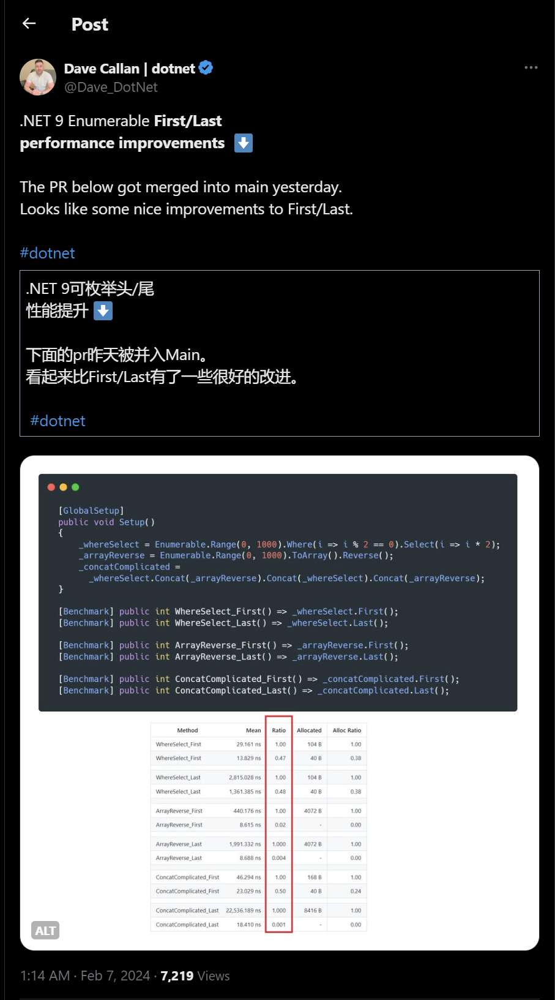
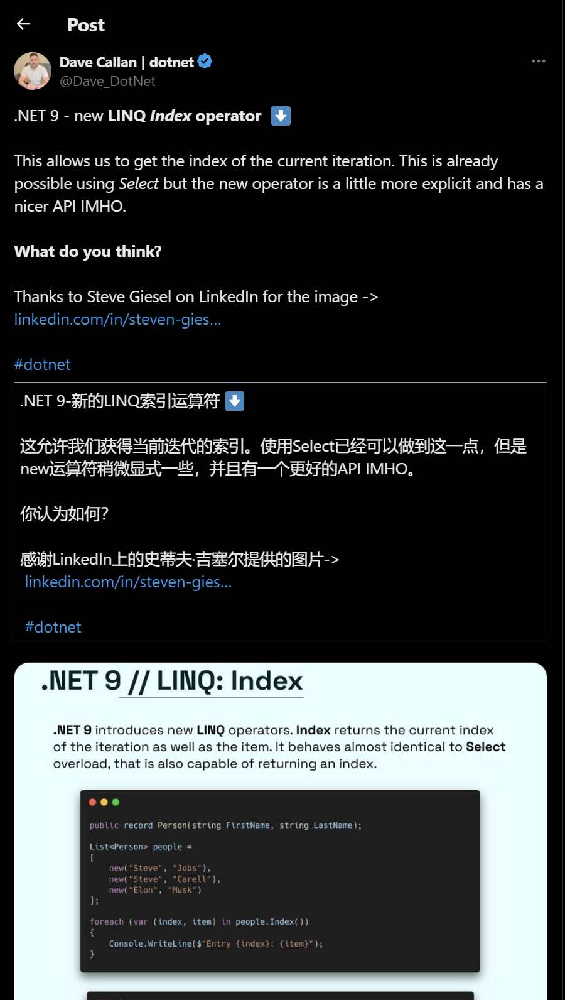
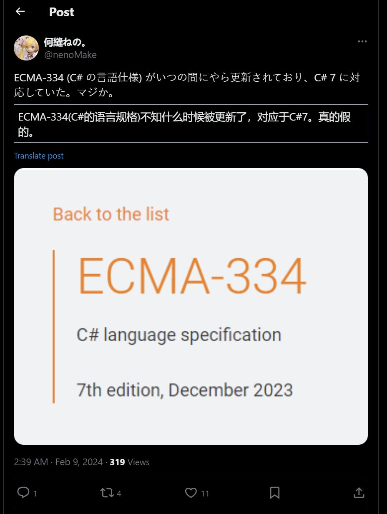

## 国内文章
### C#/.NET该如何自学入门？

https://www.cnblogs.com/Can-daydayup/p/18006914

随着DotNetGuide技术社区交流群的扩大，很多新成员希望知道如何自学C#/.NET。本文提出了自学建议：首先要了解语言特点与发展，然后制定详细学习计划，以微软官方文档为学习起点，并结合动手实践与其他资源来提升自我。还推荐了学习资料包括学习路线图、推荐书籍、学习视频、面试宝典以及一些优秀项目框架，并鼓励加入技术社区交流群以获取更多帮助。

### .NET Avalonia开源、免费的桌面UI库 - SukiUI

https://www.cnblogs.com/Can-daydayup/p/18010574

SukiUI是一个开源的基于.NET Avalonia的桌面UI库，它提供了包括浅色和深色在内的主题切换功能和一些额外控件，以帮助开发者创建丰富的用户界面。Avalonia框架支持多平台，可以让开发者创建跨平台应用，并保证UI在不同操作系统上的一致性。SukiUI项目代码可以在GitHub上找到，并已被收录进C#/.NET/.NET Core优秀项目和框架精选。DotNetGuide技术社区是为.NET开发者提供资源和交流的开源社区。

### 点亮.NET的文字云艺术之光——Sdcb.WordCloud 2.0

https://www.cnblogs.com/sdflysha/p/18012571/sdcb-wordcloud-2_0

Sdcb.WordCloud 2.0是.NET开发者用于创建文字云的一个库。此版本提升了性能，优化了指针操作，支持跨平台，可以输出多种格式。它拥有高度的定制性并且是开源的。此库让开发者可以轻松创建不同文本方向、应用遮罩、特定字体的文字云，并且支持生成SVG格式及转换为JSON数据。

### 开启未来创新之门：.NET Conf China 2023 精彩回顾及资料下载

https://www.cnblogs.com/shanyou/p/18011287

.NET Conf China 2023中国.NET开发者大会于2023年12月16日至17日在北京举办，由.NET中文社区主办，并得到多家组织的支持。会议内容丰富，包含主题讲座、分会场讨论和工作坊，共有30余位.NET领域的专家分享，近300名现场观众参加，16万在线观众观看直播。会议涉及.NET 8新功能、AI、云原生、IoT等多个技术话题，旨在为.NET爱好者提供交流平台。

### .NET中使用BootstrapBlazor组件库Table实操篇

https://www.cnblogs.com/Can-daydayup/p/18008726

BootstrapBlazor是一套基于Bootstrap和Blazor的企业级组件库，提供了100多种组件，特别适合喜欢Bootstrap风格的开发者。文章以学生信息管理为例，介绍了BootstrapBlazor Table组件的使用方法，包括数据模型的定义、后台模拟数据的生成和增删改查方法的封装，不需连接数据库。整个过程中使用的示例数据均为程序自动生成。

### Asp .Net Core 系列：Asp .Net Core 集成 NLog

https://www.cnblogs.com/vic-tory/p/18010317

NLog是一个用于.NET平台的日志类库，提供灵活的配置和高性能的日志记录功能。支持结构化和传统日志记录，易用性和扩展性强，适用于.NET Framework、.NET Core、Xamarin、ASP.NET等多个平台。使用BSD许可证，源代码开放。配置文件支持通过targets定义日志输出目标，并通过rules设置日志记录规则，如日志级别、写入目标等。

### AgileConfig-1.9.0 发布，支持 MongoDB 存储

https://www.cnblogs.com/kklldog/p/18011534/agileconfig-190

AgileConfig 1.9.0版本为支持Mongodb进行了大重构，新增了存储层抽象，使得对RDB和Nosql的扩展更容易，并加强了单元测试。更新后可以简单配置实现Mongodb作为存储。但需注意MongoDB单节点不支持事务，建议使用集群。若从老版本升级需注意系统日志表主键类型变更。项目地址https://github.com/dotnetcore/AgileConfig，同时提供了Demo地址。

### 使用 WPF + Chrome 内核实现高稳定性的在线客服系统复合应用程序

https://www.cnblogs.com/sheng_chao/p/18009246

本文介绍了如何使用WPF加Chrome内核通过WebView2组件实现复合客服端应用程序。首先需通过NuGet安装WebView2 SDK，并在WPF界面中添加WebView组件。然后设置WebView2控件在网页导航时响应一系列事件，如确保HTTPS连接。最后，可使用ExecuteScriptAsync方法让WebView2控件执行JavaScript代码，以增加应用的交互性。文中还提供了在线客服系统不丢消息的视频实拍链接。

### 基于C#的屏幕鼠标跟随圈圈应用 - 开源研究系列文章

https://www.cnblogs.com/lzhdim/p/18010388

作者利用C#开发了一个Windows系统级别的鼠标跟随圈圈效果应用，没有得到博问社区满意的答案后，自行完成开发。项目提供了目录结构、关键代码介绍、使用方法与源码下载链接，并指出当前版本为初版，未来将优化窗体形状与效果。作品集与开源研究系列作品也一并给出了链接，作者期待通过开源项目帮助对C# Winform效果感兴趣的开发者。

### Asp .Net Core 系列：Asp .Net Core 集成 Panda.DynamicWebApi

https://www.cnblogs.com/vic-tory/p/18011427

Panda.DynamicWebApi 是一个基于ASP.NET Core的组件，用于动态生成遵循Restful风格的WebApi，类似于ABP框架。它通过分析特定类生成WebApi，并且支持与Swagger的集成。特别适用于DDD架构中，可以直接从应用逻辑层生成WebApi，无需编写Controller。通过Nuget安装后，可在Startup中配置，如设置API前缀，定义Action名称处理方式等，并添加自定义的服务实现如AppleAppService，实现IDynamicWebApi接口。

### 十八张图带你入门实时监控系统HertzBeat

https://www.cnblogs.com/makemylife/p/18008977

HertzBeat 赫兹跳动是一款开源的实时监控告警系统，拥有强监控模版和免Agent的特色。它利用SNMP、JMX、JDBC等标准协议和规范来采集各类数据，并可以通过编写YML监控模版进行配置化管理。HertzBeat提供Docker一键安装，能监控如Redis数据库和SpringBoot服务，并支持邮件等多种通知方式的报警配置。使用体验良好，不仅界面清新，而且操作流畅，监控系统设计和知识点很丰富。

### 【译】VisualStudio 17.9预览3带来了令人兴奋的代码搜索改变

https://www.cnblogs.com/MeteorSeed/p/18005882

VisualStudio17.9预览版3更新了代码搜索功能，现在可以在解决方案中搜索局部变量名、注释、参数名以及其他字符串。新搜索体验集成了精确文本匹配，但文本结果优先级较低，不会干扰现有工作流程。用户还可通过快捷键或菜单过滤到仅文本结果，并使用匹配大小写、整个单词或正则表达式进行搜寻。这项功能目前在预览版中可用，将在17.9的主版本中作为预览功能提供。微软希望用户继续通过开发者社区提供反馈。

### 【译】发布 .NET Aspire 预览版 2（一）

https://www.cnblogs.com/MingsonZheng/p/18012175

.NET Aspire 预览版 2 现已推出，这是一个针对分布式云应用开发的 .NET 解决方案。新版增加了仪表板的整合视图、详细的窗格设计以及控制台日志的改进。对托管和编排环节进行了增强，特别是在容器的参数传递和服务发现配置方面。新组件被添加以支持MySQL和MongoDB，同时优化了Azure SDK。部署方面包括了Azure CLI的改进和社区工具Aspir8的引入。Dapr集成现在对应用程序模型有着更好的支持。此外，文章还包含了如何安装或升级、更新现有应用程序和API变更等信息。

### 【译】宣布推出适用于 .NET 的 Azure Migrate 应用程序和代码评估工具

https://www.cnblogs.com/MingsonZheng/p/18011470

微软发布了Azure Migrate应用程序和代码评估工具（AppCAT），协助将本地.NET应用迁移到Azure。此工具能静态分析.NET应用的源码、配置和二进制文件，识别潜在的迁移问题，并提供现代云原生解决方案建议。AppCAT提供两种格式：Visual Studio扩展和.NET CLI工具。工具能够生成包含问题和修复建议的报告，支持C#和Visual Basic语言，分析各类.NET框架项目，并针对不同Azure服务预测迁移问题。未来计划融入AI并针对选定Azure目标提供更具体评估。

### 初步体验通过 Semantic Kernel 与自己部署的通义千问开源大模型进行对话

https://www.cnblogs.com/dudu/p/18012653

作者在春节前对Semantic Kernel感兴趣，研究并学习了相关博文。为便于实践，作者选择部署了中文友好的开源大模型通义千问，并成功通过容器方式部署。但在使用Semantic Kernel与通义千问互动时遇到了不互支的问题，于是通过修改请求的URL解决了问题。在尝试发送prompt时，作者又遇到了错误响应，但后来参考相关文章成功解决，并得到了通义千问的回答。作者分享了全过程及完整代码。

### 【译】介绍 MSTest Runner – CLI、Visual Studio 等

https://www.cnblogs.com/MingsonZheng/p/18010201

MSTest runner是一个轻量级的测试运行程序，能独立运行MSTest测试，增加了测试的可携带性和速度，简化了测试运行的环境需求。安装简便，通过两个MSBuild属性进行配置即可启动。在不需要dotnet test、vstest.console或Visual Studio的情况下运行测试，兼容适用于功率或存储有限设备。此外也支持docker容器内的应用程序测试，易于在不同环境下重现和调试测试失败的情况。

### 在Windows上使用.NET部署到Docker  《让孩子们走出大坑》

https://www.cnblogs.com/Gao1234/p/18010763

本文主要分享了作者在Windows上使用.NET部署到Docker遭遇的问题及解决办法。包括Docker无法安装、Docker Engine启动失败、引用错误等问题，并提供详细的解决步骤。同时，还提供了.NET支持的Docker版本信息及如何获取官方.NET镜像的方法。

### 【译】.NET 8 网络改进（二）

https://www.cnblogs.com/MingsonZheng/p/18013332

HttpClientFactory的日志记录功能过于详尽，每个请求会产生8条日志消息，内容包括请求URI、请求头、响应头等信息。为了优化日志记录，新的HttpClientFactory API提供了RemoveAllLoggers()扩展方法，可以一次性删除所有客户端的默认日志。同时，如果需要恢复默认日志或添加自定义日志记录，提供了AddDefaultLogger()方法来实现。

### 【译】发布 .NET Aspire 预览版 2（二）

https://www.cnblogs.com/MingsonZheng/p/18012526

Aspire组件包现在附有标志性图标，更易识别。新增了MySQLConnector组件和托管支持，方便服务程序访问MySQL数据库，并支持本地开发与连接现有实例。同时，引入了MongoDB的组件和托管支持。Azure SDK组件默认开启分布式追踪以简化应用程序监控。部署方面，.NET Aspire推出了部署工具，支持Kubernetes环境，Azure CLI（azd）也实现了对Aspire的改进。这些更新涵盖了组件识别，数据库支持和服务部署等多方面功能，体现了开源社区的贡献和持续的技术迭代。

### 【.NET】聊聊 IChangeToken 接口

https://www.cnblogs.com/tcjiaan/p/18012397

作者表达了长时间工作后的欣慰，提醒人们关注身心健康，并建议通过多样化的休闲活动降低生活压力。接着谈及工厂调试经历，分享了与技术人员的互动和对编程水平排序的看法。文章的主题是IChangeToken，一个提供更改通知功能的接口，作者对其原理和使用进行了介绍，并提供了实现接口的源码链接以及CancellationToken的示例，解释了通知机制和回调注册的重要性。

### 【OpenVINO™】在 MacOS 上使用 OpenVINO™ C# API 部署 Yolov5

https://www.cnblogs.com/guojin-blogs/p/18009621

本项目使用OpenVINO™ C# API在MacOS上部署了YOLOv5对象检测模型，OpenVINO™ C# API是基于英特尔OpenVINO™工具套件的.Net包装器，允许开发者在.NET环境中使用C#语言进行深度学习模型推理加速。YOLOv5是一种流行的单阶段对象检测模型，已由Ultralytics开源，支持高速、高精度检测。本项目详细介绍了在MacOS系统上通过C#部署YOLOv5模型的过程，包括环境设置、模型下载与转换、项目配置（支持OpenCvSharp和Emgu.CV两种版本）以及运行与演示。项目源码已在GitHub上提供。

### 借助 .NET 开源库 Sdcb.DashScope 调用阿里云灵积通义千问 API

https://www.cnblogs.com/dudu/p/18013240

博文介绍了通过使用开源.NET SDK Sdcb.DashScope来调用阿里云AI模型服务'通义千问'，避免了高成本自建服务器。通过nuget找到了SDK，并在GitHub上查阅源代码和单元测试，然后创建API key，并进行了测试。作者还编写了.NET控制台程序，测试了千亿级别模型'qwen-max'的性能，得到了关于博客园的准确回答。

### Asp-Net-Core学习笔记：3.使用SignalR实时通信框架开发聊天室

https://www.cnblogs.com/deali/p/18011837

SignalR是一个用于.NET Core/.NET Framework的实时通讯框架，支持Web Socket, Server Sent Events 和 Long Polling等底层传输技术，使开发者能更专注于业务层面。在杨老师博客中提到，SignalR包含客户端和服务端，服务端运行在AspNetCore上，而客户端涵盖前端、桌面端及移动端，且支持包括Flutter在内的多平台。它提供回落机制，自动选择最佳传输方式，使用RPC进行通信并且通过Hub组件进行消息传送。SignalR还支持横向扩展，通过粘性会话确保客户端请求在同一服务器处理。文章还展示了如何使用SignalR创建简单的聊天服务、消息实体类和Hub，及相关的依赖注入和客户端配置。

## 主题

### 我们对 .NET 9 的愿景 - .NET 博客
https://devblogs.microsoft.com/dotnet/our-vision-for-dotnet-9/

### Visual Studio 2022 17.9 现已推出 - Visual Studio 博客
https://devblogs.microsoft.com/visualstudio/visual-studio-2022-17-9-now-available/

### .NET 2024 年 2 月更新 – .NET 8.0.2、7.0.16、.NET 6.0.27 - .NET 博客
https://devblogs.microsoft.com/dotnet/february-2024-updates/

### 宣布推出 NuGet 6.9 - NuGet 博客
https://devblogs.microsoft.com/nuget/announcing-nuget-6-9/

### 公告：BinaryFormatter 在 .NET 9 中被删除 · 问题 #98245 · dotnet/runtime
https://github.com/dotnet/runtime/issues/98245

### 版本 8.3.0 · App-vNext/Polly
https://github.com/App-vNext/Polly/releases/tag/8.3.0

### 发布 v1.5.0-preview1 · microsoft/WindowsAppSDK
https://github.com/microsoft/WindowsAppSDK/releases/tag/v1.5.0-preview1

### 发布 v8.0.2 · npgsql/npgsql
https://github.com/npgsql/npgsql/releases/tag/v8.0.2

### 版本 11.0.9 · AvaloniaUI/Avalonia
https://github.com/AvaloniaUI/Avalonia/releases/tag/11.0.9

- [发布 11.0.8 · AvaloniaUI/Avalonia](https://github.com/AvaloniaUI/Avalonia/releases/tag/11.0.8)

### AutoMapper 13.0 发布
https://www.jimmybogard.com/automapper-13-0-released/

- [发布 v13.0.1 · AutoMapper/AutoMapper](https://github.com/AutoMapper/AutoMapper/releases/tag/v13.0.1)
- [发布 v13.0.0 · AutoMapper/AutoMapper](https://github.com/AutoMapper/AutoMapper/releases/tag/v13.0.0)

### 欢迎来到 GitHub 上的 .NET 发布新闻讨论！ · dotnet/core · 讨论#9131
https://github.com/dotnet/core/discussions/9131

### Windows 版 Sudo 隆重登场！
https://devblogs.microsoft.com/commandline/introducing-sudo-for-windows/

### 宣布 Stride 4.2
https://www.stride3d.net/blog/announcing-stride-4-2-in-dotnet-8/

### 文章、幻灯片等。

### .NET 9 中的 LINQ 方法 - Qiita

https://qiita.com/h084/items/57ee888c346479b6802f

### 为 ASP.NET Core 应用程序设置 URL 的 8 种方法

https://andrewlock.net/8-ways-to-set-the-urls-for-an-aspnetcore-app/

### C# DateTime AddYears() 的奇特边缘案例

https://medium.com/@criticalsession/the-odd-edge-case-of-c-datetime-addyears-65a8ac0cc105

### 在 Avalonia 中通过拖放接收文件 [Drag and Drop] - Qiita

https://qiita.com/SousiOmine/items/7b5cfbf1505176b19fd0

### Blazor服务器中.NET 8或更高版本（App.razor）的相对目录规范 - Qiita

https://qiita.com/yaju/items/28c020070111b4d0ed40

### 在 Avalonia 的 ListBox 中获取多个选择 [SelectedItems] - Qiita

https://qiita.com/SousiOmine/items/a151485bf609b23d6539

### Rider 2024.1 EAP 4：运行中应用程序的新监控工具窗口和Blazor WASM热重载 | .NET Tools Blog

https://blog.jetbrains.com/dotnet/2024/02/09/rider-2024-1-eap-4/

### 使用 Oracle JDBC 和 ODP.NET 的 OpenTelemetry

https://blogs.oracle.com/developers/post/opentelemetry-with-oracle-jdbc-and-odpnet

### 使用C#和.NET 8在控制台应用程序中实现依赖注入 - Qiita

https://qiita.com/te-k/items/4ce2a8a9557139e0c418

### 2023 年 Visual Studio 中 .NET 的 10 大新功能 - Visual Studio 博客

https://devblogs.microsoft.com/visualstudio/2023s-top-10-new-features-for-net-in-visual-studio/

### 在 Microsoft 进行开发时考虑到可访问性 - Visual Studio 博客
https://devblogs.microsoft.com/visualstudio/developing-with-accessibility-in-mind-at-microsoft/

### 具有 Java 经验的人在 Microsoft Store 上发布使用 Windows App SDK (C#) 实现的应用程序之前学到了什么 - Qiita
https://qiita.com/dAii_7tHw_eL8R/items/42d7d4949ea851726d86

### dotInsights | 2024 年 2 月 | .NET 工具博客
https://blog.jetbrains.com/dotnet/2024/02/07/dotinsights-february-2024/

### 下一代 Rx“R3”解释 - Qiita
https://qiita.com/toRisouP/items/e7be5a5a43058556db8f

### 实体框架中的缓存行为以及如何使用 AsNoTracking - Qiita
https://qiita.com/te-k/items/e10b44f89477d8a1678b

### 在 IHeaderDictionary 中使用默认接口方法来提高性能
https://andrewlock.net/using-default-interface-methods-for-performance-gains-in-iheaderdictionary/

### 一流的 Span 类型
https://ufcpp.net/blog/2024/2/first-class-span/

### [Blazor] 使用插件动态切换表 - Qiita
https://qiita.com/onsen_koichi/items/61fd3534789fc6399654

### Dev Tunnels：移动开发者的游戏规则改变者 - .NET 博客
https://devblogs.microsoft.com/dotnet/dev-tunnels-a-game-changer-for-mobile-developers/

### .NET 9 中的三个新 LINQ 方法
https://steven-giesel.com/blogPost/0594ba85-356b-47f1-89a9-70e9761c582e

### .NET 应用程序的跨平台诊断工具
https://dev.to/mohammadkarimi/cross-platform-diagnostic-tools-for-net-applications-2366

### 使用 Sci-kit 学习分类 ML 模型预测幸福并导入到 .net
https://medium.com/codenx/predict-happiness-using-sci-kit-learn-classification-ml-model-and-import-in-to-net-58b1d28e8dbf

### NET8 Web Api 通过跟踪、日志和指标快速轻松地进行监控。
https://dev.to/leandronoijo/net8-web-api-monitoring-fast-and-easy-with-traces-logs-and-metrics-2o9n

### 回顾：2023 年 Visual Studio 分析工具的进步 - Visual Studio 博客
https://devblogs.microsoft.com/visualstudio/a-look-back-visual-studios-profiling-tool-advancements-in-2023/

### Rider 2024.1 EAP 4 中的监控工具 | .NET 工具博客
https://blog.jetbrains.com/dotnet/2024/02/12/monitoring-tool-in-rider-2024-1-eap-4/

### [C#] 开放/封闭类型和绑定/非绑定类型的定义。 - 尼诺的花园。
https://blog.neno.dev/entry/2024/02/12/190723

### C# 中重大变更的未来处理（后续）
https://ufcpp.net/blog/2024/2/writing-changes/

### 使用 ReSharper 创建自定义 AI 提示 | .NET 工具博客
https://blog.jetbrains.com/dotnet/2024/02/05/creating-custom-ai-prompts-with-resharper/

### [C#] 使用 BigQuery 更轻松地提取 Microsoft.Extensions.Logging 日志。 - 尼诺的花园。
https://blog.neno.dev/entry/2024/02/03/180352

### Rider 2024.1 EAP 3：步进时间可视化、内联断点和 UX/UI 改进。| .NET 工具博客
https://blog.jetbrains.com/dotnet/2024/02/02/rider-2024-1-eap-3/

### 🚀 使用容器的 OpenAI 端点的智能负载平衡
https://techcommunity.microsoft.com/t5/fasttrack-for-azure/smart-load-balancing-for-openai-endpoints-using-containers/ba-p/4017550## 

## 网站、文档等

### 推文
https://twitter.com/Dave_DotNet/status/1754916594852024593

---

https://x.com/dave_dotnet/status/1756279039587684398?s=12

---

https://x.com/nenomake/status/1755662602204836282?s=12

## 版权声明

* 国内板块由 InCerry 进行整理 : https://github.com/InCerryGit/WeekRef.NET
* 其余内容来自 Myuki WeekRef，由InCerry翻译（已获得授权） : https://github.com/mayuki/WeekRef.NET

**由于笔者没有那么多时间对国内的一些文章进行整理，欢迎大家为《.NET周刊-国内文章》板块进行贡献，需要推广自己的文章或者框架、开源项目可以下方的项目地址提交Issue或者在我的微信公众号私信。**

格式如下：

* 10~50字左右的标题
* 对应文章或项目网址访问链接
* 200字以内的简介，如果太长会影响阅读体验

https://github.com/InCerryGit/.NET-Weekly

## .NET性能优化交流群

相信大家在开发中经常会遇到一些性能问题，苦于没有有效的工具去发现性能瓶颈，或者是发现瓶颈以后不知道该如何优化。之前一直有读者朋友询问有没有技术交流群，但是由于各种原因一直都没创建，现在很高兴的在这里宣布，我创建了一个专门交流.NET性能优化经验的群组，主题包括但不限于：

* 如何找到.NET性能瓶颈，如使用APM、dotnet tools等工具
* .NET框架底层原理的实现，如垃圾回收器、JIT等等
* 如何编写高性能的.NET代码，哪些地方存在性能陷阱

希望能有更多志同道合朋友加入，分享一些工作中遇到的.NET性能问题和宝贵的性能分析优化经验。**目前一群已满，现在开放二群。**

如果提示已经达到200人，可以加我微信，我拉你进群: **ls1075**

另外也创建了**QQ群**，群号: 687779078，欢迎大家加入。 

