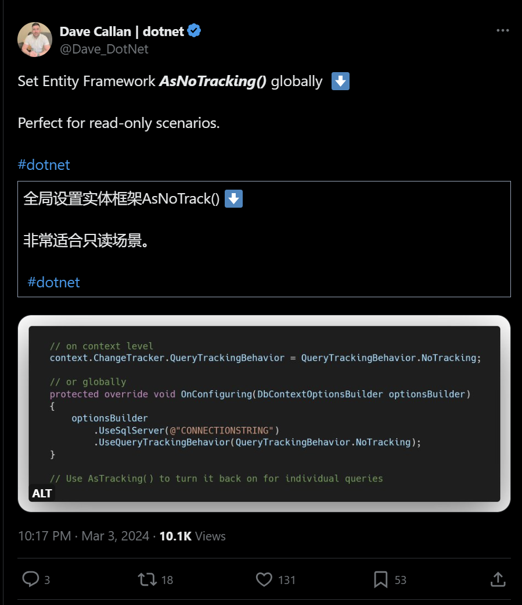

## 国内文章
### 推荐10款C#开源好用的Windows软件

https://www.cnblogs.com/Can-daydayup/p/18035760

DevToys、Microsoft PowerToys、1Remote、ScreenToGif、GeekDesk、QuickLook、Optimizer、ToastFish、WinMemoryCleaner、Files是十款基于Windows的实用工具，功能涵盖代码格式化、系统优化、文件管理等方面，旨在提高开发者工作效率。其中部分项目采用.NET开发，有的提供源码。这些项目和框架已被收录到C#/.NET/.NET Core优秀项目和框架精选中，DotNetGuide技术社区提供了一个.NET开发者交流平台。

### 万字长文学会对接 AI 模型：Semantic Kernel 和 Kernel Memory，工良出品，超简单的教程

https://www.cnblogs.com/whuanle/p/18045341

本文是一个简单入门教程，指导读者如何对接人工智能模型Semantic Kernel和Kernel Memory，无需深入学习AI底层知识即可开发聊天工具和知识库工具。文章详细介绍了配置环境、部署one-api、配置项目环境的步骤，并提供了示例代码和应用场景。作者认为，重要的是能够创建实用的产品，而非深究底层技术细节。

### 使用ConfuserEx代码混淆工具保护你的.NET应用程序

https://www.cnblogs.com/Can-daydayup/p/18042386

.NET应用防止反编译的问题值得关注，可使用ConfuserEx这个.NET代码混淆工具。ConfuserEx支持.NET Framework的多个版本，但不支持.NET Core。它包含多种混淆技术如控制流混淆和字符串、资源加密，并且支持灵活配置。混淆工具对.NET Fx的.dll和.exe文件都适用，具体的使用方法包括添加文件、设置混淆规则并进行混淆。文章还介绍了DotNetGuide技术社区，这是一个提供C#/.NET/.NET Core学习资料、技术分享的平台。

### 可用于智能客服的完全开源免费商用的知识库项目

https://www.cnblogs.com/hejiale010426/p/18042409

FastWiki项目是一个利用当前先进技术搭建的高性能知识库系统，支持大规模信息检索和智能搜索。技术体系基于.NET 8和MasaBlazor前端框架，后端结合了MasaFramework和Semantic Kernel实现高效、强大的搜索能力。项目的核心特征包括智能搜索、高性能、现代化前端界面、稳定可靠的后端以及开源社区驱动。文档上传功能暂时支持md或txt格式，提供模板引导文档撰写，并介绍了MasaBlazor的优势。FastWiki还提供了详细的界面截图，展示了从文档上传到知识库创建和数据处理的整个流程。项目遵循Apache-2.0许可，支持商业应用，并通过Github和Gitee开放源代码。

### .NET开源功能强大的串口调试工具

https://www.cnblogs.com/Can-daydayup/p/18050045

大姚分享了一款.NET开源串口调试工具LLCOM，具备Lua自动化、TCP/UDP/SSL测试等多种功能。这款工具界面直观，能够自动保存日志和重连串口，支持多种编码格式和乱码恢复，并集成了TCP、UDP、SSL的测试服务端/客户端功能，同时能监听其他软件的串口通信数据。工具的源代码可在GitHub获取，且已被收录在C#/.NET/.NET Core优秀项目和框架精选中。

### Advanced .Net Debugging 2：CLR基础

https://www.cnblogs.com/PatrickLiu/p/18025026

这篇文章是《Advanced .Net Debugging》系列的第二篇，旨在指导.NET程序的有效调试。作者强调了理解.NET运行时、垃圾收集器、互用性和同步机制的重要性。提及的测试环境包括Windows 10、Windbg Preview、Visual Studio 2022和.NET 8.0。文中展示了两个调试源码的例子，还讨论了.NET сост成和ECMA标准的重要性。

### WPF性能优化：性能分析工具

https://www.cnblogs.com/czwy/p/18041898

本文讲述了在软件性能优化中，开发人员需要关注不同程序的具体性能指标，重点介绍了两种WPF性能优化工具——内存使用率和应用程序时间线。内存使用率工具帮助发现内存泄漏及其它内存效率问题，应用程序时间线则用于发现XAML应用程序的UI性能问题。文章详细说明了如何使用这些工具进行性能数据的收集、分析和解读，且提供了多种场景下的性能瓶颈分析实例。

### ASP.NET Core MVC应用模型的构建[3]: Controller的收集

https://www.cnblogs.com/artech/p/18031075/mvc_app_model_3

本文介绍了MVC应用中的ControllerModel构建过程和它的主要组成部分。ControllerModel描述Controller类型，包含多个属性如Actions, ControllerProperties, Selectors等，用来描述控制器的行为、属性和路由选择等元素。ControllerModel实现了几个接口提供额外功能，如IFilterModel提供过滤器信息，IApiExplorerModel提供API浏览信息。文章还具体解释了使用DefaultApplicationModelProvider如何设置ControllerModel的属性，并展示了用于生成路由参数的IRouteValueProvider接口和AreaAttribute特性的使用。最后，通过一个简单的实例说明了如何构建Controller模型的元数据。

### 细聊ASP.NET Core WebAPI格式化程序

https://www.cnblogs.com/wucy/p/18025196/aspnetcore_webapi_formatter

本文阐述了如何在ASP.NET Core WebApi中自定义YAML格式的转换器以及格式化器的工作原理。ASP.NET Core默认支持JSON的输入输出处理，但文章以实现自定义YAML格式处理为例来说明。通过YamlDotNet组件实现了YamlInputFormatter类，处理HTTP请求体中的YAML格式数据，并通过MvcOptions配置使其生效。文中提供了完整的YamlInputFormatter实现代码和如何插入框架的方式。

### 构建SatelliteRpc：基于Kestrel的RPC框架（整体设计篇）

https://www.cnblogs.com/InCerry/p/18033494/satelliterpc-1

针对.NET性能优化群内高性能网络框架的讨论，作者推广了一个基于.NET Core的高性能网络框架Kestrel，并计划连载介绍其使用方法。Kestrel不仅适用于ASP.NET Core，同时适用于创建其他类型的服务器。文章中提及九哥已发表详细文章介绍如何利用Kestrel创建网络服务，作者则聚焦于RPC框架的实现。作者提供了RPC框架SatelliteRpc的Github开源链接，但提醒仅作为学习使用。文中还包括了框架的编译环境、目录结构，并展示了框架的客户端服务示例。

### [超实用插件]在Visual Studio中查看EF Core查询计划

https://www.cnblogs.com/Can-daydayup/p/18033187

EFCore.Visualizer是一个支持在Visual Studio中查看EF Core查询计划的工具，有利于开发者分析和优化数据库查询性能。工具目前仅支持SQL Server和PostgreSQL数据库，并要求Visual Studio版本在17.9.0以上且EF Core版本为7或更新。EFCore.Visualizer可以通过VS插件市场进行安装，并只能用于检查IQueryable变量的查询计划。本项目代码开源，已收录到C#/.NET/.NET Core优秀项目和框架精选中，同时作者还维护一个技术社区，供.NET开发者交流和学习。

### ASP.NET Core MVC应用模型的构建[4]: Action的选择

https://www.cnblogs.com/artech/p/18031074/mvc_app_model_4

ControllerModel中的Actions属性包含表述有效Action方法的ActionModel对象集合。有效的Action方法需要是公共的、非抽象、非泛型、非静态方法，并且不能是从Object类型继承的方法和IDisposable接口的Dispose实现。ActionModel实现了多个接口，其中包括ICommonModel、IFilterModel、IApiExplorerModel等，还定义了多个跟Action方法相关的属性，例如Filters、ApiExplorer、Parameters、Selectors、Attributes等，用于记录过滤器、API探索信息、参数、选择器和标注在Action方法上的特性。通过示例说明了DefaultApplicationModelProvider对ActionModel构建规则的应用。

### ASP.NET Core MVC应用模型的构建[2]: 定制应用模型

https://www.cnblogs.com/artech/p/18031077/mvc_app_model_2

本文系统地介绍了描述MVC应用模型的ApplicationModel类型及其相关的模型节点类型，如ControllerModel、ActionModel和ParameterModel。文章着重阐述了DefaultApplicationModelProvider如何提取和设置元数据，并深入探讨了几个重要的接口，包括IPropertyModel、ICommonModel、IFilterModel和IApiExplorerModel等，这些接口帮助理解应用模型的层次结构和各个模型节点的作用。此外，还介绍了自定义IApplicationModelProvider和IApplicationModelConvention的方法。

### 骚操作之 持有 ReadOnlySpan 数据

https://www.cnblogs.com/fs7744/p/18043193

`ReadOnlySpan<T>` 是现代高性能操作的基石，虽然它受到一定限制以确保安全性，但本文讨论了如何通过使用指针等手段来在安全限制之外操作 `ReadOnlySpan<T>` 和 `Span<T>`。作者展示了如何在类中创建与 `ReadOnlySpan<T> `结构相似的结构，并将` Span<T>` 转换为 `Memory<T>`，尽管这些方法涉及高风险操作，作者提醒开发者在使用时要谨慎。

### C#程序全局异常处理—WPF和Web API两种模式

https://www.cnblogs.com/huangqian/p/18036541

本文概述了在C#的B/S结构项目中采用的全局异常处理方法。文章首先介绍了针对Web API项目如何通过自定义全局异常过滤器AppExceptionFilterAttribute来集中处理异常，其中包括通过Override的OnException方法来实现。此外还提出了使用SkipFilterAttribute来标记那些不需要经过异常过滤器处理的特定方法。通过这些技术可以帮助开发者更好地管理和记录程序中的未处理异常。

### ASP.NET Core MVC应用模型的构建[1]: 应用的蓝图

https://www.cnblogs.com/artech/p/18031078/mvc_app_model_1

文章讲述ASP.NET Core MVC框架如何将Action方法映射为路由终结点，并通过应用模型来构建Action元数据。应用模型不仅是构建元数据基础，还能自动生成API文档和客户端代码。文章从整体设计、ApplicationModel、IApplicationModelProvider等方面详细介绍了构建应用模型的过程。

### 在Winform界面中使用自定义控件，丰富界面的效果处理

https://www.cnblogs.com/wuhuacong/p/18036358

《SqlSugar开发框架》中提到Winform界面开发可使用自定义用户控件提高界面统一性与便利性，如分页和附件显示控件。文章回顾了Winform中自定义控件的使用，展示了如何创建、添加属性和事件处理，以及动态添加控件到布局中。同时介绍了当用户控件数量过多可能会引起性能问题。为了处理事件通知，可以使用MediatR实现事件总线，允许跨平台的消息传递与处理的解耦。

### .NET高级调试之sos命令输出看不懂怎么办

https://www.cnblogs.com/huangxincheng/p/18034164

这篇文章介绍了.NET开发者如何使用WinDbg进行高级调试，通过具体示例讲解了如何分析线程列表中的lockcount列，以及它是如何与源码的m_dwLockCount字段关联的。文章还展示了相关源代码链接，并通过源码分析和测试代码示例，向读者展示了如何模拟产生高lockcount值的情况。

### Taurus.MVC WebMVC 入门开发教程5：表单提交与数据验证

https://www.cnblogs.com/cyq1162/p/18031058

本文是Taurus.MVC WebMVC教程的第五篇，讲解了在Web开发中如何处理表单提交和数据验证。首先指导创建含表单的视图，接着更新控制器以处理提交的数据，并提出如何进行数据验证的方法论。通过代码示例，展示了接收数据、数据验证及验证成功与失败的不同处理逻辑，并最终通过运行应用程序来确认表单数据已成功被获取。整篇文章是系列教程中的一部分，旨在辅导初学者如何在Taurus.MVC框架下进行WebMVC开发。

### AntSK：打造你的本地AI知识库——离线运行详细教程

https://www.cnblogs.com/xuzeyu/p/18049860

AntSK是一个开源的工具，可以离线运行AI知识库对话和查询。使用LLamaSharp技术，配合本地gguf格式模型，不依赖于网络或OpenAI的API。配置过程简单，支持聊天和语义嵌入两种功能。支持本地导入文档到知识库，提高答案的相关性和准确性。文章最后还提供了交流群信息和GitHub项目地址，鼓励读者参与交流和探讨。

### C# 4.8 实现Windows 定时任务计划（Task Scheduler）

https://www.cnblogs.com/INetIMVC/p/18040041

这篇文章描述了作者如何动态创建Windows定时任务计划，首先定义了一个存储任务配置的类TaskSchedulerConfig，其中包括引用程序路径、任务名称、说明、执行周期、开始时间范围、月和周的执行日期等属性。接着提供了两个方法，用于将数字转换为对应的周一至周日和限定每月执行日期只能在1-28号之间。最后通过Main方法读取配置文件，反序列化为TaskSchedulerConfig对象，进行任务的动态创建。

### .NET 全能 Cron 表达式解析库（支持 Cron 所有特性）

https://www.cnblogs.com/Can-daydayup/p/18048555

TimeCrontab是一个.NET类库，可解析Cron表达式，支持所有Cron特性。具有超高性能、易拓展、小巧无第三方依赖、开源跨平台等优点，并有丰富的单元测试，支持.NET Framework 3.5及以上版本；能通过NuGet包安装。提供了快速入门示例，并有在线Cron表达式生成器。项目已被收录于C#/.NET/.NET Core优秀项目和框架精选，并推荐加入DotNetGuide技术社区交流。

### 使用OpenTelemetry进行监控

https://www.cnblogs.com/azrng/p/18048851

Prometheus、Grafana、Node Exporter和Alertmanager是一组监控和可视化系统性能的开源工具。Prometheus是监控和警报工具，由SoundCloud开发并加入CNCF。Grafana是数据可视化平台，支持多种数据源。Alertmanager处理和管理告警，与Prometheus集成。文章还介绍了在.NetCore项目中如何通过NuGet包集成Prometheus监控，以及如何使用Docker部署监控工具和可视化程序。

### Taurus.MVC WebMVC 入门开发教程2：一个简单的页面呈现

https://www.cnblogs.com/cyq1162/p/18031053

本篇教程介绍了如何使用Taurus.MVC框架创建一个控制器和视图以呈现网页。首先创建一个‘HomeController’类，定义首页、关于和联系方法。然后，在‘Views’文件夹下创建对应的HTML视图。最后，运行应用程序，通过配置'Mvc.DefaultUrl'可以设置默认访问页。本文是教程系列中的一部分，旨在引导读者了解和使用Taurus.MVC框架进行Web开发。

### 在Avalonia项目中使用MediatR和MS.DI库实现事件驱动通信

https://www.cnblogs.com/Dotnet9-com/p/18049805

本文介绍了AvaloniaUI和MediatR框架在.NET中的应用，讲解了MediatR的基本用法和如何在Avalonia项目中结合Microsoft的依赖注入库实现模块间通信。文章详细介绍了配置容器和注册服务的步骤，并且给出了代码示例。

### Taurus.MVC WebMVC 入门开发教程7：部分视图和页面片段（结束篇）

https://www.cnblogs.com/cyq1162/p/18031065

这个系列包括了七篇关于Taurus.MVC框架的WebMVC入门教程，涵盖了从环境配置、页面呈现、数据绑定、列表绑定、表单提交、数据验证，到路由配置、部分视图和页面片段等多个方面。第七篇详细介绍了如何通过使用部分视图和页面片段提高代码复用与可维护性。文中通过具体代码示范了创建和使用部分视图来组织页面结构，例如用于显示页脚的foot.html，以及高级用法如统一定义页面head部分的myhead.html。

### 以解析csv数据为例，讨论string、char[]、stream 不同类型来源是否能进行高性能读取解析封装可能性

https://www.cnblogs.com/fs7744/p/18038661

文章主要介绍了对不同类型数据进行高性能统一抽象的方法，通过对1万行CSV数据的性能测试，证明了使用string类型进行RFC4180标准解析的性能高于StringReader和CsvHelper。性能基石是使用`ReadOnlySpan<T>`优化内存管理和字符比较。文中还讨论了数据类型多样性和类型归类，暗示通过高复杂度抽象能兼容各种数据类型。

### 项目需要实现国际化？不妨来试试它

https://www.cnblogs.com/fanshaoO/p/18044824

LinguaNex是一个使用Blazor开发的多语言国际化工具，支持多语言资源的配置、关联、批量导入（JSON文件）、自动翻译（包括百度、有道、腾讯、阿里、AI翻译），以及Json、xml、toml、ts和properties格式的资源文件导出。它要求运行在.NET 8环境，使用Redis和可选的RabbitMQ，数据库采用EF Core SQLLite。LinguaNex支持通过API或SignalR等方式接入，以便进行国际化资源的即时更新和管理，同时提供了.NET、Java、JavaScript的SDK供不同平台的项目接入。

### 【XInput】手柄模拟鼠标运作之 .NET P/Invoke 和 UWP-API 方案

https://www.cnblogs.com/tcjiaan/p/18048489

老周在.NET中使用XInput API模拟鼠标和键盘操作。文章介绍了在64位系统上正确导入INPUT结构的关键步骤:要设置正确的字节偏移。他定义了一系列枚举用于鼠标和键盘事件，解释了将StructLayoutAttribute的LayoutKind设置为Explicit的重要性，并展示了如何导入SendInput函数和XInput函数。

### 如何在C#中解析Excel公式

https://www.cnblogs.com/powertoolsteam/p/18025530

葡萄城公司的GcExcel是一个服务端高性能表格组件，能够解析Excel中的公式并进行修改。它适用于当Excel公式无法满足大数据量或复杂场景需求时，通过编程的方式完成数据计算和分析。该组件支持动态数组公式，通过C#（.NET Core）项目创建工作簿，提取和解析公式，进而修改公式中的特定参数，如替换销售代表姓名。步骤包括使用NuGet安装GcExcel，初始化数据，以及通过公式解析器和语法树打印出公式结构。

### 记一次WPF集成SemanticKernel+OneAPI+讯飞星火认知大模型实践

https://www.cnblogs.com/mingupupu/p/18040008

OneAPI是一个开源的接口管理与分发系统，能够支持包括Azure、Anthropic Claude、Google PaLM 2 & Gemini等在内的多款大型语言模型，并提供Docker镜像进行一键部署。用户可以基于SQLite或MySQL数据库进行部署，设定端口与时间区后，可在本地3000端口登录并配置使用。OneAPI允许用户添加自己的大模型密钥和令牌，通过Postman等工具可以测试服务的可用性。此外，文章还介绍了如何创建一个基于Semantic Kernel的WPF项目，该SDK支持将现有代码与大型语言模型结合，用户需创建一个类来修改请求地址，以实现与星火大模型的对话。

### C#的托盘窗体显示与隐藏效果 - 开源研究系列文章

https://www.cnblogs.com/lzhdim/p/18048174

博主分享了关于C# Winform窗体显示与隐藏效果的编码经验，并提供了源码下载链接。文章内容包括项目目录介绍，代码功能说明（包括窗体覆盖判断与显示判断），运行界面演示，使用方法（包含FormHelper类的使用），以及源码下载地址。博主也鼓励读者下载代码亲自体验并提出改进建议。

### Taurus.MVC WebMVC 入门开发教程6：路由配置与路由映射

https://www.cnblogs.com/cyq1162/p/18031062

本文是Taurus.MVC WebMVC系列教程的第六篇，主要讲解如何在Taurus.MVC WebMVC中配置和映射路由。文章首先解释了路由及其在WebMVC中的作用，然后通过示例代码详细展示了如何使用特性配置方法来自定义控制器和操作方法的路由映射，并提到可以在需要时动态改变路由。此外，文章也提到了运行应用程序、测试路由映射效果的步骤，最后附上了教程的系列目录大纲。

### 【Azure APIM】验证APIM删除后的恢复步骤

https://www.cnblogs.com/lulight/p/18045084

如果在Azure门户中不小心删除了API Management资源，可以通过Azure门户的"一键恢复"功能或使用API恢复在48小时内被删除的资源。恢复步骤包括：使用API列出被删除的API Management实例信息、调用恢复接口并等待大约45分钟至1小时。软删除期间无法重建相同名称的服务，并且在48小时后若未恢复系统会自动永久删除资源。

### Taurus.MVC WebMVC 入门开发教程4：数据列表绑定List&lt;Model&gt;

https://www.cnblogs.com/cyq1162/p/18031057

本教程介绍了如何在 Taurus.MVC WebMVC 框架中实现数据列表的绑定。具体步骤包括：更新 Model 类以包含多个数据项的列表，更新控制器以支持向视图传递 User 对象的列表，以及更新视图以显示每个 User 对象的信息。文章还讲解了如何实现循环嵌套，以显示复杂的分类和子项数据，并提供了在框架后台管理中具体实现嵌套循环的示例。

### 【Openxml】如何为OpenXml元素创建超链接

https://www.cnblogs.com/ryzen/p/18047555

OpenXml超链接功能主要有跳转页面（如跳转到PPT的指定页面）、打开文件（包括本地文件及Office支持的文档）和打开网页三种类型。示例中演示了如何为PPT添加超链接，包括设置跳转到指定页面的超链接、打开下一页的超链接、打开本地文件的超链接以及设置打开网页链接的超链接，并提供了详细的C#代码实现。

### Taurus.MVC WebMVC 入门开发教程3：数据绑定Model

https://www.cnblogs.com/cyq1162/p/18031054

本文是Taurus.MVC WebMVC入门开发教程的第三篇，讲解了如何进行数据绑定。内容包含创建模型类User.cs，更新HomeController以支持数据绑定，并在视图Index.html中使用${属性名称}CMS语法将页面元素与模型属性绑定。还提到了另一种不使用Model的数据绑定方法，即使用View.KeyValue.Add(key,value)。最后通过运行应用查看数据绑定效果。

### C#的系统菜单添加自定义项 - 开源研究系列文章

https://www.cnblogs.com/lzhdim/p/18047745

这篇文章介绍了如何在C#应用程序系统菜单中添加自定义项的方法，并提供了示例代码和运行效果截图。作者提供了完整的源码下载链接，并建议读者根据需求自行修改代码。文章还提到，如果窗体有隐藏操作，显示窗体时需要重新调用代码添加菜单项。

### Avalonia 跨平台框架中如何以正确的姿势使用 OpenGL ES 渲染。

https://www.cnblogs.com/xymfblogs/p/18044363

本文记录了作者在Avalonia框架中使用OpenGL ES的经历。ANGLE项目让OpenGL ES应用能够转换至不同的图形API上，而Avalonia则利用SkiaSharp和ANGLE来实现OpenGL ES支持，实现跨平台UI开发。文章提供了在Avalonia中集成OpenGL ES的示例代码，并指出需要注意OpenGL ES上下文的创建和线程问题，以及支持的扩展功能。

## 主题

### 版本 1.5 - Windows 应用程序 SDK 的稳定通道发行说明 - Windows 应用程序
https://learn.microsoft.com/en-us/windows/apps/windows-app-sdk/stable-channel#version-15

Windows App SDK 1.5 已发布。

此版本包括对 XAML Island 中关闭行为的更改、添加基于 WebView2 和 Azure Map 的地图控件、添加 SelectorBar 控件、对 CommandBarFlyout 中的主要命令标签的支持、对 WebView2 中的自定义环境/选项的支持，以及...包括改进，例如与 NET 8 的兼容性。

- [发布 v1.5.0·microsoft/WindowsAppSDK](https://github.com/microsoft/WindowsAppSDK/releases/tag/v1.5.0)

### 版本 1.4.5 - Windows 应用程序 SDK 稳定通道发行说明 - Windows 应用程序
https://learn.microsoft.com/ja-jp/windows/apps/windows-app-sdk/stable-channel#version-145-14240211001

Windows App SDK 1.4.5 已发布。

此版本修复了多个错误，例如挂起和崩溃。

### 2.7.27 版 · StackExchange/StackExchange.Redis
https://github.com/StackExchange/StackExchange.Redis/releases/tag/2.7.27

StackExchange.Redis 2.7.23、2.7.27 已发布。

此版本添加了向连接库名称添加后缀的功能，以及即使在空闲时也可以执行保活检查的选项。

- [发布 2.7.23 · StackExchange/StackExchange.Redis](https://github.com/StackExchange/StackExchange.Redis/releases/tag/2.7.23)

### NCrunch 博客 | NCrunch V5 现已推出
https://blog.ncrunch.net/post/NCrunch-V5-Now-Available.aspx

NCrunch V5 已发布。

此版本引入了对 JetBrains Rider 和运行时数据检查 (RDI) 功能的支持。

运行时数据检查是一项功能，允许您在测试执行期间捕获各种数据并根据该数据分析代码行为。

- [NCrunch 博客 | 运行时数据检查简介](https://blog.ncrunch.net/post/Introducing-Runtime-Data-Inspection.aspx)

## 文章、幻灯片等
### Visual Studio Enterprise 中的代码覆盖率功能 - Visual Studio 博客
https://devblogs.microsoft.com/visualstudio/code-coverage-features-in-visual-studio-enterprise/

引入 Visual Studio Enterprise 代码覆盖率功能的新功能和性能改进。

### 使用 Entity Framework Core 进行逻辑删除 - Qiita
https://qiita.com/filunK/items/8485c8fcc38fae5d2b40

如何使用 Entity Framework Core 中的拦截器从数据库中的表实现逻辑删除（删除标志）。

### C#中获取字符串表达式的计算结果 - Qiita
https://qiita.com/hyukix/items/ac26decee3bb75b32f75

将库与从给定字符串表达式获取计算结果的函数在行为和性能方面进行比较。

### Rider 2024.1 EAP 7：C# 更新、新产品图标、捆绑的 Kubernetes 插件 | .NET 工具博客
https://blog.jetbrains.com/dotnet/2024/03/01/rider-2024-1-eap-7/

Rider 2024.1 EAP 7 已发布。

此版本包括改进的 C# 12 支持、新图标和 Kubernetes 插件捆绑等更改。

### Rider 2024.1 EAP 6：更新了新项目对话框、自定义命名规则和 VCS 改进 | .NET 工具博客
https://blog.jetbrains.com/dotnet/2024/02/27/rider-2024-1-eap-6/

Rider 2024.1 EAP 6 已发布。

此版本包括新的项目对话框更新、Blazor WASM 的热重载调试、改进的 C# 支持、性能改进、对内存分析的冻结对象堆支持等等。

### ReSharper 2024.1 EAP 6：迄今为止功能最丰富的更新 | .NET 工具博客
https://blog.jetbrains.com/dotnet/2024/02/27/resharper-2024-1-eap-6/

ReSharper 2024.1 EAP 6 已发布。

此版本包括更快的重命名、改进了 C# 异步方法中一次性资源的处理、代码格式化和反编译器改进、对 dotMemory 内存分析中的冻结对象堆的支持等等。### 将 Google 的 Magika 从 Python 移植到 C# 的过程（第 1 / 7 天）- Qiita
https://qiita.com/mkht/items/64b02b8648266d40380a

一个关于尝试将 Google 基于机器学习的文件类型确定工具 Magika 从 Python 移植到 C# 的故事。我们目前正在执行一系列移植，包括使其成为加载和执行模型的命令行工具。

### params collection
https://ufcpp.net/blog/2024/3/params-collections/

关于 params 集合，它允许您为 params 指定除数组之外的任何内容，C# 13 正在考虑这一点。

### 如何使用 iOS 框架构建 NuGet 包以进行 .NET MAUI 开发
https://www.dynamsoft.com/codepool/ios-ipados-dotnet-maui-mrz-recognition.html

创建包含 iOS Framework for .NET MAUI 的 NuGet 包的说明。

### 使用 Stride 创建和共享组件 - Qiita
https://qiita.com/skitoy4321/items/ba6fdfedf03d444cac40

如何使用Stride（游戏引擎）创建组件，以及使用NuGet包时需要注意的事项。

### 将 Unix 域套接字与 ASP.NET Core 和 HttpClient 结合使用
https://andrewlock.net/using-unix-domain-sockets-with-aspnetcore-and-httpclient/

如何通过 UNIX 域套接字与 ASP.NET Core 服务器和 HttpClient 进行通信。

### Visual Studio 全年回顾 (2023) - Visual Studio 博客
https://devblogs.microsoft.com/visualstudio/visual-studios-full-year-in-review-2023/

Visual Studio 2023 年回顾的摘要文章。

### 快速且流畅：Blazor 故事 - .NET 博客
https://devblogs.microsoft.com/dotnet/the-fast-and-the- Fluent-a-blazor-story/

Fluent UI Blazor 库简介。

它涉及基础 FAST（Web 组件）、其协作以及 Aspire 仪表板中使用的其他内容。

### 使用 ASP.NET Core 的 Shoelace Web 组件
https://khalidabuhakmeh.com/shoelace-web-components-with-aspnet-core

将 Shoelace Web 组件与 ASP.NET Core 的 Razor Pages 结合使用的说明。

### .NET 性能优化：延迟分配
https://petabridge.com/blog/net-performance-deferred-allocation/

解释通过充分利用 Phobos 中的延迟分配来测量 Akka.NET 来抑制性能下降的方法。

### .NET MAUI 社区工具包 2023 年亮点 - .NET 博客
https://devblogs.microsoft.com/dotnet/dotnet-maui-community-toolkit-2023-highlights/

回顾 .NET MAUI 社区工具包的 2023 年更新和活动。

### 32 位 .NET Framework 项目的 WinForms 设计器选择 - Visual Studio 博客
https://devblogs.microsoft.com/visualstudio/winforms-designer-selection-for-32-bit-net-framework-projects/

关于 Visual Studio 2022 v17.9 中引入的 .NET Framework 中 Windows 窗体的进程外设计器（预览版）。

本文讨论了进程外设计器的局限性以及加载不兼容项目时进行切换的路线图。

### ASP.NET Core 的 Docker Init 与 VS 或 VS Code 扩展的比较
http://thedatafarm.com/docker/docker-init-for-asp-net-core-compared-to-vs-or-vs-code-extensions/

Docker 内置“docker init”生成的 ASP.NET Core 项目与 Visual Studio 或 .NET SDK 生成的项目有何不同。

本文比较了 .dockerignore、Dockerfile 和 docker-compose.yml 之间的差异。

### 我想在 .NET 8 的 ASP.NET Core Blazor 中抑制双击
https://zenn.dev/microsoft/articles/blazor-dotnet8-do-not-double-click

如何在.NET 8的ASP.NET Core Blazor中抑制双击按钮等。

文章还提到了使用表单的实现。

### 将 Polly v8 与 HttpClientFactory 结合使用

https://truestorydavestorey.medium.com/using-polly-v8-with-httpclientfactory-3f9a64359990

如何将 Polly v8 与 HttpClientFactory 结合使用。

本文还解释了从 v7 迁移到 v8 所需的更改。

### neue cc - R3 - C# 响应式扩展的新现代重新实现
https://neue.cc/2024/02/27_R3.html

R3 的解释，一个基于现代视角重新设计/重新实现 Reactive Extensions 的库。

本文解释了重建 R3 背后的设计理念以及它的现代感。

### 使用 AWS Lambda 从 .NET 6 迁移到 .NET 8 时我做了什么 - Qiita
https://qiita.com/kaz-matsubara/items/259de11eb3f30f9bda1f

关于将在 .NET 6 中实施的 AWS Lambda 项目迁移到 .NET 8。

### [WPF] 只能输入数值的文本框
https://zenn.dev/nuits_jp/articles/2024-02-25-numeric-text-box

如何在WPF中实现一个只允许输入数值的TextBox。

### Akka.NET Actors 中的  Async / Await 与 PipeTo>T>
https://petabridge.com/blog/async-await-vs-pipeto/

Akka.NET Actor 中 async/await 和 PipeTo 在行为和性能方面的比较。

## 库、存储库、工具等。
### GummyCat - 可视化 .NET 垃圾收集器的活动
https://minidump.net/gummycat/

一个显示.NET堆的内存布局并可视化GC操作的工具。

### 使用 dotnet-gcstats 查看您的 GC 统计信息！
https://chnasarre.medium.com/view-your-gcs-statistics-live-with-dotnet-gcstats-e670ce949bd9

用于查看 GC 统计信息的命令行工具。

## 网站、文档等
### 推文

关于锁定类型支持作为 C# 13 预览功能合并到 Visual Studio 17.10 Preview 2 中的故事。

https://x.com/jcouv/status/1764710194381283497?s=12&t=ggvrrZ7oLogHyNoIGNgjbw

---

如何为只读连接指定“AsNoTracking”。
https://x.com/dave_dotnet/status/1764294153851060696?s=12

---

一个关于能够在 Visual Studio 中基于每个解决方案覆盖设置的故事。
https://x.com/mkristensen/status/1763258040890134701?s=12

Visual Studio 编辑器中的斜体支持。
https://x.com/mkristensen/status/1761140571970863541?s=12

## 版权声明

* 国内板块由 InCerry 进行整理 : https://github.com/InCerryGit/WeekRef.NET
* 其余内容来自 Myuki WeekRef，由InCerry翻译（已获得授权） : https://github.com/mayuki/WeekRef.NET

**由于笔者没有那么多时间对国内的一些文章进行整理，欢迎大家为《.NET周刊-国内文章》板块进行贡献，需要推广自己的文章或者框架、开源项目可以下方的项目地址提交Issue或者在我的微信公众号私信。**

格式如下：

* 10~50字左右的标题
* 对应文章或项目网址访问链接
* 200字以内的简介，如果太长会影响阅读体验

https://github.com/InCerryGit/.NET-Weekly

## .NET性能优化交流群

相信大家在开发中经常会遇到一些性能问题，苦于没有有效的工具去发现性能瓶颈，或者是发现瓶颈以后不知道该如何优化。之前一直有读者朋友询问有没有技术交流群，但是由于各种原因一直都没创建，现在很高兴的在这里宣布，我创建了一个专门交流.NET性能优化经验的群组，主题包括但不限于：

* 如何找到.NET性能瓶颈，如使用APM、dotnet tools等工具
* .NET框架底层原理的实现，如垃圾回收器、JIT等等
* 如何编写高性能的.NET代码，哪些地方存在性能陷阱

希望能有更多志同道合朋友加入，分享一些工作中遇到的.NET性能问题和宝贵的性能分析优化经验。**目前一群已满，现在开放二群。**

如果提示已经达到200人，可以加我微信，我拉你进群: **ls1075**

另外也创建了**QQ群**，群号: 687779078，欢迎大家加入。 

