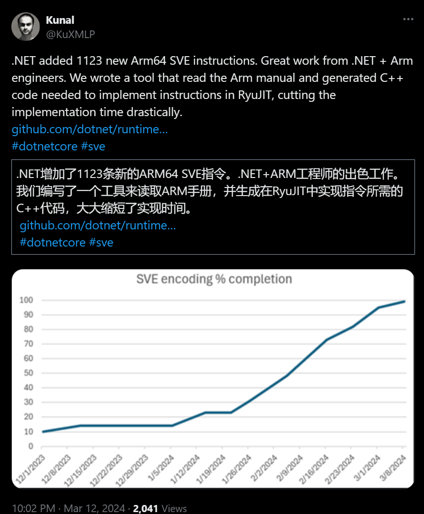

## 国内文章
### 开源.NET8.0小项目伪微服务框架（分布式、EFCore、Redis、RabbitMQ、Mysql等）

https://www.cnblogs.com/aehyok/p/18058032

作者介绍了一个简化版微服务框架，为了简单化省略了一些复杂功能。项目旨在建立一个可复用的基础服务库，减少重复工作。作者承认架构和思考上有不足，项目还在开发初期，欢迎建议。文章涵盖了框架结构、实现的业务功能、依赖注入和控制反转的方法与建议，并介绍了项目中双token登录及其代码实现。

### 在winform中如何嵌入第三方软件窗体✨

https://www.cnblogs.com/mingupupu/p/18058334

文章围绕Win32 API的SetParent、FindWindow和ShowWindow函数的用法进行讲解，分别介绍了函数的定义、参数意义与使用场景。文章还讨论了Windows系统中句柄的概念，以及如何通过句柄管理资源。最后，示范了如何创建一个静态类WindowManager来封装相关的API调用，提升操作的便利性。

### AI应用开发之路-准备：发起一个开源小项目 DashScope SDK for .NET

https://www.cnblogs.com/cmt/p/18052469

今年计划基于Semantic Kernel + DashScope + Qwen开发面向开发者的AI应用。目前正在准备阶段，并分享了开始遇到的问题。由于缺乏官方的DashScope的.NET SDK，决定自己开发并发起了一个开源小项目。已完成初步版本的DashScope SDK for .NET，并发布于GitHub，期待社区贡献。

### .NET开源快速、强大、免费的电子表格组件

https://www.cnblogs.com/Can-daydayup/p/18074298

今天介绍的是ReoGrid，这是一个基于.NET的开源、快速、强大且免费的电子表格组件，可用于开发WinForm、WPF和Android平台的应用程序。具有数据格式、冻结模式、大纲、公式计算功能，并支持图表以及脚本执行等功能。它兼容Excel 2007 (.xlsx) 格式，提供了灵活的API和事件模型供开发者进行功能定制和扩展，遵循MIT许可证。ReoGrid的源码和更多功能特性可以在其GitHub页面查看，同时还被包含在C#/.NET/.NET Core优秀项目和框架精选列表中。

### AI应用开发之路-准备：发起第2个开源小项目 SemanticKernel.DashScope

https://www.cnblogs.com/cmt/p/18069360

上周发布的DashScope SDK for .NET的衍生项目SemanticKernel.DashScope已经开源，专注于Semantic Kernel大型模型应用开发，支持.NET等多个平台。该项目已经支持function calling功能，同时，阿里云DashScope开始收费。项目仓库包含了两个子项目：Cnblogs.SemanticKernel.Connectors.DashScope和Cnblogs.KernelMemory.AI.DashScope。前者实现了三个接口，后者提供了内存数据库功能，都可以通过nuget安装。示例代码演示了如何与阿里云大模型进行对话和内容抓取、数据处理等。

### C# 操作国产数据库【 人大金仓 】之四大模式

https://www.cnblogs.com/sunkaixuan/p/18055087

人大金仓是国产领先的数据库之一，兼容多种数据库模式如Oracle、PgSql、MySql和SqlServer，方便迁移。SqlSugar和人大金仓合作深入，不仅支持CRUD操作，还涵盖存储过程、Schema等特性。人大金仓R3与R6版本在安装和配置上各有侧重，并且通过SqlSugar可实现数据表操作。但存在一些问题，比如不支持Date类型只支持DateTime，以及两种表模式（规茨表与驼峰表）的使用上有所不同。

### C#版开源免费的Bouncy Castle密码库

https://www.cnblogs.com/Can-daydayup/p/18069116

BouncyCastle是一个由澳大利亚慈善组织开发的C#版开源、免费密码学库，可用于加強数据安全性和保护隐私信息。它提供多种密码算法和协议的实现，如对称加密、非对称加密、哈希函数、数字签名等。本文介绍了如何创建控制台应用，安装BouncyCastle包，并提供了AES、DES、RC4加密解密及哈希算法的使用示例。

### 使用ScottPlot库在.NET WinForms中快速实现大型数据集的交互式显示

https://www.cnblogs.com/Can-daydayup/p/18067442

本文教学了如何在.NET WinForms环境下利用ScottPlot类库快速实现大型数据集的交互式展示，包括折线图、柱状图、饼图和散点图等图表。ScottPlot是一个免费开源的.NET绘图库，支持跨平台使用。文中详细展示了创建WinForms项目、安装ScottPlot.WinForms包，以及各类型图表的实现过程和最终效果。

### 从0开始入门智能知识库和星火大模型，打造AI客服。

https://www.cnblogs.com/hejiale010426/p/18054498

FastWiki是一个开源的高性能知识库系统，使用了Semantic Kernel、MasaFramework和MasaBlazor技术，支持智能搜索和大规模信息检索。FastWiki提供容易部署的docker-compose文件，内置了PostgreSQL和向量插件。One-Api是一个将国内AI接口转换为openai接口格式的服务，用户通过简单的docker-compose配置和环境变量设置就能部署。同时需要向讯飞开放平台申请Token进行测试。

### C#实现图片对比-支持图片旋转

https://www.cnblogs.com/kiba/p/18053616

尽管作者已经转为使用JAVA，但他推荐了一个叫做masuit的优秀开源项目，该项目不仅简便，还提供了图像特殊操作功能。通过masuit可以简单地实现图片之间的对比，例如翻转和旋转图片。文章展示了添加masuit引用和使用C#代码实现图像对比的过程，其中涉及到的图像处理是通过Masuit.Tools.Media和SixLabors.ImageSharp库进行的。作者还测试了图片比较的效率，发现速度可以在1秒以内。文章是原创内容，未经授权禁止转载。

### WPF开源的一款免费、开箱即用的翻译、OCR工具

https://www.cnblogs.com/Can-daydayup/p/18062151

大姚分享了一款基于WPF的开源且免费使用的翻译和OCR工具STranslate，该工具支持自定义全局快捷键和内置的快捷键操作，能够进行文本翻译和离线文字识别。STranslate的项目源码可在GitHub或Gitee上下载，该项目也被收录在C#/.NET/.NET Core优秀项目和框架精选中。此外，还介绍了DotNetGuide技术社区，这是一个面向.NET开发者提供资源和交流的开源社区。

### 排查 dotNET Core 程序内存暴涨的问题

https://www.cnblogs.com/myzony/p/18061108/troubleshooting-memory-surge-issues-in-dotnet-core-applications

新版本上线后出现内存和流量激增，通过在 Pod 容器内安装 SDK 和 Dump 工具后，因权限问题无法获取 Dump 文件。修改 Rollouts/Deployment 的 YAML 文件，增加 securityContext 后成功获取 Dump 文件。分析 Dump 文件可使用多种工具，包括 dotnet-dump、Visual Studio 等。EEHeap -gc 命令用于查看 GC 堆的状态，显示了各代开始地址、分配和提交的大小等详细信息。

### .NET开源的两款第三方登录整合库

https://www.cnblogs.com/Can-daydayup/p/18063995

大姚分享了两款.NET开源的第三方登录整合库。其中MrHuo.OAuth支持国内外多个平台，适用于.NET Core和.NET Framework 4.6；CollectiveOAuth支持更多平台，兼容.NET Framework 4.5到4.6.2以及.NetCore 3.1。以上项目被收录于C#/.NET/.NET Core优秀项目和框架精选中，旨在提升开发者了解行业动态和实践效率。DotNetGuide技术社区则面向.NET开发者，提供学习资料、技术分享及问题解答，有助于.NET开发者成长。

### .NET Core使用 CancellationToken 取消API请求

https://www.cnblogs.com/chenyishi/p/18075600

ASP.NET Core允许使用CancellationToken机制来处理在HTTP请求过程中由于用户操作取消请求的场景。通过使用HttpContext.RequestAborted或依赖注入，开发者可以获取CancellationToken，并在长时间运行的任务中使用它来判定何时终止任务，避免无用功。此外，还可以通过异常过滤器统一处理取消操作引发的异常，以改进代码健壮性。

### C#拾遗补漏之goto跳转语句

https://www.cnblogs.com/Can-daydayup/p/18055426

本文介绍了C#中较少使用但功能强大的goto语句，包括其语法、使用方法及优缺点。goto语句可简化复杂逻辑，直接跳出多层循环，但过度使用可能导致代码难以理解、维护困难并潜在引入错误。文章提供了使用和不使用goto的代码示例，以及简述了一个面向.NET开发者的DotNetGuide技术社区。

### 在.NET程序中整合微软的Playwright，使用 Playwright 的最佳实践和技巧

https://www.cnblogs.com/wuhuacong/p/18055896

Playwright是个由微软开发的开源的Web浏览器自动化测试工具，支持多浏览器、多平台并支持多种语言，可以进行功能测试、性能测试等。特点包括用于编写测试脚本、录制回放、数据采集、表单操作、页面截图视频录制以及文件上传下载等，并有详尽的社区支持和文档。编写测试代码时，Playwright提供了模拟浏览器用户交互的API，并附有代码示例演示如何使用。

### .Net接口版本管理与OpenApi

https://www.cnblogs.com/ruipeng/p/18072151

本文针对开发人员如何在使用MinimalApis时添加Api版本控制进行介绍。首先强调了版本控制的重要性，它可以避免新功能的添加造成Api的中断性变更。文中列举了可能引发中断性变更的行为，紧接着介绍了如何使用aspnet-api-versioning包，在MinimalApis中实现版本控制。主要包括如何安装相关的nuget包，以及配置Api版本控制细节，如默认版本设置、版本读取方式、Response Header中版本信息的添加等。接着，给出了四种Api版本控制方式，并建议项目开发中选择一种以便于维护。

### 记一次 .NET某设备监控自动化系统 CPU爆高分析

https://www.cnblogs.com/huangxincheng/p/18056337

一位朋友向博主求助其系统偶发性CPU使用率爆高的问题。博主使用WinDbg工具通过!tp命令确认了CPU使用率达到100%。通过!t命令和线程堆栈分析确认了是垃圾回收（GC）导致CPU使用率高。研究了线程栈后发现一个线程在进行大量的数组（Array）操作，触发了垃圾回收。

### 深入解析ASP.NET Core MVC应用的模块化设计[上篇]

https://www.cnblogs.com/artech/p/18052326/asp-net-core-mvc-moduling

ASP.NET Core MVC的“模块化”设计允许控制器定义在任意模块中，可在运行时动态加载卸载。文章介绍模块化设计思想、重要组件和实现机制，如ApplicationPart与AssemblyPart抽象描述应用组成，ApplicationPartFactory工厂类创建ApplicationPart对象，以及ApplicationPartManager管理应用部分。探究了从程序集中提取有效控制器类型的过程，为下一篇文章介绍如何实现分散定义Controller打下基础。

### 探究WPF中文字模糊的问题：TextOptions的用法

https://www.cnblogs.com/czwy/p/18068823

网友关于WPF文字模糊的问题，通常与像素对齐和抗锯齿有关。WPF使用设备无关单位绘图，转换为物理像素时会产生抗锯齿效果。TextOptions附加属性提供文本显示方式的三个设置选项：TextFormattingMode、TextHintingMode、TextRenderingMode，它们决定文本的布局、渲染算法等。Ideal和Display的TextFormattingMode主要影响格式化文本的度量，而TextRenderingMode控制使用的抗锯齿算法。ClearType技术可在LCD显示器上增强文本清晰度。TextHintingMode设置静态或动态文本的呈现行为，Fixed模式适用于静态质量，Animated模式针对动画。相关信息包含在一些官方博客和文档中。

### 告别繁琐！1分钟带你构建RabbitMQ消息应用

https://www.cnblogs.com/digital-college/p/18075317

本文介绍了如何在.Net环境下使用RabbitMQ消息队列，并提供了简明的使用方法。包括如何发送消息、获取消息和使用消息。需要通过NuGet安装DeveloperSharp.RabbitMQ包，根据.Net Core和.Net Framework环境配置不同的链接信息。文中还提供了一个简单的示例来展示如何发送和处理消息，并且对SendMessage、GetMessage、UseMessage等方法进行了详细的功能说明。

### 世界银行使用.NET 7开发的免费电子问卷制作系统Survey Solution

https://www.cnblogs.com/shanyou/p/18071727

Survey Solution是世界银行数据部开发的开源电子问卷制作系统，具备制作问卷、数据采集、监控等多种功能，并能支持离线使用和在线云服务。系统基于.NET平台，可定制问卷验证算法及通过API扩展功能，如数据质量控制、第三方数据库链接等，并支持地理信息收集。系统包括Headquarter、Designer和Interviewer等组件。学习SS系统需要C#、CSS和阅读英语能力，官方文档、案例和用户讨论平台是学习资源。

### .NET Conf China 2023济南站社区活动

https://www.cnblogs.com/tianqing/p/18063168

2023年3月3日，微软MVP项目、山东财经大学管理科学与工程学院、胶东开发者社区和济南.NET俱乐部共同举办了「.NETConfChina2023JiNanWatchParty：走进山财大—AI驱动下的应用智能化开发」活动。聚焦AI在应用智能化发展中的作用，探索AIGC技术，涵盖结合SemanticKernel实现AI Agent、智能翻译与数据分析、为零售精准营销赋能及.NET在云技术等议题。特邀技术专家和社区领袖，结合高校与社区的产学研讨论并举办课程设计会。此外，抽奖环节特别使用GPT-4大模型，展示AI应用潜力。

### Asp .Net Core 系列：Asp .Net Core 集成 Hangfire+MySQL

https://www.cnblogs.com/vic-tory/p/18071514

Hangfire是一个.NET后台任务调度框架，适合.NET Framework 4.5或以上、.NET Core 1.0或以上平台。提供任务持久化、自动重试、可视化控制台等功能。支持多种任务调度方式，易于集成和扩展。支持多种消息队列如SQL Server、RabbitMQ和Redis。可通过Hangfire.AspNetCore和Hangfire.MySqlStorage两个NuGet包与ASP.NET Core集成，实现使用MySQL作为存储，且支持查看和管理任务的Dashboard。还提供失火处理模式，如Relaxed、Strict、Ignorable等。案例展示了即发即弃、延迟和重复作业的使用方法。

### .NET Aspire Preview 4 发布！

https://www.cnblogs.com/shanyou/p/18074396

.NET Aspire是一个旨在改善.NET云原生应用开发体验的框架，提供服务发现、健康检查等功能，支持快速创建或改造云原生应用。新推出的.NET Aspire Preview 4版增加了Podman支持、界面改进、Entity Framework组件的改进等，提供了更多灵活性和便利性来开发分布式云原生应用程序，并支持与各种Azure资源的对接。

### 深入解析ASP.NET Core MVC的模块化设计[下篇]

https://www.cnblogs.com/artech/p/18052365

ASP.NET Core MVC的模块化设计允许将基本单元Controller定义在任意的模块中，并支持动态加载和卸载。文章详细介绍了多种将Controller分散定义到不同程序集中的实现方法，例如使用ApplicationPartAttribute特性、RelatedAssemblyAttribute特性以及ApplicationPartManager的注册与应用。文章通过详细的解决方案和代码示例，向读者展示了如何实现这些方案，并呈现了实际操作的界面输出结果。

### CYQ.Data 支持 DaMeng 达梦数据库

https://www.cnblogs.com/cyq1162/p/18056471

达梦数据库是中国自研的数据库管理系统，具有高性能、高可靠性、高可扩展性和兼容性强等优点，适用于多种行业。CYQ.Data框架是一个支持.NET版本ORM解决方案，可与多种数据库协作，并简化数据层操作。CYQ.Data框架也开始支持达梦数据库，提供易于引用的Nuget包，并兼顾多版本.NET支持。提供多种数据操作方法，包括无实体和实体操作，且拥有详细文档和教程。达梦数据库以单数据库多模式方式运作，与常规的多数据库实例有所不同。

### WPF --- 触摸屏下的两个问题

https://www.cnblogs.com/pandefu/p/18060368

文章介绍了WPF触摸屏应用中的两个问题：触底反馈导致的界面抖动和某些控件无法通过触摸或鼠标滑轮滚动页面，以及它们的解决方案。触底反馈问题通过附加属性禁用ManipulationBoundaryFeedback事件解决；控件滚动问题则通过手动设置ScrollViewer的位置来解决。

### C# 中使对象序列化/反序列化 Json 支持使用派生类型以及泛型的方式

https://www.cnblogs.com/ablewang/p/18068949

这篇文章主要讨论了在C#中使用System.Text.Json库进行对象的序列化与反序列化时，如何支持派生类型和泛型。作者首先介绍了序列化派生类型时可能遇到的问题，比如类型信息的丢失，并且解释了如何通过[JsonDerivedType]特性来保留类型信息以实现正确的反序列化。然后，作者讨论了对泛型类型进行序列化时遇到的困难和限制，提到System.Text.Json默认不支持泛型的序列化/反序列化，并展示了相关的异常信息。

### 并行化优化KD树算法：使用C#实现高效的最近邻搜索

https://www.cnblogs.com/deali/p/18065105

文章讲述了使用C#基于并行计算优化KD树算法实现高效的最近邻搜索，介绍KD树的数据结构与构建、搜索原理，并探讨了距离计算。实证显示，该优化提升了处理大数据集的速度与效率。还考虑了地球曲率对GPS坐标计算影响，引入Haversine公式改善距离计算。

### dotNet8 全局异常处理

https://www.cnblogs.com/ruipeng/p/18075123

本文介绍了在dotNet平台中处理异常的多种机制，包括MVC的异常筛选器、管道中间件的try catch捕获异常处理以及第三方解决方案例如Hellang.Middleware.ProblemDetails。特别强调了dotNet8引入的IExceptionHandler和UseExceptionHandler异常处理程序的lambda配置，结合dotNet7支持的ProblemDetail，为异常处理提供了标准化方法。同时也示例了如何在WebApi项目中使用Problem Details来描述错误信息，并展示了UseDeveloperExceptionPage中间件在开发环境下的异常处理。

### CYQ.Data 支持 KingbaseES人大金仓数据库

https://www.cnblogs.com/cyq1162/p/18064173

KingbaseES是一个基于PostgreSQL开发的关系型数据库管理系统，具备良好的可靠性、稳定性、兼容性和创新性，适合多种数据管理场景。CYQ.Data是一个高性能的.NET ORM框架，支持包括KingbaseES在内的多种数据库，并通过持续更新强调其长期稳定性。CYQ.Data新增对国产数据库的支持，通过github和nuget提供更新和版本兼容信息，简化了数据层操作。

### LoggerMessageAttribute 高性能的日志记录

https://www.cnblogs.com/chenyishi/p/18073599

.NET 6通过引入LoggerMessageAttribute类，使用源代码生成器技术（source-generators），在编译期间生成高性能的日志记录API。这消除了运行时的装箱、临时分配和数组拷贝，而且与传统日志记录方法相比速度更快。LoggerMessageAttribute需在partial类和方法上使用，且在编译时生成partial方法实现。此外，遵循适当的使用规则，源生成器方法也带来结构化日志保持、参数名称自定义、原始数据传递无需复杂存储等好处。

### 使用C#和MemoryCache组件实现轮流调用APIKey以提高并发能力

https://www.cnblogs.com/deali/p/18063568

本文介绍了使用C#语言和MemoryCache组件来轮流调用多个API Key，从而提高系统的并发能力的方法。作者首先通过设置内存中的 APIKey 调用次数保存机制，再通过自己开发的fluent-console模板快速搭建项目框架，最后实现了APIKey的并发管理功能，并附有详细的示例代码。

### 开源：Taurus.Idempotent 分布式幂等性锁框架，支持 .Net 和 .Net Core 双系列版本

https://www.cnblogs.com/cyq1162/p/18054417

分布式幂等性框架可确保分布式系统中重复操作的结果一致，避免重复操作、保持数据一致性、提高系统可靠性、简化设计与提高安全性。适用于金融支付、电商、消息队列及高并发接口等场景。Taurus.Idempotent 是一个适用于 .net 或 .net core 的分布式幂等性锁框架，支持文件、Redis、MemCache和多种数据库等四种锁类型，提供简单易用的开箱即用体验。

### Asp .Net Web Forms 系列：配置图片防盗链的几种方法

https://www.cnblogs.com/vic-tory/p/18066407

URL Rewrite Module是一个在基于IIS的ASP.NET Web应用程序中用来重写URL的工具，可以将复杂的URL转换成简单的格式，提高用户体验和搜索引擎排名。它允许基于正则表达式等定义重写规则，支持HTTP头和服务器变量，可以进行重定向和发送自定义响应，对性能影响小，并且与IIS紧密集成，易于配置。还介绍了在ASP.NET中使用HttpModule处理HTTP请求和响应，并在请求处理管道中添加自定义逻辑的方法。

### 使用 LogProperties  source generator 丰富日志

https://www.cnblogs.com/chenyishi/p/18078355

Microsoft.Extensions.Telemetry.Abstractions包中新的日志记录source generator能通过[LogProperties]将整体对象作为State记录。展示了使用[LoggerMessage]属性记录日志方法，并展示如何通过[LogProperties]自动丰富日志的方法。还介绍了如何使用[LogPropertyIgnore]属性排除不想记录的属性。原理是使用source generator在vs中生成代码。

### Asp .Net Core 系列：Asp .Net Core 集成 Newtonsoft.Json

https://www.cnblogs.com/vic-tory/p/18055760

Newtonsoft.Json是.NET下用于JSON序列化和反序列化的开源类库，支持丰富的数据操作和序列化属性设置，如自定义转换器、日期时间格式控制、命名策略等。它还提供了序列化特性，如JsonObjectAttribute和JsonConverterAttribute等。Newtonsoft.Json内置LINQ to JSON功能，便于处理JSON对象。此外，还有性能优化技巧。文中也提及了System.Text.Json与Newtonsoft.Json的主要差异。

### [.NET项目实战] Elsa开源工作流组件应用（一）： Elsa工作流简介

https://www.cnblogs.com/jevonsflash/p/18075880

Elsa是一个强大的.NET工作流库，其工作流包含活动和执行逻辑，并可以通过代码或Web设计器定义。它支持长运行和短暂任务、计划任务和事件驱动任务。Elsa提供免费的开源许可及完善的文档。工作流基于活动和工作流定义，其中包含执行任务的实体和它们之间的关系。Elsa也提供了上下文系统支持数据传递、阻断/恢复功能以适应不同任务场景，及设计器来图形化工作流。工作流的定义和实例化是模板和实体的关系，可通过JSON序列化持久化到数据库。

### Dapr v1.13 版本已发布

https://www.cnblogs.com/shanyou/p/18057608

Dapr是一个可帮助开发者在云端和边缘位置更轻松地运行各种应用程序的开源事件驱动运行时。它的1.13版本在2024年3月6日发布，新增了诸如组件热重载、SDK对工作流的支持、HTTP服务器的低指标基数等多个功能，从而改善开发效率与应用性能。此外，它还包括了优雅关机功能和运行时与SDK的标准化错误代码，以及对actor reminder性能的改进，并引入了对Rust SDK的支持。

### Performance Improvements in .NET 8 &amp; 7 &amp; 6 -- String【翻译】

https://www.cnblogs.com/yahle/p/18077215/Performance_Improvements_in_NET_8_String

.NET 8在处理字符串、数组和Span方面有显著提升。新增IUtf8SpanFormattable接口由多种类型实现，优化了UTF8数据格式处理。C# 10和.NET 6的字符串插值也得到了改进，通过TryWrite扩展方法支持高效的格式化。针对UTF16和UTF8进行优化，特别是通过实现Utf8.TryWrite方法节约了UTF8编码的运行时开销，实现了效率与UTF16相同的操作。通过特定的基准测试，用于显著提升性能。

### AntSK 0.2.1 版本揭秘：动态加载dll，驱动Function Call新境界！

https://www.cnblogs.com/xuzeyu/p/18077709

AntSK 0.2.1 是一个插件化开发工具，提供动态加载dll的能力，使得开发者能够便捷地在项目中插入或移除功能。通过遵循AntSK约定的代码格式，使用AssemblyLoadContext来隔离和加载不同的插件，实现了高度的灵活性和扩展性。本文详细介绍了如何实现和利用这些功能。

### .Net Core 你必须知道的source-generators

https://www.cnblogs.com/chenyishi/p/18073694

源生成器是C# 9特性，可在编译时生成代码，无须外部工具，与编译器集成。使用方法包括：创建.NET 6控制台应用，定义partial方法；创建.NET 类库，引入Roslyn包；实现源生成器类生成代码；在控制台应用中引用生成器项目，并手动编辑项目引用；运行应用，源生成器动态实现方法。可以在Visual Studio中查看生成的文件。

### 微服务架构，客户端如何catch服务端的异常？

https://www.cnblogs.com/bossma/p/18056293

在分布式系统中，客户端捕捉服务端异常可通过HTTP Header传递异常信息的方式实现，这使得不同进程甚至不同技术栈之间能够有效交互错误信息。异常信息是数据的一种形式，可以基于各种网络协议和框架传输。服务端在产生异常时，可通过拦截器截获并传递给客户端，客户端再通过HTTP响应的Header读取并转换异常。这种方法适用于多种协议并且性能开销在可接受范围内。实践中，可通过异常拦截器处理不同类型的错误，提高代码健壮性和可维护性。

### WPF线程模型

https://www.cnblogs.com/leolion/p/18075937

WPF采用保留模式渲染系统，包含UI线程和复合线程，负责程序的渲染。立即模式GUI和保留模式GUI是图形API两种类型，WPF属于保留模式。UI线程处理用户交互、布局计算等，而复合线程执行实际渲染工作，高效并行。性能优化的关键在于保持小型化工作项和最大化Dispatcher吞吐量，避免卡顿。大型操作应在后台线程中执行，通过Dispatcher更新UI，以确保程序响应迅速和用户友好。

### 基于 XAF Blazor 的规则引擎编辑器 - 实战篇

https://www.cnblogs.com/haoxj/p/18073710

文章介绍了如何使用RulesEngine进行规则引擎编辑，特别指出RulesEngine的Workflow类及其树状规则体系，强调了只有叶节点规则会被执行的特性和执行模式的配置。同时，提到了Action属性和如何处理规则输出的方法。最后，通过一个Java语言开发的规则引擎项目进行案例对比，并给出了规则预处理的代码示例。

### 【译】32位 .NET Framework 项目的 WinForm 设计器选择

https://www.cnblogs.com/MeteorSeed/p/18056296

Visual Studio 2022转向64位架构为开发体验带来改善，尤其提升了处理大型代码库的性能。但这也给.NET Framework项目带来挑战，特别是32位窗体设计器的兼容性问题。WinForms团队在17.9版本中引入了一个预览特性——对.NET Framework的进程外设计器支持，允许32位过程渲染Form，但仍然存在一些局限。该特性目前处于预览阶段，官方正在收集用户反馈以不断优化。

### .Net Core中使用DiagnosticSource进行日志记录

https://www.cnblogs.com/chenyishi/p/18068309

System.Diagnostics.DiagnosticSource 是一种记录程序日志的工具，能记录包括不可序列化类型在内的复杂数据。它采用订阅发布模式，与 ILogger 不同，ILogger 主要用于记录具体信息。使用 DiagnosticSource 需要添加相关的 NuGet 包，通过注入 DiagnosticSource 并调用其 Write 方法来发出事件。定义监听器时，可使用 Microsoft.Extensions.DiagnosticAdapter 包和 [DiagnosticName] 属性来监听特定事件。最后在 Program.cs 中配置服务并启动监听，以监控事件。

### 多个 .NET Core SDK 版本之间进行切换 global.json

https://www.cnblogs.com/chenyishi/p/18066796

在电脑安装多个版本的.NET Core SDK后，可通过global.json文件设置使用特定版本的SDK。查看已安装版本可用命令dotnet --list-sdks，创建global.json文件可用命令dotnet new globaljson，并通过修改文件中的“version”值或使用命令参数--sdk-version=版本号来指定SDK版本。设定后，执行如dotnet new console命令将应用指定版本的SDK。

### 使用C#创建服务端Web API

https://www.cnblogs.com/powertoolsteam/p/18059215

C# Web API 是建立在 .NET 平台上用于创建 RESTful Web 服务的框架。它支持模块化开发、RESTful 架构、跨平台兼容性、内容协商、安全性控制、易于测试和高扩展性。文章详细介绍了如何在葡萄城公司的活字格平台使用 C# 创建和调用服务端 Web API，包括环境准备、类库引用、编写Web API 的示例等步骤。

### DiagnosticSource DiagnosticListener 无侵入式分布式跟踪

https://www.cnblogs.com/chenyishi/p/18071178

ASP.NET Core框架能发出诊断事件，包括请求、HttpClient通信、EFCore查询等事件。我们可以通过DiagnosticListener选择性监听这些事件，便于实现无侵入式的分布式跟踪。文章介绍了如何创建DiagnosticListener监听EFCore和HttpClient，以及如何注册DiagnosticObserver。还演示了如何新建接口集成EF与HttpClient，通过接口调用查看监听内容，及如何解析事件，并挑选出HTTPClient与EFCore相关的事件进行展示。

### CSharp的lambda表达式匿名类扩展方法

https://www.cnblogs.com/wenlong-4613615/p/18071142

本文介绍了C#中lambda表达式的概念与发展历程。文章首先解释了函数和委托的定义，然后展示了从.NET Framework 1.0至3.0版本中匿名函数书写方式的演变，包括delegate关键字的使用以及lambda表达式的简化。文中还探讨了lambda表达式的本质，即匿名方法，通过ilspy反编译说明其实现细节。文章还讲解了使用匿名类对象存储数据的便捷方式。最后提出C#中object对象派生性及其与dynamic关键字的区别，以及访问匿名对象属性的方式。

### iOS使用Unity容器动态加载3D模型

https://www.cnblogs.com/zhou--fei/p/18057212

APP是一个展示3D数字藏品的平台。为了在不同端上支持3D场景、动画、交互的展示，所选的解决方案是Unity。Unity需要实现的功能包括APP启动时动态下载更新的模型文件和根据参数加载不同模型。模型通过AssetBundle方式打包上传至服务器。用户观看模型时，APP从本地解压目录加载相应3D模型。打包流程包括创建AB打包脚本，设置资源打包选项，使用Unity插件工具AssetBundle Browser进行打包，最后将资源包上传至服务器。APP启动时从服务器下载资源包至本地沙盒，用户查看模型时，通过名字加载本地的ab包。

### SemanticKernel如何基于自有数据聊天

https://www.cnblogs.com/mingupupu/p/18054386

向量数据库是专门处理高维向量数据如图像、音频、文本的系统，主打特性是高效相似度搜索和复杂查询操作。嵌入则指在高维空间中将数据转化为向量的方法，有助于衡量数据间的相似程度。Chroma是一款向量数据库，本文介绍如在Docker中运行Chroma，并通过C#编码创建语义记忆接口ISemanticTextMemory和保存数据到Semantic Memory。文章以保存txt文件信息为例，展示了保存数据的编码流程。

### 那些.NET中的连接池

https://www.cnblogs.com/kyo-lynn/p/18059877

.NET中的连接池有助于提升应用性能。HttpClient实例有自己的连接池，通过配置PooledConnectionLifetime、PooledConnectionIdleTimeout和MaxConnectionsPerServer可以控制行为。数据库连接池广为人知，需选择正确的包且注意每个连接字符串对应一个池子和连接数限制。StackExchange.Redis是连接Redis的首选，但无连接池，可用第三方库如StackExchange.Redis.ConnectionPool。SmtpClient实现了SMTP连接池化，但官方建议用MailKit替代SmtpClient。

### Advanced .Net Debugging 4：基本调试任务（对象检查：内存、值类型、引用类型、数组和异常的转储）

https://www.cnblogs.com/PatrickLiu/p/18052105

本文是《Advanced .Net Debugging》系列的第四篇，主要介绍了.NET 8环境下的一些基础调试任务，包括对象、内存、值类型、引用类型、数组和异常的转储，便于分析问题。文章提供了调试环境的具体信息，并通过ExampleCore_3_1_6示例源码，展示了结构体的定义和数组的操作等调试操作，体现了调试技巧对成为合格程序员的重要性。

### 基于 XAF Blazor 的规则引擎编辑器

https://www.cnblogs.com/haoxj/p/18067776

本项目是一个基于XAFBlazor的规则引擎编辑器，使用微软的开源RulesEngine。它允许开发者更灵活地管理业务规则，提供了创建、编辑规则节点，定义规则关系，实时验证规则以及多种规则设置和操作功能，并有导航功能以便于规则的查看和编辑。本编辑器强化了规则的可视化管理，提升了编辑效率。

### CYQ.Data 操作 Redis 性能测试：对比 StackExchange.Redis

https://www.cnblogs.com/cyq1162/p/18066104

文章回顾了2019年对CYQ.Data分布式缓存的性能测试，并使用相同测试程序对最新版本CYQ.Data V5.9.2.7进行了性能测试。测试环境为Win11系统，Redis版本为3.2.100。测试结果显示，在单线程下CYQ.Data和StackExchange.Redis进行Redis操作的性能大致相当，但在多线程操作下，StackExchange.Redis的性能超过了Redis的单线程性能极限，主要得益于其2.X版本后的代码重构和批量提交机制。CYQ.Data在多线程下性能稳定，作者考虑后续可能引入自动批量处理或提供批量调用接口以提升性能。

### 用于演示文稿的新 Dapr 幻灯片

https://www.cnblogs.com/shanyou/p/18073971

Dapr官方博客发布了一套新的演示幻灯片，涵盖了Dapr API的所有新图标与功能，包括安全性、弹性和可观察性。这套包含140多张幻灯片的资料旨在帮助用户创建演示文稿，可以根据需要删除、隐藏或添加内容。该资源风格与dapr.io网站的最新设计相符，旨在作为演示文稿的起点。演示资料采用开源方式，在PowerPoint格式提供，欢迎社区成员进行贡献。

### 基于C#的壁纸管理器（插件版） - 开源研究系列文章

https://www.cnblogs.com/lzhdim/p/18074135

作者分享了他将原先的壁纸管理器应用改造为插件版本的开发过程和结果，包括项目目录展示、核心源码解读、运行界面变化展示和源码下载提供等内容。在运行界面部分，作者显示了主窗体和关于窗体的变化，并详述了使用方法，即通过反射机制在主窗体中加载插件信息和功能实现。作者在博文末尾鼓励读者基于提供的源码进行学习和自定义修改，以实现窗体功能和接口定义的个性化。

### gRPC入门学习之旅（二）

https://www.cnblogs.com/chillsrc/p/18076783

gRPC是一个高性能的远程过程调用框架，能在多种开发语言中使用。它基于HTTP/2和Protobuf，具有跨语言、高效网络传输等特点，适用于微服务。在Visual Studio 2022中可以方便地创建gRPC服务端。本文通过一个示例介绍了如何创建服务端，并解释了项目文件结构，包括用于通信的appsettings.json配置、存放协议的Protos文件夹和存放业务实现类的Services文件夹，以及如何在Program.cs中注册gRPC服务。

### 中间件

https://www.cnblogs.com/boise/p/18002742

中间件是处理HTTP请求和响应的软件组件，它们被装配在应用管道中并决定是否将请求传递至下一个中间件。使用Run、Map或Use方法配置中间件，中间件可终止请求（短路）。常见的中间件有异常处理、HTTPS重定向、静态文件处理等，它们的执行顺序影响应用的安全性、性能和功能。通过RequestDelegate委托和IApplicationBuilder接口管理中间件的注册与执行。中间件顺序不当可能会导致问题，例如静态文件应在身份认证中间件之前处理以允许公开访问。

### FastWiki v0.1.0发布！新增超多功能

https://www.cnblogs.com/hejiale010426/p/18072121

FastWiki软件发布v0.1.0版本，更新包括兼容OpenAI接口、优化前端代码、修复bugs等。该版本提供了详细的快速入门指南，包括用Docker安装、编辑配置文件、运行服务以及登录使用。FastWiki支持与AI对话，适配移动端分享界面，提高了用户交流体验。安装完成后，用户可以立即使用API对话功能。FastWiki在GitHub和Gitee上都有仓库，也提供了演示地址供体验。

### IISExpress 跨域cookie的奇怪问题

https://www.cnblogs.com/jintianhu/p/18054296

文章描述了一个使用ASP.NET开发的网站A与网站B之间通过设置与获取Cookie进行交云通信的过程，并且提及了在使用IISExpress部署两个网站时，会出现设置Cookie不成功的偶发性问题。两网站分别监听7001和7002端口，网站A负责根据请求类型设置或获取Cookie，网站B只有前端代码，负责发送Ajax请求交互。文中还提到，跨域请求的处理以及在不同部署方式下的测试结果。

### 深入解析：AntSK 0.1.7版本的技术革新与多模型管理策略

https://www.cnblogs.com/xuzeyu/p/18068091

AntSK 0.1.7版本是基于.Net平台和AntDesign Blazor框架的开源AI智能体与知识库项目，引入了多模型管理功能，增强了系统的灵活性与适应性。开发者可轻松配置和管理不同AI模型，如OpenAI、Azure OpenAI和本地GGUF模型等。技术大咖James Yeung的代码贡献关键，在Semantic Kernel中通过switch-case加载对应的模型连接器实现不同模型的管理。这些进步令AntSK支持更多AI模型，预示了其未来的发展潜力。

## 主题
### .NET 9 预览 2 · dotnet/core · 讨论 #9217
https://github.com/dotnet/core/discussions/9217

### Visual Studio Code 的 Unity 扩展 - 现已全面可用 - .NET 博客
https://devblogs.microsoft.com/dotnet/unity-extension-for-visual-studio-code-now-generally-available/

### .NET 2024 年 3 月更新 – .NET 8.0.3、7.0.17、.NET 6.0.28 - .NET 博客
https://devblogs.microsoft.com/dotnet/march-2024-updates/

### 优化您的搜索：介绍 NuGet.org 的兼容框架过滤器 - NuGet 博客
https://devblogs.microsoft.com/nuget/refining-your-search-introducing-nuget-orgs-兼容-framework-filters/

### Visual Studio 17.10 简介 – 预览版 2 现已推出！ - Visual Studio 博客
https://devblogs.microsoft.com/visualstudio/introducing-visual-studio-17-10-preview-2-is-here/

### 2.7.33 版 · StackExchange/StackExchange.Redis
https://github.com/StackExchange/StackExchange.Redis/releases/tag/2.7.33

### Visual Studio 应用程序中心停用 - Visual Studio 应用程序中心
https://learn.microsoft.com/en-us/appcenter/retirement

### Visual Studio 2022 版本 17.9.3 - Visual Studio 2022 发行说明
https://learn.microsoft.com/en-us/visualstudio/releases/2022/release-notes#17.9.3

### .NET Aspire 预览版 4 - .NET Aspire
https://learn.microsoft.com/en-us/dotnet/aspire/whats-new/preview-4

https://x.com/davidpine7/status/1767576822940627321?s=12

### 宣布 TypeScript 5.4 - TypeScript
https://devblogs.microsoft.com/typescript/announcing-typescript-5-4/

### 发布 11.0.10 · AvaloniaUI/Avalonia
https://github.com/AvaloniaUI/Avalonia/releases/tag/11.0.10

## 文章、幻灯片等
### 使用 YARP 作为 API 网关和速率限制器
https://www.codecrash.net/2024/03/01/rate-limiting-in-yarp.html

### 从 Azure 部署生成本地 .NET 机密 - .NET 博客
https://devblogs.microsoft.com/dotnet/generate-dotnet-secrets-automatically-from-azure-deployment/

### Visual Studio 中的 GitHub Copilot：2023 年回顾 - Visual Studio 博客
https://devblogs.microsoft.com/visualstudio/github-copilot-in-visual-studio-a-recap-of-2023/

### NuGet.org 存储库签名证书将于 2024 年 4 月 8 日更新 - NuGet 博客
https://devblogs.microsoft.com/nuget/the-nuget-org-repository-signing-certificate-will-be-updated-as-soon-as-april-8th-2024/

### 使用新的快速入门教程开始使用 .NET 8 和 AI - .NET 博客
https://devblogs.microsoft.com/dotnet/get-started-with-dotnet-ai-quickstarts/

### 【Blazor】使用ShouldRender避免不必要的渲染 - Qiita
https://qiita.com/Leech/items/0ea5751798751214d4db

### 发布 11.1.0-beta1 · AvaloniaUI/Avalonia
https://github.com/AvaloniaUI/Avalonia/releases/tag/11.1.0-beta1

### .NET PriorityQueue 的实现背后
https://andrewlock.net/behind-the-implementation-of-dotnets-priorityqueue/

### 如果WPF的WebView2在执行环境中不显示，问题可能是执行用户对exe所在的fu文件夹没有写权限 - Qiita
https://qiita.com/spc_ksudoh/items/22d8cf414201e0568421

### [ASP.NET Core Web API] 使枚举类型（Enum）不仅可以作为常量值处理，还可以作为名称处理

https://zenn.dev/jtechjapan_pub/articles/ceacea6d9322bd

### JetBrains Rider 2024.1 中的 Blazor Wasm 开发升级 | .NET 工具博客
https://blog.jetbrains.com/dotnet/2024/03/11/blazor-wasm-development-upgrades-jetbrains-rider-2024-1/

### 使用.NET类库中的ASP.NET Core类
https://zenn.dev/okazuki/articles/aspnetcore-on-classlib

### 使用 WireMock.NET 模拟授权令牌
https://cezarypiatek.github.io/post/mocking-authorization-tokens/

### 为 WinUI 3 应用程序创建 msixbundle
https://zenn.dev/shinta0806/articles/winui3-msixbundle

### RedirectToAction() 和 LocalRedirect() 之间存在开放重定向漏洞的关系🏴‍☠️
https://dev.to/_hm/relationship-between-redirecttoaction-and-localredirect-with-open-redirect-vulnerability-1mkj

### 使用 EF Core 通用排序键选择器 - Qiita
https://qiita.com/aoisupersix/items/771de84a3e242b1ad470

### 我只想使用 .NET 服务发现 - Qiita
https://qiita.com/takashiuesaka/items/d04073c086fa05cd4128

### FluentUI.Blazor v4.5
https://dvoituron.com/2024/03/08/fluentui-blazor-4-5/

### C# 13 中的集合表达式 - 谈论放宽限制
https://ufcpp.net/blog/2024/3/colexpr13-relax-restriction/

### 使用 .NET 和 Teams Toolkit 构建 AI 机器人、扩展 Microsoft 365 的 Copilot 等 - .NET 博客
https://devblogs.microsoft.com/dotnet/teams-toolkit-for-visual-studio-release-updates/

### 如何使用 .NET MAUI 构建普通桌面应用程序 - Qiita
https://qiita.com/spc_ksudoh/items/8cd0c70bd8080552a37c

### .NET 中的 Milvus Vector DB 入门 - .NET 博客
https://devblogs.microsoft.com/dotnet/get-started-milvus-vector-db-dotnet/

### 如何与 IronPython 交互（第 2 部分）- Qiita
https://qiita.com/Mt_SQ/items/a6276eb48682f3a8e97a

### Visual Studio 订阅 - 产品经理的旅程 - Visual Studio 博客
https://devblogs.microsoft.com/visualstudio/visual-studio-subscriptions-benefit-journey-pt1/

### 堆数据结构和.NET 的优先级队列简介
https://andrewlock.net/an-introduction-to-the-heap-data-struct-and-dotnets-priority-queue/

### 更新到 .NET 8、更新到 IHostBuilder，并在 NUnit 无头或任何操作系统上运行 Playwright 测试
https://www.hanselman.com/blog/updating-to-net-8-updating-to-ihostbuilder-and-running-playwright-tests-within-nunit-headless-or-headed-on-any-os

### Aspire 和 Aspi8：使用 CLI 轻松部署微服务 — 无需 Docker 或 YAML！
https://medium.com/@josephsims1/aspire-api8-deploy-microservices-effortless-with-cli-no-docker-or-yaml-needed-f30b58443107

## 库、存储库、工具等。
### Cysharp/Claudia：.NET 的非官方 Anthropic Claude API 客户端。
https://github.com/Cysharp/Claudia

## 网站、文档等
### 推文
https://x.com/kuxmlp/status/1767551660262646235?s=12

## 深入探索

### NativeAOT：由 filipnavara 添加 win-x86 支持 · Pull Request #99372 · dotnet/runtime
https://github.com/dotnet/runtime/pull/99372

## 版权声明

* 国内板块由 InCerry 进行整理 : https://github.com/InCerryGit/WeekRef.NET
* 其余内容来自 Myuki WeekRef，由InCerry翻译（已获得授权） : https://github.com/mayuki/WeekRef.NET

**由于笔者没有那么多时间对国内的一些文章进行整理，欢迎大家为《.NET周刊-国内文章》板块进行贡献，需要推广自己的文章或者框架、开源项目可以下方的项目地址提交Issue或者在我的微信公众号私信。**

格式如下：

* 10~50字左右的标题
* 对应文章或项目网址访问链接
* 200字以内的简介，如果太长会影响阅读体验

https://github.com/InCerryGit/.NET-Weekly

## .NET性能优化交流群

相信大家在开发中经常会遇到一些性能问题，苦于没有有效的工具去发现性能瓶颈，或者是发现瓶颈以后不知道该如何优化。之前一直有读者朋友询问有没有技术交流群，但是由于各种原因一直都没创建，现在很高兴的在这里宣布，我创建了一个专门交流.NET性能优化经验的群组，主题包括但不限于：

* 如何找到.NET性能瓶颈，如使用APM、dotnet tools等工具
* .NET框架底层原理的实现，如垃圾回收器、JIT等等
* 如何编写高性能的.NET代码，哪些地方存在性能陷阱

希望能有更多志同道合朋友加入，分享一些工作中遇到的.NET性能问题和宝贵的性能分析优化经验。**目前一群已满，现在开放二群。**

如果提示已经达到200人，可以加我微信，我拉你进群: **ls1075**

另外也创建了**QQ群**，群号: 687779078，欢迎大家加入。 

