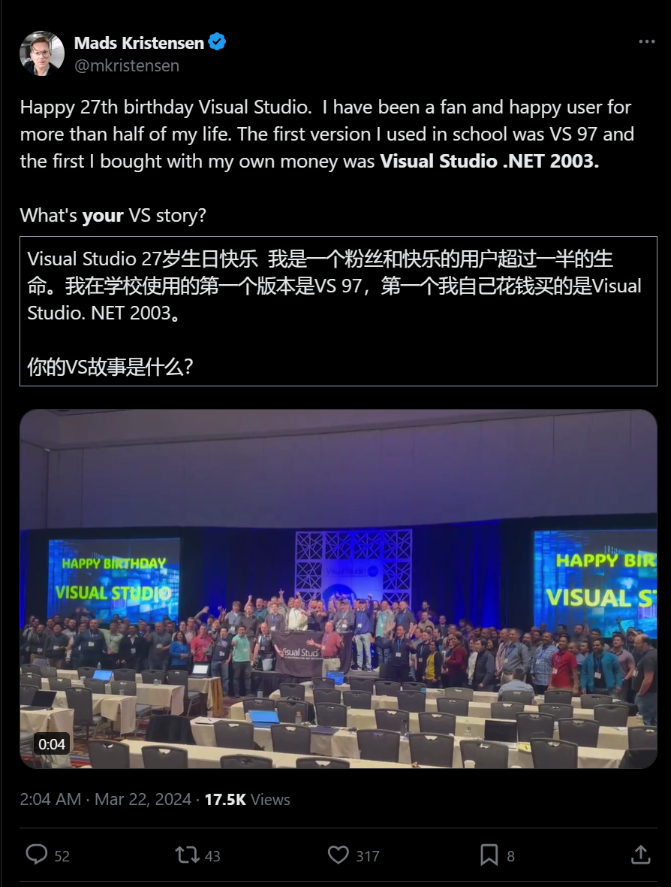

## 国内文章
### Garnet: 力压Redis的C#高性能分布式存储数据库

https://www.cnblogs.com/InCerry/p/18083820/garnet_introduce

微软研究院开源了一个名为Garnet的C#项目，实现了Redis协议，允许客户端无需修改直接替换Redis。Garnet基于C# .NET8.0开发，致力于提供极速、可扩展和低延迟的缓存存储解决方案。它支持在单节点的线程扩展和分片集群上运行，具备复制、检查点等数据库功能，并能利用主内存与分层存储如SSD。Garnet使用RESP协议与Redis客户端兼容，性能测试表明其在服务器吞吐量和延迟方面具有显著优势。该系统已在微软内部部署使用，旨在建立一个活跃的社区。

### 工良出品，从零设计开发 .NET 开发框架：框架源码和教程电子书

https://www.cnblogs.com/whuanle/p/18086537

该教程由痴者工良编写，旨在帮助程序员成长，提供了 .NET 开发框架的设计与实现指南。Maomi 框架是其开放源代码项目，包含模块化、自动服务注册等功能。教程内容涵盖从基础知识到高级技术，如故障诊断、序列化、事件总线以及 Web 框架定制等。还包括实战指南如如何利用日志、HttpClient、动态代码生成等，并附有实例代码与单元测试，可供直接学习实践。作者还提供了其他专题电子书以巩固相关基础知识。

### .NET Emit 入门教程：第一部分：Emit 介绍

https://www.cnblogs.com/cyq1162/p/18085149

Emit技术是.NET开发中一种重要的动态代码生成技术，允许开发者使用System.Reflection.Emit命名空间的类在运行时创建或修改程序集、类型与方法，直接操控IL代码。Emit广泛应用于ORM框架动态创建实体类、AOP编程动态代理等场景。相比传统编码编译方式，Emit在特定场合下可显著提升性能和灵活性。本文旨在提供一个Emit的入门教程，帮助开发者理解并掌握这一领域的知识。

### 【干货】Java开发者快速上手.NET指南

https://www.cnblogs.com/Can-daydayup/p/18086254

微软出了一本面向Java开发者的.NET快速入门电子书，帮助他们了解.NET平台、工具和生态系统。.NET是一个跨平台的开放源代码平台，以C#为主要开发语言，特点包括全栈生产力、安全代码模型、多场景代码支持、本地代码互操作，跨平台移植等。.NET适用于客户端、云和游戏应用等多种应用类型。微软提供详尽的.NET和C#官方文档，以及Visual Studio等开发工具。还有DotNetGuide技术社区提供学习资料和交流机会。

### C# 优雅的处理TCP数据（心跳，超时，粘包断包，SSL加密 ，数据处理等）

https://www.cnblogs.com/qwqwQAQ/p/18087456

TCP协议是一种流式数据传输协议，它的传输过程类似数据通过管道流到对端。Nagle算法通过减少未确认的小数据包数量，能够减少网络拥塞和提高传输效率，但可能增加延迟。C#中可以通过调整Socket的NoDelay属性和使用连接超时机制来配置Nagle算法。此外，TCP支持SSL加密传输，确保数据安全，C#中通过配置X509Certificate和SslStream来实现服务器和客户端间SSL认证及加密通信。

### http内网穿透CYarp[开源]

https://www.cnblogs.com/kewei/p/18084123

MQTT消息是物联网设备连接平台的标准协议，而操作接口常用HTTP协议。若让设备直提供HTTP接口并通过隧道技术与移动端通信，则可避免繁琐的协议适配。面对海量连接、身份认证、安全传输和开放协议等问题，提出CYarp基于Yarp的HTTP内网穿透中间件。CYarp特性包括：兼容TCP和新版本HTTP协议、集成ASP.NET Core中间件、使用HTTPS保障安全、简化客户端需求和明晰协议。用于服务端和客户端开发的CYarp是比nginx更适用于dotnet平台的组件，相较于需要运行在桌面系统上的YarpTunnelDemo，CYarp更适合物联网设备。

### 在Blazor中使用Chart.js快速创建图表

https://www.cnblogs.com/Can-daydayup/p/18081886

BlazorChartjs是一个用于Blazor中集成Chart.js图表的库，兼容WebAssembly和Blazor Server。它提供了容易使用的组件以便于开发者在Blazor应用程序中实现数据可视化。Blazor是基于.NET和Razor的Web应用程序框架，使得可以用C#编写Web应用，提高了效率和用户体验。文章步骤包括创建Blazor项目、安装NuGet包PSC.Blazor.Components.Chartjs、添加必要脚本到index.html，引入组件到_Imports.razor文件，并给出了柱状图和饼图的实现示例。

### 记一次 .NET某游戏后端API服务 CPU爆高分析

https://www.cnblogs.com/huangxincheng/p/18087576

一位朋友的API服务程序中，CPU使用率满载后无法降低，请求帮助分析原因。通过使用WinDbg分析工具，首先观测到CPU占用率为60%。经过检查发现两个线程的操作停在了HashSet上，进一步分析推断问题可能是多线程操作HashSet引起的死循环。为了确认这一点，作者深入了解了HashSet的内部结构，最终验证了这个假设。

### 为什么ASP.NET Core的路由处理器可以使用一个任意类型的Delegate

https://www.cnblogs.com/artech/p/18075406/delgate_as_route_handler

ASP.NET Core中的路由是通过注册终结点来选择和处理请求的关键过程。终结点由路由模式和请求处理器组成，后者可由任何类型的委托来实现。请求处理器最终转换为RequestDelegate类型，用以适配终结点。参数绑定策略与ASP.NET MVC的模型绑定类似，通过特定的特性映射请求数据到方法参数。文章还提到了相关的接口和实现了这些接口的特性，便于数据源的明确来源指定。

### .NET Emit 入门教程：第三部分：构建模块（Module）

https://www.cnblogs.com/cyq1162/p/18086265

本文深入探讨了动态程序集中模块的概念和管理。模块是组织代码、实现复用的基本单元。一般情况下，程序集在持久化时只包含一个模块，但运行时可以包含多个模块。文章通过问答形式解释了为何反编译dll时只见一个模块，以及使用Emit技术动态创建模块的过程。同时指出模块间可以互动，但定义多个模块并不建议。最后通过实例代码说明了在.NET中定义多个模块并尝试进行交互的情况。

### Garnet发布 Redis不再是唯一选择

https://www.cnblogs.com/linshuli/p/18082630

Garnet是微软研究部开发的远程缓存存储系统，支持高吞吐量、低延迟、扩展性和存储恢复等功能，能与现有Redis客户端兼容。它基于流行的RESP协议，可通过未修改的Redis客户端在各类编程语言中使用，如C#的StackExchange.Redis。Garnet特点包括运用.NET技术开发、提供API支持多种操作、高性能的网络和存储层设计，支持集群操作。项目采用MIT许可证发布，鼓励开源社区贡献，并遵循微软开源行为准则。更多信息可通过其GitHub页面获取。

### .NET Emit 入门教程：第二部分：构建动态程序集（追加构建静态程序集教程）

https://www.cnblogs.com/cyq1162/p/18085811

本文深入探讨了如何使用C# Emit创建动态程序集。动态程序集在运行时生成，有助于模块化、版本控制和代码复用。文章解释了程序集的概念，.NET和.NET Core关于动态程序集的支持情况，以及AssemblyBuilder类在创建动态程序集中的应用和在不同.NET版本中的差异。接着，介绍了如何在Emit中构建静态程序集以及通过AssemblyBuilder为程序集添加自定义属性和保存的示范。此外，还介绍了静态程序集的其他构建方式。

### .NET开源免费的Windows快速文件搜索和应用程序启动器

https://www.cnblogs.com/Can-daydayup/p/18084003

大姚分享了一个.NET开源工具Flow Launcher，它是一个免费的Windows快速文件搜索和应用启动器。这个工具支持多语言拼音搜索，并拥有插件商店，可提高工作效率。用户可通过快捷键进行各种操作，如打开搜索窗口、执行、以管理员身份运行等。还提供了部分功能的截图，并邀请用户前往GitHub为项目点赞。此外，该工具已被收录在C#/.NET/.NET Core优秀项目中，并且推广了DotNetGuide技术社区。

### [.NET项目实战] Elsa开源工作流组件应用（二）：内核解读

https://www.cnblogs.com/jevonsflash/p/18084921

本文介绍了Elsa工作流原理，包括变量、内存寄存器、上下文对象、构建和运行过程。Elsa中变量是异步获取与设置，模拟内存寄存器实现异步模型。文章提供了关键类的代码解析，说明了活动上下文和工作流上下文在执行过程中的作用，并展示了如何构建与运行自定义活动。

### 自定义Key类型的字典无法序列化的N种解决方案

https://www.cnblogs.com/artech/p/18075402/dictionary_key_serialization

使用System.Text.Json.JsonSerializer对自定义类型（如Point结构体）做字典Key进行序列化时会发生异常。文章通过一个简单例子引入问题，然后探讨了通过自定义JsonConverter和TypeConverter来解决这个问题，但都不成功。最后，文章建议了其他几种解决方案，比如以键值对集合进行序列化，转换成合法的字典形式或自定义读写方法。

### .NET开源、免费、强大的交互式绘图库

https://www.cnblogs.com/Can-daydayup/p/18090505

大姚向大家介绍了一款.NET开源的交互式绘图库——ScottPlot，它支持多平台和框架，可以快捷地在.NET WinForms中实现大型数据集的图表展示。ScottPlot特点包括支持多种图表形式，源代码开放，且提供详细的使用教程链接。项目源码可在GitHub获取，同时，ScottPlot也被收录在C#/.NET/.NET Core优秀项目和框架清单中。此外，文章还提到了DotNetGuide技术社区，它是为.NET开发者提供资源和交流的开源社区。

### Asp-Net-Core开发笔记：实现动态审计日志功能

https://www.cnblogs.com/deali/p/18086834

本文详细探讨了在ASP.NET Core应用中如何用面向切面编程的方式实现动态审计日志功能。审计日志有助于追踪用户操作行为、数据变更记录等，对系统安全管理至关重要。文章从审计日志的基础定义、用途出发，详细阐述了事件标识到用户标识等关键信息的记录方式，并提供了AuditLog类的模型定义。同时介绍了IAuditLogService接口的设计，以实现审计日志的灵活扩展与维护，并展望了后续数据持久化的具体实现。

### CYQ.Data 操作 Json 性能测试：对比 Newtonsoft.Json

https://www.cnblogs.com/cyq1162/p/18080172

CYQ.Data自V5.9版本开始大规模优化代码，目前更新至V5.9.2.7，引入多数据库支持和分布式锁等新功能，同时提升了性能，如通过Emit替换反射以提升效率。版本更新包括新增对FireBird、DaMeng、KingBaseES数据库的支持，优化数据结构转化，重构了缓存和JSON相关类，增加了对.net standard2.1的支持，以及多项性能提升和bug修复。

### [.NET项目实战] Elsa开源工作流组件应用（三）：实战演练

https://www.cnblogs.com/jevonsflash/p/18087583

文章进一步阐述了之前介绍的工作流及其在自动化管理领域的广泛应用，并重点示例了Elsa工作流库的源码简洁易懂，通过审批工作流示例详细介绍了运用工作流处理审批业务的过程。首先，作者发送文章审批请求后，系统会后台打印审批人需要操作的链接；其次，审批人访问对应的链接以通过或退回文章，系统会记录审批结果并反馈相关信息。

### 深入解析C#中的第三方库NPOI：Excel和Word文件处理的利器

https://www.cnblogs.com/Z1000W/p/18080019

NPOI是一款开源.NET库，允许开发者在不安装Microsoft Office的情况下处理Excel和Word文档。它支持创建、读取、修改、处理图表和图片以及合并单元格等功能，适用于服务器端或无Office环境。通过NuGet安装后使用，能够管理工作簿、工作表和单元格等，还能设置单元格样式并保存文件。NPOI提供了包括批处理、Web应用后台处理等多种使用场景的解决方案。

### [MAUI]集成高德地图组件至.NET MAUI Blazor项目

https://www.cnblogs.com/jevonsflash/p/18091763

本文介绍了在.NET MAUI Blazor中集成高德地图JS API的方法，用于实现一个手机App中的地图选择器功能。文章首先讲解了如何注册高德开发者账号并获取key，接着详细说明了应用创建、JS API Loader配置和权限配置的步骤，最后概述了创建模型和交互逻辑的过程。本方案的优势在于借助.NET MAUI Blazor的跨平台特性，一次开发即可在多平台上运行，无需针对每个平台单独适配。

### 使用 LogProperties  source generator 丰富日志

https://www.cnblogs.com/chenyishi/p/18078355

Microsoft.Extensions.Telemetry.Abstractions包中新的日志记录source generator能通过[LogProperties]将整体对象作为State记录。展示了使用[LoggerMessage]属性记录日志方法，并展示如何通过[LogProperties]自动丰富日志的方法。还介绍了如何使用[LogPropertyIgnore]属性排除不想记录的属性。原理是使用source generator在vs中生成代码。

### StableSwarmUI：功能强大且易于使用的Stable Diffusion WebUI

https://www.cnblogs.com/shanyou/p/18081311

StableSwarmUI 0.6.1-Beta是Stability AI推出的Stable Diffusion WebUI的最新Beta版本，为AI图像生成提供一站式解决方案。此UI基于.NET 8开发，支持本地化、可定制化并提供多功能。它有一个易用的界面，使用户能够高效与Stable Diffusion交互，支持多GPU以及分布式生成功能。此版本增加了新功能，如多语言支持、改进图像编辑器等。它为非技术用户提供了自动化安装过程和易于理解的概念解释，并支持新模型如SD3。作为开源项目，在GitHub上持续更新，并计划进一步增强移动友好性和LLM集成。

### Advanced .Net Debugging 5：基本调试任务（线程的操作、代码审查、CLR内部的命令、诊断命令和崩溃转储文件）

https://www.cnblogs.com/PatrickLiu/p/18060906

这篇《Advanced .Net Debugging》系列的第五篇文章主要讲解了.NET 程序调试技巧，包括线程操作、代码审查和诊断命令等。作者介绍了调试环境的搭建、工具下载和具体的调试源码。本系列文章基于.NET 8版本，而SOSEX扩展内容适用于.NET Framework版本，故本文未进行介绍。文章还提供了包括线程运行和数值求和等示例代码，说明了这些调试技巧对程序员的重要性。

### 在winform中如何实现双向数据绑定？

https://www.cnblogs.com/mingupupu/p/18080974

双向数据绑定是一项技术，允许模型数据与用户界面(UI)间自动同步。以winform的DataGridView控件为例，介绍了双向数据绑定的实现。首先，创建一个支持数据绑定的BindingList对象，再通过实现INotifyPropertyChanged接口，确保数据变更能够通知UI更新。最后，通过直接修改BindingList中的数据，演示了UI的自动更新。

### 记一次 .NET某施工建模软件 卡死分析

https://www.cnblogs.com/huangxincheng/p/18082543

朋友的窗体程序出现卡死现象，请求帮忙分析。通过WinDbg分析，主线程在执行NtWaitForAlertByThreadId函数时卡住，线程栈显示主线程正在处理其他线程通过Invoke发送的信息，并尝试更新窗体样式。

### .Net MinimalApis响应返回值

https://www.cnblogs.com/ruipeng/p/18088161

本文介绍了在MinimalApis中使用自定义IResultModel和系统自带IResult返回响应值的方法。文章说明了返回字符串时，默认响应类型为text/plain，返回其他类型时将会自动JSON序列化为application/json，同时提供了MinimalApis框架JSON序列化的全局配置方法。除此之外，文中还展示了统一响应格式的接口IResultModel以及泛型接口IResultModel<T>的设计，并提供了ResultModel<T>的具体实现，包括成功与失败响应的处理。

### .Net依赖注入神器Scrutor(上)

https://www.cnblogs.com/ruipeng/p/18081965

Scrutor是.Net平台内置依赖注入框架的扩展，主要提供程序集的批量注入和装饰器模式两个功能。本文主要介绍Scrutor的批量注入功能，包括如何使用IServiceCollection的扩展方法Scan和选择合适的程序集、类型。通过Scanning，可以对程序集中的类型进行筛选、过滤，并基于特定的条件如属性、命名空间等来批量注入服务。文章详细解析了如何使用Scrutor进行依赖注入的配置和选择逻辑。

### C# 12 拦截器 Interceptors

https://www.cnblogs.com/chenyishi/p/18082725

拦截器Interceptors允许在编译时声明式替换应用中的方法，通过在源代码中指定拦截位置来实现。使用.NET 8创建控制台应用程序并添加配置，创建InterceptsLocationAttribute属性，并在特定的类方法上应用此属性来拦截方法调用。示例演示了拦截AddUser方法，通过添加拦截类和拦截方法，运行时AddUser方法被拦截并未执行，而是执行了拦截器方法。

### 自己动手做一个批量doc转换为docx文件的小工具

https://www.cnblogs.com/mingupupu/p/18085637

本文介绍了批量将doc文件转换为docx文件的小工具。doc是微软Word的旧版文档格式，docx则是2007及之后版本的格式，基于XML，体积更小，兼容性和稳定性更好。转换需求基于格式优越性、文件体积减小和兼容性考虑。转换工具使用C#和Microsoft Office Interop开发，必须在安装了Word的电脑上运行，具体通过FolderBrowserDialog选择文件夹，再异步执行DocToDocx方法进行转换。

### .Net依赖注入神器Scrutor(下)

https://www.cnblogs.com/ruipeng/p/18084771

本文主要介绍了 Scrutor 的装饰器模式功能及其在依赖注入中的应用。首先定义了一个用户服务类与接口，然后通过装饰器模式为 GetAllUsers 接口添加了缓存功能。通过 Scrutor 的 Decorate 方法，我们在 DI 容器中注册服务并添加装饰器。文章还提供了装饰器模式底层实现的核心代码和测试方法。本文提供的源代码帮助理解如何在依赖注入中实现装饰器模式。

### 在 PostgreSQL 中，解决图片二进制数据，由于bytea_output参数问题导致显示不正常的问题。

https://www.cnblogs.com/wuhuacong/p/18088886

PostgreSQL数据库中，bytea_output参数决定bytea数据类型展示格式，其默认值为hex，即十六进制格式。如果应用需要二进制格式，应将其改为escape。对于Winform多数据库支持系统，在切换到PostgreSQL后可能需调整参数来正确显示图片。若bytea_output设置为hex，须通过C#代码将hex转换为二进制数组读取，步骤包括查询图像数据、转换字节、创建图像对象并显示。核心操作包括修改配置文件、重启数据库和转换数据格式。

### 基于C#的自动校时器 - 开源研究系列文章

https://www.cnblogs.com/lzhdim/p/18074382

一位开发者在公司的Windows7电脑出现系统时间不准确的问题，因此使用C#开发了一个系统时间自动校时器。该应用提供了界面展示和源代码下载，使用默认的time.windows.com域名进行校时，其它IP地址的校时还未实现，需要读者自行扩展。该校时器是作者开发的C#应用之一，感兴趣的读者可以查看作者的其它作品。

### .Net Core 使用 TagProvider 与 Enricher 丰富日志

https://www.cnblogs.com/chenyishi/p/18081945

TagProvider属性可以在不污染领域模型的情况下，通过定制TagProvider实现丰富日志的内容，例如仅记录特定字段。使用Microsoft.Extensions.Telemetry包，可以通过启用日志丰富并添加日志丰富器，将如进程ID、线程ID等信息，或是自定义的应用元数据添加到日志中。此外，还可以创建个性化的LogEnricher以实现更复杂的日志记录需求。

### Dll堆栈问题(Dll的静态变量与全局变量、vs的MT与MD)

https://www.cnblogs.com/renleiguanchashi/p/18087876

文章首先介绍了当DLL中有使用静态变量的STL类时，如果DLL采用静态链接运行库，在EXE调用DLL的过程中可能导致崩溃的问题。提出的解决方法包括避免跨执行单元访问STL类静态变量、使用WCHAR*代替、或改为动态链接运行库。然后区分了/MD与/MT、/MDd与/MTd编译选项的不同，分析了静态与动态链接运行库的差异及可能导致的问题。微软官方的文档解释了DLL全局变量与静态变量的行为。最后通过代码示例说明了如何在DLL文件中创建共享全局变量，并在主程序中安全访问这些变量。测试用例展示了如何在DLL中导出全局变量和函数。

### gRPC入门学习之旅（三）

https://www.cnblogs.com/chillsrc/p/18090824

本文介绍了在gRPC框架中如何创建自定义服务，重点是添加和配置一个处理用户信息（登录、获取和修改信息）的gRPC服务。教程详细说明了创建UserInfo.proto协议文件、书写服务定义、运行协议缓冲区文件进而生成C#类文件的过程，以及协议文件的配置方法。

### AntSK 0.2.3 版本更新：轻松集成 AI 本地离线模型

https://www.cnblogs.com/xuzeyu/p/18091907

AntSK是一个基于.Net 8、Blazor及SemanticKernel开发的人工智能项目，目标是为开发者提供AI知识库和智能体平台。最新版在GitHub上更新，新增了llamafactory集成和将来的模型微调功能。为简化工程和降低门槛，项目内置了llamafactory核心文件，避免直接使用python.net，而是自动通过AntSK安装依赖和启动llamafactory。其中包括自动化安装Python环境和依赖包，以及启动llamafactory并加载指定模型的功能。

### webapi通过docker部署到Linux的两种方式

https://www.cnblogs.com/cyfjjf/p/18081688

本文介绍了如何在CentOS系统上安装、配置和使用Docker，具体包括Docker的安装、移除，查看状态及设置开机自启，同时介绍了webapi项目镜像的创建、启动容器，及通过浏览器访问服务的过程。此外，还讲述了基于发布后的webapi文件创建Docker镜像并运行容器。最后列出了Docker镜像和容器的常用命令，如创建、启动、停止、删除以及修改容器启动规则等。

### abp9 .net8 升级错误记录

https://www.cnblogs.com/moonstars/p/18090546

本文介绍了8个.NET相关技术问题以及修复方法。涉及问题有编译库定位、Nuget包更新、Token密钥位数、SSL认证错误、Senparc包升级操作、Pomelo.EntityFrameworkCore.MySql版本兼容、数据库字段长度超限和.NET 8中服务创建方法改变。

### Newtonsoft.Json/Json.NET忽略序列化时的意外错误

https://www.cnblogs.com/chenyishi/p/18085582

在.NET中使用Newtonsoft.Json库，可以在Json序列化与反序列化时处理错误，避免因不规则的Json数据而抛出异常。错误处理可以通过JsonSerializerSettings上的ErrorEvent或是在类中使用OnErrorAttribute实现，让用户可以捕获和处理错误，或允许错误冒泡到应用程序。示例展示了ErrorEvent如何在反序列化中捕捉错误，并且OnErrorAttribute与其他序列化属性的工作方式相似，将属性放在具有正确参数的方法上即可。

### 除gRPC之外的另一个选择，IceRPC-支持QUIC

https://www.cnblogs.com/xlgwr/p/18080133

作者自2019年接触RPC后，对跨平台、跨语言的RPC特别是gRPC产生了兴趣。最近，新的RPC框架IceRPC问世，作者寄予厚望并参与了翻译README.md。IceRPC是基于QUIC的现代、模块化RPC框架，可并行处理请求和响应，支持多种协议（包括QUIC和TCP）。它利用了C#和.NET的新功能，提供了易于使用的异步API，并支持取消操作。此外，IceRPC具有高度模块化和可扩展性，用户可以自定义拦截器和中间件。它支持使用Slice或Protobuf作为IDL，并可与DI容器配合使用。

### Orleans - 1 .NET生态构建分布式系统的利器

https://www.cnblogs.com/chenyishi/p/18089561

Orleans 是微软推出的一个开源分布式应用框架，基于 Actor 模型，用 Virtual Actor 概念将应用程序分解成多个 Actor 实体。框架通过提供异步消息传递等机制，有效避免了锁和死锁问题，适用于实时数据处理、在线游戏、物联网和分布式计算等场景。文中通过一个 HelloGrain 示例，说明了如何使用 Orleans 进行分布式系统的构建和部署。

### 重新记录一下ArcGisEngine安装的过程

https://www.cnblogs.com/kiba/p/18085072

本文介绍了Arcgis 10.1的安装过程，包括下载带注册机的Arcgis版本、注册机的使用、证书安装和service.txt文件的创建等。在安装Arcgis Engine时，需要正确配置许可证服务器的地址并确保服务已启动，遇到问题可以尝试使用新的证书安装包。安装完成后，为了使WinForm程序能够找到Arcgis的组件，需要先安装Visual Studio 2010来安装Arcgis Object，作者建议通过下载站点获取。最后，作者强调安装后可以在VS 2022中看到Arcgis工具并且建议在创建项目时先用VS 2010创建后再用2022打开。

### .Net 8.0 除gRPC之外的另一个选择，IceRPC之快速开始HelloWorld

https://www.cnblogs.com/xlgwr/p/18084781

本文是一个快速开始使用IceRPC构建C/S应用程序的教程，只需电脑安装.NET 8 SDK即可。步骤包括安装dotnet模板、创建服务端和客户端项目，并运行它们。服务端叫MyServer，客户端叫MyClient，运行后实现了客户端向服务器发送greet请求的简单通信。作者还提供了个人微信以便读者交流。

### .NET分布式Orleans - 2 - Grain的通信原理与定义

https://www.cnblogs.com/chenyishi/p/18091260

在Orleans框架里，Grain是核心单元，代表实体或计算单元，存储在Silo这个独立进程中。Grain间通信在同一个Silo内通过方法调用，在不同Silo间通过消息传递。外部客户端通过网络与Silo通信，使用Orleans Messaging Protocol。Orleans默认监听端口11111和30000用于内部通信和客户端连接，可自定义端口和IP地址配置。Grain可以通过不同键类型识别，如字符串、Guid、整数等。通过IGrainWithStringKey接口，用户可以创建像买装备这样的操作，并将信息保存至内存中。

### C#的窗体防闪烁解决方案 - 开源研究系列文章

https://www.cnblogs.com/lzhdim/p/18077345

文章讨论了C#中无边框窗体在调整大小时出现的闪烁问题，并提供了一个简单有效的解决方案。文章说明了项目目录和源代码，没有提供界面截图，但指出可以根据窗体的提示使用。还提供了源码下载链接，并指向作者的其他相关博文。

### C#的播放资源文件里的音频例子 - 开源研究系列文章

https://www.cnblogs.com/lzhdim/p/18077721

本博文介绍了如何在C#开发的待办列表TodoList中添加声音提醒功能，通过复用文章提供的模块代码，即可实现播放资源文件中的wav音频文件。文章还包含了详细的操作指南和源码下载链接，便于读者理解和使用。

### Csharp学习Linq

https://www.cnblogs.com/wenlong-4613615/p/18073134

本文首先通过学生类的代码示例介绍了LINQ（语言集成查询）的基本使用。然后，通过创建一个学生列表并展示如何使用LINQ的Where方法来过滤具有特定属性的学生对象——例如，获取ClassId为3的学生，筛选年龄大于24的学生，以及找到年纪小于23且ClassId为2的学生。

## 主题

### microsoft/garnet：Garnet 是 Microsoft Research 的远程缓存存储，提供强大的性能（吞吐量和延迟）、可扩展性、存储、恢复、集群分片、密钥迁移和复制功能。 Garnet 可以与现有的 Redis 客户端配合使用。
https://github.com/microsoft/garnet

- [Garnet – 开源更快的缓存存储可加快应用程序、服务的速度](https://www.microsoft.com/en-us/research/blog/introducing-garnet-an-open-source-next- Generation-用于加速应用程序和服务的更快缓存存储/)

### 版本 2.3.6 · mysql-net/MySqlConnector
https://github.com/mysql-net/MySqlConnector/releases/tag/2.3.6

### 向 .NET iOS 和 .NET MAUI 应用程序添加 Apple 隐私清单支持 - .NET 博客
https://devblogs.microsoft.com/dotnet/apple-privacy-manifest-support/

### .NET 智能组件简介 - AI 支持的 UI 控件 - .NET 博客
https://devblogs.microsoft.com/dotnet/introducing-dotnet-smart-components/

### 宣布在 Visual Studio 17.10 预览版 2 中推出适用于 ARM64 架构的 SQL Server 数据工具 (SSDT) - Visual Studio 博客
https://devblogs.microsoft.com/visualstudio/arm64-in-ssdt/

### 公告：Swashbuckle.AspNetCore 在 .NET 9 中被删除 · 问题 #54599 · dotnet/aspnetcore
https://github.com/dotnet/aspnetcore/issues/54599

### Rider 中 Xamarin 支持的更新 | .NET 工具博客
https://blog.jetbrains.com/dotnet/2024/03/15/an-update-on-xamarin-support-in-rider/

## 文章、幻灯片等

### 集合表达式 – 在 Rider 和 ReSharper 中使用 C# 12 | .NET 工具博客
https://blog.jetbrains.com/dotnet/2024/03/26/collection-expressions-using-csharp-12-in-rider-and-resharper/

### 在 .NET 9 中使用 PriorityQueue 实现 Dijkstra 算法查找两个节点之间的最短路径
https://andrewlock.net/implementing-dijkstras-algorithm-for-finding-the-shortest-path- Between-two-nodes-using-priorityqueue-in-dotnet-9/

### .NET Aspire 仪表板是在本地开发期间可视化 OpenTelemetry 数据的最佳工具
https://dev.to/asimmon/net-aspire-dashboard-is-the-best-tool-to-visualize-your-opentelemetry-data-during-local-development-9dl

### 使用最新预览查看您的拉取请求评论 - Visual Studio 博客
https://devblogs.microsoft.com/visualstudio/see-your-pull-request-comments-with-the-latest-preview/

### 如何将NuGet库添加到WiXSharp自定义操作中-Qiita
https://qiita.com/spc_ksudoh/items/299b6ba7eab25e7ad0f5

### ASP.NET 应用程序中的源代码泄露
https://swarm.ptsecurity.com/source-code-disclosure-in-asp-net-apps/

### 通过 Sentry 和 OpenTelemetry 获得生产中的 Aspire 见解
https://blog.sentry.io/aspire-insights-in-product-with-sentry/

### WebBrowser和WebView2 PDF文件显示
https://zenn.dev/nasrisilva/articles/4925cd69967725

### 在Visual Studio中调试实验室派
https://zenn.dev/kotaproj/articles/pi_dotnet_hello

### C# rekodo型和JSON:数据结构的自由度和一致性
https://zenn.dev/jtechjapan_pub/articles/ccdb92e7d660b1

### .NET8.0中API在JWT的验证中失败的情况下，试着改变结构以使用JsonWebToken-Qiita

https://qiita.com/karuakun/items/0736cfb273abbc2aee2e

### Sirenix 的 Odin Inspector 支持来到 Rider（一款 JetBrains IDE） | .NET 工具博客
https://blog.jetbrains.com/dotnet/2024/03/20/sirenix-s-odin-inspector-support-comes-to-rider-a-jetbrains-ide/

### C# 在指定线程上运行异步方法 - Qiita
https://qiita.com/qiitatosh/items/45e2a3dc7ba9694dcc92

### 我们最喜欢的 JetBrains Rider 快捷键（不是 Alt+Enter 或 Shift+Shift） | .NET 工具博客
https://blog.jetbrains.com/dotnet/2024/03/20/our-favorite-jetbrains-rider-shortcuts-that-arent-altenter-or-shiftshift/

### [C#] 如何让 GitHub Copilot 在 Visual Studio 中识别多个文件和代码 - Qiita
https://qiita.com/yuu-dev/items/9e0d22191e4655342d88

### WiXSharp 也是创建 Windows 安装程序的一个选项（但仅适用于那些可以使用 WiX 工具集的人）- Qiita
https://qiita.com/spc_ksudoh/items/afab902b6dea7fd4f6ed

### [C#] 使用 GitHub Copilot 生成 XML 文档的步骤 - Qiita
https://qiita.com/yuu-dev/items/b58fb4b041b2c2e5f538

### 使用 Audit.Net 进行实体框架核心审计试验
https://dev.to/hirushafernando/entity-framework-core-audit-trial-with-auditnet-3o8l

### 使用 .NET Aspire 运行 Ruby on Rails Web 应用程序
https://dev.to/asimmon/running-ruby-on-rails-web-apps-with-net-aspire-1pee

### .NET 开发者乞求破坏生态系统
https://aaronstannard.com/dotnet-eventing-backslide/

### Blazor 的 CSS 隔离::深层问题和解决方案
https://khalidabuhakmeh.com/blazors-css-isolation-deep-issue-and-solution

### 了解 System.Diagnostics DiagnosticSource 和 DiagnosticListener（第 1 部分）- Steve Gordon - 与 Steve 一起编码
https://www.stevejgordon.co.uk/understanding-system-diagnostics-diagnosticsource-and-diagnosticlistener-part-1

### 在 .NET 8 中轻松向 Blazor 添加“Ore Ore”登录功能
https://zenn.dev/microsoft/articles/aspnetcore-blazor-dotnet8-tryaddauth2

### Flux 模式和.NET 等中的实现。
https://zenn.dev/gab_km/articles/f2dcf0f17c8c94

### 关于 SpanT GC 保护
https://zenn.dev/ongaeshi/articles/0d271a6e42cf41

### 通过在 C# 中组合两个具有透明背景的图像来生成单个图像 - 使用 OpenCVSharp、ImageSharp 和 SkiaSharp 的示例 | @jsakamoto
https://devadjust.exblog.jp/30007598/

### C# 12 新功能介绍 - 类型别名、内联数组等期待已久的新功能有哪些？
https://codezine.jp/article/detail/19164

### 在简单的 C# 应用程序中找出神秘的 MissingMethodException
https://sergeyteplyakov.github.io/Blog/csharp/2024/03/21/Mythical_MissingMethodException.html

### 【C#】StringBuilder 和 DefaultInterpolatedStringHandler 的处理速度和内存量比较 - Hanachiru 的我的笔记
https://www.hanachiru-blog.com/entry/2024/03/22/120000

### [C#] Span和Memory - Annulus Games
https://annulusgames.com/blog/span-and-memory/

### 扩展
https://ufcpp.net/blog/2024/3/extensions/

### GDC 2024 上的 Visual Studio 和 GitHub Copilot - Visual Studio 博客
https://devblogs.microsoft.com/visualstudio/visual-studio-and-github-copilot-at-gdc-2024/

### neue cc - 通过在 Redis 兼容的超高速内存数据存储“Garnet”上实现 C# CustomCommand 来扩展命令
https://neue.cc/2024/03/19_Garnet.html

### neue cc - Claudia - Anthropic 如何使用 Claude 的 C# SDK 和现代 C# 创建 Web API 客户端
https://neue.cc/2024/03/18_Claudia.html

### C# 13 中的集合表达式 - 字典表达式

https://ufcpp.net/blog/2024/3/dictionary-expressions/

### 在数据库调优中实际产生效果的三个措施
https://zenn.dev/nekojoker/articles/1c97263ebd23d1

### 丰田将移动应用程序迁移到 Uno 平台
https://platform.uno/blog/toyota-migrates-mobile-app-to-uno-platform/

## 库、存储库、工具等。
### GitHub - mayuki/Yafp: 一个基于 ASP.NET Core 和 YARP 实现转发代理的工具包。
https://github.com/mayuki/Yafp

## 网站、文档等
### 推文
https://x.com/mkristensen/status/1770874082466377969?s=12

## 版权声明

* 国内板块由 InCerry 进行整理 : https://github.com/InCerryGit/WeekRef.NET
* 其余内容来自 Myuki WeekRef，由InCerry翻译（已获得授权） : https://github.com/mayuki/WeekRef.NET

**由于笔者没有那么多时间对国内的一些文章进行整理，欢迎大家为《.NET周刊-国内文章》板块进行贡献，需要推广自己的文章或者框架、开源项目可以下方的项目地址提交Issue或者在我的微信公众号私信。**

格式如下：

* 10~50字左右的标题
* 对应文章或项目网址访问链接
* 200字以内的简介，如果太长会影响阅读体验

https://github.com/InCerryGit/.NET-Weekly

## .NET性能优化交流群

相信大家在开发中经常会遇到一些性能问题，苦于没有有效的工具去发现性能瓶颈，或者是发现瓶颈以后不知道该如何优化。之前一直有读者朋友询问有没有技术交流群，但是由于各种原因一直都没创建，现在很高兴的在这里宣布，我创建了一个专门交流.NET性能优化经验的群组，主题包括但不限于：

* 如何找到.NET性能瓶颈，如使用APM、dotnet tools等工具
* .NET框架底层原理的实现，如垃圾回收器、JIT等等
* 如何编写高性能的.NET代码，哪些地方存在性能陷阱

希望能有更多志同道合朋友加入，分享一些工作中遇到的.NET性能问题和宝贵的性能分析优化经验。**目前一群已满，现在开放二群。**

如果提示已经达到200人，可以加我微信，我拉你进群: **ls1075**

另外也创建了**QQ群**，群号: 687779078，欢迎大家加入。 

