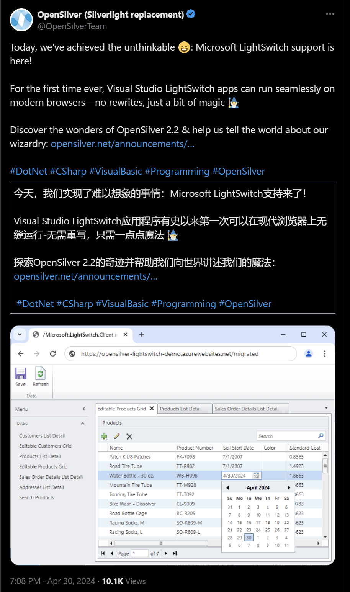
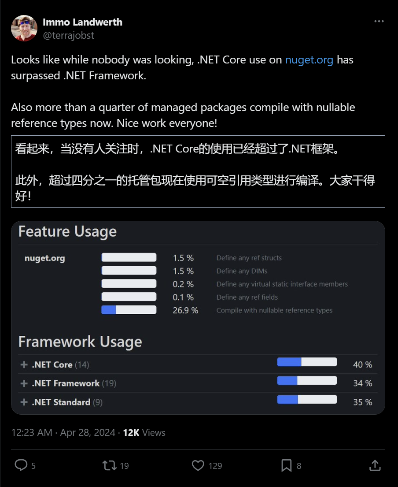

## 国内文章
### C#在工业数字孪生中的开发路线实践

https://mp.weixin.qq.com/s/b_Pjt2oii0Xa_sZp_9wYWg

这篇文章探讨了C#在工业数字孪生技术中的应用，介绍了三种基于C#的数字孪生系统实现方案：

1. **WPF + Unity**：结合WPF技术和Unity引擎，实现客户端三维应用，提供直观的生产场景展示。
2. **前端 + .NET8 + Unity**：通过前端技术、C#后端和Unity引擎，实现Web端三维应用，支持跨平台操作和远程监控。
3. **WPF + OpenGL**：使用WPF技术和OpenGL图形库，创建国产化数字孪生系统，满足国内企业对本土化技术的需求。

### C#.NET体系图文概述—2024最全总结

https://www.cnblogs.com/anding/p/18031760

C#是一种由微软创造的编程语言，而.NET是一个包括多种语言规范和工具的开发平台。文章介绍了.NET的发展历程（.NET Framework到.NET Core），并分析了.NET Framework的构成（CLR和FCL）。.NET Core的特点是开源和跨平台，并能支持多种架构。CLR作为.NET虚拟机，负责执行代码和提供运行时服务。CTS和CLS是实现多语言互操作的关键规范。文中也介绍了例如JIT、GC等.NET中的重要概念。

### 【WebForms王者归来】在 ASP.NET Core 中运行 WebForms 业务代码，99%相似度！

https://www.cnblogs.com/sanshi/p/18186007

ASP.NET Core引入了与20年前WebForms业务代码高度相似的开发模式，代码相似度可达99%，简化了从经典WebForms升级到ASP.NET Core的工作。由于经典 WebForms不再更新导致的安全风险和维护难题，升级到ASP.NET Core变得重要。ASP.NET Core具有出色的性能和安全性，支持跨平台，并允许使用最新的C#特性，微软团队迁移案例显示CPU性能提升25%。新模式意在简化开发，比如通过FineUICore提供MVC开发模式和RazorPages，最新的WebForms开发模式能进一步减少转移工作量和保持代码一致性。

### C#/.NET/.NET Core优秀项目和框架2024年4月简报

https://www.cnblogs.com/Can-daydayup/p/18181109

这篇文章介绍了多个与C#/.NET/.NET Core相关的开源项目和框架，并提供了它们的GitHub源码地址及公众号详细介绍。包括代码格式化工具CSharpier、控制台应用框架Spectre.Console、图表库LiveCharts2、桌面启动器CurvaLauncher、缓存框架FusionCache、跨平台框架MAUI、UI工具包Uranium、窗口增强工具SmartSystemMenu、WPF UI控件库MaterialDesignInXamlToolkit和小说阅读应用CleanReader.Desktop等。

### 车牌识别控制台 可快速整合二次开发

https://www.cnblogs.com/yizhuqing/p/18181320

这篇文章介绍了一个完整的车牌号识别程序，该程序不仅能够识别车牌号码，还能识别车牌颜色，并且可以通过控制台输出流集成到其他项目中。程序使用深度学习框架，包含onnx模型文件，能够先识别车牌外观，然后利用OCR技术提取文字和颜色信息。实现过程包括数据标注、训练数据、导出onnx模式以及使用ML.NET调用模型。文章还提供了使用命令行测试本地或网络资源文件的说明以及完成程序的下载链接。

### .NET有哪些好用的定时任务调度框架

https://www.cnblogs.com/Can-daydayup/p/18181177

大姚在技术群中分享了5个.NET开源任务调度框架。这些框架包括Quartz.Net、Quartz.NetUI、Hangfire、Hangfire.HttpJob和FreeScheduler，它们分别适用不同规模的系统，有的支持复杂的触发器和任务类型，有的易用且不依赖数据库，也有的支持轻量化定时任务。这些建议能帮助开发者选择适合的定时任务调度框架。同时介绍了DotNetGuide技术社区，提供了一个.NET开发者学习、分享和咨询的平台。

### C#开发Web三维和客户端三维技术揭秘

https://mp.weixin.qq.com/s/2t9Cs0Y_nXFrfiiMPAQHXA

这篇文章介绍了如何使用C#和Unity开发三维客户端和网页应用。首先，展示了一个工业AI检测设备的上位机客户端软件，然后是一个工艺产线模拟项目。开发过程包括WPF结合Unity通过socket通信，以及前端HTML+CSS与后端.NET 6和Unity的结合。最后，讨论了自适应设计的挑战和解决方案。

### WPF 稳定的全屏化窗口方法

https://www.cnblogs.com/lindexi/p/18186221

本文介绍了在WPF中如何实现窗口全屏的稳定方法。文章基于Win32 API，通过Hook机制来获取并设置窗口全屏尺寸。提供了一个经过广泛测试并在超过千万台设备上运行的方法，并详细介绍了相关设置和可能出现的问题，还包含了代码示例和全屏前后窗口状态的保存。

### C#.Net筑基-基础知识

https://www.cnblogs.com/anding/p/18170347

C#是一门由微软开发的面向对象的编程语言，2000年发布并作为.NET框架的一部分。C#具有类型安全、自动内存管理、跨平台开源等特点，并拥有强大的标准库。使用C#时需注意C#和.NET的版本匹配。开发环境包括.NET SDK以及支持多个版本SDK的Visual Studio IDE。C#的基础语法要求分号结尾，支持多种变量类型声明和命名风格。变量申明前必须初始化，且作用域以花括号为界。

### 在 WPF 中集成 ASP.NET Core 和 WebView2 用于集成 SPA 应用

https://www.cnblogs.com/aobaxu/p/18186785

文章指导如何在WPF项目中集成ASP.NET Core及WebView2控件，以实现Web版工具的复用。首先修改项目文件，使其支持ASP.NET Core库和引用WebView2。之后，修改App.xaml和App.xaml.cs以接管启动事件，并使用ASP.NET Core的WebApplication.CreateBuilder()方法进行依赖注入和资源文件管理，是WPF应用程序可以处理静态文件和支持自定义文件类型。

### 使用.NET源生成器(SG)实现一个自动注入的生成器

https://www.cnblogs.com/vipwan/p/18175230

文章介绍了在.NET中如何通过依赖注入(DI)来管理服务，尤其是在服务数量众多，代码量大时，使用源生成器来简化服务注册过程。作者首先定义了一个用于服务注册的Attribute，并展示了其使用方式。然后借助C# 11的新特性，实现泛型Attribute来进一步简化代码。接着通过几个示例展示了如何利用这个Attribute为服务增加标记。文章最后部分可能包含了源代码生成的具体细节和步骤。

### C#使用MX Component实现三菱PLC软元件数据采集的完整步骤（仿真）

https://www.cnblogs.com/Jerry9521/p/18174620

本文详细介绍了使用三菱MX Component插件对PLC软元件数据进行读写的流程，包括PLC开发环境GX Works2的配置，MX Component的设置和C#上位机程序测试。全文提供了详细的安装和配置步骤，并陈列了在读写过程中的注意事项。

### 【OpenVINO™】使用OpenVINO™ C# API 部署 YOLO-World实现实时开放词汇对象检测

https://www.cnblogs.com/guojin-blogs/p/18177702

YOLO-World平台结合了实时目标检测和增强现实技术，通过YOLO算法实现快速识别并通过AR技术提高用户交互体验。文章介绍了使用最新的OpenVINO™ 2024.0和C# API在.NET环境下部署YOLO-World的方法。英特尔新版OpenVINO™ 加速AI推断，支持多硬件平台和生成式人工智能，增强了对Hugging Face模型的支持。YOLO-World由腾讯AI实验室开发，提高了对开放词汇的检测能力，并能在保持高性能的同时实现实时性。模型可以通过YOLO-World GitHub或Ultralytics导出，项目配置需要克隆OpenVINO C# API示例项目并安装相关依赖。

### .NET 缓存：内存缓存 IMemoryCache、分布式缓存 IDistributedCache（Redis）

https://www.cnblogs.com/WinterSir/p/17701841.html

.NET缓存分内存缓存IMemoryCache和分布式缓存IDistributedCache两种。内存缓存通过Program注入，并提供Get、TryGetValue、GetOrCreate等方法，重要的是设置过期时间，具有绝对过期、相对当前时间过期和滑动过期三种方式。IMemoryCache示例中介绍了使用各种方法和设置过期时间的代码。而分布式缓存则需先安装Redis并在appsettings.json中配置，再在Program中注入分布式缓存服务。

### 使用C#强大的表达式树实现对象的深克隆

https://www.cnblogs.com/gmmy/p/18186750

表达式树是一种在C#中将表达式以树结构表示的技术，常用于LINQ中，能够将C#查询转换为其他形式，实现跨数据源使用。在运行时可以动态创建或修改表达式树，适合动态生成代码逻辑，增强程序的灵活性和效率。C#中通过System.Linq.Expressions命名空间提供的类来创建和操作表达式树。文中通过示例展示了如何创建表达式树，并描述了如何使用它进行深克隆操作。文章还介绍了一个关于深拷贝的扩展类方法，通过表达式树来提升性能，避免使用反射或序列化的性能开销。

### .NET静态代码织入——肉夹馍（Rougamo）发布3.0

https://www.cnblogs.com/nigture/p/18173550

肉夹馍组件通过静态代码织入实现AOP，主要特色是编译时完成织入，减少启动时间，支持静态方法。版本3.0改变了代码织入方法，从代码内嵌方式转为代理调用方式，简化了对async/await语法差异的处理，弃用ExMoAttribute属性，简化了异步方法的织入处理。

### 分享几个.NET开源的AI和LLM相关项目框架

https://www.cnblogs.com/Can-daydayup/p/18173922

人工智能技术正在成为各行各业的重要组成部分。大姚分享了四个基于.NET的开源AI与LLM项目。Semantic Kernel可让开发者结合LLM和传统编程语言创建应用。BotSharp是企业级LLM应用框架，支持智能机器人的开发。LLamaSharp是跨平台库，高效在设备上运行LLM模型。OpenAI DotNet则是.NET客户端库，方便使用OpenAI的API。同时介绍了DotNetGuide技术社区，旨在为.NET开发者提供技术交流与资源共享的平台。

### 【OpenVINO™】基于 C# 和 OpenVINO™ 部署 Blazeface 模型实现人脸检测

https://www.cnblogs.com/guojin-blogs/p/18179021

OpenVINO™ C# API是OpenVINO的.NET包装器，可以在.NET环境下使用C#实现深度学习模型推理。本文介绍了如何使用OpenVINO™ C# API部署BlazeFace模型进行人脸检测，并提供了项目链接和源码链接。文中说明了项目环境依赖，并可以通过NuGet Package安装相应依赖。文章还展示了控制台输出的项目运行结果，包括从GitHub下载模型和图像的过程，以及使用CPU进行模型推理的详细信息。

### IceRPC之服务器地址与TLS的安全性-&gt;快乐的RPC

https://www.cnblogs.com/xlgwr/p/18187552

文章介绍了.Net 8.0下新的RPC框架IceRPC，着重介绍了服务器地址、客户端连接配置、服务器配置以及TLS安全性。通过示例代码提供了如何在C#中使用这些配置进行RPC通信的指南。特别说明了icerpc和ice协议的端口和使用，还强调了如何通过Quic和Tcp传输来实现TLS安加密通信。

### 微服务 - 作业调度 &#183; Hangfire集成式 &#183; 仪表盘 &#183; DolphinScheduler分布式 &#183; 定义流程

https://www.cnblogs.com/Sol-wang/p/17509813.html

本文介绍了两款适合在.NET环境下使用的作业调度产品——Hangfire与DolphinScheduler，并聚焦于Hangfire的介绍、使用与配置。Hangfire是一个开源、支持多种.NET版本、可以集成在项目中的调度工具，提供了便捷的Dashboard查看作业状态。本文介绍了Hangfire的基本概念、作用、如何在项目中集成以及如何配置使用等方面，使读者能够快速理解如何在.NET中部署和使用Hangfire。

### C#中的对象深拷贝和浅拷贝

https://www.cnblogs.com/chi8708/p/18183115

C#中对象的拷贝分为浅拷贝和深拷贝。浅拷贝通过MemberwiseClone方法实现，仅复制值类型成员，引用类型成员会与原对象共享。深拷贝不仅复制值类型成员，还生成引用类型成员的新实例，可通过反射、序列化或对象映射实现，确保副本完全独立。选择浅拷贝或深拷贝取决于是否需避免修改原始对象及对象的使用场景。

### 使用.NET查询日出日落时间

https://www.cnblogs.com/czwy/p/18181050

本文介绍了如何在WPF中实现自动切换主题的方法，包括跟随系统明暗主题的切换和根据日出日落时间自动切换。文章首先说明了计算日出日落时间需要考虑的因素，接着介绍了通过在线API和公式计算两种获取日出日落时间的方法，并提供了如何将IP地址转换为经度纬度信息的方法。在线API部分详细介绍了一个免费API的使用方法，而公式计算部分则提供了一个不涉及大气折射因素的计算公式。

### C#实现多线程的几种方式

https://www.cnblogs.com/Can-daydayup/p/18185545

C#中的多线程是指在一个进程中同时运行多个线程，适用于提升并发性、吞吐量和响应速度，特别是在CPU密集型任务、I/O密集型任务、并发请求处理及大数据处理场景中。进程是运行中程序的抽象，包含代码和操作系统资源，而线程是进程内的执行单元。C#提供了Thread、ThreadPool、Task和Parallel等类来实现多线程编程。此外，文章提及有关C#/.NET/.NET Core的拾遗补漏专栏、开源地址和技术社区，旨在提供学习资料、项目推荐和技术交流的平台。

### 入门Semantic Kernel：OneApi集成与HelloWorld

https://www.cnblogs.com/ruipeng/p/18178756

Semantic Kernel是一个用于构建智能应用的轻量级开源框架，支持C#/Python/Java等语言，兼容OpenAI、Azure OpenAI、Hugging Face等模型。其特点包括模块化插件架构、多模型集成、多样化链接器、全面语言支持和低门槛开发体验。含内核、插件、记忆、规划器等核心组件，支持任务规划和决策，可应用于不同领域。还介绍了Semantic Kernel中对接OneApi的过程和使用自定义HttpClientHandler进行请求转换。

### 关于DDD和COLA的一些总结和思考

https://www.cnblogs.com/TheGCC/p/18184043

这篇文章讨论了面向对象和面向过程的区别，并以图书管理系统和学生自我介绍的实例阐释了二者的思考方式和代码实现。面向过程关注步骤逻辑和操作细节，适合底层或硬逻辑内容；面向对象则专注于抽象概念和模型构建，注重对象本身及其行为，有利于代码的复用和扩展。文章还简述了领域驱动设计（DDD）的基本理念，包括统一语言、边界划分，以及贫血和充血模式的不同。

### 使用 Docker 部署 VS Code in The Browser

https://www.cnblogs.com/wuhanjiayou/p/18186362/VS-Code

Code-Server是一个能够将VS Code带入浏览器的开源编辑器，支持远程开发与多人协作。文章提供了安装Docker、部署Code-Server容器并访问VS Code网页界面的详细步骤，还包括了如何更换主题和中文配置设置。最终用户只需通过浏览器访问设定的服务器IP并输入密码，即可使用Code-Server。

### GitLab 管理 NuGet 包

https://www.cnblogs.com/txrock/p/18179524

GitLab提供Package Registry功能，允许用户上传和管理不在nuget.org上的NuGet包。用户可以为项目创建部署令牌以上传或下载软件包，并通过命令行工具将NuGet包推送到指定的GitLab项目中。在构建过程中，还需向构建环境添加新的NuGet源以使用这些包。最后，用户可以在NuGet配置文件或IDE中管理和配置NuGet包源，并进行包源映射设置，以增强安全性。

### Lua热更学习--使用toLua中的协程

https://www.cnblogs.com/TonyCode/p/18187626

这篇文章讨论了如何在C#中使用tolua来访问Lua table中的变量和函数，以及如何利用tolua提供的协程功能。文章首先展示了如何创建Lua中的CStudent类，并在C#中调用它的方法和变量。然后，介绍了如何在Unity中添加LuaLooper组件来使用tolua的协程，包括创建计时器和开始、停止计时器的例子。

### 使用NSSM将.exe程序安装成windows服务

https://www.cnblogs.com/magicMaQaQ/p/18174409

本文介绍了使用NSSM（Non-Sucking Service Manager）在Windows上安装服务的两种方法。第一种是通过cmd命令行操作，需将NSSM的可执行文件nssm.exe所在路径设置到cmd中，然后执行安装命令并设置服务的各种参数。第二种是通过编写批处理文件（.bat），将nssm.exe放在程序目录下并创建相应的安装、关闭、卸载服务的批处理脚本执行。bat文件需要以管理员权限运行，并可创建快捷方式以便快速执行服务的管理。文中还提供了参考链接以供深入学习。

### C#.Net筑基-运算符Family

https://www.cnblogs.com/anding/p/18170514

C#语言内置了多种运算符，比如数学、赋值、比较、逻辑、位运算等，还支持运算符重载。不同类型运算符具有不同行为，如整数除以0会引发异常，浮点数则得到无穷大。此外，还包括隐式和显示转换运算符。数字的运算可能产生溢出，在默认情况下整型溢出不会引发异常，除非使用checked关键字，浮点数不存在溢出的概念，decimal类型会抛出异常，整数除以整数结果为整数。

### Blazor/Hybird 触屏下单程序调优笔记

https://www.cnblogs.com/densen2014/p/18174198

文章主要介绍了在Blazor Net8.0环境下结合FreeSql和Bootstrap Blazor组件进行性能优化的策略，包括减少组件的不必要渲染、API与UI分离、处理脏数据、服务端使用原子操作进行数据更新、提高按钮操作性能和合理使用CascadingValue的建议。

### 在Biwen.QuickApi中整合一个极简的发布订阅(事件总线)

https://www.cnblogs.com/vipwan/p/18184088

文章介绍了如何在Biwen.QuickApi中实现一个简单的事件总线系统。首先定义了事件的接口IEvent以及事件订阅者的接口IEventSubscriber，并提供了默认实现EventSubscriber类。然后实现了负责发布事件的Publisher类，并展示了如何处理事件和异常。最后演示了如何在QuickApi中注册发布者和订阅者，使事件系统得到应用。

### 自定义Lua解析器管理器-------演化脚本V0.5

https://www.cnblogs.com/TonyCode/p/18178850

这篇文章介绍了如何在项目中通过封装管理Lua解析器来使用Lua解析方法。代码示例中介绍了创建Lua状态机、获取和设置Lua全局变量、调用Lua函数等功能。文章同时提供了具体的测试用例，包括无参无返回值以及有参有返回值函数的调用，以便读者能够通过实际操作更好地学习和理解Lua接口。

### 前端使用 Konva 实现可视化设计器（9）- 另存为SVG

https://www.cnblogs.com/xachary/p/18178115

这篇文章讲述了如何将canvas元素中的内容另存为SVG格式。作者首先受到来自react-konva-custom-context-canvas-for-use-with-canvas2svg的启发，提出了通过canvas2svg库将Konva的CanvasRenderingContext2D替换，从而捕捉canvas动作并生成SVG内容的方法。接着阐述了具体的实现步骤，包括处理和导出图片节点，并给出了相关代码示例。文章也详细描述了如何通过正则表达式处理SVG和其它图片素材节点的链接转换。实现将canvas中的内容以SVG图像格式导出的功能，并提供了Github和Gitee上的源码链接以及示例地址。

### ABP-VNext 用户权限管理系统实战06---实体的创建标准及迁移

https://www.cnblogs.com/zhengwei-cq/p/18186793

apb-vnext实体创建时可以设置字段长度、注释、指定对应的数据库表及为字段添加索引。订单实体示例包括单据编号、发货仓库、供应商编码和名称、申请时间和人、审核时间和人以及订单状态与删除标识等属性，并展示如何通过迁移命令将实体映射到数据库表。

### 使用自定义委托来调用Lua中的多返回值和长参数类型函数

https://www.cnblogs.com/TonyCode/p/18183121

文章介绍了使用自定义委托在C#中调用Lua脚本函数，并处理多返回值及长参数列表的场景。文中展示了调用无参无返回值函数、有参有返回值函数的多种方法，包括直接获取LuaFunction对象、通过委托转换、解析器直接调用等。还演示了如何获取和修改Lua中的全局变量。全文通过具体的代码范例对如何在C#环境下使用Lua功能进行了详细解释。

### C# 实现Ping远程主机功能

https://www.cnblogs.com/weskynet/p/18186329

C#实现Ping远程主机功能，引入了Wesky.Net.OpenTools开源工具库，可通过PingHelper.PingHost方法对指定主机执行ping操作。源码实现包含域名解析、防止数据包分片、发送ping请求及返回结果，反映ping成功与否及相关数据。本教程展示了如何使用1.0.2版本的具体代码实现Ping功能。

### gRPC入门学习之旅（八）

https://www.cnblogs.com/chillsrc/p/18185818

这是一组关于gRPC的入门学习教程，讲解如何在demo项目中添加和使用proto协议文件，编译生成客户端GRPC类，创建公共类库引用协议文件，管理NuGet包并安装必要的库。过程包括在Visual Studio 2022中配置项目文件，重建项目，添加服务引用，更新类库项目，使服务端文件更改自动应用到客户端项目。

### C#的基于.net framework的Winform编程 - 编程手把手系列文章

https://www.cnblogs.com/lzhdim/p/18149157

本文介绍了使用C#基于.net framework开发Winform程序的过程，涉及到安装Visual Studio 2022、项目配置、添加类库、UI编码等步骤，并提供了相关的操作示例和源码下载链接。文中也介绍了如何利用单例模式统一管理变量，以及无边框窗体设计等具体技术细节，并建议读者在界面设计上参考Windows风格或使用专业设计。

## .NET 7 将于本月 14 日停止支持。如果您使用的是 .NET 7，请考虑升级到 .NET 8。

- [.NET 和 .NET Core 官方支持政策](https://dotnet.microsoft.com/ja-jp/platform/support/policy/dotnet-core)
- [.NET 7 将于 2024 年 5 月 14 日停止支持 - .NET 博客](https://devblogs.microsoft.com/dotnet/dotnet-7-end-of-support/)

## 主题

### 版本 1.5.3 (1.5.240428000) - Windows 应用程序 SDK 的稳定通道发行说明 - Windows 应用程序
https://learn.microsoft.com/en-us/windows/apps/windows-app-sdk/stable-channel#version-153-15240428000

Windows App SDK 1.5.3 已发布。

此版本修复了多个错误，例如崩溃和构建时间。

- [发布 Windows App SDK 1.5.3 (1.5.240428000) · microsoft/WindowsAppSDK](https://github.com/microsoft/WindowsAppSDK/releases/tag/v1.5.3)

### .NET MAUI Community Tookit v8 简介：TouchBehavior 支持现已推出 - .NET 博客！
https://devblogs.microsoft.com/dotnet/dotnet-maui-community-toolkit-touchbehavior/

.NET MAUI Community Tookit v8 已发布。

此版本包括添加 TouchBehavior 以替换 Xamarin.Forms 中 Xamarin 社区工具包的 TouchEffect、对 Windows 上 Snackbar 的重大更改、Android 上导航栏颜色设置以及许多其他错误修复。

### Ubuntu 24.04 中 .NET 的新增功能 - .NET 博客
https://devblogs.microsoft.com/dotnet/whats-new-for-dotnet-in-ubuntu-2404/

关于 Ubuntu 24.04 中 .NET 的处理。

随着 Ubuntu 24.04 的发布，.NET 可以从官方 Ubuntu feed 中获取，并提供基于 24.04 的 .NET 容器映像。

### TypeSpec 简介：以 API 为中心的开发新语言 | TypeSpec
https://typespec.io/blog/2024-04-25-introducing

API定义语言TypeSpec已发布。

TypeSpec 是一种受 TypeScript 和 C# 启发的 API 定义语言，目前可以编译为 OpenAPI、JSON Schema 或 Protobuf。在微软内部，据说他们正在测试 Azure 服务、Microsoft Graph 等。

为 Visual Studio 和 Visual Studio Code 提供了编辑器扩展，并且该项目根据 MIT 许可证发布在 GitHub 上。

- [类型规范](https://typespec.io/)
- [microsoft/typespec](https://github.com/microsoft/typespec)

https://x.com/davidfowl/status/1785047593963454896?s=12

### 发布版本 v1.63.0 · grpc/grpc
https://github.com/grpc/grpc/releases/tag/v1.63.0

gRPC 1.63.0 已发布。

此版本包含与 Grpc.Tools 的协议输出相关的修复。

### OData .NET 8 预览版 - OData
https://devblogs.microsoft.com/odata/odata-net-8-preview-release/

OData .NET 8 预览版已发布。

八年来的第一次重大更新包括许多重大更改，包括终止对 .NET Framework 的支持和实现技术堆栈现代化。未来我们将推出支持政策、文档生命周期支持、发布迁移指南。

### Cascadia Code 2404.23
https://devblogs.microsoft.com/commandline/cascadia-code-2404-23/

Cascadia Code 2404.23 已发布。

此版本添加了许多传统计算符号，包括象限、六分仪、八分仪和大型部件。还添加了其他家族，例如包含 Nerd 字体的“Cascadia Code NF”和“Cascadia Mono NF”。

## 文章

### nativeint 和 nativeptr<'T> 和 voidptr
https://zenn.dev/sayurin/articles/3dfaa375223b0e

关于在 F# 中处理指针时使用的三种类型。

### 分享您使用 .NET 开发工具的经验来帮助我们 | .NET 工具博客
https://blog.jetbrains.com/dotnet/2024/05/01/share-your-experience-with-dotnet-dev-tooling/JetBrains 进行的 .NET 开发工具调查。

我们将随机选择受访者，赢取 50 美元的亚马逊礼品卡或一年的全产品包。

### 使用 C# 2024 年 5 月版计算 Azure OpenAI 服务中的令牌数量
https://zenn.dev/microsoft/articles/count-token-with-csharp

如何使用“Microsoft.ML.Tokenizers”计算令牌。

### 如何使用 IDesktopWallpaper - Qiita
https://qiita.com/nnkanegon/items/3309afd8433d38659147

如何使用“IDesktopWallpaper” COM 接口从 C# 实现更改 Windows 桌面壁纸。

### 通过 ReSharper 中的 JetBrains AI Assistant 拥抱 .NET 中 AI 驱动的生产力 | .NET 工具博客
https://blog.jetbrains.com/dotnet/2024/04/30/jet-brains-ai-assistant-in-resharper/

介绍ReSharper的AI助手功能。

上下文阅读聊天、多行代码完成、问题检测、重构、单元测试生成以及代码解释和文档等功能。

### 使用 .NET 8 保护您的容器构建和发布 - .NET 博客
https://devblogs.microsoft.com/dotnet/secure-your-container-build-and-publish-with-dotnet-8/

了解如何使用 .NET 8 构建和发布安全容器。

本文解释了存在哪些类型的威胁以及如何在不使用 root 的情况下创建容器映像。

### 创建 .NET AsciiMath 解析器并在 Markdig 扩展中使用它
https://andrewlock.net/creating-a-dotnet-asciimath-parser-and-using-it-in-a-markdig-extension/

关于将 AsciiDoctor/AsciiMath 的 Ruby 实现移植到 .NET 并使其可从 Markdig 获取。

### 卷影复制未启动的 ASP.NET Core 托管模块：分离卷影复制文件夹！
https://weblog.west-wind.com/posts/2024/Apr/28/ASPNET-Core-Module-with-Shadow-Copy-Not-Starting-Separate-your-Shadow-Copy-Folders

将 IIS 的 ASP.NET Core 模块更新到 8.0.4 后出现的与卷影副本相关的问题以及如何解决这些问题。

### Marten、PostgreSQL 和 .NET Aspire 走进一家酒吧……
https://jeremydmiller.com/2024/05/01/marten-postgresql-and-net-aspire-walk-into-a-bar/

了解如何通过 .NET Aspire 配置 Marten（一种使用 PostgreSQL 的事件消息传递框架）。

### 如何使用 TypeScript 进行 ASP.NET Core Blazor 开发
https://zenn.dev/microsoft/articles/how-to-develop-ts-for-blazor

了解如何将 ASP.NET Core Blazor 应用程序配置为使用 TypeScript 而不是 JavaScript。

本文介绍如何使用 TypeScript 开发 Razor 组件附带的 JavaScript 以及 Razor 类库的 JavaScript 初始化程序。

### 我想创建一个在 Blazor 启动时自动加载的 JavaScript 文件
https://zenn.dev/microsoft/articles/how-to-load-js-onstartup

如何将 JavaScript 包含在 Razor 类库项目中，该项目在 Blazor 应用程序启动时自动加载。

### 无障碍应用程序之旅：键盘辅助功能和 .NET MAUI - .NET 博客
https://devblogs.microsoft.com/dotnet/the-journey-to-accessible-apps-keyboard-accessible/

关于 .NET MAUI 应用程序中的键盘辅助功能。

文章介绍了模态页面的键盘导航、Android 上的焦点操作以及键盘加速器等功能。

### 关于 Garnet（Redis 兼容服务）内存消耗和检查点创建的注意事项 - Qiita
https://qiita.com/skitoy4321/items/3498ddbbc27d3ce6e9f0

关于 Garnet 的内存消耗估计、记录保存行为和设置、压缩和检查点期间的行为等的研究摘要。

## 活动、幻灯片等

### CS 表演学习课程直播 - YouTube
https://www.youtube.com/watch?v=wg3CibR0mWI

- [C#性能学习会(2024/04/27 13:30~)](https://cs-reading.connpass.com/event/309714/)

### 使用 GitLab CI/CD 自动化 C#/WPF 应用程序测试和安装程序构建/部署
https://speakerdeck.com/hacarus/wpfapurikesiyonnotesutotoinsutoranobirudodepuroiwozi-dong-hua-suru

### 向量编程和不安全 
https://www.docswell.com/s/binnmti/Z4Q8V8-2024-04-27-234152

### 从 R3 代码看实用的 LINQ 实现优化和并发编程示例
https://speakerdeck.com/neuecc/r3nokodokarajian-rushi-jian-linqshi-zhuang-zui-shi-hua-konkarentopuroguramingushi-li

- [neue cc - 从 R3 代码中看到的 C# 性能优化技术和 TimeProvider 示例](https://neue.cc/2024/05/01_R3_Presentation.html)

### 从今天开始你就可以做到！简易.NET加速技巧-2024年版
https://speakerdeck.com/xin9le/jin-ri-karadekiru-jian-dan-net-gao-su-hua-tips-2024-edition

### 现代 .NET 分析工具
https://speakerdeck.com/kkamekawa/dot-net-profiler-in-2024

- [Azure Traveler 和 C# 性能研究小组材料发布 - kkamegawa 博客](https://kkamegawa.hatenablog.jp/entry/2024/04/27/163003)

## 网站、文档等

### DotnetBenchmarks.com - .NET 基准测试目录
https://dotnetbenchmarks.com/

一个主要可以分享 BenchmarkDotNet 基准测试结果的网站。

### 推文

https://x.com/opensilverteam/status/1785264961926598758?s=12

---

https://x.com/terrajobst/status/1784256998340739323?s=12

## 版权声明

* 国内板块由 InCerry 进行整理 : https://github.com/InCerryGit/WeekRef.NET
* 其余内容来自 Myuki WeekRef，由InCerry翻译（已获得授权） : https://github.com/mayuki/WeekRef.NET

**由于笔者没有那么多时间对国内的一些文章进行整理，欢迎大家为《.NET周刊-国内文章》板块进行贡献，需要推广自己的文章或者框架、开源项目可以下方的项目地址提交Issue或者在我的微信公众号私信。**

格式如下：

* 10~50字左右的标题
* 对应文章或项目网址访问链接
* 200字以内的简介，如果太长会影响阅读体验

https://github.com/InCerryGit/.NET-Weekly

## .NET性能优化交流群

相信大家在开发中经常会遇到一些性能问题，苦于没有有效的工具去发现性能瓶颈，或者是发现瓶颈以后不知道该如何优化。之前一直有读者朋友询问有没有技术交流群，但是由于各种原因一直都没创建，现在很高兴的在这里宣布，我创建了一个专门交流.NET性能优化经验的群组，主题包括但不限于：

* 如何找到.NET性能瓶颈，如使用APM、dotnet tools等工具
* .NET框架底层原理的实现，如垃圾回收器、JIT等等
* 如何编写高性能的.NET代码，哪些地方存在性能陷阱

希望能有更多志同道合朋友加入，分享一些工作中遇到的.NET性能问题和宝贵的性能分析优化经验。**目前一群已满，现在开放二群。**

如果提示已经达到200人，可以加我微信，我拉你进群: **ls1075**

另外也创建了**QQ群**，群号: 687779078，欢迎大家加入。 

