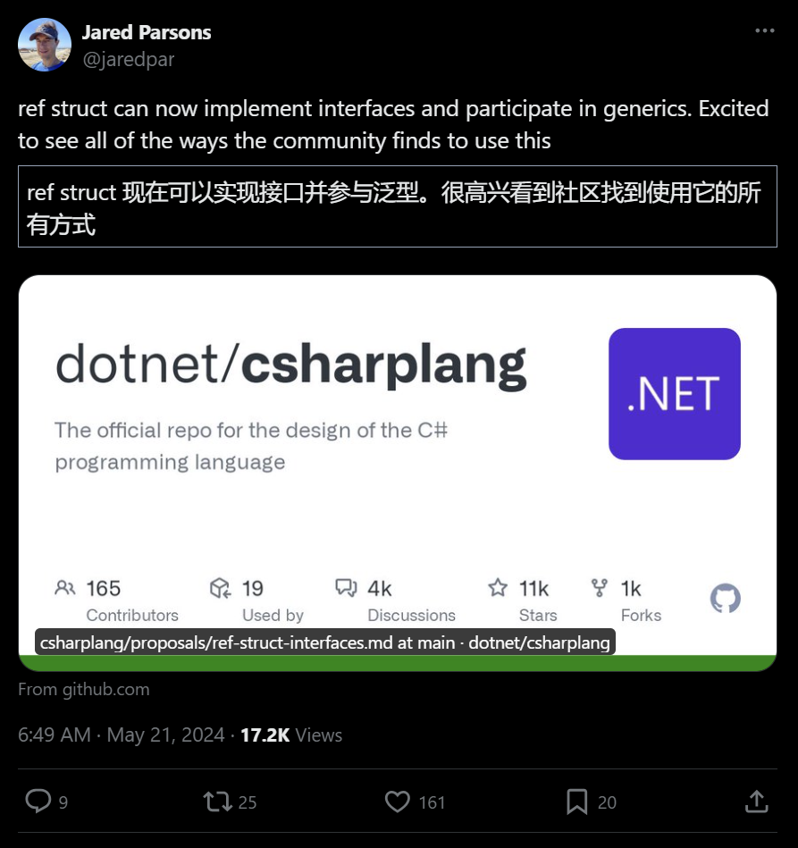

## 国内文章
### 开源低代码框架 ReZero API 正式版本发布 ，界面操作直接生成API

https://www.cnblogs.com/sunkaixuan/p/18201175

ReZero是一款.NET6+的中间件，采用MIT许可证开源，目的是降低.NET Core开发的门槛。它提供界面操作生成API的功能，支持集成到各种.NET项目中。它还提供了一系列的开发工具和功能，例如授权、ORM等，简化了.NET开发过程。此外，非.NET用户也可以通过exe文件使用ReZero。文档介绍了接口和表的创建过程，以及如何使用SQL工具。最后给出了源码和exe文件的下载地址。

### 一款开源的.NET程序集反编译、编辑和调试神器

https://www.cnblogs.com/Can-daydayup/p/18205068

本文主要讲述了.NET程序集反编译、编辑与调试工具dnSpyEx的使用方法，包括其主要功能、如何下载安装运行、以及工具的源代码和项目源码地址。dnSpyEx是dnSpy的非官方Fork维护版本，支持.NET Framework、.NET Core 和 Unity 程序集的编辑与调试，并提供多语言支持。文章还提到了创建测试项目、调试和编辑程序集代码的具体操作，并且指出该项目已被收录进C#/.NET/.NET Core优秀项目和框架精选中，同时鼓励读者为项目点赞支持。文末，作者推荐了DotNetGuide技术社区交流群，为.NET开发者提供一个资源分享和问题解决的平台。

### .NET下免费开源的PDF类库（PDFSharp）

https://www.cnblogs.com/laikwan/p/18206787

文章介绍了.NET 体系下常见的PDF类库并对其中的PDFSharp库进行了介绍。PDFSharp是一个基于.NET6的跨平台、免费开源（MIT协议）pdf处理库，作者对其功能表现出了满意。文中分享了使用PDFSharp结合MigraDoc生成PDF文件的个人经验，并提供了中文字体解析器的代码实现方法。作者表达了对Fluent API形式的喜爱，并提出了后续封装类似于QuestPDF的扩展库的想法。

### 聊聊一个差点被放弃的项目以及近期的开源计划

https://www.cnblogs.com/deali/p/18209560

博主讨论了自己开发的一些开源项目，重点介绍了单点认证项目IdentityServerLite（后更名为StarSSO）。由于团队系统增多，需要更完善的单点认证系统，博主考虑了C#生态中的IdentityServer4和OpenIddict，以及Go的casdoor和Java的Keycloak，均因复杂度或其他问题未选择。最后决定自己开发，技术栈包括AspNetCore等，但过程中遇到许多困难。博主还计划了其他项目，如EchoSubs、SnapMix等，并提到了基于C#的其他单点认证项目SimpleIdServer和基于NodeJS的loginto。

### .NET Aspire 正式发布：简化 .NET 云原生开发

https://www.cnblogs.com/shanyou/p/18205302

.NET团队于2024年5月22日发布了.NET Aspire，这是一个旨在简化.NET云原生服务开发的平台和语言无关的框架。该框架集成工具、模板和NuGet包，支持在Visual Studio、.NET CLI和Visual Studio Code环境下使用。通过安装.NET Aspire工作负载，开发者可以更容易地构建和部署分布式应用程序，特别是云原生的应用。.NET Aspire具备性能和分布式应用程序可观察性的功能，以及云原生框架支持。开发者可以在Microsoft Build大会上了解有关.NET Aspire的更多信息。

### .NET 中 Channel 类简单使用

https://www.cnblogs.com/kklldog/p/18201013/channel-in-net

System.Threading.Channels命名空间为生产者与消费者之间异步传递数据提供了同步数据结构。这个Library适用于.NET Standard，并在所有.NET实现上工作。通道是生产者/消费者概念编程模型的实现。通过Channel类，可以创建一个内存消息队列以模拟生产者消费者模型。生产者生产数据后，将数据异步写入通道，消费者则从通道中异步读取数据。示例展示了如何使用无界通道与有界通道，以及在使用中遇到的有关阻塞和并发的情况，展示了单生产者消费者模型和多生产者消费者共享同一个通道的情况。

### 微软正式发布：.NET Aspire 云原生开发框架

https://www.cnblogs.com/1312mn/p/18205776

2024年5月22日，微软发布了新的云原生开发框架.NET Aspire。该框架支持多种编程语言，旨在简化.NET云原生服务的开发。通过集成工具、模板和NuGet包等资源，.NET Aspire 提供微服务编排、基础服务访问和工具链支持，以构建可观测、生产就绪的分布式应用。.NET Aspire 可以通过.NET CLI、Visual Studio 和 Visual Studio Code 安装。此外，.NET Aspire 引入应用宿主项目来管理本地开发环境，优化开发体验并提供数据库、消息传递、缓存等服务的弹性连接和可观测性。

### .NET快速实现网页数据抓取

https://www.cnblogs.com/Can-daydayup/p/18208192

这篇文章介绍了如何使用.NET开源框架DotnetSpider进行网页数据抓取。文中以博客园的10天推荐排行榜为例，讲解了创建控制台应用、安装DotnetSpider NuGet包、添加日志组件、定义数据模型和编写爬虫逻辑等步骤，目标是将文章标题、简介和地址保存至txt文件。同时提醒开发者遵守国家法律法规。

### 微服务下认证授权框架的探讨

https://www.cnblogs.com/tibos/p/18208102

文章讨论了在微服务架构中进行认证授权的解决方案——认证中心，并借助JWT进行去中心化处理以减少认证中心压力。文章介绍了OAuth 2.0与其四种授权方式，在.NET环境中推荐了IdentityServer4和OpenIddict两个框架，并分享了如何通过IdentityServer4实现自定义登录页面、持久化到数据库的过程。作者通过实际代码示例展示了一个自定义登录功能的实现，并进行了简单的解释。

### 5款.NET开源、免费、功能强大的图表库

https://www.cnblogs.com/Can-daydayup/p/18200860

LiveCharts2、XCharts、ScottPlot、Blazor-ApexCharts和BlazorChartjs都是基于MIT License协议的.NET开源项目，可应用于多种平台和框架，实现数据可视化的图表库。这些项目已被收录于C#/.NET/.NET Core优秀项目和框架精选中。DotNetGuide技术社区为.NET开发者提供一个学习资源丰富、技术交流活跃的平台。

### Dapper升级SqlSugar问题汇总

https://www.cnblogs.com/sunkaixuan/p/18206516

这篇文章主要介绍了如何将Dapper迁移到SqlSugar，并列出了几个常见问题的解决办法。其中包括如何在SqlSugar中处理SQL中的IN参数、动态类型的属性访问、表值参数typeName的传递、类型转换，以及两者联表查询的差异。文章中还提供了一些代码示例，如创建容错的动态对象类和使用SqlSugar进行类型转换的方法。

### Asp .Net Core 系列：集成 CAP + RabbitMQ + MySQL（含幂等性）

https://www.cnblogs.com/vic-tory/p/18206656

CAP是一个事件总线框架，用于构建可扩展的微服务系统，并解决分布式事务问题。它支持多种消息传输器和持久层，例如RabbitMQ、Kafka、MySQL等。安装CAP需要在.NET Core项目中通过NuGet包管理器添加相关包。配置时，要设定RabbitMQ和数据库连接，并可以配置CAP的Dashboard和消息过期时间等参数。

### efcore如何优雅的实现按年分库按月分表

https://www.cnblogs.com/xuejiaming/p/18198827

本文介绍了ShardingCore框架，一种基于EF Core的高性能轻量级分库分表读写分离解决方案。文章从一个简单的案例开始，展示了如何编写GetRouteFilter方法，随后指导如何通过NuGet安装这一架构，并提供了一个按创建时间的年份分库、月份分表的用户订单实例。

### 记一次 .NET某酒店后台服务 卡死分析

https://www.cnblogs.com/huangxincheng/p/18201249

作者在帮助一个朋友分析C#程序线程池出现的http超时现象时，通过WinDbg分析发现线程池中全部的537个线程都处于运行状态，排队有82个任务，这是典型的线程饥饿现象。分析线程饥饿可能的原因，诸如优先级倾斜、死锁、资源竞争、不公平调度策略、线程阻塞和线程池配置不当等。作者使用命令检查线程的调用栈，以确定具体是哪一种情况导致的问题。

### Asp-Net-Core开发笔记：给SwaggerUI加上登录保护功能

https://www.cnblogs.com/deali/p/18204365

文章介绍了如何在.SwaggerUI中加入登录验证，作者通过自定义SwaggerAuthenticationHandler以基本认证（Basic Auth）的方式实现，避免使用硬编码，并利用Microsoft.AspNetCore.Authentication进行认证。介绍的方法适合于最新的.Net8平台。作者以实际项目IdentityServerLite为例，展示了配置Swagger的过程，并介绍了必要的服务注册。整个过程强调配置灵活性和安全性。

### C#.Net筑基-类型系统①基础

https://www.cnblogs.com/anding/p/18176086

C#.Net的基类库(BCL)提供了各种数据类型，最基础的包括值类型和引用类型，它们都是从System.Object派生而来。值类型包括基本的整数类型、浮点数、布尔、字符、枚举、结构体等，而引用类型包括对象、字符串、动态类型、接口、类、委托、数组、匿名类型和记录类型等。每个类型都可以转换成Object类型，因为Object是所有类型的祖先。文章还介绍了Object类的一些基础成员方法，如ToString(), Equals(), GetHashCode()等。

### C#.Net筑基-类型系统②常见类型

https://www.cnblogs.com/anding/p/18176136

结构体struct是一种轻量级的用户自定义值类型，适用于定义简单的局域性数据结构，可包含构造函数、字段、属性和方法。结构体是值类型，通常分配在栈上，但也可能存储在堆上，如作为类的成员。新增的readonly结构体和ref结构体分别用于创建不可变的值类型和只能存储在栈上的类型。Enum是一组基于整数类型的命名常量，利于表示固定的分类，常与Description特性及System.Enum类的API搭配使用。Flags特性允许枚举进行位操作，用于多选择场景。

### 上位机开发福利！快速掌握.NET中的Modbus通信

https://www.cnblogs.com/weskynet/p/18206594

本文介绍了如何安装并使用Wesky.Net.OpenTools包进行modbus通信，并提供了操作Modbus客户端的方法。介绍了使用IModbusReadWriteService接口进行读写测试，包括批量读取和写入数据，并解释了客户端参数实体类。提供了关于Modbus协议的文章链接以及测试读写效率的日志示例。文末促请读者关注作者的公众号Dotnet Dancer。

### NET9 AspnetCore将整合OpenAPI的文档生成功能而无需三方库

https://www.cnblogs.com/vipwan/p/18210947

OpenAPI标准用于描述HTTP API，ASP.NET Core框架默认不支持，但可以通过ApiExplorer提供的元数据、第三方工具和Microsoft.AspNetCore.OpenApi包实现支持。在.NET 6中对Minimal Api提供了支持，在.NET 7中通过WithOpenApi扩展方法修改了Endpoint的相关操作。ASP.NET Core将在.NET 9之后的版本中加入OpenAPI文档生成作为内置功能，使用最新预览版Visual Studio和.NET 9 preview4 SDK就可体验这一功能。

### .NET 中的表达式树

https://www.cnblogs.com/cqai/p/18202624

表达式树是.NET框架中的特性，以树形结构呈现代码，涵盖操作如方法调用、算术与逻辑运算。它支持运行时代码分析、修改与执行，应用于动态查询、动态编译、规则引擎以及代码生成。包含多个类如Expression、ParameterExpression等，用于代表不同的表达式和操作。通过示例代码说明表达式树的创建、编译和执行过程。

### Asp-Net-Core开发笔记：使用原生的接口限流功能

https://www.cnblogs.com/deali/p/18205858

这篇文章介绍了在.Net8环境下，利用ASP.NET Core原生的限流组件来实现接口限流，相比.Net6时期使用第三方组件AspNetCoreRateLimit，原生组件在配置和使用上更为简单，但功能上不如第三方灵活。文章通过实例展示了如何在程序中注册服务并配置固定窗口限流策略，并指出了配置限流中间件的位置顺序的重要性。最后，文章还提供了如何为特定接口添加限流策略的方法，并通过实际测试来验证配置效果。

### YiShaAdmin：一款基于.NET Core Web + Bootstrap的企业级快速开发框架

https://www.cnblogs.com/Can-daydayup/p/18203837

今天分享的YiShaAdmin是一个基于.NET Core Web和Bootstrap的后台开发框架与权限管理系统，特点是代码简明、界面清晰，使用MIT开源协议，适用于Web后端和移动端Api开发。功能上，包含员工、部门、角色等管理模块，特性有响应式布局、封装了JS插件、基于角色的访问控制以及一键生成代码。技术栈涵盖Bootstrap、.NET Core Web、多种缓存和数据库方案、定时任务和API文档工具。项目结构分为基础设施、数据库核心、业务逻辑、业务实体和前端五个层次。源码和文档在GitHub提供，同时该项目也被收录于C#/.NET/.NET Core优秀项目精选中。

### Clear Code for Minimal API

https://www.cnblogs.com/YataoFeng/p/18202396

本文介绍了如何通过使用C# 11特性中的接口静态虚拟成员来简化.NET Minimal API的代码编写。作者创建了带有静态抽象函数的接口IEndpointBase，并实现了相关类以组织API的声明和处理。作者还对MapGroup进行了扩展，使得对API进行分类更加清晰和有组织性。

### .NET8 Identity Register

https://www.cnblogs.com/YataoFeng/p/18206455

本文探讨了ASP.NET 8 Identity中注册API的源码实现，分析了使用邮箱确认方式注册用户账户的逻辑流程。详述了其实现中将用户标记为未验证状态，并在确认邮箱后更新为已验证的过程。同时，指出了该方法的优点如实现简单、用户体验好和提高安全性，缺点为可能增加数据库冗余和风险较高。接着，作者建议了一种更安全的方式，即延迟用户创建直至邮箱验证完成。这个过程包含用户注册、账户创建和邮箱验证等步骤。

### 【.NET项目分享】免费开源的静态博客生成工具EasyBlog,5分钟拥有自己的博客

https://www.cnblogs.com/msdeveloper/p/18201819/open-dotnet-easyblog

EasyBlog是一个利用GitHub Pages托管的静态博客生成系统，支持Markdown编写和git版本控制。特点包括极快的访问速度、支持搜索和筛选的博客列表以及移动端适配等。部署步骤简单，主要需要配置webinfo.json文件和提交代码，之后GitHub Action将自动构建和发布博客。系统还支持自定义主页内容、博客展示页面以及代码高亮样式，并可通过fork实现二次开发。

### C#的奇技淫巧：利用WinRM来远程操控其他服务器上的进程

https://www.cnblogs.com/weskynet/p/18213135

文章介绍如何通过WinRM在不开启远程桌面的情况下，远程执行服务器进程的查看、启动或封杀等操作。首先确保远程服务器启用WinRM，并配置好相应的防火墙规则；本地客户端网络要设置为专用网络并打开管理员权限的power shell以同样方式启用WinRM；配置TrustedHosts信任远程主机；确认远程服务器身份验证配置；使用System.Management.Automation包创建程序执行远程命令。可执行命令包括获取进程列表（Get-Process）、关闭进程（Stop-Process）和开始进程（Start-Process）。

### [原创]dotnet 命令行工具解决方案 PomeloCli

https://www.cnblogs.com/leoninew/p/18203243/pomelo_cli_intro

PomeloCli是基于Nate McMaster的CommandLineUtils和DotNetCorePlugins实现的一套命令行开发、管理、维护方案的原创开源项目。它解决了开发人员在操作系统上部署命令行工具时的多种问题，包括标准不一、文档匹配困难和配置管理混乱等。PomeloCli通过nuget服务发布，并提供了开发、集成、卸载命令行插件与宿主的完整流程，同时解决了编写命令行应用的一些常见问题。文档中也提供了快速起步的指导和示例代码。

### EDP .Net开发框架--权限

https://www.cnblogs.com/alwaysinsist/p/18190630

本文介绍了一个关于权限管理的平台，其权限分为“权限对象”和“授权对象”。权限对象涉及多个业务维度，授权对象则包含职务、部门等。权限的设置和管理是双向的，通过不同的维度进行配置。文中以业务模型和职务为例，展示了设置权限的流程，并说明了如何查看和删除权限。也举例了如何在代码中使用权限管理，包括属性访问控制和行级数据控制。

### 微服务实践k8s&amp;dapr开发部署实验（1）服务调用

https://www.cnblogs.com/shiningrise/p/18206124

本技术文章主要介绍了如何在Docker和Kubernetes（k8s）环境中使用Dapr运行.Net程序。文中首先说明了安装docker、dapr和k8s的前置条件，并随后详细介绍了在dapr自托管模式下运行.Net WebAPI项目的步骤，包括更改配置文件、控制器代码，并展示了如何使用dapr命令行来启动应用并进行服务调用。接着，文章指导读者如何创建新的项目，并通过引入Dapr.Client NuGet包来调用已通过Dapr运行的后端服务。最后简略提到了在k8s中使用Dapr的卸载命令。

### 推荐2款开源、美观的WinForm UI控件库

https://www.cnblogs.com/Can-daydayup/p/18211642

大姚分享了两款开源WinForm UI控件库：ReaLTaiizor和AntdUI。ReaLTaiizor提供多样组件和主题，使得创建桌面应用更加便捷美观。AntdUI基于Ant Design设计语言，也是开源的。这些库都被收录在C#/.NET/.NET Core项目精选中。DotNetGuide技术社区为.NET开发者提供学习资料、技术分享、项目推荐等。

### 从需求角度介绍PasteSpider(K8S平替部署工具适合于任何开发语言)

https://www.cnblogs.com/pastespider/p/18204745

PasteSpider是一款使用C#编写的Linux容器部署工具，它操作简单、节省资源，支持Sqlite/Postgresql数据库和集群部署。该工具与项目的开发语言无关，只需满足几个条件：需要在Linux上运行、为纯静态或可以打包进Docker或Podman容器内。它无需复杂配置，而是以图形界面和编程命令的方式运行，不会影响主服务运行。PasteSpider注重资源效率和服务部署的简单性，并支持多服务项目部署、环境区分、Nginx路由配置和仓库管理功能。

### Semantic Kernel入门系列：利用Handlebars创建Prompts functions

https://www.cnblogs.com/ruipeng/p/18207414

本文介绍了在Semantic Kernel C#中利用Handlebars Prompts Template创建Prompts functions的过程。Handlebars是一个JavaScript模板引擎，能生成动态HTML，本指南通过详细的步骤，包括创建项目、安装Nuget包、使用Handlebars Prompts Templates以及创建和执行提示函数，教导读者如何配置和使用Handlebars作为格式化引擎，同时指出了Handlebars与默认设置的区别。最后，通过一个示例展示了Prompt function的实用性和生成文本输出的能力。

### .NET集成DeveloperSharp实现http网络请求&amp;与其它工具的比较

https://www.cnblogs.com/digital-college/p/18214180

DeveloperSharp系列支持.Net Core2.0及以上和.Net Framework4.0及以上，提供了http请求调用功能。其HttpPost方法用于发送Post请求，此外还有HttpGet方法处理Get请求。文章提到除了Post和Get以外的请求方法在实际开发中用得较少，并比较了DeveloperSharp与市面上其它工具，指出许多工具不能处理特殊情况，而DeveloperSharp将Content-Type作为参数提供了更好的灵活性。

### IceRPC之深入理解调度管道-&gt;快乐的RPC

https://www.cnblogs.com/xlgwr/p/18212782

本文介绍了IceRPC的调度管道，包括传入请求的处理、传出响应的创建与中间件的使用。详述了传入请求的组件，比如目标服务路径、操作名称、请求字段和有效负载。还阐释了特性在本地通信和管道中的应用，例如利用IDispatchInformationFeature进行通信。文章还描述了传出响应的构成，包含状态代码和响应有效负载分割。文章对中间件的安装和编写、请求的中间件拦截、路由器和基于路径的路由进行了详细解释，其中使用流程图辅助说明路由的概念。

### Avalonia中的线性渐变画刷LinearGradientBrush

https://www.cnblogs.com/czwy/p/18204994

本文讲述了作者在WPF中使用Shape进行复杂线条动画，尝试在Avalonia中复现时遇到的问题和解决方法。WPF中的LinearGradientBrush使用StartPoint和EndPoint进行渐变色填充。Avalonia与WPF在线性渐变画刷的使用上有所不同，要用百分比表示位置。经过多次实验，作者发现三角形填充色问题与其坐标位置有关，并通过调整坐标成功实现了渐变效果，最后通过绘制更大的正方形验证了自己的猜测。

### Biwen.Settings添加对IConfiguration&amp;IOptions的集成支持

https://www.cnblogs.com/vipwan/p/18204135

Biwen.Settings是一个用于校验和持久化配置项的模块，支持将配置存到数据库或JSON文件。使用者通过定义配置类如GithubSetting，并在服务中注入即可使用。此外还可实现IConfigurationProvider接口，如BiwenSettingConfigurationProvider，以支持IConfiguration和IOptions。该模块特性包括直接对象注入和自动刷新配置等功能。

### 开源项目分享：ChatGPT 控制台聊天应用

https://www.cnblogs.com/cqai/p/18209196

该开源项目是一个基于.NET8的ChatGPT控制台聊天应用，支持多种AI模型，提供简单的命令行界面让用户与ChatGPT互动。用户可以通过克隆GitHub仓库、配置API Key及大模型服务地址来使用此应用。项目鼓励社区贡献，并欢迎提交问题和反馈。

### IceRPC之多路复用传输&gt;快乐的RPC

https://www.cnblogs.com/xlgwr/p/18213460

本文介绍了IceRPC框架和其基于IceRPC协议的多路复用传输特性。IceRPC协议是应用层协议，通过多路复用连接传输RPC请求与响应，避免混淆小写拼写icerpc。利用多路复用传输如QUIC，icerpc能在一个连接上独立传输多个请求和响应，消除队头阻塞问题。而IceRPC的Slic传输层能够在传统的TCP上实现这种机制。文章还提供了一些使用C#创建icerpc连接的示例代码，说明了如何结合Slic和TCP使用。作者强调以官方文档为主要学习资源的重要性，并鼓励持续实践以提升技能。

### 微服务实践k8s&amp;dapr开发部署实验（2）状态管理

https://www.cnblogs.com/shiningrise/p/18214159

本文介绍了如何创建一个支持Dapr的Web API项目、其相关配置及部署到Kubernetes的步骤。首先取消项目的https支持并添加docker支持；修改Program.cs文件以禁用开发环境中Swagger的条件限制，并增加Dapr SDK支持。修改WeatherForecastController.cs，通过Dapr.Client包进行状态管理。同时，还提供了部署到K8s所需的redis.yaml和statestore.yaml配置文件示例。

### Semantic Kernel入门系列：利用YAML定义prompts functions

https://www.cnblogs.com/ruipeng/p/18205081

本章节教程讲述了如何使用YAML文件定义Semantic Kernel中的prompts functions。YAML提供结构化数据格式，便于管理和维护代码。教程中指导了如何通过VS创建项目和安装必要的Nuget包，然后编写YAML文件来创建一个生成笑话的提示函数。最后通过加载YAML文件，利用Semantic Kernel创建并调用了此提示函数。

### 【ESP32】制作 Wi-fi 音箱（HTTP + I2S 协议）

https://www.cnblogs.com/tcjiaan/p/18212730

文章讨论了使用Wifi传输音频数据相较于蓝牙的优势，以及如何通过ESP32和I2S进行音频数据传输。作者提到通过Wifi可以直接传输PCM数据，无需编码和压缩，而I2S传输的是数字信号，需连接到功放芯片转换后才能驱动喇叭。作者分享了自己使用NS4168功放芯片制作WiFi音响的经验，以及在服务器上使用ASP.NET Core实现音频传输的过程。原计划使用.NET Nano Framework但在多个开发板上失败后，改用esp-idf SDK。最后，文章详细介绍了ESP32的客户端配置和Wifi初始化的技术细节。

### aspnetcore插件开发dll热加载 二

https://www.cnblogs.com/morec/p/18211276

本文介绍了在ASP.NET Core项目中如何实现业务逻辑和主机服务的动态分离，包括动态加载和卸载DLL、控制器的动态添加和删除。文章展示了IActionDescriptorChangeProvider接口和AssemblyLoadContext的使用，解释了如何通过配置文件管理模块化开发，以及IModule接口在模块连接中的角色。文中还包含了项目配置文件的示例和一些关键代码片段的解释。

### 深入学习Semantic Kernel：创建和配置prompts functions

https://www.cnblogs.com/ruipeng/p/18203015

本章介绍Semantic Kernel中的prompts functions（提示函数）概念和创建方法。提示工程对于大语言模型（LLM）的有效交互至关重要，它涉及精细选择单词、短语等以引导模型生成高质量文本。Semantic Kernel通过提供扩展方法允许通过Prompts创建KernelFunction，核心依赖PromptTemplateConfig配置。PromptTemplateConfig类定义了函数的属性，包括名称、描述、模板格式等，它是定义配置模板的基础。

### 基于webapi的websocket聊天室（番外二）

https://www.cnblogs.com/ggtc/p/18206016

文章介绍了如何创建一个能处理HTTP和WebSocket请求的简易webapi服务器。作者首先比较了两种请求的相似之处，主要是头部字段的不同。文章提供了http请求和websocket请求过程的详细说明，包括客户端和服务端交互的步骤和消息格式。然后，展示了如何解析消息和判断是否为websocket连接请求。最后，提供了一段完整的关于建立服务器的示例代码。

### 基于webapi的websocket聊天室（番外一）

https://www.cnblogs.com/ggtc/p/18202984

本文介绍了在实现聊天室时考虑的问题，包括系统网络缓冲区的作用、WebSocket对象内部缓冲区的大小及其处理超大消息的机制，以及在同一端口上如何区分和管理多个WebSocket连接和HTTP服务器的连接问题。同时，作者进行了一些实际的测试和代码实验，探索操作系统如何管理不同的TCP连接，并通过代码示例展示了如何手动管理TCP连接和开启聊天线程。

### IceRPC之调度管道-&gt;快乐的RPC

https://www.cnblogs.com/xlgwr/p/18212263

文章介绍了IceRPC的调度管道概念，包括定义、调度的抽象过程以及IDispatcher接口代码实现。解释了在C#中如何配置服务器和客户端的调度程序，并介绍了调度类型，包括叶调度（Leaf dispatcher）、中间件（Middleware）和路由器（Router）。文章末尾提到了调度过程的流程图和作者的结语。

### C#应用的用户配置窗体方案 - 开源研究系列文章

https://www.cnblogs.com/lzhdim/p/18203928

本文介绍了作者对软件用户配置窗体进行模块化处理的过程和方法。作者提出，通过将配置窗体剥离至独立的Dll类库中，可以在不同应用程序中实现快速复用。文中还提供了其他模块化方案的例子，并详细说明了如何使用配置窗体类库，包括类库的复制、调用和设置应用相关内容的步骤。为方便读者，还提供了源码下载链接，并鼓励读者根据自身需求定制类库内容。

## 主题

### Microsoft Build 2024 的 .NET 公告和更新 - .NET 博客
https://devblogs.microsoft.com/dotnet/dotnet-build-2024-announcements/

Microsoft Build 2024 上的 .NET 公告和更新。

- 人工智能相关
    - 引入`Tensor<T>`类型
    - 引入智能组件
    - 扩大AI生态系统
    - 监控LLM申请
        - 语义内核遥测
- 使用.NET进行云原生开发
    - .NET Aspire GA
    - Linux 原生 .NET
        - 从 Ubuntu 和 RedHat 等官方源安装
        - Ubuntu 凿刻容器
    - 减少内存使用
        - .NET 9 中的服务器 GC 发生变化以减少使用
- C#13
    - `params` 扩展
    - `params` 支持 `Span<T>`
    - `params` 和接口
    - 扩展类型
- Web开发
    - 内置 OpenAPI 文档生成
    - 使用 HybridCache API 的分布式缓存
    - 由 Blazor 提供支持的全栈 Web UI
        - 组件构造函数注入
        - WebSocket 压缩
        - 全局交互应用程序中的静态页面生成
- 多平台开发

### .NET Aspire 正式发布：简化 .NET 云原生开发 - .NET 博客
https://devblogs.microsoft.com/dotnet/dotnet-aspire-general-availability/

.NET Aspire 现已正式发布（GA）。

它可通过 Visual Studio 2022 版本 17.10、最新的 .NET CLI 和 Visual Studio Code 获取。

本文解释了选择 .NET Aspire 的原因、通过 App Host 项目获得的本地开发体验、在仪表板中查看 OpenTelemetry 数据的能力、第三方组件、云配置/部署等。

- [使用 Aspire 开发云原生应用程序 - Visual Studio 博客](https://devblogs.microsoft.com/visualstudio/developing-cloud-native-apps-with-aspire/)

### Visual Studio 2022 17.10 和 GitHub Copilot：您的编码合作伙伴，实现更快、更智能的开发 - Visual Studio 博客
https://devblogs.microsoft.com/visualstudio/visual-studio-2022-17-10-now-available/

Visual Studio 2022 版本 17.10 已发布。

此版本将之前作为扩展提供的 GitHub Copilot 和 Copilot Chat 集成到 Visual Studio 中，文章包括 GitHub Copilot 的编码经验、高效调试、测试脚手架等介绍。

- [Visual Studio 2022 版本 17.10.0 | Visual Studio 2022 发行说明 | Microsoft Learn](https://learn.microsoft.com/ja-jp/visualstudio/releases/2022/release-notes#17.10.0)

### 宣布推出 NuGet 6.10 - NuGet 博客
https://devblogs.microsoft.com/nuget/announcing-nuget-6-10/

NuGet 6.10 已发布。

此版本包括一些改进，例如添加“dotnet nuget config”命令、“packages.config”的漏洞审核以及缓存凭据的使用。

### .NET 9 预览 4 · 问题 #309 · dotnet/公告
https://github.com/dotnet/announcements/issues/309

.NET 9 Preview 4 已发布。

- 对“UnsafeAccessorAttribute”的通用参数支持
- 裁剪支持功能开关
- 分词器库增强
- OpenTelemetry：更灵活的活动链接
- PDB 对“System.Reflection.Emit.PersistedAssemblyBuilder”的支持
- .NET 数据和 EF Core
    - 针对 NoSQL 提供程序的 Azure Cosmos DB 的增强
    - 复杂的分组依据
    - 只读原始集合
- .NET MAUI
    - 新的输入键盘
    - Android 15 Beta 1 支持- 针对 iOS 和 Mac Catalyst 的 NativeAOT 改进
- ASP.NET Core
    - 对 OpenAPI 文档生成的内置支持
    - 引入混合缓存
    - 改进了开发人员的异常页面
    - 为 QuickGrid 添加了 OverscanCount 参数
    - 用于全球交互式 Blazor Web 应用程序的静态 SSR 页面
    - 在 IIS 上的应用程序回收期间避免 503
- WPF
    - 主题改进：Windows 11 主题支持
    - 基于连字符的连字支持

### Visual Studio 2022 v17.11 首次预览 - Visual Studio 博客
https://devblogs.microsoft.com/visualstudio/first-preview-of-visual-studio-2022-v17-11/

Visual Studio 2022 版本 17.11 预览版 1 已发布。

此版本的改进主要集中于提高开发人员和工作负载的生活质量。

- [版本 17.11 预览版 1 | Visual Studio 2022 预览版发行说明 | Microsoft Learn](https://learn.microsoft.com/ja-jp/visualstudio/releases/2022/release-notes-preview#version-1711-preview-1)

### 通过出色的开发人员体验最大化乐趣并最小化工具 - Visual Studio 博客
https://devblogs.microsoft.com/visualstudio/maximizing-joy-and-minimizing-toil-with-great-developer-experiences/

为专注于 Microsoft Build 2024 上发布的新产品和功能的开发人员进行介绍。

- Visual Studio 2022 17.10 正式发布
- Azure 预览版的 GitHub Copilot
- .NET Aspire 全面上市
- 发布 Visual Studio Code 的 AI 工具包
- 在Azure API管理中生成AI网关
- Azure API 中心全面可用
- Azure 容器应用程序的沙箱执行（动态会话）
- Microsoft Dev Box 和 Azure 部署环境中的新功能

## 文章、幻灯片等
### WinUI3 项目中未找到 Microsoft.UI.Xaml.dll 错误
https://zenn.dev/nin_neko/articles/1085f4cc2ca6d6

关于使用最新Visual Studio中包含的WinUI 3项目模板调试非包时出现错误的问题以及解决方法。

### 基于C#的开源CMS“Orchard Core”环境搭建
https://zenn.dev/zead/articles/orchardcore-setup

从模板创建和启动 Orchard Core 的说明。

### .NET 8 中的 ShortCircuit 和 MapShortCircuit 简介
https://dev.to/moh_moh701/introduction-to-shortcirc-and-mapshortcirc-in-net-8-12ml

关于 .NET 8 中 ASP.NET Core 中引入的 `ShortCircuit` 和 `MapShortCircuit`。

### 事件处理程序名称中前缀“on”的解释
https://zenn.dev/lilytechlab/articles/ba599338ce469b

讨论事件处理程序名称中通常使用的“On”前缀。

### 使用 .NET 反应式扩展观察文件系统变化 | endjin
https://endjin.com/blog/2024/05/observe-file-system-changes-with-rx-dotnet

关于使用 Rx 编写代码来监视文件系统上的更改。

### .NET 9 LINQ 性能版
https://steven-giesel.com/blogPost/783a404a-e39e-480f-bc99-a514a75d752d

与 .NET 8 相比，.NET 9 中引入的 LINQ 运算符得到了改进。

### 我使用 Project IDX 的 Beta 版创建了 .NET 6 和 Azure Functions 的开发环境 - Qiita
https://qiita.com/mnrst/items/3f15c85167efe846ee2c

使用 Google 基于浏览器的 IDE 项目 IDX 构建 .NET 6 和 Azure Functions 开发环境的步骤。

### [.NET]使用Roslyn进行句法分析和语义分析的总结-LIGHT11
https://light11.hatendiary.com/entry/2024/05/20/190949

Roslyn 中解析代码的解释。文章讲了句法分析和语义分析。

## 网站、文档等
### 推文

谈论“ref struct”接口。 （已合并到Roslyn）

https://x.com/jaredpar/status/1792689177206882745?s=12

## 版权声明

* 国内板块由 InCerry 进行整理 : https://github.com/InCerryGit/WeekRef.NET
* 其余内容来自 Myuki WeekRef，由InCerry翻译（已获得授权） : https://github.com/mayuki/WeekRef.NET

**由于笔者没有那么多时间对国内的一些文章进行整理，欢迎大家为《.NET周刊-国内文章》板块进行贡献，需要推广自己的文章或者框架、开源项目可以下方的项目地址提交Issue或者在我的微信公众号私信。**

格式如下：

* 10~50字左右的标题
* 对应文章或项目网址访问链接
* 200字以内的简介，如果太长会影响阅读体验

https://github.com/InCerryGit/.NET-Weekly

## .NET性能优化交流群

相信大家在开发中经常会遇到一些性能问题，苦于没有有效的工具去发现性能瓶颈，或者是发现瓶颈以后不知道该如何优化。之前一直有读者朋友询问有没有技术交流群，但是由于各种原因一直都没创建，现在很高兴的在这里宣布，我创建了一个专门交流.NET性能优化经验的群组，主题包括但不限于：

* 如何找到.NET性能瓶颈，如使用APM、dotnet tools等工具
* .NET框架底层原理的实现，如垃圾回收器、JIT等等
* 如何编写高性能的.NET代码，哪些地方存在性能陷阱

希望能有更多志同道合朋友加入，分享一些工作中遇到的.NET性能问题和宝贵的性能分析优化经验。**目前一群已满，现在开放二群。**

如果提示已经达到200人，可以加我微信，我拉你进群: **ls1075**

另外也创建了**QQ群**，群号: 687779078，欢迎大家加入。 

