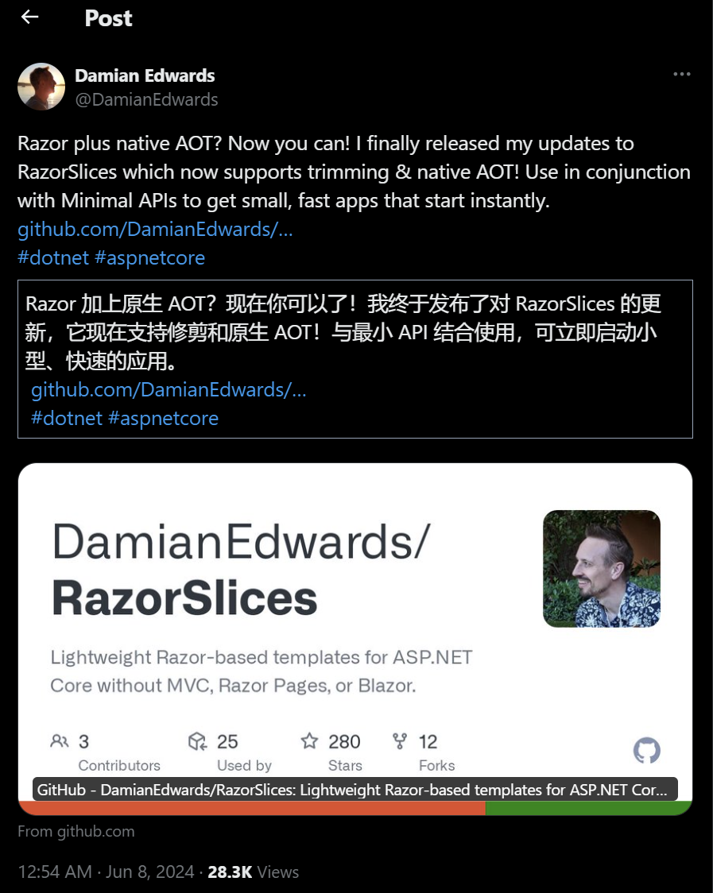

## 国内文章
### 记一次 .NET某游戏币自助机后端 内存暴涨分析

https://www.cnblogs.com/huangxincheng/p/18243233

文章讨论了程序中非托管内存暴涨的问题。作者描述了友人发现内存问题并请他帮助分析的背景，利用WinDbg工具分析Linux平台上的内存泄漏情况。文章介绍了如何使用WinDbg中的maddress命令替代!address -summary来跨平台分析内存。通过详细的分析过程，文章帮助读者理解解决此类问题的思路和方法。

### 一款.NET开源、功能强大、跨平台的绘图库 - OxyPlot

https://www.cnblogs.com/Can-daydayup/p/18244816

本文介绍了跨平台、多功能的.NET开源绘图库OxyPlot，并详细说明了该库在WindowsForm项目中的运行方法。作者还提供了项目源码的链接，并鼓励读者关注更多优秀的C#/.NET/.NET Core项目和框架。文末推荐了DotNetGuide技术社区，旨在为.NET开发者提供学习资料和交流平台。

### NET8中增加的简单适用的DI扩展库Microsoft.Extensions.DependencyInjection.AutoActivation

https://www.cnblogs.com/vipwan/p/18242343

这个库提供启动期间实例化已注册单例，而不是首次使用时实例化，减少首次Request请求的延迟。以往需手动初始化，而使用Microsoft.Extensions.DependencyInjection.AutoActivation后，写法更简单：注册服务并直接实例化。AutoActivation内部实现了AutoActivationHostedService，系统启动时从IServiceProvider中取出所有注册的单例。提供多种扩展方法，便捷激活单例。

### 一个开源且全面的C#算法实战教程

https://www.cnblogs.com/Can-daydayup/p/18244728

文章介绍了算法在计算机科学和程序设计中的重要性，并推荐了一个免费开源的C#算法教程。这些算法涵盖排序、搜索、数值计算、字符串算法、数据结构、图算法等。详细描述了插入排序和快速排序的实现方法，并强调了项目的教育意义和用途。

### 在.NET Core，除了VB的LikeString，还有其它方法吗？(四种LikeString实现分享)

https://www.cnblogs.com/VAllen/p/18243038/Are-there-any-other-methods-besides-VB-LikeString-in-the-dotNET-Core

本文讨论了在C#中实现VB中的Like运算符的四种方法，最后一种是通过正则表达式实现。这些方法包括Operators.LikeString、LikeOperator.LikeString、FileSystemName.MatchesSimpleExpression和RegexLikeOperator.LikeString。每种方法的描述、平台兼容性和相关链接都有详细说明。

### 开源高性能结构化日志模块NanoLog

https://www.cnblogs.com/BaiCai/p/18241681

本文介绍作者自制的高性能结构化日志记录组件NanoLogger。首先展示了其使用方法，包括如何记录各种类型的日志信息。接着通过性能测试，将NanoLogger与Microsoft.Extensions.Logging进行了比较，结果表明前者性能显著优于后者。文章详细介绍了NanoLogger的实现原理，包括日志消息的序列化和多生产者-单消费者队列处理模式。最后，作者提到该工具支持结构化日志搜索，并提供了GitHub链接供读者参考。

### .NET 使用 OpenTelemetry metrics 监控应用程序指标

https://www.cnblogs.com/kklldog/p/18241085/opentelemetry-metrics

本文讨论了 OpenTelemetry Metrics 在 .NET 生态系统中的应用，重点介绍了如何监控 ASP.NET Core 和 Runtime 的指标。首先通过 nuget 安装相关包，并在启动时配置必要服务。然后，通过 OpenTelemetry 协议将指标发送给 Prometheus。文章还展示了自定义指标的实现方法，包括定义一个 MyMeterService 类和修改服务配置代码。最后，通过 Prometheus 查看 ASP.NET Core 和 .NET runtime 相关的指标。

### NET9 提供HybridCache解决分布式缓存中存在的远程链接&amp;序列化带来的性能问题

https://www.cnblogs.com/vipwan/p/18240737/net9-hybridcache

文章介绍了在.NET中使用IDistributedCache缓存数据的典型用例，并指出其性能瓶颈。为解决这些问题，.NET 9引入了HybridCache，将本地IMemoryCache与IDistributedCache结合，提供二级缓存机制。通过简洁的代码示例展示了HybridCache的注册及在Minimal API中的应用。

### 发现XWPFDocument写入Word文档时的小BUG：两天的探索与解决之旅

https://www.cnblogs.com/xbingyou/p/18174975

本文记录了作者在使用XWPFDocument生成Word文档时遇到“未将对象引用设置到对象的实例”错误的分析和解决过程。作者详细描述了如何通过日志、调试一步步排查问题，最终发现是由于设置段落时赋值了空值。作者在代码中加入判断，避免空值赋值，并成功解决了问题。此次经历让作者对代码健壮性和资源管理有了更深的理解，并分享了自己的收获和感悟。

### C#开发的目录图标更改器 - 开源研究系列文章 - 个人小作品

https://www.cnblogs.com/lzhdim/p/18233566

本文介绍了利用C#开发一个快速更改文件夹图标的小应用，详细描述了项目目录、源码获取与应用、运行界面、使用方法，并提供源码下载链接，可满足大多数需求。

### PasteSpider的集群组件PasteCluster(让你的项目快速支持集群模式)的思路及实现(含源码)

https://www.cnblogs.com/pastespider/p/18244253

PasteSpider是一款用.net编写的开源Linux容器部署助手，支持一键发布、平滑升级、自动伸缩等多种功能，方便开发人员在Linux上部署项目。PasteCluster是配套使用的中间件，能快速支持.NET项目的集群模式。它通过ClusterConfig配置可以轻松集成现有项目，保障集群运行的安全性和稳定性。

### 记一次 .NET某工厂报警监控设置 崩溃分析

https://www.cnblogs.com/huangxincheng/p/18246160

文章主要描述作者如何帮助朋友分析Windows程序崩溃的dump文件。通过在WinDbg中使用!analyze -v命令，确定了崩溃原因是典型的访问违例错误（c0000005）。从异常记录和堆栈信息中，发现程序崩溃发生在JIT自动插入的一条this!=null防御性判断语句处，说明程序出现了this为null的情况。

### 【译】Visual Studio 17.10 发布了新版扩展管理器

https://www.cnblogs.com/MeteorSeed/p/18240681

Visual Studio 17.10 引入了新的扩展管理器，以现代化的 UI 简化了扩展的发现和管理。用户可以在不用离开 Visual Studio 的情况下搜索和管理扩展。新的功能包括左边栏的主视图选择和过滤搜索选项。用户反馈仍然受到重视，且可以通过简单的设置切换回旧版本。

### 解读surging 的内存过高的原因

https://www.cnblogs.com/fanliang11/p/18242810

文章讨论了.NET程序内存管理问题，特别是内存泄漏现象。作者通过客户反映的问题，分析了DotNetty.Buffers.PooledByteBufferAllocator导致的堆内内存和堆外内存管理问题，并提出了两种解决方案：高性能方案和低内存方案。高性能方案通过设置最大内存和使用服务器垃圾收集器解决，低内存方案则通过不分配堆外内存和配置Netty参数解决。文章最后建议有需要的用户可联系作者获取更多版本信息。

### 简单的限流过滤器

https://www.cnblogs.com/zj19940610/p/18244414

API接口暴露给用户存在安全隐患，可以通过增加一个全局过滤器，获取客户端IP并限制访问频率。代码示例展示了如何创建一个RateLimitFilter过滤器，限制每分钟请求数不超过30次。

### 高性能版本的零内存分配LikeString函数（ZeroMemAllocLikeOperator）

https://www.cnblogs.com/VAllen/p/18245425/High-performance-and-zero-memory-allocation-LikeString-function-implementation

文章探讨了在.NET Core中如何通过使用ReadOnlySpan等结构类型来实现LikeString函数，以达到高性能和零内存分配的效果。具体代码实现展示了如何处理包含通配符和大小写敏感性的字符串比较。

### WPF/C#：程序关闭的三种模式

https://www.cnblogs.com/mingupupu/p/18243656

本文介绍了WPF应用程序的ShutdownMode枚举类型，包括OnLastWindowClose、OnMainWindowClose和OnExplicitShutdown三种关闭方式，并通过示例代码展示了如何在MainWindow中实现这些关闭模式。

### 使用Wesky.Net.OpenTools包来快速实现嵌套型结构体数据转换功能

https://www.cnblogs.com/weskynet/p/18244720

文章探讨了结构体和byte数组互转的问题，并详细介绍了如何实现结构体、复杂结构体嵌套等转换。作者引入了Wesky.Net.OpenTools的nuget包，并通过实验证明了转换功能。文章介绍了转换器的选择和内部实现，包括针对简单和复杂结构体的不同处理方式，通过代码示例说明了如何判断结构体是否包含复杂字段，并展示了转换器工厂类和IStructConvert接口的定义。

### Semantic Kernel入门系列：通过依赖注入管理对象和插件

https://www.cnblogs.com/ruipeng/p/18241147

本章讲解在Semantic Kernel中使用依赖注入，通过示例展示如何创建和使用Kernel对象。定义了一个LightPlugin插件，包括获取和改变灯状态的方法。介绍了Kernel对象的两种创建方式，并详细说明了AddKernel扩展方法的使用。最后演示了如何在依赖注入中注册Kernel对象和插件，使其易于管理和复用。

### wpfui：一个开源免费具有现代化设计趋势的WPF控件库

https://www.cnblogs.com/mingupupu/p/18245521

wpfui是一个开源免费的WPF界面库，提供现代化设计体验。作者通过自己的使用经验详细介绍了该库的各个部分，包括Wpf.Ui.Demo.Console、Wpf.Ui.Demo.Mvvm、Wpf.Ui.Demo.Simple和Wpf.Ui.Gallery。此外，文章说明了如何在自己的WPF项目中添加wpfui，包括添加字典、命名空间和控件，同时提供了具体代码示例。最后，文章通过实例展示了按钮和图标的使用方法，并强调了文档和实例的参考价值。

### 使用Blazor WebAssembly整合PocketBase的基础项目模板

https://www.cnblogs.com/neozhu/p/18245710

这篇文章介绍了如何使用Blazor WebAssembly与PocketBase整合，创建一个包含用户身份验证、注册和密码找回功能的基础项目。文章提供了详细的设置步骤和代码示例，包括安装所需的工具、创建项目、集成PocketBaseClient以及在Docker中部署项目等内容。这个项目模板适合初学者，是快速启动小项目的优秀方案。

## 主题

### Visual Studio Code 的 .NET MAUI 扩展现已正式发布 - .NET 博客
https://devblogs.microsoft.com/dotnet/the-dotnet-maui-extension-for-visual-studio-code-is-now-generally-available/

Visual Studio Code 的 .NET MAUI 扩展现已普遍可用。

此版本改进了 XAML 编辑体验、热重载等。此扩展构建在 C# 开发工具包和 C# 扩展之上，因此需要类似的许可证。

### 版本 1.5.4 (1.5.240607001) - Windows App SDK 稳定通道发行说明 - Windows 应用
https://learn.microsoft.com/ja-jp/windows/apps/windows-app-sdk/stable-channel#version-154-15240607001

Windows App SDK 1.5.4 已发布。

此版本修复了多个错误，包括 WebView2 的问题。

### .NET 9 预览版 5 · dotnet/core · 讨论 #9350
https://github.com/dotnet/core/discussions/9350

.NET 9 Preview 5 已发布。

- 针对 AI 的“`TensorPrimitives`”和“`Tensor<T>`”增强功能
- `Span` 重载中的 `params`
- 使用“SearchValues”搜索字符串
- `Task.WhenEach` 允许您从已完成的任务中进行 `foreach`
- 优先无界通道
- 更灵活的 OpenTelemetry 活动链接
- TypeDescriptor 修剪支持
- 类型名称解析

### Rider 2024.1.3 和 ReSharper 2024.1.3 更新已推出！
https://blog.jetbrains.com/dotnet/2024/06/10/rd-rsrp-2024-1-3/

Rider 和 ReSharper 2024.1.3 已发布。

在此版本中，Rider 和 ReSharper 都添加了对检测 Razor 中不必要的 PartialAsync 调用的支持，并且 Rider 包括安全修复、对最新 SDK Roslyn 的支持以及其他 UI 改进。

## 文章、幻灯片等
### 静态大小、动态大小等。
https://fractalfir.github.io/generated_html/rustc_codegen_clr_v0_1_3.html

关于我在开发将 Rust 编译为 MSIL 的后端时遇到的一个错误。

### 将 PostgreSQL 与 .NET 和 Entra ID 结合使用 - .NET 博客
https://devblogs.microsoft.com/dotnet/using-postgre-sql-with-dotnet-and-entra-id/

了解如何使用 .NET Aspire 中的 PostgreSQL 以及如何使用 Entra Identity 通过托管身份保护 PostgreSQL。

### 将性能监视器添加到您的 NUnit 测试中
https://medium.com/@nw_enterprise/add-performance-monitor-to-your-nunit-tests-a716de6d74ac

使用 NUnit 运行单元测试时如何从性能计数器获取和监视 CPU 使用情况和内存使用情况。

### 不创建微服务的人对 .NET Aspire 的概述（通常有用）
https://zenn.dev/microsoft/articles/dotnet-aspire

.NET Aspire 及其提供的各种功能的概述。

### neue cc - ConsoleAppFramework v5 - 用于 C# 的 CLI 框架，具有零开销和本机 AOT 支持
https://neue.cc/2024/06/13_ConsoleAppFramework_v5.html

新重写的基于 Source Generator 的 CLI 框架 ConsoleAppFramework 的技术解释。

### C# 数组和列表 2024 年最快循环 - NDepend 博客
https://blog.ndepend.com/c-array-and-list-fastest-loop/

2024 年 C# 中数组和列表的循环性能研究。

### 了解 17.10 GA 中最新的 Git 工具功能 - Visual Studio 博客
https://devblogs.microsoft.com/visualstudio/catch-up-on-the-latest-git-tooling-features-in-17-10-ga/

Visual Studio 2022 17.10 中的 Git 工具功能引入了新功能。

- 生成提交消息
- 生成拉取请求描述
- 解释提交历史
- 从 Visual Studio 创建带有链接工作项的拉取请求 (Azure DevOps)

### Visual Studio 2022 - 17.10 性能增强 - Visual Studio 博客
https://devblogs.microsoft.com/visualstudio/visual-studio-2022-17-10-performance-enhancements/

解释 Visual Studio 2022 17.10 中的性能改进17.10 包括一些改进，例如更快地加载 Windows 窗体设计器、更快地在 Razor 中对 C# 代码着色、更快地加载 .NET 解决方案以及重构和调整以加载更少的 DLL。

### 使用 .NET 8 构建生成式 AI 应用程序 - .NET 博客
https://devblogs.microsoft.com/dotnet/build-gen-ai-with-dotnet-8/

关于使用 .NET 8 创建生成式 AI 应用程序。快速介绍入门、监控、生态系统等。

### C#12 中的集合表达式简介：集合表达式的幕后故事 - 第 1 部分
https://andrewlock.net/behind-the-scenes-of-collection-expressions-part-1-introducing-collection-expressions-in-csharp12/

C# 12 中引入的集合表达式的说明。

本文介绍了集合初始值设定项、类型推断以及 ReadOnlySpan、空集合和展开等功能。

### ReSharper 2024.2 早期访问计划开始！
https://blog.jetbrains.com/dotnet/2024/06/10/resharper-2024-2-eap-begins/

ReSharper 2024.2 EAP 已启动。

EAP 的此初始版本包括对 Resharper C++、dotMemory、dotTrace 和 dotPeek 的改进。

### Rider 启动 2024.2 版本的抢先体验计划 | .NET 工具博客
https://blog.jetbrains.com/dotnet/2024/06/10/rider-eap-2024-2-2/

Rider 2024.2 EAP 已启动。

EAP 的此初始版本包括新的 UI 默认值、各种 UI 改进、改进的版本控制、改进的 Web 开发、改进的虚幻引擎应用程序调试、改进的性能和内存分析、反编译器改进以及其他运行时改进等。

### 通过 OpenTelemetry 和 Aspire Dashboard 进行自动化测试仪器
https://dev.to/nikiforovall/automated-tests-instrumentation-via-opentelemetry-and-aspire-dashboard-13dj

了解如何使用 OpenTelemetry 和 Aspire Dashboard 进行自动化测试。

### 使用 Phi-3、ONNX 和 SharpVector 用 C# 构建生成式 AI + RAG 应用程序 |
https://build5nines.com/build-a-generative-ai-rag-app-in-c-with-phi-3-onnx-and-sharpvector/

如何将C#、Phi-3、ONNX与作者实现的内存向量数据库相结合来实现RAG应用。

### 使用 Appium 开始进行 UI 测试 .NET MAUI 应用程序 - .NET 博客
https://devblogs.microsoft.com/dotnet/dotnet-maui-ui-testing-appium/

了解如何使用 Appium 进行 .NET MAUI 应用程序的 UI 测试。

这篇文章涵盖了从如何安装它、如何编写它以及如何在各种环境中运行它的所有内容。

### 在 ASP.NET Core Minimal API 中通过 System.Text.Json 进行多态序列化
https://nikiforovall.github.io/dotnet/aspnetcore/2024/04/06/openapi-polymorphism.html

了解如何使用 ASP.NET Core Minimal API 和 System.Text.Json 序列化多态 JSON。

### Encoding.GetString() 不保存
https://zenn.dev/sayurin/articles/3d19bf4bb22e6e

关于使用 Encoding.GetString 创建字符串时可能会创建临时数组的情况。

### .NET Aspire 很方便，无需创建微服务
https://zenn.dev/microsoft/articles/dotnet-aspire-minimal

如何使用.NET Aspire作为本地开发服务器环境（DB、Cache等）设置。

## 库、存储库、工具等。
### GitHub - tmds/Tmds.Ssh: .NET SSH 客户端库
https://github.com/tmds/Tmds.Ssh

基于 .NET 的现代 SSH 客户端实现。

## 网站、文档等
### 推文

ASP.NET Core MVC、Razor Slices 是一种基于 Razor 的 ASP.NET Core 模板引擎，不需要 Razor Pages，现在支持修剪。

https://x.com/damianedwards/status/1799122783802401092?s=12

## 深入探索

### 过时的 ServicePointManager 🎉 作者：MihaZupan · Pull Request #103456 · dotnet/runtime
https://github.com/dotnet/runtime/pull/103456

PR 使“ServicePointManager”过时。

### 在 SignalR 中使用新的 System.Net.ServerSentEvents 包，作者：BrennanConroy · Pull Request #56206 · dotnet/aspnetcore
https://github.com/dotnet/aspnetcore/pull/56206

PR 将 Server-Sents Events 实现从 SignalR 的内部实现迁移到新添加的 System.Net.ServerSentsEvents。

- [由 stephentoub 添加 System.Net.ServerSentEvents · Pull 请求 #102238 · dotnet/runtime · GitHub](https://github.com/dotnet/runtime/pull/102238)

## 版权声明

* 国内板块由 InCerry 进行整理 : https://github.com/InCerryGit/.NET-Weekly
* 其余内容来自 Myuki WeekRef，由InCerry翻译（已获得授权） : https://github.com/mayuki/WeekRef.NET

**由于笔者没有那么多时间对国内的一些文章进行整理，欢迎大家为《.NET周刊-国内文章》板块进行贡献，需要推广自己的文章或者框架、开源项目可以下方的项目地址提交Issue或者在我的微信公众号私信。**

格式如下：

* 10~50字左右的标题
* 对应文章或项目网址访问链接
* 200字以内的简介，如果太长会影响阅读体验

https://github.com/InCerryGit/.NET-Weekly

## .NET性能优化交流群

相信大家在开发中经常会遇到一些性能问题，苦于没有有效的工具去发现性能瓶颈，或者是发现瓶颈以后不知道该如何优化。之前一直有读者朋友询问有没有技术交流群，但是由于各种原因一直都没创建，现在很高兴的在这里宣布，我创建了一个专门交流.NET性能优化经验的群组，主题包括但不限于：

* 如何找到.NET性能瓶颈，如使用APM、dotnet tools等工具
* .NET框架底层原理的实现，如垃圾回收器、JIT等等
* 如何编写高性能的.NET代码，哪些地方存在性能陷阱

希望能有更多志同道合朋友加入，分享一些工作中遇到的.NET性能问题和宝贵的性能分析优化经验。**目前一群已满，现在开放二群。**

如果提示已经达到200人，可以加我微信，我拉你进群: **ls1075**

另外也创建了**QQ群**，群号: 687779078，欢迎大家加入。 

