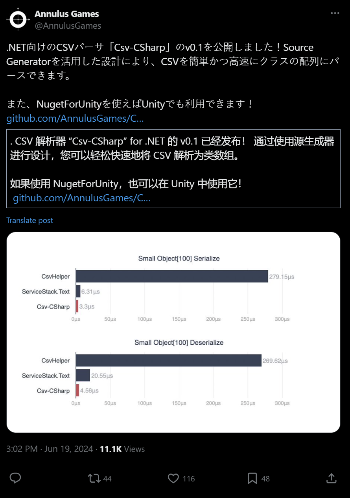
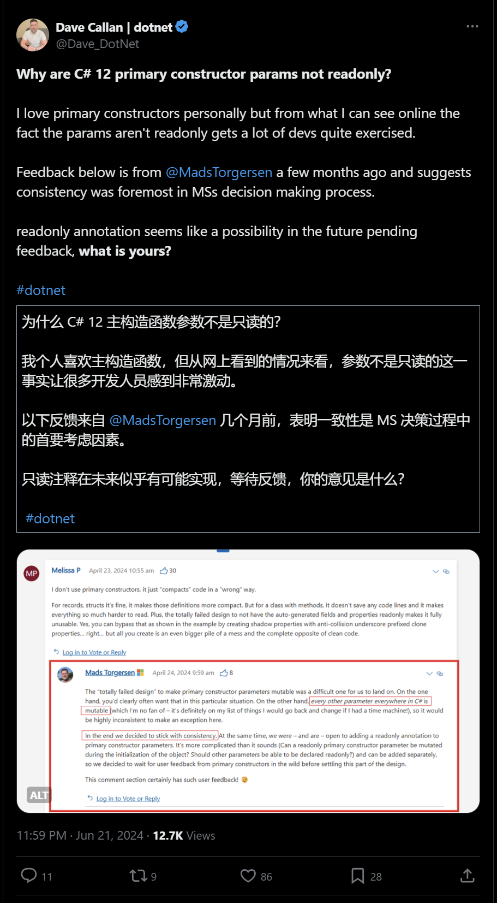
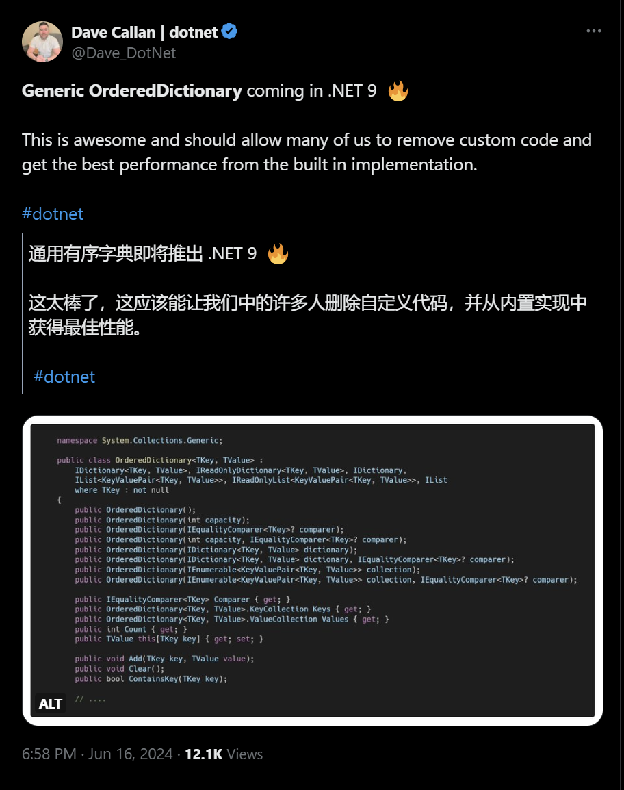

## 国内文章
### C#.Net筑基-集合知识全解

https://www.cnblogs.com/anding/p/18229596

.Net中提供了数组、列表、字典等多种集合类型，分为泛型和非泛型集合。泛型集合具有更好的性能和类型安全性。集合的基础接口包括IEnumerator、IEnumerable、ICollection、IList、IDictionary等，这些接口提供了枚举、索引、添加、删除等操作。非泛型集合由于历史原因仍存在但不推荐使用。`Collection<T>`和`List<T>`的主要区别在于前者便于继承和自定义实现，而后者优化了性能。foreach循环依赖于IEnumerable接口及其枚举器IEnumerator。

### .NET使用原生方法实现文件压缩和解压

https://www.cnblogs.com/Can-daydayup/p/18257870

本文介绍了如何在.NET中使用System.IO.Compression命名空间的类来实现文件和文件夹的压缩和解压缩，尤其是.zip文件格式。阐述了相关类的功能和作用，包括ZipFile、ZipArchive等，以及文件压缩在节省存储空间、减少网络传输时间、打包分发文件以及加密保护文件等方面的应用。文章还涉及压缩级别和Zip归档模式的介绍，最后通过具体代码展示了如何执行文件和文件夹的压缩与解压操作。

### C#如何创建一个可快速重复使用的项目模板

https://www.cnblogs.com/xiaxiaolu/p/18259750

文章讨论如何基于 `dotnet new` 命令创建自定义项目模板，从项目准备到模板配置的详细步骤。首先，准备一个用于模板的现有项目，例如 Azure Function 项目，并展示其文件结构。然后，详细解释如何在项目根目录下创建配置文件，以便未来使用 `dotnet new` 命令生成新项目。文章内容对于有经验的开发者和公司内部项目脚手架构建具有实际指导意义。

### C# 13(.Net 9) 中的新特性 - 扩展类型

https://www.cnblogs.com/Rwing/p/18261641/Csharp_13_dot_net_9_preview_extension_types

C# 13 和 .Net 9 预计在2024年11月发布，将引入扩展类型这一新特性。扩展类型允许在不修改原始类代码的情况下，为类添加新功能。与现有的扩展方法相比，扩展类型语义更清晰，并解决了扩展属性的问题。新特性包括 implicit extension 和 explicit extension，分别用于隐式与显式扩展方法和属性。该特性有望提高代码的可读性、可维护性和表现力。不过，这些新特性可能不会在C# 13中完全发布，随后版本会逐步解锁，提供更完备的支持。

### 【踩坑】.NET 8.0 自定义IExceptionHandler不生效

https://www.cnblogs.com/netry/p/18254779/dot-net-iexceptionhandler-not-working

本文讨论了在ASP.NET Core中使用中间件实现全局异常处理。介绍了使用内置中间件 UseExceptionHandler 和自定义中间件的方法，还列举了使用过滤器 IExceptionFilter 实现的方法。最后提到了.NET 8.0中新引入的IExceptionHandler及其优势。

### 如何更改.NET中的默认时区？

https://www.cnblogs.com/VAllen/p/18251617/How-to-change-Default-Time-Zone-in-dotnet

在不修改操作系统时区前提下修改.NET默认时区的方法。.NET没有公开API，作者提供两种方案：使用hook技术挟持win32 api返回的时区信息，使用reflection技术修改时区信息。详细讲解了reflection方案的代码实现，优缺点，并提醒需反复验证和严谨测试。

### C# 语言在AGI 赛道上能做什么

https://www.cnblogs.com/shanyou/p/18256187

自从2022年OpenAI发布ChatGPT以来，AGI领域活跃着众多公司。Python依旧在AI中占据主导地位，但微软利用C#推出了Semantic kernel框架，以加快大模型技术的应用开发。微软与OpenAI合作推出了.NET版本客户端，并且Semantic kernel的Azure OpenAI连接器也用上了新SDK。Semantic kernel为.NET开发者提供了快速开发AGI应用的工具，已在GitHub上获得19k星标。另外，微软研究院的Autogen和Botsharp也是重要的Agent开发框架。C#凭借其简洁性和高性能在AGI领域站稳脚跟。

### 零基础写框架(3): Serilog.NET 中的日志使用技巧

https://www.cnblogs.com/whuanle/p/18253597

这篇文章介绍了在.NET中使用Serilog进行日志记录的方法，涵盖控制台应用的示例项目。文章描述了不同接收器如Serilog.Sinks.Console、Serilog.Sinks.File等的使用，并提供了代码示例和配置文件示例。还讨论了如何通过依赖注入将Serilog集成到应用程序中，最终展示了不同配置方法的日志输出示例。

### 在System身份运行的.NET程序中以指定的用户身份启动可交互式进程

https://www.cnblogs.com/VAllen/p/18257879/in-dotnet-program-run-as-system-to-start-an-interactive-process-as-the-specified-user

本文介绍了如何在以System身份运行的.NET程序中，以其他活动用户身份启动可交互式进程。作者以GitLab流水线为例，使用C#和PowerShell实现了这一需求。随后给出了具体的代码示例，包括如何获取当前活动会话的用户令牌，复制令牌，以及设置程序的启动参数。

### 记一次 .NET某机械臂上位系统 卡死分析

https://www.cnblogs.com/huangxincheng/p/18253859

文章讲述了一个朋友的程序偶发性卡死，通过WinDbg分析主线程在做什么，发现是由于RtlSetLastWin32Error引发的错误码6，表示无效的句柄。作者认为无效的句柄不会导致程序卡死，建议在这种场景下抓取多个dump进行分析。

### 开源一个反sql注入的asp.net core中间件

https://www.cnblogs.com/toolgood/p/18261896

通知公司需要防sql注入整改，公司进行了测试，发现普通的sql能检测，但仍有未测出的注入方法。主要注入手法有基于注释、错误、时间、联合查询、身份认证绕过。公司通过路径规则使用了ToolGood.SQLFirewall中间件进行防护，同时给出简单的方法如带参数的sql语句和存储过程，并提及参考反向代理的方案。

### 聊一聊 Monitor.Wait 和 Pulse 的底层玩法

https://www.cnblogs.com/huangxincheng/p/18258390

本文探讨了在C#中使用Monitor.Wait时线程阻塞的底层原理。通过代码示例演示了Worker1需要等待Worker2完成的过程，并详细分析了核心数据结构WaitEventLink及其字段。提供了Monitor.Wait在coreclr中的详细实现步骤，解释了线程如何通过SyncBlock进行排队等待。文章通过图示和源码解析深入探讨Monitor.Wait的实现机制。

### WatchDog：一款.NET开源的实时应用监控系统

https://www.cnblogs.com/Can-daydayup/p/18261633

WatchDog是一个针对ASP.Net Core的开源实时应用监控系统。它利用SignalR进行实时监控，使用LiteDB作为无服务器数据库，并支持多种外部数据库。支持 .NET Core 3.1及更高版本。开发者可以通过NuGet安装并配置WatchDog服务和异常记录器，同时设置访问日志账户密码。项目源码和更多功能可在其GitHub地址查看。该项目已被收录到C#/.NET优秀项目精选中，欢迎更多开发者提交PR。DotNetGuide技术社区是一个提供学习资料、技术分享和交流的平台。

### WPF/C#：在DataGrid中显示选择框

https://www.cnblogs.com/mingupupu/p/18258249

该文章介绍了在WPF中的DataGrid中添加选择框列的实现方法。首先定义了数据库模型，然后创建了一个包含INotifyPropertyChanged实现的视图模型类来简化MVVM模式的使用。使用CommunityToolkit.Mvvm包简化代码，并通过ObservableCollection实现UI更新。文章还讲解了如何从数据库获取数据并转换为视图模型列表，最后提到了如何使用扩展方法来添加到ObservableCollection中。

### 效率提升利器：一个在线的.NET源码查询网站

https://www.cnblogs.com/Can-daydayup/p/18255171

本文介绍了一款在线查询.NET源码的网站，以及一些.NET在线学习资源。该网站提供了转到定义、查找所有参考资料、突出显示参考资料、文档大纲等功能，极大地方便了开发者查询和分析源码的需求。此外，文章还介绍了DotNetGuide技术社区的相关信息，鼓励开发者加入技术社区以分享经验和解决技术问题。

### [翻译].NET 8 的原生AOT及高性能Web开发中的应用[附性能测试结果]

https://www.cnblogs.com/Rwing/p/18262526/a-dive-into-net-8-native-aot-and-efficient-web-development

.NET 8 引入了原生 AOT 编译技术，大大提高了ASP.NET Core应用的性能。CreateSlimBuilder方法优化了基础性能，但需要手动配置一些传统组件。CreateEmptyBuilder提供了完全定制化的开发体验，允许开发者根据需求选择组件。性能测试结果表明，这些新方法在提高应用启动时间和内存使用上表现优秀。

### dotnet 融合 Avalonia 和 UNO 框架

https://www.cnblogs.com/lindexi/p/18263041

本文介绍了如何在一个解决方案中融合 Avalonia 和 UNO 两个框架。作者看好 Avalonia 的现状和 UNO 的未来，但对 Avalonia 的基础库和设施不满意。由于 Avalonia 团队在 2023 年经历重组和优化，其开发体验有了很大提升。尽管如此，作者认为 UNO 的专业性和管理更强，并选择在基础库上使用 UNO，在上层应用使用 Avalonia，以结合两者的优势。

### LiveCharts2：简单灵活交互式且功能强大的.NET图表库

https://www.cnblogs.com/mingupupu/p/18253741

文章介绍了新的.NET图表库LiveCharts2，涵盖其功能特点、安装方法及简单使用示例。LiveCharts2支持多种图表类型，采用MVVM设计模式，强调性能优化，适合多平台应用。具体实例展示了如何画折线图、饼图和极坐标图，并提供了参考资料链接。

### 博客园众包平台：游戏开发者找人长期合作建设自己的网站

https://www.cnblogs.com/cmt/p/18262107

园子众包平台汇集众多开发者，应一位擅长.NET与Unity的资深游戏开发者需求，招募上海全栈开发者，开发展示分布式微服务框架与游戏项目的网站。技术要求为前端使用VuePress或Blazor，后端优先.NET。开发者需在人上海。

### 在Winform程序中动态绘制系统名称，代替图片硬编码名称

https://www.cnblogs.com/wuhuacong/p/18258263

本文介绍了两种在登录窗口显示程序名称的方法。第一种方法使用图片编辑工具如Photoshop修改背景图片并替换。第二种方法通过GDI+动态绘制系统名称，利用配置文件中的系统名称信息，在窗口的Paint事件中绘制。这种方法较为灵活，能根据文字长度自动调整字体大小。

### 【译】向您介绍改版的 Visual Studio 资源管理器

https://www.cnblogs.com/MeteorSeed/p/18240700

新版 Visual Studio 资源管理器大幅提升了 .NET 开发者的资源管理体验。改进包括支持批量加载文件、全局搜索、注释功能、验证与警告提示，以及更好的可访问性和 UI 设计，如缩放和黑色主题等。然而，该版本不支持 CSV 导入导出、自动翻译等功能，建议与 ResXResourceManager 扩展结合使用。

### 微服务架构必备技术栈：万变不离其宗的奥义！

https://www.cnblogs.com/xw-01/p/18251582

文章介绍了微服务架构下的不同技术栈，主要围绕微软的技术体系展开。包括服务通信、进程通信、API网关、认证授权、瞬态故障处理、分布式追踪、分布式日志和分布式配置中心等。并详细介绍了每种技术的应用场景和推荐工具，如WCF、gRPC、Ocelot、IdentityServer4、Polly以及Exceptionless等。文章技术深度适中，实际性强，详尽描述了每个技术点，并附有相关链接方便进一步研究。

### WPF/C#：显示分组数据的两种方式

https://www.cnblogs.com/mingupupu/p/18256035

本文介绍了WPF数据分组的两种实现方案: ICollectionView和IGrouping。首先，ICollectionView利用CollectionViewSource和PropertyGroupDescription类实现数据分组，并通过绑定在XAML中展示。其次，IGrouping利用LINQ的GroupBy方法对集合进行分组。这两种方案都有相关CS和XAML代码示例，详细解释了每一行代码的作用。

### 使用Microsoft.SemanticKernel基于本地运行的Ollama大语言模型实现Agent调用函数

https://www.cnblogs.com/gmmy/p/18259238

本文探讨了如何使用本地运行的大语言模型实现函数调用。作者介绍了基于阿里云开源量化版千问7B模型，通过C#和SemanticKernel实现函数调用的全过程，包括在Windows系统下安装Ollama、设置API后端、编码实现和调用流程。具体实现包括定义函数、创建SemanticKernel实例，以及配置必要的包和服务。文章中涉及的技术细节和步骤描述清晰，尤其是在与本地模型API交互的设计方面提供了深入的解释。

### 【VMware vSphere】使用RVTools中的PowerShell脚本创建导出vSphere环境信息的自动化任务。

https://www.cnblogs.com/juniormu/p/18260908

RVTools 是一个免费的 Windows 工具，用于收集并显示 VMware vSphere 环境信息。通过 vSphere Management SDK 8.0 和 CIS REST API 获取数据。2023 年被 Dell 收购，仍免费使用。RVTools 最新版本为 4.6.1，支持多个 vSphere 版本，需要 .NET 4.6.2。可使用 PowerShell 脚本自动导出信息，配合任务计划实现自动化任务。支持多种命令行选项导出信息至 XLSX 或 CSV 格式。

### 一款.NET开源的i茅台自动预约小助手

https://www.cnblogs.com/Can-daydayup/p/18264005

该文介绍了一个基于WPF实现的开源.NET项目HyggeImaotai，模拟i茅台APP每日自动预约茅台酒。内容包括项目功能模块、下载和源码地址，并邀请开发者加入DotNetGuide技术社区。该社区提供C#/.NET/.NET Core学习资源、项目推荐和交流平台。

### XAF 属性编辑器（PropertyEditor）- 原理篇

https://www.cnblogs.com/haoxj/p/18255657

本文介绍了 XAF Blazor 中属性编辑器的原理和新版本24.1.3的变化。属性编辑器是平台无关业务代码和具体平台组件之间的桥梁，通过监听和更新属性值实现同步。新版本去掉了 ComponentAdapter，采用接口方式使属性编辑器更简洁，操作更接近 WinForm。文章详细比较了旧新版本的不同及封装的技术点。

### .Net8   AddKeyedScoped键值key注册服务异常

https://www.cnblogs.com/chenxf1117/p/18255775

在.Net8 WebAPI应用程序中使用AutoFac替代默认DI容器后，使用键值注册服务时遇到异常。排查过程发现问题出在Autofac-DI版本，升级到支持9.0的版本后解决。总结是项目中引用第三方组件时，出现问题可先检查其版本，有可能问题已被修复。

### SpringBoot+Selenium模拟用户操作浏览器

https://www.cnblogs.com/GilbertDu/p/18245952

Selenium是一个开源的Web应用程序自动化测试工具，主要用于浏览器自动化、兼容性测试、功能测试和端到端测试。它支持多种编程语言，并能与DevTools集成。Selenium通过简化测试流程，提高开发团队的质量保障效率。安装Selenium包括下载适用于开发环境的WebDriver库和对应浏览器的驱动程序。文章详细介绍了不同语言的安装方法和驱动下载步骤。

### WPF/C#：如何将数据分组显示

https://www.cnblogs.com/mingupupu/p/18252701

WPF Samples中关于Grouping的Demo展示了如何通过XAML定义数据模板和数据提供者来分组显示任务列表。示例包括MainWindow.xaml文件，使用了StackPanel、XmlDataProvider以及ItemsControl，还展示了如何根据任务类型进行分组。

### NetMvc通过亚马逊方式服务器端和客户端上传MinIO顺利解决

https://www.cnblogs.com/jake-code/p/18255014

该文章介绍了使用AWSSDK.S3和AWSSDK.Core库将文件上传到MinIO服务器的方法。文章内容包括项目背景、MinIO和AWS S3的介绍、服务器配置及具体实现代码，详细说明了使用C#实现文件上传的步骤。

### 如何使用csproj构建C#源代码组件NuGet包？

https://www.cnblogs.com/VAllen/p/18255504/how-to-use-csproj-to-build-the-csharp-source-code-component-nuget-package

本文介绍如何创建仅打包C#源代码文件的NuGet包。相比传统的dll程序集分发，这种方法优点在于方便阅读和调试源代码、减少程序集加载、更有利于代码保护，但缺点是容易外泄源代码和命名冲突。建议严格规范命名，并向目标项目写入组件版本信息以便排查问题。具体实现步骤包括创建项目目录、生成PackageInfo.cs文件以保存版本信息，通过代码展示如何在生成目录文件中实现版本信息输出。

### 探索Semantic Kernel内置插件：深入了解ConversationSummaryPlugin的应用

https://www.cnblogs.com/ruipeng/p/18251740

文章介绍了Semantic Kernel中的内置插件及其功能，包括对话总结插件、文件读写插件、HTTP请求插件等，并通过代码例子演示如何使用对话总结插件。安装和使用插件需要通过Nuget 包管理。在实际使用中，该插件生成的摘要结果可能需要进一步完善。

### WPF/C#：数据绑定到方法

https://www.cnblogs.com/mingupupu/p/18260193

本文介绍了WPF中如何通过ObjectDataProvider类实现数据绑定到方法的功能。通过在MainWindow.xaml文件中定义ObjectDataProvider和DoubleToString对象，演示了如何将TextBox的Text和ComboBox的SelectedValue属性绑定到方法的参数，并配置了数据转换器和验证规则。文中还提供了ConvertTemp方法的具体实现，用于温度转换并返回结果。

## 主题

### 通过 Microsoft 更新保持 Visual Studio 自动更新和安全 - Visual Studio 博客
https://devblogs.microsoft.com/visualstudio/automatically-install-visual-studio-security-updates-through-microsoft-update/

关于 Visual Studio 更新，您现在可以从 Microsoft Update（除了 Windows Update 之外还分发 Microsoft 产品更新的系统）接收安全更新。

本文涉及 Microsoft Update 的未来改进，包括如何启用更新、如何选择退出以及如何预览更新以从 8 月份开始推出。

### 公告：推出适用于 Azure 逻辑应用（标准）的 .NET C# 内联操作 - 预览
https://techcommunity.microsoft.com/t5/azure-integration-services-blog/announcement-introducing-net-c-inline-action-for-azure-logic/ba-p/4160541

Azure 逻辑应用中对 C# 内联操作的支持现已推出预览版。

本文介绍了如何将 C# 脚本添加到工作流、可用功能和 API 以及限制。

### 宣布 .NET Upgrade Assistant 的第三方 API 和包映射支持 - .NET 博客
https://devblogs.microsoft.com/dotnet/announcing-api-map-support-for-ua/

.NET Upgrade Assistant 现在支持为第 3 方 API 和包实施自定义映射包。

### 使用 Azure 应用服务进行远程调试的 Visual Studio 支持版本即将发生的更改
https://techcommunity.microsoft.com/t5/apps-on-azure-blog/upcoming-changes-to-supported-versions-of-visual-studio-for/ba-p/4164389

关于从 Azure 应用服务上的 Visual Studio for .NET 进程进行远程调试的支持版本更改。

从 2024 年 6 月起将不再支持 2022 及更早版本，从 2025 年 1 月底起不再支持 2022 17.9 及更早版本。

### 版本 11.0.11 · AvaloniaUI/Avalonia
https://github.com/AvaloniaUI/Avalonia/releases/tag/11.0.11

Avalonia 11.0.11 已发布。

此版本包含多个错误修复。

### 发布 v2.5.168 · MessagePack-CSharp/MessagePack-CSharp
https://github.com/MessagePack-CSharp/MessagePack-CSharp/releases/tag/v2.5.168

MessagePack-CSharp v2.5.168 已发布。

此版本修复了多个错误，支持 NonSerialized，并清理了依赖项。

## 文章、幻灯片等
### 构建通过了，但是不起作用！从 .NET 6 迁移到 .NET 8 时实际导致问题的 2 个重大更改
https://zenn.dev/xin9le/articles/b2b0d500df95c7

关于从 .NET 6 迁移到 8 时行为更改引起的问题。本文介绍了与 FromBody 和 JsonRequired 属性相关的问题。

### dotCover 用于自动化测试代码覆盖率的命令行工具 | .NET 工具博客
https://blog.jetbrains.com/dotnet/2024/06/20/dotcover-command-line-tools-for-automation-testing-code-coverage/

介绍dotCover的命令行工具来获取代码覆盖率。本文涵盖安装、使用和其他技巧。

### 如何正确测量 .NET 中的代码速度
https://dev.to/byteminds_agency/how-to-properly-measure-code-speed-in-net-158o

快速介绍使用 BenchmarkDotNet 进行性能测量的基础知识。

### 将 Phi-3 和 C# 与 ONNX 结合使用用于文本和视觉示例 - .NET 博客
https://devblogs.microsoft.com/dotnet/using-phi3-csharp-with-onnx-for-text-and-vision-samples-md/

介绍从 C# 调用 Phi-3 ONNX 模型以生成文本并执行图像识别的示例代码。

### MAUI Android 对“JAVA0000：类型 ~ 被定义了多次”感到愤怒
https://zenn.dev/proudust/articles/2024-06-19-maui-android-java0000

为 Android 创建 .NET MAUI 构建时可能导致构建错误的问题以及如何处理这些问题。

### 链接 OmniSharp-Vim 和 fzf 成员列表显示 - Qiita
https://qiita.com/lx-sasabo/items/b9a1c84a66a306ade81d如何通过在 Vim 中链接 OmniSharp-Vim 和 fzf 来显示成员列表。

### .NET 现代化工具中的隐私和安全改进 - .NET 博客
https://devblogs.microsoft.com/dotnet/dotnet-modernization-privacy-security-improvements/

关于 .NET 现代化工具（.NET Upgrade Assistant 和 Azure 迁移应用程序和代码评估）中的安全和隐私改进。

它是按用户安装的，不再需要管理员权限来更新，并且现在可以控制报告中包含的信息。

### 在调试时轻松导航代码委托 - Visual Studio 博客
https://devblogs.microsoft.com/visualstudio/easily-navigate-code-delegates-while-debugging/

关于在 Visual Studio 17.10 中调试时委托的代码导航的改进。

现在可以在调试时从委托跳转到源代码。

### 提高生产力的代码风格 - Metalama 团队的提示和工具 | .NET 工具博客
https://blog.jetbrains.com/dotnet/2024/06/18/code-style-for-better-productivity-tips-and-tools-from-the-metalama-team/

介绍[Metalama](https://www.postsharp.net/metalama)团队在代码风格方面使用的实践和工具。

本文介绍了共识、如何在 IDE 中配置它、报告警告以及计划定期清理它。

### 使用默认 lambda 参数重构代码 - .NET 博客
https://devblogs.microsoft.com/dotnet/refactor-your-code-with-default-lambda-parameters/

关于 C# 12 中引入的 lambda 表达式的默认参数。

本文介绍了如何使用它以及如何将其与 ASP.NET Core Minimal API 一起使用。

### 探索生成的代码：`List<T>` 和后备案例：集合表达式的幕后 - 第 2 部分
https://andrewlock.net/behind-the-scenes-of-collection-expressions-part-2-exploring-the-generated-code-list-and-fallback-cases/

解释编译器如何扩展集合表达式。

我们已经建立了 HashSet 和自定义类型结果、`List<T>` 优化以及 .NET 8 及早期版本的回退等行为。

### SignalR 中的设计、部署和扩展注意事项
https://ilovedotnet.org/blogs/design-and-deployment-and-scaling-in-signalr/

部署和扩展 SignalR 的注意事项。

### 如何加密 ASP.NET Core 路由参数
https://khalidabuhakmeh.com/how-to-encrypt-aspnet-core-route-parameters

如何在 ASP.NET Core 中加密路由参数。本文介绍了如何使用路由约束和参数绑定器执行加密/解密。

### 使用 .NET 实践 HTTP/3
https://medium.com/@Alikhalili/hands-on-http-3-with-net-fcd38cf7ad05

对 HTTP/3 的解释以及基于 HTTP/3 规范实现工具的技巧。

### 启动.NET Aspire时出现超时错误怎么办
https://zenn.dev/microsoft/articles/dotnet-aspire-launch-error

当 .NET Aspire 项目由于端口冲突而无法启动时该怎么办。

### Rider 2024.2 EAP 3 已推出！
https://blog.jetbrains.com/dotnet/2024/06/14/rider-2024-2-eap-3/

Rider 2024.2 EAP 已发布。

此版本现在捆绑了 dotnet watch 插件。

### 使用 OpenTelemetry 和 Aspire Dashboard 进行 XUnit 测试仪器的 .NET 开发人员指南
https://dev.to/nikiforovall/a-net-developer-guide-to-xunit-test-instrumentation-with-opentelemetry-and-aspire-dashboard-5h14

如何结合 Aspire Dashboard 和 OpenTelemetry 来衡量 xUnit 测试。

### 【活动报道】现代C# .NET Web开发~gRPC、GraphQL、Blazor也可用~召开 - Sansan Tech Blog
https://buildersbox.corp-sansan.com/entry/2024/05/23/143000

[今日C# .NET Web开发~gRPC、GraphQL、Blazor也可用~](https://sansan.connpass.com/event/316664/)公告后续文章

## 库、存储库、工具等。

### AnnulusGames/Csv-CSharp：适用于 .NET 和 Unity 的快速 CSV 序列化器
https://github.com/AnnulusGames/Csv-CSharp

### 基于源生成器的快速、零/低分配 CSV 解析器。还支持使用 Unity 进行操作。

https://x.com/annulusgames/status/1803322411221500067?s=12&t=ggvrrZ7oLogHyNoIGNgjbw

## 网站、文档等
### 推文
https://x.com/dave_dotnet/status/1804182294539776385?s=12

---

https://x.com/dave_dotnet/status/1802294617666187730?s=12

## 深入探索

### [Windows] 通过 Foda 添加 TitleBar 控件 · Pull Request #23019 · dotnet/maui
https://github.com/dotnet/maui/pull/23019

添加与 .NET MAUI 标题栏相关的 API 的 PR。

## 版权声明

* 国内板块由 InCerry 进行整理 : https://github.com/InCerryGit/.NET-Weekly
* 其余内容来自 Myuki WeekRef，由InCerry翻译（已获得授权） : https://github.com/mayuki/WeekRef.NET

**由于笔者没有那么多时间对国内的一些文章进行整理，欢迎大家为《.NET周刊-国内文章》板块进行贡献，需要推广自己的文章或者框架、开源项目可以下方的项目地址提交Issue或者在我的微信公众号私信。**

格式如下：

* 10~50字左右的标题
* 对应文章或项目网址访问链接
* 200字以内的简介，如果太长会影响阅读体验

https://github.com/InCerryGit/.NET-Weekly

## .NET性能优化交流群

相信大家在开发中经常会遇到一些性能问题，苦于没有有效的工具去发现性能瓶颈，或者是发现瓶颈以后不知道该如何优化。之前一直有读者朋友询问有没有技术交流群，但是由于各种原因一直都没创建，现在很高兴的在这里宣布，我创建了一个专门交流.NET性能优化经验的群组，主题包括但不限于：

* 如何找到.NET性能瓶颈，如使用APM、dotnet tools等工具
* .NET框架底层原理的实现，如垃圾回收器、JIT等等
* 如何编写高性能的.NET代码，哪些地方存在性能陷阱

希望能有更多志同道合朋友加入，分享一些工作中遇到的.NET性能问题和宝贵的性能分析优化经验。**目前一群已满，现在开放二群。**

如果提示已经达到200人，可以加我微信，我拉你进群: **ls1075**

另外也创建了**QQ群**，群号: 687779078，欢迎大家加入。 

