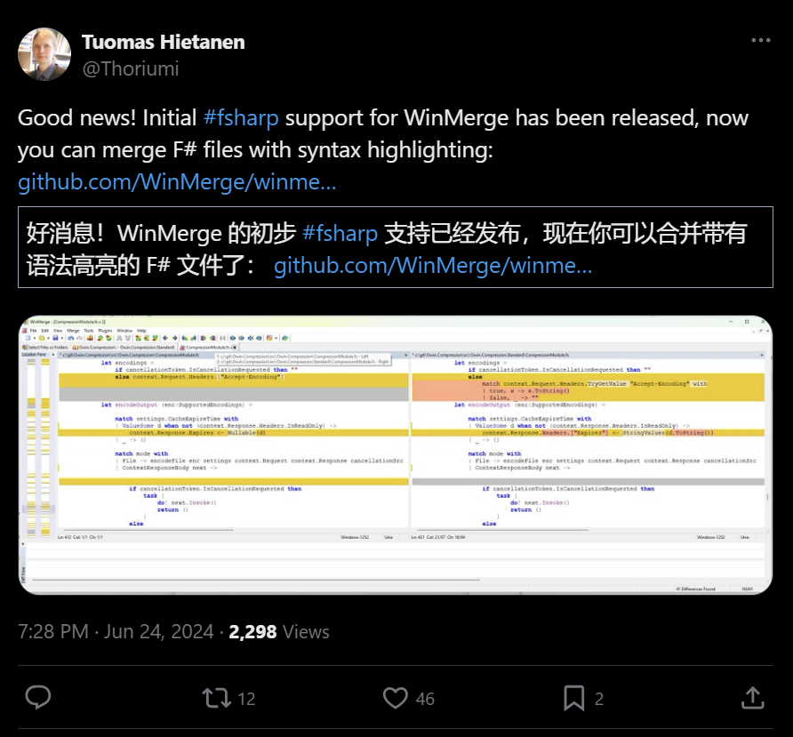

.NET周刊【7月第1期 2024-07-07】dotnet_week_24_7_1
## 国内文章
### 学习.NET 8 MiniApis入门

https://www.cnblogs.com/hejiale010426/p/18280441

MiniApis是ASP.NET Core中的轻量级框架，用最少的代码和配置创建HTTP API。其特点包括简洁明了、性能卓越、灵活多变、易于学习使用，并与ASP.NET Core生态系统完美集成。适用于微服务、原型开发、简单的CRUD应用、无服务器函数及物联网设备通信。通过简单代码示例，展示其创建API的便捷性。环境搭建部分介绍系统要求及安装.NET SDK步骤，准备好开发者的环境。

### C#/.NET/.NET Core优秀项目和框架2024年6月简报

https://www.cnblogs.com/Can-daydayup/p/18277063

文章介绍了一系列C#/.NET/.NET Core优秀项目和框架，每周定期通过公众号分享。每个项目都有简介、特点、源码地址和公众号详细介绍。内容包括CsvHelper、ModernWpf、HyggeImaotai、WatchDog、Dorisoy.Pan等。

### 基于Bootstrap Blazor开源的.NET通用后台权限管理系统

https://www.cnblogs.com/Can-daydayup/p/18282795

文章介绍了基于Bootstrap Blazor的.NET通用后台权限管理系统，具有响应式布局，可切换多Tabs模式，权限控制细化到网页内任意元素。该项目基于Bootstrap和Blazor，包含多种功能模块，并支持多种数据库。项目默认支持SQLite，可直接调试运行，提供项目源码和下载地址。文中还提到DotNetGuide技术社区，提供C#/.NET/.NET Core相关学习资料和技术交流平台。

### WPF在.NET9中的重大更新：Windows 11 主题

https://www.cnblogs.com/mingupupu/p/18277446

2023年2月20日，WPF团队在讨论区对未来工作的优先级进行投票，最终决定优先开发Windows 11主题。在2023年12月13日，宣布与WPFUI合作开发该主题。在Build 2024展示相关视频和WPF Gallery，并于2024年5月17日在微软商店发布预览版。WPF的Win11主题适用于.NET 9 Preview 4及其以上版本，是学习WPF的好项目，能帮助开发者创建一致性更高、界面更美观的应用。

### 记一次 .NET某网络边缘计算系统 卡死分析

https://www.cnblogs.com/huangxincheng/p/18277831

文章介绍了网络边缘计算的背景及其在.NET中的应用，然后通过WinDbg分析一个Linux上部署的Web网站卡死的问题。通过分析主线程调用栈和线程池的状态，作者推断卡死可能由于线程饥饿或线程池耗尽引起。

### 一款EF Core下高性能、轻量级针对分表分库读写分离的解决方案

https://www.cnblogs.com/Can-daydayup/p/18284750

本文介绍了EF Core下高性能、轻量级的分表分库读写分离解决方案ShardingCore。ShardingCore是一款开源的EF Core扩展程序包，支持EF Core2+的所有版本和数据库，支持自定义路由、动态路由、高性能分页和读写分离。项目特点包括零依赖、零学习成本和零业务代码入侵。文章还分享了如何快速上手使用ShardingCore在AspNetCore中实现按月分表的实操步骤。

### 在C#中使用RabbitMQ做个简单的发送邮件小项目

https://www.cnblogs.com/ZYPLJ/p/18279034

文章介绍了如何在C#中使用RabbitMQ发送邮件，包括项目的架构图和详细代码。项目分为生产者、RabbitMQ服务器和消费者三个部分。生产者负责将邮件请求发送到RabbitMQ队列，消费者从队列中接收并执行发送操作。文章还提供了关键代码，如RabbitMQ连接配置和邮件发送服务的实现。

### 基于 .net core 8.0 的 swagger 文档优化分享-根据命名空间分组显示

https://www.cnblogs.com/morang/p/18284628/netcore8-swagger-group-namespace-show

公司项目使用.net core webapi和refit封装20+服务SDK，提供swagger文档。之前文档能正常访问，后来只能在本地打开或访问原始swagger页面。使用Swashbuckle.AspNetCore生成SwaggerUI，详细介绍了从安装、包引用、服务配置到最终启用swagger的步骤和代码示例。

### .NET App 与Windows系统媒体控制(SMTC)交互

https://www.cnblogs.com/TwilightLemon/p/18279496

本文介绍了如何在Windows应用中使用SMTC与系统媒体交互。首先解释了SMTC在UWP App中的使用方法，接着指出XxxForCurrentView方法不适用于桌面应用。通过MediaPlayer可以绕过这些限制，自动集成SMTC，并方便与已有解码器配合使用。文中提供了调用WinRT API的方法和示例代码，详细展示了SMTC对象的创建、设置交互性、更新媒体信息和响应用户交互等步骤。

### 动手学Avalonia：基于SemanticKernel与硅基流动构建AI聊天与翻译工具

https://www.cnblogs.com/mingupupu/p/18281546

本文介绍了Avalonia作为跨平台UI框架，并比较其与WPF的关系。接着，介绍了Semantic Kernel SDK及其功能，并详细讨论了硅基流动的AI基础设施及SiliconCloud平台。作者提到在SemanticKernel中使用SiliconCloud的API服务，提供了具体代码实现，最后展示了基于大模型的聊天应用页面构建方法。

### C#开发一个混合Windows服务和Windows窗体的程序

https://www.cnblogs.com/yiluxiangdong/p/18286736

文章介绍了如何创建一个同时支持Windows服务和Windows窗体的混合程序。通过判断进程会话ID、当前用户名、用户交互模式和启动参数来决定运行模式。如果条件满足则进入服务模式，否则进入窗体模式。项目需要引用System.Configuration.Install、System.ServiceModel和System.ServiceProcess，并包含多个类文件来实现不同功能，包括Program.cs、MainService.cs、MainForm.cs、MainWorker.cs和ServiceInstaller.cs，提供了部分代码示例。

### 实现Quartz.NET的HTTP作业调度

https://www.cnblogs.com/INetIMVC/p/18281699

该文章介绍如何使用Quartz.NET进行HTTP作业调度。主要内容包括定义HttpJob类来执行HTTP请求，持久化作业信息，并通过QuartzHelper类管理作业的生命周期，如加载、创建、调度、暂停和删除作业等。

### Asp .Net Core 系列：基于 Castle DynamicProxy + Autofac 实践 AOP 以及实现事务、用户填充功能

https://www.cnblogs.com/vic-tory/p/18284779

本文介绍了 AOP 的概念及其在 .Net Core 中的应用。讨论了几种 AOP 框架，如 PostSharp、Castle DynamicProxy 和 AspectCore Framework。详细展示了如何基于 Castle DynamicProxy 实现 AOP，包括安装所需的 NuGet 包、定义接口和类、创建拦截器、以及在 IOC 中的使用方法。通过代码示例，解释了如何通过代理类和拦截器扩展功能，实现如事务管理等横切关注点。

### Rougamo、Fody 实现静态Aop

https://www.cnblogs.com/KarlAlbright/p/18277740

文章介绍了Rougamo框架及其静态编织AOP功能。首先解释了AOP和静态编织的概念，并对Rougamo进行了详细说明。Rougamo通过Fody和Mono.Cecil在编译阶段嵌入代码实现AOP功能。文章展示了如何创建控制台程序并安装Rougamo.Fody，以及使用LoggingAttribute类对方法进行拦截和日志记录。最后，文章简要提及了FodyWeavers.xsd和FodyWeavers.xml文件的生成。

### 中台框架模块开发实践-用 Admin.Core 代码生成器生成通用代码生成器的模块代码

https://www.cnblogs.com/morang/p/18277156/zhontai_admin_core_module_dev_use_toproject

这篇文章讨论了基于Admin.Core代码生成器开发一个通用代码生成器模块的过程。作者首先介绍了项目需求，并提供了相关的代码和数据库设置。文章详细描述了代码生成器如何支持DBFirst和CodeFirst两种方式生成配置，并展示了生成代码和数据模型的具体步骤。通过json导入导出功能，用户可以方便地进行配置的复制和导入。最后，作者还提供了代码生成器的相关配置示例，帮助读者快速上手并实现项目开发。

### 记一次aspnetcore发布部署流程初次使用k8s

https://www.cnblogs.com/morec/p/18285969

这篇文章介绍了如何在aspnetcorewebapi项目中，使用Gitlab和Jenkins实现CI/CD，并通过Docker和K8s部署。文中详细描述了项目的初始化、Dockerfile和k8s.yaml文件的编写，以及Gitlab和Jenkins的配置。提到了在本地使用Docker Desktop验证Dockerfile，并说明了Gitlab的容器ID配置问题。最后，提供了Gitlab CI/CD以及Runner的注册方法。

### 如何让其他模型也能在SemanticKernel中调用本地函数

https://www.cnblogs.com/mingupupu/p/18286405

文章介绍了如何使用SemanticKernel与Azure OpenAI进行本地函数调用。通过示例代码展示了创建内核、添加插件和启用规划功能。作者分享了实践经验，指出除了OpenAI和Moonshot AI外，其他模型的本地函数调用无效。作者提到在讨论区中发现很多人也有类似需求，并提供了一个项目链接，该项目可以集成到语义内核中实现基于LLMs聊天的函数调用。作者尝试并成功使用该项目中的类和插件。

### Simple WPF: WPF 透明窗体和鼠标事件穿透

https://www.cnblogs.com/mrchip/p/18278976

本文提供了一个自定义WPF窗体的解决方案，增加了透明背景和鼠标穿透功能。它借鉴了吕毅老师的文章，详细介绍了去除标题栏、设置窗体透明背景和内容模板的步骤，并通过引入user32.dll设置窗口属性，使鼠标事件穿透到下层窗体中。代码及演示效果在Github提供。

### 【译】在调试时轻松导航代码委托

https://www.cnblogs.com/MeteorSeed/p/18277571

委托是表示对方法引用的类型，类似 C++ 函数指针，支持面向对象。Func 和 Action 是常用委托类型。最新 Visual Studio 更新简化了调试时跟踪委托代码。用户可通过开发者社区或 Twitter 提供反馈。

### Simple WPF: WPF 自定义按钮外形

https://www.cnblogs.com/mrchip/p/18288981

本文通过WPF的按钮模板与样式定义，详细介绍如何使用Style和ResourceDictionary自定义WPF按钮的外观。通过提供代码示例展示了扁平化按钮样式和用Polygon自定义Button外形的方法。

### C#的多线程UI窗体控件显示方案 - 开源研究系列文章

https://www.cnblogs.com/lzhdim/p/18275194

为了在新线程中上传文件到FTP服务器并更新主线程UI，作者提出了一种高级用法，将线程操作放在独立类中，主线程负责UI显示。此文详细记录了项目目录、源码介绍、运行界面及使用方法。

### C#开发单实例应用程序并响应后续进程启动参数

https://www.cnblogs.com/yiluxiangdong/p/18288392

C#默认WinForm模板不支持单实例，有多种实现方法，如检测同名进程、命名互斥锁、锁定文件、使用WindowsFormsApplicationBase类。详细介绍了WindowsFormsApplicationBase类的用法及其常用属性和方法。包括创建单实例应用程序的详细步骤和各类代码示例。

### 使用EF 连接 数据库 SQLserver、MySql 实现 CodeFirst

https://www.cnblogs.com/motion/p/18281201

文章介绍了如何创建一个基于 .NET Framework 的项目，并使用 EntityFramework Code First 方法与 MySQL 数据库进行交互。具体步骤包括新建项目、下载和配置所需的 NuGet 包、设置 App.config 或 Web.config 文件、创建 EF Model 以及测试数据库操作如查询、添加、更新和删除数据。

### Log4Net配置详解及输出自定义消息类示例

https://www.cnblogs.com/letmebaby/p/18278934

本文介绍了如何添加log4net.dll的引用，并展示了简单的log4net配置文件示例。通过NuGet程序包管理器搜索log4net并添加引用，随后在项目中添加log4net.config配置文件。配置文件示例展示了如何定义logger和appender，以控制日志的输出等级和方式。

## 主题

### 版本 1.6 实验 (1.6.0-experimental2) - Windows 应用 SDK 最新实验通道发行说明 - Windows 应用 Microsoft Learn
https://learn.microsoft.com/ja-jp/windows/apps/windows-app-sdk/experimental-channel#version-16-experimental-160-experimental2

Windows App SDK 1.6.0-experimental2 已发布。

此版本改进了 NativeAOT 支持、更改了 Edge WebView2 SDK 集成、添加了包部署 API 并修复了错误等。

此外，从此版本开始，microsoft-ui-xaml GitHub 存储库的主分支将包含 WinUI 3 源代码。

### ReSharper 2024.2 EAP 5：重要里程碑和其他更新 | .NET 工具博客
https://blog.jetbrains.com/dotnet/2024/07/01/resharper-2024-2-eap-5/

ReSharper 2024.2 EAP 5 已发布。

此版本支持异步输入作为进程外的一部分。据说这可以提高响应能力。

其他改进包括增强重构和在动态程序分析中使用人工智能。

### Rider 2024.2 EAP 5：阅读器模式、游戏开发监控等 | .NET 工具博客
https://blog.jetbrains.com/dotnet/2024/07/01/rider-2024-2-eap-5/

Rider 2024.2 EAP 5 已发布。

此版本添加了阅读器模式，可在库中显示代码时扩展文档注释、监视窗口的增强功能以及 GDScript 调试支持。

### 版本 8.4.1 · App-vNext/Polly
https://github.com/App-vNext/Polly/releases/tag/8.4.1

Polly 8.4.1 已发布。

此版本修复了多个错误。

## 文章、幻灯片等
### 自制.NET CLI工具（PowerShell版）添加tab补全功能 - Qiita
https://qiita.com/pierusan2010/items/0885a78d5616601d013a

如何在 CLI 工具中实现 PowerShell 选项卡完成支持。

### .NET MAUI Android 中的动画启动屏幕
https://dev.to/icebeam7/animated-splash-screen-in-net-maui-android-2ipg

如何将 Android 12 中的闪屏 API 与 .NET MAUI 结合使用。

### 通过新的 WinUI 工作负载和模板改进深入研究本机 Windows 开发 - Visual Studio 博客
https://devblogs.microsoft.com/visualstudio/dive-into-native-windows-development-with-new-winui-workload-and-template-improvements/

在 Visual Studio 17.10 中引入新的 WinUI 应用程序模板。

### .NET MAUI 中的所有列表
https://dev.to/davidortinau/all-the-lists-in-net-maui-33bd

.NET MAUI 中各种列表控件的比较和布局示例。

### 如何使用 JetBrains Rider 中的任务视图 | .NET 工具博客
https://blog.jetbrains.com/dotnet/2024/07/02/how-to-use-the-tasks-view-in-jetbrains-rider/

引入任务视图，它允许您检查 Rider 中正在运行/等待的任务（异步）。

### 探索生成的代码：扩展元素：集合表达式的幕后 - 第 4 部分
https://andrewlock.net/behind-the-scenes-of-collection-expressions-part-4-the-spread-element/

解释 C# 12 集合表达式扩展运算符生成的代码。

### 一个关于能够通过 UnsafeAccessor 使用泛型的故事 - Qiita
https://qiita.com/abetakahiro123/items/e7df363efa80e94ccf06

关于在 .NET 9 Preview 4 中使用 UnsafeAccessor 对泛型执行操作的能力。

### 让 GitHub Copilot 起草您的拉取请求描述 - Visual Studio 博客
https://devblogs.microsoft.com/visualstudio/let-github-copilot-draft-of-your-pull-request-description/

引入 Visual Studio 版本 17.10 中实现的功能，该功能允许 GitHub Copilot 编写拉取请求评论草稿。

### C# 中的 MemoryCache：实用指南
https://blog.postsharp.net/memorycache

关于内存缓存 System.Runtime.Caching.MemoryCache 是什么以及如何使用它的指南。

### 驾驭企业巨头 - CoRecursive 播客
https://corecursive.com/building-powershell-with-jeffrey-snover/

Jeffery Snover 作为嘉宾谈论 PowerShell 诞生的播客节目的文字记录。

### .NET 9 中的 `ReadOnlySet<T>`
https://steven-giesel.com/blogPost/f368c7d3-488e-4bea-92b4-abf176353fa3

关于 .NET 9 中引入的“`ReadOnlySet<T>`”。它还涉及到与 IReadOnlySet 的关系以及与 ImmutableSet/FrozenSet 的区别。

### C# 中的 WaitHandle 等待线程调查 - Qiita
https://qiita.com/qiitatosh/items/c1c08d0e3caa928b5d63

关于使用 WaitHandle 等待线程。

### 使用 C# 标记将 .NET MAUI 应用程序重构为声明式 UI
https://appmilla.com/latest/refactoring_a_function_and_reactive_dotnet_maui_app_to_a_declarative_ui_using_csharp_markup/

介绍使用 .NET MAUI 社区工具包中的 C# 标记重构应用程序。

本文还涉及热重载期间的控制行为。

### 使用 C# 封装外部 DLL，以便与 Node.js 无缝集成 Electron 应用程序
https://medium.com/@avihup/wrapping-external-dlls-with-c-for-seamless-integration-in-electron-applications-with-node-js-9483bba343bb

如何使用 Electron-edge-js 将外部本机 DLL 公开给 Electron 应用程序。

### 如何从 C# 生成 Windows 运行时异步活动 - 老新事物？
https://devblogs.microsoft.com/oldnewthing/20240704-00/?p=109955

如何从 C# 异步生成 Windows 运行时异步活动（“IAsyncAction”、“IAsyncOperation”）。

### Azure Functions 中对 .NET In-Process 的 .NET 8 支持已发布 - Shibayan Miscellaneous
https://blog.shibayan.jp/entry/20240703/1719992771

了解 Azure Functions 中 .NET 进程内模型的 .NET 8 支持和迁移。

### .NET 中的只读、不可变和冻结集合 - NDepend 博客
https://blog.ndepend.com/readonly-immutable-and-frozen-collections-in-net/

解释 ReadOnly、Immutable 和 Frozen 等各种集合之间的差异及其性能特征。

## 活动、YouTube 发行等。

### 午休时间试试.NET Aspire (2024/07/11 12:00~)
https://msdevjp.connpass.com/event/324193/

## 网站、文档等
### 推文

WinMerge 现在支持 F# 语法突出显示。

https://x.com/Thoriumi/status/1805201201186632184

## 深入探索

### Poly 填充索引和范围类型 by tarekgh · Pull Request #104170 · dotnet/runtime
https://github.com/dotnet/runtime/pull/104170

向 Microsoft.Bcl.Memory 添加了索引和范围填充。

## 版权声明

* 国内板块由 InCerry 进行整理 : https://github.com/InCerryGit/.NET-Weekly
* 其余内容来自 Myuki WeekRef，由InCerry翻译（已获得授权） : https://github.com/mayuki/WeekRef.NET

**由于笔者没有那么多时间对国内的一些文章进行整理，欢迎大家为《.NET周刊-国内文章》板块进行贡献，需要推广自己的文章或者框架、开源项目可以下方的项目地址提交Issue或者在我的微信公众号私信。**

格式如下：

* 10~50字左右的标题
* 对应文章或项目网址访问链接
* 200字以内的简介，如果太长会影响阅读体验

https://github.com/InCerryGit/.NET-Weekly

## .NET性能优化交流群

相信大家在开发中经常会遇到一些性能问题，苦于没有有效的工具去发现性能瓶颈，或者是发现瓶颈以后不知道该如何优化。之前一直有读者朋友询问有没有技术交流群，但是由于各种原因一直都没创建，现在很高兴的在这里宣布，我创建了一个专门交流.NET性能优化经验的群组，主题包括但不限于：

* 如何找到.NET性能瓶颈，如使用APM、dotnet tools等工具
* .NET框架底层原理的实现，如垃圾回收器、JIT等等
* 如何编写高性能的.NET代码，哪些地方存在性能陷阱

希望能有更多志同道合朋友加入，分享一些工作中遇到的.NET性能问题和宝贵的性能分析优化经验。**目前一群已满，现在开放二群。**

如果提示已经达到200人，可以加我微信，我拉你进群: **ls1075**

另外也创建了**QQ群**，群号: 687779078，欢迎大家加入。 

