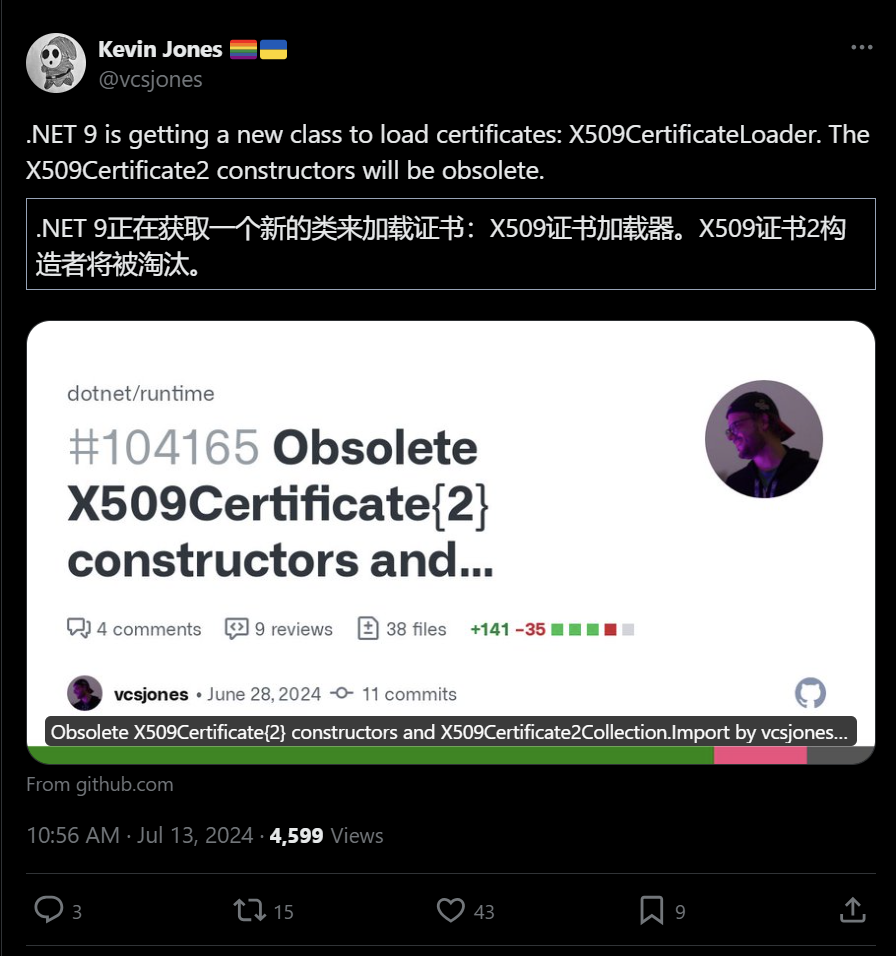

.NET周刊【7月第3期 2024-07-21】dotnet_week_24_7_3
## 国内文章
### 给博客园的寄语

https://www.cnblogs.com/jingc/p/18307859

作者是一名39岁的大龄C#开发程序员，对博客园的艰难处境深感触动，并购买会员支持。回顾他与博客园16年的渊源，博客园在他的学习和工作中提供了大量帮助。尽管在职业生涯中经历多种开发工作，他始终坚持C#开发。面对当前互联网行业不景气，他对未来表示担忧。呼吁博客园通过合作、短视频宣传、找到合作伙伴等方式提升知名度并维持运营，建议会员制度升级和定制化服务以寻求更多支持。

### .NET科普：.NET简史、.NET Standard以及C#和.NET Framework之间的关系

https://www.cnblogs.com/daxnet/p/18299758

这篇文章介绍了.NET的发展历史及其跨平台特性，澄清了许多人对.NET只能在Windows上运行的误解。文章列举了多个.NET成功案例，并详细述了.NET开源的优势以及它在AI领域的应用。文中还提及了.NET从Visual J++到.NET Framework再到.NET Core的演变过程及其标准化的重要性。

### C# 使用模式匹配的好处,因为好用所以推荐~

https://www.cnblogs.com/vipwan/p/18309290

文章介绍了C#中的模式匹配功能，涵盖类型检查、复杂条件逻辑、解构复合类型、范围检查、数据验证、多态行为和访问者模式。模式匹配提高了代码的简洁性和可读性。文中还展示了一些经典编码风格，如is断言、switch多种模式、属性模式和元组模式等。随着C#语言的发展，模式匹配功能将不断扩展。

### 使用ML.NET训练一个属于自己的图像分类模型，对图像进行分类就这么简单！

https://www.cnblogs.com/Can-daydayup/p/18302180

本文介绍了ML.NET是一个开源、免费、跨平台的机器学习框架，可以在.NET应用中构建、训练和部署自定义模型，无需其他编程语言的经验。文章详细描述了ML.NET支持的.NET框架版本，并提供了安装和使用指导，包括创建WinForms应用和训练图像分类模型的步骤。文末附有项目源码和开源地址，推荐加入DotNetGuide技术社区。

### 适用于 .NET 的现代化、流畅、可测试的HTTP客户端库

https://www.cnblogs.com/Can-daydayup/p/18310536

文章介绍了Flurl，一个现代化、流畅、可测试、可移植的URL构建器和HTTP客户端库。文中详细描述了Flurl库的特点、代码示例和使用方法。它支持URL构建、HTTP请求、文件上传和下载、处理超时错误等功能。此外，文章还提到了该项目在C#/.NET/.NET Core优秀项目和框架精选中的收录情况，并推荐加入DotNetGuide技术社区。

### [MAUI 项目实战] 笔记App（一）：程序设计

https://www.cnblogs.com/jevonsflash/p/18309871

文章介绍了开发笔记类App《凡事摘要》的动机和过程。作者需要记录喂奶时间，市面上没有合适的App，于是用MAUI框架开发了一个简单App，并在此基础上扩展功能。使用Abp框架，通过原型和工厂模式创建基于模板的笔记内容。文章详细描述了核心类和服务类的定义及功能，包括各种笔记片段服务类，及其与视图层的绑定。代码已上传至GitHub，欢迎学习和参与。

### Visual Studio 必备插件集合：AI 助力开发

https://www.cnblogs.com/1312mn/p/18309409

AI技术的发展正在改变编程环境，提升代码编写的效率。文章介绍了Visual Studio的多款插件，从代码编辑、调试到版本控制，适用于各种开发者。文章还详细讲解了插件的安装和使用步骤，并推荐了一些AI驱动的插件，如Fitten Code、CodeGeeX等，能自动生成代码、进行代码审查和错误修复。除此之外，还提到GitHub Copilot等插件的优点。

### 推荐2款.NET开源、轻便、实用的Windows桌面启动器

https://www.cnblogs.com/Can-daydayup/p/18305020

本文介绍了Flow Launcher和CurvaLauncher两款开源Windows启动器，前者功能强大，后者轻便快速。文章还推荐了C#/.NET/.NET Core领域的优秀项目和框架精选，提供相关链接和资源。

### Microsoft宣布将在开发人员会议上专注于.NET Aspire

https://www.cnblogs.com/shanyou/p/18306457

微软将在2024年开发者大会上展示 .NET Aspire 的云原生开发和结合人工智能的“现代 SQL”在 Microsoft Fabric 中的应用。大会将于8月5日至9日在雷德蒙德举行，Scott Hunter 和 Asad Khan 将发表主题演讲，介绍 .NET Aspire 和 AI 应用 Microsoft Fabric 构建现代 SQL 应用程序。此外，微软还将展示 SQL 产品和服务的最新进展，以及 Microsoft Copilot 体验。大会提供了网络机会、动手实验室和超过 70 个会议环节。

### 设计模式-C#实现简单工厂模式

https://www.cnblogs.com/ZYPLJ/p/18306505

文章介绍了C#中的简单工厂模式，通过一个计算器的实际案例展示了如何优化代码以提高可维护性、可重用性和可扩展性。作者先提供了未使用设计模式的代码，然后逐步引入封装和继承来降低耦合度，最终实现更灵活的代码结构。

### C#/.NET这些实用的编程技巧你都会了吗？

https://www.cnblogs.com/Can-daydayup/p/18312501

本文介绍了DotNetExercises，涵盖C#/.NET/.NET Core编程的常用语法、算法、技巧及类库练习，包括文件压缩和解压、跨平台终端UI工具包、机器学习框架ML.NET、PDF生成库QuestPDF、Cron表达式解析库、加密库BouncyCastle、数据可视化库ScottPlot和BlazorChartjs、多线程编程、异步编程、网络爬虫框架DotnetSpider、多平台地图组件库Mapsui、美化控制台输出库Spectre.Console、全局唯一ID生成器IdGenerator和缓存框架FusionCache。此外，还介绍了EF Core的通用仓储库和对象映射库AutoMapper在ASP.NET Core Web中的使用。

### 记一次 redis 事件注册不当导致的内存泄露

https://www.cnblogs.com/successgo/p/18308990

在程序运行过程中，内存不断增加且没有下降趋势。通过htop命令查看，程序占用内存数GB。文章描述了如何收集和分析dump文件，并使用windbg工具查看托管和非托管内存的详细信息。

### MiniAuth 一个轻量 ASP.NET Core Identity Web 后台管理中间插件

https://www.cnblogs.com/ITWeiHan/p/18314934

MiniAuth 是一个轻量级的 ASP.NET Core 身份识别后台管理中间插件，通过一行代码为新旧项目添加身份系统和用户权限管理功能。支持 .NET Identity 基于 JWT、Cookie、Session 等，兼容多数据库如 Oracle、SQL Server、MySQL，且多平台支持。通过 NuGet 安装，在 Startup 中添加 services.AddMiniAuth() 即可快速开始。管理后台默认账号 admin 和密码提供初始值，支持通过 [Authorize] 控制权限。可选择 Cookie 或 JWT 作为身份验证方式，并自定义 JWT Security Key。

### .NET开源、简单、实用的数据库文档生成工具

https://www.cnblogs.com/Can-daydayup/p/18307109

本文介绍一款.NET开源数据库文档生成工具DBCHM，支持多种文档格式导出和多种数据库。文档内容包括列名、数据类型、主键等信息。工具支持的数据库有SqlServer、MySQL、Oracle等。提供了项目源码和运行方式链接，鼓励访问开源地址并给予支持。项目已被收录到C#/.NET/.NET Core精选项目中，欢迎提交推荐或自荐。

### WPF使用AppBar实现窗口停靠，适配缩放、全屏响应和多窗口并列（附封装好即开即用的附加属性）

https://www.cnblogs.com/TwilightLemon/p/18309927

这篇文章详细介绍了如何在WPF中实现AppBar，使窗口固定在屏幕边缘，不被其他窗口覆盖。作者分享了在开发过程中遇到的问题，并提供了相应的解决方案和代码示例，包括如何设置位置、处理全屏事件等。文章还提到了一些具体实现细节，如像素与WPF单位转换、手动适配对齐方式等。

### 论如何直接用EF Core实现创建更新时间、用户审计，自动化乐观并发、软删除和树形查询（上）

https://www.cnblogs.com/coredx/p/18305165

本文探讨了使用EF Core实现数据库并发、数据审计和软删除的问题。早期这些问题需要复杂的SQL或存储过程实现，维护困难。通过EF Core和LINQ的结合，可以简化代码维护。作者分享了基于EF Core的国际化服务和Serilog持久化服务的开发经验，并详细介绍了数据审计和乐观并发功能的设计与实现，包括审计实体接口和时间审计接口等。作者强调代码独立性和复用性，决定不使用依赖性强的ABP框架。

### 如何在.NET Framework及.NET6以前项目中使用C#12新特性

https://www.cnblogs.com/vipwan/p/18313947

文章讨论了如何在历史.NET Framework项目中使用C# 12特性。通过更新Visual Studio和编辑项目文件的LangVersion标签，可以间接支持C# 12。同时，还需解决兼容性问题，例如使用预编译指令和定义IsExternalInit类。文中示例项目展示了实际应用。

### 基于EF Core存储的Serilog持久化服务

https://www.cnblogs.com/coredx/p/18298297

文章介绍了Serilog，一个.NET高性能日志库，强调其在生产环境中的日志持久化重要性。讨论了文件和数据库持久化的难点，并提出了基于EF Core持久化日志的方案。详细展示了实现步骤和代码，包括如何定义实体模型、配置EF Core上下文以避免无限日志循环，以及在ASP.NET Core项目中使用该方案的示例和服务注册方法。

### 论如何直接用EF Core实现创建更新时间、用户审计，自动化乐观并发、软删除和树形查询（下）

https://www.cnblogs.com/coredx/p/18305284

本文讨论了数据库并发、数据审计和软删除在EF Core中的实现。作者认为手写复杂SQL难以维护，并提出EF Core可有效简化软件开发过程。然而，现成的ABP框架不太适合小规模项目，因此作者开发了专用功能模块。本文着重介绍树形查询功能，利用视图和公用表表达式简化复杂查询，确保数据完整性。代码部分包括基础接口的定义。

### 论如何直接用EF Core实现创建更新时间、用户审计，自动化乐观并发、软删除和树形查询（中）

https://www.cnblogs.com/coredx/p/18305274

文章介绍了数据库并发、数据审计和软删除问题，通过EF Core框架实现相关功能。作者详细解释了软删除的概念和挑战，并提出了使用EF Core解决这些问题的方法。解决方案包括防止唯一约束错乱、处理软删除的级联和恢复问题，并使用视图自动计算删除标记值。文章还展示了逻辑删除和依赖项逻辑删除的接口定义。

### .NET单元测试使用AutoFixture按需填充的几种方式和最佳实践

https://www.cnblogs.com/vipwan/p/18311419

AutoFixture是一个.NET库，用于简化单元测试的数据设置。它自动生成测试数据，减少代码编写量，提高可读性和维护性。AutoFixture支持xUnit、NUnit、MSTest等框架。默认生成的数据不总是满足要求，使用者可通过自定义、匿名函数、实现ICustomization接口或Build方法调整生成数据。最佳实践中，结合xunit和AutoFixture，利用自定义属性生成特定数据。代码例子展示了如何定制数据生成，以满足测试需求。

### Asp .Net Core 系列：基于 T4 模板生成代码

https://www.cnblogs.com/vic-tory/p/18306326

这篇文章介绍了T4模板（Text Template Transformation Toolkit）的组成部分和使用方法，包括在Visual Studio中创建和编写T4模板的步骤，以及T4模板所包括的指令块、文本块、代码语句块、表达式块和类特性块的详解。还讨论了设计时模板和运行时模板的区别以及如何在Visual Studio中进行模板转换。最后提到通过Manager类控制和保存生成的文件。

### 在.NET Web API设置响应输出Json数据格式常用的两种方式

https://www.cnblogs.com/Can-daydayup/p/18314367

本文介绍了在ASP.NET Core Web API中设置JSON数据格式的两种常用方式。使用System.Text.Json或Newtonsoft.Json进行序列化和反序列化，讲解了统一格式的需求和配置方法。文中包含详细的代码示例和配置说明，适用于Minimal API模式。同时，介绍了DotNetGuide技术社区，提供了学习和交流平台。

### WCF异常System.ServiceModel.ProtocolException问题处理

https://www.cnblogs.com/zhangchen-trunk/p/18310625

文章描述了一个WCF服务调用失败的案例，错误原因是端口被罗技升级程序占用。作者通过分析日志和网络包，最终发现问题所在。文中还提到了WCF通信的基本流程和异常调用栈。

### 【译】使 Visual Studio 更加可视化

https://www.cnblogs.com/MeteorSeed/p/18310611

Web、桌面或移动开发人员经常使用图像，但图像往往只能作为字符串值引用，无法显示其样子。最近对光标悬停预览图像的需求增多，Visual Studio 发起了一个社区实验，展示图像的编辑器 tooltip。该功能支持多种常见图像文件类型，如 PNG、JPG 等，部分支持的图像需要转换。图片引用方法多样，包含相对 URL、数据 URI 等。社区提出了多个附加功能，如缩放和点击预览图像，这些在未来可能会被实现。要体验此功能，请安装 Visual Studio 2022 v17.10 或更高版本。

### [MAUI 项目实战] 笔记App（二）：数据库设计

https://www.cnblogs.com/jevonsflash/p/18311048

文章介绍了在应用程序中如何使用Sqlite作为数据库，通过EntityFrameworkCore进行ORM映射，并采用CodeFirst方式初始化Sqlite数据库。详细描述了在appsettings.json文件中添加本地sqlite连接字符串的方法，以及在MatoProductivityCoreModule.cs中设置Configuration.DefaultNameOrConnectionString的步骤。接着，定义了笔记实体类、笔记分组实体类及其属性和关系，描述了如何存储笔记的标题、内容、状态等信息。

## 主题

### OpenSilver 3.0 简介 - OpenSilver
https://opensilver.net/announcements/3-0/

OpenSilver 3.0 已发布。

此版本包含新功能，例如将 AI 功能集成到 UI 设计器（预览版）、扩展对 Visual Studio Code 的支持以及引入在线 XAML 设计器 [XAML.io](https://xaml.io)。

文章指出，他们未来将致力于 .NET MAUI 混合支持、Blazor 组件和 XAML 3D 等方面的工作。

### .NET 6 将于 2024 年 11 月 12 日终止支持 - .NET 博客
https://devblogs.microsoft.com/dotnet/dotnet-6-end-of-support/

关于 .NET 6 将于 2024 年 11 月 12 日终止支持。

本文介绍了 .NET 6 在支持结束后的行为、与 Visual Studio 的兼容性以及对 Enterprise Linux 的支持。

### 介绍适用于 .NET 的 CoreWCF 和 WCF 客户端 Azure 队列存储绑定 - .NET 博客
https://devblogs.microsoft.com/dotnet/introducing-core-wcf-and-wcf-client-azure-queue-storage-bindings-for-dotnet/

CoreWCF 以及将 WCF 与 Azure 队列存储集成的服务/客户端库已发布。

这允许使用 Azure 队列存储而不是 MSMQ 来实现 CoreWCF 服务。

本文还介绍了如何使用该库。

### NuGetAudit 2.0：提升包管理的安全性和信任 - NuGet 博客
https://devblogs.microsoft.com/nuget/nugetaudit-2-0-elevating-security-and-trust-in-package-management/

介绍 NuGet 6.12、Visual Studio 17.12 和 .NET SDK 9.0.100 中提供的 NuGet 安全审核功能（称为 NuGet Audit 2.0）。

本文介绍了新添加的配置项及其显示方式、如何升级带有警告的软件包并抑制特定建议、如何检查传递包、如何检查资产文件以及未来的更新改进点。

### 构建更安全的未来 - NuGet 如何应对软件供应链威胁 - NuGet 博客
https://devblogs.microsoft.com/nuget/building-a-safer-future-how-nuget-is-tackling-software-supply-chain-threats/

介绍 NuGet 如何应对供应链威胁。

文章介绍了OSS的现状和问题，NuGet团队的努力和成果，以及用户每天更新的必要性，以及使用开源时的注意事项。

### ODP.NET 23.5 现已推出
https://medium.com/oracledevs/odp-net-23-5-now-available-82560aca5abb

 ODP.NET 23.5 已发布。

此版本包括对引用游标类型的支持、添加受 OpenTelemetry 活动标记影响的行计数属性、产品信息和应用程序元数据、无效转换异常抑制、批量复制通知以及存储在 OCI 对象存储中的连接，包括信息更改检测、Easy。 Connect Plus 地址列表和 Microsoft Identity Platform Token v2.0 增强功能。

### 发布 v8.2.0 · dotnet/orleans
https://github.com/dotnet/orleans/releases/tag/v8.2.0

Orleans v8.2.0 已发布。

此版本包括激活重新分区、粒度计时器增强、MessagePack 序列化支持、Cassandra 集群提供程序、ADO.NET 流提供程序 (alpha) 等新功能以及各种错误修复。

## 文章、幻灯片等

### 使用 C# 和 ONNX 运行时生成 AI (DirectML) 在本地运行 Phi-3 Vision - Shibayan 其他
https://blog.shibayan.jp/entry/20240714/1720945305

了解如何使用 ONNX 运行时生成 AI 在本地运行 Phi-3 Vision 模型。

### C# 13 ref struct 接口和“允许 ref struct”通用反约束 - NDepend 博客
https://blog.ndepend.com/c-13-ref-struct-interfaces-and-the-allows-ref-struct-generic-anti-constraint/

关于 C# 13 中的“允许引用结构”，它允许在泛型类型参数中使用引用结构。

### 在 C# 中实现本机函数绕行
https://lowleveldesign.wordpress.com/2024/07/11/implementing-a-native-function-detour-in-csharp/

了解如何使用 C# 和 NativeAOT 使用 Detours 挂钩/替换 Win32 本机函数。

### 宣布三项新的高级 Visual Studio 订阅者权益 - Visual Studio 博客
https://devblogs.microsoft.com/visualstudio/new-visual-studio-benefits-2024/

引入 Visual Studio 订阅的新优势。

除了现有的优惠外，还增加了 Dometrain Pro 50% 折扣、DevPass Business Edition 50% 折扣以及 Visual Studio LIVE 折扣等优惠！

### 使用 extern 别名消除同名类型的歧义
https://andrewlock.net/disambiguating-types-with-the-same-name-with-extern-alias/

在由于类型在多个库中具有完全相同的名称而存在歧义的情况下，如何指定和处理别名（外部别名）。

### 让 Visual Studio 更加直观 - Visual Studio 博客
https://devblogs.microsoft.com/visualstudio/making-visual-studio-a-bit-more-visual/

在 Visual Studio 2022 17.10 及更高版本中实现的代码编辑器上引入图像预览。

本文还涉及有关可用格式和参考格式的调查结果。

### 亲身体验 Visual Studio 和 Azure：今年 8 月在 Microsoft 总部现场直播 - Visual Studio 博客！
https://devblogs.microsoft.com/visualstudio/visual-studio-live-2024-microsoft-hq/

介绍将于 8 月在微软总部举办的 Visual Studio LIVE! 2024 活动的主题演讲、实践活动等。

### 最快的 C# 枚举到字符串 - NDepend 博客
https://blog.ndepend.com/fastest-c-enum-to-string/

一篇文章比较了几个用于高速处理枚举的库。

文章比较了 System.Enum、FastEnum、Enums.NET、NetEscapades.EnumGenerators 和 Meziantou.Framework.FastEnumToStringGenerator 的解析、枚举等每种使用方式的速度。

它还提到 System.Enum 的性能从 .NET 7 到 .NET 8 得到了改进。

### 使用 Fluent 主题现代化您的 WPF 应用程序 - Bruno Sonnino
https://blog.revolution.com.br/2024/07/06/modernizing-your-wpf-application-with-the-fluence-theme/

关于 .NET 9 中引入的 WPF Fluent 主题。本文提供了升级示例计算器应用程序并修改它以应用主题的示例。

### 使用 OpenCvSharp 进行相机校准 - Qiita
https://qiita.com/amutou/items/d5a5cf9a77308f85dde6

如何在 OpenCvSharp 中执行相机校准/畸变校正。

### 覆盖 Equals() 的只读内存 - Qiita
https://qiita.com/abetakahiro123/items/31500620e3e95bced3db

如何为按内容比较相等性的类型实现 ReadOnlyMemory。

### 我如何将 JSON 解析器性能提高两倍
https://medium.com/@deniszykov/how-i-improved-json-and-message-pack-parser-performance-twofold-80a29c4618d4

介绍用于提高游戏数据管理工具的 JSON 解析器性能的优化技术。

### 在接口中使用静态虚拟成员的自定义配置部分
https://haacked.com/archive/2024/07/18/better-config-sections/

一种技术，允许您通过提供接口的静态虚拟成员以及 Microsoft.Extension.{Configurations,Options} 中绑定配置节的名称来组织代码。

### 关闭多个 *of.net 站点
https://immo.landwerth.net/2024/07/15/microsites/

关于 Immo Landwerth 维护的多个域名为 *of.net 的网站被关闭的问题。

本文介绍了关闭和转移的背景，以及每个域的使用状态。

- apireview.net（转让给微软）
- apisof.net（转让给微软）
- designsof.net（关闭）
- issuesof.net（关闭）
- sitesof.net（关闭）

### [C#] 关于.NET 第 8 代中添加的ConfigureHttpClientDefaults。 - 尼诺的花园。
https://blog.neno.dev/entry/2024/07/12/175331

.NET 第 8 代中 Microsoft.Extensions.Http 的 ConfigureHttpClientDefaults 的说明。

本文还解释了配置名称为空时的行为。

### .NET Aspire 与 Docker | 你被黑客攻击了。
https://haacked.com/archive/2024/07/01/dotnet-aspire-vs-docker/

比较使用 .NET Aspire 和 Docker 配置 .NET 项目和 PostgreSQL 的步骤。

## 网站、文档、书籍等

### [修订新版]实践中有用的 C# 编程习惯/标准和模式
https://gihyo.jp/book/2024/978-4-297-14307-7

- [我们将发布“修订后的新版本：实践中有用的 C# 编程习惯/标准和模式”](https://zenn.dev/gushwell/articles/practical-csharp-book)

### 推文

https://x.com/vcsjones/status/1811957823854526910?s=12

## 版权声明

* 国内板块由 InCerry 进行整理 : https://github.com/InCerryGit/.NET-Weekly
* 其余内容来自 Myuki WeekRef，由InCerry翻译（已获得授权） : https://github.com/mayuki/WeekRef.NET

**由于笔者没有那么多时间对国内的一些文章进行整理，欢迎大家为《.NET周刊-国内文章》板块进行贡献，需要推广自己的文章或者框架、开源项目可以下方的项目地址提交Issue或者在我的微信公众号私信。**

格式如下：

* 10~50字左右的标题
* 对应文章或项目网址访问链接
* 200字以内的简介，如果太长会影响阅读体验

https://github.com/InCerryGit/.NET-Weekly

## .NET性能优化交流群

相信大家在开发中经常会遇到一些性能问题，苦于没有有效的工具去发现性能瓶颈，或者是发现瓶颈以后不知道该如何优化。之前一直有读者朋友询问有没有技术交流群，但是由于各种原因一直都没创建，现在很高兴的在这里宣布，我创建了一个专门交流.NET性能优化经验的群组，主题包括但不限于：

* 如何找到.NET性能瓶颈，如使用APM、dotnet tools等工具
* .NET框架底层原理的实现，如垃圾回收器、JIT等等
* 如何编写高性能的.NET代码，哪些地方存在性能陷阱

希望能有更多志同道合朋友加入，分享一些工作中遇到的.NET性能问题和宝贵的性能分析优化经验。**目前一群已满，现在开放二群。**

如果提示已经达到200人，可以加我微信，我拉你进群: **ls1075**

另外也创建了**QQ群**，群号: 687779078，欢迎大家加入。 

