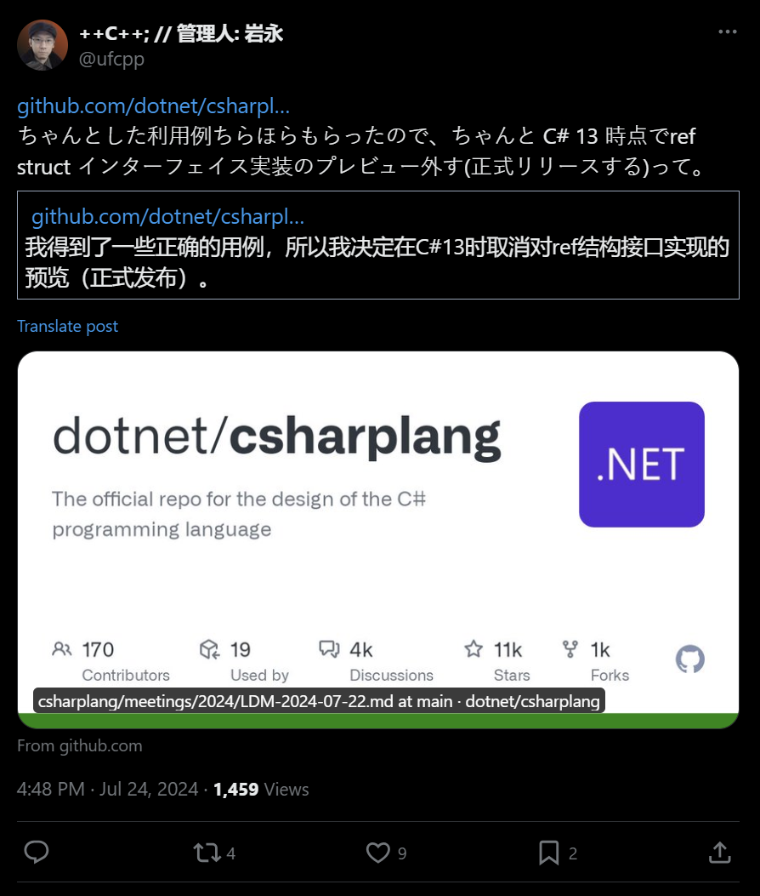

.NET周刊【7月第4期 2024-07-28】dotnet_week_24_7_4
## 国内文章
### .NET 高性能缓冲队列实现 BufferQueue

https://mp.weixin.qq.com/s/fUhJpyPqwcmb3whuV3CDyg

BufferQueue 是一个用 .NET 编写的高性能的缓冲队列实现，支持多线程并发操作。

项目地址：https://github.com/eventhorizon-cli/BufferQueue

项目是从 mocha  项目中独立出来的一个组件，经过修改以提供更通用的缓冲队列功能。

mocha 项目地址：https://github.com/dotnetcore/mocha

目前支持的缓冲区类型为内存缓冲区，后续会考虑支持更多类型的缓冲区。

### C# 网络编程：.NET 开发者的核心技能

https://www.cnblogs.com/1312mn/p/18314234

本文为.NET开发者提供了全面的C#网络编程指南。从HTTP请求基础到高级话题，包括HttpClient的使用、WebClient的过时替代、复杂请求的处理、自定义请求头和认证等细节，内容详实。还介绍了WebSocket在实时应用中的应用。通过示例代码，展示各种网络编程场景，指导开发者掌握相关技术。

### 关于学习.NET的历程回顾与今后的探索实践方向

https://www.cnblogs.com/mingupupu/p/18320722

作者从24岁开始学习.NET，经历了从VB.NET到C#的过程。研究生阶段主要学习.NET Framework+VB.NET+DevExpress+SqlServer+Winform组合。随着了解加深，尝试C#、EFCore等技术。期间对就业前景感到焦虑，转而尝试过Java、C++等，但最终回归C#。基于兴趣进行学习，如爬虫、AI、客户端、后端开发等相关技术。未来希望在C#领域继续探索，平衡兴趣与赚钱的需求。

### C# 开发技巧 轻松监控方法执行耗时

https://www.cnblogs.com/1312mn/p/18317245

MethodTimer.Fody 是一个基于.NET的库，用于自动测量和记录方法的执行时间。通过使用Fody插件框架，它通过修改IL代码来插入计时逻辑。步骤包括安装NuGet包和使用Time特性，可以直接添加到方法或类上，执行时在输出窗口查看时间记录。用户还可以通过定义静态类来拦截和记录日志。

### 《HelloGitHub》第 100 期

https://www.cnblogs.com/xueweihan/p/18324251

HelloGitHub 通过分享有趣、入门级的开源项目，激发编程兴趣。涵盖 Python、Java、Go、C/C++、Swift 等多种语言，项目类型包括实战项目、教程、开源书籍等。本期内容介绍了多项开源项目，如 Darktable、Gnucash、git-credential-manager、Lean、space-station-14、subtitleedit、diff-pdf 等，通过工具、游戏和库等多种形式，带来不同领域的编程体验。

### 记录荒废了三年的四年.net开发的第二次面试（进复试了）

https://www.cnblogs.com/ggtc/p/18317988

这次面试分为初试和复试，主要围绕项目经历和技术问题。复习了asp.net core，wpf等技术。初试包括个人信息、人事交流和技术总经理面试。主要涉及项目角色、asp.net core项目搭建流程、日志等级、数据安全传输、身份认证、token原理、过期处理、权限管理和通信协议等内容。强调通过数字签名和锁机制解决并发问题。

### 提高 C# 的生产力：C# 13 更新完全指南

https://www.cnblogs.com/hez2010/p/18326521/whats-new-in-csharp-13

C# 13 将于 2024 年 11 月伴随 .NET 9 发布，改进 ref struct 并增强生产力。新版本允许在迭代器和异步方法中使用 ref 和 ref struct，还引入了 ref struct 泛型约束，使代码更具通用性。此外，ref struct 可以实现接口。这些新特性提升了编程灵活性和效率，标志着 C# 语言的重大进步。

### C# 12 新增功能实操！

https://www.cnblogs.com/Can-daydayup/p/18321876

文章介绍了C# 12的功能，包括主构造函数、集合表达式、内联数组、默认lambda参数和任何类型的别名。文章包含代码示例，并推荐使用最新版本的Visual Studio 2022或.NET 8 SDK来实践这些新功能。

### 如何用 WinDbg 调试Linux上的 .NET程序

https://www.cnblogs.com/huangxincheng/p/18315571

文章介绍了如何使用 WinDbg 结合 GDBServer 在 Linux 上调试 .NET 程序。步骤包括在 CentOS7 上安装 .NETCore 3.1、安装 GDBServer、启动调试端口及使用 WinDbg 连接远程调试。通过示例代码，展示了具体调试过程。

### C#中使用 record 的好处 因为好用所以推荐~

https://www.cnblogs.com/vipwan/p/18325508

文章介绍了C# 9中的record关键字，其简化语法、自动生成成员函数、基于值的相等性语法、非破坏性复制、解构支持及与模式匹配的集成等特性。record简化了类的定义，提高了代码的可读性和开发效率，适用于不可变数据对象。通过示例代码展示了record在实际使用中的便利性。

### .NET 中高效 Excel 解决方案 MiniExcel

https://www.cnblogs.com/1312mn/p/18319836

MiniExcel 是一个轻量高效的 .NET 库，专注于处理 Excel 文件。它具有低内存占用、易用 API 和快速读写性能，支持多种数据类型和模板功能，能够在多个平台上运行，易于集成。它通过流式处理减少内存占用，适合大数据集操作。文章还介绍了安装方法和多种查询操作示例。

### [WPF] 脱机环境实现支持拼音模糊搜索的AutoCompleteBox

https://www.cnblogs.com/czwy/p/18321646

本文介绍如何在WPF中实现支持拼音模糊搜索的AutoCompleteBox。通过将汉字转换为拼音字符串并进行子串匹配，解决了常见的字符串子串匹配方法无法匹配拼音的缺陷。文中详细描述了汉字转换为拼音和拼音匹配算法的实现。使用Microsoft Visual Studio International Pack获取汉字拼音，并实现多音字处理。最终，通过保留匹配的起始位置和子串长度，实现拼音模糊搜索功能。

### C#开源、简单易用的Dapper扩展类库 - Dommel

https://www.cnblogs.com/Can-daydayup/p/18317443

本文介绍了一个C#开源的Dapper扩展类库Dommel，支持CRUD操作、自动生成SQL查询语句及LINQ表达式。Dommel建立在Dapper基础上，通过扩展IDbConnection提供便捷的数据库查询方法。文中展示了安装使用Dommel进行增删改查的简单示例，并提供了项目源码及相关链接供读者进一步了解。

### 用.Net实现GraphRag：从零开始构建智能知识图谱

https://www.cnblogs.com/xuzeyu/p/18323643

文章介绍了基于RAG技术的GraphRag项目，将传统问答系统与知识图谱结合，使处理复杂问题更加高效精准。作者利用.Net框架实现了GraphRag.Net，并在Github上开源。文章详细说明了运行项目的步骤和未来的优化方向，包括增强知识图谱构建能力、扩展问答系统的智能化以及优化用户交互体验。作者期待社区共同研究探索，并邀请大家加入开发者社区。

### .NET TCP、UDP、Socket、WebSocket

https://www.cnblogs.com/kybs0/p/18312434

文章介绍了.NET应用开发中的网络通信，主要针对进程间通信方式，包括Socket、WebSocket、TcpClient、UdpClient。通过示例代码详细说明了Socket在TCP通信中的应用，并介绍了TCP和UDP的特点及其在.NET中的实现。文章还阐述了TcpClient和UdpClient如何简化网络编程。

### 基于.NET开源、强大易用的短链生成及监控系统

https://www.cnblogs.com/Can-daydayup/p/18325116

本文介绍了一个基于.NET开源、免费、强大易用的短链生成及监控系统SuperShortLink。系统功能包括生成短链、短链跳转长链、访问次数统计和Web监控页面等，支持多种数据库持久化方式，采用混淆加密算法。提供详细的项目源代码和使用截图。

### 入门Vue+.NET 8 Web Api记录（一）

https://www.cnblogs.com/mingupupu/p/18322881

文章讨论了利用SemanticKernel结合.NET 8 Web API来创建一个简单的前后端分离项目，前端通过按钮发送请求，从后端获得夸人的话。介绍了配置HTTPS、启用OpenAPI、使用控制器等技术细节，并详细讲述了如何集成和使用SemanticKernel服务，包括设置OpenAIHttpClientHandler类，兼容OpenAI格式的模型。

### .NET 控件转图片

https://www.cnblogs.com/kybs0/p/18324167

本文介绍了在WPF中使用RenderTargetBitmap获取控件图像的方法，通过示例代码演示如何进行控件截图，并讲述了BitmapSource和BitmapImage的转换。还提到了DPI获取的重要性以及不同位图编码器的使用场景。

### 【摘译+整理】System.IO.Ports.SerialPort使用注意

https://www.cnblogs.com/zhangchen-trunk/p/18324550

文章讨论了C# 和 .NET Framework的System.IO.Ports.SerialPort类的不足与问题，强调其可靠性差、多线程竞争等问题。文章建议使用BaseStream进行串口读取，以提高可靠性。针对不同需求，建议使用Win32 API或其他库。

### Known框架实战演练——进销存框架搭建

https://www.cnblogs.com/known/p/18315027

本文详细介绍了使用Known框架搭建进销存管理系统的项目结构及前期准备工作，包括项目创建、数据库和系统名称配置、多语言支持和系统常量的设置。此外，还描述了安装运行及功能菜单配置的步骤。

### 七天.NET 8操作SQLite入门到实战 - 第七天Blazor学生管理页面编写和接口对接（3）

https://www.cnblogs.com/Can-daydayup/p/18328182

本文详细介绍了在Blazor中编写和对接学生管理页面的步骤，以及完整的.NET 8 SQLite操作教程。包括SQLite的简介、环境配置、快速入门、项目框架搭建、ORM封装等内容，最后还提供了源码地址和前端Table页面的接口对接代码。

### Spectre.Console.Cli注入服务的几种姿势

https://www.cnblogs.com/vipwan/p/18321432

本文介绍了Spectre.Console.Cli的服务注入方法。它是Spectre.Console库的一部分，用于创建命令行界面应用程序。文中通过一个GreetCommand示例演示如何定义命令及参数，并展示如何在程序入口配置Command。然后介绍了在CLI程序中注入服务的方式，包括如何创建服务、添加日志以及注册服务，并给出了实际代码示例。此外，还提到通过实现ITypeRegistrar可以支持其他依赖注入（DI）框架如Autofac。

### 【译】宣布三项新的高级 Visual Studio 订阅者福利

https://www.cnblogs.com/MeteorSeed/p/18315590

Visual Studio 订阅不仅提供软件使用权，还提供各种服务和培训资源，显著提高开发能力和职业发展。新的福利包括 Dometrain Pro 和 DevPass 商业版的折扣以及 Visual Studio LIVE 活动的独家优惠。这些福利帮助订阅者保持最新技能并节省大量费用。访问 my.visualstudio.com 激活和利用这些福利。

### Asp .Net Core 系列：详解授权以及实现角色、策略、自定义三种授权和自定义响应

https://www.cnblogs.com/vic-tory/p/18326418

授权在ASP.NET Core中用于控制对应用资源的访问，它与身份验证相互独立但需要身份验证机制。有三种授权类型：简单授权、基于角色的授权和基于策略的授权。简单授权通过使用Authorize属性限制访问。基于角色的授权根据用户角色控制访问，角色可以在身份创建时指定。基于声明策略的授权使用声明作为身份标识，并通过定义策略和处理程序来实现。自定义策略授权通过要求和处理程序实现更灵活的授权控制。

### RestSharp编写api接口测试，并实现异步调用（不卡顿）

https://www.cnblogs.com/weipt/p/18321246

确保安装RestSharp NuGet包。在C#代码中，引用RestSharp命名空间，创建RestClient和RestRequest实例，执行异步POST请求并处理响应。示例代码展示了如何进行这些操作，并提供了异常处理和响应解析的建议。需根据实际情况替换baseUrl并添加必要的请求头和参数。

### 手把手教你集成GraphRag.Net：打造智能图谱搜索系统

https://www.cnblogs.com/xuzeyu/p/18327513

本文介绍了如何在.NET项目中集成GraphRag.Net，实现知识图谱数据的存储、检索和问答功能。首先，通过NuGet添加GraphRag.Net包，然后在项目中配置OpenAI、TextChunker和GraphDBConnection，并在Program.cs中进行依赖注入。接着，展示了如何使用GraphRag.Net的核心功能，包括索引查询、图谱查询和数据插入等，并提供了不同的查询模式选择。最后，鼓励读者加入作者的交流社区。

### 架构演化思考总结（1）

https://www.cnblogs.com/TonyCode/p/18319625

架构是对依赖的统一管理。依赖是持有对象的引用，常见为单向依赖。单向依赖中，父对象持有子对象较为合理，兄弟对象间应通过父对象交流，避免子对象依赖父对象。双向依赖耦合度高，应杜绝。可以通过方法、委托、事件实现对象间的交互。委托可用来解耦下级对上级的依赖，但需注意注册和注销的配对。使用委托会增加代码量和管理复杂度。底部向高层通信可使用委托。

### 新做了一个MySQL 数据库 DDL 差异对比的网站

https://www.cnblogs.com/huiyuanai709/p/18316984/mysql-ddl-compare

该网站用于对比不同环境下的DDL差异，生成变更点和迁移DDL。用户在输入新的和旧的DDL后，通过点击“Start Compare”进行对比，然后选择变更操作并生成最终的迁移DDL。可以复制语句执行或将变更应用到原始DDL中以便后续对比。网站后端使用Asp.Net Core 8，前端使用Angular，托管在Cloudflare和Vercel。

### C# 通过反射(Reflection)调用不同名泛型方法

https://www.cnblogs.com/HookDing/p/18326960

文章介绍了利用反射解决数据类型和方法选择问题。原本通过排列组合的方法写了88行代码，维护起来非常繁琐。通过反射技术，可以动态选择数据类型和方法，解决了代码冗余和易出错的问题。作者详细描述了问题的背景和反射技术的优势，并给出了具体实现的示例代码。

### Known框架实战演练——进销存基础数据

https://www.cnblogs.com/known/p/18317479

本文介绍如何实现进销存管理系统的基础数据模块，涵盖商品信息、供应商管理和客户管理。文中详细描述实体类、建表脚本、服务接口及其实现方式，以及在项目中如何注册和使用相关服务。所有具体代码实现可参考项目的开源地址。

## 主题

### 宣布 .NET 大会：聚焦 AI - 2024 年 8 月 20 日 - .NET 博客
https://devblogs.microsoft.com/dotnet/announcing-dotnetconf-focus-on-ai/

### .NET Aspire 8.1 为云原生开发人员提供的新增功能！ - .NET 博客
https://devblogs.microsoft.com/dotnet/whats-new-in-aspire-8-1/

### 5.3 版本：全面的Rider支持和 350 多项增强功能
https://platform.uno/blog/5-3/

### Avalonia 11.1：跨平台 UI 开发的巨大飞跃
https://avaloniaui.net/blog/avalonia-11-1-a-quantum-leap-in-cross-platform-ui-development

### 发布 v12.4.0 · jbogard/MediatR
https://github.com/jbogard/MediatR/releases/tag/v12.4.0

### ReSharper 20 周年！ | .NET 工具博客
https://blog.jetbrains.com/dotnet/2024/07/23/resharper-20-years/

### 适用于 macOS 的 ILSpy：首个公开测试版
https://avaloniaui.net/blog/ilspy-for-macos-first-public-beta-release

## 文章、幻灯片等
### 开发者想要更多、更多、更多：Stack Overflow 年度开发者调查的 2024 年结果 - 代码日志
https://stackoverflow.blog/2024/07/24/developers-want-more-more-more-the-2024-results-from-stack-overflow-s-annual-developer-survey/

### 简化 .NET 8 单元测试：使用 FakeLogger 简化日志记录
https://medium.com/codenx/streamline-net-8-unit-tests-simplify-logging-with-fakelogger-f7d0f5baf980

### Stack Overflow 开发调查：VS Code、Visual Studio 和 .NET Shine -- Visual Studio 杂志
https://visualstudiomagazine.com/Articles/2024/07/26/so-dev-survey.aspx

### 使用C#提高工作效率～C#13更新完整指南～
https://qiita.com/hez2010/items/9750c3686fabc5f19a8d

### 提高在Playwright中创建的测试的性能-Qiita
https://qiita.com/FumikaKoyama/items/cb173d321778c68c9627

### HTMX 入门：初学者指南
https://dev.to/raulnq/getting-started-with-htmx-a-beginners-guide-559p

### C#字符串文字语法高亮显示
https://zenn.dev/masakura/articles/2bcb6c7ee2104e

### 如何将 Blazor QuickGrid 与 GraphQL 结合使用 - .NET 博客
https://devblogs.microsoft.com/dotnet/how-use-a-blazor-quickgrid-with-graphql/

### 使用 EventPipe 跟踪分配第 1 部分：dotnet-trace 和 TraceLog
https://medium.com/@ocoanet/tracing-allocations-with-eventpipe-part-1-dotnet-trace-and-tracelog-8ebda7e90773

### Visual Studio 提示：使用 Ctrl-L 删除带或不带剪贴板备份的行 - Visual Studio 博客
https://devblogs.microsoft.com/visualstudio/visual-studio-tip-deleting-a-line/

### 如何使用 Seq 实现微服务的结构化日志记录和分布式跟踪
https://dev.to/antonmartyniuk/how-to-implement-structed-logging-and-distributed-tracing-for-microservices-with-seq-401a

### Semantic Kernel 里后端使用 Python，前端使用 C# 进行操作
https://zenn.dev/microsoft/articles/semantickernel-dotnet-python-01

### .NET：返回空集合的成本
https://medium.com/medialesson/net-the-cost-of-returning-an-empty-collection-7fee40c9919d

### Visual Studio 使用 RUBICON 改进 AI 对话 -- Visual Studio 杂志
https://visualstudiomagazine.com/Articles/2024/07/22/rubicon-visual-studio.aspx

### 通过 Prompty 轻松将 AI 添加到您的 .NET 应用程序 - .NET 博客
https://devblogs.microsoft.com/dotnet/add-ai-to-your-dotnet-apps-easily-with-prompty/

### 结合 .NET Aspire、Python、Docker（远程）和机器学习模型来汇总照片
https://dev.to/syamaner/combining-net-aspire-docker-remote-and-machine-learning-models-for-summarising-photos-3iec

### 更高效地调试您的 .NET 8 代码
https://bartwullems.blogspot.com/2024/07/debug-your-net-8-code-more-efficiently.html?m=1

### 如何不进行基准测试！
https://steven-giesel.com/blogPost/98458f74-5205-4b2b-9f5b-535e34ec2fea

### 基于C#的开源CMS“Orchard Core”的本地化
https://zenn.dev/zead/articles/orchardcore-localization

### 启动语义内核 [2024 年 7 月版] - Qiita
https://qiita.com/takashiuesaka/items/299c64bb3c5873a470b9

### 我验证了将 Azure Functions 的进程内模型从 .NET 6 迁移到 .NET 8 - Qiita
https://qiita.com/mnrst/items/d9ded8ed93c74da8a403

### 高流量系统中的克隆字典与不可变字典与冻结字典
https://ayende.com/blog/201314-B/cloned-dictionary-vs-immutable-dictionary-vs-frozen-dictionary-in-high-traffic-systems?Key=5b127528-fc8b-4749-9442-eedcd34afb9b

### 【C#】使用ISymbol.ToDisplay(SymbolDisplayFormat.FullyQualified)获取Symbol的完全限定名（注意属性等成员符号无法获取） - Hanachiru的我的笔记
https://www.hanachiru-blog.com/entry/2024/07/18/120000

### C# 源代码生成器开发教程
https://developer.aiming-inc.com/csharp/source-generator-tutorial/

## 网站、文档等
### 推文

https://x.com/ufcpp/status/1816032682968752267?s=12

### 深入探索

### csharplang/proposals/TypeUnions.md 位于 18a527bcc1f0bdaf542d8b9a189c50068615b439 · dotnet/csharplang
https://github.com/dotnet/csharplang/blob/18a527bcc1f0bdaf542d8b9a189c50068615b439/proposals/TypeUnions.md

## 版权声明

* 国内板块由 InCerry 进行整理 : https://github.com/InCerryGit/.NET-Weekly
* 其余内容来自 Myuki WeekRef，由InCerry翻译（已获得授权） : https://github.com/mayuki/WeekRef.NET

**由于笔者没有那么多时间对国内的一些文章进行整理，欢迎大家为《.NET周刊-国内文章》板块进行贡献，需要推广自己的文章或者框架、开源项目可以下方的项目地址提交Issue或者在我的微信公众号私信。**

格式如下：

* 10~50字左右的标题
* 对应文章或项目网址访问链接
* 200字以内的简介，如果太长会影响阅读体验

https://github.com/InCerryGit/.NET-Weekly

## .NET性能优化交流群

相信大家在开发中经常会遇到一些性能问题，苦于没有有效的工具去发现性能瓶颈，或者是发现瓶颈以后不知道该如何优化。之前一直有读者朋友询问有没有技术交流群，但是由于各种原因一直都没创建，现在很高兴的在这里宣布，我创建了一个专门交流.NET性能优化经验的群组，主题包括但不限于：

* 如何找到.NET性能瓶颈，如使用APM、dotnet tools等工具
* .NET框架底层原理的实现，如垃圾回收器、JIT等等
* 如何编写高性能的.NET代码，哪些地方存在性能陷阱

希望能有更多志同道合朋友加入，分享一些工作中遇到的.NET性能问题和宝贵的性能分析优化经验。**目前一群已满，现在开放二群。**

如果提示已经达到200人，可以加我微信，我拉你进群: **ls1075**

另外也创建了**QQ群**，群号: 687779078，欢迎大家加入。 

