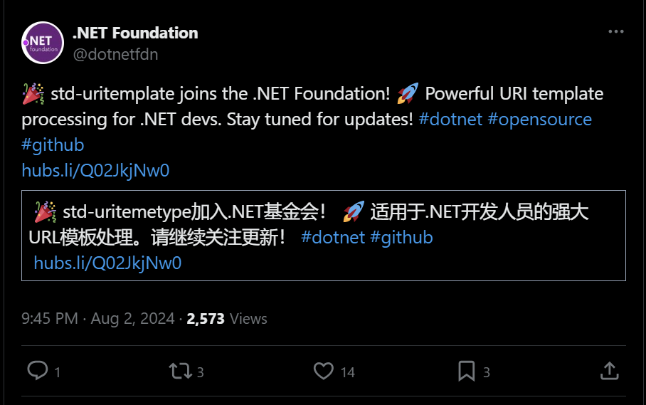
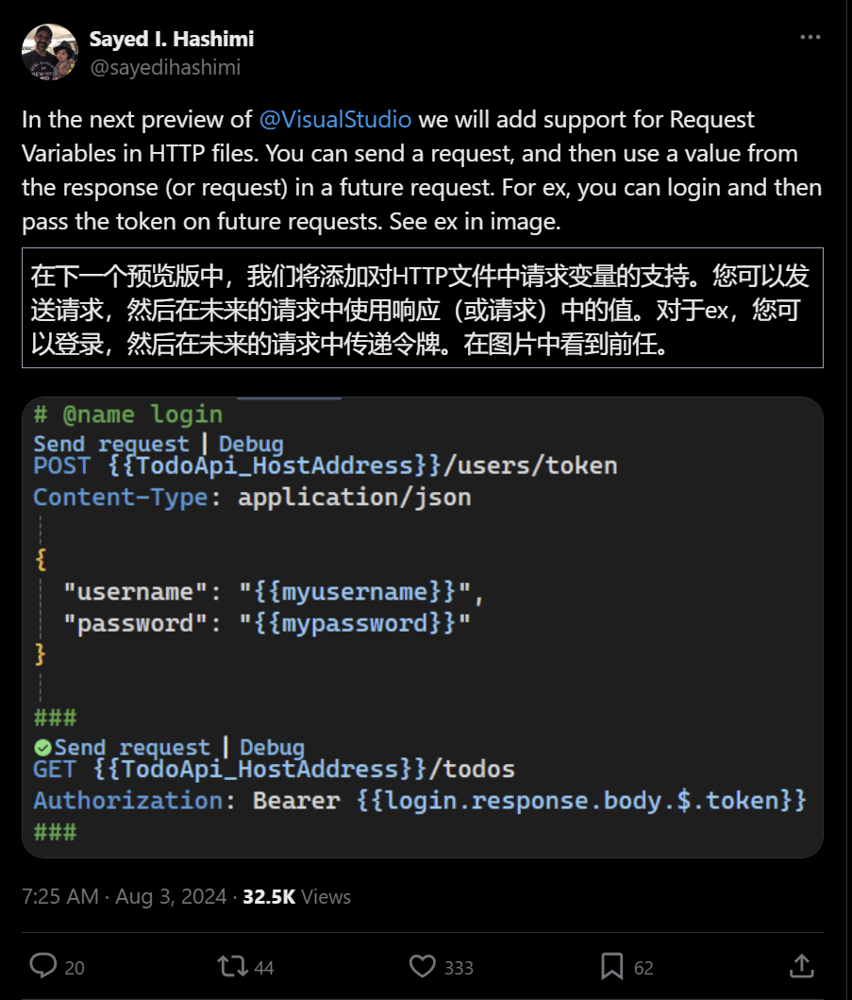
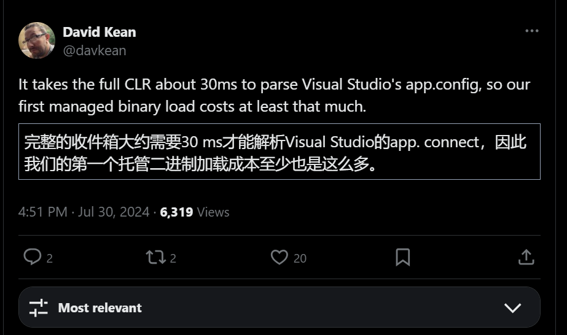

## 国内文章
### EF Core性能优化技巧

https://www.cnblogs.com/baibaomen-org/p/18338447

这篇文章介绍了在代码层面上优化EF Core实例池和拆分查询的方法。首先，文章建议使用DbContext实例池来重复利用实例，避免资源浪费，并提供相关使用示例。其次，文章讨论了笛尔卡乘积对复杂查询性能的影响，并推荐使用拆分查询来优化SQL语句的执行。通过具体的代码示例和生成的SQL对比，文章详细说明了如何应用这些优化方法。

### .NET 高性能缓冲队列实现 BufferQueue

https://www.cnblogs.com/eventhorizon/p/18331018

BufferQueue 是一个用 .NET 编写的高性能缓冲队列，支持多线程并发操作。支持创建多个 Topic 和 Consumer Group，允许负载均衡和批量消费，支持 pull 和 push 模式。使用示例展示了如何通过 Nuget 安装和配置服务。BufferQueue 能有效处理生产者和消费者速度不一致的问题。

### .NET 权限工作流框架 TOP 榜

https://www.cnblogs.com/1312mn/p/18331216

这篇文章介绍了一款基于.NET权限管理及快速开发框架。该框架采用领域驱动设计，结合SqlSugar、EF等最新技术，支持多种ORM框架和数据库，具有强大的权限控制功能和可视化设计工具。框架适用于中小企业，具有良好的扩展性。提供了多个预览地址和开源链接，并且包含一些具体的功能模块和技术架构的描述。

### 从C++看C#托管内存与非托管内存

https://www.cnblogs.com/ggtc/p/18333486

文章讨论了进程内存管理，集中讲述堆区内存分配。涉及C#、C++以及C语言中的内存分配方式及差异。C#通过new关键字申请的内存位于托管堆，GC负责管理垃圾回收；C++和C的内存分配在非托管堆，需手动释放。文章详细介绍了通过调用C++动态链接库在C#中申请非托管堆内存的方法。

### .NET8 Blazor 从入门到精通：（一）关键概念

https://www.cnblogs.com/timefiles/p/18338176

本文介绍Blazor的关键概念，包括项目模板、Razor语法、依赖注入、注入配置、HeadOutlet组件、@code分离、Blazor调试和CSS隔离。通过多个示例，解释了如何在Blazor项目中实现这些功能。文章还提到了学习资料和课程推荐，详细说明了每个知识点并附上参考资料。

### 基于EasyTcp4Net开发一个功能较为完善的去持久化聊天软件

https://www.cnblogs.com/qwqwQAQ/p/18330325

作者介绍了自己开发的EasyTcp4Net工具库，并基于此开发了一个聊天程序，包含文本发送、图片发送、断线重连等功能。本文详细描述了数据包结构及其序列化方式，提供了示例代码并解释了消息传递的逻辑。同时，利用EasyTcp4Net的事件处理机制实现了断线重连功能。

### 一文带你了解CAP的全部特性，你学会了吗？

https://www.cnblogs.com/savorboard/p/18333869/cap-features

这篇文章全面介绍了CAP的特性，包括消息发布、事务消息、延迟消息、多线程处理、监控和与ASP.NET Core权限的集成等。文章旨在帮助新用户全面了解CAP的功能，以便在选型时提供参考。文中提到CAP不仅适用于分布式事务，还在消息处理方面表现出色，且兼容性和稳定性良好。CAP诞生于2016年，目前在Github上有6500+ Star和110+贡献者，NuGet下载量超800万次。

### .NET 开源快捷的数据库文档查询和生成工具

https://www.cnblogs.com/1312mn/p/18333223

SmartSQL是一款专为.NET平台设计的开源数据库文档工具，简化了数据库文档查询、生成和管理的流程。它支持多种数据库和文档格式，能自动生成详尽的数据库文档，确保信息的时效性和准确性。本文介绍了SmartSQL的功能特性及其实际应用案例，并展示了如何利用该工具优化数据库文档管理。

### Net8将Serilog日志推送ES，附视频

https://www.cnblogs.com/OrcCoCo/p/18334274

文章展示了Serilog在.NET 8项目中的实践，包括日志区分存储、AOP日志记录、EF日志记录，并推送至Elastic Search。作者从实际代码出发，介绍了相关环境准备和实现步骤。文中详细描述了如何配置Program.cs文件以实现上述功能，通过引用Autofac和Serilog，设置单例模式配置及日志记录器的实现。

### .NET 结果与错误处理利器 FluentResults

https://www.cnblogs.com/1312mn/p/18336221

在项目开发中，处理方法返回结果非常重要。传统方法如异常或返回布尔值虽然有效但缺乏直观性。FluentResults库优化了这一过程，使操作结果传递更加自然易懂，提高代码可读性与维护性。它不仅集中一致地处理错误，还提升了代码结构和逻辑的流畅性。FluentResults是.NET环境中广泛使用的库，通过链式调用，可以优雅地处理结果和错误，并支持创建包含成功、错误、警告或信息的对象。

### 概述C#中各种类型集合的特点

https://www.cnblogs.com/ayic/p/18334908

在C#中，集合用于存储和操作一组数据项，位于 System.Collections 和 System.Collections.Generic 命名空间中。System.Collections 包含非泛型集合，如 ArrayList、Hashtable、Stack 和 Queue 等，这些集合缺乏类型安全性。System.Collections.Generic 包含泛型集合，如 List、HashSet、Dictionary、SortedDictionary、Queue、Stack 和 LinkedList 等，这些集合确保类型安全性。

### SourceGenerator 生成db to class代码优化结果记录 二

https://www.cnblogs.com/fs7744/p/18340422

文章探讨了如何通过不使用迭代器、利用span、ArrayPool和预生成hashcode等方法优化Dapper AOT的性能。使用BenchmarkDotNet进行性能测试，结果考虑了jit优化和统计学处理。测试数据采用手动mock方式，避免外部因素影响。

### 一款基于Fluent设计风格、现代化的WPF UI控件库

https://www.cnblogs.com/Can-daydayup/p/18333471

本文介绍了一款基于Fluent设计风格的WPF UI控件库，包括其主要功能和使用方法。WPF提供灵活布局、数据绑定等，适用于构建Windows应用。文中提到项目源码、控件演示方法和开源地址，并鼓励读者关注和支持该项目。

### C# 多线程环境下控制对共享资源访问的办法

https://www.cnblogs.com/INetIMVC/p/18330485

本文介绍了C#中几种同步机制：Monitor、Mutex、ReaderWriterLockSlim、Semaphore和SemaphoreSlim。Monitor通过Enter和Exit方法提供排他锁，适合粗粒度同步。Mutex是操作系统对象，支持跨进程同步，但性能开销较大。ReaderWriterLockSlim实现读写分离锁，适合读多写少场景，但比较复杂。Semaphore控制同时访问资源的线程数量，使用灵活。SemaphoreSlim是轻量级信号量，开销较小，更适合频繁资源访问。

### 支付宝退款和结果查询接口简单实现（.Net 7.0）

https://www.cnblogs.com/hnzhengfy/p/18330730/alipay_refunds

本文介绍如何在 .Net 平台上集成支付宝的退款和退款状态查询接口，包括引入必要的 SDK，提供公钥和私钥设置，配置请求参数，并通过示例代码展示接口调用过程。文章重点在于详细讲解配置方法和注意事项，以便开发者能够快速上手并成功实现对接。

### 使用 C# 和 ONNX 來玩转Phi-3 SLM

https://www.cnblogs.com/shanyou/p/18342014

文章详细介绍了微软推出的小型语言模型Phi-3 SLM及其在不同设备上的应用，强调了Phi-3与ONNX Runtime的结合，提升了AI模型的互操作性和性能。文章还具体说明了如何在C# .NET应用中使用Phi-3模型，并提供了相关示例和代码说明，如模型加载、Prompt设定、生成Token和响应解码等。最后介绍了Phi-3的不同版本和从HuggingFace下载模型的方法。

### SemanticKernel/C#：检索增强生成(RAG)简易实践

https://www.cnblogs.com/mingupupu/p/18336055

检索增强生成(RAG)结合检索技术和生成模型，用于自然语言处理任务。它通过从外部知识库中检索信息并结合输入文本生成更准确的输出，适用于需要大量背景知识的任务。文中示例展示大语言模型如何使用私有文档回答特定问题。实现步骤包括将文本转化为向量，存入数据库，并构建一个ISemanticTextMemory，使用硅基流动平台的Qwen模型进行实践。

### Blazor Web 应用如何实现Auto模式

https://www.cnblogs.com/known/p/18340707

本文介绍了Blazor Web应用Auto交互呈现模式的实现方案，基于Known框架，包含前后端共用项目、客户端项目及相应实现步骤。前后端共用项目Sample定义系统实体类及服务接口。客户端项目Sample.Client引用WebAssembly和Castle依赖实现Http动态代理，包括项目工程文件配置、HttpClientInterceptor类，实现Http请求的动态代理，及Program.cs文件中的客户端配置。

### .NET 窗口/屏幕截图

https://www.cnblogs.com/kybs0/p/18330803

文章介绍了如何通过GDI从窗口或屏幕获取截图，并提供了详细的代码示例，包括从桌面句柄获取设备上下文，创建兼容的设备上下文和位图句柄，并使用BitBlt进行像素复制。

### 云原生 .NET Aspire 8.1 新增对 构建容器、编排 Python的支持

https://www.cnblogs.com/shanyou/p/18331445

.NET Aspire是用于云原生应用开发的框架，支持构建、测试和部署微服务、容器和无服务器架构。2024年7月发布的8.1版本是该平台的首次重大更新，新增了容器镜像的构建和Python代码的编排功能。AddDockerfile(...)方法自动构建和定制Docker文件，而AddPythonProject(...)方法支持多语言微服务架构，简化Python服务的启动。新版本还提供了容器化扩展的新资源类型和组件，改进了测试和指标示例，提升了实例ID名称的可读性。

### 架构演化思考总结(2)

https://www.cnblogs.com/TonyCode/p/18335588

本文讨论命令模式在架构设计中的应用，强调其在简化复杂逻辑管理、提升代码复用性和便于协作开发方面的优势。通过具体实例展示如何用命令模式封装操作逻辑，并介绍了添加参数和撤销功能的实现方法。文章内容丰富，示例详细，适合开发者参考。

### SemanticKernel/C#：使用Ollama中的对话模型与嵌入模型用于本地离线场景

https://www.cnblogs.com/mingupupu/p/18339290

文章介绍了在SemanticKernel/C#中如何使用Ollama的对话模型和嵌入模型用于本地离线场景，详细讲解了模型下载、初始化、设置及调用的方法，并提供了一些代码示例。文章还提到，由于嵌入模型不兼容OpenAI格式，需要自己实现接口。作者推荐了一个GitHub项目，可以直接用已实现的包来减少开发工作。

### 使用Aspire优雅的进行全栈开发——WinUI使用Semantic Kernel调用智普清言LLM总结Asp.Net Core通过Playwright解析的网页内容

https://www.cnblogs.com/GreenShade/p/18341903

这篇博客记录了作者在学习语义内核和Aspire进行全栈开发的实践。内容包括使用Asp.Net Core WebApi、Playwright库获取Bing搜索结果、WinUI编写客户端结合语义内核、Blazor创建后台管理页面等。作者选择这些技术是因为.Net相关性和新技术实践，并详细说明了每种工具的使用理由。代码示例展示了如何使用Playwright模拟用户操作来获取搜索结果并解析成JSON数据。

### 一个基于 SourceGenerator 生成 从 dbReader转换为 class 数据的性能测试实验

https://www.cnblogs.com/fs7744/p/18332993

文章介绍了作者基于SourceGenerator生成从dbReader转换为class数据的测试，对比了生成代码与动态生成代码的差距，尤其针对泛型类型和匿名类型处理进行了探讨。作者通过示例代码展示了生成代码的实现和测试结果。

### 架构演化学习思考(3)

https://www.cnblogs.com/TonyCode/p/18337666

本文继续探讨命令模式，详细介绍了经典命令模式的实现，包括Command、ConcreteCommand、Invoker、Receiver等角色，并通过代码示例说明其应用。作者还用商品购买案例演示了这些角色的具体实现。最终，文章总结了命令模式在架构设计中的应用价值，例如解耦Invoker和Receiver，支持命令扩展等。通过具体例子对“架构”概念进行诠释，并探讨了命令模式与观察者模式的区别。

### .NET 8 通用权限框架 前后端分离，开箱即用

https://www.cnblogs.com/1312mn/p/18337641

Admin.NET是基于.NET 8开发的通用权限框架，前端使用Vue3/Element-plus。该平台整合最新技术，支持多租户、缓存、数据校验等功能，简洁易上手，适用于中小企业快速开发。它兼容国产操作系统和数据库，满足等级保护测评要求，具备丰富的功能模块，如用户管理、日志管理、任务调度等。推荐给需要提升开发效率的开发者。

### SourceGenerator 生成db to class代码优化结果记录

https://www.cnblogs.com/fs7744/p/18338301

文章描述了优化代码的方法，包括减少类型判断和避免生成委托，但仍无法超越Dapper aot。作者提到提前做类型判断并使用switch case减少判断，且去除了委托生成使用，详细列举了优化前后的代码片段。

### 使用 Alba 对 AspnetCore项目进行测试

https://www.cnblogs.com/vipwan/p/18340537

本文介绍了在AspnetCore生态系统中使用Alba进行集成测试的方法。详细描述了如何安装Alba包，并创建一个简单的ASP.NET Core应用进行演示。接着，通过xUnit展示了如何使用AlbaHost配置测试场景并进行断言。还包括了POST请求的链式语法风格、自动序列化和反序列化支持，以及处理鉴权认证的封装。

### 英语.Net多语言开发中的问题

https://www.cnblogs.com/zhangchen-trunk/p/18342375

多语言开发成本高，解决方法常涉及文化差异，如浮点数与字符比较。本文通过代码示例展示文化差异的影响，并建议修改系统账户语言设置来解决问题。

## 主题
### IdentityServer 安全补丁 （CVE-2024-39694） - Duende Software Blog
https://blog.duendesoftware.com/posts/20240731_security_patch

Duende.IdentityServer 的安全修复程序已发布。

此版本修复了一个开放重定向漏洞。 除了漏洞的细节外，本文还谈到了从这次应对中吸取的教训。

### 发布 发布 v2.65.0 · grpc/grpc-dotnet
https://github.com/grpc/grpc-dotnet/releases/tag/v2.65.0

grpc-dotnet v2.65.0 发布

此版本包括版本检查和减少 Windows Server 上的线程池耗尽等改进。

### 使用数据保护的默认配置轻松将 .NET 应用部署到 Azure 容器应用
https://techcommunity.microsoft.com/t5/apps-on-azure-blog/easily-deploy-net-apps-to-azure-container-apps-with-default/ba-p/4204285

Azure 容器应用在预览版中支持 ASP.NET 数据保护。

现在，可以使用单个设置配置在多个副本上运行时所需的数据保护。 支持因 .NET 版本而异。

## 文章、幻灯片等
### 使用 .NET 和 ML.NET 检测异常：实用指南
https://dev.to/alisson_podgurski/detecting-anomalies-with-net-and-mlnet-a-practical-guide-ng5

了解如何使用 ML.NET 实现异常情况检测。

### 使用 C# Semantic Kernel 和 Ollama 在您自己的设备上运行 Phi-3
https://zenn.dev/microsoft/articles/semantickernel-dotnet-phi3-01

了解如何结合使用语义核 （.NET） 和 Ollama 在本地环境中运行 Phi-3 模型。

### 点洞察 | 2024 年 8 月 | .NET 工具博客
https://blog.jetbrains.com/dotnet/2024/08/01/dotinsights-august-2024/

JetBrains .NET 2024 年 8 月摘要。

### .NET 8 和 .NET 9 中的 SearchValues
https://medium.com/codenx/searchvalues-in-net-8-and-net-9-42b88444eefa

描述并使用 .NET 8 中引入的 SearchValues 类。 本文还提到了 .NET 9 中的改进。

### 使用 EventPipe 跟踪分配第 2 部分 — 在没有 TraceLog 的情况下读取调用堆栈
https://medium.com/@ocoanet/tracing-allocations-with-eventpipe-part-2-reading-call-stacks-without-tracelog-4b0bfe4592aa

尝试使用 EventPipe 进行跟踪以读取调用堆栈。

### 使用 Ollama 和 AutoGen.Net 的本地模型进行工具调用
https://dev.to/littlelittlecloud/tool-call-with-local-model-using-ollama-and-autogennet-3o64

了解如何使用 Ollama 和 AutoGen.Net 从本地模型调用工具。

### 增强 F# Interactive 中的 #help - .NET 博客
https://devblogs.microsoft.com/dotnet/enhancing-help-in-fsi/

介绍在 .NET 9 的 F# Interactive 中添加的 #help 指令。

### .NET 8 Web API，使用 Elasticsearch 和 Kibana
https://medium.com/@faulycoelho/net-web-eb-api-with-elasticsearch-and-kibana-e26c6eba27b3

使用 ASP.NET Core、Elasticsearch 和 Kibana 的简单日志可视化实现。

### Microsoft.Extensions.Configuration 和 Microsoft.Extensions.Options 的使用介绍 - Qiita
https://qiita.com/sakatuba@github/items/3908409d48004b19c98f

简要说明如何使用 Microsoft.Extensions.Configuration 和 Microsoft.Extensions.Options 以及它们的作用。

### 使用本机库互操作为 .NET MAUI 创建绑定 - .NET Blog
https://devblogs.microsoft.com/dotnet/native-library-interop-dotnet-maui/

Native Library Interop for .NET 介绍如何使用 MAUI 轻松实现本机绑定。 本文使用图表库实现了一个适用于 iOS/Android 的库。

### ASP.NET Core MVC 中的高级路由技术，用于大规模应用程序
https://medium.com/@bhavinmoradiya99/advanced-routing-techniques-in-asp-net-core-mvc-for-large-scale-applications-71547485a43f

它简要介绍了 ASP.NET Core 的路由控制的一些实现模式。

### [Office] 使用 msi 分发 VSTO 加载项
https://zenn.dev/shimarisu_121/articles/09af3ff2930c99

提供有关以 msi 格式打包和分发 VSTO 外接程序的分步说明。

### 使用 Sign CLI 对 VSIX 包进行签名 - Visual Studio Blog
https://devblogs.microsoft.com/visualstudio/sign-vsix-packages-with-sign-cli/

了解如何使用 sign 命令行工具对 VSIX 包进行签名。

### 创建一个 .NET PlantUML Markdown 渲染扩展
https://weblog.west-wind.com/posts/2024/Jul/29/Create-a-PlantUML-Markdown-RenderExtension

在 Markdown 预览中呈现 PlantUML 的扩展的实现。 本文介绍如何生成 URL 以在 PlantUML 服务器上呈现图像。

### 我修复过的最糟糕的 .NET 错误
https://petabridge.com/blog/worst-dotnet-bug/

遇到的问题以及如何处理 Akka.NET 中困难的分布式系统/分片问题。

### 今天的 C# 中的单例模式不是你爸爸的模式！
https://blog.postsharp.net/singleton

单例（包括 DI）的实现模式，以及如何验证需要单例的类的构造函数调用位置。

### .Net Aspire 中的自定义反向地理编码资源和容器启动依赖项
https://dev.to/syamaner/building-a-custom-reverse-geocoding-resource-for-net-aspire-2n9o

使用 .NET Aspire 的本地托管 Nominatim 进行地理编码、反向地理编码的说明。

### ASP.NET Core 和 Entity Framework Core 的运行状况检查
https://khalidabuhakmeh.com/health-checks-for-aspnet-core-and-entity-framework-core

了解 ASP.NET Core 的运行状况检查以及如何实施与 Entyty Framework Core 结合使用的运行状况检查。

### Avalonia UI：使用 DataGrid 和转换器增强您的应用程序
https://medium.com/@faruk.akyapak/avalonia-ui-enhance-your-app-with-datagrid-and-converters-faf8f2dc7562

了解如何使用 Avaloia 的 DataGrid。

### 创建仅限源的 NuGet 包
https://andrewlock.net/creating-source-only-nuget-packages/

Buri 用例：仅包含源代码而不包含程序集的 NuGet 包，以及如何创建一个。

### 即将推出对 Azure.AI.OpenAI 和 OpenAI v2 的支持 | 语义核
https://devblogs.microsoft.com/semantic-kernel/support-for-azure-ai-openai-and-openai-v2-is-coming/

即将在语义内核中支持 Azure.AI.OpenAI 和 OpenAI v2。

本文介绍了更改后升级可能发生的情况以及如何处理。

### 谁写了《蓝屏死机》并不神秘，尽管有些人可能想让你相信 - 旧事物
https://devblogs.microsoft.com/oldnewthing/20240730-00/?p=110062

## 网站、文档等
### 推文

在 .NET 9 的 SignalR 中引入分布式跟踪。

https://x.com/jamesnk/status/1818928330810200330?s=12

---

std-uritemplate（.NET 版本）现已在 .NET Foundation 中提供。

https://x.com/dotnetfdn/status/1819368806000599405?s=12

---

谈谈即将推出的 Visual Studio 支持HTTP 请求文件中的请求变量的预览版。

https://x.com/sayedihashimi/status/1819514959073603617?s=12

---

完整 CLR （.NET Framework） 需要一些时间来处理 Visual Studio 的 app.config（在读取第一个 Buri 之前）。

https://x.com/davkean/status/1818207766642860259?s=12

## 版权声明

* 国内板块由 InCerry 进行整理 : https://github.com/InCerryGit/.NET-Weekly
* 其余内容来自 Myuki WeekRef，由InCerry翻译（已获得授权） : https://github.com/mayuki/WeekRef.NET

**由于笔者没有那么多时间对国内的一些文章进行整理，欢迎大家为《.NET周刊-国内文章》板块进行贡献，需要推广自己的文章或者框架、开源项目可以下方的项目地址提交Issue或者在我的微信公众号私信。**

格式如下：

* 10~50字左右的标题
* 对应文章或项目网址访问链接
* 200字以内的简介，如果太长会影响阅读体验

https://github.com/InCerryGit/.NET-Weekly

## .NET性能优化交流群

相信大家在开发中经常会遇到一些性能问题，苦于没有有效的工具去发现性能瓶颈，或者是发现瓶颈以后不知道该如何优化。之前一直有读者朋友询问有没有技术交流群，但是由于各种原因一直都没创建，现在很高兴的在这里宣布，我创建了一个专门交流.NET性能优化经验的群组，主题包括但不限于：

* 如何找到.NET性能瓶颈，如使用APM、dotnet tools等工具
* .NET框架底层原理的实现，如垃圾回收器、JIT等等
* 如何编写高性能的.NET代码，哪些地方存在性能陷阱

希望能有更多志同道合朋友加入，分享一些工作中遇到的.NET性能问题和宝贵的性能分析优化经验。**目前一群已满，现在开放二群。**

如果提示已经达到200人，可以加我微信，我拉你进群: **ls1075**

另外也创建了**QQ群**，群号: 687779078，欢迎大家加入。 

