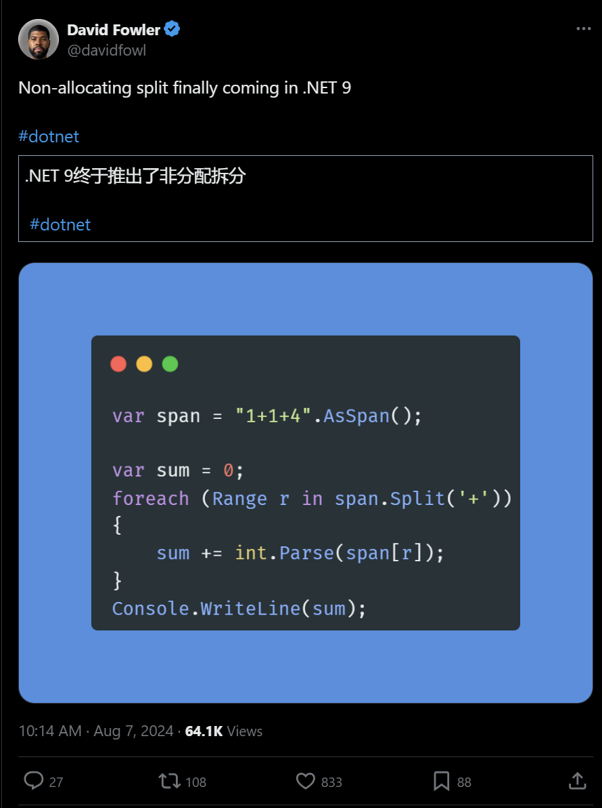

.NET周刊【8月第2期 2024-08-11】dotnet_week_24_8_2
## 国内文章
### 莽撞闯荡的6周年,也就是弹指一挥间

https://www.cnblogs.com/shanyou/p/18347928

作者回顾了从2018年离开腾讯至今6年的经历，这段时间里他继续围绕C# 开展业务和活动。在离职前夕，他参与了腾讯云 API 3.0 的 .NET SDK 开发，并开源了该项目。这6年间，他见证了技术纷争和信息系统国产化的事件，并推动了 .NET 技术的普及和应用，特别是在云原生生态和人工智能领域。他强调持续学习和保持好奇心的重要性，并提出要以积极心态面对职场变化。他对 C# 的热爱依旧未变。

### .NET 免费开源工业物联网网关

https://www.cnblogs.com/1312mn/p/18346502

本文介绍了一个名为IoTClient的开源客户端库，用于实现与各种工业设备的通信。该库使用C#编写，基于.NET Standard 2.0，支持多种工业通讯协议，包括PLC通信、ModBus和Bacnet。IoTClient具有跨平台特性，可以在Windows、Linux和Raspberry Pi等平台上运行。该库采用MIT许可证发布，允许自由使用和修改。通过NuGet包管理器安装，可以方便地集成到项目中。本文还详细介绍了ModBusTcp的读写操作方法。

### C#.Net筑基-解密委托与事件

https://www.cnblogs.com/anding/p/18229672

委托与事件是C#中用于将方法作为参数传递的技术，历史悠久。委托类似函数指针，通过delegate关键字定义，继承自System.MulticastDelegate和System.Delegate。委托可以传递、调用方法，并支持多播。主要应用场景包括回调方法、Lambda表达式和事件。多播委托允许组合多个方法。委托类实际上是编译器生成的密封类，执行通过Invoke方法。推荐使用?.Invoke操作符判断委托是否为null。

### 在IIS上部署ASP.NET Core Web API和Blazor Wasm详细教程

https://www.cnblogs.com/Can-daydayup/p/18349752

文章介绍如何在IIS上部署ASP.NET Core Web API和Blazor Wasm。首先列出前提条件，包括安装.NET Core SDK、IIS Web服务器和.NET Core托管捆绑包，以及URL重写模块。然后详细讲解了ASP.NET Core Web API和Blazor Wasm的发布部署过程，并提供了相关配置和调试说明。最后给出了一些参考链接和项目源码地址。

### 推荐一款界面优雅、功能强大的 .NET + Vue 权限管理系统

https://www.cnblogs.com/1312mn/p/18342737

本文推荐了一款基于.NET和Vue3的开源权限管理系统，名为Malus，适合不同规模企业。系统前后端分离，使用JWT认证，前端基于Soybean Admin，后端基于.NET 7和sqlsugar。系统功能强大，界面设计优雅，易于上手，提供了在线演示和文档资源，适合快速开发使用。

### 推荐一款.NET开源、功能强大的二维码生成类库

https://www.cnblogs.com/Can-daydayup/p/18342126

本文介绍了一个名为QrCodeGenerator的.NET开源二维码生成类库，具有跨平台兼容性、丰富的输出格式和高效的文本编码等特点。文章还提供了如何在各种环境中使用该库的示例代码，并讨论了图像生成扩展方案及如何在控制台应用中快速实现二维码生成。最后，提供了项目源码及开源地址。

### 一款.NET开发的AI无损放大工具

https://www.cnblogs.com/Can-daydayup/p/18352365

本文介绍了由.NET开源的AI无损放大工具AI-Lossless-Zoomer，基于腾讯ARC Lab提供的Real-ESRGAN模型开发，专注于人像和动漫图片的高质量放大。工具支持多线程处理、批量图片处理和自定义设置等功能，适用于Windows 7+系统。项目源码和更多详情见开源地址，同时该项目已被收录到C#/.NET/.NET Core优秀项目和框架精选中。

### .NET 窗口/屏幕录制

https://www.cnblogs.com/kybs0/p/18330811

该文章探讨了屏幕截图及画面录制的常见方案，包括GDI和WGC。GDI使用方便但性能较差，适合低性能需求场景。WGC为Win10新引入机制，详细介绍了WGC的实现步骤，包括创建捕捉项、生成D3D设备及上下文、处理帧等。文章技术细节丰富，涉及SharpDX库的具体应用。

### C#12 实验特性Interceptor如何使用的一个简单但完整的示例

https://www.cnblogs.com/fs7744/p/18346094

本文简单示例解释了C# 12的实验特性拦截器（Interceptor）。拦截器可以在编译时替换方法调用，通过源生成器添加新代码。示例展示如何建立类库并设置项目属性以启用拦截器功能。具体步骤包括建立类库、设置项目属性和生成代码文件，帮助读者了解和尝试源生成器生成的代码内容。

### .NET 开源权限认证项目 MiniAuth上线

https://www.cnblogs.com/1312mn/p/18344646

MiniAuth是专为.NET开发者设计的ASP.NET Core插件，用于简化权限认证。它支持多种认证方式，操作简单、非侵入性强且兼容多数据库。通过NuGet安装，并在Startup或Program类中配置。配置完成后，可通过默认管理界面管理用户、角色和权限。支持自定义和扩展，适应不同项目需求。

### .NET电子邮件高效处理解决方案

https://www.cnblogs.com/Can-daydayup/p/18344124

在软件开发中，电子邮件处理是必不可少的功能。本文介绍了两款.NET开源电子邮件处理库：MailKit和FluentEmail。MailKit支持发送、接收和处理电子邮件，全面支持SMTP、POP3和IMAP协议。FluentEmail则简化了电子邮件发送，并支持Razor模板和多种发送方式。文末提供了优秀C#/.NET/.NET Core项目和框架的精选链接。

### .NET 与 LayUI 实现高效敏捷开发框架

https://www.cnblogs.com/1312mn/p/18347553

WaterCloud 是一个基于 ASP.NET 和 LayUI 的高效开发框架，支持多种 .NET 版本。内置权限管理、表单设计、多租户架构等功能，使用 ORM 处理数据，提升开发效率。框架采用模块化设计，支持多数据库、响应式布局和定时任务，适用于各种管理软件开发。

### 记一次 .NET某智慧出行系统 CPU爆高分析

https://www.cnblogs.com/huangxincheng/p/18348453

文章描述了一个系统出现CPU 100%的问题，并通过WinDbg工具进行了详细的分析。发现所有线程池线程被打满，线程池队列累计了8694个任务。进一步通过查看线程堆栈，发现大多数线程在等待ResourceClientManager的GetClient方法完成，怀疑线程池已全面沦陷。探究源代码，作者简化代码，发现锁操作和等待机制是导致问题的原因。

### .NET 8 + Blazor 多租户、模块化、DDD框架、开箱即用

https://www.cnblogs.com/1312mn/p/18350326

这篇文章介绍了一个基于 .NET 8 的开源项目，主要使用 WebAPI 和 Blazor，支持多租户和模块化设计，采用 DDD 架构。项目适合快速开发 Web 应用程序，支持多种数据库。技术栈包括 ASP.NET Core 8、Entity Framework Core 8、CQRS、Docker、AWS 部署等。文章提供了下载、运行和部署项目的详细步骤，并附有项目地址和在线文档链接。

### 编程技巧 - 远程调试

https://www.cnblogs.com/pandefu/p/18354081

文章介绍Visual Studio远程调试功能，包括其定义、用途和详细的操作步骤。文中提供了搭建远程调试环境的方法，以及编写和调试测试代码的流程。远程调试能在不同环境中有效地诊断和解决问题，尤其适用于生产服务器等场景。文章还提到设置远程调试器的关键细节和使用文件共享进行远程调试器配置的方法。

### 增强用户体验：2个功能强大的.NET控制台应用帮助库

https://www.cnblogs.com/Can-daydayup/p/18346072

文章介绍了两个强大的.NET控制台应用工具库Terminal.Gui和Spectre.Console，并分别讲述它们的主要功能和特点。这些库可以帮助开发者快速构建跨平台、强交互性、功能丰富的控制台应用程序，同时提升代码可读性和开发效率。文章还鼓励读者关注优秀项目和框架精选，以了解最新动态和最佳实践。

### 微信支付退款和退款结果查询接口简单实现（.NET 7.0）

https://www.cnblogs.com/hnzhengfy/p/18339226/Wecha_refunds

本文介绍了如何使用社区封装的微信支付 v3 版 .Net SDK 来实现退款和查询退款状态。文章详细说明了 SDK 的引入、必要的账户信息，以及具体的代码实现步骤，包括创建客户端对象和调用退款接口。

### 前后端分离项目，后期前端身份验证的麻烦

https://www.cnblogs.com/ggtc/p/18348521

文章介绍了一个asp.netcore项目，后端使用jwt进行身份验证和鉴权，前端使用静态文件。安全要求需要对前端页面进行身份验证，通过登陆生成的token存入redis，并使用cookie携带token在前端验证。文章也描述了在iframe嵌入页面时遇到跨域cookie问题，以及最后通过url传递token的方案。

### 记一次 .NET某环境监测系统 崩溃分析

https://www.cnblogs.com/huangxincheng/p/18350168

文章描述了如何使用WinDbg分析程序崩溃的问题。通过讲述一个朋友程序崩溃的故事，作者展示了使用WinDbg的自动化分析命令!analyze -v确定崩溃码，并深入分析得到真实异常码的方法。通过跟踪RaiseException的父函数，文章展示了具体的分析步骤和结果。

### 解锁GraphRag.Net的无限可能：手把手教你集成国产模型和本地模型

https://www.cnblogs.com/xuzeyu/p/18343527

文章介绍了GraphRag.Net的自定义模型和本地模型的集成方法。通过示例代码，展示了如何配置OpenAI、文本切片和数据库连接，并注入GraphRag.Net服务。提供了自定义服务接口ITextGenerationService、IChatCompletionService和ITextEmbeddingGenerationService的实现示例，展示了如何实现这些接口以支持本地模型。

### EF Core连接PostgreSQL数据库

https://www.cnblogs.com/mingupupu/p/18347247

本文介绍了PostgreSQL和Entity Framework Core（EF Core）。PostgreSQL是一个强大的开源对象关系数据库系统，支持丰富的数据类型和高级功能，适用于高并发应用。EF Core专为.NET设计，支持多种数据库，提供LINQ查询、变更跟踪和模式迁移。文章还详细说明了如何在.NET环境中结合EF Core和PostgreSQL进行开发，并提供了相关示例和步骤。

### 朋友吐槽我为什么这么傻不在源生成器中用string.GetHashCode, 而要用一个不够优化的hash方法

https://www.cnblogs.com/fs7744/p/18352853

文章讨论了在.NET中的字符串哈希问题，尤其是为何不能使用string.GetHashCode()，而要使用自定义哈希方法。作者解释了.NET Core中GetHashCode()会随机化导致运行结果不一致，主要原因是安全性和防止DoS攻击。还提到NormalizedHash性能很强，但并不是唯一可用方法，并展示了其实现。文章引用了微软官方文档和Stephen Toub的解释，强调GetHashCode()不应用于持久化哈希值。

### SemanticKernel/C#：实现接口，接入本地嵌入模型

https://www.cnblogs.com/mingupupu/p/18344517

本文介绍了如何在Codeblaze.SemanticKernel项目中实现ITextEmbeddingGenerationService接口，以接入本地嵌入模型。SemanticKernel初看只支持OpenAI模型，但通过实现自己的接口，可接入不兼容OpenAI格式的模型。当前Ollama的嵌入未兼容OpenAI格式，因此可通过实现ITextEmbeddingGenerationService接口来接入。文中还介绍了OllamaBase类的实现细节。

### 架构演化学习思考(4) --- IOC的学习认识

https://www.cnblogs.com/TonyCode/p/18344109

文章介绍了IOC（控制反转）和DI（依赖注入）的概念及实现方式。IOC通过容器管理类与类之间的依赖关系，DI则注重依赖关系的建立过程。文章详细说明了如何使用IOCContainer进行依赖注入，并将其比喻为“租房中介”。此外，文章还讨论了IOCContainer的优势，如有效管理复杂项目中的依赖关系，避免层级关系的破坏。案例让读者更容易理解IOCContainer的实际应用。

### 基于SiliconCloud快速体验GraphRag.Net

https://www.cnblogs.com/mingupupu/p/18349566

SiliconCloud 基于开源大模型，提供高效推理加速服务。用户可自由切换不同的模型，提高开发效率并降低成本。GraphRag.Net 是 GraphRag 的 .NET 版本，兼容硅基流动 API。启动项目后可生成知识图谱，便于进一步学习和研究。

### C#自定义快捷操作键的实现 - 开源研究系列文章

https://www.cnblogs.com/lzhdim/p/18342051

文章介绍了如何使用Windows API函数注册窗体热键，并提供了一个DEMO帮助类。内容包括项目目录、源码介绍、运行界面和使用方法，方便读者复用代码。另外，提供了源码下载链接和其它建议。

## 主题
### ReSharper 和 .NET 工具 2024.2 候选版本现已推出 | .NET 工具博客
https://blog.jetbrains.com/dotnet/2024/08/07/resharper-2024-2-release-candidate/

ReSharper 2024.2 候选版本已发布。

此版本包括一些改进，例如扩展的 C# 12 功能支持、对 C# 13 的初始支持（例如 ref struct、\e 转义序列和 params 修饰符）以及通过异步类型改进的字符输入性能。

还提到了 ReSharper C++、dotMemory、dotTrace、dotCover 和 dotPeek 的其他更新。

### Rider 2024.2 候选版本现已推出 | .NET 工具博客
https://blog.jetbrains.com/dotnet/2024/08/07/rider-2024-2-rc/

Rider 2024.2 候选版本已发布。

此版本包括对 .NET 9 Preview SDK 和 C# 13 功能的初步支持、全行代码完成、阅读器模式、文档注释的内联渲染、语义突出显示、任务选项卡和依赖关系图以及许多其他改进。

## 文章、幻灯片等
### [C# 12、.NET 8] 如何在 C# 异步处理中有效使用取消令牌
https://zenn.dev/nossa/articles/df258b3ddc351f

关于如何在异步处理中使用 CancellationToken 的说明。

本文解释了如何在每个用例中使用它。

### [C#] 使用 StandardResilienceHandler 提高 HTTP 请求的弹性。 - 尼诺的花园。
https://blog.neno.dev/entry/2024/08/08/171524

了解如何使用 Microsoft.Extensions.Http.Resilience 来提高 HTTP 请求失败等问题的恢复能力。

本文涉及StandardResilienceHandler、Polly 在幕后使用以及如何配置它。

### 将 .NET Aspire 添加到您现有的 .NET 应用程序 - .NET 博客
https://devblogs.microsoft.com/dotnet/adding-dotnet-aspire-to-your-existing-dotnet-apps/

有关将 .NET Aspire 添加到现有 .NET 应用程序并启用集成的分步说明。

从激活到查看指标和日志的分步说明。

### 转义字符、提取通用代码、参数修饰符、Out Vars – 2024.2 中的 C# 语言支持 | .NET 工具博客
https://blog.jetbrains.com/dotnet/2024/08/07/escape-character-extract-common-code-params-modifier-out-vars-csharp-language-support-in-2024-2/

介绍 Rider 和 ReSharper 2024.2 中 C# 语言支持的新功能。

本文介绍了转义字符、公共代码提取、参数修饰符和 out 变量代码完成等功能。

### HotChocolate GraphQl——限制别名重载
https://medium.com/@sankeththesmasher/hotchocolate-graphql-limit-alias-overloading-3867aa28af3a

如何限制 HotChocolate 中查询中的最大别名数。

### 使用 Xunit.Combinatorial 简化[理论]测试数据
https://andrewlock.net/simplifying-theory-test-data-with-xunit-combinatorial/

如何组合执行单元测试参数。

本文介绍如何使用Xunit.Combinatorial指定参数。

### 介绍改进的 Attach to Process 体验 - Visual Studio 博客
https://devblogs.microsoft.com/visualstudio/introducing-the-revamped-attach-to-process-experience/

引入 Visual Studio 2022 版本 17.10 中引入的新调试器进程附加窗口。

新的 UI 经过重新设计，更加易于使用，包括主题支持和流程树显示。

### Nuking 本地 Nuget 包源以显示新发布的包
https://weblog.west-wind.com/posts/2024/Aug/04/Nuking-Local-Nuget-Package-Sources-to-show-newly-published-Packages

### 消息任务输出不再显示在 .NET 9 中 MSBuild 的控制台中
https://zenn.dev/j_sakamoto/articles/d2b7f7024f8d7b

MSBuild 消息任务的消息输出不会显示在现代终端记录器中，该记录器在 .NET 9 中默认启用。

### 使用 SSH.Net 简化 .NET Aspire 中的远程 Docker 容器连接

https://dev.to/syamaner/simplifying-remote-docker-container-connections-in-net-aspire-with-sshnet-207

介绍如何使用 SSH.NET 和端口转发来简化配置，以通过 .NET Aspire 和远程 Docker 主机进行开发。

### 异步并不总是异步
https://blog.joelving.dk/2024/06/async-isnt-always-async/?_bhlid=aad52fd84ab1c142b00ff5150265b37fb91f84ed

关于标记为异步的方法并不总是异步的事实。本文给出了一个由于在测试中将同步任务返回为 Fake 而导致无限循环的示例。

### 使用 Microsoft Graph API 下载 SharePoint 文件 ~ API 理解版 ~ - Qiita
https://qiita.com/Takuma_Kondo/items/af11257b3e2dcb9d8869

如何使用 Microsoft Graph API 在 SharePoint 上下载文件。

- [使用 Microsoft Graph API (C#) 下载 SharePoint 文件 ~ 实现版本 ~ - Qiita](https://qiita.com/Takuma_Kondo/items/a9cefb6128e092ff27a9)

## 库、存储库、工具等。
## 网站、文档等
### BinaryFormatter 迁移指南 - .NET
https://learn.microsoft.com/en-us/dotnet/standard/serialization/binaryformatter-migration-guide/

BinaryFormatter 的迁移指南，该指南从 .NET 9 起已弃用。

### 有效的 .NET 内存管理 | 电子书
https://www.packtpub.com/en-us/product/effective-net-memory-management-9781835461044

重点关注与 .NET 内存管理相关主题的书籍。

### 推文
从 Visual Studio 版本 17.11 开始，大多数后台进程将在 .NET 8 上运行。

https://x.com/davkean/status/1821839852561953212?s=12

---

异步 I/O 比同步 I/O 慢，如果不必放弃线程，同步 I/O 可以提供更好的性能。

https://x.com/davkean/status/1821875521954963742?s=12

---

关于 .NET 9 中基于 Span 的拆分如何允许无需分配的处理的故事。

https://x.com/davidfowl/status/1821007036269916530?s=12

---

关于在 macOS 上运行 LINQPad 的故事。 Avalonia XPF 已实现这一目标。

https://x.com/linqpad/status/1820379112651026587?s=12

## 版权声明

* 国内板块由 InCerry 进行整理 : https://github.com/InCerryGit/.NET-Weekly
* 其余内容来自 Myuki WeekRef，由InCerry翻译（已获得授权） : https://github.com/mayuki/WeekRef.NET

**由于笔者没有那么多时间对国内的一些文章进行整理，欢迎大家为《.NET周刊-国内文章》板块进行贡献，需要推广自己的文章或者框架、开源项目可以下方的项目地址提交Issue或者在我的微信公众号私信。**

格式如下：

* 10~50字左右的标题
* 对应文章或项目网址访问链接
* 200字以内的简介，如果太长会影响阅读体验

https://github.com/InCerryGit/.NET-Weekly

## .NET性能优化交流群

相信大家在开发中经常会遇到一些性能问题，苦于没有有效的工具去发现性能瓶颈，或者是发现瓶颈以后不知道该如何优化。之前一直有读者朋友询问有没有技术交流群，但是由于各种原因一直都没创建，现在很高兴的在这里宣布，我创建了一个专门交流.NET性能优化经验的群组，主题包括但不限于：

* 如何找到.NET性能瓶颈，如使用APM、dotnet tools等工具
* .NET框架底层原理的实现，如垃圾回收器、JIT等等
* 如何编写高性能的.NET代码，哪些地方存在性能陷阱

希望能有更多志同道合朋友加入，分享一些工作中遇到的.NET性能问题和宝贵的性能分析优化经验。**目前一群已满，现在开放二群。**

如果提示已经达到200人，可以加我微信，我拉你进群: **ls1075**

另外也创建了**QQ群**，群号: 687779078，欢迎大家加入。 

