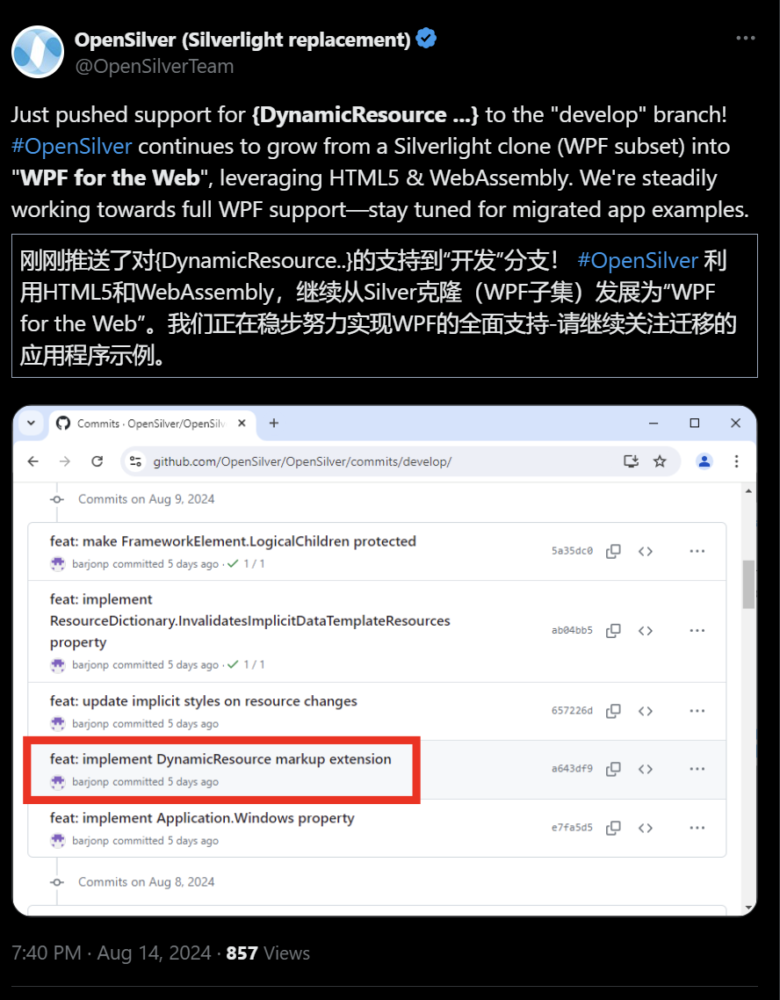
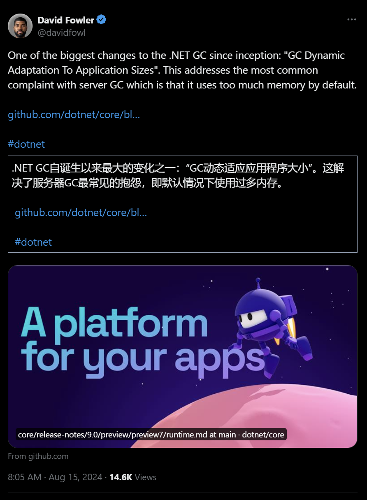
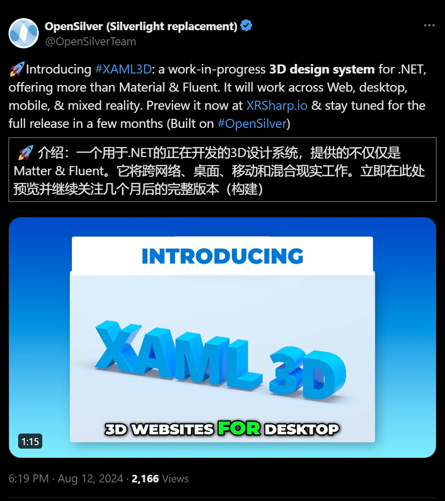

.NET周刊【8月第3期 2024-08-18】dotnet_week_24_8_3
## 国内文章
### Roslyn 简单实现代码智能提示补全功能

https://www.cnblogs.com/lindexi/p/18365261

相信有很多伙伴热衷于编写 IDE 应用，在 dotnet 系下，通过 Roslyn 友好的 API 和强大的能力，实现一个代码智能提示是非常简单的事情。本文将和大家简单介绍一下如何使用 Roslyn 实现简单的代码智能提示补全功能

### 七天.NET 8操作SQLite入门到实战详细教程（选型、开发、发布、部署）

https://www.cnblogs.com/Can-daydayup/p/18354637

EasySQLite 是一个七天.NET 8操控SQLite从入门到实战的详细教程，强调选型、开发、发布和部署。SQLite是一种嵌入式、无服务器、零配置的轻量级关系型数据库，支持事务和ACID属性。教程包括配置SQLite环境，框架搭建，引入ORM，完善接口，Blazor组件库应用和发布部署。技术栈涵盖SQLite、Blazor、ASP.NET Core 8.0、AutoMapper和Swagger。教程还提供了项目源码和演示，推荐了Blazor UI组件库和.NET相关资源。

### 为了给Javaer落地DDD，我们不得不写开源组件

https://www.cnblogs.com/xiaoweiyu/p/18354728

文章探讨了Java团队在引入dotnet技术栈并结合DDD建模中的经验，重点讲述了在csharp中的实践，如使用CAP组件实现事件的一致性。作者对比了aspnetcore与springboot及其他技术在两种生态系统中的实现，并指出Java生态缺乏类似CAP的组件，因此作者创建并开源了cap4j项目。最后，作者呼吁各技术生态的从业者应更友好地交流，专注于满足业务需求和实现商业价值。

### .NET中各种线程同步锁

https://www.cnblogs.com/newton/p/18365359

本文介绍了多线程编程中的线程同步机制，特别是 .NET 中的各种锁对象。文章详细分析了 volatile 关键字在多线程中的作用，缓存一致性问题以及 Interlocked 类的原子操作。还讨论了内核模式锁和用户模式锁的区别及适用场景，介绍了 lock 关键字、Monitor、ReaderWriterLock、MethodImpl 和 SynchronizationAttribute 等同步方法的用法及特点。

### .NET 8 中利用 MediatR 实现高效消息传递

https://www.cnblogs.com/1312mn/p/18357288

本文详细介绍了如何在 .NET 8 项目中使用 MediatR 库处理命令。首先，创建一个新的 .NET 8 WebAPI 项目，然后添加 MediatR 包。接着，在 Program.cs 文件中注册 MediatR 服务。定义了一个名为 InfoDemo 的通知类，并创建 InfoDemoHandler 处理器类来处理通知。最后，定义了 MediatorDemoController 控制器，使用 MediatR 发布通知。

### .NET 8 跨平台高性能边缘采集网关

https://www.cnblogs.com/1312mn/p/18354468

本文介绍基于.NET 8的跨平台高性能边缘采集网关项目，名为ThingsGateway。该网关由C#编写，支持可视化操作、脚本和插件自定义，性能强，可处理百万数据点并具备断线缓存功能。项目支持多种协议和插件，适用于工业自动化和物联网领域。

### .NET 高效Nuget管理工具（开源）

https://www.cnblogs.com/kybs0/p/18363275

文章讨论了.NET开发中如何高效管理Nuget包，包括多个项目和解决方案。作者介绍了一种基于Packages.props文件的中央包管理方法，并强调其限制。推荐使用工具NugetEfficientTool来简化多个项目的Nuget版本管理和冲突解决。文章还描述了如何利用Jenkins自动构建和升级多个组件的Nuget版本，解决版本依赖问题。

### .NET 9发布的最后一个预览版Preview 7， 下个月发布RC

https://www.cnblogs.com/shanyou/p/18365522

微软在2024年发布了.NET 9 Preview 7，提供重要更新，包括.NET Runtime、SDK、库、C#、ASP.NET Core、Blazor和.NET MAUI。改进涵盖二进制格式移除、加密算法支持、ARM64 SVE支持、GC动态适应等。C# 新增重载优先选择，SDK改进容器发布一致性，ASP.NET Core 支持 SignalR 修剪和 Native AOT。MAUI 改善了混合 Webview 和新控件。该预览版展示了性能、安全性和开发效率的进步。

### 一种很变态但有效的DDD建模沟通方式

https://www.cnblogs.com/xiaoweiyu/p/18361891

本文通过类比公司组织结构，提出了“拟人化模型沟通法”以解决需求分析和建模过程中与业务人员沟通不畅的问题，强调模型与人的共性，基于职责和事件协作构建一致的形象，从而实现“需求-模型-代码”一致性中的“需求-模型”一致性。

### .NET 轻量化定时任务调度 FreeScheduler

https://www.cnblogs.com/1312mn/p/18356212

FreeScheduler 是一个轻量级定时任务调度库，支持 .NET Core 2.1+ 和 .NET Framework 4.0+。它支持集群部署、持久化任务、临时任务和循环任务，按秒、每天/每周/每月或自定义间隔执行。安装简单，通过示例代码演示了任务的添加和调度过程。项目特点包括多进程支持和进程互通等。使用 FreeScheduler 可以轻松管理和调度定时任务，适用于个人与企业级应用。

### .NET 7 + Vue 权限管理系统 小白快速上手

https://www.cnblogs.com/1312mn/p/18358437

本文介绍了DncZeus，一个基于.NET 7和Vue.js的前后端分离的后台管理系统，适用于技术初学者和大佬。项目采用.NET 7、EF Core和JWT认证，前端用iView UI框架和Vue.js。文章详细说明了项目特点、技术栈和适合人群，并提供了安装、配置和启动指导。

### 如何让您的 .NET应用程序更智能-- 请参加 8.20 的 .NET Conf--Focus on AI

https://www.cnblogs.com/shanyou/p/18356103

Microsoft 将于 2024 年 8 月 20 日举办免费的 .NET Conf： Focus on AI。活动包含专家和行业领导者的会议，探讨如何整合 .NET 和 AI，以提升应用程序开发并优化用户体验。Seth Juarez 和 Maria Naggaga Nakanwagi 将发表主题演讲，介绍 AI 基础知识、大型语言模型及 .NET 生态系统中的最新进展。活动还包括多个专题会议，涵盖从 AI 集成到数据处理等多领域内容。详细议程及PPT可在相关网站查阅。

### wpf 如何7步写一个badge控件

https://www.cnblogs.com/lvpp13/p/18354811

文章介绍了如何在WPF项目中创建一个带有红色背景和文字的控件。首先，创建一个名为Badge的类，继承自Adorner，并设置附加属性Content。实现Content的回调方法，根据控件加载状态添加或移除Badge。最后，重写OnRender方法以实现绘制效果。

### 基于MonoGame重制《俄罗斯方块》游戏

https://www.cnblogs.com/daxnet/p/18359876

本文介绍了作者使用C#和MonoGame开发的《俄罗斯方块》游戏的重制版，包括开发框架Mfx的重构及其功能优化。新版本通过改进框架设计、删除不必要功能、增加新功能，实现跨平台支持，优化界面和操控，使得新版本文件更小，内存占用更低。文章还详细说明了游戏的按键设置、自定义方块功能、源码调试和编译方法。

### C# 使用特性的方式封装报文

https://www.cnblogs.com/fengxinyuan/p/18363546

该文章探讨了在编写上位机软件时如何通过特性和反射实现命令拼包。每个命令对应一个类，类的属性对应命令段，通过特性设定其位置和数据转换，然后通过反射生成完整命令包。具体展示了创建特性CmdPropertyAttribute、参数基类ParamBase、轴枚举Axis、功能码枚举FunctionCode以及移动命令类MoveParam的过程，最后通过扩展方法解析参数对象生成数据命令集合。

### WPF 怎么把checkbox改成开关样式

https://www.cnblogs.com/lvpp13/p/18363225

文章介绍如何在WPF项目中创建一个自定义开关效果的CheckBox。通过添加CheckBox，并逐步修改默认样式，将其转换为开关样式，最后添加动画和触发器来实现切换效果。

### Blazor开发框架Known-V2.0.7

https://www.cnblogs.com/known/p/18354298

Known是基于Blazor的企业级开发框架，低代码，跨平台，开箱即用。它支持AntDesign UI组件，包含模块、字典、组织、角色等功能。该框架通过在线表单设计实现快速开发，并内置通用权限模块。最新更新优化了分页查询、数据库连接配置及支持Lambda表达式查询等功能。

### EF Core 索引器属性（Indexer property）场景及应用

https://www.cnblogs.com/goodluckily/p/18354495

EF Core 中的索引器属性允许通过动态属性名访问数据，适用于处理动态或未预定义属性的场景。索引器属性常用于JSON数据处理、字典数据结构、元数据管理和简化代码。使用索引器属性时，需要在EF Core的模型配置阶段进行配置。本文介绍了通过Dictionary类型存储和直接映射到表列两种索引器属性配置方法，并提供了相应的示例代码。

### .NET8 Blazor 从入门到精通：（二）组件

https://www.cnblogs.com/timefiles/p/18362903

文章介绍了Blazor组件的基础知识，包括组件创建、项目模板、组件类型及其选择原则。详细说明了客户端组件和服务器端组件的使用场景，并通过代码示例展示了组件的实现方法，如Demo组件的代码实现。文中还涉及了路由导航、组件参数、路由参数等高级用法，并给出了具体的代码示例，帮助读者更好地理解和应用Blazor组件。

### C#模拟键盘输入、键状态和监听键盘消息

https://www.cnblogs.com/yxllxy/p/18361608

本文讲解如何使用SendInput函数模拟键盘输入，以及相关的结构体定义。SendInput可以代替SendKeys在WinFrom项目中使用。文章提供了模拟A键和Ctrl+A键的具体代码示例，详细解释了INPUT结构的各个字段和参数。

### 推荐一个优秀的 .NET MAUI 组件库

https://www.cnblogs.com/1312mn/p/18352047

文章介绍了 .NET MAUI 的跨平台 UI 框架，并推荐了 MDC-MAUI 组件库。MDC-MAUI 提供丰富的 UI 组件，易于集成。文中详细展示了布局、按钮、复选框、进度条和导航栏的使用，提供了代码示例和属性说明，并附上了组件库的 GitHub 和文档链接。

### C#实现国产Linux视频录制生成mp4（附源码，银河麒麟、统信UOS）

https://www.cnblogs.com/shawshank/p/18365296

在国产操作系统银河麒麟或统信UOS上实现录制摄像头和麦克风，并生成mp4文件。方案包括麦克风和摄像头数据采集、音视频编码和同步。使用C# .NET Core和Avalonia框架，借助Oraycn.LinuxCapture和Oraycn.MFile.NetCore组件。具体实现步骤包括创建采集器、开始采集、数据编码写入mp4文件及停止录制。部署要求安装.NET Core 3.1，提供了终端运行方法及源码下载链接。

### 首次在WebAPI中写单元测试

https://www.cnblogs.com/ggtc/p/18359336

本文介绍了使用xUnit测试框架进行单元测试的方便性和步骤。xUnit允许通过特性向测试方法传参，简化代码。此外，单元测试可以汇总所有接口的错误信息，不需要像使用swagger那样逐个手动输入请求。文章详细描述了如何在单元测试中设置依赖注入容器及注册不同服务，包括MemoryCache、IWebHostEnvironment和自定义的ICurentUser接口。通过这些方法，文章展示了如何简化单元测试的编写和调试过程。

### C#窗体自定义快捷操作键的实现 - 开源研究系列文章

https://www.cnblogs.com/lzhdim/p/18347887

本文探讨应用程序窗体的快捷键使用，区别于全局热键。文中介绍快捷键对象的定义与实现，提供运行界面和使用指南，并附源码下载链接。文章强调快捷键操作只在特定窗体有效，避免全局热键冲突。

### AvaloniaChat—从源码构建指南

https://www.cnblogs.com/mingupupu/p/18365633

本文介绍了一个基于Avalonia和Semantic Kernel开发的翻译应用AvaloniaChat，用于对照英文文献翻译。软件开源在GitHub，提供从源码构建的指南。由于API Key的敏感信息未上传，需要用户自行新建appsettings.json文件后设置启动项目才能成功运行。

### Elsa V3学习之脚本

https://www.cnblogs.com/fanshaoO/p/18366205

本文介绍了如何在Elsa工作流中使用JS和C#脚本。通过Jint包在Elsa中实现Javascript，通过Microsoft.CodeAnalysis.CSharp.Scripting动态编译和执行C#脚本。文中展示了如何自定义JS方法进行映射和通过内置的脚本节点测试脚本的运行，说明了脚本在工作流中的灵活应用。

### VS常用拓展以及快捷键

https://www.cnblogs.com/zhuiyine/p/18366213

VS常用拓展包括Select Next Occurrence、XAML Styler、Add New File、ILspy、CSharpier和CodeMaid。其功能涵盖了文本选择、格式化XAML、添加新文件、反编译和代码规范管理等。设定快捷键提高操作效率。

## 主题

### .NET 和 .NET Framework 2024 年 8 月更新 - .NET 博客
https://devblogs.microsoft.com/dotnet/dotnet-and-dotnet-framework-august-2024-updates/

.NET 6、8 和 .NET Framework 的 2024 年 8 月更新已发布。

除了错误修复之外，此版本还包括多项安全修复。

- [CVE-2024-38168](https://github.com/dotnet/announcements/issues/320)：ASP.NET HTTP.sys 拒绝服务漏洞 (.NET 8)
- [CVE-2024-38167](https://github.com/dotnet/announcements/issues/319)：TlsStream 信息泄露漏洞 (.NET 8)

### Visual Studio 2022 v17.11 – 您的实际反馈 - Visual Studio 博客
https://devblogs.microsoft.com/visualstudio/visual-studio-2022-v17-11-your-feedback-in-action/

Visual Studio 2022 版本 17.11 已发布。

此版本中的许多新功能、增强功能和改进都是基于您的反馈，本文将对其进行介绍。

- 提高生产力
    - 代码搜索
    - 代码审查
    - 更新创建拉取请求
    - 熟悉的键盘快捷键
- GitHub 副驾驶
    - AI生成断点表达式
    - 理解符号
    - 更新提案
    - 更安全的 GitHub Copilot
- 调试和诊断
    - 更容易修复异步异常
    - 轻松分析外部代码
    - 改进了 Arm64 上的调试
    - 调试 Blazor WebAssembly
    - 富有表现力的 IEnumerable 可视化工具
- IDE 和工作流程增强
    - 防止忘记安装组件
    - 始终保持最新且安全
    - 新的团队工具包模板
    - 改进了用户身份验证
- 网页和游戏开发
    - 解决方案资源管理器中的 npm 包
    - 动态Web API路由发现
    - 添加了虚幻引擎类模板
- .NET 和 C++ 开发
    - 改进的资源浏览器
    - 在 Linux 上调试 CMake 项目
    - Build Insights 的 QoL 更新

### .NET 9 预览版 7 现已推出 - .NET 博客
https://devblogs.microsoft.com/dotnet/dotnet-9-preview-7/

.NET 9 Preview 7 已发布。

- BCL
    - BinaryFormatter 删除完成
    - 使用“ReadOnlySpan<Char>.Split()”枚举段
    - Debug.Assert 中断言条件的默认报告
    - 将 zlib-ng 与压缩 API 结合使用
    - 使用 Guid.CreateVersion7 支持自然排序顺序的 GUID 生成
    - Interlocked.CompareExchange 支持更多类型
    - 在 iOS/tvOS/Mac Catalyst 上启用 AES-GCM 和 ChaChaPoly1305 算法
    - X.509 证书加载的变化
    - 支持来自 XPS 虚拟打印机的 XPS 文档
    - 将“Tensor<T>”标记为实验性的
- 运行时
    - ARM64 SVE 支持
    - ARM64 上的后缀索引寻址
    - 环强度降低
    - Box对象堆栈分配
    -GC 动态适应应用程序大小
- C#
    - 使用“OverloadResolutionPriority”属性确定重载优先级
- SDK
    - 改进了针对不安全注册表的发行容器
    - 提高了容器发布的环境变量的一致性
    - 引入工作负载集以更精细地控制工作负载
    - 缓解称为“torn SDK”的分析器不匹配问题
- ASP.NET核心
    - 支持 SignalR 中的修剪和本机 AOT
    - 支持 Microsoft.AspNetCore.OpenApi 中的修剪和本机 AOT
    - Microsoft.AspNetCore.OpenApi 中转换器注册 API 的增强
    - 在根组中生成 ProducesProblem 和 ProducesValidationProblem
    - 从“IEnumerable<KeyValuePair<string, object?>>”生成 Problem 和 ValidationProblem 结果类型
    - OpenIdConnectHandler 中的推送授权请求 (PAR) 支持- 支持数据保护中的密钥删除
    - 自定义 Kestrel 命名管道端点
    - 选择退出特定端点和请求的 HTTP 指标
    - 通过ExceptionHandlerMiddleware异常选择状态码
- .NET MAUI
    - HybridWebView介绍
    - 适用于 Windows 的新 TitleBar 控件和 Window.TitleBar
    - 适用于 iOS 和 Mac Catalyst 的新选择处理程序，并对 CollectionView 和 CarouselView 进行了改进
    - 使用ActivateWindow将Windows带到前台
    - BackButtonBehavior.OneWay 绑定模式
    - BlazorWebView主机地址向后兼容性
    - 原生嵌入改进
    - 弃用主页
    - 新的处理程序断开连接策略
    - WebView控件的ProcessTermminate事件
    - iOS 和 Mac Catalyst 上远程通知的生命周期方法
    - CLI 和 Visual Studio Code 的 Xcode 同步

- [.NET 9 Preview 6 和 .NET 9 Preview 7 之间的 API 差异，作者：carlossanlop · Pull Request #9450 · dotnet/core](https://github.com/dotnet/core/pull/9450)
- [.NET 9 预览版 7 · dotnet/core · 讨论 #9448](https://github.com/dotnet/core/discussions/9448)

### .NET Conf 2024 – 庆祝 .NET 9 的发布 – 节省时间 – .NET 博客
https://devblogs.microsoft.com/dotnet/dotnet-conf-2024-celebating-the-release-of-dotnet-9-save-the-date/

关于 .NET Conf 2024 的公告。

会议将于 11 月 12 日至 14 日虚拟举行，为期三天，活动期间将发布 .NET 9。
他们目前正在为该活动招募内容。

### Rider 2024.2：全行代码完成、阅读器模式、调试的主要增强等等。
https://blog.jetbrains.com/dotnet/2024/08/15/rider-2024-2/

Rider 2024.2 已发布。

此版本包括全行代码完成、阅读器模式、任务和任务依赖关系图、增强的类成员导航、.NET Aspire 插件捆绑、对 .NET 9 Preview SDK 的支持、新的 UI 默认值和改进的文档。功能和改进，包括内联渲染以及对 C# 12 和 13 的支持。

### ReSharper 2024.2：深化 C#12 和初始 C#13 支持、新的 AI 功能、本地化等 | .NET 工具博客
https://blog.jetbrains.com/dotnet/2024/08/15/resharper-2024-2/

ReSharper 2024.2 已发布。

此版本包括对 .NET 9 Preview SDK 的支持、对 C# 12 和 13 的初步支持、改进的对 C++ 的支持、日语、韩语和中文的本地化、通过异步键入改进的响应能力、改进的 AI 助手以及反向功能。以及编译器增强等改进。

### dotCover、dotMemory、dotPeek 和 dotTrace 2024.2 已发布！
https://blog.jetbrains.com/dotnet/2024/08/15/dotnet-tools-242-release/

dotCover、dotMemory、dotPeek、dotTrace 2024.2 已发布。

### 发布 Windows App SDK 1.4.7、1.5.6、1.6.0-preview1
https://github.com/microsoft/WindowsAppSDK/releases/

Windows App SDK 1.4.7、1.5.6、1.6.0-preview1 已发布。

此版本包括 1.4.7 和 1.5.6 中的稳定性修复，以及 1.6.0-preview1 中的新功能，例如本机 AOT 支持、WebView2 SDK 集成、新的包部署 API 和改进的 TabView 选项卡撕裂。

- [发布 Windows App SDK 1.4.7 (1.4.240802001) · microsoft/WindowsAppSDK](https://github.com/microsoft/WindowsAppSDK/releases/tag/v1.4.7)
- [发布 Windows App SDK 1.5.6 (1.5.240802000) · microsoft/WindowsAppSDK](https://github.com/microsoft/WindowsAppSDK/releases/tag/v1.5.6)
- [发布 v1.6.0-preview1·microsoft/WindowsAppSDK](https://github.com/microsoft/WindowsAppSDK/releases/tag/v1.6.0-preview1)

### 宣布推出适用于 JetBrains Rider 的 Uno 平台解决方案模板向导
https://platform.uno/blog/announcing-uno-platform-solution-template-wizard-for-jetbrains-rider/适用于 JetBrains Rider 的 Uno 平台解决方案模板向导已发布。

该插件可以让您轻松开始使用 Rider 中的 Uno 平台开发解决方案。

### Azure AI 推理 SDK 简介：使用 Azure AI 模型目录访问更多 AI 模型 - .NET 博客
https://devblogs.microsoft.com/dotnet/azure-ai-model-catalog-dotnet-inference-sdk/

适用于 .NET 的 Azure AI 推理 SDK 现已推出。

适用于 .NET 的 Azure AI 推理 SDK 是一个客户端 SDK，可以轻松使用部署到 Azure AI 模型目录的模型。文章还介绍了如何轻松使用它。

### 使用 .NET 9 的 Visual Studio 2022 v17.12 首次预览 - Visual Studio 博客
https://devblogs.microsoft.com/visualstudio/first-preview-of-visual-studio-2022-v17-12-with-net-9/

Visual Studio 2022 版本 17.12 的预览版已发布。

本次更新将重点关注 .NET 9 项目的开发体验和 AI 生产力功能。

### 宣布 OData .NET 8 正式版本 - OData
https://devblogs.microsoft.com/odata/announcing-odata-net-8-official-release/

OData .NET 8 已发布。

此版本包含许多改进，包括重大更改，包括删除对 .NET Framework 的支持。

## 文章、幻灯片等

### Copilot 内容排除现已在 Visual Studio 2022 17.11 中提供 - Visual Studio 博客
https://devblogs.microsoft.com/visualstudio/copilot-content-exclusion-in-visual-studio/

引入 Visual Studio 2022 v17.11 中引入的功能，用于限制传递到 GitHub Copilot 的内容。

您可以通过从传递到 GitHub Copilot 的内容中排除特定存储库和文件来保护敏感信息。

### AWS Lambda 冷启动时间从无穷大到零
https://medium.com/@feiflow/aws-lambda-cold-start-time-from-infinity-to-zero-d011635608ac

对 .NET 应用程序实施 SnapStart 的类似 PoC 尝试，可以使用 AWS Lambda 加速 Java 应用程序的冷启动。

### .NET 世界之旅：新旧名称背后
https://dev.to/dogaaydinn/journey-through-the-net-world-behind-old-and-new-names-393h

解释 .NET 的历史以及其中出现的各种单词。

### ASP.NET Core中如何实现自定义角色权限
https://blog.elmah.io/how-to-implement-customized-role-permissions-in-asp-net-core/

如何在 ASP.NET Core 和 Entity Framework Core 中实现角色权限。

### 在 .NET 中使用 ActivatorUtilities 时如何选择正确的构造函数
https://khalidabuhakmeh.com/how-to-pick-the-right-constructor-when-using-activatorutilities-in-dotnet

当存在不明确的构造函数重载时，如何在使用 ActivatorUtilities.CreateInstance 创建实例时指定使用特定的构造函数。

### 将属性添加到顶级语句程序类
https://khalidabuhakmeh.com/add-a-property-to-the-top-level-statements-program-class

如何向顶级语句中的隐藏 Program 类添加属性。

### 在 .NET CLR 中验证拉取请求的提示和技巧
https://chnasarre.medium.com/tips-and-tricks-from-validating-a-pull-request-in-net-clr-0a2c8ed3e5b9

它介绍了提交在 .NET 运行时中实现随机分配采样的拉取请求时创建的测试，以及如何运行它们。

### 使用 .NET 9 Json OpenAPI 文件添加 Swagger UI
https://damienbod.com/2024/08/12/add-a-swagger-ui-using-a-net-9-json-openapi-file/

了解如何使用 OpenAPI 在 .NET 9 中生成的 JSON 文件来实现 Swagger UI。

## 库、存储库、工具等。
### Sql 格式化程序 - Visual Studio Marketplace
https://marketplace.visualstudio.com/items?itemName=MadsKristensen.SqlFormatter用于格式化 T-SQL 的 Visual Studio 扩展。

- [VSLive! 开发会议提示带来了新的 IDE 扩展：Sql Formatter -- Visual Studio 杂志](https://visualstudiomagazine.com/Articles/2024/08/13/VSLive-Dev-Conference-Tip-Leads-to-新-IDE-扩展-Sql-Formatter.aspx)

## 网站、文档等
### 推文
https://x.com/opensilverteam/status/1823686157927870686?s=12

---

https://x.com/davidfowl/status/1823873547061879199?s=12

---

https://x.com/opensilverteam/status/1822940904140788161?s=12

## 深入探讨
### 统一抛出异常，无论助手是否为 [StackTraceHidden] · 问题 #90539 · dotnet/runtime
https://github.com/dotnet/runtime/issues/90539

问题是是否应该从堆栈跟踪中统一隐藏像 ArgumentException.ThrowIfNullOrEmpty 这样的异常帮助程序。

## 版权声明

* 国内板块由 InCerry 进行整理 : https://github.com/InCerryGit/.NET-Weekly
* 其余内容来自 Myuki WeekRef，由InCerry翻译（已获得授权） : https://github.com/mayuki/WeekRef.NET

**由于笔者没有那么多时间对国内的一些文章进行整理，欢迎大家为《.NET周刊-国内文章》板块进行贡献，需要推广自己的文章或者框架、开源项目可以下方的项目地址提交Issue或者在我的微信公众号私信。**

格式如下：

* 10~50字左右的标题
* 对应文章或项目网址访问链接
* 200字以内的简介，如果太长会影响阅读体验

https://github.com/InCerryGit/.NET-Weekly

## .NET性能优化交流群

相信大家在开发中经常会遇到一些性能问题，苦于没有有效的工具去发现性能瓶颈，或者是发现瓶颈以后不知道该如何优化。之前一直有读者朋友询问有没有技术交流群，但是由于各种原因一直都没创建，现在很高兴的在这里宣布，我创建了一个专门交流.NET性能优化经验的群组，主题包括但不限于：

* 如何找到.NET性能瓶颈，如使用APM、dotnet tools等工具
* .NET框架底层原理的实现，如垃圾回收器、JIT等等
* 如何编写高性能的.NET代码，哪些地方存在性能陷阱

希望能有更多志同道合朋友加入，分享一些工作中遇到的.NET性能问题和宝贵的性能分析优化经验。**目前一群已满，现在开放二群。**

如果提示已经达到200人，可以加我微信，我拉你进群: **ls1075**

另外也创建了**QQ群**，群号: 687779078，欢迎大家加入。 

