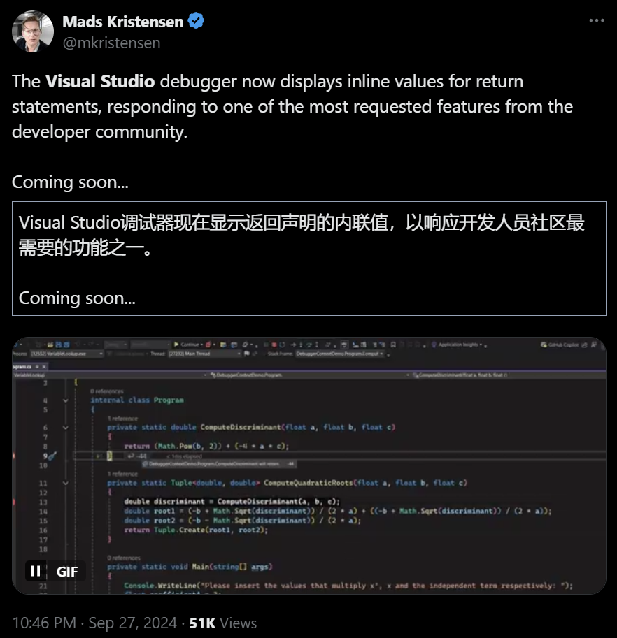
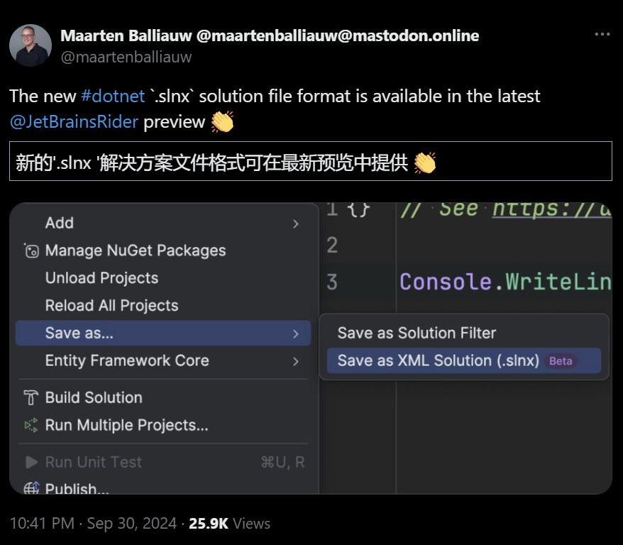
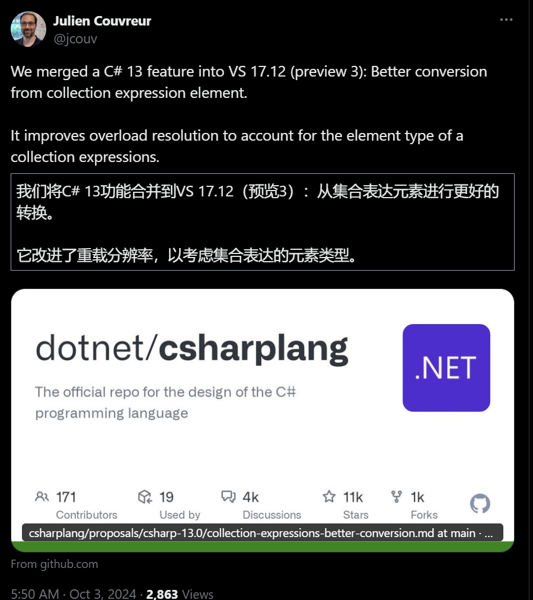

.NET周刊【10月第1期 2024-10-06】dotnet_week_24_10_1

## 国内文章
### 基于DPAPI+RDP技术实现本地打开远程程序，并映射到本地机器桌面上

https://www.cnblogs.com/weskynet/p/18445584

该教程讲述如何使用RemoteShadowApp进行远程设置和程序启动。使用工具需要VS2022、.NET 8和WPF，并通过DPAPI加密数据。教程展示了利用该程序自动更新远程服务器注册表的方法，也可手动设置。用户需提供IP、用户名、密码及程序路径以远程打开程序。若遇限制需查看详细信息及登录。支持同时打开多个远程程序，服务器资源被占用，本地不受影响。DPAPI用于加密关键数据，教程提供了加密和解密的代码示例。核心功能为简化数据保护，无需手动处理加密密钥存储。

### .NET 开源 EF Core 批处理扩展工具，真好用

https://www.cnblogs.com/1312mn/p/18431976

本文介绍了Entity Framework Core的开源批处理扩展工具EFCore.BulkExtensions，用于提升数据处理性能。该库支持SQL Server、PostgreSQL、MySQL和SQLite等数据库，适用于插入、更新、删除和读取等操作。文章详细解析了库的机制和使用方式，包括批量操作的示例代码、连接字符串配置和事务管理原则。通过使用该工具，可以高效地管理数据库操作，提高工作效率。

### C#/.NET/.NET Core技术前沿周刊 | 第 7 期（2024年9.23-9.30）

https://www.cnblogs.com/Can-daydayup/p/18441912

这篇文章介绍了一个涵盖C#、.NET、.NET Core技术的每周前沿周刊，包含技术文章、社区动态和学习资源。重点提到多个.NET相关主题，如Visual Studio插件CodeMaid的使用、EF Core性能优化、使用C#进行PDF合并和Excel操作、快速开发框架WaterCloud及其开源优势。文章中还涉及.NET并行任务库和Azure AI SDK等技术。读者可以通过这些资源提高开发效率和项目质量。

### .Net 依赖注入深入探索，做一个DI拓展，实现一个简易灵活的 自动依赖注入框架

https://www.cnblogs.com/kong-ming/p/18441175

依赖注入（DI）通过DI容器管理服务生命周期，实现服务创建、销毁和获取的统一管理。DI解耦了服务之间的依赖关系，通过抽象接口而非具体实现进行依赖，使服务具有可替代性和易维护性。在.NET中，服务可以注册为Transient、Scoped或Singleton三种生命周期类型。DI通常使用构造函数注入，IServiceProvider用于获取服务。单例服务不应直接依赖作用域服务，可在合适时机创建服务作用域获取需要的服务。此技术在.NET领域中广泛应用，增强了系统的灵活性和可维护性。

### 记一次Razor Pages无法编译问题及解决

https://www.cnblogs.com/hxyes/p/18440717

作者在解决Razor页面部署问题时，发现页面在本地调试正常但在生产环境IIS上返回404。作者尝试多种方法，包括调整ASPNETCORE_ENVIRONMENT变量和检查项目配置。最终通过参考一篇相关文章，确认问题出在cshtml文件在编译时被编译到dll中。使用虚拟机测试发现，新项目在不特殊配置情况下，Razor文件确实需要编译到dll。警告提示与编译器版本不匹配可能引发问题，作者决定继续探索相关原因。

### 使用ValueConverters扩展实现枚举控制页面的显示

https://www.cnblogs.com/sesametech-dotnet/p/18447676

文章介绍了IValueConverter接口的常用实现，并重点说明了ValueConverterGroup的使用。通过EnumToBooleanConverter类实现了枚举值到Visibility的转换，以便在界面中利用RadioButton控制内容显示。项目采用Prism框架和CommunityToolkit，并实现了界面布局和功能逻辑。

### Blazor开发框架Known-V2.0.13

https://www.cnblogs.com/known/p/18445041

Known更新了微信模板消息发送机制，解决了页面模板和表单字段组件的自定义问题，并支持EFCore。修复多个BUG，包括iFrame嵌入、系统许可密钥验证、搜索字段显示等问题。增强微信令牌刷新、错误日志优化和表单行事件功能。数据库组件独立为新库，增加后台任务记录功能，并支持表单字段的自定义扩展以及Dependency Injection。

### PasteForm最佳CRUD实践，实际案例PasteTemplate详解之3000问(三)

https://www.cnblogs.com/pastespider/p/18441338

PasteTemplate项目是一个CRUD实践项目，通过PasteForm管理后台页面。该系统的特色在于前端页面的管理由后端Dto控制，前端代码极简，适用多种技术栈。利用反射和数据模型，该系统实现了高效、安全的管理端界面。针对大规模表单数据，该系统通过少量页面实现通用管理，降低了代码维护成本。用户可在多个技术栈下实现类似功能，体现了一种思想，不依赖特定语言。案例项目提供了具体实现，可以修改实现个性化需求。核心在于后端统筹所有显示逻辑，确保不同用户角色下的灵活性和一致性。

### （系列五）.net8 中使用Dapper搭建底层仓储连接数据库（附源码）

https://www.cnblogs.com/cyzf/p/18448855

这篇文章详细介绍了如何设置和使用OverallAuth2.0系统，包括安装Dapper和其他必要包，配置数据库连接，以及创建数据库连接类和仓储接口。作者提供了详细的代码实例，帮助读者理解和实现这些步骤。文章建议读者先阅读系列中的前几篇以便更好地理解项目结构。

### OpenAI 发布适用于 .NET  库的稳定版本

https://www.cnblogs.com/shanyou/p/18449443

OpenAI 推出官方 .NET 库的稳定版本，提供 GPT-4o 等最新模型和 OpenAI REST API 的完整支持。此库支持同步和异步 API、流式聊天完成，并在所有 .NET 平台上兼容 .NET Standard 2.0。Microsoft 强调该工具简化了 OpenAI 模型在 .NET 应用中的集成。开发者可在 GitHub 上参与改进，确保与最新功能保持一致。此版本增强了 API 的一致性和可用性，为 .NET 生态系统提供强大AI功能。

## 主题
### 宣布 .NET 官方 OpenAI 库的稳定版本 - .NET 博客
https://devblogs.microsoft.com/dotnet/announcing-the-stable-release-of-the-official-open-ai-library-for-dotnet/

.NET 的官方 OpenAI 库已发布。

该库是支持OpenAI和Azure OpenAI服务的客户端库。

- 完整的 OpenAI REST API 支持：实现灵活的交互，例如 v2 和聊天完成
- 支持最新型号：GPT-4o、GPT-4o mini、o1-preview、o1-mini 等。
- 可扩展性
- 同步和异步API
- 流式完成：使用 IAsyncEnumerable 进行流式完成
- 提高生活质量
- .NET 标准 2.0 兼容性

### 发布 Windows App SDK 1.6.1 (1.6.240923002) · microsoft/WindowsAppSDK
https://github.com/microsoft/WindowsAppSDK/releases/tag/v1.6.1

Windows App SDK 1.6.1 已发布。

此版本修复了一些崩溃和错误。

### Visual Studio 2022 - 最近的性能增强 - Visual Studio 博客
https://devblogs.microsoft.com/visualstudio/visual-studio-2022-recent-performance-enhancements/

有关 Visual Studio 2022 17.11 中性能改进的介绍性文章。

与 C# 相关领域的性能改进包括改进了代码索引行为、对源生成器 .NET 8 及更高版本的更改以及对执行计时和设置的更改。

其他改进包括 C++ 中条件断点的性能改进以及 C++ 符号搜索的优化。

## 文章、幻灯片等
### 如何使用 LibGit2Sharp 来处理 Git 存储库
https://zenn.dev/nuits_jp/articles/2024-10-04-use-libgit2sharp-git-operations

使用 LibGit2Sharp 处理 Git 存储库的快速指南。

### SIMD并行化库SmartVectorDotNet开发成果总结（一）IEEE754浮点类型的低级运算
https://zenn.dev/aka_nse/articles/34740bb2088576

使用 SIMD 通过并行化库实现各种操作时的发现摘要。

- [SIMD并行化库SmartVectorDotNet开发成果总结（2）SIMD运算基础知识](https://zenn.dev/aka_nse/articles/54ae08eb9a9fd6)
- [SIMD并行化库SmartVectorDotNet开发成果总结(3)初等函数的实现](https://zenn.dev/aka_nse/articles/f94b7a8dfc59a3)

### 通过 Profiler 的外部代码反编译发现隐藏的见解 - Visual Studio 博客
https://devblogs.microsoft.com/visualstudio/discover-hidden-insights-with-profilers-external-code-decompilation/

引入自动反编译功能，以分析使用 Visual Studio 进行分析时没有源代码的部分。

### [C#] 使用 ML.NET 分析评论中包含的情绪 - Qiita
https://qiita.com/KM_20005/items/2019cd99ba91cc8aeaeb

介绍使用 ML.NET 分析情绪的模型和实现步骤。

### NetEscapades.AspNetCore.SecurityHeaders 的主要更新
https://andrewlock.net/major-updates-to-netescapades-aspnetcore-security-headers/

关于更新输出安全相关标头的中间件 NetEscapades.AspNetCore.SecurityHeaders。

本文提供了更新期间删除或更改的标题和自定义项的详细说明。

### 使用 .NET Aspire、Elasticsearch 和 ASP.NET Core 实现地理距离搜索
https://damienbod.com/2024/09/23/implement-a-geo-distance-search-using-net-aspire-elasticsearch-and-asp-net-core/

了解如何在 ASP.NET Core 应用程序中调用 Elasticsearch 地理距离搜索。

### (C#) 通过 OnnxRuntime 尝试使用 ResNet 进行图像分类 - Qiita
https://qiita.com/Kujiro/items/7b2e75494e05a2c803dd

如何使用 OnnxRuntime 和 ResNet 实现图像分类。

本文涉及加载图像和推理以及使用 GPU 时的过程。

### 尝试使用 csbindgen - Qiita
https://qiita.com/aiueo-1234/items/df61c6a4ce2695904e5a

有关如何使用 csbindgen 生成 C 和 Rust 绑定的说明。

### Visual Studio 和 .NET - 我想通过在没有源代码的程序集中设置断点来进行调试

https://zenn.dev/j_sakamoto/articles/f333eecd0949dc

在 Visual Studio 中调试时如何反编译并单步执行外部程序集而无需源代码。

### ASP.NET Core 9 和 IAsyncEnumerable - 来自 Blazor WebAssembly 的异步流式处理 JSON 和 NDJSON
https://www.tpeczek.com/2024/09/aspnet-core-9-and-iasyncenumerable.html

了解如何使用 Blazor WebAssembly 在 .NET 9 中启用流式上传来实现流式 JSON 和 NDJSON 上传。

### 通过持久目标选择轻松进行仪器分析 - Visual Studio 博客
https://devblogs.microsoft.com/visualstudio/effortless-instrumentation-profiling-with-persistent-target-selection/

引入了在 Visual Studio 2022 中保留目标选择以进行分析的改进。

无需在每次运行重复分析会话时选择分析。

### 使用 .NET 9 与 AlternateLookup 和 IAlternateEqualityComparer 进行 IP 地址跟踪的高效字典 - Steve Gordon - 与 Steve 一起编码
https://www.stevejgordon.co.uk/efficient-dictionary-for-ipaddress-tracking-using-net-9-with-alternatelookup-and-ialternateequalitycomparer

如何在 .NET 9 中使用 Dictionary AlternateLookup 在使用 IP 地址作为键的字典中启用 ReadOnlySpan 搜索。

### 在 .NET OpenTelemetry Instrumentation 中禁用活动记录（跨度）- 与 Steve 一起编写代码
https://www.stevejgordon.co.uk/disabling-recording-of-an-activity-span-in-dotnet-opentelemetry-instrumentation

使用 OpenTelemetry 进行测量时如何禁用活动（跨度）记录。

如何处理您不想在跟踪中包含某些无效请求的情况。

### Unity 工具案例研究 Qdana 博客
https://blog.jetbrains.com/ja/qodana/2024/08/unity-tools-qodana/

了解如何使用 JetBrains Qdana 通过 CI/CD 检查 Unity 应用程序的代码质量。

### Spectre.Console 助手
https://dev.to/karenpayneoregon/spectreconsole-helpers-3ml3

帮助程序代码的实现和介绍也可作为如何使用 Spectre.Console 的演示。

### [WPF] 在下一个屏幕重绘时执行处理 - Qiita
https://qiita.com/habakino094/items/285ed1f899a6e3dd6ddc

关于 CompositionTarget.Rendering 在 WPF 中调用重绘。

### 在 Android MAUI 中接收来自 Firebase 的推送通知
https://dev.to/laura_puckoriute/receiving-push-notifications-from-firebase-in-android-maui-1ho

如何在 Android 的 .NET MAUI 应用程序实现中使用 Firebase 处理通知。

### 我尝试使用 .NET 中的 OSS 身份验证服务 Keycloak - Easy IDaaS，可与 Aspire 和容器一起使用
https://speakerdeck.com/tomohisa/ossnoren-zheng-sabisu-keycloak-wo-dot-netkarashi-tutemita-aspiretokontenadeshi-erujian-dan-idaas

- [我做了一个关于“我尝试使用 .NET 中的 OSS 身份验证服务 Keycloak”的演示](https://zenn.dev/jtechjapan_pub/articles/26611f2f18990d)

## 库、存储库、工具等。
## 网站、文档等
### 推文

故事是，您将能够在 Visual Studio 中显示/检查内联 return 语句返回的值。

https://x.com/mkristensen/status/1839677882807017975?s=12

---

最新的 Rider 预览版还添加了对 .slnx 格式的支持。

https://x.com/maartenballiauw/status/1840763793963471301?s=12

---

更好地转换 C# 13 集合表达式中的元素并合并到 17.13（预览版 3）中。

https://x.com/jcouv/status/1841596573807214724?s=12

## 深入探讨

### 添加由 terrajobst 解析 `net10` 的初始设计文档 · Pull Request #322 · dotnet/designs
https://github.com/dotnet/designs/pull/322

如何使用“net10”处理 .NET 10 的 TargetFramework`net10` 存在无法与 .NET Framework 1.0 直接区分的问题。

## 版权声明

* 国内板块由 InCerry 进行整理 : https://github.com/InCerryGit/.NET-Weekly
* 其余内容来自 Myuki WeekRef，由InCerry翻译（已获得授权） : https://github.com/mayuki/WeekRef.NET

**由于笔者没有那么多时间对国内的一些文章进行整理，欢迎大家为《.NET周刊-国内文章》板块进行贡献，需要推广自己的文章或者框架、开源项目可以下方的项目地址提交Issue或者在我的微信公众号私信。**

格式如下：

* 10~50字左右的标题
* 对应文章或项目网址访问链接
* 200字以内的简介，如果太长会影响阅读体验

https://github.com/InCerryGit/.NET-Weekly

## .NET性能优化交流群

相信大家在开发中经常会遇到一些性能问题，苦于没有有效的工具去发现性能瓶颈，或者是发现瓶颈以后不知道该如何优化。之前一直有读者朋友询问有没有技术交流群，但是由于各种原因一直都没创建，现在很高兴的在这里宣布，我创建了一个专门交流.NET性能优化经验的群组，主题包括但不限于：

* 如何找到.NET性能瓶颈，如使用APM、dotnet tools等工具
* .NET框架底层原理的实现，如垃圾回收器、JIT等等
* 如何编写高性能的.NET代码，哪些地方存在性能陷阱

希望能有更多志同道合朋友加入，分享一些工作中遇到的.NET性能问题和宝贵的性能分析优化经验。**目前一群已满，现在开放二群。**

如果提示已经达到200人，可以加我微信，我拉你进群: **ls1075**

另外也创建了**QQ群**，群号: 687779078，欢迎大家加入。 

