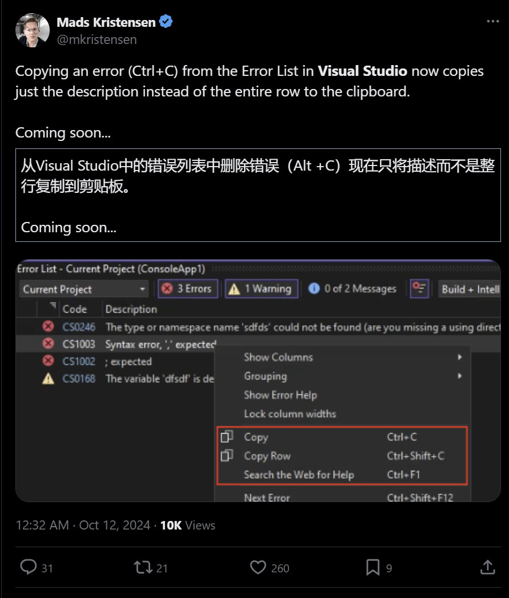

## 国内文章
### 我被 .NET8 JIT 的一个BUG反复折磨了半年之久(JIT tier1 finally optimizations)

https://www.cnblogs.com/calvinK/p/18469889

作者分享了一次在公司中API服务器从.NET 6升级到.NET 8后遇到的JIT BUG经历。升级后一个实例在某些部署中出现AES解密明文字符丢失的问题，而初步检查和单元测试未发现代码问题。在特定CPU环境中，此BUG多次出现，但调试代码上线后，BUG不再发生，无法复现。作者认为此BUG影响范围有限，决定暂停追查。2个月后，另一个项目也遇到了更为严重的解密问题，引起作者再次关注。这篇文章记录了发现BUG的具体过程与思考，但具体解决方案未提供。

### 盘点.NET支持的 处理器架构

https://www.cnblogs.com/shanyou/p/18471374

中国招投标协会的技术负责人错误地声称.NET不能在国产服务器上运行。事实上，.NET已经在各种国产处理器架构上广泛应用，包括x86、ARM、LoongArch、和RISC-V。自2014年.NET开源以来，社区积极扩展其在其他平台的兼容性。三星、龙芯中科等公司已成功将.NET移植到相关平台, .NET对国产架构的支持逐渐增强。国产服务器大多以ARM架构为主，能够运行.NET 6及以上版本。对LoongArch和RISC-V的支持也在不断优化中，确保更好的性能和兼容性。相关案例和文献支持.NET在这些架构上的应用。

### 2024年全面的多端统一开发解决方案推荐！

https://www.cnblogs.com/Can-daydayup/p/18472984

文章介绍了八个多端统一开发框架，包括uni-app、Taro、Flutter、React Native、Avalonia、.NET MAUI、Uno和Eto.Forms。这些框架使用多种语言，如C#、JavaScript、Vue等，使开发者能够编写一套代码运行在多个平台上，如iOS、Android和Web等。各框架具有不同的优势和特性，例如跨平台一致性、高性能和灵活扩展性。其中，.NET MAUI、Uno和Eto.Forms涉及C#和.NET技术，可以在不同设备上开发原生应用。这些工具减少了开发和维护的负担，提升开发效率和应用体验。

### C# 并发控制框架：单线程环境下实现每秒百万级调度

https://www.cnblogs.com/1312mn/p/18460025

文章介绍了一种专为工业自动化和机器视觉设计的C#并发流程控制框架。该框架采用Golang的并发模式，适应工业需求，支持单/多线程调度，简化了UI交互。其高效性体现在单线程环境下每秒可达百万次调度。框架具备高精度定时器、可配置优先级等功能，增强了任务管理灵活性和流程控制的可靠性。框架已在多项目中验证其稳定性。文中展示了多种任务执行模式，展示了调度策略对任务管理的重要性。

### ABP VNext 系列：框架启动流程以及依赖注入原理和源码分析

https://www.cnblogs.com/vic-tory/p/18467510

ABP VNext 框架是基于 ASP.NET Core 的现代 Web 应用程序和 API 的完整基础架构。它采用模块化设计，核心库精简，开发者可灵活集成所需组件。框架遵循领域驱动设计原则，提供事件总线、后台作业、审计日志等功能，通过示例代码展示如何使用 Autofac 进行依赖注入和配置服务。文档及源码详见官方网站。

### .NET使用Graphql的演示——新一代的API交互

https://www.cnblogs.com/weskynet/p/18471829

本文介绍了GraphQL，强调其高效、灵活的查询特性，并概述其发展背景和关键特性。文章详细展示了如何在.NET环境中创建和测试GraphQL服务，包括查询、多种操作如增删改、以及利用订阅实现数据推送。通过实战演示，文章展示了如何通过编程实现查询语句、修改操作和数据订阅，并指出了使用内存订阅的局限性，建议在生产环境中使用持久化方案，如Redis。整个过程包括服务端的设置和客户端的调用，提供了丰富的代码示例，为开发者熟悉GraphQL提供了实践指南。

### .NET无侵入式对象池解决方案

https://www.cnblogs.com/nigture/p/18468831

Pooling是一个编译时对象池组件，可以将new操作替换为对象池操作，简化编码并优化性能。开发者需要引用Pooling.Fody包，并在FodyWeavers.xml中配置Pooling。池化类型需实现IPoolItem接口，编译时会将其new操作替换为对象池获取和返还操作。PoolingExclusiveAttribute允许开发者指定在某些类型或方法中不进行池化操作，通过Types和Pattern属性进行配置。该组件适用于性能优化场景，提供无侵入式解决方案，可提高项目效率。

### C#使用 MailKit 收发邮件

https://www.cnblogs.com/timefiles/p/18466070

该文章详细介绍了使用MailKit库在.NET中处理邮件的过程。首先，通过获取QQ邮箱授权码和配置邮箱服务器信息，确保能够安全地发送和接收电子邮件。文章描述了如何安装MailKit及其用法，强调了SMTP和IMAP的设置。然后，提供了一个代码示例，展示了如何封装邮件数据类和实现邮件的收发功能，包括从IMAP服务器接收最新的十封邮件。此外，文章还包含错误处理，以确保邮件操作的可靠性。

### AOT漫谈专题(第四篇): C#程序如何编译成Native代码

https://www.cnblogs.com/huangxincheng/p/18467144

本文介绍了.NET Native AOT编译过程，使用ilc.exe工具，将MSIL代码转为机器码。AOT编译包含依赖图构建和优化阶段，涉及Pinvoke、COM、反射支持等。接下来是代码生成，使用RyuJIT和LLVM用于不同平台。AOT相对于C/C++编译方式有相似之处，核心在于静态编译和优化处理。

### 基于.NET8 + Vue/UniApp前后端分离的快速开发框架，开箱即用！

https://www.cnblogs.com/Can-daydayup/p/18470621

文章介绍了ZR.Admin.NET，一个基于.NET8和Vue/UniApp的快速开发框架。该框架开源免费，功能强大且易于扩展，适用于通用权限管理后台。它采用前后端分离的设计，后端基于.NET Core技术栈，前端支持Vue.js和uniapp，使用Element Plus和AntDesign等UI框架。该系统提供自动代码生成器和在线构建器以提高开发效率。它支持多种管理功能如用户、部门、岗位等，且不需二次开发即可使用。项目被收录为C#/ .NET优秀项目之一。

### AOT漫谈专题(第三篇): 如何获取C#程序的CPU利用率

https://www.cnblogs.com/huangxincheng/p/18463560

文章介绍了获取AOT程序CPU利用率的方法。作者首先讨论了.NET线程池中cpuUtilization字段的获取过程，并详细阐述了.NET6以前和以后的线程池实现，包括win32threadpool.cpp和PortableThreadPool.cs。对于Windows默认的AOT实现，由于源码不可用，通常需要通过代码直接获取CPU利用率或修改默认线程池。作者引用了微软文档说明如何切换线程池配置，并展示了通过C#代码演示线程死循环的处理。文章还强调AOT程序依赖树的重要性，说明其以有向图形式存储在_dependencyGraph字段中。

### Blazor 调用 Clipboard API 读写剪贴板数据

https://www.cnblogs.com/timefiles/p/18464605

本文介绍如何在Blazor应用中使用Clipboard API，实现剪贴板数据的读写。通过JS互操作与ClipLazor库两种方式，实现了功能更简洁。其中，JS互操作直接在Razor页面中调用JavaScript，而ClipLazor库则对JS进行了封装。详细展示了设置项目、注入服务、以及简单的文本复制粘贴步骤。为确保功能正常，需检查浏览器对Clipboard API的支持，并在合适的生命周期执行操作。最终，本文提供的代码示例支持文本、图像或二进制文件的操作，具有较好的实用性和示范效果。

### WPF中为Popup和ToolTip使用WindowMaterial特效 win10/win11

https://www.cnblogs.com/TwilightLemon/p/18468252

文章通过反射获取WPF中Popup组件的原生窗口句柄，并利用自定义的WindowMaterial类为其应用特效。具体实现包括对ToolTip进行附加属性和全局样式的处理。利用反射获取PopupSecurityHelper的句柄后，可以调用封装类来设置窗口材质如亚克力或Mica，遵循微软设计规范。文章附有Demo和代码示例，类库持续更新。

### AvaloniaTCP-v1.0.0：学习使用Avalonia/C#进行TCP通讯的一个简单Demo

https://www.cnblogs.com/mingupupu/p/18463874

本文介绍了TCP协议的基础知识及其在网络通信中的应用。TCP通过三次握手建立连接，保证数据的有序和完整传输。该协议适用于高可靠性需求的应用，如网页浏览和电子邮件。文章展示了一个使用TCP进行客户端和服务端通信的Demo，包含如何启动服务端和客户端，以及互相发送接收消息的代码示例。完整代码已上传至GitHub。

### .NET 7+Vue 3 开源仓库管理系统 ModernWMS

https://www.cnblogs.com/1312mn/p/18468668

ModernWMS是一款开源的仓库管理系统，旨在帮助企业实现仓库自动化和数字化。项目采用Vue 3、TS和.NET 7开发，支持跨平台运行，降低维护成本。系统特性包括开源代码、开箱即用、流程简化和降本增效，并得到活跃社区支持。支持Linux和Windows部署，提供详细的安装指引，包括下载源码、安装.NET SDK和Node.js、编译前后端，以及安装和启动Nginx等步骤。这些特点使其易于上手，可以有效提升企业的仓库管理效率。

### 使用Spectre.Console定制.NET控制台输出样式演示

https://www.cnblogs.com/weskynet/p/18467930

这篇文章介绍如何使用Spectre.Console库在控制台项目中实现不同的输出格式和样式。内容涵盖基本输出技巧，包括下划线、背景色和加粗文本。文章详细示范了如何创建和设计表格，设定表格标题、列对齐及边框样式。还演示了使用该库实现动态进度条及类似pip下载的动态效果。此外，鼓励读者分享、点赞并关注个人公众号Dotnet Dancer。文章提供了Spectre.Console的官方项目地址和文档作为参考。

### AOT漫谈专题(第五篇): 如何劫持.NET AOT编译器 进行源码级调试

https://www.cnblogs.com/huangxincheng/p/18470275

文章讨论了如何在dotnet发布过程中调试AOT编译器。介绍了托管和非托管调试器，分别是Visual Studio和WinDbg。测试代码演示了如何通过这两种调试器进行拦截。文章详细解释了使用WinDbg拦截ilc.exe的步骤，包括在注册表中配置关键值以及使用dotnet发布命令。随后介绍了通过修改ilc.sln项目并使用Visual Studio进行调试的方法，包括设置--waitfordebugger参数以便附加调试器。整个过程展示了两种调试器各自的优缺点和具体操作细节。

### （系列七）.net8 Aop切面编程

https://www.cnblogs.com/cyzf/p/18467560

文章详细介绍OverallAuth2.0系统，强调易于理解和强大功能。解释AOP切面编程的重要性及其在.NET8中的运用，使用Autofac和Castle.DynamicProxy实现接口拦截，降低耦合性并提高代码灵活性。示例代码展示如何编写AOP插件，通过Intercept方法获取接口信息并执行逻辑。最后讲解如何在Autofac中集成AOP插件以完成接口拦截。

### C#/.NET/.NET Core技术前沿周刊 | 第 9 期（2024年10.07-10.13）

https://www.cnblogs.com/Can-daydayup/p/18462600

这是一份关于C#、.NET和ASP.NET相关技术的周刊，提供最新版本发布的信息和技术资源。文章介绍了.NET 9候选版本、Microsoft.Extensions.AI库的预览版、2024年.NET服务更新，以及C#语言的二分查找算法和代码格式化工具。还讨论了适用于ASP.NET Core的轻量级插件框架PluginCore，和用于实时物体检测的YoloDotNet v2.1框架。此外，还分享了多款支持C#的AI辅助编程工具，这些工具旨在提高开发效率和代码质量。

### .NET 内存管理两种有效的资源释放方式

https://www.cnblogs.com/1312mn/p/18340767

.NET 内存管理主要依赖垃圾回收机制处理托管内存，但需手动释放非托管资源。常用方法包括 using 语句和显式调用 Dispose 方法。这两种方法可有效控制资源生命周期，避免内存泄漏，确保程序运行稳健。垃圾回收虽简化内存管理，但无法处理文件句柄等非托管资源，并可能引发短暂暂停。IDisposable 接口提供确认性资源释放，using 语句可在异常时自动释放资源，而 Dispose 方法则需手动调用。此文阐明关键内存管理技巧，适合各技术水平读者参考。

### C#使用Kubernetes (k8s)

https://www.cnblogs.com/flamesky/p/18472463

C#中可通过Kubernetes .NET客户端与K8s API交互。首先安装客户端库，通过NuGet添加。在C#中，使用代码连接K8s集群，例如列出Pod。可使用API创建、更新或删除资源，监控集群变化，或进行部署扩展。认证可通过本地kubeconfig文件或集群内配置进行。此外，还有其他K8s C#客户端库可选。

### C#/.NET/.NET Core学习路线集合，学习不迷路！

https://www.cnblogs.com/Can-daydayup/p/18475813

文章提供了C#、.NET、WPF、WinForm、ASP.NET Core的学习路线和指南，推荐使用微软官方文档作为学习资料，覆盖了各技术的详细说明与示例代码。强调C#的跨平台性和应用广泛性，提供多个学习资源链接。

### 在C#中基于Semantic Kernel的检索增强生成（RAG）实践

https://www.cnblogs.com/daxnet/p/18475095

Semantic Kernel是一个基于大语言模型的应用开发框架，支持C#、Python和Java。它通过连接外部AI服务、插件功能、规划器和内存等核心概念，简化了AI模型的集成过程。通过Azure OpenAI Service，可以部署GPT-4o模型，实现问答系统。文章详细介绍了如何在Azure中部署模型，并在C#环境中使用Semantic Kernel构建问答应用。微软宣布将于2024年10月21日终止个人用户的Azure OpenAI服务。

### 适用于 .NET 稳定的官方OpenAI库

https://www.cnblogs.com/Can-daydayup/p/18487118

这篇文章介绍了一个由 OpenAI 官方提供的 .NET 库，用于轻松集成和使用 OpenAI 的 REST API。这个库通过 NuGet 包发布，支持文本生成、图像生成和音频转写等功能。库按功能区域组织命名空间，支持同步和异步方法，建议用环境变量管理 API 密钥以提高安全性。它支持流式传输和外部工具集成，允许结构化输出，全面支持最新的 OpenAI 模型。作者提供了安装和使用该库的基础步骤，并提供了源代码和社区支持链接。

### 让查询可以使用 json path

https://www.cnblogs.com/fs7744/p/18463884

该技术文章讨论sv.db的最近更新，包括支持JSON路径查询和字段验证白名单。支持多数据库的JSON操作，优化API查询。同时，实现Swagger自动生成API描述，方便开发者使用。主要功能已完成并发布在Nuget，提供了多种数据库的包以供安装和使用。

### Unity 华为快游戏JS桥接 实现写日志等功能

https://www.cnblogs.com/lunoctis/p/18474551

文章讨论了在开发微信、抖音和华为小游戏时遇到的API和桥接问题，尤其华为API文档欠缺，需通过具体实践调整js代码。通过Unity导出WebGL与rpk分开进行，利用QGSDK转换插件简化类库创建大量函数，经过测试发现ral和qg对象存在差异且能用。有为简化需求的C#和JS代码桥接示例，处理回调的机制包括添加、删除和清理回调等功能。

## 主题
### .NET 9 中 System.Text.Json 的新增功能 - .NET 博客
https://devblogs.microsoft.com/dotnet/system-text-json-in-dotnet-9/

解释 .NET 9 中 System.Text.Json 的新功能。

- JSON 模式导出器
- 流式传输多个 JSON 文档
- 可为空类型注释
- 自定义枚举成员的名称
- 乱序读取元数据
- 自定义缩进
- JsonObject属性排序操作
- JsonElement和JsonNode的DeepEquals方法
- JsonSerializerOptions.Web
- 性能改进

### 发布 v2.5.187 · MessagePack-CSharp/MessagePack-CSharp
https://github.com/MessagePack-CSharp/MessagePack-CSharp/releases/tag/v2.5.187

MessagePack v2.5.187 已发布。

此版本修复了一个安全问题，即不受信任的数据可能会导致哈希冲突和堆栈溢出，从而可能导致 DoS 攻击。

### 发布 v8.0.5 · npgsql/npgsql
https://github.com/npgsql/npgsql/releases/tag/v8.0.5

Npgsql v8.0.5 已发布。

此版本修复了多个问题，例如查询失败和引发异常。

## 文章、幻灯片等
### 我编写了一个使用 ONNX Runtime Generative AI for Microsoft.Extensions.AI 的类 
https://blog.shibayan.jp/entry/20241015/1728983114

我正在尝试准备使用 ONNX 运行时生成 AI 并调用 Phi-3.5 mini 的 Microsoft.Extensions.AI 实现。

### 使用可编辑表达式改进您的调试器游戏 - Visual Studio 博客
https://devblogs.microsoft.com/visualstudio/improve-your-debugger-game-with-editable-expressions/

介绍如何在 Visual Studio 的 IEnumerable 可视化工具中利用 LINQ 筛选表达式。

### Rider Reveal 直播：.NET 和游戏开发人员的重大新闻 | .NET 工具博客
https://blog.jetbrains.com/dotnet/2024/10/16/rider-reveal-livestream-big-news-for-dotnet-and-game-devs/

宣布 10 月 24 日 YouTube 流媒体播放有关 JetBrains Rider 的新闻。

### 使用.NET nanoFramework搭建ESP32开发环境（用C#控制嵌入式设备）
https://zenn.dev/zead/articles/nanoframework_kankyo

介绍构建针对 ESP32-WROOM-32 的 .NET nanoFramework 开发环境的步骤。

### 如何使用 SqlBulkCopy 和 CsvHelper 高效地将大型 CSV 导入到 SQL Server
https://zenn.dev/nuits_jp/articles/2024-10-15-csv-sqlbulkcopy-csvhelper

了解如何有效地将大型 CSV 数据导入 SQL Server。

### 了解 Azure 开发人员的亮点 - 2024 年 .NET Aspire Day - .NET 博客！
https://devblogs.microsoft.com/dotnet/azure-developers-dotnet-aspire-day-recap/

介绍在线活动 Azure 开发人员 – .NET Aspire Day 2024 中提供的会议和录音。

### 关于加速 .NET8 中数组元素的一些数学函数 - Qiita
https://qiita.com/tirol30/items/ff368b1d9b8ae77f411d

关于在使用Math类中的double类型数组元素的方法时，添加+0.0这样的代码时速度发生变化的现象。

### .NET 9.0 LINQ 性能改进 - NDepend 博客
https://blog.ndepend.com/net-9-0-linq-performance-improvements/

了解 .NET 9 中的 LINQ 性能改进。

这篇文章讨论了当您可以检索 Spans、特殊迭代器等时加快速度。

### 将 MAUI 与 Visual Studio 2022 17.11.5 和 Xcode 15.4 结合使用 - Qiita
https://qiita.com/wukann/items/4eed96ab63b5539b9ac3

组合安装 Visual Studio 2022 版本 17.11.5 和 Xcode 15.4 以及执行 MAUI 开发的说明。

### 《自学ASP.NET Core》回顾
https://zenn.dev/fujiwo/articles/149a720a2b49f9

《自学ASP.NET Core》这本书的回顾。

## 网站、文档等
### 推文

一个只能复制解释的故事。

https://x.com/mkristensen/status/1844778002951139764?s=12

