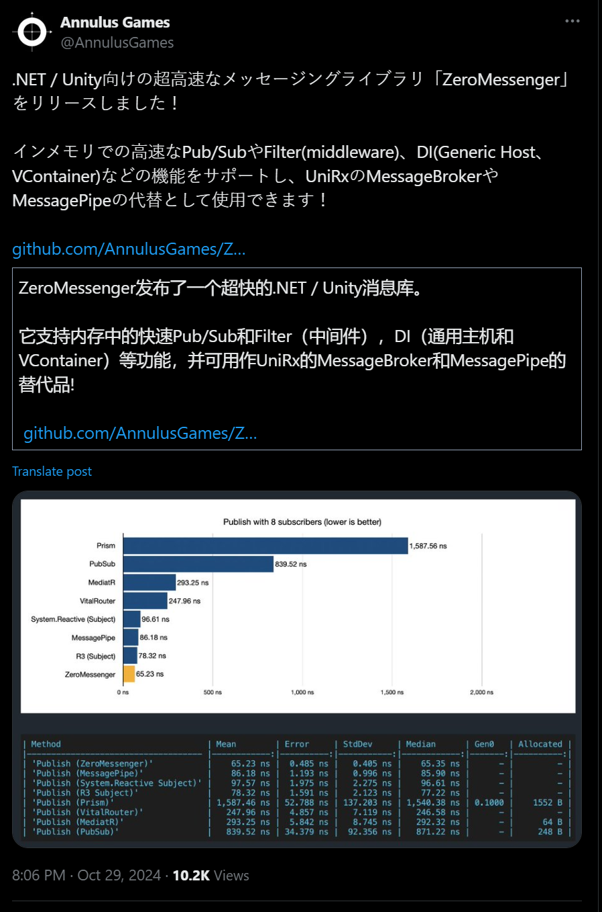

## 国内文章
### .NET 9 AOT的突破 - 支持老旧Win7与XP环境

https://www.cnblogs.com/lsq6/p/18519287

.NET 9 引入了 AOT 支持，使得应用程序能够在编译时优化，以在老旧 Windows 系统上运行。这项技术通过静态编译，消除运行时的 JIT 编译，加速程序执行。尽管 Windows 7 和 XP 已不再主流，它们在某些领域仍被广泛使用。.NET 9 的 AOT 旨在提升兼容性和性能。AOT 编译程序通常执行更快，部署简单，降低了维护成本。项目配置展示了如何实现 AOT 支持，以及相关依赖的管理。

### C# 13(.Net 9) 中的新特性 - 半自动属性

https://www.cnblogs.com/Rwing/p/18510363/Csharp_13_dot_net_9_preview_Semi-auto_properties

C# 13 和 .Net 9 预计在2024年11月发布，其中的半自动属性引入了新特性field关键字，优化了自定义逻辑的书写，无需手动声明字段，提升了代码可读性。需注意field关键字属于破坏性更新，可能影响旧代码。该特性目前在Visual Studio 2022 17.12 Preview 3.0中已经实装，但仍处于预览状态，需将C#语言版本设置为preview。

### .NET 8.0 开源在线考试系统（支持移动端）

https://www.cnblogs.com/1312mn/p/18510576

本文介绍了一款基于.NET 8.0的免费开源跨平台在线考试系统。系统支持桌面和移动端，适用于多种数据库，可在多种操作系统上运行。功能包括考试发布、试卷管理、阅卷和问卷调查等，支持国产化部署。文章详细描述了系统的技术架构、功能特色和部署方法。项目源码结构明确，提供跨平台部署步骤。作者还鼓励读者访问项目地址获取更多信息和参与交流。

### 管中窥豹 - .NET Core到.NET 8 托管堆的变迁

https://www.cnblogs.com/lmy5215006/p/18515971

.NET底层结构研究揭示托管堆从LOH到POH再到NonGC的演变。文章提到.NET Core 3静态数据放在LOH较好，而.NET 5引入POH解决LOH定义不符问题，.NET 8新增NonGC堆提高性能。强调研究要结合实际，避免依赖过时信息。

### .net 在线客服系统，到底能不能处理 50万 级消息量，系统架构实践

https://www.cnblogs.com/sheng_chao/p/18519883

.net core开发的在线客服系统因其免费共享吸引用户，已处理48万余条消息。系统架构使用.net core, SQL Server和MySQL，稳定实现消息处理中间件和TCP/IP长连接等功能。客服端程序用WPF框架，提供较高开发效率和稳定性。系统支持横向扩展和弹性配置，可根据需求调整服务器数量，提高或减少承载能力。消息传输基于TCP协议，通过ACK标志和字段确保消息送达。处理网络异常时，系统通过检测Socket对象属性和实施心跳机制来监测网络连接状态，如中断立即处理。整个系统的开发展示了.net技术体系的高效性和可扩展性。

### 从入门到放弃，我们为何从 Blazor 回到 Vue

https://www.cnblogs.com/txrock/p/18517222

我们的开发团队在使用 C# 和 .NET 框架的过程中经历了尝试和放弃 Blazor 的过程。尽管 Blazor 提供了统一开发体验和增强性能等优势，但其局限性显著。主要问题包括 UI 组件库有限、前端效果难以实现以及社区支持不足。加上缺乏实际应用案例和微软的关注转移，我们最终决定放弃 Blazor。我们将重构现有产品的前端部分，并使用 Vue 等更成熟的技术。Blazor 适用于小型团队和简单应用，但不适合复杂项目。选择开发框架需谨慎，虽然 Blazor 理念新颖，但尚未成熟。

### .NET 实现的零部件离散型 MES+WMS 系统

https://www.cnblogs.com/1312mn/p/18513497

EasyMES 是基于 .NET 6 开发的综合管理系统，适用于零部件离散型生产企业，集成了仓储和自动排程功能。它通过界面化的管理提升生产效率，支持多种数据库，并开源发布。文章详细描述了系统功能，如精细化生产管理、智能仓储管理、自动排程等，以及部署和操作指导。EasyMES 促进了制造业的信息化建设并提供了交流与改进的社区平台。

### C#/.NET/.NET Core优秀项目和框架2024年10月简报

https://www.cnblogs.com/Can-daydayup/p/18518919

本文介绍了多个基于.NET的优秀开源项目和框架，包括MethodTimer、MaterialSkin、Moq、TouchSocket等。这些项目涵盖了从UI设计、网络通信到权限管理系统的各个领域，旨在提高开发效率和代码质量。MethodTimer提供方便的计时代码注入，MaterialSkin提供Material Design风格的UI控件，Moq提供简单直观的.NET模拟库，TouchSocket整合多种通信模块。适合需要高效、模块化开发的场景。每个项目的详细介绍和源码链接在公众号文章中可以找到。

### C#使用Socket实现分布式事件总线，不依赖第三方MQ

https://www.cnblogs.com/lsq6/p/18512082

CodeWF.EventBus.Socket 是基于 Socket 的分布式事件总线，支持 CQRS，避免了对第三方 MQ 的依赖。它通过 TCP 协议实现高性能、低延迟的通信，灵活易用，适合分布式系统。使用时，服务端创建并启动 EventServer，客户端连接并订阅事件，发布和查询命令可以灵活处理事件。可以通过 NuGet 安装该包。在生产环境中，需要配置公网 IP 并考虑异常处理、重连逻辑以提高可靠性。

### .NET 4.0下实现.NET4.5的Task类相似功能组件

https://www.cnblogs.com/Bob-luo/p/18515670

.NET 4.5 引入的 Task 类简化了异步编程，但在旧版 .NET 4.0 系统中未直接支持完整功能。为解决此问题，开发了 TaskExCum 组件，为 .NET 4.0 提供类似 .NET 4.5 的 Task 功能，包括 Task.Run() 和 Task.WhenAll() 方法。TaskExCum 是一个静态类，Run 方法异步执行任务并获取结果，WhenAll 方法等待多任务完成。它使用条件编译兼容不同 .NET 版本，通过 Task.Factory.StartNew 启动任务，采用默认线程池调度器，提高性能。WhenAllCore 方法处理任务集合，等待完成并收集结果。

### 深入解析C#异步编程：await 关键字背后的实现原理

https://www.cnblogs.com/Bob-luo/p/18518463

本文详细探讨了C#异步编程中await的实现原理。使用async和await关键字可以提高程序的响应性，特别在I/O操作中。示例中，作者展示了一个简单的异步方法，强调编译器如何为每个异步方法生成状态机。状态机结构体包含异步方法的所有局部变量和状态信息，并通过几种关键步骤实现回调函数的注册和触发。整体内容提供了关于状态机类生成和执行步骤的细节，解释了await实现的核心机制。

### .NET + 微信小程序开源多功能电商系统

https://www.cnblogs.com/1312mn/p/18476131

该文章介绍了一款基于微信小程序、LayUI和.NET的多功能电商系统。系统使用C#编写后台，并集成多个技术组件以实现高效管理。系统功能包括交易模式、SKU管理、订单管理、客户管理等。此外，项目支持插件扩展，便于二次开发。文章还详细描述了开发环境、技术架构及项目配置步骤，适合.NET开发团队低成本快速搭建应用程序。

### 推荐一个 ASP.NET Core 的轻量级插件框架

https://www.cnblogs.com/1312mn/p/18509007

本文介绍了PluginCore，一个专为ASP.NET Core设计的插件框架，简化插件开发与集成，提高开发效率。框架特点包括动态WebAPI、插件隔离与共享、前后端分离、热插拔、依赖注入和模块化等，支持零数据库依赖和极少外部依赖。项目使用简单易用，仅需几行代码即可集成。通过NuGet包管理器或Docker运行，开发者可以快速开始项目。项目应用实例有KnifeHub和Dragonfly，代码托管在GitHub上，提供在线文档供参考。

### .NET 平台 WPF 通用权限开发框架 (ABP)

https://www.cnblogs.com/1312mn/p/18517621

本文介绍了一款基于ABP商业版开发的WPF框架，支持跨平台应用。框架不仅保留了ABP的核心功能如用户、角色管理和多租户支持，还嵌入Prism MVVM框架和多种UI控件如Syncfusion。该框架填补了ABP在WPF方面的空白，并包括Xamarin.Forms版本，适合有桌面和移动开发需求的开发者。项目地址提供在GitHub，相关效果图展示了框架在登录、组织管理等方面的应用。

### AvaloniaUI项目离线开发全攻略：IDE安装、模板应用与NuGet私有化部署一站式解决

https://www.cnblogs.com/Dotnet9-com/p/18511697

本文提供在离线或网络受限环境中开发.NET项目的解决方案，特别是Avalonia UI项目。内容包括离线安装Visual Studio 2022和JetBrains Rider，配置Avalonia UI模板，以及部署私有NuGet服务以便共享和管理NuGet包。另外，本文介绍如何制作NuGet包并提供相关项目示例。

### .NET使用Moq开源模拟库简化单元测试

https://www.cnblogs.com/Can-daydayup/p/18509437

Moq是一个.NET开源模拟库，利用Linq表达式树和lambda表达式，支持接口和类的模拟。其API简单直观，无需模拟经验，有助于简化单元测试中的依赖管理和验证，提高代码的测试性和维护性。文章介绍了如何创建.NET控制台应用并使用Moq库进行模拟对象的创建和调用参数的验证。此外，Moq可模拟方法抛出异常，利于单元测试。文末提供了开源地址，鼓励参与开源社区。

### 编写高性能爬虫抓取股票行情数据

https://www.cnblogs.com/sheng_chao/p/18517363

文章介绍了一个用于股票交易系统中行情数据抓取的小系统。系统支持自定义股票列表及实时行情抓取，使用 HttpClient 访问财经网站。详细讲解了如何创建和配置 HttpClient，例如使用共享实例及设置基础地址等。此外，文章描述了不同类型的 HTTP 内容和 GET 请求的实现。使用 .NET 技术处理 HTTP 请求，确保易于管理和高效抓取数据。

### Abp源码分析之Abp最小系统

https://www.cnblogs.com/shiningrise/p/18521678

该技术文章介绍了如何使用ABP框架创建和配置一个API项目。首先，通过修改Program.cs文件启动应用程序，完成依赖注入和模块的初始化。然后，创建BookAbpModule.cs模块，配置Swagger服务以支持API文档生成。在模块化编程部分，介绍了如何新建AbpModuleA类库并通过Console输出确认模块生命周期方法的执行。文章详细讲述了创建和配置过程，但缺乏实际应用场景和完整代码示例。

### 基于Material Design风格开源、免费的WinForms UI控件库

https://www.cnblogs.com/Can-daydayup/p/18514329

本文介绍了一个基于Google Material Design风格的开源.NET WinForms UI控件库MaterialSkin。WinForms是一个传统的桌面应用程序框架，MaterialSkin提供了一系列Material Design风格的UI控件，开发者可以轻松构建符合规范的应用程序。项目源码和示例可以在GitHub上获取。

### dotnet core微服务框架Jimu ~ 会员授权微服务

https://www.cnblogs.com/flamesky/p/18516573

该文章介绍了一个基于 .Net Core 6.0 的授权服务项目。用户通过用户名和密码获取 token，然后用该 token 访问受保护的 API。项目包括两个公开接口：获取 token 和获取会员信息。还有一个不公开的接口方法用于内部调用。文章详细描述了接口的声明和实现过程，使用 Jimu 和 Autofac 进行服务注册。通过依赖注入实现日志记录功能，并使用模拟数据进行会员管理。

### .NET 9 中没有 wasi 实验性支持

https://www.cnblogs.com/shanyou/p/18522918

文章介绍了为.NET/C#开发者简化组件开发的componentize-dotnet项目，这个由Bytecode Alliance发起的NuGet包工具，使得将代码编译为WebAssembly组件变得简单。文章详细说明了如何使用.NET 9 Preview 7进行开发，包括安装软件、配置NuGet、添加相关包，以及构建和运行WebAssembly组件的方法。此外，还讨论了组件间的互操作性和选择编译器的便利。文章鼓励开发者加入Bytecode Alliance社区参与该项目。

### .NET云原生应用实践（五）：使用Blazor WebAssembly实现前端页面

https://www.cnblogs.com/daxnet/p/18518807

本章介绍如何用Blazor WebAssembly实现“贴纸”页面的管理，集成认证与授权机制。Blazor WebAssembly是微软开发的Web框架，允许用C#和.NET构建客户端应用，不用JavaScript。代码编译为WebAssembly字节码，提高性能。本系列使用Blazor WebAssembly项目模板开发，选择它是因为熟悉C#技术栈，开发体验佳。在本案例中，使用Blazor友好的技术如Blazor Bootstrap组件库。讨论包括自定义组件和使用HttpClient访问后端服务。Blazor WebAssembly让开发者可用C#构建互动和动态的用户界面，避免学习JavaScript框架，便于沟通与开发。尽管很多前端框架可选，但由于Blazor在本案例中足够简化，因此优先选择。

## 主题

### 介绍 Microsoft.Extensions.VectorData 预览版 - .NET 博客
https://devblogs.microsoft.com/dotnet/introducing-microsoft-extensions-vector-data/

Microsoft.Extensions.VecotrData 已预览为矢量存储的 API 抽象层。

本文介绍了使用内存存储和 Ollama 实现嵌入和查询的示例。

### Uno Platform 5.5 - 自动化应用程序打包、.NET 9 RC2、OpenGL、WebView2 等
https://platform.uno/blog/5-5/

Uno平台5.5已经发布。

此版本包括简化的应用程序打包、对 .NET 9 RC2 的 WebAssembly 支持、对 Visual Studio 2022 的全面热重载支持、Wasm 的 AOT 配置文件等、适用于 WebView2 的 WebAssembly、OpenGL Canvas、新的 Skia Canvas、可编辑组合包括对 Box 的更新、 TemplatedParent、性能改进等等。

- [发布 5.5.37 · unoplatform/uno](https://github.com/unoplatform/uno/releases/tag/5.5.37)

### 版本 11.2.0 · AvaloniaUI/Avalonia
https://github.com/AvaloniaUI/Avalonia/releases/tag/11.2.0

Avalonia UI 11.2.0 已发布。

此版本包含各种改进，包括添加新的 API、内部重构和默认 Metal 渲染。

### WPF 的未来：前方的变革之旅
https://avaloniaui.net/blog/the-future-of-wpf-a-transformative-journey-ahead

关于 Avalonia XPF 的未来计划和新许可证。

针对小型开发人员的新独立许可证可通过按应用程序许可模式获得。该公司还计划将来提供免费的 Windows 社区版。

### 使用 .NET 6 的 Window Server 2022 映像用户的重大更改
https://techcommunity.microsoft.com/t5/azure-compute-blog/writing-change-for-window-server-2022-image-users-with-net-6/ba-p/4262423

关于从 Microsoft Azure 中的 Windows Server 2022 映像中删除 .NET 6，因为对 .NET 6 的支持将于 11 月 12 日结束。

它将于 2025 年 5 月 13 日从映像中删除，并且在此之前的六个月内，安全修复程序仅适用于 Azure 市场中的映像。

当前用户将需要在该日期之前迁移到 .NET 8 等。此外，.NET 8 及更高版本不包含在 Windows Server 映像中，因此用户必须安装它们。

## 文章、幻灯片等
### 通过聊天控制家电！ LLM实现智能家居生活
https://zenn.dev/zead/articles/semantic_kernel_smarthome

关于通过结合 Semantic Kernel、Azure OpenAI Service (gpt-4o-mini)、Blazor 和 Nature Remo Cloud API 来构建通过聊天控制家电的系统。

### Rust 的借用检查器与 C# 中的借用检查器的比较
https://em-tg.github.io/csborrow/

一篇比较 C# ref 和 Rust 生命周期的文章。

### 使用语义内核释放 .NET 中 GitHub 模型的强大功能 - .NET 博客
https://devblogs.microsoft.com/dotnet/github-ai-models-dotnet-semantic-kernel/

使用语义内核中的 GitHub 模型的说明。文章介绍了使用Phi-3.5-mini实现聊天的示例。

### Word 插件开发中的 C# asyc/await
https://zenn.dev/boostdraft/articles/1d81d6c98f0666

### .NET Aspire 9.0 RC1：简化设置、添加 Azure Functions 支持以及其他改进
https://www.infoq.com/news/2024/10/dotnet-aspire-rc-1/

引入 .NET Aspire 9.0 RC1 中的更改。

### 如何提高 .NET 中读取查询的 EF Core 性能
https://dev.to/antonmartyniuk/how-to-increase-ef-core-performance-for-read-queries-in-net-2fk9

介绍 Entity Framework Core 的 9 个性能技巧。

### 使用 Playwright 轻松进行 .NET Web 应用程序集成测试
https://medium.com/youunited-tech-blog/easy-net-web-app-integration-testing-with-playwright-9769f1f5b8e3

了解如何使用 PlaywrightTestBuilder 轻松设置 Playwright Web 集成测试。

### .NET 9 中的新增功能：两种新的 LINQ 方法
https://blog.elmah.io/whats-new-in-net-9-two-new-linq-methods/

介绍.NET 9中添加的LINQ方法CountBy和AggregateBy。

### 不使用数组或列表的对象池 - Qiita
https://qiita.com/sator_imaging/items/2a387a54a01e91e5d71d

如何实现基于链表的对象池。

### 套接字耗尽仿真
https://medium.com/@vlad.ganuscheak/socket-exhaustion-emulation-ccfdb33a1146

介绍如何导致套接字耗尽以及如何检查操作系统状态。

### 使用 .NET 应用程序继续连接到数据库 - Qiita
https://qiita.com/tinymouse/items/24d0de568494fa28dfc7

如何使用 System.Data.Common、System.Data.OleDb (OLE DB) 或 System.Data.Odbc (ODBC) 连接到数据库，而不直接使用特定驱动程序。

### 探索 xUnit v3 中的新功能
https://medium.com/c-sharp-programming/exploring-the-new-features-in-xunit-v3-cf06761c7683

介绍 xUnit v3 中新的断言 API，该 API 目前正在开发中。

### [C#] 尝试反编译引用类型记录 - Qiita
https://qiita.com/abetakahiro123/items/3f3ca7f34ff7fbca52a3

我们正在研究记录类型（记录类）是如何编译的以及继承它们时会发生什么。

### 在 Windows ARM 上使用 Sql Server
https://weblog.west-wind.com/posts/2024/Oct/24/Using-Sql-Server-on-Windows-ARM

如何使用 Arm 处理器上的 Visual Studio 在开发环境中运行 SQL Server。本文介绍了如何安装 LocalDb 并使其以某种方式运行。

- [在 ARM 上使用 Visual Studio 进行开发：SQL Server 挑战](https://csharp.christiannagel.com/2024/10/29/surfacewitharm/)

### .NET Muxer（又名 dotnet.exe）简介 - Steve Gordon - Code with Steve
https://www.stevejgordon.co.uk/a-brief-introduction-to-the-dotnet-muxer

简单解释启动应用程序时 .NET Muxer（dotnet.exe；dotnet 命令）在内部执行的操作。

## 库、存储库、工具等。
### AnnulusGames/ZeroMessenger：适用于 .NET 和 Unity 的零分配、极快的内存消息传递库。
https://github.com/AnnulusGames/ZeroMessenger

内存中消息传递库专注于零分配和性能。

https://x.com/annulusgames/status/1851234176751845676?s=12

## 网站、文档等
### 我的书“.NET 开发人员实用调试”现已免费！
https://michaelscodingspot.com/free-book/

2020 年编写的一本关于 .NET 调试的书《Practical Debugging for .NET》已作为免费电子书发布。
