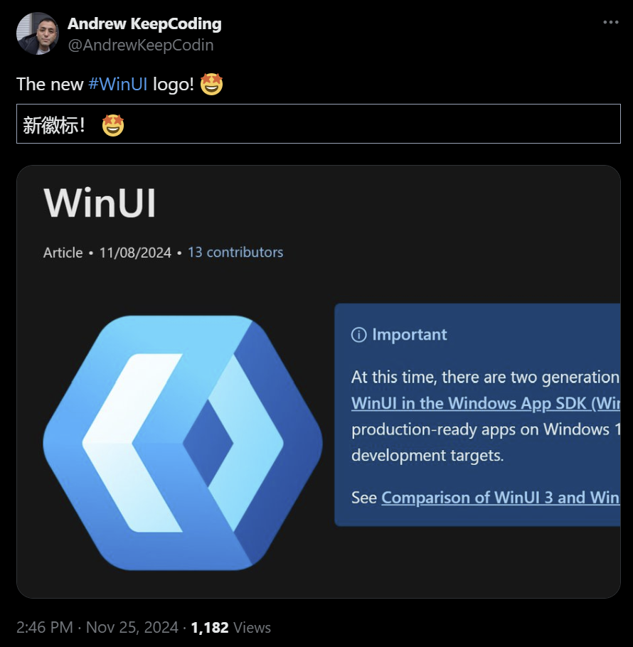

## 国内文章
### C# 入门深度学习：万字长文讲解微积分和梯度下降

https://www.cnblogs.com/whuanle/p/18551532

这篇文章主要介绍了使用 C# 进行深度学习的方法，特别是微积分在此领域的应用。作者简要讲解了极限、导数等基本概念，并展示了如何在 C# 中实现这些数学运算，例如将一个极大的数表示为无穷大，利用 Pytorch 和导数计算函数在某点的瞬时变化率。尽管细节不是数学教程的重点，但还是涉及了一些高等数学的基本公式和理论，如极限求解、导数的定义及其计算方法等。文章强调了数学基础在学习深度学习中的重要性。

### .NET9 - 新功能体验（一）

https://www.cnblogs.com/hugogoos/p/18559710

.NET 9版本发布，增强了性能、安全性和功能。主要改进包括C#13引入新的转义序列\e，简化终端控制字符的使用；对象初始值设定项支持隐式索引运算符[^]；params参数加强，支持多种集合类型；引入System.Threading.Lock实现互斥，替代旧版object加锁方式，提高代码安全性和效率。用户可通过命令行或更新IDE安装新版本，体验改进功能。

### 为什么需要[EnumeratorCancellation]？

https://www.cnblogs.com/sdcb/p/18551982/why-we-need-enumerator-cancellation

[EnumeratorCancellation] 在 C# 异步迭代器中用于分离生产者和消费者的职责。生产者专注于数据生成和响应取消请求，而消费者控制取消逻辑。如果不添加 [EnumeratorCancellation]，虽然异步操作可被取消，但可能导致取消逻辑混乱。通过 [EnumeratorCancellation]，生产者无需关心取消的来源或时间，简化了设计，提高可维护性和复用性。

### .NET使用Umbraco CMS快速构建一个属于自己的内容管理系统

https://www.cnblogs.com/Can-daydayup/p/18561518

文章介绍了Umbraco CMS，这是一个基于.NET的开源内容管理系统。它功能强大、易用，适合个人开发者和企业使用。文章详细说明了如何在.NET环境中安装和运行Umbraco CMS，包括下载.NET 9.0、安装Umbraco模板、创建和运行项目等步骤。作者还分享了项目源码地址和社区资源，并鼓励开发者参与DotNetGuide技术社区，以获取更多C#、.NET相关的学习资源和技术分享。

### C# 开发的环境监测上位机应用

https://www.cnblogs.com/1312mn/p/18555742

本文介绍了一款用于广西北海渔场环境监测的上位机软件，使用C#开发，支持温度、盐度、PH值等数据监测。软件通过Visual Studio 2019开发，基于WinForms框架。主要功能包括设备管理、数据查看、历史数据处理、低信号模式和阈值设置。用户可以安装特定控件和软件，界面分主节点和从节点，对应不同的监测参数。项目代码托管在Gitee平台，欢迎开发者参考和交流。本文为上位机开发者提供了实用的参考建议。

### 一个基于 .NET 8.0 构建的简单、跨平台、模块化商城系统

https://www.cnblogs.com/Can-daydayup/p/18555527

Module Shop是一个基于.NET 8.0的商城系统，功能包括订单、物流、国家、用户配置等。支持SQL Server/MySQL，使用Visual Studio 2022。项目开源，包含前后端和微信小程序源码，在线预览提供。该项目已被收录至C#/.NET优秀项目清单。

### .NET +Vue 开发的高级报表工具

https://www.cnblogs.com/1312mn/p/18545571

本文介绍了一款基于.NET 6开发的高级报表工具CellReport。该工具支持多数据源接入，具备强大的数据处理和可视化功能，设计界面类似Excel。支持多种报表模板，通过智能分析自动推荐合适的报表类型，并支持自定义分析。其高效的计算引擎保证了海量数据处理的性能。

### .NET9 - 新功能体验（二）

https://www.cnblogs.com/hugogoos/p/18563166

.NET9和C#13引入了一些新特性，如新的泛型约束allows ref struct，允许Span类型参数，提高了内存管理效率。C#13允许ref struct实现接口，但需遵循ref安全规则，不支持转换为接口类型。ref struct可在异步方法中使用，但不能在await同一代码块中使用，以避免内存安全问题。在迭代器中使用ref struct需避免yield return同一代码段。C#13新增部分属性和索引器，实现更灵活的代码管理。NET9在foreach中支持获取元素索引，方便遍历操作。

### 懂了这个道理，人月神话不再是神话！

https://www.cnblogs.com/xiaoweiyu/p/18553306

本文讨论了DDD在软件研发中的应用，通过明确建模设计与代码编写两个阶段，实现通过增加人手缩短交付周期的能力。作者介绍了将交付过程分为建模设计和代码编写环节，其中建模设计是将不确定性转为确定性的过程，不易通过增员加速；而代码编写可以模块化分工，适用充分的并行操作。该方法通过细化分工如CommandHandler和EventHandler，使得团队成员更易协作，提高效率。这种策略实现了灵活的人力资源调配，打破了《人月神话》中人力增加却无效的传统观点。作者最后提出，相信这种团队模式可被更多团队效仿并提高协作效率。

### 功能齐全的 WPF 自定义控件资源库（收藏版）

https://www.cnblogs.com/1312mn/p/18558990

这篇文章介绍了一款功能全面的WPF自定义控件资源库，适用于不同的.NET框架版本。资源库通过封装常用控件如按钮、文本框等，提高开发效率，避免重复编码。主要功能还包括主题设置、消息展示、在线升级和数据表格等。文中建议通过NuGet包进行控件的添加和配置，并通过示例代码说明如何自定义控件行为。文章推荐查看官方文档和源码以掌握更多API信息，最后鼓励通过点赞和留言共同交流学习。

### 100 款支持 .NET 多版本的强大 WPF 控件库

https://www.cnblogs.com/1312mn/p/18548375

CookPopularUI 是一个集成了超过100个 XAML 控件的 .NET 控件库，旨在提高开发效率，使开发者专注于核心业务逻辑。提供的数据网格、图表、导航菜单等控件支持高度自定义，并且兼容多个 .NET 版本，包括 .NET Framework 和 .NET Core/.NET 5+。库中还集成了帮助类，简化了数据绑定和文件处理等任务。丰富的文档和示例代码为用户快速上手提供了支持。用户可通过 Nuget 包引用和 ResourceDictionary 完成库的集成。该库在 Gitee 上提供，适合希望提升 WPF 开发效率的开发者。文中鼓励读者点赞支持并通过微信公众号交流。

### 一个.NET开源、快速、功能丰富的跨平台阅读服务器

https://www.cnblogs.com/Can-daydayup/p/18559231

本文介绍了一个基于.NET的开源跨平台阅读服务器Kavita，旨在提供全面的阅读解决方案。它支持多种书籍和漫画格式，并具备全语言支持、丰富的元数据处理、可定制主题和响应式阅读器等功能。用户可分享阅读收藏，项目源代码和文档也可在线获取。该项目被收录到C#/.NET领域的优秀项目中，并欢迎开发者贡献代码。

### .NET Core 特性(Attribute)底层原理浅谈

https://www.cnblogs.com/lmy5215006/p/18551715

文章介绍了Attribute在.NET框架中的广泛应用及其与反射的关系。通过展示C#中的具体例子，说明如何利用反射获取枚举的自定义特性，并通过缓存优化反射调用的性能。此外，文章还讨论了Attribute在Newtonsoft.Json中的使用，尤其是JsonConverter的实现方式及其性能优化策略。整体而言，Attribute被形象化为写给代码看的注释，强调其在代码中的重要性与灵活性。

### .NET9 - 新功能体验（三）

https://www.cnblogs.com/hugogoos/p/18565448

.NET9和C#13引入了Linq新方法CountBy和AggregateBy，简化统计操作。CountBy实现无需经GroupBy分组即可直接统计不同年龄人数，提升效率。AggregateBy计算每班级学生总年龄也较为简便。序列化方面，System.Text.Json提供了新的缩进选项，允许自定义JSON格式化。此外，新增的默认Web选项单例支持按小驼峰命名法序列化对象。还有Task新方法Task.WhenEach，用于逐个处理任务。

### Abp Vnext Vue版本(Vben Admin5.0)

https://www.cnblogs.com/WangJunZzz/p/18562591

这篇文章介绍了开源项目abp vnext pro中的前后端版本升级。新版本vben5取代了旧版vben2.8，集成了国内最新技术。文章详细说明了系统功能，包括用户管理、角色管理、多语言等，并提供了快速开始指南，涉及开发环境要求、后端配置和前端安装等步骤。后端需要安装CLI工具，并配置MySQL、Redis和RabbitMQ等服务。前端分为Vben2.8和Vben5版本，Vben5需购买源码。安装pnpm并运行项目后，可通过指定网址进行访问和登录。

### 无加密的机密性：Chaffing and Winnowing原理和C#实验仿真

https://www.cnblogs.com/TwilightLemon/p/18565076

文章介绍了Rivest提出的Chaffing and Winnowing技术，通过在消息中混入无关信息并添加认证码，实现即使在拥有解密能力的环境中，保证消息安全。文章分为技术原理、应用分析及实验仿真。技术上，发送方发送已认证的消息和chaff，接收方通过认证码识别真实信息。可否认加密和流量分析防止等研究方向提出。实验部分阐述在C# .NET平台上模拟整个过程。文中探讨技术运用及面临问题，如消息体积增大和密钥协商。

### 3张大图剖析HttpClient和IHttpClientFactory在DNS解析问题上的殊途同归

https://www.cnblogs.com/JulianHuang/p/18553199

在.NET开发中，针对HttpClient的使用，早期由于HttpClientHandler的实现导致Socket滥用和DNS解析问题。为解决这些问题，.NET Core 2.1引入了SocketsHttpHandler，用以管理连接池生命周期，并对HttpClientHandler进行了改造，使其套壳为SocketsHttpHandler。此外，ASP.NET Core的IHttpClientFactory通过一个缓存工厂模式管理HttpClientHandler的生命周期，以避免DNS解析问题。这种模式通过DI（依赖注入）机制，在缓存字典中短暂保存Handler的状态，有效管理连接复用，从而提高性能和可靠性。

### Microsoft.Extensions.AI 初探

https://www.cnblogs.com/mingupupu/p/18556342

.NET Conf介绍了AI功能如何增强.NET应用，例如语义搜索、自动分类、摘要等。Microsoft.Extensions.AI提供统一的AI服务标准API，支持本地或托管服务的大型语言模型。演讲展示了如何组合多种服务并实现灵活替换。Microsoft.Extensions.AI在.NET生态中作为统一层，方便开发者选择框架和库。Microsoft.Extensions.AI的API抽象统一，与日志记录和依赖注入类似，兼容任何提供商，提高灵活性和易用性。使用OpenAI和国内兼容提供商的例子展示了该API的应用。

### ABP-VNext 用户权限管理系统实战06---多租户集成

https://www.cnblogs.com/zhengwei-cq/p/18562733

本文详细描述了如何使用Volo.Abp.AspNetCore.MultiTenancy实现多租户集成。首先引用必要的安装包，然后配置租户Key，并通过AbpDefaultTenantStoreOptions定义租户信息。接着启用租户功能并配置中间件。文章还解析了租户源代码，从中间件UseMultiTenancy()切入，通过方法InvokeAsync解析请求头中的租户信息，并与系统已配置的租户匹配。本文清晰地展示了租户信息的解析及匹配过程。

### Ocelot集成Consul实现api网关与服务发现

https://www.cnblogs.com/shiningrise/p/18558784

这篇文章介绍了如何在dotnet微服务项目中使用Consul进行服务注册与健康检查。文中通过Docker创建自定义网络并使用Consul作为服务治理工具，具体步骤包括在GoodApi项目中安装Consul包，修改Program.cs文件，配置服务的健康检查，并注册服务。同时提供了获取本地IP地址的方法代码。文章最后展示了使用Dockerfile创建ASP.NET应用的基础镜像，并配置环境变量和启动项。

### 使用原生Web开发技术为在线客服系统提供网页版配置工具

https://www.cnblogs.com/sheng_chao/p/18562454

升讯威在线客服与营销系统是一款基于.net core和WPF开发的在线客服软件，注重开放、开源及共享。随着使用私有化部署的用户增多，部署过程中的配置复杂性也增加。为解决配置问题，开发了一款基于网页的配置文件生成工具，可以在浏览器中直接生成配置文件内容，提高效率。工具采用Bootstrap和jQuery技术实现，Bootstrap提供响应式设计，而jQuery简化了网页元素操作和事件处理，提升用户体验。

### 基于木舟平台浅谈surging 的热点KEY的解决方法

https://www.cnblogs.com/fanliang11/p/18559532

文章介绍了基于.NET6.0环境的木舟(Kayak)平台及其微服务引擎Surging。平台支持异步编程、设备管理和多协议适配。重点讨论了缓存热点Key问题及其解决方案。热点Key是因大量请求访问Redis某固定key，引发缓存击穿，影响服务可用性。解决方案包括使用MemoryCache或Redis缓存进行数据拦截和分片处理，并使用二级缓存与缓中间件来优化带宽和提高性能。

## 主题

### dotnet 脚手架 - .NET 的下一代项目创建 - .NET 博客
https://devblogs.microsoft.com/dotnet/introducing-dotnet-scaffold/

用于脚手架的命令行工具 dotnetscaffold 已发布。

该工具允许您在 CLI 上以交互方式构建 ASP.NET Core 应用程序（例如，为模型和一组数据操作代码生成页面），这之前是在 Visual Studio 中完成的。

目前支持 Web 应用程序、Web API、.NET Aspire 和 Blazor 的脚手架。

- [尝试新的.NET脚手架 - Qiita](https://qiita.com/karuakun/items/101b257e3ef9bab818e7)

### AWS Lambda 现在支持 Python 和 .NET 函数的 SnapStart - AWS
https://aws.amazon.com/jp/about-aws/whats-new/2024/11/aws-lambda-snapstart-python-net-functions/

AWS Lambda SnapStart 现在支持 .NET。

Lambda SnapStart 通过提前拍摄快照来提高启动性能。

- [适用于 Python 和 .NET 函数的 AWS Lambda SnapStart 现已正式推出 Amazon Web Services](https://aws.amazon.com/jp/blogs/aws/aws-lambda-snapstart-for-python-and-net -功能现在普遍可用/)

### 发布 Windows App SDK 1.6.3 (1.6.241114003) · microsoft/WindowsAppSDK
https://github.com/microsoft/WindowsAppSDK/releases/tag/v1.6.3

Windows App SDK 1.6.3 已发布。

此版本修复了多个错误并为小部件添加了新的 API。

### 发布 v1.7-exp1 · microsoft/WindowsAppSDK
https://github.com/microsoft/WindowsAppSDK/releases/tag/v1.7-exp1

Windows App SDK 1.7.0实验1已发布。

此版本包括新的 CameraCaptureUI API、新的身份验证 API、新的后台任务支持等。

### .NET 9 中的 OpenAPI 文档生成 - .NET 博客
https://devblogs.microsoft.com/dotnet/dotnet9-openapi/

关于 .NET 9 中的 OpenAPI 文档支持。

本文介绍了新功能、如何启用支持并涉及自定义。

### 发布版本 v2.67.0 · grpc/grpc-dotnet
https://github.com/grpc/grpc-dotnet/releases/tag/v2.67.0

grpc-dotnet v2.67.0 已发布。

此版本包括一些代码清理和对日志级别的调整，以记录服务器上的方法取消。

### 发布 v9.0.1 · npgsql/npgsql
https://github.com/npgsql/npgsql/releases/tag/v9.0.1

Npgsql v9.0.1 已发布。

此版本包括 System.Text.Json 的版本还原，以解决 System.Text.Json 对 9.0.0 的依赖的一些问题。

### 介绍 Azure API 管理策略工具包 | Microsoft 社区中心
https://techcommunity.microsoft.com/blog/IntegrationsonAzureBlog/introducing-azure-api-management-policy-toolkit/4303483

Azure API 管理策略工具包现已处于早期版本。

Azure API 管理策略工具包使你能够使用 C#（而不是 Razor 语法）定义 Azure API 管理策略。

## 文章、幻灯片等
### 为什么我们选择 Radzen 作为 Blazor 的 UI 组件
https://zenn.dev/nexta_/articles/6988cbc29e85b9

关于选择Radzen作为Blazor的UI组件库。

### 复制错误消息变得更容易 - Visual Studio 博客
https://devblogs.microsoft.com/visualstudio/copying-error-messages-just-got-easier/

Visual Studio 2022 16.12 使复制错误消息变得更加容易
### 深入研究 .NET 托管服务
https://itnext.io/deep-dive-into-net-hosted-services-01b1388ad78b

后台服务（IHostedService）的描述。

每个方法提供什么样的功能，生命周期管理等。

### Microsoft Ignite 2024 中 Visual Studio 中的 5 大 GitHub Copilot 功能 - Visual Studio 博客
https://devblogs.microsoft.com/visualstudio/top-5-github-copilot-features-in-visual-studio-from-microsoft-ignite-2024/

介绍在 Ignite 202 4 上宣布的 Visual Studio 中 GitHub Copilot 的 5 项功能。

### C++ 调用 C#：跨运行时的友谊故事
https://medium.com/@maximiliysiss/c-calls-c-a-tale-of-friendship-across-runtimes-0168d679f66d

从 C++ 调用 C#/.NET 的技术摘要。

它介绍了托管运行时、使用 C++/CLI、使用 Native AOT 构建以及使用 COM 等技术。

### C# 程序员的 JavaScript 备忘单
https://zenn.dev/zead/articles/js-cheat-sheet-for-cs

面向 C# 程序员的 JavaScript 语法备忘单及更多内容。

### 使用 Visual Studio v17.12 让您更加高效 - Visual Studio 博客
https://devblogs.microsoft.com/visualstudio/making-you-more-productive-with-visual-studio-v17-12/

Visual Studio 2022 17.12 中引入了新的生产力功能。

- 从错误列表中复制
- 从代码搜索转到行
- 对接代码搜索窗口
- 刷新搜索结果
- 跨实例复制文件
- 多个项目的启动设置

### 本机 AOT 在 WinUI 3 中变得更加容易
https://zenn.dev/shinta0806/articles/winui3-native-aot

使用本机 AOT 构建 WinUI 3 应用程序的说明。

### 尝试为 ASP.NET Core Minimal API 中的模型绑定错误返回有意义的问题详细信息响应
https://dev.to/nausaf/aborted-attempt-to-return-meaningful-problem-details-response-from-model-binding-errors-in-an-353g

如何在 ASP.NET Core Minimal API 中返回模型绑定错误作为问题详细信息响应。

### .NET 9.0 如何将 JSON Schema 性能提高 32% | endjin
https://endjin.com/blog/2024/11/how-dotnet-9-boosted-json-schema-performance-by-32-percent

在 .NET 9 上运行 JSON Schema 库 Corvus.JsonSchema 时，性能提升约 30% 以上，无需更改任何代码。

### 跨 Visual Studio 实例复制文件 - Visual Studio 博客
https://devblogs.microsoft.com/visualstudio/copy-files-across-instances-of-visual-studio/

现在，您可以在 Visual Studio 实例之间移动和复制文件和文件夹。

### 尝试 Microsoft.Extensions.AI
https://zenn.dev/microsoft/articles/unified-ai-building-block-001

介绍 Microsoft.Extensions.AI，它抽象了聊天 AI (LLM)。

本文介绍了简单的用法、函数调用以及与中间件和 Prompty 的集成。

### 让我们玩一下 Microsoft.Extensions.VectorData
https://zenn.dev/microsoft/articles/unified-ai-building-block-002

关于 Microsoft.Extensions.VectorData，一个处理向量存储的抽象库。

本文提供了一个使用 .NET Aspire 托管的 Ollama 和 Qdrant 组合的示例。

### 在 Raspberry Pi 上安装并使用 Microsoft Dot NET 9
https://www.petecodes.co.uk/install-and-use-microsoft-dot-net-9-with-the-raspberry-pi/?WT.mc_id=link-twitter-isaacl

如何在 Raspberry Pi 上安装和运行 .NET 9 并控制 GPIO。

### VisualStudio.Extensibility 17.12：CodeLens 支持现已推出 - Visual Studio 博客！
https://devblogs.microsoft.com/visualstudio/visualstudio-extensibility-17-12-codelens-support-is-here/

引入新的 API，例如 VisualStudio.Extensibility 17.12 中支持的 CodeLens本文介绍了 CodeLens（实验性）支持，以及输出窗口 API 的更新以及用于调试的诊断资源管理器的更新。

### neue cc - Cysharp 的 OSS Top 10 摘要 / Ulid 与 .NET 9 UUID v7 / MagicOnion
https://neue.cc/2024/11/19_cysharp_oss.html

关于“从 Cysharp 的 OSS 小组看到的现代 C# 的当前状态”会议。本文还涉及 .NET 中 ULID 和 UUID v7 的比较和当前状态。

### MagicOnion 服务器性能调查和通过 Doxel 更新进行性能改进 
https://www.docswell.com/s/toutou/Z7RJLD-2024-11-17-155150

<a href="https://www.docswell.com/s/toutou/Z7RJLD-2024-11-17-155150">MagicOnion 服务器性能调查和 .NET 更新 性能改进作者：@toutou</a>

## 网站、文档等
### 推文
https://x.com/andrewkeepcodin/status/1860937997895782853?s=12

