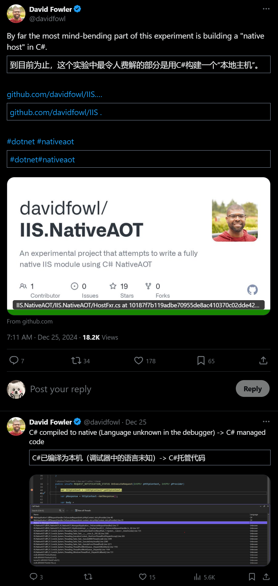
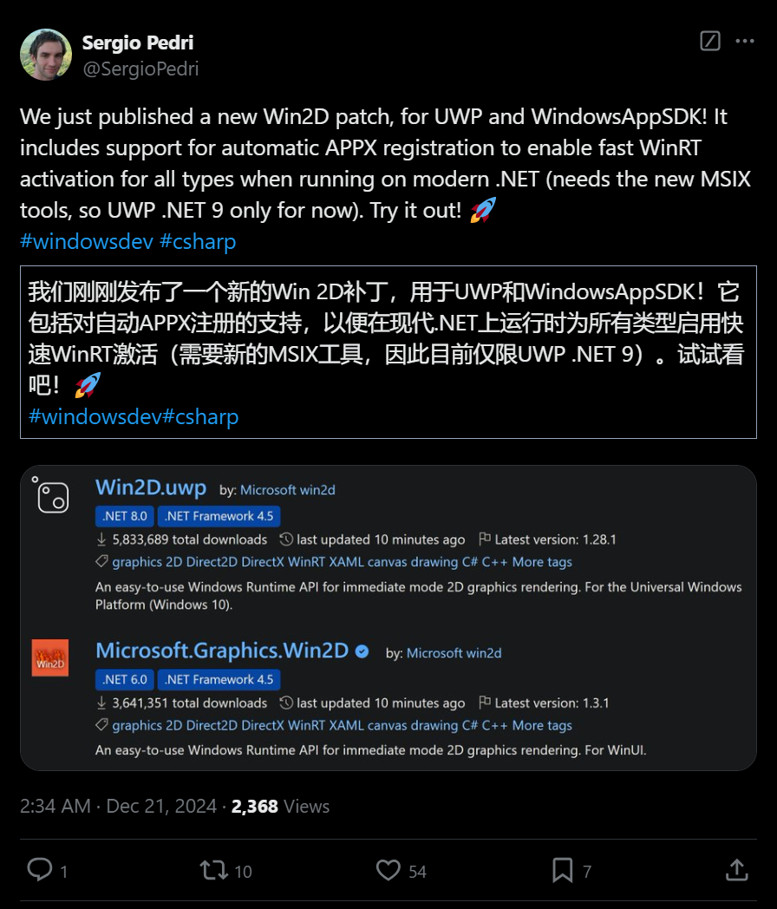

## 国内文章
### dotnet 简单使用 ICU 库进行分词和分行

https://www.cnblogs.com/lindexi/p/18622917

本文将和大家介绍如何使用 ICU 库进行文本的分词和分行。

### dotnet 简单聊聊 Skia 里的 SKFontMetrics 的各项属性作用

https://www.cnblogs.com/lindexi/p/18621674

本文将和大家简单聊聊 Skia 里的 SKFontMetrics 的各项属性作用和代表的含义。

### 他又又来了，c#开源sql解析引擎类库【SqlParser.Net 1.0】正式发布，它可以帮助你简单快速高效的解析和处理sql

https://www.cnblogs.com/hezp/p/18411611

这篇文章介绍了作者开发的SqlParser.Net，一个支持多种数据库的高效SQL解析引擎。作者提到以往的尝试失败，因找不到合适的SQL解析库，因此决定自己动手。经过三个月的努力，他构建了一个纯C#实现的解析引擎，支持Oracle、SQL Server、MySQL、PostgreSQL和SQLite。这个项目的特点是快速、文档齐全、代码简洁。文章也提供了如何通过NuGet安装和简单使用的示例。作者致力于持续完善文档和功能。

### 好消息，在 Visual Studio 中可以免费使用 GitHub Copilot 了！

https://www.cnblogs.com/Can-daydayup/p/18618205

本文介绍了GitHub Copilot的免费使用及其在Visual Studio中的应用。GitHub Copilot是一款AI编码助手，能够帮助开发者更高效地编写代码。文章详细说明了其功能，包括每月2000次代码补全、50个编程问题聊天请求，以及支持多种编程语言，如C#、Python等。作者建议下载最新版本的Visual Studio 2022使用Copilot，提供了激活和使用的详细步骤。文章还介绍了DotNetGuide技术社区，旨在为.NET开发者提供交流和学习平台。参考链接指向GitHub和Visual Studio的官方信息。

### 聊一聊坑人的 C# MySql.Data SDK

https://www.cnblogs.com/huangxincheng/p/18619048

本文讨论了MySql.Data驱动在同步调用下导致线程饥饿的问题。作者讲述了两个因程序卡死的例子，分析后发现是由于MySql.Data的升级引起的。旧版本的驱动使用同步方式访问数据库，但新版本保留了同步方法而混用异步方法。这种做法导致线程池耗尽，即无可用线程处理请求。文章中还提到通过windbg分析故障现场，展示了线程池的状态以及故障现象。本文章提供了深刻的技术分析和实际的应用背景，尤其针对C#开发者。文章内容清晰、实用性强、原始性高，评价分数较好。

### 【杂谈】如何选择：Session 还是 JWT？

https://www.cnblogs.com/longfurcat/p/18609842

本文讨论服务端如何验证客户端登录。用户登录后，服务端发放凭证。每次请求需携带凭证，服务端通过验证其有效性判断用户是否已登录。Session使用简单ID映射会话信息，JWT则是自包含的令牌，包含用户信息和权限。Session通过Cookie传输，JWT通过Authorization头部传递。Session存储在服务端，JWT存储在客户端。JWT在分布式架构中更具优势，能独立验证，无需访问共享存储。同时，Session易于管理，而JWT处理踢人操作依赖黑名单。总之，二者各有优缺点。

### WinForm 通用权限框架，简单实用支持二次开发

https://www.cnblogs.com/1312mn/p/18608183

本文介绍了一个针对WinForms应用的通用权限管理框架，强调其在企业级应用中的重要性。框架包含完整的权限结构，支持用户、角色、菜单等管理模块，简化了开发流程。包含自动更新机制，确保应用始终是最新的，提升了维护效率。还提到 Dev 前后端分离版本，增加了 API 接口生成和在线用户管理功能。文中还提供了项目使用说明，确保用户能顺利配置和运行系统。总体上，该框架有助于提升开发效率，降低重复劳动。

### 基于.NET WinForm开发的一款硬件及协议通讯工具

https://www.cnblogs.com/Can-daydayup/p/18615909

本文介绍了一款名为PLC-CommunTools的硬件及协议通讯工具，基于.NET WinForm开发，支持多种PLC协议及基本的TCP、串口和IO口通讯。项目使用C#8.0和.NET Framework 4.6.2框架。作者正在不断完善功能。文中提供了项目的GitHub开源地址，鼓励用户下载和支持，此外，项目已被收录到C#/.NET/.NET Core优秀项目中，以便快速了解该领域的最新动态和最佳实践。

### 工作中这样用MQ，很香！

https://www.cnblogs.com/12lisu/p/18617434

文章探讨了消息队列（MQ）在分布式系统中的作用，强调其在异步处理、流量削峰、服务解耦和分布式事务等方面的应用。通过实际场景与示例代码，展示了如何使用MQ提升系统性能与稳定性。MQ能有效解耦服务、缓解高并发压力、确保数据一致性，增强系统容错能力，适用于电商、订单处理等场景。作者结合具体案例，讲解了MQ的操作逻辑和实现方法，使读者易于理解并应用于实际工作中。

### [WPF UI] 为 AvalonDock 制作一套 Fluent UI 主题

https://www.cnblogs.com/xymfblogs/p/18615167

AvalonDock是一个用于WPF的开源布局控件库，能够实现类似Visual Studio的布局效果。作者在使用过程中，发现默认样式不符合个人偏好，便根据WinUI风格重新设计主题，并分享给其他开发者。作者提供了项目地址和参考项目链接，说明目前主题尚不完善，样式字典管理混乱，承诺会继续改进，欢迎大家提出建议。

### .NET 单文件执行程序拆解器 SingleFileExtractor

https://www.cnblogs.com/haogj/p/18618295

.NET 单文件执行程序拆解器 (SingleFileExtractor) 是一个工具，可以从单文件程序中提取程序集和配置文件。它便于开发人员分析程序内容。安装使用 dotnet 工具命令，支持 .NET 6.0。通过命令行操作，用户可以提取文件到指定输出目录或列出文件。也可在项目中使用 NuGet 包，通过 ExecutableReader 类读取启动信息并提取文件。此工具应对从单文件执行程序提取内容的需求，充分满足开发者的实际需要。

### 一个.NET开源、易于使用的屏幕录制工具

https://www.cnblogs.com/Can-daydayup/p/18620791

Captura是一款基于.NET的开源屏幕录制和截图工具，使用简单并且免费。它支持录制屏幕活动、捕获截图、录制音频，以及记录鼠标和键盘操作。用户可以选择录制特定区域、窗口和格式如Avi、Gif和Mp4。Captura还支持命令行操作和多语言，提供可配置热键，适合提高工作效率。尽管该项目已归档，仍可下载使用。Captura被推荐收录在C#/.NET优秀项目和框架中，有助于开发者了解行业动态。

### .NET Core 异常(Exception)底层原理浅谈

https://www.cnblogs.com/lmy5215006/p/18604440

文章详细阐述了中断与异常的类型，包括内中断和外中断。内中断分为硬件异常、故障、陷阱和终止，并解释了每种情况的产生原因。用户异常由软件模拟产生，例如.NET的OutOfMemoryException。外中断通过外部设备请求CPU响应，NMI和INTR是关键机制。文中还提供了C#代码示例，展示用户异常和硬件异常的处理方式，分析了它们的性能开销，介绍CLR如何处理硬件异常，确保对异常的统一处理。整体逻辑清晰，对中断与异常有深入的探讨。

### 跨平台交叉编译 Native AOT

https://www.cnblogs.com/shanyou/p/18618066

这篇文章探讨了如何将.NET应用程序发布到OpenHarmony系统上。它介绍了NativeAOT作为最佳选择，能提高应用性能。作者分享了交叉编译的过程，使用Zig作为链接器，允许从Windows编译到Linux等平台。文章提供了具体步骤，包括安装Zig和LLVM工具链，并确保配置正确。作者还引用了相关项目和工具，确保读者能够顺利进行跨平台发布。整体内容深入实用，呈现出与.NET相关的技术。

### 如何为在线客服系统的 Web Api 后台主程序添加 Bootstrap 启动页面

https://www.cnblogs.com/sheng_chao/p/18612283

这篇文章介绍了升讯威在线客服与营销系统的开发过程。作者最初通过Web API返回简单的状态信息，解决了404问题。后来，根据客户需求，引入Bootstrap，创建了美观的状态页面。文章详细描述了如何在Web API中添加静态文件，显示应用程序的状态。作者提供了具体的代码示例，涵盖了项目结构和页面设计，展示了技术的可行性和用户体验的提升。

### Winform 使用WebView2 开发现代应用

https://www.cnblogs.com/chenyishi/p/18618354

WebView2 是 Microsoft 的基于 Edge (Chromium) 的浏览器控件，允许开发者结合现代 Web 技术与桌面应用。本文介绍 WebView2 的基础用法，包括四个重要功能：NewWindowRequested、WebResourceResponseReceived、AddWebResourceRequestedFilter 和 WebResourceRequested。安装 WebView2 Runtime 是必要步骤，文章提供了创建和初始化 WebView2 控件的示例代码，包括拦截新窗口请求的逻辑。本文适合需要插件功能的开发者，提供实践性和清晰的指引。

### C#/.NET/.NET Core技术前沿周刊 | 第 17 期（2024年12.09-12.15）

https://www.cnblogs.com/Can-daydayup/p/18611201

这篇文章介绍了C#/.NET/.NET Core的最新技术和学习资源，涉及如何使用本地AI模型、WinForms的异步API、ASP.NET Core Web API与Blazor Wasm在IIS上的发布、WPF管理系统、.NET8开源框架，以及MongoDB数据仓储和工作单元模式等主题。它提供了实用的技术指导，适合开发者在实践中提高技能，拓展视野，并分享各类优质资源。

### 使用 .NET Core 实现一个自定义日志记录器

https://www.cnblogs.com/Tangtang1997/p/18616866

本文探讨了自定义日志记录器的实现，重点在于如何将日志数据存入数据库。介绍了抽象包和两种实现方式，分别为基于EntityFramework Core和MySqlConnector。文章详细说明了日志记录接口和日志结构实体的定义，强调异步处理以提升性能。该实现独立于现有的日志记录库，适合需要自定义日志解决方案的应用程序。整体结构清晰，适宜开发者参考实施。

### ASP.NET Core EventStream (SSE) 使用以及 WebSocket 比较

https://www.cnblogs.com/morec/p/18619781

该文章介绍了Server-Sent Events（SSE）及其在ASP.NET Core中的应用。SSE允许服务器通过HTTP协议向浏览器实时发送数据更新。文章中展示了如何在ASP.NET Core中实现SSE，包含配置服务和允许跨域请求的示例代码。此外，文章提供了实时监控项目结构的基础概述，适合开发者理解SSE的实现方式和使用案例。内容清晰且具有实用性。总的来说，对于想要实现实时数据流功能的开发者来说，信息非常有价值。

### Fleck：一个轻量级的C#开源WebSocket服务端库

https://www.cnblogs.com/chingho/p/18609601

Fleck 是一个用 C# 编写的轻量级 WebSocket 服务器库。它具有简单易用的 API，适合实时通信、在线游戏和聊天应用。Fleck 无需复杂配置，且不依赖特定组件，运行环境广泛。然而，它不支持复杂认证和详细统计。使用示例展示了如何创建 WebSocket 服务器，处理连接和消息。支持 wss 协议和子协议的自定义设置，也提供了记录功能。该库设计旨在实现高性能和简洁代码。

### C#中 Task 结合 CancellationTokenSource的妙用

https://www.cnblogs.com/chenyishi/p/18620273

本文介绍了.NET中的CancellationTokenSource、CancellationToken和Task的用法，强调它们在异步操作和任务取消中的重要性。CancellationTokenSource负责发出取消信号，CancellationToken用于传播取消请求，而Task则用于执行异步操作。通过示例，文章阐明了如何结合这些工具实现任务的取消，展示了具体的代码用法及其效果。整体上，文章内容详尽、易于理解，适合开发者学习如何处理异步任务的取消操作。

### [Blazor] 一文理清 Blazor Identity 鉴权验证

https://www.cnblogs.com/madtom/p/18619853

本文探讨Blazor身份认证与授权机制，重点解析其框架构成及鉴权逻辑。Blazor作为C#和.NET的前端框架，提供了有效的身份认证手段。文章详细介绍AuthenticationMiddleware的作用，分析其在请求处理中的身份验证流程，确保应用安全。通过具体案例，读者将掌握Blazor Server和Blazor WebAssembly中身份认证的实现，提升Web应用安全性与可靠性。总结来看，本文使读者对Blazor中的Identity有深入理解，适合希望提高Web安全性的开发者。

### Avalonia 国际化之路：Resx 资源文件的深度应用与探索

https://www.cnblogs.com/Dotnet9-com/p/18618351

在全球化的软件开发中，国际化和本地化非常重要。Avalonia UI 作为跨平台 UI 框架，支持使用 Resx 资源文件进行国际化。这种方式结合了传统开发习惯，简化了实现流程。开发者需在项目中创建 I18n 目录，添加默认英文资源文件，通过特定命名规则扩展多语言资源。引入 AvaloniaExtensions.Axaml NuGet 包增强国际化功能，简化代码编写。使用 T4 文件生成强类型资源类，确保资源引用准确直观。这些步骤为开发多语言应用提供了有效的基础。

### 如何优雅地让 ASP.NET Core 支持异步模型验证

https://www.cnblogs.com/coredx/p/18593850

本文讨论了ASP.NET Core中的异步模型验证问题，指出了FluentValidation与MVC集成的不足。文章提到FluentValidation的实现导致可兼容性差，异步验证特性的实现方式降低了易用性。为此，作者针对现有问题进行了改造，重新构建了一个解决方案，分离了基本验证器和MVC集成内容。文中还提到了新书《C#与.NET6 开发从入门到实践》的相关信息，进一步阐述了异步模型验证的实现方式。整体内容技术深入且具有建设性。

### RepoDB：一个介于Dapper、EFCore之间.Net的ORM库

https://www.cnblogs.com/chingho/p/18602846

RepoDB是一个轻量级与全功能ORM的开源项目，支持SqlServer、SQLite、MySql和PostgreSql等多种数据库。它提供基础的CRUD操作，并包含高级特性如第二层缓存、跟踪、仓储和批量操作。开发者可以使用少量代码轻松进行数据操作，且在批量操作中支持同步生成的标识列。RepoDB提供多种执行方式，包括原子、批处理和批量操作，使用简单，效率高。项目地址为https://github.com/mikependon/RepoDB。

### 聊一聊 C#前台线程 如何阻塞程序退出

https://www.cnblogs.com/huangxincheng/p/18622015

这篇文章讨论了C#中的后台线程和主线程之间的关系。作者通过实际程序示例，阐明了当线程设置为非后台（IsBackground = false）时，主线程退出后应用程序仍在运行的原因。文章中还展示了使用Windbg进行调试，揭示了主线程的状态。通过对线程状态的深入分析，作者提供了对后台线程机制的理解。整体内容结合了实际问题，具有一定的技术深度和实用性。

### CompilerGenerated与GeneratedCode区别

https://www.cnblogs.com/podolski/p/18619551

本文介绍了C#中的两个特性：GeneratedCodeAttribute和CompilerGeneratedAttribute。GeneratedCodeAttribute用于标记由工具或编译器生成的代码，包含生成工具名称和版本，提醒开发者不要直接修改这些文件，以避免在下次生成时丢失更改。CompilerGeneratedAttribute则用于标识C#编译器自动生成的代码片段，没有参数，主要用于区分用户编写的代码和编译器生成的代码。虽然两个特性都用于标识代码的生成来源，其适用场景和来源有所不同。

### Superpower：一个基于 C# 的文本解析工具开源项目

https://www.cnblogs.com/chingho/p/18612234

Superpower是一个文本解析开源工具，功能强大，适合解析日志、构建编程语言等场景。它能将字符序列转化为易于操作的数据结构，并提供详细错误报告。Superpower的性能优化措施减少了回溯和内存分配。用户通过NuGet安装包，然后可以轻松构建解析器，例如解析字母开头的标识符或算术表达式。它支持令牌解析，能处理复杂的输入。在实际应用中，Superpower被用于多个项目，示例包括JSON解析器等。

### C#调用Python代码的方式（二），以PaddleOCR-GUI为例

https://www.cnblogs.com/mingupupu/p/18612101

本文介绍了如何在C#中使用pythonnet调用Python代码，解决频繁调用和数据交互中的问题。pythonnet包实现了Python与.NET的无缝集成，允许在.NET应用中嵌入Python。文中详细讲解了Runtime.PythonDLL、PythonEngine.PythonHome和PythonEngine.PythonPath的配置。提供了使用示例，其中包含C#代码和对应的Python代码，展示了如何处理模块导入和日志配置。这些内容为开发者提供了实用的指导，增强了C#与Python的交互能力。

### LeetCode题集-8 - 字符串转换整数 (atoi)

https://www.cnblogs.com/hugogoos/p/18611597

本文实现了myAtoi函数，将字符串转换为32位有符号整数，提供了两种解法。第一种是手动处理字符，通过循环去除空格、识别符号和数字，并计算结果，最后检查溢出。第二种是正则表达式法，先使用正则匹配开头的空白、符号和数字，然后用BigInteger进行转换。两种方法既高效又实用，适合解决此类问题。

### LeetCode题集-9 - 回文数

https://www.cnblogs.com/hugogoos/p/18617742

本文讨论了检测回文整数的三种方法。第一种是反转字符串法，将整数转为字符串，反转后比较；第二种是反转字符数组法，使用字符数组转存数字并比较其值；第三种是双指针法，直接操作整数，通过取整和取余比较数位，不需要转换成字符串。每种方法都有其实现代码，并指出了某些易出错的地方。文章适合对回文数问题有一定了解的读者，结合代码示例更易于理解。

### .NET 9 New features-JSON序列化

https://www.cnblogs.com/tianqing/p/18622226

.NET 9 新增了 JSON 序列化的功能，其中包含自定义缩进字符和缩进大小的新属性。通过 JsonSerializerOptions，用户可以灵活调整 JSON 格式以满足不同需求，如日志优化、前端格式匹配、文件大小控制以及与外部工具兼容性。示例代码展示了如何使用制表符和空格作为缩进字符及其效果。这些改进提高了开发者在处理 JSON 数据时的效率与灵活性。

## 主题

### 重要：.NET 安装链接正在更改 - .NET 博客
https://devblogs.microsoft.com/dotnet/ritic-dotnet-install-links-are-changing/

请注意有关 .NET 安装链接更改的公告。

.NET 下载 URL 将发生变化，因为在 .NET 安装期间用于下载的 CDN 域“azureedge.net”将于明年 1 月 15 日停用。

如果每次安装时都下载脚本，则不会受到影响，但如果保存脚本或直接使用固定URL，则用户将需要采取行动。

- [严重：.NET 安装域和 URL 正在更改 · 问题 #9671 · dotnet/core](https://github.com/dotnet/core/issues/9671)

### 发布 v3.1.1 · MessagePack-CSharp/MessagePack-CSharp
https://github.com/MessagePack-CSharp/MessagePack-CSharp/releases/tag/v3.1.1

MessagePack-CSharp v3.1.1 已发布。

此版本包括在 AOT 环境中启用 DynamicGenericResolver 以及针对 Source Generator 的修复。

### 2024 年热门 .NET 博客文章 - .NET 博客
https://devblogs.microsoft.com/dotnet/top-dotnet-blogs-posts-of-2024/

2024 年 .NET 博客（官方）重要帖子的回顾和介绍。

## 活动日历
 - [[C#] Dapper 备忘录 [高级版] - Qiita](https://qiita.com/YuMo_tea/items/7f7b7db39792292dc3b4)
 - [我研究了 C# 中的异步处理 - Qiita](https://qiita.com/keitakei777/items/1ca996fd5bbcfed39544)
 - [用C#自动生成MVVM样板代码 - Qiita](https://qiita.com/Nonchalant/items/d0be654c6295debd3cdd)
 - [在 Blazor 中使用类似 Excel 的网格库“BlazorDatasheet” - Qiita](https://qiita.com/yaju/items/836d61016c702796c246)
 - [我需要一台 Mac 才能在 App Store 上发布 .NET MAUI 应用程序吗？ - Qiita](https://qiita.com/tomato_propeller/items/609e5a90e1aa99739d79)
 - [[详情]使用C#创建REST API服务器并部署到Azure的实现示例 - Qiita](https://qiita.com/DTB_AutumnSky/items/7137a49e63547318c69c)
 - [我查看了列表 - Qiita](https://qiita.com/keitakei777/items/9ddcbd0e9d57e1fd692c)
 - [热巧克力？什么东西一定好吃啊！ - Qiita](https://qiita.com/nekohei/items/a3e8ea6a85a647497b5e)
 - [我研究了 Linq - Qiita](https://qiita.com/keitakei777/items/81a661a33a5b6935bd99)
 - [关于.NET（.NET Core）中操作和创建mdb文件 - Qiita](https://qiita.com/yaju/items/cbf3ae3cd1d98767aae4)
 - [使用 Blazor WebAssembly 读取和创建 Zip 文件 - Qiita](https://qiita.com/nobu17/items/052c7b925e3caf92bbc2)
 - [纯C#制作的ODBC驱动程序 - Qiita](https://qiita.com/mania3bb2007/items/ec737df486047390290a)
 - [[C#] 异步 IO 的工作原理。 - 尼诺的花园。 ](https://blog.neno.dev/entry/2024/12/25/130123)

## 文章、幻灯片等
### [C#]你应该知道的 12 种简化技术 - Qiita
https://qiita.com/Sakai_path/items/5cdbf0c3690d4c8a9d07

介绍如何用 C# 编写通用且简洁的流程。

### 在本地构建和测试 .NET 运行时存储库 — 第 1 部分 — 开始工作
https://dsmblogs.com/build-and-test-net-runtime-repository-locally-part-1-get-something-working-beb57f574429

说明如何在本地构建和运行 .NET 运行时存储库 (dotnet/runtime)。

### 【C# Deep Dig】从Span和Memory内部实现理解的优化技巧 - Qiita
https://qiita.com/Sakai_path/items/d1bfdee5bee33aea8fe8

解释什么是 Span 和 Memory 以及它们在什么情况下使用。

### C# Joseki - 日志文件输出 - Qiita
https://qiita.com/chai0917/items/14bca2c21a5f3635671f

有关在应用程序中实现日志文件输出的说明。

### 安全连接到您的 Azure 资源 - Visual Studio 博客
https://devblogs.microsoft.com/visualstudio/connect-securely-to-your-azure-resources/

介绍使用 Visual Studio 和 Azure 中的集成身份验证服务访问安全身份验证的能力。

### Visual Studio 对 Azure 发布的安全更新 - Visual Studio 博客
https://devblogs.microsoft.com/visualstudio/security-updates-to-azure-publishing-from-visual-studio/

引入了从 Visual Studio 发布到 Azure 应用服务时使用集成身份验证进行身份验证的功能。

### .NET Conf 2024 .NET 实验室研究会议 2024 年 12 月回顾
https://zenn.dev/tomokusaba/articles/e58a7601b9aeaa

.NET Conf 2024 .NET 实验室研究组活动回顾。

### 将 Blazor WASM 站点上传到 Github Pages
https://zenn.dev/tryeverything/articles/a0006_blazorwasm_githubpages

关于将使用 Blazor WebAssembly 发布的网站上传和操作到 GitHub Pages 的设置。

### neue cc - MasterMemory v3 - 带源生成器的 C# 快速只读内存数据库
https://neue.cc/2024/12/20_mastermemory_v3.html

推出支持 Source Generator 的内存只读数据库 MasterMemory v3。

- [MasterMemory小贴士 - enrike3的博客](https://enrike3.hatenablog.com/entry/2024/12/21/154950)

### .NET 9 性能改进
https://speakerdeck.com/nenonaninu/dot-net-9-nopahuomansugai-shan

- [[C#] .NET 9 中的性能改进 - Neno 的花园。 ](https://blog.neno.dev/entry/2024/12/23/231013)

## 库、存储库、工具等。

### ruccho/WaaS：使用 WebAssembly 的 Unity 和 .NET 的独立于语言的脚本引擎。
https://github.com/ruccho/WaaS

适用于 .NET 和 Unity 的 WebAssembly 运行时。它还支持组件模型、IL2CPP 和 Native AOT。

- [WaaS - Unity/.NET 的语言独立脚本引擎](https://zenn.dev/ruccho/articles/11ad66aeeab0c2)
- [我创建了一个组件模型 Wasm 运行时](https://zenn.dev/ruccho/articles/7aad0b660377ae)

### 推文
https://x.com/davidfowl/status/1871695332951675285?s=12

---

https://x.com/sergiopedri/status/1870176012694110259?s=12

