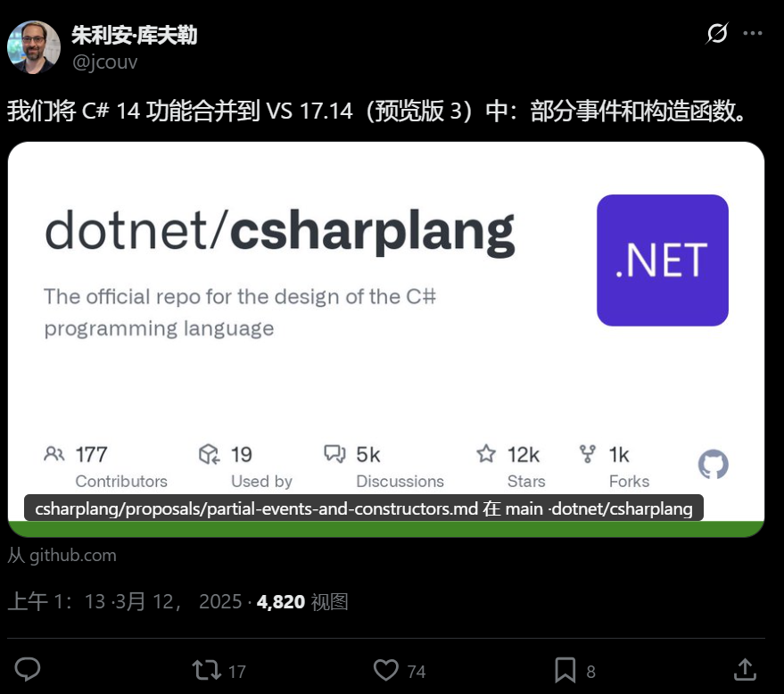
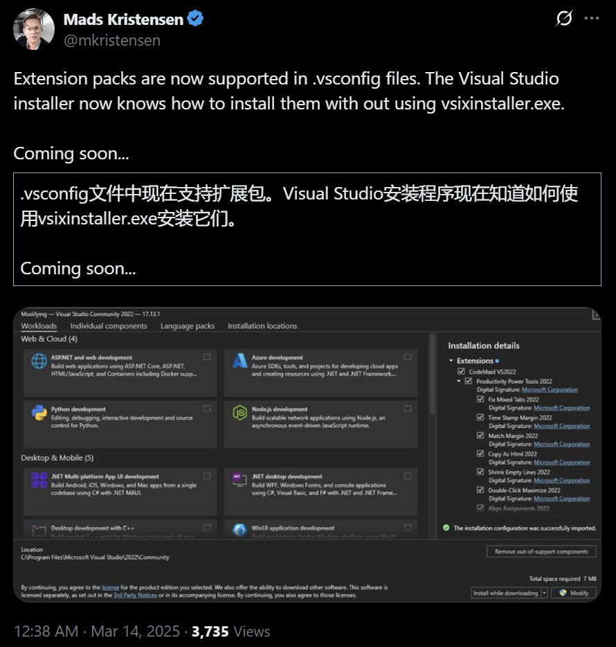
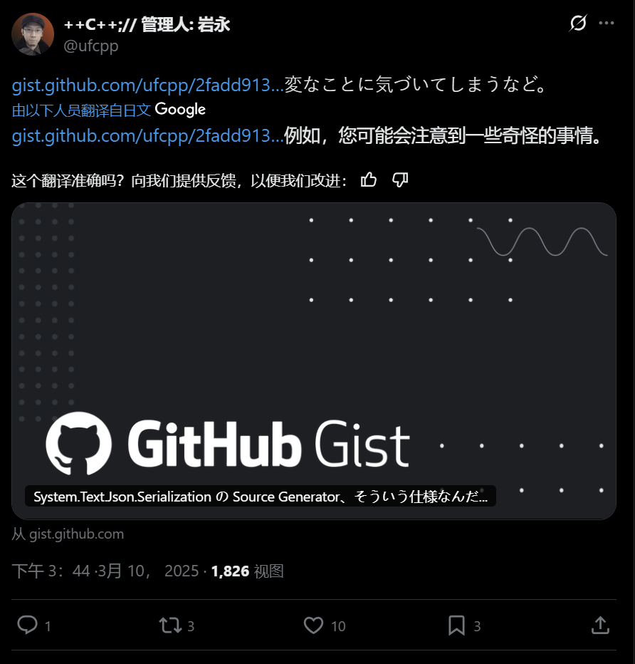

## 国内文章
### C# 中比较实用的关键字，基础高频面试题！

https://www.cnblogs.com/Can-daydayup/p/18784074

文章探讨了C#编程中的关键字，尤其是访问修饰符的种类与特性。讨论了四种主要的访问修饰符，解释了它们的可访问性及组合。此外，文章还对readonly与const的区别、virtual和override关键字的用途进行了详细分析，阐明了这些关键字在类和结构中的应用。文章内容全面，适合学习和提高C#编程能力，特别对面试有帮助。

### .NET 10 Preview 2 增强了 Blazor 和.NET MAUI

https://www.cnblogs.com/shanyou/p/18784402

.NET 团队发布了.NET 10 Preview 2，主要增强了 Blazor 和.NET MAUI。更新包括 Blazor Web App 的重新连接 UI 组件、导航改善和 OpenAPI 支持增加。在.NET MAUI 中，新增功能有 ShadowTypeConverter 和控制开关的新 OffColor 属性等。此外，还改进了移动平台的可靠性、Windows Forms 共享剪贴板功能和 WPF 性能。Entity Framework Core 10 引入了 LINQ RightJoin 操作符，提升数据访问能力。新容器镜像提高了启动速度，降低了内存使用。

### windows 稀疏文件 (sparse file) 的一个实用场景——解决 SetEndOfFile 占据磁盘空间引入的性能问题

https://www.cnblogs.com/goodcitizen/p/18778610/solving_the_performance_problem_introduced_by_SetEndOfFile_occupying_disk_space

本文探讨了Windows下稀疏文件的应用，尤其在大文件预分配时存在的性能问题。文章首先回顾了稀疏文件的定义并指出其在优化磁盘空间方面的价值。接着，作者描述了一种文件下载策略，该策略尝试预先占用磁盘空间，但在随机写入时出现较慢的写入速度。通过提供一个简单的C++代码示例，演示了在创建大文件时如何设置文件指针及处理错误。该例子突显了SetEndOfFile的局限性。整体上，文章简洁明了，揭示了稀疏文件在特定场景下的重要性，适合需要优化大文件写入的开发人员参考。

### dotnet 源代码生成器分析器入门

https://www.cnblogs.com/lindexi/p/18786647

本文介绍了C# .NET的SourceGenerator源代码生成器技术，旨在帮助读者理解和编写源代码生成器与分析器。文章首先讲解项目搭建，推荐使用Visual Studio 2022进行操作，分步骤引导读者逐步掌握基础概念。内容结构合理，先从实践开始，再讲解基础理论，降低学习门槛。作者欢迎读者提出问题和反馈，以便改进内容。文章清晰明了，适合技术初学者。

### ASP.NET Core 模型验证消息的本地化新姿势

https://www.cnblogs.com/himax/p/18785387/how_to_localize_validation_attrbuite_message

本文讨论了在MVC模型中实现模型类的验证消息本地化的问题。文章通过示例类UserDto展示了如何在验证时使用ErrorMessage，并说明了使用默认消息的缺陷。作者分析了默认消息来源于SR类，并提供了通过本地化资源文件来实现消息本地化的方法。最终，文章介绍了建立语言扩展包以支持中文资源的步骤。整个过程强调了用户体验的重要性，特别是在信息反馈方面。

### AI与.NET技术实操系列(八)：使用Catalyst进行自然语言处理

https://www.cnblogs.com/code-daily/p/18776627

本文章介绍了自然语言处理(NLP)领域的Catalyst工具，它是一个开源的.NET库，旨在简化NLP开发。Catalyst支持文本分类、实体识别等功能，集成了预训练模型和直观API，使得开发者可以轻松上手并构建应用。文章详细说明了Catalyst的安装、配置以及基本的文本处理技能，提供了具体的中文示例代码。文章突出Catalyst的优点，如无缝集成、功能全面、性能优异等，适合初学者及资深开发者使用，帮助他们在.NET环境中实现NLP应用。总体上，本文为读者提供了实用的技术指导和操作步骤。

### 使用Avalonia/C#构建一个简易的跨平台MCP客户端

https://www.cnblogs.com/mingupupu/p/18779563

本文介绍了使用Avalonia构建跨平台MCP客户端，能接入多种MCP服务器以实现AI应用。作者分享了使用GitHub上的代码，设定MCP服务器配置的方法，并指出中文显示存在问题。通过问AI查询数据，展示了数据从数据库读取的效果。文章鼓励读者尝试不同的MCP服务器，并提供了相关的学习资源和代码链接。

### .NET8中gRPC的使用

https://www.cnblogs.com/liyongqiang-cc/p/18691064

本文介绍了在现代分布式系统中使用 gRPC 框架的步骤，特别是在 .NET Core (.NET 8) 中的应用。gRPC 是一种基于 HTTP/2 的高性能开源远程过程调用框架，适合微服务和实时通信。文章详细阐述了如何创建 gRPC 服务端、编写自己的服务逻辑以及集成到 Web API 中。它包括创建 gRPC 项目、定义服务和请求参数，以及实现服务逻辑的示例代码，提供了实际可操作的指导，适合开发者参考。

### .NET Core奇技淫巧之WinForm使用Python.NET并打包

https://www.cnblogs.com/GuZhenYin/p/18781724

本文介绍了如何将Python与.NET Core中的WinForm结合，通过Python.NET库实现与Python的交互。首先，下载并配置嵌入式Python环境，确保pip能够使用。接着，通过pip安装必需的库，如pandas和openpyxl，并将其放入WinForm项目中。随后，使用NuGet安装Python.NET包，实现WinForm的加载和按钮点击事件，最后调用Python类生成相应的SQL语句。这种方法对于非技术人员在使用时非常友好。

### 工作面试必备：SQL 中的各种连接 JOIN 的区别总结！

https://www.cnblogs.com/Can-daydayup/p/18777558

本文详细讲解了SQL中的不同Join操作及其用法，包括Inner Join、Left Join、Right Join和Full Join，同时解释了On和Where子句的区别与应用。文章通过示例代码阐明了每种Join的特点，帮助初学者理解如何选择合适的连接方式，避免常见错误。使用MS SQL Server进行演示，使内容更具实用性和可操作性。整体条理清晰，适合各个水平的开发者学习和参考。

### 浅谈 C# 13 中的 params 集合

https://www.cnblogs.com/Can-daydayup/p/18780354

C# 13 版本中，params的使用从只支持数组参数扩展到支持高性能集合类型，增强了代码灵活性和效率。params适合参数数量动态变化的场景，如日志和数学计算。C# 13 之前，params仅支持一维数组，而现在可以使用任意集合类型。文中对性能进行了基准测试，比较了C# 13之前和之后的性能差异，展示了新特性如何在实际应用中提高性能。整体上，本文章内容详实，易于理解，具有较高的实用价值和技术深度。

### C#实现自己的Json解析器(LALR(1)+miniDFA)

https://www.cnblogs.com/bitzhuwei/p/18779851

本文介绍了如何使用bitParser实现一个Json解析器，利用LALR(1)语法解析器和miniDFA词法分析器。文中详细讲解了Json的文法结构，包括Object和Array的定义，以及各种数据类型的表示方法。通过提供的文法，用户可以使用bitParser快速生成对应的Json解析器代码。整篇文章结构清晰，内容实用，对有C#背景的开发者具有很高的参考价值。

### C#通过FTP获取服务端文件

https://www.cnblogs.com/magicMaQaQ/p/18329670

本文介绍如何通过FTP实现文件传输功能，尤其是在前端修改配置文件后，如何由上位机分发给所有设备。首先，搭建FTP服务，推荐使用FileZilla Server，提供了简单的安装和配置指南，包括被动模式、SSL/TLS设置和用户权限设置。其次，提供了客户端连接FTP服务器的参数和基本代码示例，用于下载指定文件。总结部分简略，未进一步展开。

### Semantic Kernel人工智能：1、从DeepSeek API调用到Semantic Kernel集成：深度解析聊天机器人开发全链路

https://www.cnblogs.com/huangmingji/p/18776994

本文讨论了在AI时代，基于大语言模型的聊天机器人开发的标准化技术链路。作者结合DeepSeek API与微软Semantic Kernel框架，展示了使用C#语言进行的完整开发流程。文章首先介绍了所需环境，包含.NET 9 SDK和Visual Studio 2022。此外，提供了DeepSeek API的基础调用和流式响应处理的代码示例，强调了API的使用和相应的编程技巧。整体内容具有实用性和技术深度，适合对AI聊天机器人开发有兴趣的开发者阅读。

### [WPF] 在RichTextBox中输出Microsoft.Extension.Logging库的日志消息

https://www.cnblogs.com/echo-sama/p/18786094

本文描述了一种将日志输出到WPF的RichTextBox中的实现方法。作者指出传统控制台输出不安全，因此提出使用RichTextBox日志处理器。实现中创建了RichTextBoxLoggerProcessor类，处理日志消息并通过后台线程向RichTextBox中添加日志。该类的构造函数接收一个RichTextBoxDocumentStorage对象，以便在FlowDocument中显示日志记录。文章详细介绍了WriteMessage、EnqueMessage和其他相关方法的实现，适合需要安全日志输出的WPF开发者。

### 一款 .NET 开源、功能强大的远程连接管理工具，支持 RDP、VNC、SSH 等多种主流协议！

https://www.cnblogs.com/Can-daydayup/p/18787819

mRemoteNG是一款基于.NET的开源远程连接管理工具，免费且功能强大，支持RDP、VNC、SSH等多种协议。它采用多标签页界面，用户可在单个窗口中管理多个连接，配置直观简便。mRemoteNG支持多种语言和Windows操作系统，适合各种用户。项目已收录到C#/.NET优秀项目中，鼓励用户关注及参与贡献，提升开发效率。

### 官方的 MCP C# SDK：csharp-sdk

https://www.cnblogs.com/shanyou/p/18787725

csharp-sdk是MCP官方提供的C# SDK，简化了MCP服务器与客户端的接口，主要由微软维护。MCP协议用于确保大模型与数据源的安全通信，使AI应用能安全访问本地或远程数据。文章提到.NET社区中mcpdotnet项目的进展与比较，强调该项目获得了更多开发者关注，并成为MCP的官方SDK。BotSharp是一个多智能体框架，专注于智能对话机器人开发，支持MCP协议，并利用csharp-sdk增强其功能。

### 【译】Visual Studio(v17.13)中新的调试和分析特性

https://www.cnblogs.com/MeteorSeed/p/18783465

最新的 Visual Studio 更新(v17.13)增强了调试和分析功能，利用 AI 提升了变量和异常分析的智能化水平。它提供了更好的多进程执行支持和异步工作流的可视化，帮助开发者快速识别问题。GitHub Copilot 功能可以智能识别错误并生成优化的 LINQ 查询，便于数据处理。新的定向检测工具增强了本机代码的性能监控，改进了异步堆栈的显示，使调试更加直观。更新还对 CPU 使用率进行了多进程分析，优化了资源使用的可视化，从而提升了调试效率和准确性。

### halcon 入门教程(一) 预处理图像 (图像平滑，图像增强，二值化，形态学分析)

https://www.cnblogs.com/DOMLX/p/18779326

本文介绍了HALCON机器视觉软件的基本知识和学习路线，适合初学者。作者建议阅读官方实例，其中Blob分析是重点内容，涉及预处理、二值化、连通区域标记及特征提取等步骤。通过对图像的有效处理，用户可以更好地进行图像识别和缺陷检测。文章还简要讲解了均值滤波的原理和应用，强调了图像预处理的重要性，以提高后续任务的效果。

### 用状态模式开发一个基于WPF的截图功能

https://www.cnblogs.com/caoruipeng/p/18777683

状态模式是一种行为设计模式，常用于游戏开发。它将状态行为封装在独立状态类中，使状态转换更加清晰。状态模式包括上下文、状态接口和具体状态类，避免在对象中使用复杂的条件语句。通过示例代码，展示了如何用C#实现玩家状态切换，如默认、前进、后退、射击和死亡状态。每个状态类实现了状态接口，处理不同的玩家行为。上下文类负责存储和切换玩家当前状态，使结构更加清晰，易于管理。

### AI与.NET技术实操系列(七)：使用Emgu CV进行计算机视觉操作

https://www.cnblogs.com/code-daily/p/18776624

本文介绍了计算机视觉的重要性以及Emgu CV作为OpenCV的.NET包装器如何帮助.NET开发者实现计算机视觉任务。Emgu CV简化了开发者的学习曲线，支持多种平台，并提供丰富的API和文档。文章详细说明了Emgu CV的安装与配置，包括通过NuGet管理器安装和DLL文件的运行时要求。此外，文章提及了图像处理的基础知识。这些内容为开发者提供了实用指导，使他们能够快速上手计算机视觉应用。

### 针对于基于surging的dotnetty组件内存泄漏问题

https://www.cnblogs.com/fanliang11/p/18786023

文章介绍了一个客户遇到的基于Surging的内存泄漏问题，作者通过调整DotNetty的环境变量优化配置，解决了内存泄漏的问题。具体措施包括设置Allocator的参数以及确保ByteBuf在同一线程下处理。通过使用Skywalking监控内存性能，作者最终确认未出现Chunk的16MB内存泄漏。此外，文章提到将来会在木舟物联网平台接入MQTT。整体上，技术细节丰富，实践性强，结构清晰。

### 【Azure Fabric Service】演示使用PowerShell命令部署SF应用程序(.NET)

https://www.cnblogs.com/lulight/p/18778636

本文介绍了如何在中国区微软云Azure上使用Service Fabric进行.NET应用的发布。由于无法通过Visual Studio直接发布，作者提供了PowerShell命令的详细步骤。文中包括了脚本示例，显示如何连接到Service Fabric托管集群、获取证书指纹、复制应用程序包以及创建应用实例。整个过程通过图文并茂的方式逐步展示，便于读者理解和操作。

### 【Esp32】为 idf 定制本地 Arduino 组件

https://www.cnblogs.com/tcjiaan/p/18787782

文章讨论了Arduino和ESP32在嵌入式开发中的应用及其优缺点。作者指出Arduino不仅是一种开发板，而且是一种统一的规范，降低了开发成本。相比之下，乐鑫的ESP32通过共享结构优化了开发流程，使用IDF库简化了组件管理。文章还提到使用VS Code插件可实现组件的自动下载，但存在重复文件和API兼容性问题。整体观点强调了嵌入式开发在物联网时代应关注应用开发和统一化的重要性。作者以幽默的方式提到一些发音错误，增加了阅读趣味性。

## 主题

### .NET 和 .NET Framework 2025 年 3 月服务发布更新 - .NET 博客
https://devblogs.microsoft.com/dotnet/dotnet-and-dotnet-framework-march-2025-servicing-updates/

### 新的、更简单的解决方案文件格式 - Visual Studio 博客
https://devblogs.microsoft.com/visualstudio/new-simpler-solution-file-format/

### 引入对 SLNX 的支持，SLNX 是 .NET CLI 中一种新的、更简单的解决方案文件格式 - .NET 博客
https://devblogs.microsoft.com/dotnet/introducing-slnx-support-dotnet-cli/

### TypeScript 速度提高 10 倍 - TypeScript
https://devblogs.microsoft.com/typescript/typescript-native-port/

- [Anders Hejlsberg 回答 - 为什么去？ ·microsoft/typescript-go · 讨论 #411](https://github.com/microsoft/typescript-go/discussions/411#discussioncomment-12476218)

### 解锁对 Cloud Academy 的免费访问：Visual Studio 订阅者的新好处 - Visual Studio 博客
https://devblogs.microsoft.com/visualstudio/cloud-academy-visual-studio-subscription-benefit/

### MongoDB EF Core Provider 现在支持 EF 9！
https://medium.com/@MongoDB/mongodb-ef-core-provider-now-supports-ef-9-62db9b89ce0d

### GPT-4o Copilot 代码完成模型现已在 Visual Studio 公共预览版中提供 - Visual Studio 博客
https://devblogs.microsoft.com/visualstudio/gpt-4o-copilot-code-completion-model-available-now-in-visual-studio-public-preview/

## 发布
- [aws/aws-sdk-net](https://github.com/aws/aws-sdk-net)
    - [3.7.1000.0](https://github.com/aws/aws-sdk-net/releases/tag/3.7.1000.0)、[3.7.1001.0](https://github.com/aws/aws-sdk-net/releases/tag/3.7.1001.0)、[3.7.1002. 0](https://github.com/aws/aws-sdk-net/releases/tag/3.7.1002.0)， [3.7.999.0](https://github.com/aws/aws-sdk-net/releases/tag/3.7.999.0)
- [Azure/azure-sdk-for-net](https://github.com/Azure/azure-sdk-for-net)
    - [Azure.Data.AppConfiguration_1.6.0](https://github.com/Azure/azure-sdk-for-net/releases/tag/Azure.Data.AppConfiguration_1.6.0)， [ Azure.ResourceManager.AlertsManagement_1.1.1](https://github.com/Azure/azure-sdk-for-net/releases/tag/Azure.ResourceManager.AlertsManagement_1.1.1)、[ Azure.ResourceManager.Analysis_1.1.1](https://github.com/Azure/azure-sdk-for-net/releases/tag/Azure.ResourceManager.Analysis_1.1.1)、[ Azure.ResourceManager.AppComplianceAutomation_1.0.1](https://github.com/Azure/azure-sdk-for-net/releases/tag/Azure.ResourceManager.AppComplianceAutomation_1.0.1)、[ Azure.ResourceManager.ApplicationInsights_1.0.1](https://github.com/Azure/azure-sdk-for-net/releases/tag/Azure.ResourceManager.ApplicationInsights_1.0.1)、[ Azure.ResourceManager.AppPlatform_1.1.2](https://github.com/Azure/azure-sdk-for-net/releases/tag/Azure.ResourceManager.AppPlatform_1.1.2)、[ Azure.ResourceManager.Automanage_1.1.1](https://github.com/Azure/azure-sdk-for-net/releases/tag/Azure.ResourceManager.Automanage_1.1.1)、[ Azure.ResourceManager.Automation_1.1.1](https://github.com/Azure/azure-sdk-for-net/releases/tag/Azure.ResourceManager.Automation_1.1.1)、[Azure.ResourceManager.Billing_ 1.2.1](https://github.com/Azure/azure-sdk-for-net/releases/tag/Azure.ResourceManager.Billing_1.2.1) [Azure.ResourceManager.BotService_1.1.1](https://github.com/Azure/azure-sdk-for-net/releases/tag/Azure.ResourceManager.BotService_1.1.1)，[Azure.ResourceManager.Cdn_1.3. 1](https://github.com/Azure/azure-sdk-for-net/releases/tag/Azure.ResourceManager.Cdn_1.3.1)，[Azure.ResourceManager.ChangeAnalysis_1.1. 1](https://github.com/Azure/azure-sdk-for-net/releases/tag/Azure.ResourceManager.ChangeAnalysis_1.1.1)，[Azure.ResourceManager.Communication_1.2. 1](https://github.com/Azure/azure-sdk-for-net/releases/tag/Azure.ResourceManager.Communication_1.2.1)，[Azure.ResourceManager.Confluent_1.2. 1](https://github.com/Azure/azure-sdk-for-net/releases/tag/Azure.ResourceManager.Confluent_1.2.1)，[Azure.ResourceManager.CostManagement_1.0. 2](https://github.com/Azure/azure-sdk-for-net/releases/tag/Azure.ResourceManager.CostManagement_1.0.2)， [Azure.ResourceManager.DataBox_1.0. 4](https://github.com/Azure/azure-sdk-for-net/releases/tag/Azure.ResourceManager.DataBox_1.0.4)，[Azure.ResourceManager.DataBoxEdge_1.1. 1](https://github.com/Azure/azure-sdk-for-net/releases/tag/Azure.ResourceManager.DataBoxEdge_1.1.1)，[Azure.ResourceManager.DataFactory_1.7. 0](https://github.com/Azure/azure-sdk-for-net/releases/tag/Azure.ResourceManager.DataFactory_1.7.0)， [Azure.ResourceManager.DataLakeAnalytics_1.1. 1](https://github.com/Azure/azure-sdk-for-net/releases/tag/Azure.ResourceManager.DataLakeAnalytics_1.1.1)，[Azure.ResourceManager.DataLakeStore_1.1. 1](https://github.com/Azure/azure-sdk-for-net/releases/tag/Azure.ResourceManager.DataLakeStore_1.1.1)，[Azure.ResourceManager.DataShare_1.1. 1](https://github.com/Azure/azure-sdk-for-net/releases/tag/Azure.ResourceManager.DataShare_1.1.1)，[Azure.ResourceManager.DesktopVirtualization_1.3. 1](https://github.com/Azure/azure-sdk-for-net/releases/tag/Azure.ResourceManager.DesktopVirtualization_1.3.1)，[Azure.ResourceManager.DeviceProvisioningServices_1.2. 1](https://github.com/Azure/azure-sdk-for-net/releases/tag/Azure.ResourceManager.DeviceProvisioningServices_1.2.1)，[Azure.ResourceManager.FrontDoor_1.3. 1](https://github.com/Azure/azure-sdk-for-net/releases/tag/Azure.ResourceManager.FrontDoor_1.3.1)，[Azure.ResourceManager.Hci_1.2. 1](https://github.com/Azure/azure-sdk-for-net/releases/tag/Azure.ResourceManager.Hci_1.2.1)，[Azure.ResourceManager.Resources_1.9. 1](https://github.com/Azure/azure-sdk-for-net/releases/tag/Azure.ResourceManager.Resources_1.9.1)， [Azure.ResourceManager.Sphere_1.0. 1](https://github.com/Azure/azure-sdk-for-net/releases/tag/Azure.ResourceManager.Sphere_1.0.1)，[Azure.ResourceManager.StorageCache_1.3. 1](https://github.com/Azure/azure-sdk-for-net/releases/tag/Azure.ResourceManager.StorageCache_1.3.1)，[Azure.ResourceManager.StorageMover_1.2. 1](https://github.com/Azure/azure-sdk-for-net/releases/tag/Azure.ResourceManager.StorageMover_1.2.1)，[Azure.ResourceManager.Support_1.1. 1](https://github.com/Azure/azure-sdk-for-net/releases/tag/Azure.ResourceManager.Support_1.1.1)，[Azure.ResourceManager.TrafficManager_1.1. 3](https://github.com/Azure/azure-sdk-for-net/releases/tag/Azure.ResourceManager.TrafficManager_1.1.3) [Azure.Storage.Blobs_12.24.0](https://github.com/Azure/azure-sdk-for-net/releases/tag/Azure.Storage.Blobs_12.24.0)，[Azure.Storage.Blobs.Batch_12.21. 0](https://github.com/Azure/azure-sdk-for-net/releases/tag/Azure.Storage.Blobs.Batch_12.21.0)， [Azure.Storage.Common_12.23. 0](https://github.com/Azure/azure-sdk-for-net/releases/tag/Azure.Storage.Common_12.23.0)， [Azure.Storage.Files.DataLake_12.22. 0](https://github.com/Azure/azure-sdk-for-net/releases/tag/Azure.Storage.Files.DataLake_12.22.0)， [Azure.Storage.Files.Shares_12.22. 0](https://github.com/Azure/azure-sdk-for-net/releases/tag/Azure.Storage.Files.Shares_12.22.0)， [Azure.Storage.Queues_12.22. 0](https://github.com/Azure/azure-sdk-for-net/releases/tag/Azure.Storage.Queues_12.22.0)， [Microsoft.Azure.WebJobs.Extensions.EventGrid_3.4. 4](https://github.com/Azure/azure-sdk-for-net/releases/tag/Microsoft.Azure.WebJobs.Extensions.EventGrid_3.4.4)， [Microsoft.Azure.WebJobs.Extensions.ServiceBus_5.16. 5](https://github.com/Azure/azure-sdk-for-net/releases/tag/Microsoft.Azure.WebJobs.Extensions.ServiceBus_5.16.5)， [Microsoft.Azure.WebJobs.Extensions.SignalRService_ 2.0.1](https://github.com/Azure/azure-sdk-for-net/releases/tag/Microsoft.Azure.WebJobs.Extensions.SignalRService_2.0.1)， [Microsoft.Azure.WebJobs.Extensions.Tables_1.3. 3](https://github.com/Azure/azure-sdk-for-net/releases/tag/Microsoft.Azure.WebJobs.Extensions.Tables_1.3.3)， [Microsoft.Extensions.Azure_1.11. 0](https://github.com/Azure/azure-sdk-for-net/releases/tag/Microsoft.Extensions.Azure_1.11.0)
- [DataDog/dd-trace-dotnet](https://github.com/DataDog/dd-trace-dotnet)
    - [v3.12.0](https://github.com/DataDog/dd-trace-dotnet/releases/tag/v3.12.0)
- [googleapis/google-cloud-dotnet](https://github.com/googleapis/google-cloud-dotnet)
    - [Google.Cloud.AIPlatform.V1-3.22.0](https://github.com/googleapis/google-cloud-dotnet/releases/tag/Google.Cloud.AIPlatform.V1-3.22.0)，[Google.Cloud.Audit-2.5. 0](https://github.com/googleapis/google-cloud-dotnet/releases/tag/Google.Cloud.Audit-2.5.0)，[Google.Cloud.Bigtable.Admin.V2-3.24. 0](https://github.com/googleapis/google-cloud-dotnet/releases/tag/Google.Cloud.Bigtable.Admin.V2-3.24.0)，[Google.Cloud.Bigtable.V2-3.16. 0](https://github.com/googleapis/google-cloud-dotnet/releases/tag/Google.Cloud.Bigtable.V2-3.16.0)、[Google.Cloud.Datastore.V1-4.15. 0](https://github.com/googleapis/google-cloud-dotnet/releases/tag/Google.Cloud.Datastore.V1-4.15.0)， [Google.Cloud.Dialogflow.Cx.V3-2.23. 0](https://github.com/googleapis/google-cloud-dotnet/releases/tag/Google.Cloud.Dialogflow.Cx.V3-2.23.0)， [Google.Cloud.Dialogflow.V2-4.26. 0](https://github.com/googleapis/google-cloud-dotnet/releases/tag/Google.Cloud.Dialogflow.V2-4.26.0)，[Google.Cloud.Filestore.V1-2.7. 0](https://github.com/googleapis/google-cloud-dotnet/releases/tag/Google.Cloud.Filestore.V1-2.7.0)、[Google.Cloud.Firestore-3.10. 0](https://github.com/googleapis/google-cloud-dotnet/releases/tag/Google.Cloud.Firestore-3.10.0)，[Google.Cloud.Firestore.V1-3.10. 0](https://github.com/googleapis/google-cloud-dotnet/releases/tag/Google.Cloud.Firestore.V1-3.10.0) [Google.Cloud.PubSub.V1-3.22.0](https://github.com/googleapis/google-cloud-dotnet/releases/tag/Google.Cloud.PubSub.V1-3.22.0)，[Google.Cloud.PubSub.V1-3.23. 0](https://github.com/googleapis/google-cloud-dotnet/releases/tag/Google.Cloud.PubSub.V1-3.23.0)，[Google.Cloud.Storage.V1-4.11. 0](https://github.com/googleapis/google-cloud-dotnet/releases/tag/Google.Cloud.Storage.V1-4.11.0)
- [grpc/grpc-dotnet](https://github.com/grpc/grpc-dotnet)
    - [v2.70.0](https://github.com/grpc/grpc-dotnet/releases/tag/v2.70.0)
- [microsoft/microsoft-ui-xaml](https://github.com/microsoft/microsoft-ui-xaml)
    - [winui3](https://github.com/microsoft/microsoft-ui-xaml/releases/tag/winui3/release/1.6.6)
- [microsoft/WindowsAppSDK](https://github.com/microsoft/WindowsAppSDK)
    - [v1.6.6](https://github.com/microsoft/WindowsAppSDK/releases/tag/v1.6.6)

## 文章、幻灯片等
### System.Linq.Async 是 .NET 10 的一部分 - LINQ for IAsyncEnumerable
https://steven-giesel.com/blogPost/e40aaedc-9e56-491f-9fe5-3bb0b162ae94

### JetBrains Rider 中对游戏机的支持 | .NET 工具博客
https://blog.jetbrains.com/dotnet/2025/03/14/support-for-game-consoles-in-jetbrains-rider/

### DevProxy 0.25 改进了配置管理，加入了 .NET Foundation
https://www.infoq.com/news/2025/03/devproxy-025-net-foundation/

### 如何使用 Notion 构建无头 CMS
https://zenn.dev/rendya/articles/notion-headless-cms-sample

### 【. NET8] 使用 MagicOnion 设置 API 服务器 - Qiita
https://qiita.com/inco-cyber/items/3253235a0a9d5fda2b1e

- [将 gRPC-Web 与 MagicOnion 结合使用 - Qiita](https://qiita.com/inco-cyber/items/74715318a7f40d819d64)

### 如何在 C# 中将 EventWaitHandle wait 转换为 Task 来解决混合问题(简单地在 Task 中等待会导致问题) - Qiita
https://qiita.com/spc_ksudoh/items/bff67ca86c878b106c92

### [C#] 使用 JsonExtensionData 处理动态属性
https://zenn.dev/shimiyu/articles/c89058684563d2

### 使用 DuckDB 读取 Excel 文件 - C#
https://zenn.dev/gkuroki/articles/dotnet-duckdb-excel-read

### [Discord] DSharpPlus - 琪塔
https://qiita.com/wrsmA/items/00b2b8ee085ac08761a4

### 比较字符串和数字 (.NET 10) - Qiita
https://qiita.com/h084/items/9ece2dfd6bb5bafaadb1

### 在 Windows 容器中的 IIS 中运行 ASP.NET Core 应用程序
https://andrewlock.net/running-an-aspnetcore-app-behind-iis-in-a-windows-container/

### 使用 EF Core 中的序列对 Id 以外的列进行自动编号 - Qiita
https://qiita.com/jun1s/items/0090dd0c4f56e63bd6a0

### 关于分发和更新 WPF 的_InnoSetup和 AutoUpdater.NET - Qiita
https://qiita.com/msms/items/223c30212d3458958001

### 更理解多线程调试 - Visual Studio Blog
https://devblogs.microsoft.com/visualstudio/make-more-sense-of-multithreaded-debugging/

### 你好 HybridCache！ 简化 ASP.NET Core 应用程序的缓存管理 - .NET 博客
https://devblogs.microsoft.com/dotnet/hybrid-cache-is-now-ga/

### [C#] 使用 UnsafeAccessor 属性的代码在运行时抛出 BadImageFormatException 异常
https://zenn.dev/j_sakamoto/articles/55676560cef8b2

### 用 C# 编写 .NET 垃圾回收器 - 第 5 部分
https://minidump.net/writing-a-net-gc-in-c-part-5/

### [C#] 关于集合表达式
https://zenn.dev/nuskey/articles/19b3c75b806dad
### 使用 AWS 开发工具包。 如果使用 Extensions.NETCore.Setup 3.7.x 进行初始化速度较慢，请使用 3.7.1 或为 DefaultsMode 指定 Standard。 - 奇塔
https://qiita.com/karuakun/items/cf7c334ec8156e4bfd63

### C# 14 中的新增功能
https://zenn.dev/ya46/articles/6fe156619d87b0

### [.NET 10 Preview 1] 看来 foreach 通过接口的性能会有所提升
https://zenn.dev/ya46/articles/bca4fa5e5ceca5

### Kyoto.cs #1 (2025/04/06 15：00〜)
https://kyotocs.connpass.com/event/348616/

## 库、存储库、工具等
### Cysharp/ZLinq：所有 .NET 平台和 Unity 的 Span 和 LINQ to SIMD 的零分配 LINQ、LINQ to Tree(FileSystem、Json、GameObject 等)。
https://github.com/Cysharp/ZLinq

### 推特
https://x.com/jcouv/status/1899508932068176238

---

https://x.com/mkristensen/status/1900224976332218558

---

https://x.com/ufcpp/status/1899003528817049647

---

## C# .NET 交流群

相信大家在开发中经常会遇到一些性能问题，苦于没有有效的工具去发现性能瓶颈，或者是发现瓶颈以后不知道该如何优化。之前一直有读者朋友询问有没有技术交流群，但是由于各种原因一直都没创建，现在很高兴的在这里宣布，我创建了一个专门交流.NET性能优化经验的群组，主题包括但不限于：

* 如何找到.NET性能瓶颈，如使用APM、dotnet tools等工具
* .NET框架底层原理的实现，如垃圾回收器、JIT等等
* 如何编写高性能的.NET代码，哪些地方存在性能陷阱

希望能有更多志同道合朋友加入，分享一些工作中遇到的.NET问题和宝贵的分析优化经验。**目前一群已满，现在开放二群。**可以加我vx，我拉你进群: **ls1075** 另外也创建了**QQ Group**: 687779078，欢迎大家加入。