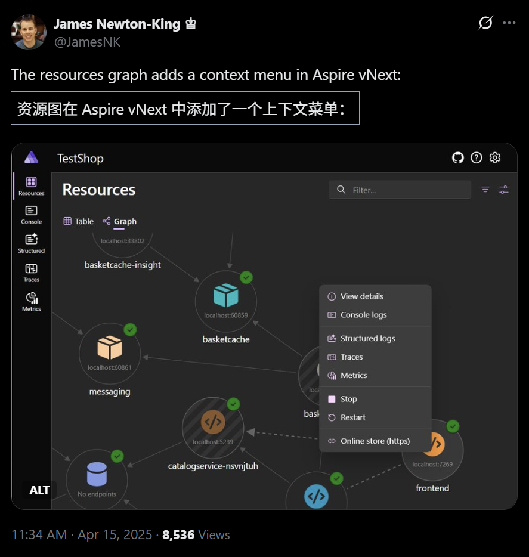

## 国内文章
### 用 .NET NativeAOT 构建完全 distroless 的静态链接应用

https://www.cnblogs.com/hez2010/p/18813775/dotnet-nativeaot-distroless-statically-linked-app

这篇文章详细介绍了.NET NativeAOT和Direct P/Invoke的概念。它阐述了如何通过简单的命令将.NET程序编译为原生机器代码，以及如何使用P/Invoke调用原生库。文章指出，尽管NativeAOT中的P/Invoke调用方式与非NativeAOT没有区别，但通过Direct P/Invoke，可以在编译时处理函数绑定，从而实现更好的性能和静态链接。作者提供了示例代码，演示如何在项目文件中配置Direct P/Invoke，并讨论了其优点。整体上，文章适合开发者了解.NET的NativeAOT技术及其应用。

### .NET 阻止关机机制以及关机前执行业务

https://www.cnblogs.com/kybs0/p/18822799

本文介绍了如何在Windows关机时阻止系统关机并执行必要的业务逻辑。文章指出，Windows默认给予应用几秒钟的关闭时间，但在某些情况下，需要更长的时间以确保数据一致性。作者提供了通过Windows消息Hook的方法，其中使用了WM_QUERYENDSESSION和WM_ENDSESSION消息。代码示例展示了如何在应用加载时设置Hook，并在关机请求时执行业务逻辑。最后，文章提到相关Win32 API函数，以便在关机请求时提供阻止或允许关机的选择。

### .NET 平台上的开源模型训练与推理进展

https://www.cnblogs.com/whuanle/p/18817790

.NET平台近年来在人工智能和机器学习领域不断发展，形成了支持模型训练、推理和部署的生态系统。本文介绍了多个面向.NET开发者的机器学习库和深度学习框架，如MathNet.Numerics和ML.NET等，强调了它们的成熟性和社区支持。此外，ONNX Runtime等推理工具为提高工作效率提供了帮助。此外，文中还提到了一些AI SDK和框架，展示了.NET在AI应用开发中的潜力。

### 1.net core 工作流WorkFlow流程(介绍)

https://www.cnblogs.com/wikeflow/p/18815475

WikeFlow2.0是一个自研发的流程引擎，旨在解决现有第三方流程引擎不满足用户需求的问题。它灵活小巧，支持多行业流程审批和高可扩展性。核心团队具有丰富的经验，产品基于实际项目反馈不断改进。WikeFlow2.0提供支持.Net Framework和.Net Core的版本，未来可能支持Java。主要功能涵盖流程审批、会签、撤回和数据权限设置等。系统支持多数据库，通过简单修改配置可实现轻松切换。它易于集成，并为用户提供详细的集成指导。

### 记一次 .NET某云HIS系统 CPU爆高分析

https://www.cnblogs.com/huangxincheng/p/18820365

本文讨论了系统CPU异常高负载的问题。作者通过数据分析确认CPU利用率并探讨了可能的原因。使用命令观察线程情况，发现部分线程在进行垃圾回收，作者推测这可能导致CPU负载上升。与此同时，分析的调用栈揭示出与CSRedis相关的多个操作，观测到多个方法调用可能引起的性能问题。整体分析过程严谨，结合了数据和具体实例，具有一定的实用价值。

### Avalonia跨平台实战(二)，Avalonia相比WPF的便利合集(一)

https://www.cnblogs.com/OrdinaryLT/p/18823154

文章讨论了Avalonia相较于WPF的一些优势特性。布局方面基本相同，但Avalonia能在调试模式下显示XML结构树。Margin的处理也更便捷，新增Spacing特性简化了子元素间距的设置。文章介绍了使用Style来添加样式的便捷性，采用CSS选择器使得样式定义更灵活。Avalonia还提供了Watermark和MaskedTextBox控件，简化了输入提示和格式化输入的实现。此外，Grid的RowDefinitions和ColumnDefinitions定义更加简化，提高了开发效率。总体上，Avalonia在多个方面为开发者提供了更方便的工具和特性。

### 在IM即时通讯系统中接入DeepSeek等AI大模型

https://www.cnblogs.com/zhuweisky/p/18817793

随着AI大模型的普及，傲瑞通(OrayTalk)成功集成了DeepSeek，以提升企业沟通效率。文章详细描述了客户端与服务器的实现过程。客户端新增了与AI对话的功能和历史记录查询功能。数据库中增加了AIChatRecord表，用于存储对话记录，包括提问、答案和处理结果等字段。服务器端则通过C#与DeepSeek API对接，实现了消息发送的功能，简化了请求流程。整体架构提升了企业内部沟通的智能化与便捷性。

### WPF旋转板栈设计一例

https://www.cnblogs.com/keepee/p/18820895

该项目展示了一个机台的平面视图设计。用户点击料盒会弹出对应的料管列表。使用WPF实现，XAML代码定义了用户控件的结构，包括数据绑定和视觉元素。代码示例展示了如何设置用户控件的宽高，以及在界面中展示圆形元素和绑定的料管数据。此设计能提升用户体验，方便操作和查看料盒信息。

### (原创).Net Framework 4.5 SimpleMVVM(极简MVVM框架)更新 v1.1，增加NuGet包

https://www.cnblogs.com/lesliexin/p/18814989

本文介绍了作者将WPF MVVM相关功能开源的过程，强调该技术虽然陈旧，但简洁易用。作者计划将其放到NuGet上，以供大家使用。代码经过多年优化整理而成，并非原创。针对小项目，提供了基本的ViewModelBase、RelayCommand和Messenger功能，但对于大项目，建议使用更强大的框架如Prism。文章还附上了开源地址和开源协议，鼓励读者反馈意见。

### 由 MCP 官方推出的 C# SDK，使 .NET 应用程序、服务和库能够快速实现与 MCP 客户端和服务器交互！

https://www.cnblogs.com/Can-daydayup/p/18811795

本文介绍了MCP C# SDK，这是由MCP官方推出的C#软件开发工具包，旨在帮助.NET应用程序、服务和库与MCP客户端和服务器进行快速交互。MCP，即模型上下文协议，提供一种标准化的方式，为大型语言模型(LLMs)提供上下文信息。该协议具有良好的扩展性，支持多种传输类型，确保不同服务之间的兼容性。文章还提供了MCP的源代码和安装指南，鼓励开发者参与和支持开源项目。

### C# 多项目打包时如何将项目引用转为包依赖

https://www.cnblogs.com/cnsharp/p/18819771

该文介绍了在C# .NET项目中实现Core库依赖的解决方案。作者首先阐述了项目结构，接着详细说明了三种打包过程中自动添加Core包依赖的方法。第一种方法尝试将项目引用转为NuGet依赖，最终未成功。第二种方法通过条件引用分别在开发和打包环境中使用不同引用，操作成功。第三种方法是指定自定义的.nuspec文件，通过传统的方式管理包依赖。文章提供了实用技巧，适合开发者参考。

### 一款让 Everything 更加如虎添翼的 .NET 开源辅助工具！

https://www.cnblogs.com/Can-daydayup/p/18820412

EverythingToolbar 是一款基于 .NET 的开源工具，旨在提升 Windows 文件搜索体验。它将 Everything 功能集成到任务栏，提供更快、更准确的文件查找。工具支持 Windows 10 和 11，具有无缝集成、高效搜索、自定义过滤器等特点。用户可以通过简单界面快速上手，实现个性化需求。此外，EverythingToolbar 支持与其他工具联动，提升任务栏功能，项目源代码已在 GitHub 上开源。该工具在 C#/.NET 领域受到重视，适合开发者使用。

### 使用 StreamJsonRpc 在 ASP.NET Core 中启用 JSON-RPC

https://www.cnblogs.com/shanyou/p/18822452

StreamJsonRpc是微软开发的开源库，支持在.NET平台上实现JSON-RPC 2.0规范的远程过程调用。它利用流实现高效的通信，适合轻量级需求。核心特性包括基于流的通信、双向互动、强类型支持和异步模型。该库兼容多种平台，提供自定义消息格式等扩展选项。本文还详细介绍了如何在ASP.NET Core中集成StreamJsonRpc，包括服务端设置和客户端调用，演示了双向方法调用的高级用法。这使得开发者能够轻松实现高效的RPC通信。

### 『Plotly实战指南』--面积图绘制与应用

https://www.cnblogs.com/wang_yb/p/18822959

面积图是一种有效的数据可视化工具，能够展示数据总量、趋势和类别对比。本文介绍了如何使用Plotly绘制普通和堆叠面积图。普通面积图用于展示单一数据序列的趋势；堆叠面积图则展示多序列的部分与整体关系。文章还比较了两种图表的特点，包括数据关系、填充模式和适用场景。面积图在分析时间序列数据时具特殊优势，能帮助识别趋势和季节性模式。选择合适的图表类型至关重要，确保图表的可读性。

### 在Winform开发框架支持多种数据库基础上，增加对国产数据库人大金仓的支持

https://www.cnblogs.com/wuhuacong/p/18818711

这篇文章讨论了如何在Winform开发框架中支持多种数据库接入。文章强调，现代应用系统可能需要同时处理多种数据库，以提高适应性和扩展性。Winform框架内置多数据库支持，并基于微软企业库的设计，可以通过配置项快速切换数据库，而不需修改代码。文章详细介绍了数据库处理层的分层结构和连接字符串的配置，包括SqlServer、Mysql、Oracle等多个数据库的支持。生动的实例展示了如何设计数据访问层，以便实现统一的编程模型和灵活的数据库处理。

### C# 工业视觉开发必刷20道 Halcon 面试题

https://www.cnblogs.com/1312mn/p/18755838

随着工业4.0的推进，对C#和Halcon专业人才需求增加。本文整理了20道Halcon面试题，涵盖基础知识、图像处理和机器视觉等方面，帮助读者掌握Halcon核心技能。题目涉及图像配准、Region与Image区别、ReduceDomain函数、面积计算、边缘提取、灰度变换、FindNccModel函数及深度学习应用。这些内容结合实际场景，旨在提高读者的面试准备和实际应用能力。

### 课程上线：面向 AI 编程 | Semantic Kernel 从入门到精通

https://www.cnblogs.com/sheng-jie/p/18816337

本课程旨在帮助.NET开发者掌握AI编程技能，特别是Semantic Kernel技术。课程总计50课时，已发布44课时，将继续更新。课程内容涵盖基础知识、进阶技术和实战案例，强调实践与应用。学习者无需深究AI理论，能通过交互式Polyglot Notebook轻松上手。课程提供核心技能培训，如Prompt工程和AI插件开发，助力开发者在AI时代立足。课程还免费赠送Azure OpenAI API Key，确保资源的有效利用。

### 最新DeepSeek-V3驱动的MCP与SemanticKernel实战教程 - 打造智能应用的终极指南

https://www.cnblogs.com/token-ai/p/18815070

MCP(Model Context Protocol)是一个开放协议，旨在促进LLM应用与外部数据源和工具的无缝集成。它提升了模型的能力，保障数据隐私，支持工具整合，减低错误内容生成的风险，并提供标准化接口。MCP与Function Calling的区别在于它是一种更广泛的协议，处理复杂上下文，且适用于多种场景。文章详细介绍了MCP的功能、应用和创建MCPClient的步骤，包括API密钥的获取和相关包的依赖安装。该教程旨在指导开发者扩展LLM的使用。

### .NET 原生驾驭 AI 新基建实战系列(二)：Semantic Kernel 整合对向量数据库的统一支持

https://www.cnblogs.com/code-daily/p/18814133

这篇文章介绍了向量数据库在AI应用中的重要性，强调了Semantic Kernel在.NET生态系统中的应用。Semantic Kernel是一个开源SDK，支持多种编程语言，简化AI开发过程。文章详细解释了Semantic Kernel的核心组件，包括内核、插件和AI服务，并展示了其如何管理与向量数据库的连接。该工具通过模块化设计提高了代码的可维护性，增强了开发者的灵活性和效率。文章内容深入且实际，适合开发者理解和应用。

### 经过几天的努力Biwen.AutoClassGen终于实现了DTO复杂属性的生成

https://www.cnblogs.com/vipwan/p/18815596

本文介绍了一种生成DTO的方法，支持复杂的二级属性嵌套和特性继承。作者通过示例展示了如何应用特性如[Required]和[Range]，并强调了其对OpenApi文档的帮助。文中包括了主实体、嵌套实体和集合项的定义，详尽说明了如何处理复杂的属性结构。整体内容简洁明了，具备一定的实用性，适用于需要高效生成DTO的开发场景。

### Aspnet Core 10 Preview3已对最小API提供参数验证支持

https://www.cnblogs.com/vipwan/p/18820391

本文介绍了.NET 10 Preview 3中Minimal API对请求参数内置验证支持的新增功能。虽然以前需要手动实现EndpointFilter进行验证，但现在通过配置验证服务和源生成器，可以自动进行属性验证，简化开发流程。示例展示了如何定义API及其验证机制，包括如何处理验证失败和自定义验证特性。文章强调了这一功能对提高代码安全性和可维护性的意义，并期待正式版的发布。整体内容清晰，实用性强，适合开发者参考。

### 使用 StreamJsonRpc 在 ASP.NET Core 中启用 JSON-RPC

https://www.cnblogs.com/shanyou/p/18822452

StreamJsonRpc 是微软的开源库，基于 JSON-RPC 2.0 规范，实现 .NET 平台的远程过程调用。它支持通过流实现高效通信，尤其适合轻量级场景。核心特性包含支持流通信、双向通信、强类型、异步模型和跨平台兼容。可与 ASP.NET Core 集成，利用 WebSocket 实现 RPC 通信。步骤包括在服务端添加 NuGet 包、定义 RPC 接口、实现服务、配置中间件以及客户端实现。它支持客户端和服务端双向方法调用，增强了交互功能。

### MQTT消息传递过程中，序列化协议如何选择？文本序列化还是二进制序列化协议。

https://www.cnblogs.com/caoruipeng/p/18813785

本文介绍了字符串消息的序列化，讨论了MQTTnet框架中的消息发送过程。MQTT协议基于TCP，字符串通过Encoding.UTF8.GetBytes方法转换为字节数组进行传输。文本序列化和二进制序列化的优缺点被一一列出，文本格式容易阅读但性能较低，而二进制格式效率高但可读性差。最终推荐使用MessagePack进行高效的二进制序列化。该工具快速、空间效率高，适合网络通信和大量数据存储。

### ShadowSql之精简版拆分

https://www.cnblogs.com/xiangji/p/18821612

本文介绍了ShadowSql的精简版和易用版的拆分及其设计目标。精简版注重直接性，基于接口编程，易用版则基于泛型编程，强调易用性和功能扩展。文章以读取表和分页查询为例，比较两者的代码实现，展示了精简版的局限性和易用版的灵活性。虽然易用版可能在CPU和内存上略有开销，但提供了更流畅的编码体验。文章也提到这两种版本各有利弊，适用于不同场景，且对此工具的设计理念进行了阐述。

### ShadowSql之精简版拆分

https://www.cnblogs.com/xiangji/p/18821612

本文介绍了ShadowSql的精简版和易用版的主要区别和特点。精简版基于接口编程，目标明确，适合小工具开发。易用版基于泛型编程，提供更好的用户体验，支持多种查询方式，适合微服务开发。作者通过代码示例展现了两个版本在读取表和分页查询的不同实现方式，并指出易用版的链式调用让代码更简洁。最后，作者鼓励读者尝试并参与反馈。整体上，文章阐明了两种版本各自的优缺点，适合不同的开发需求。

### 使用 AutoGen Studio 打造你的私有团队

https://www.cnblogs.com/kklldog/p/18811189/auto-gen-studio-team

AI Agent是今年的热门概念，正在改变人机交互方式。微软的Autogen因其灵活性迅速获得关注，能够高效整合多个AI Agent，简化智能协作。Autogen是一种框架，用于利用多个代理开发大型语言模型应用，生成的代理能够执行复杂任务。Autogen Studio是微软的低代码工具，简化了多智能体应用的构建。文中介绍了如何使用Autogen Studio模拟软件开发团队，创建前端和后端开发者Agent，并定义任务如设计登录界面。最后，团队成员协同工作，成功创建了一个web服务，展示了前端设计效果。

### 解锁.NET 9性能优化黑科技：从内存管理到Web性能的最全指南

https://www.cnblogs.com/code-daily/p/18830657

.NET 9 引入一系列性能优化工具，提升了内存管理、异步编程和代码执行效率。动态适应应用大小（DATAS）的垃圾回收机制动态调整堆大小，提高了内存使用效率。测试数据显示，DATAS 在内存受限环境中显著减少内存占用，同时保持高吞吐量。该特性适用于容器化、云服务和高并发应用，开发者可通过运行时配置进行调整。此外，优化内存使用的最佳实践包括对象重用和减少不必要的分配。

### .net clr 8年才修复的BUG，你让我损失太多了

https://www.cnblogs.com/fanliang11/p/18832641

本文讨论了.NET社区在修复问题上的缓慢和对Kayak微服务平台的描述。Kayak基于.NET 6.0，支持多种协议和设备管理。文章分析了高并发下的压测结果，发现内存在11天后增长明显。使用VS分析后，确认内存泄漏源于dotnetty的ManualResetEventSlim，尽管社区早在2020年就提出过此问题未解决。更新至.NET 7.0后，该问题得到修复，随后将surging与Kayak升级至.NET 8.0，监测内存变化。整体内容结构清晰，实践性强。

### C# LINQ 快速入门实战指南，建议收藏学习！

https://www.cnblogs.com/Can-daydayup/p/18824060

LINQ（语言集成查询）将查询功能集成到C#中，提高了数据操作的效率和可维护性。以声明性方式查询数据，支持多种数据源，如LINQ to Objects、LINQ to SQL和LINQ to XML等。LINQ具备强类型，确保编译时检查和减少错误；采用延迟执行，查询只在需要时才执行。示例中定义了学生信息和课程的类，展示了LINQ的基本用法，包括如何创建和操作学生列表。整体上，LINQ简化了数据访问流程，增强了代码的清晰度。

### 记一次 .NET某固高运动卡测试 卡慢分析

https://www.cnblogs.com/huangxincheng/p/18824441

文章探讨了程序卡顿问题，使用PerfView分析数据以寻找原因。作者通过代码示例和实际数据展示了GTN_GetEcatEncPos方法的卡慢场景，并结合故障dump信息，分析了在kernelbase!WaitForSingleObject上的等待现象。文章逻辑清晰，深入挖掘了性能问题，提供了实用的分析工具和方法。整体内容具有技术深度，易于理解，具备一定原创性，适时更新相关技术背景，并引用了具体工具和技术概念，保障了可读性。总的来说，文章具备丰富的细节和明确的方向，为读者深入理解提供了帮助。

### Visual Studio 2022 v17.13新版发布：强化稳定性和安全，助力 .NET 开发提效！

https://www.cnblogs.com/Can-daydayup/p/18825782

本文介绍了Visual Studio 2022 v17.13的更新新功能，如增强的AI辅助编程工具GitHub Copilot、功能搜索、并行堆栈窗口的AI自动汇总、LINQ查询的支持以及自定义文件编码等。新功能提升了代码编写效率，优化了调试体验。文章详细阐述了每项更新的具体用途和设置方法，显示了UI的友好性和提高生产力的能力。此外，读者可注册使用免费额度，鼓励加入技术社区进行交流。这些更新突显了Visual Studio在开发工作中的实用性。

### C#/.NET/.NET Core技术前沿周刊 | 第 34 期（2025年4.7-4.13）

https://www.cnblogs.com/Can-daydayup/p/18827382

这篇文章汇总了C#/.NET/.NET Core领域的最新技术动态，包括LINQ使用指南、.NET 10 Preview 3新功能、NativeAOT编译、企业级权限管理系统及EF数据验证错误排查方法等内容。文章鼓励社区贡献，记录技术成长，并提供开源资源链接。整体内容活跃且实用，适合开发者学习和使用。

### Redis实现高并发场景下的计数器设计

https://www.cnblogs.com/seven97-top/p/18821822

文章讨论了在复杂的互联网应用中，如何使用Redis实现高可用计数器。传统的Redis计数器使用incr方法存在问题，特别是在多线程环境下。文章详细介绍了通过原子操作和加锁机制来解决并发问题，确保计数准确性和数据的有效过期。文中提出了双重补偿机制，针对初始化和过期检测进行异常处理，以避免潜在的计数器失效问题。此外，文章强调了异常处理策略，保障高可用性和一致性。

### Hangfire Redis 实现秒级定时任务、使用 CQRS 实现动态执行代码

https://www.cnblogs.com/whuanle/p/18832422

本文介绍了如何利用 Redis 和 Hangfire 框架实现秒级定时任务，重点在于简化开发者的使用体验。作者认为定时任务是微服务中的基础组件，许多现有库复杂度高，容易引入 bug。通过封装方法，开发者能够以简单代码完成定时任务的需求，无需关注细节或定义复杂接口。文章示例包括代码实现与业务逻辑，展示了如何通过简单调用启动定时任务，提升了使用便捷性。

### 一个开源的 Blazor 跨平台入门级实战项目

https://www.cnblogs.com/Can-daydayup/p/18833678

本文介绍了一个开源免费的Blazor跨平台实战项目YourWeather。该项目利用天气API获取天气信息，支持多个天气源，具有主题切换和持久化存储功能。文章详细讲解了Blazor的特点及其与ASP.NET Core的结合，旨在帮助用户快速入门。此外，文章提供了项目的源代码地址和更多的开源项目推荐。该项目被收录于C#/.NET优秀项目精选，适合开发者了解行业动态和最佳实践。

### C#关键字：in、out、ref、in T、out T、[In]、[Out]这些你都知道多少？

https://www.cnblogs.com/caoruipeng/p/18821383

in、out 和 ref 是C#中用于方法参数引用传递的关键字。in用于只读参数，适合高效传递大对象但不修改其值，调用前不需初始化。ref允许方法内部修改参数值，需提前初始化。out则是输出参数，必须赋值，调用前不需初始化，适用于返回多个值。in T和out T修饰泛型接口，表示协变和逆变。C#中的特性[In]和[Out]在P/Invoke中指示输入和输出参数。in标识只读，不能赋值但可修改对象属性，ref允许修改形参，结果会反映到方法外部。

### WinDebug查看C#程序运行内存中的数据库连接字符串

https://www.cnblogs.com/qwqwQAQ/p/18831182

本文讨论如何使用WinDebug分析.NET环境中的SqlConnection对象，特别是查看连接字符串的内容。作者首先介绍了环境准备，包括.NET 8和Visual Studio 2022。接着，通过编写示例代码建立连接，并在程序运行后生成dump文件。通过WinDebug分析dump文件，作者详细说明了如何加载sos符号，查找SqlConnection对象及其实例细节。最后，作者展示如何查看字符串的基本结构和具体内容。整篇文章涵盖了实用的调试技巧，清晰易懂。

### .NET 原生驾驭 AI 新基建实战系列（三）：Chroma ── 轻松构建智能应用的向量数据库

https://www.cnblogs.com/code-daily/p/18826233

本文介绍了Chroma开源向量数据库，专为处理高维向量数据而设计，适用于AI应用。Chroma的特点包括开源、功能丰富、易用和高性能，并可与.NET程序集成。文章详细阐述了Chroma的核心概念，如租户、数据库、集合、嵌入向量等，以及其工作原理和应用场景。Chroma通过先进的向量索引和搜索技术，实现高效的数据存储和检索，支持语义搜索和推荐系统等功能，是构建智能应用的重要工具。

### 理解.NET Core中的配置Configuration

https://www.cnblogs.com/caoruipeng/p/18831900

.NET中的配置由键值对组成，主要通过Microsoft.Extensions.Configuration类库进行管理。该类库包括配置相关的接口、简单实现和多个配置提供程序。关键类库有Abstractions（定义接口）、Configuration（简单实现）、CommandLine和EnvironmentVariables（读取命令行和环境变量配置），以及多种文件类型的支持（如Json、Ini）。每个提供程序处理特定配置的读取和写入操作。配置源用于生成配置提供程序，而配置提供程序实现了具体的读写、修改功能。整个结构清晰，方便程序使用配置。

### 在MaxKB中实现准确的Chat TO SQL（BI）

https://www.cnblogs.com/xiaobaiysf/p/18824371

该文章探讨了考试成绩管理系统的图表生成过程。主要通过将用户问题转化为SQL查询，结合多种图表类型如仪表盘、饼状图等实现数据可视化。文章提出了三种SQL生成方案：第一种方案适用于少量表的查询，第二种方案适合多表情况，使用知识库存储DSL和DML，而第三种方案引入SQL专家裁判机制，提高查询准确性。最终，这些查询结果通过Echarts进行可视化展示，提升用户体验。

### WPF静态资源StaticResource和动态资源DynamicResource有什么区别，x:Static又是什么意思？

https://www.cnblogs.com/caoruipeng/p/18822555

WPF中的资源是不可执行的数据，使用ResourceDictionary类表示。资源可以是任何CLR对象，如图像、字符串等，并分为静态资源和动态资源。静态资源在编译时解析，性能较高且不可变。动态资源在运行时解析，适用于可变资源，但性能较低。文章介绍了静态资源和动态资源的概念、区别及其在WPF中的实际使用方法，包括在独立资源文件和窗体内部定义资源的示例。

### CI/CD 概念简介

https://www.cnblogs.com/hnzhengfy/p/18806480/CI_CD1

本文介绍了CI/CD的核心概念，包括持续集成（CI）和持续交付（CD）的流程。CI强调频繁代码提交、静态代码检查和构建等阶段，以验证代码质量和减少集成冲突。DevOps通过自动化和协作来提升软件交付效率。文章详细描述了代码提交、构建工具、静态应用程序安全性测试等技术，提供了对CI/CD流程的全面理解。

### 从 Excel 到你的表格应用：数据验证功能的嵌入实践指南

https://www.cnblogs.com/powertoolsteam/p/18824133

该技术文章讨论了SpreadJS在Web表格应用中如何实现数据验证，符合Excel的数据验证规则。文章分析了SpreadJS的核心能力，包括数据类型限制、数据范围限制、下拉列表选项、自定义验证规则及正则表达式校验。通过一个企业采购系统的案例，展示了动态下拉列表、采购数量范围校验等实现步骤，使用户体验类似于Excel。内容详实且易于理解，适合需要实现数据验证的开发者使用。

### surging 集成SuperSocket预发布版本2.0

https://www.cnblogs.com/fanliang11/p/18824796

本文主要讨论SuperSocket的扩展，特别是其对.NET CORE的支持。文章重点比较了SuperSocket与dotnetty的性能，强调SuperSocket在高并发环境下的优越表现。接着介绍了基于.NET 6.0的Kayak微服务引擎，说明其功能和应用场景，包括物联网平台的构建。文章还提供了如何集成SuperSocket的代码示例，展示了其灵活性和可替换性。整篇内容技术深度高，实践性强，清晰简洁。

## 主题

### Rider 2025.1 现已推出：改进的 Solution Explorer、新的 AI Assistant 功能、游戏开发更新等等！ | .NET 工具博客
https://blog.jetbrains.com/dotnet/2025/04/16/rider-2025-1-release/

- [Rider 新增功能](https://www.jetbrains.com/rider/whatsnew/)

### ReSharper 2025.1：初始 C# 14 支持、性能更新和全面的生活质量增强功能 | .NET 工具博客
https://blog.jetbrains.com/dotnet/2025/04/16/resharper-2025-1-release/

- [ReSharper 的新增功能](https://www.jetbrains.com/resharper/whatsnew/)

### dotCover、dotMemory、dotPeek 和 dotTrace 2025.1 现已发布！ | .NET 工具博客
https://blog.jetbrains.com/dotnet/2025/04/16/jetbrains-dotnet-tools-2025-1-release/

### 宣布正式发布 Couchbase EF Core 提供程序
https://dev.to/couchbase/announcing-the-general-availability-of-the-couchbase-ef-core-provider-3dfo

### .NET AI 模板预览版 2 现已推出 - .NET 博客
https://devblogs.microsoft.com/dotnet/announcing-dotnet-ai-template-preview2/

### 使用自适应粘贴轻松调整 - Visual Studio Blog
https://devblogs.microsoft.com/visualstudio/effortless-adjustments-with-an-adaptive-paste/

### 使用 SignalR 构建实时 iOS 应用程序：官方 Swift 客户端简介(公共预览版) - .NET 博客
https://devblogs.microsoft.com/dotnet/building-real%e2%80%91time-ios-apps-with-signalr-introducing-the-official-swift-client-public-preview/

### AI 开发库简介：使用 .NET 进行本地 AI 开发的门户 - .NET 博客
https://devblogs.microsoft.com/dotnet/introducing-ai-dev-gallery-gateway-to-local-ai-development/

### 发布 1.0.0 · 贝拉夫/Csharpier
https://github.com/belav/csharpier/releases/tag/1.0.0

### 使用 JSON Everything for .NET 简化 JSON 工作流
https://dotnetfoundation.org/news-events/detail/spotlight-on-json-everything-a-unified-toolkit-for-json-standards-in-.net

- [json-everything/json-everything：基于 System.Text.Json 的支持，满足您的所有 JSON 需求](https://github.com/json-everything/json-everything)

### AutoMapper 和 MediatR 许可更新
https://www.jimmybogard.com/automapper-and-mediatr-licensing-update/

### Visual Studio 17.14 预览版 3 中的 GitHub Copilot 亮点(现已推出) - Visual Studio 博客
https://devblogs.microsoft.com/visualstudio/github-copilot-highlights-in-visual-studio-17-14-preview-3-available-now/

### 使用 Azure Functions 构建 MCP 远程服务器 - .NET 博客
https://devblogs.microsoft.com/dotnet/build-mcp-remote-servers-with-azure-functions/

## 发布
- [AvaloniaUI/Avalonia](https://github.com/AvaloniaUI/Avalonia)
    - [11.2.8](https://github.com/AvaloniaUI/Avalonia/releases/tag/11.2.8)
- [aws/aws-sdk-net](https://github.com/aws/aws-sdk-net)
    - [3.7.1027.0](https://github.com/aws/aws-sdk-net/releases/tag/3.7.1027.0)
- [CommunityToolkit/Aspire](https://github.com/CommunityToolkit/Aspire)
    - [v9.4.0](https://github.com/CommunityToolkit/Aspire/releases/tag/v9.4.0)
- [DataDog/dd-trace-dotnet](https://github.com/DataDog/dd-trace-dotnet)    - [v3.15.0](https://github.com/DataDog/dd-trace-dotnet/releases/tag/v3.15.0)
- [dotnet/maui](https://github.com/dotnet/maui)
    - [9.0.51](https://github.com/dotnet/maui/releases/tag/9.0.51)

## 文章、幻灯片等
### [C#] 了解副作用后使用引用传递 [ref / out / no modifier]
https://qiita.com/simoyama2323/items/2c8facc210743db60914

### 在 .NET Aspire 中同时启动 SPA 配置的前端和后端
https://qiita.com/omt_teruki/items/f1f4beec4d3fc6858189

### 使用 Blazor 的 RenderTreeBuilder 动态渲染
https://zenn.dev/srtia2318/articles/organize-info4-blazor-rendertree-5a55804525b735

### 【C# . 添加了 NET10 Preview3] 扩展方法
https://qiita.com/abetakahiro123/items/2599717fee4998774d5d

### 如何在 .NET 10 中创建和调用支持服务器发送事件的 Web API
https://zenn.dev/microsoft/articles/dotnet-stream-webapi

### 介绍 Incrementalist，一种用于大型解决方案的增量 .NET 构建工具
https://petabridge.com/blog/introducing-incrementalist/

### 如何自定义 EF Core 基架
https://qiita.com/inco-cyber/items/acf0c22426ad627cdf11

### .NET 中 DistributedMemoryCache 的默认大小限制
https://zenn.dev/microsoft/articles/dotnet-distributedmemorycache-limitation

### 定制您的Aspire & Aspire 9.2
https://speakerdeck.com/nenonaninu/aspire-wokasutamaizusiyou-and-aspire-9-dot-2

### Breakout，用 C# 编写，运行在真实的 SNES 上：r/dotnet
https://www.reddit.com/r/dotnet/comments/1k63bit/breakout_authored_in_c_running_on_a_real_snes/?share_id=ywC0vn0IGU3HGZyddip7m&rdt=39444

### 在 DI 容器中实现策略模式：从 IEnumerable 实现到 IDictionary 优化
https://zenn.dev/rendya/articles/di-strategy-ienumerable-to-dictionary

### 使用 .NET / C# 和 Build5Nines.SharpVector 在本地语义搜索 PDF 文件 | Build5Nines
https://build5nines.com/semantic-search-pdf-files-locally-using-c-and-build5nines-sharpvector/

### 超越单例、作用域和瞬态生命周期 — 租户、池化和漂流者
https://andrewlock.net/going-beyond-singleton-scoped-and-transient-lifetimes/

### .NET 中 DistributedMemoryCache 的默认大小限制
https://zenn.dev/microsoft/articles/dotnet-distributedmemorycache-limitation?redirected=1

### C# - 文档清理 - 时间戳更新和属性删除
https://zenn.dev/chai0917/articles/a7ca978ec13314

### ASP.NET Core 和 .NET 10 中的服务器发送事件
https://khalidabuhakmeh.com/server-sent-events-in-aspnet-core-and-dotnet-10

### 尝试使用 Blazor 进行 Codeer.LowCode.Blazor 进行低代码应用程序开发
https://qiita.com/maki_s/items/344981c17f8551128ad6

### 我如何使用语义内核和.NET Aspire构建AI聚合器
https://medium.com/kaleidoprompt-blog/how-i-built-an-ai-aggregator-using-semantic-kernel-net-aspire-342814c771da

- [万花筒提示](https://www.kaleidoprompt.com/)

### 在 Blazor 中利用属性展开
https://zenn.dev/srtia2318/articles/organize-info3-blazor-attribute-4dbb4ae11e6490

### 尝试在 PdfSharp 中添加符合 LTV 的数字签名和时间戳 - Qiita
https://qiita.com/omt_teruki/items/6699a7d3c03cc3fdf780

### 讨论从 WinUI 3 调用 C++/WinRT 运行时组件 (C#) - Qiita
https://qiita.com/tinycode/items/ba3c5441f50dca006e4d

### 在 WPF 中使用任务栏图标 [令和 7 年最新版] - Qiita
https://qiita.com/osamus/items/f76d4a7551a1e82e42e1
### Windows 窗体进程外设计器中对显式程序集引用的工具箱支持 - Visual Studio 博客
https://devblogs.microsoft.com/visualstudio/toolbox-support-for-explicit-assembly-references-in-windows-forms-out-of-process-designer/

### 告诉我你把 pass-by-value/pass-by-reference 和 value/reference type 混淆了 不可变的引用类型与值类型没有区别。
https://zenn.dev/juners/articles/4442a5a3b1ee0b

### 2025 WinForms 商业应用现代 UI 模板(支持 MVP 模式) - Qiita
https://qiita.com/masayahak/items/abf639991e4501ca18e0

### 关于 Rider 2025.1 中添加的“调试 LINQ 表达式” - Qiita
https://qiita.com/RyotaMurohoshi/items/6e36c6fff56e8582d30d

### 为什么你应该使用 BenchmarkDotNet 或者你需要做什么来“正确”地使用 Stopwatch 进行基准测试
https://zenn.dev/aka_nse/articles/ee7fe9e6c76ad3

### 宣布推出带有 .NET 语义内核的混合搜索 | 语义内核
https://devblogs.microsoft.com/semantic-kernel/announcing-hybrid-search-with-semantic-kernel-for-net/

### 为 .NET Conf 做好准备：专注于现代化 | Microsoft 社区中心
https://techcommunity.microsoft.com/blog/appsonazureblog/get-ready-for-net-conf-focus-on-modernization/4400220?hss_channel=tw-2384354214

### 启用本地 MCP 服务器以访问 Entra ID 帐户 · Den Delimarsky
https://den.dev/blog/local-mcp-server-authorization/

### 在 C# 中使用通过 AWS SSO 获取的临时身份验证 - tech.guitarrapc.cóm
https://tech.guitarrapc.com/entry/2025/03/24/235900

### 推特
https://x.com/jamesnk/status/1911986373252309372?s=12

## C# .NET 交流群

相信大家在开发中经常会遇到一些性能问题，苦于没有有效的工具去发现性能瓶颈，或者是发现瓶颈以后不知道该如何优化。之前一直有读者朋友询问有没有技术交流群，但是由于各种原因一直都没创建，现在很高兴的在这里宣布，我创建了一个专门交流.NET性能优化经验的群组，主题包括但不限于：

* 如何找到.NET性能瓶颈，如使用APM、dotnet tools等工具
* .NET框架底层原理的实现，如垃圾回收器、JIT等等
* 如何编写高性能的.NET代码，哪些地方存在性能陷阱

希望能有更多志同道合朋友加入，分享一些工作中遇到的.NET问题和宝贵的分析优化经验。**目前一群已满，现在开放二群。**可以加我vx，我拉你进群: **ls1075** 另外也创建了**QQ Group**: 687779078，欢迎大家加入。