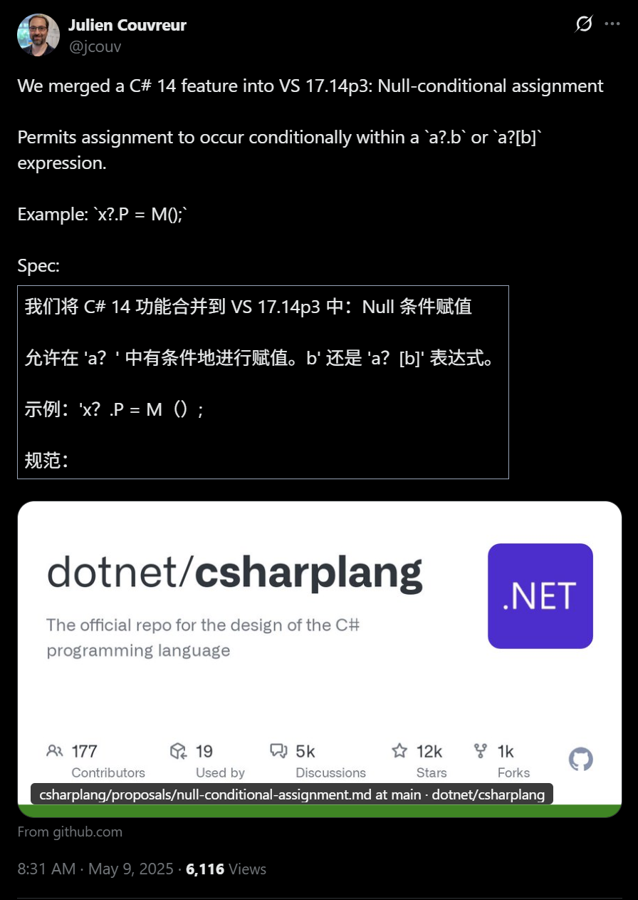
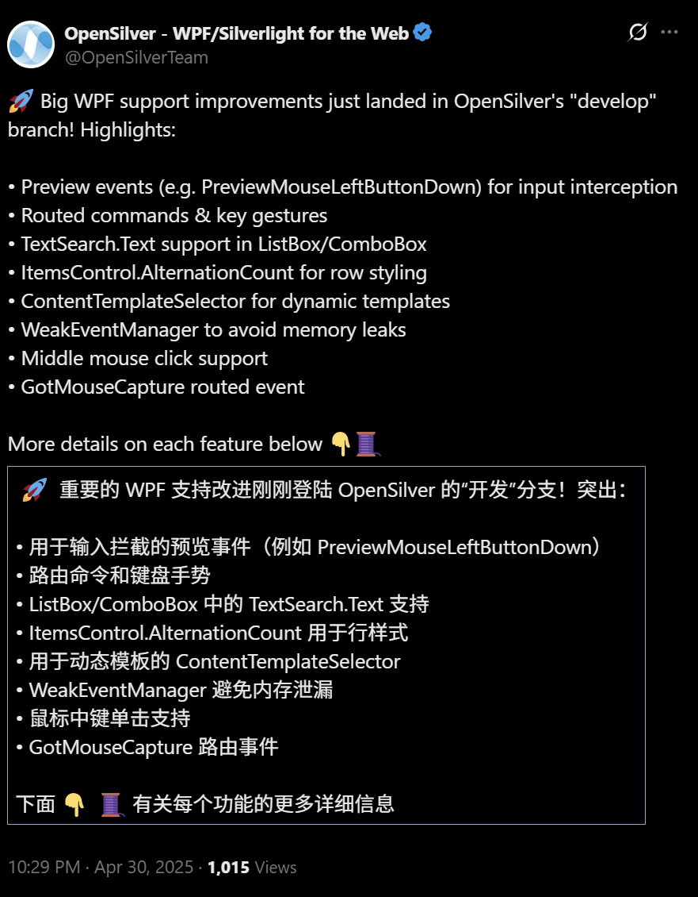

### dotnet 9 通过 AppHostRelativeDotNet 指定自定义的运行时路径

https://www.cnblogs.com/lindexi/p/18847625

这篇文章讨论了在 .NET 9 中引入的新机制，即允许开发者自定义应用使用的 DotNet 运行时路径。这项功能旨在解决多个应用同时发布时，导致的重复文件和系统更新问题。作者分享了自己的提案背景，介绍了团队如何开发和开源相关项目，并详细阐述了新机制的实现和使用。文章涉及的关键属性和配置方法明确，旨在提高框架依赖发布的灵活性和效率，无需在系统文件夹中安装多个拷贝。作者的提案已被 dotnet 官方采纳并实施，展示了实践中的创新和解决方案。

### C#高性能开发之类型系统：从 C# 7.0 到 C# 14 的类型系统演进全景

https://www.cnblogs.com/code-daily/p/18844112

自C# 7.0以来，C#语言推出了多种新数据类型和特性，以提升性能和开发效率。本文系统总结了C# 7.0至C# 14.0的新增内容，包括值元组、Span、内存管理结构、可空引用类型及记录等。文中详述了每个版本的主要特性、用途及代码示例，深入分析了类型系统的演变及其影响。各新特性使得数据处理更加灵活高效，增强了类型安全性，体现了语言的进步和现代化。值得关注的是，本文提供详细的描述和代码示例，便于开发者理解和使用这些新特性。

### 三维装箱问题(3D Bin Packing Problem, 3D-BPP)

https://www.cnblogs.com/FreeSql/p/18846755

本文探讨了如何高效装箱海运家具的问题，提出了三维装箱问题(3D-BPP)是一种NP-hard问题，通常采用启发式算法来寻找近似解。首先，文中介绍了集装箱的标准尺寸和家具的三维特性。随后，提出了家具放置的策略，包括物品顺序、放置位置和空间管理。最后，详细描述了算法的流程和基本代码框架，提供了解决实际装箱问题的思路与方法。

### 基于Blazor实现的运输信息管理系统

https://www.cnblogs.com/known/p/18844645

运输信息管理系统(TIMS)是为小型运输服务公司设计的，使用Blazor框架及PWA技术，支持PC端与手机端协同工作。系统帮助司机上报运输任务，管理员可直接查看统计记录。功能包括报工模块、车辆和司机管理、运单管理、财务对账、统计报表等。系统提供数据预警、权限管理、操作日志等安全措施。整体方案基本符合小型公司的业务需求，具备实用性与操作简便性。

### 使用 AOT 编译保护 .NET 核心逻辑，同时支持第三方扩展

https://www.cnblogs.com/tansm/p/18847143/AOTDemo

本文探讨了开发可供第三方引用的 .NET 组件的挑战，包括核心逻辑保护与反射支持的问题。作者尝试了多种方案，包括 AOT 编译、PublishReadyToRun 和混淆工具，发现每种方案都有优缺点。在多次实验后，作者设计了一种结合 AOT 编译和插件架构的最终解决方案。该方案通过分离核心逻辑和接口，满足了不易反编译和第三方插件开发的需求。最后，解决方案成功支撑了应用程序的扩展性与安全性。

### 记一次 .NET某旅行社酒店管理系统 卡死分析

https://www.cnblogs.com/huangxincheng/p/18838356

文章讲述了分析一个不响应的ASP.NET管理系统的过程。首先，通过线程池队列命令检查是否有积压，并发现确实存在。接着，排除了锁的问题，深入观察各个线程的调用栈，发现多个线程停留在TryGetConnection上，导致卡顿。整体过程逻辑清晰，且关注实际问题的解决，展现了较强的技术深度和实践应用。文章结构合理，时间相关，且与C# .NET技术相关。

### .NET Core中的配置Configuration实战

https://www.cnblogs.com/caoruipeng/p/18842001

本文详细介绍了.NET中的不同配置提供程序，包括基于内存、现有配置、命令行和环境变量的配置方法。每种方法通过代码示例展示其实现与使用，易于理解和实践。文章内容紧扣.NET技术，具有实用价值，提升了读者对配置管理的认识。

### 一次小而美的重构：使用 C# 在 Avalonia 中生成真正好看的词云

https://www.cnblogs.com/deali/p/18848662

本文介绍了在StarBlogPublisher中重构词云功能的经历与技术选择，重点评估了Sdcb.WordCloud和KnowledgePicker.WordCloud这两个C#词云库。文章详细分析了两者在渲染引擎、输出格式、自定义程度、遮罩功能以及使用复杂度等方面的异同。最后选择了Sdcb.WordCloud，强调其跨平台兼容性和高度可定制性，并展示了在实际应用中如何获取词频数据和生成词云图像的代码示例。整个文章结构清晰，深入浅出，适合开发者理解与实践。

### 如何基于 Kestrel 实现 socks5 代理

https://www.cnblogs.com/fs7744/p/18842979

这篇文章介绍了基于Kestrel实现的L4/L7代理VKProxy。作者分享了因个人事务未能持续开发的背景，及其对Kestrel的再利用。Kestrel作为Aspnetcore的开源Web服务器，虽然主要支持L7功能，但作者指出通过反射技术可以扩展其L4层能力。文中提供了VKProxy的安装及基本代码示例，并详细说明了Tcp、Udp和Http的处理方式。文章技术内容丰富，操作实例清晰，适合有相关开发需求的读者。

### C#/.NET/.NET Core技术前沿周刊 | 第 35 期(2025年4.14-4.20)

https://www.cnblogs.com/Can-daydayup/p/18839314

本周刊聚焦C#/.NET/.NET Core技术，提供最新文章、项目及学习资源。介绍Visual Studio 2022 v17.13的新特性，强调其在开发中的便捷性。YourWeather是个开源Blazor项目，通过多种天气API提供天气信息。呼吁开发者参与2025年Microsoft Build，享受.NET和C#的学习机会。发布.NET AI模板Preview 2，简化AI聊天应用的开发。探讨Hangfire Redis和CQRS在微服务中的应用。StreamJsonRpc库实现JSON-RPC远程调用，适用于跨进程通信。推出基于.NET的桌面餐饮管理系统，为餐饮行业提供高效服务。

### 记一次 .NET某工控任务调度系统 卡死分析

https://www.cnblogs.com/huangxincheng/p/18842230

这篇文章讨论了一个VIP客户在使用furion框架时遇到的定时任务延迟问题。通过分析,发现M71EnterPortService服务未能正常执行。文章介绍了如何通过调试方法和源码分析探究问题根源。特别强调了任务的异步实现以及可能导致执行延迟的原因。文章结构清晰,逻辑严谨,为技术人员提供了有价值的解决思路和分析流程。

### 在Avalonia/C#中使用依赖注入过程记录

https://www.cnblogs.com/mingupupu/p/18838910

本文探讨了在Avalonia/C#中使用依赖注入的实践。作者分享了两个示例，一个不使用依赖注入，另一个使用依赖注入。首先，演示了没有依赖注入时导航功能的局限，实例无法保留状态。随后，介绍了使用依赖注入容器Microsoft.Extensions.DependencyInjection的实现，通过创建INavigationService接口和NavigationService类来管理View与ViewModel的依赖关系。文中提供了服务注册的扩展方法，支持将视图和视图模型注册为单例。整体结构清晰，提供了实用的代码示例，适合开发者学习和参考。

### 在SqlSugar的开发框架中增加对低代码EAV模型(实体-属性-值)的WebAPI实现支持

https://www.cnblogs.com/wuhuacong/p/18842471

本文介绍了基于SqlSugar开发框架实现EAV模型的Web API支持。EAV模型用于动态化数据库设计，支持MongoDB和多种关系数据库，使得数据存储和查询更灵活。SqlSugar框架能接入多终端应用，通过开关变量模式切换本地和Web API访问。同时，EAV模型允许动态定义表和字段，支持复杂查询。文章详述了如何在接口中实现增、删、改、查等功能，以及如何进行标准化和封装，保障应用的灵活性和可维护性。作者展示了完整的架构设计图，强调了数据库间的统一性和多种数据类型的存储方式。

###  放弃 Oh-My-Posh，转而手搓 FastPrompt，打造快速高效的命令提示

https://www.cnblogs.com/denglei1024/p/18837958

这篇文章讨论了开发者对终端提示符的需求，介绍了作者自行开发的FastPrompt模块。作者提到使用传统的Oh-My-Posh提示符时，启动速度慢、配置复杂和依赖过多的问题。为了解决这些问题，作者创建了一个轻量级、无依赖的PowerShell提示符。FastPrompt能够快速加载，展示Git状态，且样式美观。文章最后鼓励其他开发者尝试此项目，并提供了使用说明和GitHub链接。

### 在Python后端项目FastApi中使用MongoDB进行数据处理

https://www.cnblogs.com/wuhuacong/p/18844209

本文介绍如何在Python环境中操作MongoDB数据库，特别是配合FastAPI使用motor驱动进行异步操作。首先准备MongoDB的安装，并提供了必要的依赖安装方法，包括pymongo和motor。接着介绍了MongoDB的应用场景和基本操作，如实时数据存储、数据缓存和高伸缩性等。最后，通过代码示例展示了如何连接MongoDB并执行查询操作，如条件查询等。

### 用c#从头写一个AI agent，实现企业内部自然语言数据统计分析

https://www.cnblogs.com/chegan/p/18846446

本文介绍了如何利用C#编写一个无框架的agent，调用阿里千问大模型来完成特定任务，并构建一个可扩展的agent框架。文章假设读者具备AI、functioncall和C#编程的基本知识。实现中使用WebClient与千问接口通信，强调减少为大模型提交的工具数量以提升效率。遇到的挑战包括如何处理多个任务及工具选择，提出了关键词法和分组控制器法来优化工具使用。此外，文中已实现自然语言数据统计与个人工作助理功能。虽然代码分享有困难，整体思路清晰且具实用性。

### 凯亚物联网平台如何通过MQTT网络组件接入设备

https://www.cnblogs.com/fanliang11/p/18845574

本文介绍了凯亚物联网平台及其基于.NET6.0的微服务引擎surging。平台支持多种协议适配，提供了设备管理、告警和数据可视化等功能。作者提到使用dotnetty进行物联网服务，并说明了MQTT等协议的创建和自定义。同时，作者承诺修复内存增加问题，并会开放测试端口。

### 物流规划、仓储自动化和算法调度的问题分析

https://www.cnblogs.com/FreeSql/p/18847880

本文讨论了一种物流分拣配送系统中的导轨控制问题，重点在于如何通过算法实现货物智能传输。将广西、佛山和广州的货物按出库顺序(LIFO和FIFO)通过导轨系统有序安排。文章分析了系统设计思路，包括订单管理、仓库管理和导轨调度控制，提出关键挑战如冲突资源和实时路径规划。通过简化模拟算法流程，明确了数据结构和调度逻辑，以实现高效的货物输送，保证叉车的装车顺序，满足实际需求。

### StarBlog和Masuit.MyBlogs博客程序学习使用日记(二)

https://www.cnblogs.com/wxinxin/p/18848483

在使用管理平台时，用户发现博客列表无法查看，原因是echarts.min.js路径无效，修改该路径后发现服务器性能不足，最终选择停用Masuit.MyBlogs，改用StarBlog。发布StarBlog后，出现多个错误，包括文件路径缺失和数据库表不存在等。用户提供了解决方案，例如创建缺失的目录和数据库表。虽然存在一些问题未解决，但博客的正常使用不受影响。最初用户计划基于mysql、sqlsugar和原生html开发新的博客，后续还可能考虑其他技术栈。

### 一个开源、经典的 WPF 控件、组件和实用工具集合，值得参考学习！

https://www.cnblogs.com/Can-daydayup/p/18850464

本文介绍了Extended.Wpf.Toolkit，一个开源的WPF控件集合，旨在帮助开发者构建专业的Windows应用程序。WPF框架允许创建具有丰富界面的桌面应用，提供灵活的布局、数据绑定和动画功能。文章提供了项目源代码和运行效果，鼓励开发者参考和学习。此外，项目已被纳入C#/.NET优秀项目精选，可以让开发者及时了解领域内的新动态和最佳实践。

### .NET 原生驾驭 AI 新基建实战系列(四)：Qdrant  ── 实时高效的向量搜索利器

https://www.cnblogs.com/code-daily/p/18840212

向量数据库Qdrant专为AI应用设计，能高效管理和检索高维数据。文章详细介绍了Qdrant的核心特点，如高性能、实时性和分布式架构。它支持C#，通过REST API和gRPC接口容易与.NET生态系统集成。Qdrant的工作机制利用HNSW算法进行向量搜索，特别适合深层语义理解场景。开发者通过安装Qdrant.Client NuGet包，可便捷建立.NET项目的Qdrant环境。该数据库在推荐系统和语义搜索等多种应用中表现优异。

### C# 使用StackExchange.Redis实现分布式锁的两种方式

https://www.cnblogs.com/qwqwQAQ/p/18849019

本文探讨了分布式锁在集群架构中的重要性及其使用场景，如高并发的秒杀、金融操作与任务触发等。文章提供了实现分布式锁的C#代码实例，描述了如何使用StackExchange.Redis获取与释放锁。示例中，通过唯一的lockValue与订单号，确保只有一个节点能处理重复请求，从而避免数据冲突。代码逻辑清晰，实践性强，适合开发者参考。

### 【译】让多线程调试更有意义

https://www.cnblogs.com/MeteorSeed/p/18846145

Visual Studio 引入了 AI 驱动的线程摘要和应用程序摘要，简化多线程调试，减少开发时间。线程摘要为每个线程提供高级概述，帮助快速理解当前活动。应用程序摘要通过 Copilot Chat 允许开发者提问和获得智能建议。用户只需点击并行堆栈窗口的 summarize 按钮，便可与 AI 进行互动，获取关于多线程问题的解释和解决方案。这些功能提升了开发效率，支持优化线程模型，帮助开发者更好地解决复杂的调试挑战。

### 微服务之间有哪些调用方式？

https://www.cnblogs.com/liyongqiang-cc/p/18849484

这篇文章讨论了微服务架构中服务之间的通信方式，主要分为同步和异步通信。同步通信包括HTTP/RESTful API和gRPC，适用于需要实时响应的场景。文章提供了.NET Core中的具体示例，展示了如何实现订单服务与库存服务的调用。异步通信则通过消息队列如RabbitMQ和Kafka进行，适合非实时任务和事件驱动架构。文章详细介绍了各类通信方式的适用场景、核心特点及选型建议，内容清晰且实用。

### .NET AI从0开始入门 SemanticKernel 从基础到实践

https://www.cnblogs.com/token-ai/p/18849295

本教程详细介绍了Semantic Kernel，这是一款开源AI开发工具包，支持C#、Python和Java。它集成了多个AI模型，简化了企业级解决方案的构建。Semantic Kernel的主要特性包括插件架构、Memory与Planner组件以及组件的可组合性。这些功能使得开发者可以创建智能应用，如内容创作助手、个人知识管理和客户服务自动化。本文还提供了入门指南，帮助用户配置SDK和AI模型，创建插件和工作流。通过教程，用户可以快速掌握Semantic Kernel的使用技巧。

### EF Core 10 现已支持 LeftJoin 和 RightJoin 运算符查询了！

https://www.cnblogs.com/Can-daydayup/p/18852627

本文介绍了EF Core 10中新增的LEFT JOIN和RIGHT JOIN运算符，强调了与之前复杂实现方式相比的简洁性。首先，开发者需安装.NET 10开发环境，再结合Visual Studio等工具进行配置。然后，文章详细阐述了LEFT JOIN的实现原理，包括GroupJoin、SelectMany和DefaultIfEmpty的使用。代码示例展示了如何有效地进行左右连接查询，确保即使没有相关记录也能保留左表的数据信息。这一新功能简化了数据库操作，提高了开发效率。

### 《HelloGitHub》第 109 期

https://www.cnblogs.com/xueweihan/p/18850411

HelloGitHub 是一个分享开源项目的平台，吸引用户对开源编程的兴趣。文章列出了多种编程语言的项目，包括 C、C#、C++、Go 和 Java。其中，C# 部分提及了跨平台备份工具 Duplicati 和游戏数据展示工具 HunterPie，强调了它们的实用性和功能。C++ 及其他语言同样包含实用项目，如性能分析工具和在线流媒体应用。整体来说，内容丰富且吸引人，适合技术爱好者和开发者了解开源创新。每月更新让关注者保持新鲜感。

### 一个基于 C# Unity 开发的金庸群侠传 3D 版，直呼牛逼！

https://www.cnblogs.com/Can-daydayup/p/18855502

本文介绍了基于C#和Unity开发的3D金庸群侠传重制版，属于非盈利项目，目标是重制经典游戏并支持MOD和二次开发。Unity作为广泛的游戏引擎，支持多平台，提供丰富开发工具。项目源码地址和社区参与信息清晰列出，鼓励开发者分享技术和项目经验，促进.NET开发者交流与成长。整体内容简洁明了，体现了实践性和技术深度。

### 当数据爆炸遇上SQL Server：优化策略全链路解析

https://www.cnblogs.com/xiongze520/p/18855686

在数据驱动时代，数据库性能关键。SQL Server应对亿级数据时需考虑分库分表。索引优化是性能调优的核心，执行计划分析可帮助识别问题。复合索引采用相等条件优先原则，索引维护自动化可以通过Ola Hallengren脚本实现。冷热数据分层通过分区方案和文件组隔离策略管理数据生命周期。读写分离利用AlwaysOn可用性组提高高可用性。列存储索引和内存优化表确保性能突破。云原生时代的弹性方案通过弹性池实现资源共享。这些方法全方位提升SQL Server性能。

### C#/.NET/.NET Core技术前沿周刊 | 第 36 期(2025年4.21-4.27)

https://www.cnblogs.com/Can-daydayup/p/18851401

本文介绍了C#/.NET相关的技术交流周刊，涵盖开源项目、开发框架以及Visual Studio插件等，旨在提高开发效率和降低996工作负担。内容包括14款快速开发框架、经典WPF控件、实用插件、基于.NET的人工智能开发工具、分布式锁的实现方法、以及多线程调试的改进方案。每篇文章附有相应的链接，读者可根据需求深入了解各个工具和技术。

### WPF封装一个懒加载下拉列表控件(支持搜索)

https://www.cnblogs.com/adingfirstlove/p/18855065

该文章讨论了在WPF客户端实现懒加载下拉选择控件的过程。文章首先描述了PC端使用懒加载组件的需求，并提出WPF端需要保持一致性。由于没有现成组件，作者自行封装了支持模糊过滤的懒加载下拉列表，采用虚拟化加载技术以解决数据量庞大时的渲染卡顿问题。文中提供了关键实体类和数据源提供器的完整代码，展示了实现的细节与示例，具有一定的实用价值和技术深度。

### .NET AI 模板 Preview 2 发布：从 .NET Aspire 支持到 Qdrant 向量数据库集成，助您快速构建云原生 AI 应用

https://www.cnblogs.com/code-daily/p/18853385

微软发布的.NET AI模板Preview 2版本为AI开发者提供了新功能，如与.NET Aspire框架的集成和对Qdrant向量数据库的支持。这些改进简化了AI应用的开发过程，允许开发者更轻松地构建云原生和分布式系统。通过Visual Studio Code提供的扩展，用户可以灵活配置AI项目设置。安装和使用指南详细说明了如何在现有环境中快速上手，并选择AI模型服务和向量存储选项，这增强了开发的灵活性和便捷性。

### 分享5款开源、美观的 WinForm UI 控件库

https://www.cnblogs.com/Can-daydayup/p/18856743

本文介绍了五款开源的美观WinForm UI控件库，旨在提升桌面应用程序的视觉效果。WinForm是基于Windows的传统桌面应用程序框架，开发者可以快速构建应用程序。提到的控件库包括AntdUI、ReaLTaiizor、MaterialSkin、HZHControls和SunnyUI，涵盖了多种设计风格和功能特点。所有项目均支持C#/.NET，并在GitHub及Gitee上开源，方便开发者使用和学习。

### 一个包含 80+ C#/.NET 编程技巧实战练习开源项目！

https://www.cnblogs.com/Can-daydayup/p/18859538

本文介绍了C#、.NET和.NET Core的常用语法、算法和中间件，提供详细教程和实操练习，助力快速掌握相关技术。内容涵盖PDF生成、多线程、异步编程、数据抓取等多个主题，适合学习、工作和面试使用，内容丰富且实用，为用户提供了开源资源链接和反馈途径。

### KoalaWiki vs DeepWiki：更优秀的开源代码知识库解决方案

https://www.cnblogs.com/token-ai/p/18852336

KoalaWiki 是一款 AI 驱动的开源代码知识库平台，自动分析代码仓库，生成文档，帮助开发团队理解代码结构。与闭源的 DeepWiki 相比，KoalaWiki 提供完全开源、成本效益高、本地部署等优势。它集成了仓库管理、AI 代码分析、自动文档生成等多种功能，支持多模型接入，并可深度定制。适用于新员工入职、代码重构、团队协作等场景。系统要求为 .NET 9.0 和 Node.js 18+，用户可通过在线体验地址访问产品功能并参与开发。

### Dynamic adaptation to application sizes (DATAS) GC 策略

https://www.cnblogs.com/kklldog/p/18852699

随着 .NET 的发展，程序多部署在容器化环境下。高并发场景可能导致内存占用高，甚至OOM。传统方法是将GC改为workstation模式，但会影响吞吐量。 .NET 8引入DATAS GC，它根据应用内存需求自适应调整堆大小，平衡内存占用和吞吐量。DATAS特别适合突发负载，能在资源有限时优化性能。该机制通过设定GC的最大分配量及调整堆数量来实现效果。

### 【译】使用自适应粘贴轻松调整代码

https://www.cnblogs.com/MeteorSeed/p/18852249

Visual Studio 2022 引入了自适应粘贴功能，帮助用户调整粘贴的代码，节省时间。此功能能够智能识别上下文并自动修正语法、样式和小错误。用户在复制粘贴时，系统会提供建议，并可以通过预览调整后的代码来确认更改。自适应粘贴可以有效简化编码过程，提高工作效率。此外，用户可以在 Visual Studio Hub 中找到相关资源和最新信息。客户反馈对于 Visual Studio 的改进至关重要。

### .NET 原生驾驭 AI 新基建实战系列(五)：Milvus ── 大规模 AI 应用的向量数据库首选

https://www.cnblogs.com/code-daily/p/18851097

Milvus 是一款开源向量数据库，专为 AI 和 ML 应用设计，能够高效存储和检索高维向量。它支持多种索引类型和相似性度量，适合处理非结构化数据。Milvus 的架构分为接入层、协调服务、工作节点和存储，确保高扩展性和灵活性。开发者可通过 Milvus C# SDK 简便操作，如创建集合和执行搜索。该数据库在图像、视频和推荐系统等领域应用广泛，展现出卓越的性能和可靠性。

### 凯亚利用直播推流技术请大家看电影

https://www.cnblogs.com/fanliang11/p/18858743

本文介绍了凯亚平台的开发背景和功能，基于.NET6.0构建的微服务引擎surging，支持多种协议，如TCP和RTMP，并具有设备统一管理、数据可视化等功能。同时，阐述了常见直播协议RTMP和HTTP-FLV的优缺点，强调了RTMP低延迟和HTTP-FLV的防火墙穿透能力。通过这些信息，读者能快速理解凯亚平台及其应用场景。

### 使用的架构是否满足微服务设计思想？

https://www.cnblogs.com/fanliang11/p/18853171

文章探讨了微服务架构的现状与挑战，强调许多架构未能真正实现微服务思想。它介绍凯亚微服务引擎的背景和功能，展示了物联网平台和多协议适配的优势。同时，文章分析了几种交互模式及其应用，指出旧有架构的不足。最后，文章详细阐述服务治理的重要性和原理，强调需要根据业务需求扩展中间件和组件，以满足微服务的要求。

## 主题

### 下一章：Uno Platform Studio 和 Uno Platform 6.0 发布！
https://platform.uno/blog/uno-platform-studio-6-0/

Uno Platform 6.0 已发布。

在此版本中，Uno Platform Studio 也已正式发布。 与 Uno 平台不同，Uno Platform Studio 是一款商业产品，因此您需要购买许可证(限时 20% 的折扣)。

Uno Platform 6.0 包括许多新功能，包括使用基于 Skia 的新渲染引擎提高性能、添加新控件、XAML 修剪以及引入非 UI 类平台库 Uno.WinRT。

### 宣布终止对 AWS DynamoDB 会话状态提供程序的支持 | 亚马逊云科技
https://aws.amazon.com/jp/blogs/developer/announcing-the-end-of-support-for-aws-dynamodb-session-state-provider/

宣布停用适用于 .NET 的 AWS DynamoDB 会话状态提供程序。

六个月的支持期结束后，支持将于 2025 年 11 月 14 日结束。 对于 ASP.NET Core 应用程序，建议使用 AWS .NET 分布式缓存提供程序。

### 适用于 .NET 的 AWS 开发工具包 v4.0 全面推出 | 亚马逊云科技
https://aws.amazon.com/jp/blogs/developer/general-availability-of-aws-sdk-for-net-v4-0/

适用于 .NET 的 AWS 开发工具包 V4.0 现已全面推出。

此版本不会对 API 进行重大更改，但它确实包括性能改进、与其他 SDK 的一致性以及需要重大更改的可用性修复。

V4 不会在用户端造成重大变化，但 . NET Framework 3.5 已被删除，并且有一些变化，例如请求/响应中的 null 处理。 此外，由于 V3 和 V4 不能共存，因此核心软件包 (AWS 开发工具包. Core) 和服务包 (AWSSDK. SQS) 应统一为一个版本或另一个版本。

- [版本 4.0.0.0 · aws/aws-sdk-net](https://github.com/aws/aws-sdk-net/releases/tag/4.0.0.0)

### C# 14 - 探索扩展成员 - .NET 博客
https://devblogs.microsoft.com/dotnet/csharp-exploring-extension-members/

扩展成员简介，这是 C# 14 中的一项新功能。

本文概述了扩展杆件、它们目前的描述方式、设计挑战以及扩展杆件的功能以及如何实现它们的其他方面。

### 从 Rust 迁移。
https://deadmoney.gg/news/articles/migrating-away-from-rust

他花了六周时间将他的游戏从 Rust 迁移到 C#。

本文解释了他们为什么选择 Bevy(Rust 的游戏框架)，他们如何迁移到 Unity，他们是如何做到的，以及迁移后仍然存在的挑战。

- [“从 Rust 迁移”的评论要点](https://deadmoney.gg/news/articles/highlights-from-the-comments-on-migrating-away-from-rust-dot)

### 为什么我们使用 C# 构建我们的初创公司 - .NET 博客
https://devblogs.microsoft.com/dotnet/why-we-built-our-startup-in-csharp/

Tracebit 的 CTO 提供的一篇文章，介绍了初创公司为何使用 C# 开发他们的服务。

据说它是高效的、现代的、开放的、丰富的标准库、富有表现力的、工具和性能。

- [为什么 Tracebit 是用 C# 编写的 | Tracebit](https://tracebit.com/blog/why-tracebit-is-written-in-c-sharp)

## 发布
- [autofac/Autofac](https://github.com/autofac/Autofac)
    - [v8.3.0](https://github.com/autofac/Autofac/releases/tag/v8.3.0)
- [AvaloniaUI/Avalonia](https://github.com/AvaloniaUI/Avalonia)
    - [11.3.0](https://github.com/AvaloniaUI/Avalonia/releases/tag/11.3.0)
- [aws/aws-sdk-net](https://github.com/aws/aws-sdk-net)
    - [3.7.1032.0](https://github.com/aws/aws-sdk-net/releases/tag/3.7.1032.0)、[3.7.1033.0](https://github.com/aws/aws-sdk-net/releases/tag/3.7.1033.0)、[3.7.1034. 0](https://github.com/aws/aws-sdk-net/releases/tag/3.7.1034.0)， [3.7.1036.0](https://github.com/aws/aws-sdk-net/releases/tag/3.7.1036.0)， [3.7.1037. 0](https://github.com/aws/aws-sdk-net/releases/tag/3.7.1037.0) [3.7.1038.0](https://github.com/aws/aws-sdk-net/releases/tag/3.7.1038.0)， [3.7.1039.0](https://github.com/aws/aws-sdk-net/releases/tag/3.7.1039.0)， [3.7.1040.0]( https://github.com/aws/aws-sdk-net/releases/tag/3.7.1040.0)、[4.0.1.0](https://github.com/aws/aws-sdk-net/releases/tag/4.0.1.0)、[4.0.2.0]( https://github.com/aws/aws-sdk-net/releases/tag/4.0.2.0)、[4.0.3.0](https://github.com/aws/aws-sdk-net/releases/tag/4.0.3.0)、[4.0.5.0]( https://github.com/aws/aws-sdk-net/releases/tag/4.0.5.0)、[4.0.6.0](https://github.com/aws/aws-sdk-net/releases/tag/4.0.6.0)、[4.0.7.0]( https://github.com/aws/aws-sdk-net/releases/tag/4.0.7.0)、[4.0.8.0](https://github.com/aws/aws-sdk-net/releases/tag/4.0.8.0)
- [Azure/azure-sdk-for-net](https://github.com/Azure/azure-sdk-for-net)
    - [Azure.Core_1.46.0](https://github.com/Azure/azure-sdk-for-net/releases/tag/Azure.Core_1.46.0)，[Azure.Data.Tables_12.11. 0](https://github.com/Azure/azure-sdk-for-net/releases/tag/Azure.Data.Tables_12.11.0)， [Azure.Extensions.AspNetCore.DataProtection.Keys_1.5. 0](https://github.com/Azure/azure-sdk-for-net/releases/tag/Azure.Extensions.AspNetCore.DataProtection.Keys_1.5.0)， [Azure.Messaging.WebPubSub_1.6. 0](https://github.com/Azure/azure-sdk-for-net/releases/tag/Azure.Messaging.WebPubSub_1.6.0)， [Azure.ResourceManager.DataFactory_1.8. 0](https://github.com/Azure/azure-sdk-for-net/releases/tag/Azure.ResourceManager.DataFactory_1.8.0)， [Azure.ResourceManager.NetApp_1.10. 0](https://github.com/Azure/azure-sdk-for-net/releases/tag/Azure.ResourceManager.NetApp_1.10.0)， [Azure.ResourceManager.Sql_1.3. 0](https://github.com/Azure/azure-sdk-for-net/releases/tag/Azure.ResourceManager.Sql_1.3.0)， [Azure.ResourceManager.Storage_1.4. 2](https://github.com/Azure/azure-sdk-for-net/releases/tag/Azure.ResourceManager.Storage_1.4.2)，[Azure.ResourceManager.StorageSync_1.3. 0](https://github.com/Azure/azure-sdk-for-net/releases/tag/Azure.ResourceManager.StorageSync_1.3.0)， [System.ClientModel_1.4. 0](https://github.com/Azure/azure-sdk-for-net/releases/tag/System.ClientModel_1.4.0)
- [DataDog/dd-trace-dotnet](https://github.com/DataDog/dd-trace-dotnet)
    - [v3.16.0](https://github.com/DataDog/dd-trace-dotnet/releases/tag/v3.16.0)
- [dotnet/SqlClient](https://github.com/dotnet/SqlClient)
    - [v5.2.3](https://github.com/dotnet/SqlClient/releases/tag/v5.2.3)
- [FluentValidation/FluentValidation](https://github.com/FluentValidation/FluentValidation)
    - [12.0.0](https://github.com/FluentValidation/FluentValidation/releases/tag/12.0.0)
- [googleapis/google-cloud-dotnet](https://github.com/googleapis/google-cloud-dotnet)
    - [Google.Cloud.AIPlatform.V1-3.26.0](https://github.com/googleapis/google-cloud-dotnet/releases/tag/Google.Cloud.AIPlatform.V1-3.26.0)， [ Google.Cloud.AIPlatform.V1-3.27.0](https://github.com/googleapis/google-cloud-dotnet/releases/tag/Google.Cloud.AIPlatform.V1-3.27.0)，[Google.Cloud.AIPlatform.V1-3.28. 0](https://github.com/googleapis/google-cloud-dotnet/releases/tag/Google.Cloud.AIPlatform.V1-3.28.0) [Google.Cloud.Asset.V1-3.13.0](https://github.com/googleapis/google-cloud-dotnet/releases/tag/Google.Cloud.Asset.V1-3.13.0)，[Google.Cloud.Bigtable.Admin.V2-3.26. 0](https://github.com/googleapis/google-cloud-dotnet/releases/tag/Google.Cloud.Bigtable.Admin.V2-3.26.0)，[Google.Cloud.CloudControlsPartner.V1-1.2. 0](https://github.com/googleapis/google-cloud-dotnet/releases/tag/Google.Cloud.CloudControlsPartner.V1-1.2.0)，[Google.Cloud.DevTools.ContainerAnalysis-3.10. 0](https://github.com/googleapis/google-cloud-dotnet/releases/tag/Google.Cloud.DevTools.ContainerAnalysis-3.10.0)， [Google.Cloud.DevTools.ContainerAnalysis-3.9. 0](https://github.com/googleapis/google-cloud-dotnet/releases/tag/Google.Cloud.DevTools.ContainerAnalysis-3.9.0)，[Google.Cloud.Logging.Console-1.5. 0](https://github.com/googleapis/google-cloud-dotnet/releases/tag/Google.Cloud.Logging.Console-1.5.0)， [Google.Cloud.NetApp.V1-1.9. 0](https://github.com/googleapis/google-cloud-dotnet/releases/tag/Google.Cloud.NetApp.V1-1.9.0)，[Google.Cloud.Retail.V2-2.13. 0](https://github.com/googleapis/google-cloud-dotnet/releases/tag/Google.Cloud.Retail.V2-2.13.0)，[Google.Cloud.Storage.Control.V2-1.3. 0](https://github.com/googleapis/google-cloud-dotnet/releases/tag/Google.Cloud.Storage.Control.V2-1.3.0)
- [newrelic/newrelic-dotnet-agent](https://github.com/newrelic/newrelic-dotnet-agent)
    - [v10.41.0](https://github.com/newrelic/newrelic-dotnet-agent/releases/tag/v10.41.0)
- [open-telemetry/opentelemetry-dotnet](https://github.com/open-telemetry/opentelemetry-dotnet)
    - [核心-1.12.0](https://github.com/open-telemetry/opentelemetry-dotnet/releases/tag/core-1.12.0)
- [open-telemetry/opentelemetry-dotnet-contrib](https://github.com/open-telemetry/opentelemetry-dotnet-contrib)
    - [Exporter.Geneva-1.12.0](https://github.com/open-telemetry/opentelemetry-dotnet-contrib/releases/tag/Exporter.Geneva-1.12.0)，[Instrumentation.AspNetCore-1.12. 0](https://github.com/open-telemetry/opentelemetry-dotnet-contrib/releases/tag/Instrumentation.AspNetCore-1.12.0)，[Instrumentation.AWS-1.11. 3](https://github.com/open-telemetry/opentelemetry-dotnet-contrib/releases/tag/Instrumentation.AWS-1.11.3)， [Instrumentation.Http-1.12. 0](https://github.com/open-telemetry/opentelemetry-dotnet-contrib/releases/tag/Instrumentation.Http-1.12.0)， [Instrumentation.Runtime-1.12. 0](https://github.com/open-telemetry/opentelemetry-dotnet-contrib/releases/tag/Instrumentation.Runtime-1.12.0)
- [StackExchange/StackExchange.Redis](https://github.com/StackExchange/StackExchange.Redis)
    - [2.8.37](https://github.com/StackExchange/StackExchange.Redis/releases/tag/2.8.37)
- [uno平台/uno](https://github.com/unoplatform/uno)
    - [6.0.465](https://github.com/unoplatform/uno/releases/tag/6.0.465)

## 文章、幻灯片等

### 使用 GitHub Actions 打包和发布 .NET MAUI 库 - .NET 博客
https://devblogs.microsoft.com/dotnet/dotnet-maui-libraries-github-actions/

了解如何使用 GitHub Actions 打包 .NET MAUI 库并将其发布到 NuGet.org
### ReSharper 和 Rider 2025.1.2 – 错误修复现已推出！ | .NET 工具博客
https://blog.jetbrains.com/dotnet/2025/05/08/resharper-rider-2025-1-2-bug-fix/

ReSharper 和 Rider 2025.1.2 已发布。

此版本的 ReSharper 修复了多个错误。 除了修复一些错误之外，Rider 还添加了一项测试版功能，允许您在同一个调试会话中调试原生和 managed(目前仅支持 Windows x64 上的 Mono)。

- [ReSharper 和 Rider 2025.1 的第一组错误修复现已推出！| .NET 工具博客](https://blog.jetbrains.com/dotnet/2025/04/29/2025-1-1-hot-fix/)

### 如何正确地在 C# 中实现溢出计数器差异计算？
https://zenn.dev/kunimasu/articles/601f1fba81571b

如何实现一个以恒定位数溢出的计数器。

### 我试图改进 Rope 以避免在 c# 中输入 loh
https://qiita.com/rirufa/items/133d02897c2f14f70f08

在保存大型文本文件时，如何避免使用 ropes 而不是数组来分配 LOH，以及如何修复实现。

### 将 Ubuntu 版本从 24 增加到 25 会导致 dotnet 命令失败
https://zenn.dev/j_sakamoto/articles/dd76f45b20af2f

我从 Ubuntu 24.04 升级到 25.04，但 dotnet 命令开始给我一个错误。 原因是未安装 libicu76。

### 在 C# 中重现可区分联合以提高类型安全性
https://zenn.dev/thinkingsinc/articles/c43feaf285a8b6

了解如何在 C# 中重现 Discriminated Union 之类的内容，以及它的好处和挑战。

### WPF - 自定义控件 - 复选框外观更改
https://zenn.dev/chai0917/articles/0854c363082a4c

了解如何自定义自定义控件中复选框的外观。

### ADO.NET Helper 库已经发布。
https://qiita.com/mxProject/items/c2678b3ebcf494457666

一篇关于发布 ADO.NET 帮助程序库的文章。 本文介绍了 helper 库提供的函数。

### 探索新的 AI 聊天模板
https://andrewlock.net/exploring-the-new-ai-chat-template/

一篇深入探讨 Microsoft.Extensions.AI.Templates(目前处于预览状态)的文章。

### HTTP 通信的弹性策略
https://zenn.dev/metalmental/articles/20250506_resilience-polly

了解如何提高 HTTP 请求的弹性。 本文介绍了使用 Polly 的重试。

### 创建更好的激活函数 ~用 C# 进行 ECDSA 签名~
https://qiita.com/mikecat_mixc/items/cbcce88a478a447dd50b

关于使用 ECDSA 签名实施激活功能。

### 使用 Yarp 为 Azure Open AI 的负载均衡创建反向代理
https://qiita.com/smr1/items/85a98455f18db732c221

了解如何使用 Yarp 在 Azure OpenAI 中创建用于负载均衡的反向代理。

本文讨论了对反向代理的需求以及如何在实践中实现它们。

### dotInsights | 2025 年 5 月 | .NET 工具博客
https://blog.jetbrains.com/dotnet/2025/05/06/dotinsights-may-2025/

JetBrains 2025 年 5 月 .NET 相关信息汇总。

### neue cc - 零分配 LINQ 库 “ZLinq” 的发布和架构描述
https://neue.cc/2025/05/05_ZLinq.html

架构的详细说明，包括实现零分配 LINQ 的 ZLinq 的发布，以及它是如何实现的。

### 弯曲 .NET：如何在 C# 中堆栈分配引用类型
https://dev.to/maximiliysiss/bending-net-how-to-stack-allocate-reference-types-in-c-73g

尝试将引用类型强制到堆栈及其方法上。

### 如何使用 Polly 和 Microsoft 实现重试和弹性模式 达观
https://dev.to/antonmartyniuk/how-to-implement-retries-and-resilience-patterns-with-polly-and-microsoft-resilience-191c

如何使用 Microsoft.Extensions.Resilience 实现重试、断路器、超时、傻瓜、对冲等。

### 创建一个 'pooled' 依赖注入生命周期
https://andrewlock.net/creating-a-pooled-dependency-injection-lifetime/

了解如何在 DI 容器中实现池化服务本文还涉及限制以及它是否有用。

### 我用 Semantic Kernel 做了一个自家的 AI 助手 - Qiita
https://qiita.com/omt_teruki/items/4e091282ed6e25735f09

使用 Semantic Kernel 创建集成 Slack 和 Notion 的内部 AI 助手。

### 在 Linux 上传输 .NET Core 转储
https://medium.com/@meriffa/transfer-net-core-dumps-on-linux-7c60df52cc7e

如何在 Linux 上获取 .NET 应用程序的核心转储，如何在 LLDB 中加载它，等等。

### C# 的历史：版本、.NET、Unity、Blazor 和 MAUI
https://dev.to/pvsdev/history-of-c-versions-net-unity-blazor-and-maui-470m

C# 和相关技术(.NET、WPF 等)的历史。

### 设置默认文件编码 - Visual Studio Blog
https://devblogs.microsoft.com/visualstudio/set-the-default-file-encoding/

引入了在 Visual Studio 2022 中设置文件的默认字符编码的功能。

### 语义内核 + Blazor 的 Interactive Server 在调用工具之前插入人工确认
https://zenn.dev/microsoft/articles/semantic-kernel-19

如何在组合语义内核和 Blazor 聊天交互中调用工具时插入用户确认。

### P/Invoke 中的回调
https://zenn.dev/mayuki/articles/2de8168706de3b

说明如何在 P/Invoke 中处理回调以及需要注意什么。

### 我尝试将 Gemini 与 Semantic Kernel 一起使用
https://zenn.dev/nexta_/articles/33c32b7c1e7c17

了解如何使用 Semantic Kernel 来利用 Gemini。

## 库、存储库、工具等
### nuskey8/McpToolkit： 轻量级、快速、兼容 NativeAOT 的 .NET MCP(模型上下文协议)框架
https://github.com/nuskey8/McpToolkit

基于 Source Generator 的轻量级模型上下文协议 (MCP) 框架。

### 推特
 https://x.com/jcouv/status/1920637770470707340?s=12

---

https://x.com/opensilverteam/status/1917587007255069015?s=12

## 深入探讨
### Blazor - 渲染指标和跟踪 作者 pavelsavara · 拉取请求 #61609 · dotnet/aspnetcore
https://github.com/dotnet/aspnetcore/pull/61609

一个 PR，用于为 Blazor 渲染添加指标和跟踪。

## C# .NET 交流群

相信大家在开发中经常会遇到一些性能问题，苦于没有有效的工具去发现性能瓶颈，或者是发现瓶颈以后不知道该如何优化。之前一直有读者朋友询问有没有技术交流群，但是由于各种原因一直都没创建，现在很高兴的在这里宣布，我创建了一个专门交流.NET性能优化经验的群组，主题包括但不限于：

* 如何找到.NET性能瓶颈，如使用APM、dotnet tools等工具
* .NET框架底层原理的实现，如垃圾回收器、JIT等等
* 如何编写高性能的.NET代码，哪些地方存在性能陷阱

希望能有更多志同道合朋友加入，分享一些工作中遇到的.NET问题和宝贵的分析优化经验。**目前一群已满，现在开放二群。**可以加我vx，我拉你进群: **ls1075** 另外也创建了**QQ Group**: 687779078，欢迎大家加入。