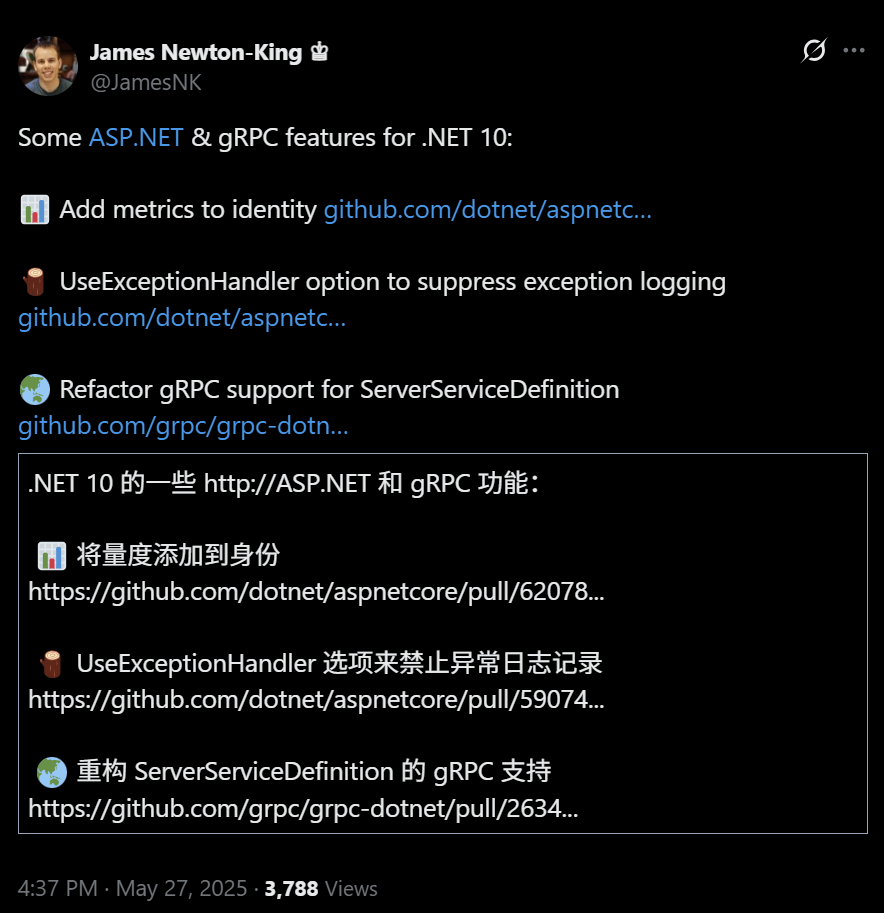

## 国内文章
### .NET 的全新低延时高吞吐自适应 GC - Satori GC

https://www.cnblogs.com/hez2010/p/18889954/the-new-satori-gc-for-dotnet

该文章深入探讨了C#中的垃圾回收(GC)机制，尤其是STW问题。GC自动管理内存，但需要暂停程序以清理无效对象。文章介绍了Workstation GC和Server GC的优缺点，并说明了新引入的DATAS GC如何在优化内存占用的同时缩短暂停时间。尽管如此，开发者仍然期望GC能够同时具备高吞吐量和短暂停止时间。为此，Satori GC被提出，旨在实现低延时和高吞吐，虽然其实现面临挑战。这篇文章提供了关于不同GC模式的详细技术分析，适合需要深入理解GC的读者。

### 聊一聊 微软的裁员计划对技术团队的冲击

https://www.cnblogs.com/shanyou/p/18886030

微软的裁员计划显著影响了.NET和Python开发团队，特别是Python团队遭受重创。裁员导致.NET团队核心成员流失，进而影响MAUI项目和TypeScript生态的维护。AI工具的普及使得基础编码岗位减少，微软计划将更多资源投入到AI基础设施建设中。Python团队解散直接中断了性能优化项目，使得开源生态的维护压力转移至社区。开发者需转型为架构设计和AI工具整合，关注微软战略重心岗位。微软的裁员反映出技术行业向AI驱动的高效协作转型。未来，掌握AI协作能力将是职业发展的关键。

### 一个基于 C# 编写的事件驱动、具备专业水准的算法交易平台(量化交易引擎)

https://www.cnblogs.com/Can-daydayup/p/18891942

本文介绍了Lean，一个基于C#的开源算法交易平台。Lean采用事件驱动和模块化设计，支持在多个金融市场上进行回测和实盘交易。开发者可通过命令行界面直接管理项目和执行算法交易相关任务。Lean内置插件点，以简化交易策略开发。项目提供源代码和在线文档，鼓励用户参与和支持。该项目已被列入C#/.NET优秀项目，适合量化开发者使用。

### 用 Sidecar 容器为 .NET Core 应用做诊断和性能分析

https://www.cnblogs.com/chenyishi/p/18886607

.NET Core 应用在 Kubernetes 中流行，但传统日志无法定位性能问题。从.NET Core 3开始，微软推出一系列跨平台诊断工具，包括 dotnet-counters、dotnet-dump 和 dotnet-trace。这些工具通过诊断服务器与目标进程通信。在容器环境中，可以使用 Sidecar 容器来运行诊断工具，避免镜像体积增大并便于升级。本文案例通过创建一个 Worker Service 应用，展示如何使用 Sidecar 模式解决访问主容器进程、共享/tmp目录和持久化诊断数据的问题。最后提供了 Kubernetes 部署设计的 YAML 片段，确保工具运行和存储持久化。

### 【译】Visual Studio 2022 v17.14 现已正式发布！

https://www.cnblogs.com/MeteorSeed/p/18888581

Visual Studio 2022 17.14 正式发布，旨在提升开发者的效率和生产力。新版本引入 GitHub Copilot Agent 模式，支持自然语言与 Visual Studio 对话以完成复杂编码任务。MCP Support 提供工具和数据的结构化访问。AI 文档注释生成能自动为 C++ 和 C# 函数加入注释。调试功能增强，支持实时预览和 MAUI 应用调试。Git 工具也有所改进，让版本控制更方便。未来将采取每月发布节奏，以快速迭代新功能和改进体验。

### SuperSocket 2.0 的发布标志着.NET Socket 服务器框架迈入了一个全新的时代

https://www.cnblogs.com/shanyou/p/18894166

SuperSocket团队于2025年4月20日发布SuperSocket 2.0，这是为现代.NET应用程序构建的高性能可扩展套接字服务器框架。自2008年成立以来，SuperSocket经历了十年的发展，已成长为一个功能丰富的框架。2.0版本完全基于现代.NET，利用System.IO.Pipelines实现了零拷贝数据处理，提升了网络数据处理的吞吐量和内存效率。它支持云原生环境，具备优秀的中间件和日志记录功能。此外，模块化设计允许开发者选择所需组件，框架进一步精细化。文中包含了SuperSocket的发展历程，展示其逐步演进的过程。

### .NET外挂系列：2. 了解强大的 harmony 注解特性

https://www.cnblogs.com/huangxincheng/p/18883360

本文探讨了harmony外挂在.NET高级调试中的应用，重点讲述了HarmonyPatch注解特性的使用。作者解释了HarmonyPatch作为harmony与目标类之间的桥梁，提供了20个重载方法以适应不同的目标方法定位需求。这些重载方法覆盖了95%的应用场景，具有很强的灵活性和实用性。通过这些特性，可以有效优化前文讨论的外挂功能，提升开发效率和调试能力。

### C#实现自己的MCP Client

https://www.cnblogs.com/chingho/p/18888423

文章介绍了如何使用C#实现MCP Client。首先，作者创建了一个控制台项目，并选择了.Net 8作为框架。然后，添加了最新的MCP SDK依赖库。接着，文章通过代码展示了如何创建SSE客户端实例并获取工具列表。这段代码通过McpClientFactory创建客户端实例，并调用ListToolsAsync方法输出功能列表。文章提供了实际的代码示例及运行效果，强调MCP Server使用Sse协议，后续将详细解释自定义MCP Server的内容。

### .NET外挂系列：4. harmony 中补丁参数的有趣玩法(上)

https://www.cnblogs.com/huangxincheng/p/18888415

本文聚焦于.NET中的Harmony注入点的参数解析，介绍了十类参数及其用途。主要参数包括__instance、__result和__state等，它们分别用于访问方法实例、获取修改返回值和传递自定义数据。文章通过示例代码展示如何将新线程设为后台线程，从而提高程序退出的流畅性。此外，作者还探讨了使用静态字段记录执行时间。此文章对开发者熟悉Harmony工具及其在调试中的应用大有裨益。

### 一个基于 ASP.NET Core 实现的领域驱动设计落地战术框架

https://www.cnblogs.com/Can-daydayup/p/18886650

本文介绍了基于ASP.NET Core的领域驱动设计框架netcorepal-cloud-framework。该框架支持领域驱动设计、CQRS、事件驱动、分布式事务和多租户环境，旨在帮助企业快速构建技术框架并探讨DDD理念。框架提供灵活配置的网关、快速开发工具和微服务架构实践。用户可使用NetCorePal.Template工具创建项目并访问其GitHub开源地址获得更多功能和特性。该项目已列入C#/.NET优秀项目，提升开发效率。相关文档与源码也提供给用户。

### C#线程池核心技术：从原理到高效调优的实用指南

https://www.cnblogs.com/code-daily/p/18886677

本文深入探讨了多线程编程中的线程池技术。在现代软件开发中，多线程能显著提升应用性能。线程池通过预创建与重用线程，减少线程管理开销。.NET 的 System.Threading.ThreadPool 类支持任务异步执行和动态调整线程数量，同时监控其状态。线程池降低了资源消耗，提升了响应速度，并简化了开发过程。对于处理并发 Web 请求、执行后台任务和并行计算等场景，线程池展现出明显优势。文章还阐述了线程池配置的基本方法，如设置最小/最大线程数，确保有效的资源分配与利用。

### C#/.NET/.NET Core技术前沿周刊 | 第 38 期(2025年5.12-5.18)

https://www.cnblogs.com/Can-daydayup/p/18884868

这篇文章介绍了C#/.NET/.NET Core领域的前沿技术和优秀项目，提供多种资源供开发者学习和提高。文章涵盖了基于.NET的开源软件，包括拦截和修改WinSock封包的工具，以及支持Ant Design和Bootstrap的UI组件库。同时，文章还讨论了使用VS Code进行.NET应用的开发及其优势。最后，文章提到了.NET 10的最新预览，鼓励开发者及时跟进这些技术动态，提升开发效率和质量。

### C#网络编程(六)----Socket编程模型

https://www.cnblogs.com/lmy5215006/p/18877083

Socket是计算机网络中的关键编程接口，简化网络通信。应用程序通过Socket API发送和接收数据，避免复杂操作。FD和Handle分别代表Linux和Windows中的资源管理方式，FD标识文件和套接字，而Handle范围更广。BIO模型为传统I/O模型，读取和写入时阻塞，直到操作完成，可能导致客户端连接滞后。代码示例展示了这种阻塞现象和C10K问题的处理方法，建议使用多线程处理不同客户端连接。整体内容深入浅出，兼顾理论和实践，适合技术人员学习。

### WinDbg 分析 .NET Dump 线程锁问题

https://www.cnblogs.com/chenyishi/p/18894206

本文详细介绍了如何使用 WinDbg 工具定位 .NET 应用程序中的高 CPU 占用问题。首先，加载 SOS 扩展并确认所调试的 .NET 版本。接着，使用 !runaway 命令查看 CPU 占用高的线程，再通过 ~* k 命令查看所有线程的调用堆栈，分析活跃线程及阻塞线程的特征。文中强调找到等待资源和频繁 GC 的影响，最后提供具体线程分析方法。通过这些步骤，可以有效识别导致 CPU 占用异常的因素。该方法稳定高效，适用于高 CPU dump 分析。

### .NET外挂系列：3. 了解 harmony 中灵活的纯手工注入方式

https://www.cnblogs.com/huangxincheng/p/18886478

本文讨论了C# .NET中的注解特性局限性及其解决方案。尽管Harmony库提供了20个重载方法，但仍无法覆盖所有情况。特别是对于一些内部不可访问的类，开发者只能使用反射获取类型信息。通过分析ServiceProviderEngineScope类的使用，作者发现内存问题源于未释放的作用域。为了解决此问题，建议使用TargetMethod函数批量返回需要patch的方法。该文深入剖析了实际问题及其解决策略，具有一定的技术深度和实用性。整体结构清晰，方便理解，适合相关开发人员参考。

### 重磅消息，微软宣布 VS Code Copilot 开源，剑指 Cursor！

https://www.cnblogs.com/Can-daydayup/p/18888823

微软宣布将 GitHub Copilot Chat 扩展的代码开源，以 MIT 许可证发布，并将其 AI 功能整合进 VS Code 核心。此举旨在将 VS Code 打造成一个开源 AI 编辑器。开源的原因包括降低依赖独家提示策略的必要性、提供透明的数据收集和改善安全性。此举还希望支持社区开发者，简化扩展的构建和调试过程。未来几周，微软将发布相关代码，保持卓越性能和用户体验。

### .NET外挂系列：6. harmony中一些实用的反射工具包

https://www.cnblogs.com/huangxincheng/p/18892412

本文介绍了反射工具包 AccessTools，强调其在 .NET 调试中的实用性。文章通过示例展示了如何使用 AccessTools 进行反射操作，包括获取方法和属性信息。主要全程围绕 AccessTools 的应用，帮助读者理解其功能及用法。内容清晰易懂，提供了有效的代码示例，便于读者学习和掌握相关技术。

### .NET外挂系列：5. harmony 中补丁参数的有趣玩法(下)

https://www.cnblogs.com/huangxincheng/p/18889814

本文介绍了 Harmony 库用于方法注入的技术，详细解释了不同参数，如 __result 和 __args 的用法。文中通过示例演示了如何拦截 DateTime.Now 和 HttpClient 的底层方法 SendAsync，从而修改其返回值和参数。文章核心在于探讨参数的破坏性及其潜在的黑客应用，适合对编程深感兴趣的读者。整篇文章具有较高的技术深度和实用性，清晰且具原创性，内容新颖及时，引用示例丰富。

### .NET外挂系列：8. harmony 的IL编织 Transpiler

https://www.cnblogs.com/huangxincheng/p/18894299

本文介绍了一种通过Transpiler修改IL代码的技术，提升了代码注入的灵活性。作者介绍了使用ILSpy、日志和DeepSeek工具的实用性，并给出了通过IL编织实现简单数学运算修改的具体案例。示例代码展示了如何将加法操作替换为减法，详细说明了IL代码的结构和修改过程。文章深入探讨IL的底层逻辑，对熟悉IL的读者具有较高价值。

### 一个使用 WPF 开发的 Diagram 画板工具(包含流程图FlowChart，思维导图MindEditor)

https://www.cnblogs.com/Can-daydayup/p/18893770

本文介绍了一个开源的WPF开发工具AIStudio.Wpf.Diagram，用于创建流程图和思维导图。项目基于WPF-Diagram-Designer，采用Fluent.Ribbon作为UI框架。WPF是一个针对Windows应用程序的强大框架，支持丰富的用户界面开发。读者可以访问项目的Gitee地址查看源码和运行效果，还能够关注优秀项目以提高开发效率和质量。该项目已被纳入C#/.NET优秀项目的精选列表，鼓励开发者推荐优秀平台。

### .NET 10 进展之  CoreCLR Interpreter

https://www.cnblogs.com/shanyou/p/18895698

该文章探讨了Mono解释器在.NET 10中的重要性及其与CoreCLR解释器的关系。Mono作为.NET项目的一个实现，最初设计用于跨平台环境。文章回顾了Mono解释器的发展历程、工作原理及应用场景，强调其在动态代码执行中的优势，如支持热加载和在受限环境中的灵活性。CoreCLR解释器旨在整合Mono解释器的特性，提供更一致的开发经验和高效的运行时性能。

### VMware Workstation 部署企业级 AD 域、DNS、DHCP 系统操作指南

https://www.cnblogs.com/Johny-zhao/p/18890099

该文章详细规划了虚拟机主机环境，列出了主机角色、操作系统及配置，同时提供了部署步骤，包括创建虚拟机、安装操作系统、部署 Active Directory 域服务和 DHCP 服务器。内容清晰易懂，技术深入，涵盖实用的命令和配置细节，具有一定的原创性和时效性。整体可读性较好，适合技术人员参考。但缺乏充分引用文献支持，影响学术性。

### 游戏中常用的平滑曲线函数：高中生也能看懂的代码分析

https://www.cnblogs.com/TonyCode/p/18893971

本文介绍了一种在2D游戏中实现平滑移动的函数。通过用户输入确定移动方向，设置目标速度，并运用插值函数Lerp实现当前速度向目标速度的平滑过渡，以解决速度突变与卡顿问题。插值系数依据帧率动态调整，利用指数函数提高过渡的流畅度。这种算法对角色移动、相机跟随、UI动画等都是有效的。文章中通过代码和数学原理解析，体现了编程与数学的结合之美。

### .NET 原生驾驭 AI 新基建实战系列(八)：总结篇 ── 数据库技术的革命：从结构化到非结构化再到智能化的演进

https://www.cnblogs.com/code-daily/p/18872361

随着信息技术发展，数据库技术经历了从结构化到非结构化，再到智能化的变革。结构化数据库以关系模型为基础，提供数据一致性和高效查询，但面对数据量增长时显示出扩展性和灵活性不足的短板。为解决这些问题，非结构化数据库应运而生，强调高可用性和灵活性，但亦存在复杂查询能力差的缺陷。智能化数据库，如向量数据库，专为处理高维向量数据而设计，支持AI应用，提升了实时查询能力，成为AI的重要基础设施。这一进程标志着数据库技术的重大转型。

### .NET外挂系列：7. harmony在高级调试中的一些实战案例

https://www.cnblogs.com/huangxincheng/p/18893322

这篇文章探讨了Unity调试中的ConcurrentBag问题，着重讲述了其内存暴涨现象及相关调试技巧。文章以实际案例为基础，通过windbg展示了ConcurrentBag的内部结构，并阐明了如何利用Harmony调试工具深入分析数据的添加过程。作者通过给出详细的代码示例，引导读者理解调试的复杂性和Harmony的应用，旨在帮助开发者解决类似问题。整体内容紧密，具有实用性和技术深度。

### 凯亚物联网如何向设备发送读写指令

https://www.cnblogs.com/fanliang11/p/18889864

文章介绍了凯亚平台的开发背景，基于.NET8.0的surging微服务引擎，支持多种协议的物联网平台。内容详尽地描述了平台的功能，包括设备管理、告警、消息通知和数据可视化。此外，提供了测试工具和相应的使用指南。文章包含了相关的链接和资源，指导用户如何进行测试和搭建系统。

## 主题
### 宣布推出 dotnet run app.cs - 一种更简单的 C# 和 .NET 10 入门方式 - .NET 博客
https://devblogs.microsoft.com/dotnet/announcing-dotnet-run-app/

- [我在 .NET 10 中尝试了基于文件的应用程序](https://zenn.dev/monry/articles/20250530-file-based-apps)

### Visual Studio 中的扩展管理器更新 - Visual Studio 博客
https://devblogs.microsoft.com/visualstudio/extension-manager-updates-in-visual-studio/

## 发布
- [aws/aws-sdk-net](https://github.com/aws/aws-sdk-net)
    - [3.7.1052.0](https://github.com/aws/aws-sdk-net/releases/tag/3.7.1052.0)、[3.7.1053.0](https://github.com/aws/aws-sdk-net/releases/tag/3.7.1053.0)、[3.7.1054. 0](https://github.com/aws/aws-sdk-net/releases/tag/3.7.1054.0)， [3.7.1055.0](https://github.com/aws/aws-sdk-net/releases/tag/3.7.1055.0)， [3.7.1056. 0](https://github.com/aws/aws-sdk-net/releases/tag/3.7.1056.0)， [4.0.20.0](https://github.com/aws/aws-sdk-net/releases/tag/4.0.20.0)， [4.0.21.0]( https://github.com/aws/aws-sdk-net/releases/tag/4.0.21.0)、[4.0.22.0](https://github.com/aws/aws-sdk-net/releases/tag/4.0.22.0)、[4.0.23.0]( https://github.com/aws/aws-sdk-net/releases/tag/4.0.23.0)、[4.0.24.0](https://github.com/aws/aws-sdk-net/releases/tag/4.0.24.0)
- [Azure/azure-sdk-for-net](https://github.com/Azure/azure-sdk-for-net)
    - [Azure.ResourceManager.Network_1.11.0](https://github.com/Azure/azure-sdk-for-net/releases/tag/Azure.ResourceManager.Network_1.11.0)
- [CommunityToolkit/Aspire](https://github.com/CommunityToolkit/Aspire)
    - [v9.5.0](https://github.com/CommunityToolkit/Aspire/releases/tag/v9.5.0)
- [DataDog/dd-trace-dotnet](https://github.com/DataDog/dd-trace-dotnet)
    - [v3.17.0](https://github.com/DataDog/dd-trace-dotnet/releases/tag/v3.17.0)， [v3.18.0](https://github.com/DataDog/dd-trace-dotnet/releases/tag/v3.18.0)
- [googleapis/google-cloud-dotnet](https://github.com/googleapis/google-cloud-dotnet)
    - [Google.Cloud.Bigtable.V2-3.18.0](https://github.com/googleapis/google-cloud-dotnet/releases/tag/Google.Cloud.Bigtable.V2-3.18.0)， [ Google.Cloud.Commerce.Consumer.Procurement.V1-1.5.0]( https://github.com/googleapis/google-cloud-dotnet/releases/tag/Google.Cloud.Commerce.Consumer.Procurement.V1-1.5.0)、[Google.Cloud.Container.V1-3.34. 0](https://github.com/googleapis/google-cloud-dotnet/releases/tag/Google.Cloud.Container.V1-3.34.0)，[Google.Cloud.Dlp.V2-4.18. 0](https://github.com/googleapis/google-cloud-dotnet/releases/tag/Google.Cloud.Dlp.V2-4.18.0)，[Google.Cloud.StorageTransfer.V1-2.9. 0](https://github.com/googleapis/google-cloud-dotnet/releases/tag/Google.Cloud.StorageTransfer.V1-2.9.0)

## 文章、幻灯片等

### VisualStudio.Extensibility：编辑器分类和用户提示更新 - Visual Studio 博客
https://devblogs.microsoft.com/visualstudio/visualstudio-extensibility-editor-classification-and-updates-to-user-prompt/

### 制作一个使用 stdio 作为通信方式的 C# MCP 服务器 Streamable HTTP(或 SSE)
https://zenn.dev/j_sakamoto/articles/e10437f6155069

### [Unity，C#] 事件驱动介绍 [GIF Ali]
https://zenn.dev/gameshitai/articles/a5763c09a9d542
### 如何在 C# 中使用公钥身份验证实现 SFTP 文件传输
https://zenn.dev/mitakaosamu/articles/csharp-sftp-publickey-auth

### [C#] 结构键的 IEquatable [带基准测试]
https://zenn.dev/gameshitai/articles/d78217cfcc473f

### C# - MoTW 和 Zone.Identifier 流
https://qiita.com/chai0917/items/3b23d104ebaded970892

### 如何从 MCP 检查器引用用 C# 编写的 stdio MCP 服务器
https://zenn.dev/j_sakamoto/articles/bd3214ead186d6

### 语义内核 008 “与 DI 容器集成” 的不寻常介绍
https://zenn.dev/microsoft/articles/semantickernel-edu-008

### 当心 ReactiveCollection 引用替换
https://qiita.com/sebayashi-tomoya/items/1f71e19f6587503f193e

### 语义内核 007 “filter” 简介
https://zenn.dev/microsoft/articles/semantickernel-edu-007

### 尝试用图像分析来发现错误
https://qiita.com/masayasu_t/items/d6089411adf78d6cdcae

### 在 C# 顶级语句中，string[] args 是隐式定义的，它允许你引用命令行参数
https://qiita.com/RyotaMurohoshi/items/fe0d57baa8dd649edbf5

### [实验] 在 C# 13.0 或更早版本中运行 dotnet run file.cs
https://zenn.dev/inuinu/articles/before-csharp13-dotnet-run-file

### 获得独立于设备的“几乎”准确时间
https://zenn.dev/sator_imaging/articles/6e1bd822a82d31

### xUnit 山野兽道上被困沼泽的故事 ~Challenge to ExceptionFact~
https://qiita.com/cozyupk/items/065d33d95d5bf548fb02

### 改进扩展中的命令 - Visual Studio Blog
https://devblogs.microsoft.com/visualstudio/improve-the-commands-in-your-extensions/

### 尝试 Semantic Kernel 的多代理编排(也许这才是真正的交易？ )
https://zenn.dev/microsoft/articles/semantickernel-orchestrator-001

### 使用 × Task 中的错误以及如何防止它们
https://qiita.com/laughter/items/7a4de6fa031be8c7aa3c

### C# 中的人工智能与语义内核 (5)
https://zenn.dev/yakumo3/articles/de7e1c6d468e56

### 断路器策略微调最佳实践 - .NET 博客
https://devblogs.microsoft.com/dotnet/circuit-breaker-policy-finetuning-best-practice/

### 将 docker-compose 文件转换为 .NET Aspire
https://andrewlock.net/converting-a-docker-compose-file-to-aspire/

### C# 中的数值类型
https://qiita.com/abetakahiro123/items/cca8897d88530ba29600

### 语义内核 001 “函数” 简介
https://zenn.dev/microsoft/articles/semantickernel-edu-001

- [语义内核 002 “模板引擎”简介](https://zenn.dev/microsoft/articles/semantickernel-edu-002)
- [语义内核 003 “调用 AI 的函数”简介](https://zenn.dev/microsoft/articles/semantickernel-edu-003)
- [Semantic Kernel 004 “插件”简介](https://zenn.dev/microsoft/articles/semantickernel-edu-004)
- [语义内核 005 简介“使用聊天补全 API”](https://zenn.dev/microsoft/articles/semantickernel-edu-005)
- [语义内核 006 “内核”简介](https://zenn.dev/microsoft/articles/semantickernel-edu-006)

### . 让我们分享一下 .NET 生态系统和云！ - 奇塔
https://qiita.com/official-events/5dfafbcc8ed3a3ec0778

## 库、存储库、工具等
### nuskey8/GemiNet：适用于 .NET 和 Unity 的 Gemini 开发人员 API 客户端
https://github.com/nuskey8/GemiNet

- [[C#] GemiNet - 用于 .NET / Unity 的 Gemini API 客户端库](https://zenn.dev/nuskey/articles/library-geminet)

### ObviousPiranha/Jawbone.Sockets： 游戏引擎的 UDP 和 TCP 套接字库

https://github.com/ObviousPiranha/Jawbone.Sockets

- [ObviousPiranha介绍](https://dev.to/thebuzzsaw/introducing-jawbone-sockets-ah0)

### 推特
https://x.com/jamesnk/status/1927283039731679463?s=12

## C# .NET 交流群

相信大家在开发中经常会遇到一些性能问题，苦于没有有效的工具去发现性能瓶颈，或者是发现瓶颈以后不知道该如何优化。之前一直有读者朋友询问有没有技术交流群，但是由于各种原因一直都没创建，现在很高兴的在这里宣布，我创建了一个专门交流.NET性能优化经验的群组，主题包括但不限于：

* 如何找到.NET性能瓶颈，如使用APM、dotnet tools等工具
* .NET框架底层原理的实现，如垃圾回收器、JIT等等
* 如何编写高性能的.NET代码，哪些地方存在性能陷阱

希望能有更多志同道合朋友加入，分享一些工作中遇到的.NET问题和宝贵的分析优化经验。**目前一群已满，现在开放二群。**可以加我vx，我拉你进群: **ls1075** 另外也创建了**QQ Group**: 687779078，欢迎大家加入。