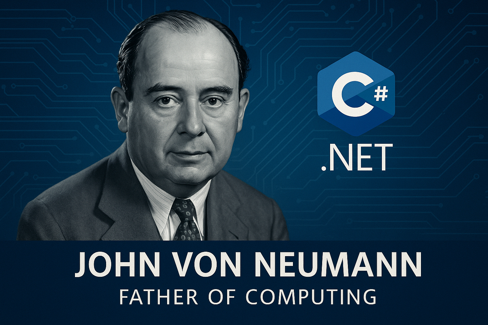

## 国内文章

### 精选 5 款 .NET 开源、功能强大的工作流系统，告别重复造轮子！

https://www.cnblogs.com/Can-daydayup/p/19038600

本文推荐了5款适用于.NET的开源工作流系统，旨在帮助开发者提高工作效率。其中包括OpenAuth.Net、CCFlow、AntFlow.NET、elsa-core和Platform，它们各具特色，适合不同需求使用。OpenAuth.Net是一个功能强大的权限管理框架，CCFlow灵活且符合中国市场，AntFlow.NET提倡低代码开发，elsa-core支持多种工作流特性，Platform注重动态接口。所有项目均适合中小企业及个人开发者。文章最后提供了相关项目的GitHub和Gitee链接，鼓励大家进行推荐。

### 美丽而脆弱的天体运动：当C#遇见宇宙混沌

https://www.cnblogs.com/sdcb/p/19031268/csharp-nbody

文章介绍了一个使用C#和ode45高精度常微分方程求解器及Direct2D渲染的开源项目n-body。该项目模拟了二维天体运动，通过太阳-地球-月球模型展示了天体运动的和谐与复杂性。文章提到初始条件对运动轨迹的敏感性，并通过微调参数展示了“蝴蝶效应”。此外，模拟器能够生成任意数量的星体进行稳定运动，探讨了三体问题的复杂性。整体上，文章结合了技术细节与宇宙理论，呈现了一幅宇宙的迷人景象。

### [原创]《C#高级GDI+实战：从零开发一个流程图》第09章：增加贝塞尔曲线，上、下、左、右连接点

https://www.cnblogs.com/lesliexin/p/19033113

本文介绍了如何在绘图中添加贝塞尔曲线和多连接点的功能。首先，课程描述了贝塞尔曲线的基本需求，包括起点、两个控制点和终点。然后，作者简要阐述了如何在画布中实现此功能，并通过代码示例展示了实现过程。接着，文章扩展了连线功能，支持上、下、左、右四个连接点，并说明了基类和派生类的相应修改。整体内容通俗易懂，适合有一定基础的读者。

### 记一次C#平台调用中因非托管union类型导致的内存访问越界

https://www.cnblogs.com/yangtb/p/19031663

文章讨论了C#代码中局部变量值意外变为null的现象，聚焦于COM类型IPropertyStore和PropVariant的封装问题。作者通过分析发现，由于PropVariant结构体的大小未正确申明，导致非托管代码的访问越界，从而影响到其他变量的值。尝试改变PropVariant的大小后，问题得到解决。文章深入探讨了非托管代码与托管代码的交互机制，揭示了局部变量的排列顺序对程序运行的影响，彰显了对IL的理解与应用。

### AES 加密模式演进：从 ECB、CBC 到 GCM 的 C# 深度实践

https://www.cnblogs.com/sdcb/p/19032244/aes-encryption-modes-evolution-ecb-cbc-gcm-csharp

在数字化世界中，数据安全非常重要。高级加密标准（AES）是现代对称加密的基础。AES 是一种块加密算法，处理数据时需要引入块加密模式以加密任意长度的数据。本文回顾了 AES 块加密模式的历史，分析了 ECB、CBC 和 GCM 三种模式的优缺点，并提供了 C# 代码示例。ECB 模式实现简单、可并行化，但安全性低。文章探讨了 70 年代以来这些模式的发展，为读者提供了实用的密码学知识与编码实例。

### C#/.NET/.NET Core技术前沿周刊 | 第 49 期（2025年8.1-8.10）

https://www.cnblogs.com/Can-daydayup/p/19031853

本周刊聚焦于C#/.NET/.NET Core领域的最新技术文章与资源，助力开发者提升技能与视野。文章涵盖了使用ScottPlot在.NET WinForms中展示大型数据集，.NET和.NET Framework的服务更新，值得学习的Copilot Chat提示，分布式作业调度系统Sundial，C# 14的新功能，以及多款基于.NET的开源工具，如GeekDesk和AntFlow.NET。这些资源将帮助开发者提高工作效率和代码质量。

### C#中的多级缓存架构设计与实现深度解析

https://www.cnblogs.com/token-ai/p/19034487

本文深入探讨C#中的多级缓存架构设计与实现，强调了在现代分布式应用中，加强缓存性能的重要性。多级缓存通过内存缓存和Redis的协同工作，提高数据访问效率，并降低数据库负载。文章详细阐述了缓存层次结构、缓存一致性理论、以及缓存穿透、击穿、雪崩等问题及其解决方案。此外，文章提供了系统架构流程图，清晰展示了多级缓存的整体架构和同步机制，为软件开发者提供了实用的参考。

### 记一次 .NET 某汽车控制焊接软件 卡死分析

https://www.cnblogs.com/huangxincheng/p/19033409

文章讨论了一个窗体程序的卡死问题，提供了故障分析的方法。通过调用栈分析，识别了主线程的执行路径，指出可能的卡死原因。文章内容技术性强，适合开发人员参考。它通过实际案例展示了故障排查过程，具有实际应用价值。

### SQL Server也能玩正则表达式？二开实现比MySQL更强大的文本处理能力

https://www.cnblogs.com/samlin/p/19036947

文章探讨在SQL Server中实现正则表达式的方法。通过开启CLR，作者详细说明了如何编写C#程序集以扩展SQL Server的功能。文章分为需求背景、思考过程、实现过程和总结四个部分。作者比较了MySQL和PostgreSQL的正则表达式，指出它们无法满足非结构化内容的数值判断。通过C#编程，SQL Server也能实现功能更强的正则表达式，扩展了其数据处理能力。

### C#&#160;WPF&#160;内置解码器实现&#160;GIF&#160;动图控件

https://www.cnblogs.com/BluePointLilac/p/19029227

本文探讨了WPF中播放动态GIF的多种方法。使用MediaElement控件时，缺乏透明支持。通过WindowsFormsIntegration嵌入WinFormPictureBox也不支持透明。推荐使用NuGet包WpfAnimatedGif，能够支持透明。作者提到XamlAnimatedGif是性能更好且跨平台的选择。WPF虽然不支持GIF动图的原生解码，但提供GifBitmapDecoder，用于获取元数据和帧信息。文中详细介绍了如何判断GIF循环次数、获取画布逻辑尺寸及帧信息，对每一帧处理方法进行了说明。整体内容技术深度较高，实用性强，能够帮助开发者解决实际问题。

### 告别手动更新！WinForm 应用轻松集成自动升级功能 (HHUpdateApp)

https://www.cnblogs.com/1312mn/p/19021237

本文介绍了HHUpdateApp，一个针对.NET桌面应用的轻量级自动更新工具。该工具简化了传统应用更新流程，用户无需复杂脚本即可完成自动升级。HHUpdateApp通过指定的JSON文件获取版本信息，实现自动下载和安装更新包，提升用户体验。支持静默更新功能，允许后台升级，确保用户无干扰。配置简单，只需填写相关参数即可开始使用。整体设计旨在提高桌面应用程序的更新效率。该工具适合所有希望简化更新流程的开发者。

### 当加密ID需要变成Guid：为什么我选择了AES-CBC而非GCM？

https://www.cnblogs.com/sdcb/p/19034355/aes-gcm-cbc-pragmatic-choice

本文探讨了GCM与CBC在加密中的选择，通过作者在Sdcb.Chats项目中的实际经验分析，指出GCM的优越性，但在特定场景下可能不适用。GCM的优势在于其认证加密、性能高及不需填充。然而，固定的Nonce与GCM要求冲突，使得在确保ID唯一性与防止信息泄露时，使用CBC可能更实际。文章强调技术选型的复杂性，需要在深入理解原理的基础上做出合理权衡。

### VS Code 中把「自己部署的 Coder 模型」变成 AI 编程助手

https://www.cnblogs.com/wang_yb/p/19037002

本文介绍了如何在VS Code中部署和使用Qwen-Coder的模型作为AI编程助手。首先安装Continue插件，支持离线运行且保护源码隐私。接着配置本地模型，包括模型名称、版本及API设置。支持的功能包括对话、代码补全、编辑等，并整合上下文信息如文档、终端输出等，以提升代码生成效果。最后，用户可通过交互生成代码并直接应用于工程中，使得开发过程更加高效和安全。

### 如何正确使用SetThreadExecutionState来阻止Windows进入睡眠

https://www.cnblogs.com/yangtb/p/19026293

这篇文章介绍了如何使用SetThreadExecutionState函数来阻止Windows系统自动睡眠。文章详细讲解了该函数的原型、不同EXECUTION_STATE状态的作用，以及如何使用这些状态来控制系统睡眠和显示。作者深入分析了ES_SYSTEM_REQUIRED、ES_DISPLAY_REQUIRED和ES_AWAYMODE_REQUIRED的具体应用和交互行为。文中提供了代码示例和实际验证结果，帮助读者理解各状态的影响。整体上，文章条理清晰，信息实用。

### WPF优秀项目推荐：Stylet 一个非常轻量但强大的 ViewModel-First MVVM 框架

https://www.cnblogs.com/mingupupu/p/19033566

Stylet是一个针对WPF的MVVM框架，强调ViewModel优先，简化了MVVM开发过程。它提供灵活性和可维护性，易于测试。框架功能包括ViewModel自动绑定、Action应用于事件、简化的属性通知以及内置IOC容器。Stylet允许用户通过简单的写法实现复杂功能，提升开发效率。同时，官方文档和示例项目提供快速入门指导。整体布局清晰，易于新人理解，适合需要高效编码的开发者。

### 一款基于 WPF 开源、轻量级的 Markdown 编辑器

https://www.cnblogs.com/Can-daydayup/p/19036727

MdXaml 是一款基于 WPF 的开源 Markdown 编辑器，提供直观高效的编辑体验。Markdown 是一种轻量级标记语言，广泛应用于各种文档。它的语法结构简单，包括标题、列表、文本格式化等。MdXaml 的项目源代码和运行效果已公开，便于用户查看和使用。该项目获得了C#/.NET的推荐，并关注于最新动态，提升开发效率和质量。

### WPF Stylet可以如何实现导航功能？

https://www.cnblogs.com/mingupupu/p/19039195

本文总结了Stylet中的导航Demo，介绍了ShellView、HeaderView、Page1View与Page2View的布局与实现。作者讲解了如何通过XAML绑定实例及ActiveItem属性，以实现不同视图的导航。示例代码展示了NavigationController的基本构造，强调如何创建Page1ViewModel和Page2ViewModel的工厂函数。整体内容具有较强的技术深度和实用性，适合C# .NET ASP.NET开发者学习与参考。

### 如何更好地使用AI编程？

https://www.cnblogs.com/mingupupu/p/19038290

文章探讨了AI编程在使用Stylet库实现WPF导航功能中的困难。尽管AI的编码能力日益增强，但在小众库如Stylet中表现欠佳。作者分享了使用Qwen Code的过程，包括尝试和失败，强调AI需先学习相关内容有效提高准确性。最终，尽管功能实现成功，视觉效果欠佳，但作者指出，AI的学习能力可以弥补其不足。这篇文章为如何利用AI辅助编程提供了有趣的见解。

### VKProxy 集成 OpenTelemetry

https://www.cnblogs.com/fs7744/p/19035113

OpenTelemetry是一个集合API、SDK和工具的系统，专为采集和导出遥测数据设计。VKProxy集成了OpenTelemetry，简化了数据采集流程。本文简要介绍了在ASP.NET Core中使用OpenTelemetry的方法，包括链路、指标和日志的配置。示例代码展示了如何配置OpenTelemetry收集器和各种服务。日志记录的实现依赖于ILogger的抽象，指标则采用统一的Meter进行处理，支持Prometheus等方案。文章参考了OpenTelemetry和ASP.NET Core的文档，提供了实际使用示例。

### 【译】Visual Studio 2015 停用：针对旧版本 Visual Studio 的支持提醒

https://www.cnblogs.com/MeteorSeed/p/19033435

Visual Studio 2015 的支持将于 2025 年 10 月 14 日结束，用户应升级到 Visual Studio 2022，以提高工作效率和安全性。旧版 Visual Studio 的扩展支持日期也已列出。Visual Studio 2015 及相关组件在停用后将不再接收任何更新或安全修复。用户需及时更新到最新版本以获取支持。同时，访问 Visual Studio Hub 获取最新资源和社区讨论。开发者反馈对于改进 Visual Studio 也至关重要。

### 【渲染流水线】[几何阶段]-[图元装配]以UnityURP为例

https://www.cnblogs.com/SmalBox/p/19040484

该文章讨论了Unity中的图元装配，描述了如何将离散顶点数据组装成完整的几何图元，如三角形和线段。文章介绍了输入输出数据，包括经变换的空间坐标和顶点属性。图元装配使用网格拓扑和索引缓冲区实现，提供了索引分组和顺序分组两个模式。文中还详细列出了Unity支持的各种图元类型及其拓扑连接规则。通过示例代码展示了不同图元类型的装配方式，结合URP的调用流程，提供了对图元装配的深入理解。

### 一步一步学习使用LiveBindings（11） 绑定到自定义外观的ListBox

https://www.cnblogs.com/lincats/p/19032685

本文介绍了如何使用LiveBindings绑定自定义外观的ListBox，适合中小型选项列表。步骤包括自定义ListBox的外观，以及在TGrid旁边放置TListBox以同步数据。文章详细讲解了通过LiveBindings Wizard创建绑定，调整布局，以及如何设计样式。作者提醒关注代码中的大小写，以确保在引用时无误。总体内容实用且易于理解，适合逐步学习LiveBindings。

### 【渲染流水线】[几何阶段]-[几何着色]以UnityURP为例

https://www.cnblogs.com/SmalBox/p/19037825

文章探讨了如何在Unity URP中自定义与处理图元，描述了通过着色器生成新几何体的流程。文章阐明了输入、处理和输出阶段的步骤，强调了图元操作机制中的增删控制和修改方式。提供了详细的Shader基础结构与代码示例，展示了典型应用如模型细分与轮廓线生成的实现。内容清晰，技术深度适中，适合具有一定基础的开发者进行学习与应用。

### WPF 实现支持动态调整高度的文本显示控件

https://www.cnblogs.com/wuty/p/19040401

本文描述了一个应用程序升级时，动态调整版本信息显示高度的需求。具体实现步骤包括创建一个Border，设置最大高度和最小高度限值。通过XAML代码示例展示了窗口的基本结构和控件的属性配置。这种方式允许在内容超出最大高度时自动显示滑动条，从而提高了用户体验。整体阐述清晰，切合实际需求，易于理解。

## 主题

### .NET 10 预览版 7 现已推出！ - .NET 博客
https://devblogs.microsoft.com/dotnet/dotnet-10-preview-7/

.NET 10 预览版 7 现已推出。

- BCL
  - 在 Windows 中的新进程组中启动进程
  - 带填充的 AES 密钥包装 (IETF RFC 5649)
  - ML-DSA
  - 复合ML-DSA
  - JSON 序列化器中的 PipeReader 支持
  - WebSocketStream
  - macOS(客户端)上的 TLS 1.3 支持

- 开发软件
    - 'any' 运行时标识符
- ASP.NET Core 和 Blazor
    - 异常处理程序诊断的抑制配置
    - 禁止 cookie 登录重定向到已知 API 端点
    - 改进的密钥身份验证
    - .localhost 顶级域名支持
    - 在 System.Text.Json 中使用 PipeReader 支持
    - 增强类和记录类型的验证
    - Blazor 改进
    - OpenAPI.NET 依赖升级到稳定版本
- .NET 毛伊岛
    - XAML 源生成器
    - MediaPicker 中的 EXIF 支持
    - SafeArea 改进
    - 辅助工具栏项
    - 新的控制 API
    - 删除已弃用的 API
- Windows 窗体
    - 修复了组合框上的深色模式渲染
    - 深色模式渲染改进和富文本框的已知限制
    - 对 PropertyGrid 深色模式的改进
- Windows 演示基础 (WPF)
    - 错误修复
    - 流畅的主题改进
    _ 实体框架核心
    - 改进了参数化集合的转换
    - 小改进和错误修复
- 容器映像
    - 在 SDK 镜像中的 PATH 中添加“dnx”

- [.NET 10 预览版中的 .NET MAUI 7 · dotnet/maui · 讨论 #31134](https://github.com/dotnet/maui/discussions/31134)

### Rider 2025.2 与 Junie、In-IDE OpenTelemetry、游戏开发升级等一起推出 | .NET Tools 博客
https://blog.jetbrains.com/dotnet/2025/08/14/rider-2025-2-is-here-with-junie-in-ide-opentelemetry-game-dev-upgrades-and-more/

Rider 2025.2 已经发布。

- Junie AI 编码代理(测试版)
- MCP 服务器连接
- 性能的新视角：重新构想监控和 OpenTelemetry
- 更好的调试
- 性能改进
    - 更快的调试器步骤执行
    - 改进内存使用率
- 游戏开发
    - Unity
        - 着色器调试
        - 混合模式调试
        - Unity Profiler 集成
    - 虚幻引擎
    - 戈多
- 代码分析和语言支持
    - 扩展的 C# 14 支持
    - Roslyn 支持
    - F# 改进
- Web 和数据库开发
    - 对 TypeScript-Go 语言服务器的实验性支持
    - 新的 SDK 风格的 SQL 项目支持
- 弃用和迁移
    - Mono 和 Unity 代码覆盖率
    - 动态程序分析

### ReSharper 和 .NET Tools 2025.2 已发布！ | .NET Tools 博客
https://blog.jetbrains.com/dotnet/2025/08/14/resharper-and-the-net-tools-2025-2-are-out/

ReSharper 和 .NET Tools 2025.2 现已推出。

- 进程外模式(公共预览版)
- 性能改进
    - 启动时即时导航
    - 更快的重命名重构
    - 更流畅的内联重构
    - 快速加载
    - Razor/Blazor 优化
- C# 14 支持
- 日志记录改进(ILogger 支持)
- 编码效率
- C++ 支持
- 持续集成
    - 弃用 TeamCity 扩展
- CQRS 验证(实验性)
- 对 dotTrace 和 dotMemory 的更改
    - 主要针对与 Rider 集成的改进
- dotCover 的更改
    - 移除支撑
        - Mono 和 Unity 代码覆盖率
        - IIS Express、WCF、WinRT、外部 .NET 进程、MAUI
    - 命令行运行器更新

有关进程外模式和其他性能改进，请参阅以下链接：

- [ReSharper 2025.2 中的更高级别性能改进 | .NET Tools 博客](https://blog.jetbrains.com/dotnet/2025/08/14/resharper-performance-improvements-2025/)

### 模型上下文协议 (MCP) 现已在 Visual Studio 🎉 中正式发布 - Visual Studio 博客
https://devblogs.microsoft.com/visualstudio/mcp-is-now-generally-available-in-visual-studio/
Visual Studio(17.14.13 及更高版本)中的 MCP 支持现已正式发布。

- 完整的 MCP 客户端集成
- 一级认证
- 连接到新服务器的简单方法
- 企业治理控制

有关更详细的功能，请参阅发行说明中的功能。

- [Visual Studio 2022 发行说明(2025 年 8 月)](https://learn.microsoft.com/en-us/visualstudio/releases/2022/release-notes?tabs=August)

### 从雷德蒙德到圣地亚哥：VS Live！ 要点、会话示例和后续计划 - Visual Studio Blog
https://devblogs.microsoft.com/visualstudio/from-redmond-to-san-diego-vs-live-highlights-session-examples-and-whats-next/

Visual Studio Live！ 活动亮点、会议以及有关圣地亚哥下一次活动的信息。

### 宣布推出 NuGet MCP 服务器预览版 - .NET 博客
https://devblogs.microsoft.com/dotnet/nuget-mcp-server-preview/

NuGet MCP 服务器现已提供预览版。

本文讨论如何使用 .NET 10 预览版 6 启动服务器、当前提供的功能以及与 Visual Studio 的集成。

### GPT-5 现已在 Visual Studio 中推出 - Visual Studio 博客
https://devblogs.microsoft.com/visualstudio/gpt-5-now-available-in-visual-studio/

GPT-5(预览版)现已在 Visual Studio 中提供。

GitHub Copilot Enterprise 和 Business 必须允许在其策略中使用模型。

## 发布
- [阿瓦洛尼亚UI/阿瓦洛尼亚](https://github.com/AvaloniaUI/Avalonia)
    - [11.3.4](https://github.com/AvaloniaUI/Avalonia/releases/tag/11.3.4)
- [aws/aws-sdk-net](https://github.com/aws/aws-sdk-net)
    - [3.7.1100.0](https://github.com/aws/aws-sdk-net/releases/tag/3.7.1100.0)， [3.7.1101.0](https://github.com/aws/aws-sdk-net/releases/tag/3.7.1101.0)， [3.7.1102. 0](https://github.com/aws/aws-sdk-net/releases/tag/3.7.1102.0)、 [3.7.1103.0](https://github.com/aws/aws-sdk-net/releases/tag/3.7.1103.0)、 [3.7.1104. 0](https://github.com/aws/aws-sdk-net/releases/tag/3.7.1104.0)， [3.7.1105.0](https://github.com/aws/aws-sdk-net/releases/tag/3.7.1105.0)， [4.0.68.0]( https://github.com/aws/aws-sdk-net/releases/tag/4.0.68.0)、 [4.0.69.0](https://github.com/aws/aws-sdk-net/releases/tag/4.0.69.0)、 [4.0.70.0]( https://github.com/aws/aws-sdk-net/releases/tag/4.0.70.0)、 [4.0.71.0](https://github.com/aws/aws-sdk-net/releases/tag/4.0.71.0)、 [4.0.72.0]( https://github.com/aws/aws-sdk-net/releases/tag/4.0.72.0)、[4.0.73.0](https://github.com/aws/aws-sdk-net/releases/tag/4.0.73.0)
- [Azure/azure-cosmos-dotnet-v3](https://github.com/Azure/azure-cosmos-dotnet-v3)
    - [3.53.0](https://github.com/Azure/azure-cosmos-dotnet-v3/releases/tag/3.53.0)
- [Azure/azure-sdk-for-net](https://github.com/Azure/azure-sdk-for-net)
    - [Azure.Core_1.47.2](https://github.com/Azure/azure-sdk-for-net/releases/tag/Azure.Core_1.47.2)， [Azure.Monitor.Query_1.7. 1](https://github.com/Azure/azure-sdk-for-net/releases/tag/Azure.Monitor.Query_1.7.1)，[Azure.ResourceManager.Compute_1.11。 0](https://github.com/Azure/azure-sdk-for-net/releases/tag/Azure.ResourceManager.Compute_1.11.0)， [Azure.ResourceManager.ContainerRegistry_1.3. 1](https://github.com/Azure/azure-sdk-for-net/releases/tag/Azure.ResourceManager.ContainerRegistry_1.3.1)， [Azure.ResourceManager.DesktopVirtualization_1.3. 2](https://github.com/Azure/azure-sdk-for-net/releases/tag/Azure.ResourceManager.DesktopVirtualization_1.3.2) [Azure.ResourceManager.MachineLearning_1.2.3](https://github.com/Azure/azure-sdk-for-net/releases/tag/Azure.ResourceManager.MachineLearning_1.2.3)，[Azure.ResourceManager.MySql_1.1. 2](https://github.com/Azure/azure-sdk-for-net/releases/tag/Azure.ResourceManager.MySql_1.1.2)
- [DataDog/dd-trace-dotnet](https://github.com/DataDog/dd-trace-dotnet)
    - [v3.24.0](https://github.com/DataDog/dd-trace-dotnet/releases/tag/v3.24.0)， [v3.24.1](https://github.com/DataDog/dd-trace-dotnet/releases/tag/v3.24.1)
- [dotnet/aspire](https://github.com/dotnet/aspire)
    - [v9.4.1](https://github.com/dotnet/aspire/releases/tag/v9.4.1)
- [dotnet/SqlClient](https://github.com/dotnet/SqlClient)
    - [AKV_6.1.1](https://github.com/dotnet/SqlClient/releases/tag/AKV_6.1.1)， [v6.1.1](https://github.com/dotnet/SqlClient/releases/tag/v6.1.1)
- [googleapis/google-cloud-dotnet](https://github.com/googleapis/google-cloud-dotnet)
    - [Google.Cloud.AIPlatform.V1-3.43.0](https://github.com/googleapis/google-cloud-dotnet/releases/tag/Google.Cloud.AIPlatform.V1-3.43.0)， [ Google.Cloud.AIPlatform.V1-3.44.0](https://github.com/googleapis/google-cloud-dotnet/releases/tag/Google.Cloud.AIPlatform.V1-3.44.0)， [ Google.Cloud.BigQuery.Reservation.V1-2.8.0](https://github.com/googleapis/google-cloud-dotnet/releases/tag/Google.Cloud.BigQuery.Reservation.V1-2.8.0)， [ Google.Cloud.Bigtable.V2-3.23.0](https://github.com/googleapis/google-cloud-dotnet/releases/tag/Google.Cloud.Bigtable.V2-3.23.0)， [Google.Cloud.CloudBuild.V1-2.16. 0](https://github.com/googleapis/google-cloud-dotnet/releases/tag/Google.Cloud.CloudBuild.V1-2.16.0)、[Google.Cloud.DocumentAI.V1-3.21。 0](https://github.com/googleapis/google-cloud-dotnet/releases/tag/Google.Cloud.DocumentAI.V1-3.21.0)、[Google.Cloud.NetworkManagement.V1-2.15。 0](https://github.com/googleapis/google-cloud-dotnet/releases/tag/Google.Cloud.NetworkManagement.V1-2.15.0)、[Google.Cloud.OsConfig.V1-2.5。 0](https://github.com/googleapis/google-cloud-dotnet/releases/tag/Google.Cloud.OsConfig.V1-2.5.0)
- [newrelic/newrelic-dotnet-agent](https://github.com/newrelic/newrelic-dotnet-agent)
    - [v10.44.0](https://github.com/newrelic/newrelic-dotnet-agent/releases/tag/v10.44.0)

## 文章、幻灯片等
### 将 xUnit 测试项目转换为 TUnit
https://andrewlock.net/converting-an-xunit-project-to-tunit/

了解如何将 xUnit 测试项目转换为 TUnit。 文章介绍了 TUnit 及其迁移的动机、它的特点和迁移过程以及遇到的问题。

### [ML.net] 在 ML.net 中创建模型的 3 种方法
https://qiita.com/KM_20005/items/19542c049d34f0506606

简要介绍在 ML.NET 中创建模型的方法。

### Raspberry Build HAT：使用 .NET 控制乐高引擎
https://medium.com/medialesson/raspberry-build-hat-controlling-lego-engines-with-net-1ba7e8fef648

了解如何使用 Raspberry Pi Build HAT 从 .NET 控制乐高。

### 如何在 ASP.NET Core 中设置 Microsoft Entra ID 身份验证
https://zenn.dev/zead/articles/aspnetcode-entraid

ASP.NET 了解在核心应用程序中实施 Microsoft Entra ID 身份验证的步骤。

### 使用 .NET Aspire + Microsoft Orleans 创建聊天应用
https://qiita.com/Mizuha-hk/items/780fbabd104f8830bbf8
了解如何使用 .NET Aspire 和 Microsoft Orleans 创建聊天应用。

### 重置 Cookie 并使用 ASP.NET Core Identity 强制新登录
https://damienbod.com/2025/08/18/reset-cookies-and-force-new-sign-in-using-asp-net-core-identity/

ASP.NET 使用核心身份时 cookie 重置和强制登录的实现。

### 仅使用 Windows 标准创建 GUI - PowerShell + .NET Framework
https://zenn.dev/y_a_y/articles/ps_gui_b9685efa3cc1ea

了解如何使用 PowerShell 和安装在 Windows 上的 .NET Framework 创建 GUI 应用程序。

### 当你不需要 WebApplicationBuilder 时：原始 Kestrel 的实际应用
https：//medium.com/@mandasukresh/when-you-don't-need-webapplicationbuilder-raw-kestrel-in-action-5dc223eab337

了解如何通过直接配置和启动 Kestrel 来启动普通 Web 服务器，而无需使用 WebApplicationBuilder。

### GPT-OSS - OLLAMA 的 C# 指南 - .NET 博客
https://devblogs.microsoft.com/dotnet/gpt-oss-csharp-ollama/

了解如何使用 Ollama 从 C# 中利用 gpt-oss(20b)。

### 让我们用 C# 创建一个 MCP 服务器
https://zenn.dev/kenshin/articles/csharp-mcp-server

了解如何在 .NET 10 预览版中使用 MCP 服务器模板实现 MCP 服务器。

### 使用 AdaptiveCards.Templating 生成自适应卡片
https://zenn.dev/karamem0/articles/2025_08_19_130000

了解如何使用 AdaptiveCards.Templating 生成自适应卡片。

### . 在 .NET 中实现分布式锁定 - Qiita
https://qiita.com/omt_teruki/items/3a3ed4b949427047b32f

如何在应用程序中实现分布式锁定。 本文介绍了使用 DistributedLock 包在 Redis 中实现分布式锁定的步骤。

### RTA 在 ASP.NET Core 上构建 MCP 服务器 - Qiita
https://qiita.com/higege-amdeker/items/4659da22858828dcfa71

使用 ModelContextProtocol 包在 ASP.NET Core 服务器之上构建 MCP 服务器的步骤。

### 在 Linux 上创建 .NET Core 转储(Docker、本机 AOT)
https://medium.com/@meriffa/create-net-core-dumps-on-linux-docker-native-aot-d556a3b41175

如何在 Docker 上获取 .NET 应用程序的核心转储。 本文还涉及单文件发布以及如何使用 NativeAOT 获取核心转储。

### .NET 10.0 dotnet run app.cs 或基于文件的程序 - NDepend 博客
https://blog.ndepend.com/net-10-0-dotnet-run-app-cs-or-file-based-program/

了解如何在 .NET 10 中使用“dotnet run app.cs”以及如何运行基于文件的程序。

### 我想使用 C# × WASM(VS Code 本地)创建 VS Code 的扩展
https://zenn.dev/srtia2318/articles/organize-info9-vscode-ex-wasm-234e65e86bee87

了解如何从 Visual Studio Code 扩展调用 Wasm 制作的 C# 代码以及如何实现它。

### 使用 MagicOnion + WPF 实时共享不同 PC 之间的应用程序交互
https://zenn.dev/knishis/articles/16b8645a9e7366

了解如何使用 MagicOnion 和 WPF 在服务器和客户端之间实时共享作。

### 在 Visual Studio 应用程序中自动生成 SBOM - 轻松批量创建 SPDX 格式
https://zenn.dev/mono_tec/articles/visualstudio-app-sbom

如何使用 sbom-tool 创建 SBOM。

### WPF 中的 WebView2 实现和功能介绍
https://zenn.dev/sakaki_web/articles/6e24d3f06c3fdc

介绍如何在 WPF 中使用 WebView2 及其一些功能。

### XAML 在 .NET 10 预览版 7 中加速，JSON 变得更智能 -- Visual Studio 杂志
https://visualstudiomagazine.com/articles/2025/08/13/xaml-speeds-up-json-gets-smarter-in-net-10-preview-7.aspx

.NET 10 预览版 7 中的新功能和改进的摘要。

### Visual Studio 的下一步行动：更快、更智能、更受 AI 驱动 -- Visual Studio 杂志
https://visualstudiomagazine.com/articles/2025/08/14/visual-studios-next-act-faster-smarter-more-ai-driven.aspx
Visual Studio Live！ 对 Visual Studio 未来的回顾 .

### MCP 基础知识 & MCP 官方 MCP 服务器自制教程 (C#) - Qiita
https://qiita.com/chomado/items/968eca2a96873ccad938

MCP官方提供的MCP基本讲解和MCP服务器实现教程的故事。 本文涵盖了从项目创建到实施和测试的所有内容。

### 在 Windows 上为应用作创建作提供程序(COM 类型)
https://zenn.dev/tera1707/articles/352f5bf2cd718e

有关如何在 Windows 上实现应用作的作提供程序的说明。

### 在 C# 中尝试 System.CommandLine v2 预览
https://zenn.dev/shundeveloper/articles/97211d78b10c3c

使用 System.CommandLine v2 预览版实现命令行应用程序的说明。

### 提高 Visual Studio 聊天中的代码库感知 - Visual Studio 博客
https://devblogs.microsoft.com/visualstudio/improving-codebase-awareness-in-visual-studio-chat/

关于 Visual Studio 17.14.11 版本中引入的 Copilot 的代码搜索改进。 文章提到了从 BM25 到语义搜索的过渡。

### 点洞察 | 2025 年 8 月 | .NET Tools 博客
https://blog.jetbrains.com/dotnet/2025/08/12/dotinsights-august-2025/

JetBrains 于 2025 年 8 月发布 .NET

### 在浏览器中运行 .NET 而不使用 Blazor
https://andrewlock.net/running-dotnet-in-the-browser-without-blazor/

如何在没有 Blazor 的浏览器中运行 .NET 应用程序。 本文使用实验性 WASM 模板使 .NET 应用程序类似于 WASM 并运行。

## 深入探讨
### 添加集合Marshal.AsBytes(BitArray) by stephentoub · 拉取请求 #116308 · dotnet/运行时
https://github.com/dotnet/runtime/pull/116308

添加了直接从 BitArray 转换为字节数组的方法。

## C# .NET 交流群

相信大家在开发中经常会遇到一些性能问题，苦于没有有效的工具去发现性能瓶颈，或者是发现瓶颈以后不知道该如何优化。之前一直有读者朋友询问有没有技术交流群，但是由于各种原因一直都没创建，现在很高兴的在这里宣布，我创建了一个专门交流.NET性能优化经验的群组，主题包括但不限于：

* 如何找到.NET性能瓶颈，如使用APM、dotnet tools等工具
* .NET框架底层原理的实现，如垃圾回收器、JIT等等
* 如何编写高性能的.NET代码，哪些地方存在性能陷阱

希望能有更多志同道合朋友加入，分享一些工作中遇到的.NET问题和宝贵的分析优化经验。**目前一群已满，现在开放二群。**可以加我vx，我拉你进群: **ls1075** 另外也创建了**QQ Group**: 687779078，欢迎大家加入。

## 今日封面

约翰·冯·诺伊曼（John von Neumann，原名 Neumann János Lajos，1903年12月28日—1957年2月8日），是美籍匈牙利裔犹太数学家，被认为是20世纪最重要的科学家之一。他在数学、物理学、计算机科学、经济学等多个领域都有开创性的贡献[1](https://zh.wikipedia.org/wiki/约翰·冯·诺伊曼)。

他出生于奥匈帝国布达佩斯一个富裕的犹太家庭，自幼展现过人的记忆力与数学才能。先后就读于布达佩斯的罗兰大学、德国柏林大学、瑞士苏黎世联邦理工学院，并在23岁取得数学博士学位。1930年他移居美国，成为普林斯顿大学教授，后加入普林斯顿高等研究院[1](https://zh.wikipedia.org/wiki/约翰·冯·诺伊曼)。

冯·诺伊曼最著名的贡献包括：

- **计算机体系结构**：提出了“冯·诺伊曼结构”，为现代电子计算机奠定基础。
- **博弈论**：创立博弈论的数学体系，与摩根斯坦合著《博弈论与经济行为》。
- **量子力学**：建立量子力学的数学基础——冯·诺伊曼代数。
- **原子武器与氢弹计划**：在曼哈顿计划及热核武器设计中有关键贡献。
- **数值分析和流体力学**：推动了计算方法和仿真技术的发展。

他晚年担任美国原子能委员会委员，对冷战时期的核战略（“相互确保摧毁”理论）产生深远影响。1957年因癌症在华盛顿特区逝世，年仅53岁[1](https://zh.wikipedia.org/wiki/约翰·冯·诺伊曼)。

