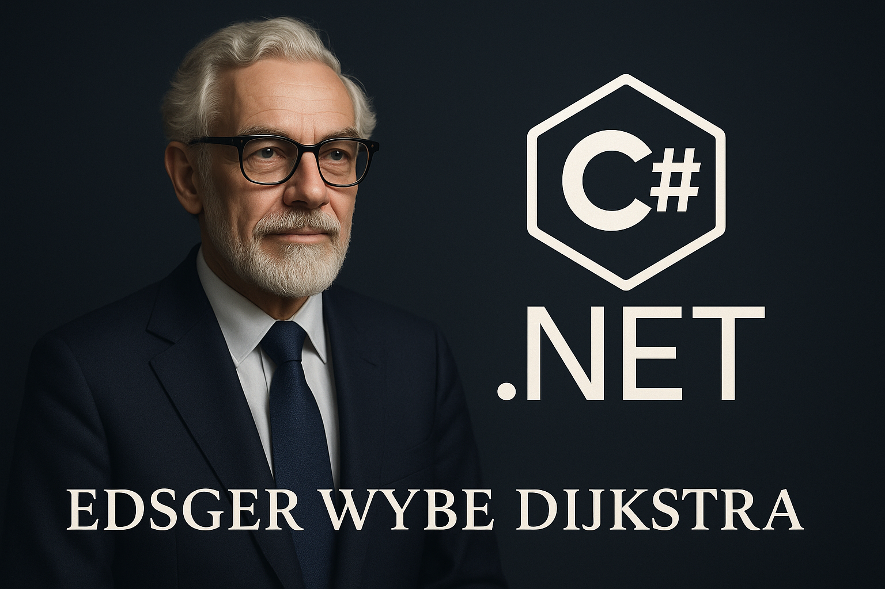

## 国内文章

### C#实现屏幕墙：同时监控多个电脑桌面(支持Windows、信创Linux、银河麒麟、统信UOS)

https://www.cnblogs.com/zhuweisky/p/19046370

该文章介绍了一个基于C#及.NET Core 3.1开发的多屏幕安防监控Demo。用户可以实时查看多个被监控电脑的屏幕。系统包括服务端和PC客户端，支持跨平台运行。文中详细描述了服务端如何接收和处理被监控端的上下线通知，并定义了消息类型。代码示例清晰，便于读者理解功能实现原理。整体内容具有较高的技术深度和实用性，适合相关领域的从业者学习和参考。

### WPF 引用 ASP.NET Core 的 AOT 版本

https://www.cnblogs.com/lindexi/p/19049877

本文探讨了如何将ASP.NET Core以AOT方式发布为类库，并在WPF中使用。文中介绍了创建无主入口的ASP.NET Core应用程序，强调WPF负责界面逻辑，ASP.NET Core专注HTTP服务，二者在单一进程内良好协作。通过示例代码，展示了如何定义和导出HTTP服务的函数，以及如何通过管理调用者修改返回的文本。这种方法减少了DLL的输出依赖，非常适合边缘模块使用，并支持不同.NET版本间的依赖管理。

### 深入理解 C# 异步编程：同步、Task.Wait () 与 await 的本质区别及实践指南

https://www.cnblogs.com/MeteorSeed/p/19048634

本文详细解析C#异步编程中同步方法、Task.Wait()和await的区别。同步方法导致线程阻塞，效率低，有界面卡顿和并发能力下降的问题。Task.Wait()虽使用异步方法，但仍然阻塞线程，性能与同步方法相近。相反，await能非阻塞等待，释放线程，支持并行执行，提高资源利用率。文章探讨了异步编程的最佳实践和常见问题，提供了具体示例，帮助开发者理解异步编程的核心价值。

### 开源DCWriterLite，一个类似MS WORD的开源文书编辑器

https://www.cnblogs.com/xdesigner/p/19046252/dcwriterlite

DCWriterLite是一款纯前端的开源文档编辑器。其特点包括完全自定义的文档DOM结构，使用CANVAS绘制界面及SVG进行打印，适合企业级开发。该软件基于Blazor WebAssembly开发，能在多种操作系统和浏览器上运行。支持XML格式文件的操作，提供高效的复制粘贴、重做与撤销功能，文本样式和段落样式的多样设置，以及完整的DOM API接口，便于开发者使用和扩展。此项目展示了创新的编程技巧，并为文档处理提供了灵活性和便利性。

### 纯 C#实现+AOT 打造的智能PDF目录提取工具 PdfTocExtractor

https://www.cnblogs.com/deali/p/19048154/csharp-pdf-toc-extractor

本文介绍了一个基于C#的轻量级PDF目录提取工具PdfTocExtractor，旨在从PDF中提取书签和目录信息。工具支持Markdown、JSON、XML等多种输出格式，并具备NLP语义分析功能，即使PDF未嵌入目录也能自动识别章节标题。作者首先遇到PDF文档难以处理的问题，后来通过开发该工具实现了高效提取。工具具有跨平台、零依赖和高性能的特点，适合在各种.NET项目中使用。文章还提供了详细的使用方法与命令行操作示例，便于读者上手使用。整体上，PdfTocExtractor高效解决了PDF目录提取的需求。

### 如何做一个纯净版的ABP vNext 脚手架

https://www.cnblogs.com/jackyfei/p/19047483

这篇文章由张飞洪撰写，专注于如何基于自定义模板快速搭建项目脚手架。文章介绍了多种搭建方式，包括使用ABP框架的命令行、第三方工具AbpHelper和官网配置等。作者强调了自定义脚手架的必要性，以融入公司的最佳实践，并展示了如何为每个类和接口添加完整注释。文章内容丰富，提供了实用的技术指导，是从事.NET开发者的有价值资源。

### C# 13 与 .NET 9 跨平台开发实战(第一章：开发环境搭建与.NET概述-下篇)

https://www.cnblogs.com/jackyfei/p/19046660

本文介绍了如何使用Visual Studio构建C# .NET跨平台控制台应用。文章详细描述了项目创建、代码编写与最佳实践，适合新手。作者建议使用非调试模式以提高执行效率，并提供了关于编译器生成目录的解释。内容简洁明了，适合初学者快速上手。这是《C# 13与.NET 9跨平台开发实战》的第一章，强调了顶级程序的简化特性，便于理解和使用。

### C# 13 与 .NET 9 跨平台开发实战(第一章：开发环境搭建与.NET概述-上篇)

https://www.cnblogs.com/jackyfei/p/19045297

文章介绍了C# 13与.NET 9的跨平台开发，适合初入.NET领域的新人。讲解了开发环境配置，包含Visual Studio和VS Code等工具的使用。分析了现代.NET与传统.NET的技术差异。强调实践学习，通过逐步掌握核心概念。专栏内容涉及语言基础、类库应用与现代Web开发，特别关注ASP.NET Core技术。作者鼓励读者反馈并提供技术支持资源，促进互动和学习。内容清晰，有助于迅速上手和理解.NET技术生态。

### 一款基于 Ant Design 设计语言实现、漂亮的 .NET Avalonia UI 控件库

https://www.cnblogs.com/Can-daydayup/p/19054438

本文介绍了AtomUI，一个基于Ant Design设计语言的.NET Avalonia UI控件库。AtomUI旨在提升跨平台桌面软件的开发体验。Avalonia框架允许开发人员使用.NET创建一致性外观的跨平台应用程序，支持多个操作系统。文章包括项目源代码、运行环境和安装步骤，方便开发者快速上手使用AtomUI库。整体内容清晰易懂，具有较强的实用性和技术深度，符合时下开发需求。

### 记一次 .NET 某工控PCB巡检系统 崩溃分析

https://www.cnblogs.com/huangxincheng/p/19047949

文章通过讲述一起系统崩溃的案例，分析了崩溃原因和托管堆损坏的情况。作者使用Windbg工具解析Dump文件，定位到崩溃点，并通过分析相关信息，阐明了恐怖堆损坏是由于恶意破坏导致的。文章提供了具体的命令和输出结果，增强了技术深度和实用性。同时，内容清晰易懂，适合技术人员阅读。整体上，文章具有较高的原创性与时效性，引用了相关工具的文档，增强了信服力。

### Dotnet选项模式的全球化与本地化

https://www.cnblogs.com/kewei/p/19044318

本文探讨了Dotnet中Options模式的多语言支持，通过创建类库实现AI功能的语言配置。首先提出具体语言的配置方法，使用特定的key前缀。据此，简化了json配置文件，使其更加直观。接着，介绍如何绑定别名化的Options并支持语言区域回退。最后，实施自定义IOptionsFactory，以确保根据指定语言区域正确构建AIOptions。整个设计思路清晰，具备实用性和可扩展性。

### StarBlog v1.3.0 新版本，一大波更新以及迁移服务器部署

https://www.cnblogs.com/deali/p/19047276/starblog-v130-updates-server-migration

本文讨论了StarBlog博客系统的迁移与更新过程。作者因服务器故障决定将StarBlog迁移到云服务器，并进行架构及功能升级。StarBlog基于.NET Core开发，作者计划重构为v2。目前版本已更新至v1.3.0，改进包括架构升级至.NET 9.0、界面交互优化、SEO及搜索功能提升、性能优化及工具链增强等。特别增加了图片压缩工具支持，提升用户体验。这些更新为博客系统的稳定性和可访问性奠定了基础。

### 微信 SDK + Senparc.AI + MCP 打造微信 AI 开发助手(一)：网页版

https://www.cnblogs.com/szw/p/19051823

本文介绍了基于Senparc.AI的微信开发助手，旨在解决AI编程中的痛点。该助手利用微信SDK和MCP，实现自动接口搜索和代码生成，用户可通过网页或IDE高效开发。案例分为网页版助手、IDE端AI辅助编程和智能体互动，支持在线体验及本地部署。文中详述助手的功能、工作原理以及关键代码，强调准确性与使用便捷性。此工具帮助开发者节省时间，提高开发效率。

### 回顾一下WPF原生实现命令

https://www.cnblogs.com/mingupupu/p/19048215

本文探讨了WPF中命令的实现，特别是如何通过ICommand接口封装可执行操作。使用RelayCommand类示范了命令的创建和使用。实现了命令的统一规范、绑定UI控件、动态控制可用性，解耦了UI与业务逻辑。作者通过实例详细说明命令在WPF中的作用，并与Stylet框架照应，使读者了解命令的实用性及其在现代应用程序开发中的重要性。

### 记一次 .NET 某自动化智能制造软件 卡死分析

https://www.cnblogs.com/huangxincheng/p/19046030

这篇文章分析了工厂程序卡死的原因。作者通过分析托管栈，找到程序在调用ShowConfirmDialog方法时的情况。使用调试命令观察程序运行状态，发现问题出在与非托管代码的交互上。文章详细讨论了卡死的分析过程，使用具体的堆栈输出和调用情况说明每一步。整体内容清晰、实用，能够为读者提供具体的技术指导。

### Abp vNext-事件总线使用实现及解析

https://www.cnblogs.com/yuxl01/p/19048656

本文介绍了事件总线的基本使用，包括模块引入、事件发布和处理操作。先定义事件传输数据结构，然后创建事件处理程序，并手动注册事件处理。文章详细讲解了事件的基本概念、发布者、订阅者的角色及其关系，以及事件总线的功能和设计思想。强调了内部维护事件订阅的源数据字典，并通过匹配事件类型分发事件。最后，建议从订阅开始理解事件总线的实现。整体内容清晰、实用。

### (已完结)仿神秘海域/美末环境交互的程序化动画学习

https://www.cnblogs.com/eanojiang/p/19051898

本文讨论了Unity中的状态机和基于枚举类型的状态管理。作者通过BaseState和StateManager类实现状态的基本行为和管理。通过定义状态的进入、退出和更新方法，确保状态机的灵活性和可扩展性。这些实现帮助开发者高效管理角色状态，提高游戏的逻辑清晰度。本文所展示的技术深度适用于具有一定编程基础的开发者，同时提供了实际应用示例，便于理解和运用。

### 记录一下Windows系统下的命令行参数的字符个数限制

https://www.cnblogs.com/wuty/p/19045581

本文讲述了在应用升级过程中，通过启动传参方式遇到的字符串长度限制问题。最初，参数字符数在1000以内未出现问题，但后续测试时字符数超过10000导致异常。通过查阅微软官方文档，了解到命令提示符命令行长度不能超过8191字符。同时，作者创建了一个控制台程序用于测试，通过不断增加参数字符数，验证了长度限制的影响，最终发现当参数总数在32763以内时可以正常工作。文中强调了参数长度限制对应用升级过程的重要性。

### [.NET] Aspire Dashboard: 云原生可观测性

https://www.cnblogs.com/madtom/p/19050937

Aspire Dashboard 是专为分布式应用设计的可观测平台，通过 OpenTelemetry 协议收集并展示日志、指标和追踪数据。它支持 gRPC 和 HTTP 传输协议，灵活向应用发送数据。其架构包括核心组件如应用程序日志生成、OTel SDK 和数据存储。Dashboard 提供 HTTP 和 gRPC 接口来接收遥测数据，并以用户友好的界面展示相应的信息。可通过 API Key 进行认证，并支持跨域资源共享配置。

### 为workflow-core扩展外抛事件

https://www.cnblogs.com/ggtc/p/19052348

本文讨论workflow-core在事件处理上的局限性，无法从工作流内获取反馈。作者提出通过C#扩展方法实现外抛事件，以便利与API的交互。在Add方法中，启动工作流并等待特定事件的完成，从而获取响应。通过优雅的方式引发事件和处理数据，作者展示了实现过程与设计思路。对现有功能的扩展为开发者提供了新的思路，提升了工作流的灵活性与响应性。

### JWT身份认证原理介绍

https://www.cnblogs.com/mysticbinary/p/19050592

本文介绍了JWT(JSON Web Token)的工作原理及其与传统身份认证机制的对比。传统机制需状态存储，扩展性差，而JWT是无状态的，自包含的信息可以直接在令牌中传递。文章详细解析了JWT的结构，包括头部、负载和签名，强调了安全性的重要性，尤其是负载中的数据不能包含敏感信息。JWT可以有效解决跨域和分布式架构中的身份认证问题。这使得JWT成为现代应用中更为灵活和简便的选择。

### Senparc.AI 系列教程(二)：配置大模型，开始开发应用

https://www.cnblogs.com/szw/p/19051631

本文章介绍了如何使用Senparc.AI接通AI算力并完成对话或文本生成任务。文章首先提供了开源地址和Nuget包的引用指引，然后讲解了如何创建空项目并设置appsettings.json来配置AI平台及模型信息。通过提供的示例，用户可快速测试AI功能如对话、文本补全等。它支持多种大模型平台，并详细描述了安装Nuget依赖和配置Program.cs的步骤，确保用户能够顺利实现功能。

### CsGrafeq:用C#实现一个几何画板

https://www.cnblogs.com/StuLittleLi/p/19055095

CsGrafeq是用C# AvaloniaUI实现的开源几何画板，支持AOT发布，无需安装.NET Core。它能够绘制线、点、圆、多边形和角，并支持拖拽操作。作者因高中作业需要，开发这个工具，以解决现有国内外几何画板的不足。项目中的OldVersion文件夹专为隐函数绘制设计，虽目前未支持隐函数绘制，但计划未来合并。该项目提供跨平台支持，使用SkiaSharp进行绘图，链接和下载均可提供。开源地址和示例均已列出。

### 一步一步学习使用FireMonkey动画(5) 动画图解11种动画插值类型

https://www.cnblogs.com/lincats/p/19055376

本文介绍了FireMonkey中的插值属性及其多种类型。插值定义为在已知点之间估算中间值。通过生活实例，对运动轨迹的线性插值进行了阐述。文中详细讲解了线性、二次、三次等多种插值类型及其特点，强调了它们在动画效果中的应用。例如，线性插值适用于匀速运动，二次插值则呈现加速或减速的效果。文中还提到不同插值的数学模型和适用场景，展示了它们在用户界面设计中的重要性及多样性。通过动态示例，文章有效地展示了插值类型如何影响动画流畅度和视觉效果。

### Stylet启动机制详解：从Bootstrap到View显示

https://www.cnblogs.com/mingupupu/p/19044527

本文以Stylet.Samples.Hello为例，详细介绍了Stylet的启动机制。首先，WPF项目的结构和启动过程被解析。文中指出，Stylet去掉了StartupUri，采用ApplicationLoader来启动应用。启动流程包括应用程序启动、ApplicationLoader初始化、Bootstrapper配置和启动、IoC容器初始化以及根视图模型创建等多个关键阶段。最后，作者强调了Stylet在启动过程中所做的复杂处理，展示了该机制的独特之处。

### 【EF Core】使用外部 Model

https://www.cnblogs.com/tcjiaan/p/19054696

本文详细讨论了在配置EF Core模型时，使用数据批注和Fluent API的常见情况。作者指出，在绝大多数情况下，可以通过这两种方式高效配置模型。对于特殊需求，本文介绍了如何在DbContext之外进行模型配置，特别是当要共享Model实例时。文章阐述了设计时模型与运行时模型的区别，强调了dotnet-ef工具在生成运行时模型和迁移代码时的便利性。通过工具生成代码能够减少重复工作，提高开发效率。尽管大部分情况下不需要手动实现模型，作者建议在初始化很慢的情况下考虑优化模型配置。

### 【渲染流水线】[逐片元阶段]-[裁剪测试]以UnityURP为例

https://www.cnblogs.com/SmalBox/p/19048795

本文介绍了如何通过矩形区域限制渲染范围，以提高游戏渲染效率。首先，定义裁剪矩形并设置屏幕坐标系。通过判断片元位置，丢弃矩形外的片元。配置方式包括UGUI组件RectMask2D，Shader脚本中动态定义裁剪区域，以及C#脚本通过Screen.scissorRect实现。分析了不同方式的适用对象、形状支持及性能开销，最终推荐在UI裁剪中优先选择RectMask2D，而3D对象则结合Shader使用。文章通俗易懂，适合开发者参考。

### 【译】GPT-5 现已在 Visual Studio 中可用

https://www.cnblogs.com/MeteorSeed/p/19051102

OpenAI 最新模型 GPT-5 已在 Visual Studio 的 GitHub Copilot 中逐步推出。它提高了代码编写和理解的速度与性能，提升了复杂编码任务的推理能力，改善了代码质量和可维护性，还增加了解释的清晰度。GPT-5 可通过 Agent 模式和 Ask 模式使用，适用于所有付费 Copilot 套餐用户。管理员需在设置中启用 GPT-5。现有多个旧模型将在逐步推出后停用。

### WPF中使用 using prism.region 报错

https://www.cnblogs.com/SpikeWang/p/19052176

本文讨论了WPF项目中Prism(9.0+版本)命名空间的变更。Regions命名空间已迁移至Prism.Navigation.Regions，原有的using声明需修改为using Prism.Navigation.Regions。建议确保NuGet包引用完整，保持所有Prism相关包版本一致，以避免兼容性问题。统一版本号便于管理和维护，官方文档支持此做法。文中还提供了相关的代码示例和注意事项，强调版本兼容性与特定容器的要求。

### 一步一步学习使用FireMonkey动画(6) 用实例理解动画的运行状态

https://www.cnblogs.com/lincats/p/19055742

本文介绍了动画的执行状态及其相关属性和方法，详细解释了 Duration、Enabled、Running、Delay、Interpolation 等属性的功能。还涉及到动画的反转、循环和自动反转功能，说明了如何通过这些属性控制动画的行为。此外，文章强调了 CurrentTime 和 NormalizedTime 的区别，介绍了如何使用这两个属性进行动画监控。对 OnProcess 事件的解释提供了对动画进程的进一步理解。整体内容清晰，易于理解。

### 使用surging 常见的几个问题

https://www.cnblogs.com/fanliang11/p/19050493

本文介绍了凯亚(Kayak)物联网平台，基于.NET8.0开发，主要解决了内存泄漏和非阻塞推流等问题。平台支持多协议适配和微服务管理，强调其异步响应特性。文章提供了测试链接和代码示例，指出在推流情况下的健康检查和故障处理措施。整体分析认为.NET8.0性能优越，并通过实际数据支撑了观点。

## 主题

### Visual Studio 8 月更新现已推出 - 更智能的 AI、更好的调试和更多的控制 - Visual Studio 博客
https://devblogs.microsoft.com/visualstudio/the-visual-studio-august-update-is-here-smarter-ai-better-debugging-and-more-control/

Visual Studio 2022 的 8 月更新已发布。

- GPT-5 支持
- 与 MCP 连接
- 使用您的 Google 帐户注册 Copilot
- 将您自己的 AI 模型带入聊天
- Uneral Engine 集成调试
- 需要时的 Copilot 建议
- 折叠建议和干净的编辑
- 部分接受代码补全
- GitHub Chat 中的 Git 上下文

### Uno 平台 6.2：更流畅、更快、无处不在
https://platform.uno/blog/uno-platform-6-2-smoother-faster-everywhere/

Uno Platform 6.2 已发布。

此版本包括对 Skia WebAssembly 的改进、对 Skia SkCanvasElement 的改进、与 WinU 的 WebView2 对齐调整、改进的 ListView 选择、改进的主题可靠性、对 RatingControl 的更新以及对 Uno Platform Studio 和 Hot Design 的更新。

### GitHub Copilot for Azure(预览版)在 Visual Studio 2022 中推出，支持 Azure MCP - Visual Studio 博客
https://devblogs.microsoft.com/visualstudio/github-copilot-for-azure-preview-launches-in-visual-studio-2022-with-azure-mcp-support/

Azure MCP 现已随 Visual Studio 2022 (17.14+) 和 GitHub Copilot for Azure 扩展提供。

本文介绍支持的 MCP 以及安装和设置说明。

### 使用新的 dotnet test 增强 CLI 测试工作流 - .NET 博客
https://devblogs.microsoft.com/dotnet/dotnet-test-with-mtp/

.NET 10 中的 dotnet test 命令和 Microsoft.Testing.Platform 集成有哪些改进？

本文介绍如何在 .NET 10 中启用它、它的作用以及各种选项。

### 在 Visual Studio 中自带模型进行聊天 - Visual Studio 博客
https://devblogs.microsoft.com/visualstudio/bring-your-own-model-visual-studio-chat/

介绍除了 Visual Studio 中 Copilot Chat 中的默认模型之外，还可以使用自己的 API 密钥引入 AI 模型。

### Visual Studio 中适用于 .NET 的 Copilot 诊断工具集 - .NET 博客
https://devblogs.microsoft.com/dotnet/github-copilot-diagnostics-toolset-for-dotnet-in-visual-studio/

介绍 Visual Studio 中 Copilot 的诊断调试功能。

- Copilot 调试工具箱
    - 断点和跟踪点建议
    - 断点故障诊断
    - Copilot 建议在 IEnuemrable 可视化工具中使用 LINQ 查询
    - 使用 Copilot 的 LINQ 查询说明
    - Copilot 的异常协助
    - 使用 Copilot 分析变量
    - 使用 Copilot 分析返回值
    - 并行堆栈窗口中的死锁分析、自动汇总和洞察
- Copilot 分析工具箱
    - CPU 使用率、检测、. NET 赋值工具自动见解

## 发布
- [App-vNext/Polly](https://github.com/App-vNext/Polly)
    - [8.6.3](https://github.com/App-vNext/Polly/releases/tag/8.6.3)
    https://github.com/DataDog/dd-trace-dotnet/releases/tag/v3.25.0
- [DataDog/dd-trace-dotnet](https://github.com/DataDog/dd-trace-dotnet)
    - [v3.25.0](https://github.com/DataDog/dd-trace-dotnet/releases/tag/v3.25.0)
- [aws/aws-sdk-net](https://github.com/aws/aws-sdk-net)
    - [3.7.1106.0](https://github.com/aws/aws-sdk-net/releases/tag/3.7.1106.0)， [3.7.1107.0](https://github.com/aws/aws-sdk-net/releases/tag/3.7.1107.0)， [3.7.1108. 0](https://github.com/aws/aws-sdk-net/releases/tag/3.7.1108.0)、 [3.7.1109.0](https://github.com/aws/aws-sdk-net/releases/tag/3.7.1109.0)、 [3.7.1110. 0](https://github.com/aws/aws-sdk-net/releases/tag/3.7.1110.0) [4.0.74.0](https://github.com/aws/aws-sdk-net/releases/tag/4.0.74.0)、 [4.0.75.0](https://github.com/aws/aws-sdk-net/releases/tag/4.0.75.0)、 [4.0.76.0]( https://github.com/aws/aws-sdk-net/releases/tag/4.0.76.0)、 [4.0.77.0](https://github.com/aws/aws-sdk-net/releases/tag/4.0.77.0)、 [4.0.78.0]( https://github.com/aws/aws-sdk-net/releases/tag/4.0.78.0)
- [Azure/azure-sdk-for-net](https://github.com/Azure/azure-sdk-for-net)
    - [Azure.Communication.CallAutomation_1.5.0](https://github.com/Azure/azure-sdk-for-net/releases/tag/Azure.Communication.CallAutomation_1.5.0)， [Azure.Core_1.47. 3](https://github.com/Azure/azure-sdk-for-net/releases/tag/Azure.Core_1.47.3)，[Azure.ResourceManager.Network_1.11。 3](https://github.com/Azure/azure-sdk-for-net/releases/tag/Azure.ResourceManager.Network_1.11.3)，[Azure.ResourceManager.Resources_1.11。 1](https://github.com/Azure/azure-sdk-for-net/releases/tag/Azure.ResourceManager.Resources_1.11.1)， [System.ClientModel_1.6. 1](https://github.com/Azure/azure-sdk-for-net/releases/tag/System.ClientModel_1.6.1)
- [googleapis/google-cloud-dotnet](https://github.com/googleapis/google-cloud-dotnet)
    - [Google.Cloud.AIPlatform.V1-3.45.0](https://github.com/googleapis/google-cloud-dotnet/releases/tag/Google.Cloud.AIPlatform.V1-3.45.0)
- [microsoft/WindowsAppSDK](https://github.com/microsoft/WindowsAppSDK)
    - [v.1.8.0-预览版1](https://github.com/microsoft/WindowsAppSDK/releases/tag/v.1.8.0-Preview1)
- [newrelic/newrelic-dotnet-agent](https://github.com/newrelic/newrelic-dotnet-agent)
    - [v10.44.1](https://github.com/newrelic/newrelic-dotnet-agent/releases/tag/v10.44.1)
- [StackExchange/StackExchange.Redis](https://github.com/StackExchange/StackExchange.Redis)
    - [2.9.11](https://github.com/StackExchange/StackExchange.Redis/releases/tag/2.9.11)

## 文章、幻灯片等

### 修复 Alpine 上的旧 .NET Core 本机库加载问题
https://andrewlock.net/fixing-an-old-dotnet-core-native-library-loading-issue-on-alpine/

尝试在 Alpine Linux 上使用本机库时遇到了问题。

在 .NET Core 3.1 和 .NET 5 中，Alpine Linux 的运行时 ID 查找不正确，这是 Alpine 3.17 及更高版本中的一个问题。

### [C#] 我意识到 NuGet.org 之所以无法识别 MCP Server，是因为 csproj 描述因是 .NET 10 还是更高版本而不同 - Hanachiru 我的笔记
https://www.hanachiru-blog.com/entry/2025/08/27/120000

使用 .NET 10 及更早版本的 SDK 创建的 NuGet 包在发布到 NuGet.org 时无法识别为 MCP 服务器的问题。

### Web API 可写性 CLI 框架 Cocona
https://zenn.dev/shundeveloper/articles/61fbd9bd3f007a

使用 Cocona 实现 CLI 应用程序。

### 在 F# 中运行 MCP 服务器示例
https://qiita.com/Miyakovsky/items/5e47c88ecee73ec82ff8

了解如何使用 F# 和 ModelContextProtocol SDK 运行 MCP 服务器示例。

### 我想使用 C# × WASM(VS Code for Web)创建 VS Code 的扩展
https://zenn.dev/srtia2318/articles/organize-info10-vscode-ex-wasm-f408da65b14e2f

了解如何从 Visual Studio Code for Web 扩展调用和实现 Wasm 转换的 C# 代码。

### 在 C# 项目中使用 Gemini CLI
https://zenn.dev/sator_imaging/articles/33dd0cf1e6c1d3

有关如何将 .NET/C# 映像创建为可在 Gemini CLI 中使用的沙盒映像的说明。

### 在 Windows 上为应用作创建作提供程序(URI 类型)

https://qiita.com/tera1707/items/6918ab851fabc1bd36fc

有关如何在 Windows 上的应用作中实现 URI 类型的作提供程序的说明。

### 在 .NET MAUI 中创建自定义控件的 4 种方法
https://zenn.dev/y_a_y/articles/maui_custom_b9685efa3cc1e1

关于在 .NET MAUI 中创建自定义控件的四种方法：继承、ControlView、自定义绘图和处理程序。

### 更好地控制 Copilot 代码建议 - Visual Studio 博客
https://devblogs.microsoft.com/visualstudio/better-control-over-your-copilot-code-suggestions/

关于 Visual Studio 2022 17.14.13 及更高版本中增强的 GitHub Copilot 的代码建议行为控件。

### MauiReactor：适用于 .NET MAUI 的 MVU 方法 - .NET 博客
https://devblogs.microsoft.com/dotnet/mauireactor-mvu-for-dotnet-maui/

介绍 MauiReactor，这是 .NET MAUI 的 MVU 框架。

### [C#] 使用 Aspire + Magic Onion 轻松开发应用程序
https://zenn.dev/arika/articles/20250822-aspire-magiconion

了解如何结合 .NET Aspire 和 MagicOnion 来构建客户端-服务器应用程序。

### 2025 如何打造实用的 Blazor Server 业务应用 - 以订单管理系统为例 - 奇塔
https://qiita.com/masayahak/items/bfbf5dea084a055f06c4

说明如何使用 Blazor Server 创建业务应用程序，以订单管理系统为例及其实现示例。

### [C#] JsonSerializer.Serialize/Deerialize 混合类型列表 - Qiita
https://qiita.com/yamato1413/items/c80579a26e1359a136fd

如何使用 System.Text.Json 序列化/反序列化混合类型列表。

---

## 封面人物

**Edsger Wybe Dijkstra**(1930年5月11日—2002年8月6日)是荷兰计算机科学家，被公认为现代计算机科学与软件工程领域的奠基人之一。

他出生在荷兰鹿特丹，父亲是一名化学家，母亲是一位数学家[1](https://dl.acm.org/doi/book/10.1145/3544585)。年轻时，他原本打算成为理论物理学家，但在大学期间逐渐转向计算机领域，并在1952年进入阿姆斯特丹数学中心(Mathematisch Centrum，现为 CWI)工作，成为**荷兰第一位职业程序员**[2](https://en.wikipedia.org/wiki/Edsger_W._Dijkstra)。

1959年，Dijkstra 在与未婚妻 Maria Debets 外出时，仅用 20 分钟便推导出后来被称为 **Dijkstra 最短路径算法** 的解法。他当时正在咖啡馆中思考图论中“在网络中找到两个节点之间最短路径”的问题[3](https://www.britannica.com/biography/Edsger-Dijkstra)。该算法至今仍在导航、网络路由、人工智能等领域广泛使用。

除了最短路径算法，他还参与编写了**世界上第一个 ALGOL 60 编译器**(与 Jaap Zonneveld 合作)[4](https://dl.acm.org/doi/book/10.1145/3544585)，提出了**信号量(Semaphore)**概念用于并发控制[5](https://ethw.org/Edsger_Dijkstra)，并在程序正确性证明、结构化编程、操作系统理论等方面作出开创性贡献，如著名的“银行家算法”(Banker’s Algorithm)用于死锁避免。

1972年，Dijkstra 因对编程语言设计和程序方法学的基础性贡献获得 **图灵奖**[6](https://amturing.acm.org/award_winners/dijkstra_1053701.cfm)。他的写作风格直接而犀利，许多观点至今仍被引用，例如他在著名的“Go To Statement Considered Harmful”中，提倡结构化编程并对 goto 语句提出批评[7](https://dl.acm.org/doi/10.1145/362929.362947)。

1984年至2000年间，Dijkstra 在美国德州大学奥斯汀分校担任计算机科学系 Schlumberger Centennial 教席[8](https://news.utexas.edu/2002/08/07/world-renowned-university-of-texas-at-austin-computer-scientist-edsger-dijkstra-dies/)。2002年8月6日，他在荷兰 Nuenen 家中因病去世，享年72岁[9](https://www.cs.utexas.edu/~EWD/CSobit.html)。

## C# .NET 交流群

相信大家在开发中经常会遇到一些性能问题，苦于没有有效的工具去发现性能瓶颈，或者是发现瓶颈以后不知道该如何优化。之前一直有读者朋友询问有没有技术交流群，但是由于各种原因一直都没创建，现在很高兴的在这里宣布，我创建了一个专门交流.NET性能优化经验的群组，主题包括但不限于：

* 如何找到.NET性能瓶颈，如使用APM、dotnet tools等工具
* .NET框架底层原理的实现，如垃圾回收器、JIT等等
* 如何编写高性能的.NET代码，哪些地方存在性能陷阱

希望能有更多志同道合朋友加入，分享一些工作中遇到的.NET问题和宝贵的分析优化经验。**目前一群已满，现在开放二群。**可以加我vx，我拉你进群: **ls1075** 另外也创建了**QQ Group**: 687779078，欢迎大家加入。