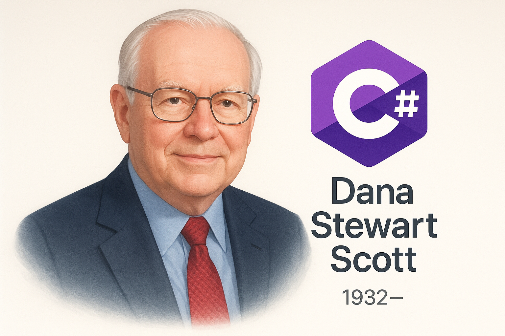

## 国内文章
### .net 行不行？在线客服系统成功支持客户双11大促，21客服在线，高峰超300会话并发

https://www.cnblogs.com/sheng_chao/p/19242279

作者分享了他开发的升讯威客服系统的真实使用案例，描述了系统在双11大促中的表现。通过技术分析，他指出系统的高并发性能源于基于.NET的异步I/O和高效的连接管理，解决了普通客服系统在高并发情况下的不稳定问题。介绍了多种核心架构设计，包括完全异步的I/O管道、高吞吐消息路由和资源最小化的WebSocket连接等，展示了其应对复杂业务场景的能力。这篇文章结合了实践与理论，展现了技术深度和实际应用的紧密结合。

### 九成九新自用C#入门文档

https://www.cnblogs.com/leaf-7-scouts/p/19234478

本文是针对初学者的C#编程指南。作者强调编程语言的本质在于能否写出高质量的程序，而不是理论概念。内容涵盖了高级语言与低级语言、强类型与弱类型的讨论，指出这些概念对初学者而言并不重要。随后，文章解释C与C#的执行方式的区别，C通过编译器生成机器指令，而C#通过IL中间语言动态转换。最后，文章提供了C#的基础语法示例，强调Hello World程序的结构，比较了C与C++的相似性，展示了C#的简洁性。总结上，文章具有基础知识的普及性和实用性。

### 快速构建一个基础、现代化的 WinForm 管理系统！

https://www.cnblogs.com/Can-daydayup/p/19244061

本文介绍了基于AntdUI构建的WinForm管理系统WenAntdUI-Admin，该系统自带多种功能，包括用户管理和权限管理，无需编码便可快速搭建。AntdUI是基于Ant Design的开源WinForm界面库，支持AOT发布，兼容.NET Framework 4.0及以上版本。项目在Gitee和GitHub上开源，鼓励用户参与和支持。该系统的设计旨在现代化桌面应用程序，提升开发效率与质量。

### Visual Studio 2026 上手体验，AI 懂你、界面清爽、协作无缝

https://www.cnblogs.com/1312mn/p/19224792

微软发布的Visual Studio 2026具备深度AI集成，优化开发流程。它自动提供建议、简化编码，提升开发效率。解决方案加载速度大幅提升，界面设计更清晰，用户体验好。新支持的.NET 10和C# 14功能使得项目创建更快捷，无需额外配置。集成的Git和DevOps工具让协作更加顺畅，调试能力明显增强，AI助力快速定位问题。此外，兼容性的增强也便于用户迁移。整体来看，VS 2026实现了效率和体验双重提升。

### C# 14 新功能全面解析：提升生产力与性能的革命性更新

https://www.cnblogs.com/powertoolsteam/p/19237152

本文深入分析了C# 14的核心特性，包括扩展成员、字段关键词和空条件赋值。这些新特性提升了开发者的生产力，减少了样板代码，增强了灵活性。扩展成员允许在不修改类型的情况下添加属性和方法，字段关键词简化了属性逻辑，而空条件赋值则实现了更安全的链式操作。此外，C# 14支持将事件和构造函数的逻辑拆分，优化大型项目的代码组织。这些改进展示了C#语言的持续发展和对开发者需求的高度关注。

### 实践笔记：IIS + URL Rewrite + ARR 实现 ASP.NET Core 蓝绿部署

https://www.cnblogs.com/munanwang/p/19234857

本文探讨了如何在 Windows Server + IIS 环境下实施 ASP.NET Core 应用的蓝绿部署，确保用户访问不中断。首先介绍了 URL 重写模块和 ARR 的概念，并说明它们在请求分发中的作用。接着分析了部署结构，包括创建三个站点：Switch、Blue 和 Green，以实现流量切换和版本更新。文中详细描述了环境准备步骤，包括安装和配置 URL Rewrite 与 ARR。最后，通过示例演示了蓝绿部署的实际应用和效果。

### 开源 .NET 工作流引擎 + 可视化设计，轻松搞定 OA/CRM/ERP 开发

https://www.cnblogs.com/1312mn/p/19234585

该文章介绍了一款基于.NET的全浏览器兼容工作流引擎，旨在解决企业信息化建设中的审批流程复杂和系统开发周期长的问题。平台由经验丰富的团队研发，支持多种数据库，具有可视化设计、模块化架构和权限管理等功能。核心模块包括流程设计器、组织架构管理和表单设计器，具备跨浏览器兼容性，适应各种业务场景。采用异步处理等技术保障高性能和稳定性，适合大型企业。提供完整源代码和开发文档，便于用户快速上手。

### C#/.NET/.NET Core技术前沿周刊 | 第 61 期(2025年11.10-11.16)

https://www.cnblogs.com/Can-daydayup/p/19229884

此文章主要介绍C#/.NET/.NET Core领域的最新动态和资源，涵盖技术分享、会议信息和学习指南。提到.NET Conf China 2025大会将聚焦性能、AI和跨平台开发，提供开发者实战洞见。DotNetGuide知识库记录了C#/.NET相关技术资料，支持学习与工作。文章还宣布.NET 10的正式发布，强调整体性能与安全性。最后，介绍了基于.NET 8的模块化微服务框架及WPF UI组件库。这些内容实现了技术与实践的结合。

### .NET项目中如何快速的集成飞书API

https://www.cnblogs.com/mudtools/p/19245855

本文介绍了飞书API的集成和管理，特别是如何在.NET项目中使用Mud.Feishu组件。Mud.Feishu为.NET开发者提供了简化的编程接口，支持飞书的用户、部门和消息管理等核心功能。组件基于ASP.NET Core开发，内置令牌管理、重试机制和异常处理，减少开发复杂性。文中详细比较了Mud.Feishu与原生SDK的优劣，强调了其在开发效率、安全性和可读性等方面的优势，同时介绍了主要的第三方库依赖和组件特性，力求提升开发者的使用体验。

### 对 .NET FileSystemWatcher引发内存碎片化的 反思

https://www.cnblogs.com/huangxincheng/p/19251728

本文探讨FileSystemWatcher引发的内存碎片化问题，特别是reloadOnChange=true的影响。分析表明，在高频率读取配置时，内存使用量显著增加，导致2.2G内存被占用。通过windbg检测，发现Free区占用1.39G，FileSystemWatcher实例多达1290个。此现象并非传统的reloadOnChange导致，而是代码设计上的问题。深度调试揭示了ConfigurationRoot类的内部工作，提供了有效的技术参考。此文为未来类似问题提供了有价值的解决思路。

### AI 时代，.NET 开发者是向左还是向右？

https://www.cnblogs.com/sheng-jie/p/19259396

在AI时代，.NET开发者面临着选择LangChain与MAF的技术抉择。LangChain是一个成熟的Python生态框架，拥有丰富的集成和活跃的社区。其优势在于快速原型开发和企业客户的成功案例，但也存在性能瓶颈和生态碎片化的问题。MAF是微软最新发布的.NET框架，专注于企业级智能体开发。它融合了AutoGen和Semantic Kernel，体现了微软的AI战略。两者各有优劣，开发者需结合自身需求形成选择。此决策不仅关乎技术，还影响职业发展。

### 有趣的便签网站-使用Sdcb.WordCloud生成词云图

https://www.cnblogs.com/ZYPLJ/p/19232405

本文介绍了一个便签网站的开发，利用Sdcb.WordCloud库生成词云。作者总结了网站的使用情况，提到收到大量评论，并分享了更新记录。前端设计简洁，以词云图作为页面主要功能。后端使用.NET框架，遇到在Linux环境下生成词云图的依赖问题。此外，提供了关键代码示例，描述了如何处理文本并生成词频统计，为用户展示高频词。文章内容易于理解，结合实际案例，适合对Web开发和词云图感兴趣的读者。

### MAF快速入门(1)化繁为简的Agent创建范式

https://www.cnblogs.com/edisontalk/p/-/quick-start-on-maf-chatper01

MAF(Microsoft Agent Framework)是微软推出的智能体开发框架，支持.NET和Python，整合了Semantic Kernel和AutoGen的优点。MAF将为.NET开发团队提供快速进入AI Agent开发的机会。AI Agent通过LLM处理输入并生成响应，适用于非结构化任务的自主决策应用。工作流则管理复杂进程，涉及多个AI Agent和系统交互。文中提供了创建.NET控制台项目的步骤，包括组件包安装和配置文件加载，适合开发者快速上手。

### WPF 为ContextMenu使用Fluent风格的亚克力材质特效

https://www.cnblogs.com/TwilightLemon/p/19241723

文章详细介绍了Fluent WPF的窗口样式、Popup和ToolTip特效，以及ScrollViewer的实现。通过示例代码说明了ContextMenu和MenuItem的结构和样式适配，解决了旧版模板无法满足新需求的问题。文章强调了ContextMenu的Popup支持Acrylic材质的重要性，并提供了实现和样式调整的具体方法和思路。还通过GitHub提供了相应的Demo项目，内容技术深入且具有实用性，有助于开发者提升WPF应用的界面效果和用户体验。

### RAGDemo — 一个学习示例(Demo)

https://www.cnblogs.com/donpangpang/p/19245338

RAGDemo是一个轻量级演示项目，用于在本地使用ONNX模型进行嵌入生成与向量检索。项目主要目标是学习与快速试验，不建议直接用于生产环境。项目提供了示例代码，演示如何运行一个端到端的小型RAG流程，用户可在此基础上扩展。使用前需确认模型与tokenizer的兼容性。演示中包含代码关键点与命令行功能。若要优化并推向生产，建议替换向量存储为成熟后端并增加并发与安全措施。

### C#AI系列(1):深度学习项目构建及实战TensorFlow准备篇

https://www.cnblogs.com/luojin765/p/19247539

该文章介绍如何在C# .NET项目中实现AI组件，重点强调了将AI模块编译至项目中的优势，如降低集成成本和提高维护效率。文章讨论了深度学习技术，提供了TensorFlow.Net和TorchSharp两种框架的比较，并详细说明了创建人工神经网络(ANN)的步骤，包括环境配置、数据准备及核心代码。最后，强调了使用TensorFlow.Net的简单性，同时提到其开源特性和必要的NuGet包。整体内容直观易懂，适合希望结合C#与深度学习的开发者。

### DotMemory系列：5. 如何实现自动化抓取和应用自托管

https://www.cnblogs.com/huangxincheng/p/19236466

本文探讨了如何在 dotmemory 软件中实现内存快照的自动化抓取。首先，介绍了通过代码控制快照的时机，以便避免手动操作。通过示例代码，展示了如何在特定时刻自动化调用 MemoryProfiler.GetSnapshot 方法。接着，讨论了如何实现自托管，通过 DotMemory.Init 和配置，自动下载 Console of DotMemory，并生成跟踪文件。全程不需要人工干预，并提供了多个快照的生成实例。整体上，文章为实现内存分析提供了实用的方法和清晰的代码示例。

### 在.Net项目的EFCore的Code First 模式中如何实现默认部分字段添加索引

https://www.cnblogs.com/net-kevin-li/p/19244968

该文章详细介绍了如何在.NET 8中通过Fluent API为实体类指定索引，包括单字段、复合索引及使用注解的方法。内容涵盖了索引命名、批量添加索引、包含非键字段及设置筛选条件等技术细节，适合需要构建微服务及后端架构的开发者。使用情景实用且建议代码示例清晰易懂。

### .NET+AI | MEAI | Function Calling 基础(3)

https://www.cnblogs.com/sheng-jie/p/19254368

Function Calling 是使大模型能够识别用户意图并返回结构化调用指令的功能。它解决了大模型无法获取实时数据或执行具体操作的问题。通过 Function Calling，大模型可以与外部工具连接，扩展应用功能。其工作流程包括用户提问、模型识别意图、返回调用参数、应用执行函数和生成最终回复。通过具体案例，如查询天气，文章详细说明了如何实现这一流程，强调工具列表、函数用途和参数定义的重要性。

### 使用.NET 8+ 与飞书API构建组织架构同步服务

https://www.cnblogs.com/mudtools/p/19255641

本文探讨了在.NET生态下实现飞书API集成的挑战和解决方案。现代企业内部管理系统依赖.NET技术栈，但存在员工信息数据不一致的问题，导致安全隐患和报表不准确。为了解决这些痛点，提出了统一身份认证和自动化运维的解决方案。文中推荐使用Mud.Feishu SDK以提高开发效率，减少手动操作，并提供类型安全和异常处理。最后，提供了.NET项目配置示例，展示了如何在应用中集成飞书API。

### .NET+AI | MEAI | Function Caling 实操(4)

https://www.cnblogs.com/sheng-jie/p/19258453

本文讨论了如何将 .NET 与人工智能技术结合，实现在智能助理中调用后端工具的功能。通过注册工具中间件，使得 ChatOptions 能够自动处理请求，简化了与API的交互。文章详细介绍了智能助手的应用场景及其价值，并列出了快速上手的步骤，包括获取 ChatClient、注册工具、启用中间件及配置对话。由于提供了可执行的代码示例，读者能够快速理解和实施这些功能。

### Microsoft将.NET Aspire 改成了Aspire

https://www.cnblogs.com/shanyou/p/19261156

Microsoft 在 .NET Conf 2025 上发布了 Aspire 13，这是其最大规模的分布式应用开发框架更新。该框架去掉了“.NET”名称以反映更广泛的语言支持。Aspire 13 改进了自动化，支持 Python 和 JavaScript，提升了 AI 集成，并优化开发者工作流程。使用 Aspire，开发者可以定义和监控多语言服务，AI助手能够实时查询应用数据。新命令 aspire do 取代传统部署脚本，支持并行构建和自定义自动化。Aspire CLI 现可快速创建全栈应用，提升开发效率和可追溯性。Microsoft 认为此版本是实现跨语言智能开发的重要一步。

### OpenCVSharp：使用MOG进行运动物体识别

https://www.cnblogs.com/mingupupu/p/19231151

本文详细介绍了运动物体检测在计算机视觉中的应用，特别是使用OpenCVSharp中的MOG算法。MOG算法通过建立多个高斯分布模型对像素进行背景建模，有效处理动态背景干扰。文章展示了WPF应用程序的MVVM模式实现，包括视频路径、图像显示、处理状态等属性。主要实现中，使用VideoCapture获取视频信息，并使用MOG算法和形态学操作处理前景掩码，提升检测效果。整体内容通俗易懂，适合开发者学习和实践。

### DotMemory系列：4. 如何分析进程的转储文件

https://www.cnblogs.com/huangxincheng/p/19231280

本文探讨了对进程采集 snapshot 文件面临的挑战，尤其是在医疗和金融等严格环境中如何使用 dump 文件进行线下分析。作者演示了内存分配的代码，展示了程序在分配大量数组后占用了 1.7G 的内存。通过 dotmemory 工具分析 dump 文件，作者强调了大文件分析时可能遇到的内存不足问题，以及观察 .NET 应用的内存使用情况的重要性。该文章为理解内存管理提供了实践指导，并突出了生态集成的必要性。

### C#AI系列(2):深度学习项目构建及实战TorchSharp准备篇

https://www.cnblogs.com/luojin765/p/19253994

TorchSharp是一个基于.NET的深度学习库，提供C#/F# API，类似于PyTorch。它支持张量运算、自动求导和模型构建等功能。文章描述如何使用TorchSharp进行向量分类的神经网络训练与预测，准备工作包括安装所需组件TorchSharp和TorchSharp-cpu。核心代码展示了如何生成随机数据以区分圆内外的点，以及准备训练集。该库与TensorFlow相比有不同的写法和使用习惯。

### NetCoreKevin-DDD-微服务-现代化Saas企业级-WebAPI-前后端分离架构

https://www.cnblogs.com/net-kevin-li/p/19242513

NetCoreKevin是一个基于.NET 8的DDD和微服务架构的Web API项目，旨在提供可复用和模块化的平台。项目集成了身份认证、分布式系统、多租户、任务调度、实时通信和AI等功能。它支持Redis和内存缓存，含有Quartz自动任务调度和RabbitMQ。项目结构包含多层服务，例如授权服务、仓储层和API接口，并使用EFCore实现数据库操作。项目还支持Docker部署和单元测试。整体系统设计强调模块化和高可扩展性，适合现代化SaaS企业级开发。

### OpenCVSharp：使用三种不同的局部二值化算法

https://www.cnblogs.com/mingupupu/p/19242151

局部二值化是一种将灰度图像转换为二值图像的图像处理技术。与全局二值化不同，它基于每个像素的局部区域特征动态计算阈值。该技术实现了多个算法，如Niblack、Sauvola和Nick。实际应用中，Sauvola通常是首选。通过OpenCVSharp，这三种算法的实现相对简单，主要通过CvXImgProc.NiblackThreshold()方法调用。结果显示，这些自适应阈值化方法能够更有效地处理光照不均匀的图像。

### Serilog 日志库简单实践(三)集中式日志与分析平台 Sinks(.net8)

https://www.cnblogs.com/hnzhengfy/p/19188548/Serilog_AnalysisPlantform

本文介绍了 Serilog 的各种 Sinks，尤其集中式日志与分析平台的使用。重点讨论了 Seq、Elasticsearch、Splunk、Datadog 和 New Relic。这些 Sinks 适用于处理结构化日志，提供不同平台的特点和适用场景。尤其强调了 Seq 对 .NET 的优化，Elastic 作为多语言解决方案，Datadog 适合云环境，Splunk 适合金融等合规需求。文章通过表格总结了各 Sinks 的类型、用户和场景，提供了实用的指南。整体内容条理清晰，实用性强。 

## 话题

### Ix.NET v7.0：.NET 10 和 LINQ for IAsyncEnumerable | 恩津
https://endjin.com/blog/2025/11/ix-v7-dotnet-10-linq-iasyncenumerable

### TUnit — 为什么我花了两年时间构建一个新的.NET测试框架
https://medium.com/@thomhurst/tunit-why-i-spent-2-years-building-a-new-net-testing-framework-86efaec0b8b8

### NPGSQL 10.0 发布说明 | Npgsql 文档
https://www.npgsql.org/doc/release-notes/10.0.html

### Visual Studio – 为现代开发速度打造 - Visual Studio 博客
https://devblogs.microsoft.com/visualstudio/visual-studio-built-for-the-speed-of-modern-development/

### ReSharper 和 Rider 2025.3.0.3：全新更新集发布 | .NET 工具博客
https://blog.jetbrains.com/dotnet/2025/11/27/resharper-and-rider-2025-3-0-3/

### .NET 代理现代化日即将到来 - .NET 博客
https://devblogs.microsoft.com/dotnet/dotnet-day-on-agentic-modernization-coming-soon/

### Akka.NET 最严重的安全漏洞——以及如何修复
https://petabridge.com/blog/akka-net-tls-vulnerability/

## 发布
- [App-vNext/Polly](https://github.com/App-vNext/Polly)
    - [8.6.5](https://github.com/App-vNext/Polly/releases/tag/8.6.5)
- [aws/aws-sdk-net](https://github.com/aws/aws-sdk-net)
    - [3.7.1171.0](https://github.com/aws/aws-sdk-net/releases/tag/3.7.1171.0)、[3.7.1172.0](https://github.com/aws/aws-sdk-net/releases/tag/3.7.1172.0)、[3.7.1173。 0](https://github.com/aws/aws-sdk-net/releases/tag/3.7.1173.0)， [3.7.1174.0](https://github.com/aws/aws-sdk-net/releases/tag/3.7.1174.0)， [4.0.139.0]( https://github.com/aws/aws-sdk-net/releases/tag/4.0.139.0)， [4.0.140.0](https://github.com/aws/aws-sdk-net/releases/tag/4.0.140.0)， [4.0.141.0]( https://github.com/aws/aws-sdk-net/releases/tag/4.0.141.0)， [4.0.142.0](https://github.com/aws/aws-sdk-net/releases/tag/4.0.142.0)
- [Azure/azure-cosmos-dotnet-v3](https://github.com/Azure/azure-cosmos-dotnet-v3)
    - [3.55.0](https://github.com/Azure/azure-cosmos-dotnet-v3/releases/tag/3.55.0)， [3.56.0](https://github.com/Azure/azure-cosmos-dotnet-v3/releases/tag/3.56.0)
- [Azure/azure-sdk-for-net](https://github.com/Azure/azure-sdk-for-net)
    - [Azure.ResourceManager.Datadog_1.0.0](https://github.com/Azure/azure-sdk-for-net/releases/tag/Azure.ResourceManager.Datadog_1.0.0)， [Azure.ResourceManager.Dynatrace_ 1.2.0](https://github.com/Azure/azure-sdk-for-net/releases/tag/Azure.ResourceManager.Dynatrace_1.2.0)， [Azure.ResourceManager.NetApp_1.14. 0](https://github.com/Azure/azure-sdk-for-net/releases/tag/Azure.ResourceManager.NetApp_1.14.0)，[Azure.ResourceManager.Resources_1.11。 2](https://github.com/Azure/azure-sdk-for-net/releases/tag/Azure.ResourceManager.Resources_1.11.2)
- [CommunityToolkit/Aspire](https://github.com/CommunityToolkit/Aspire)
    - [v13.0.0](https://github.com/CommunityToolkit/Aspire/releases/tag/v13.0.0)
- [DataDog/dd-trace-dotnet](https://github.com/DataDog/dd-trace-dotnet)
    - [v3.32.0](https://github.com/DataDog/dd-trace-dotnet/releases/tag/v3.32.0)
- [dotnet/aspire](https://github.com/dotnet/aspire)
    - [v13.0.1](https://github.com/dotnet/aspire/releases/tag/v13.0.1)
- [microsoft/CsWin32](https://github.com/microsoft/CsWin32)
    - [v0.3.253](https://github.com/microsoft/CsWin32/releases/tag/v0.3.253)， [v0.3.257](https://github.com/microsoft/CsWin32/releases/tag/v0.3.257)
- [NPGSQL/NPGSQL](https://github.com/npgsql/npgsql)
    - [v10.0.0](https://github.com/npgsql/npgsql/releases/tag/v10.0.0)
- [开放遥测/开放遥测点网贡献](https://github.com/open-telemetry/opentelemetry-dotnet-contrib)
    - [Instrumentation.AspNet-1.14.0](https://github.com/open-telemetry/opentelemetry-dotnet-contrib/releases/tag/Instrumentation.AspNet-1.14.0)
- [spectreconsole/spectre.console](https://github.com/spectreconsole/spectre.console)
    - [0.53.1](https://github.com/spectreconsole/spectre.console/releases/tag/0.53.1)
- [unoplatform/uno](https://github.com/unoplatform/uno)
    - [6.4.185](https://github.com/unoplatform/uno/releases/tag/6.4.185)

## 文章、幻灯片及更多内容
### 我希望在C#中拥有的符号和语言规范——Qiita。
https://qiita.com/hqf00342/items/6395245d7e321b8dd396

### 使用 Oracle Entity Framework Core 10 在生产环境中部署应用
https://medium.com/oracledevs/announcing-oracle-entity-framework-core-10-595fd4d1e984

### 使用 Agent Framework 构建 MCP 服务器
https://zenn.dev/microsoft/articles/agentframework-mcp-01

### 在.NET Conf 2025会议中吸引我注意的内容以及我想重点关注的内容
https://zenn.dev/suusanex/articles/ca25cda12bc150

### 用读卡器读取 C# - Qiita
https://qiita.com/saten/items/5b5541226b9a5ffb6320

### 通过主机追踪探索.NET启动进程
https://andrewlock.net/exploring-the-dotnet-boot-process-via-host-tracing/

### ASP.NET WebAPI 中的 OnActionExecuting “什么时候”有效？
https://zenn.dev/nexta_/articles/1c3311a0020dec

### TypedSql──关于“滥用”C#类型系统作为查询引擎的故事 - Qiita
https://qiita.com/hez2010/items/2936d7441c61df5a628a

### 诗：大语言模型时代的图书馆设计，让LLM易于使用更好，所以我改变了政策，哭泣不止
https://zenn.dev/jtechjapan_pub/articles/c11c81bae36746

### WPF / CommunityToolkit.Mvvm：利用 IMessenger - Qiita

https://qiita.com/Noriyuki1203/items/fc132aba3e873b2adb13

### 使用 C# 中的 IFileDialog(例如，打开文件的对话)
https://zenn.dev/shinta0806/articles/ifiledialog-cs

### [C# 14 新功能] 扩展块
https://zenn.dev/peacockanderson/articles/1246b49fc58e10

### 从代理框架呼叫Copilot Studio的定制代理 ~没成功~
https://zenn.dev/microsoft/articles/agentframework-copilotstudio-01

### ⚔️ C#任务——破解🐉模式匹配之谜
https://zenn.dev/plusone/articles/25aa4accde604b

### 利用反重力实现测试，从Windows Forms迁移到Blazor混合并验证行为 - Qiita
https://qiita.com/RYA234/items/2f07fe7fc5ea46a5715c

### 持久代理调用长时间 - Microsoft 代理框架(C#)第15部分
https://zenn.dev/microsoft/articles/agent-framework-015

### 用持久代理关闭静态变量访问 - Microsoft 代理框架(C#)第16部分
https://zenn.dev/microsoft/articles/agent-framework-016

### 学习新工作流程1 - Microsoft代理框架(C#)第18部分
https://zenn.dev/microsoft/articles/agent-framework-018

### 使用提示模板引擎 - Microsoft Agent Framework (C#) 第17部分
https://zenn.dev/microsoft/articles/agent-framework-017

### 将代理暴露为 API - Microsoft 代理框架(C#)第19部分
https://zenn.dev/microsoft/articles/agent-framework-019

### 深度潜航。 NET：解读词典 - Qiita
https://qiita.com/felis_silv/items/a03d49ec15fcd7674cd2

### 深度潜航。 NET：破译队列 - Qiita
https://qiita.com/felis_silv/items/b5340109bcf087d04ea4

### 深度潜航。 破译 NET：List - Qiita
https://qiita.com/felis_silv/items/10dd17ad720c039a7d69

## 今日人物

斯科特1932年10月11日生于[美国](https://zh.wikipedia.org/wiki/美国)[加利福尼亚州](https://zh.wikipedia.org/wiki/加利福尼亚州)，在[加州大学伯克利分校](https://zh.wikipedia.org/wiki/加州大学伯克利分校)获得[学士](https://zh.wikipedia.org/wiki/学士)学位以后，进入[普林斯顿大学](https://zh.wikipedia.org/wiki/普林斯顿大学)研究生院学习，与[迈克尔·拉宾](https://zh.wikipedia.org/wiki/迈克尔·拉宾)一起师从[阿隆佐·邱奇](https://zh.wikipedia.org/wiki/阿隆佐·邱奇)，1958年取得[博士](https://zh.wikipedia.org/wiki/博士)学位。

他先后在[芝加哥大学](https://zh.wikipedia.org/wiki/芝加哥大学)、[加州大学伯克利分校](https://zh.wikipedia.org/wiki/加州大学伯克利分校)、[斯坦福大学](https://zh.wikipedia.org/wiki/斯坦福大学)、荷兰的[阿姆斯特丹大学](https://zh.wikipedia.org/wiki/阿姆斯特丹大学)、[普林斯顿大学](https://zh.wikipedia.org/wiki/普林斯顿大学)和英国[牛津大学](https://zh.wikipedia.org/wiki/牛津大学)等学府任教。1981年被[卡内基梅隆大学](https://zh.wikipedia.org/wiki/卡内基梅隆大学)聘为计算机科学、数理逻辑和哲学教授。

1959年，拉宾和达纳·斯科特共同发表了“有限自动机与其判定性问题”(Finite Automata and Their Decision Problems)的论文，提出了非确定自动机的观点。他们也因此获得了1976年的图灵奖，并做“逻辑与程序设计语言”(logic and Programming Language)的演讲。图灵奖的引文是：

>  因他们的合著论文“有限自动机与其判定性问题”。论文中引入了非确定自动机的概念，被证明是(计算理论科学研究中的)一个非常重要的概念。拉宾和斯科特的这篇经典论文成为了这个领域后续研究的源泉。[[1\]](https://zh.wikipedia.org/wiki/达纳·斯科特#cite_note-1)

## C# .NET 交流群

相信大家在开发中经常会遇到一些性能问题，苦于没有有效的工具去发现性能瓶颈，或者是发现瓶颈以后不知道该如何优化。之前一直有读者朋友询问有没有技术交流群，但是由于各种原因一直都没创建，现在很高兴的在这里宣布，我创建了一个专门交流.NET 性能优化经验的群组，主题包括但不限于：

* 如何找到.NET 性能瓶颈，如使用 APM、dotnet tools 等工具
* .NET 框架底层原理的实现，如垃圾回收器、JIT 等等
* 如何编写高性能的.NET 代码，哪些地方存在性能陷阱

希望能有更多志同道合朋友加入，分享一些工作中遇到的.NET 问题和宝贵的分析优化经验。**目前一群已满，现在开放二群。**可以加我 vx，我拉你进群: **ls1075** 另外也创建了 **QQ Group**: 687779078，欢迎大家加入。