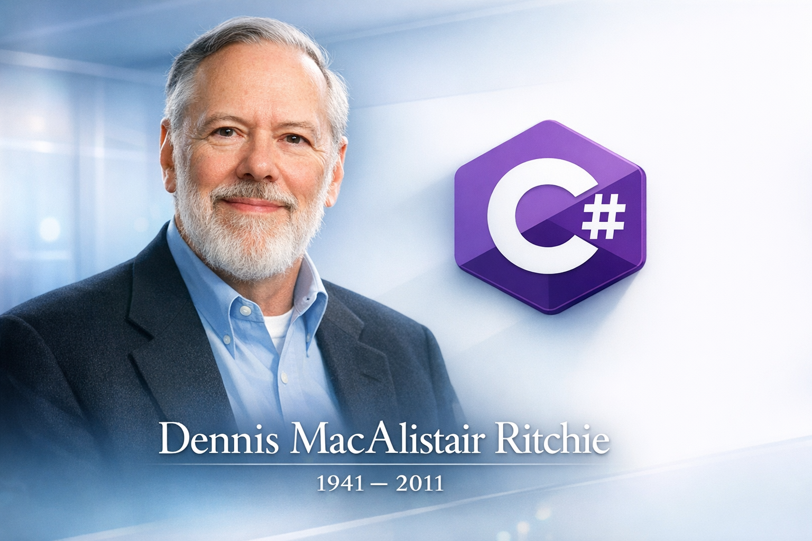

## 国内文章
### .NET 10了，HttpClient还是不能用using吗？我做了一个实验

https://www.cnblogs.com/sdcb/p/19500792/20260119-using-httpclient

文章探讨了在高并发情况下使用 HttpClient 的最佳实践。通过实验验证每次新建 HttpClient 会导致 TIME_WAIT 增加，从而引发端口耗尽。作者指出，HttpClient 应该被复用，而不是每次请求时创建和释放。文章提醒开发者使用单例或 IHttpClientFactory，以避免不必要的问题。实验结果显示，在低并发时表现正常，但高并发时却会出现严重错误。作者提供了复现实验的详细步骤和源代码，便于读者深入理解和验证。

### MWGA - 为了复活1000亿行C#代码

https://www.cnblogs.com/xdesigner/p/19501590

MWGA是一个迁移工具，旨在将GDI+的WinForm.NET程序快速转换为Blazor WASM平台，减少代码修改至10%以下。全球约有300万至500万WinForms开发者，其中60%至80%的应用需要现代化。MWGA提供极低的技术门槛和迁移成本，帮助开发者将原有C#代码复活于现代Web平台。与其他迁移方案相比，MWGA在效率、代码修改量和成本优势上均表现出色。项目目标是推动C#代码的复用与现代化，使开发者更轻松地适应新环境。

### 告别 throw exception！为什么 Result&lt;T&gt; 才是业务逻辑的正确选择

https://www.cnblogs.com/diamondhusky/p/19508626

这篇文章探讨了在C#中滥用异常处理的普遍现象，强调应将业务逻辑中的错误用正常的流程控制来管理，而非通过异常。文章介绍了Result类作为更优雅的错误处理方式，分析了异常处理的性能损耗和CLR底层原理，还在对比其他语言处理错误的方式。作者通过实例和深入分析，强调了C#开发中的误区，建议开发者重视性能和可维护性，避免使用异常处理正常的业务逻辑。总结部分提出了对Result模式的讨论，涵盖了其优缺点。

### .NET+AI | Workflow | 核心概念速通(1)

https://www.cnblogs.com/sheng-jie/p/19508743

MAF Workflow 是 Microsoft Agent Framework 提供的工作流框架，旨在编排多个智能体的执行。本文深入阐述了工作流的核心概念，包括执行器、连接边、超步等。工作流允许多步骤处理、多智能体协作和并行处理，避免了传统硬编码的复杂性。相比之下，工作流声明式定义更清晰，易于维护。执行器作为最小工作单元，负责接收和处理消息，提供丰富的类型和特征以满足不同需求。本文明确解释了每个概念的功能及示例，便于读者理解和应用。

### 两天烧掉200美元！我AI大模型网关终于支持了Claude模型

https://www.cnblogs.com/sdcb/p/19508169/20260120-chats-190

这篇文章讲述了作者在开发Sdcb Chats时集成Anthropic Claude模型的经历。作者分析了微软与Anthropic的合作及其对Azure费用的影响。通过重写底层调用逻辑，作者实现了Claude模型的原生支持，同时优化了流式输出和签名验证。文章强调了使用HttpClient而非官方SDK的选择，解决了兼容性问题。作者引入了多项新配置，优化了带宽使用和控制Token消耗，展示了该版本的技术深度和实践价值。

### 【译】Visual Studio 2026 来了：更快、更智能，深受老用户的喜爱

https://www.cnblogs.com/MeteorSeed/p/19505675

Visual Studio 2026 正式发布，凭借开发者的反馈而不断优化，修复了5000个缺陷，新增300项功能，性能显著提升。重设计的用户体验和人工智能支持使开发过程更流畅、更高效。新的设置系统与现代化的用户界面提升了整体使用体验。此版本与2022的项目完全兼容，确保开发者能够无缝过渡。人工智能工具如GitHub Copilot被广泛应用，增强了用户工作效率。总体来看，Visual Studio 2026 提供了更快速、响应更快的开发环境，让开发者专注于创新与实际工作。

### DeploySharp 全面支持 YOLO26 系列，助力开发者快速部署落地应用

https://www.cnblogs.com/guojin-blogs/p/19503930

DeploySharp 是一款专为 C# 开发者设计的跨平台模型部署框架，提供端到端解决方案。它支持多种推理引擎，如 OpenVINO、ONNX Runtime 和 TensorRT，兼容多个 .NET 运行时环境。DeploySharp 采用模块化架构，具备泛型设计，支持图像处理库如 ImageSharp 和 OpenCvSharp。它在 GitHub 上开源，遵循 Apache 2.0 协议。该框架已有多种 YOLO 系列模型支持，持续更新更多模型。

### C#/.NET/.NET Core技术前沿周刊 | 第 66 期(2026年1.12-1.18)

https://www.cnblogs.com/Can-daydayup/p/19514257

本文介绍了C#/.NET/.NET Core的最新技术动态，涵盖Android小部件开发、.NET Framework服务更新、ASP.NET MVC升级和MCP C# SDK等主题。文章提供实用的迁移策略和工具指导，适合开发者不断学习和掌握最新技术。内容清晰易懂，具有较强的实用性和技术深度，同时也强调了社区贡献和资源获取的便利性，增强了读者的参与感。整体而言，文章对开发者的技术成长和视野拓展具有重要意义。

### 如何提升 C# 应用中的性能

https://www.cnblogs.com/powertoolsteam/p/19511415

该文章探讨了针对 C# .NET 应用的性能优化技巧，包括性能测量、减少对象分配、字符串处理优化与异步编程最佳实践。开发者应使用性能分析工具能力确定瓶颈，合理管理对象分配以减少垃圾回收压力，采用 StringBuilder 等高效字符串处理方式，以及使用异步 API 提升应用响应能力。文章提供了实用的代码示例，便于开发者理解每种优化方法的实际应用。整体内容深入且实用，适合需要提升应用性能的开发者参考。

### 微软新利器！winapp CLI：一键打包、调试、集成 Windows 原生能力

https://www.cnblogs.com/chingho/p/19521120

微软推出了winapp CLI开源命令行工具，旨在简化Windows应用开发。该工具整合了SDK、应用打包、证书管理等核心功能，支持多种开发框架。它解决了跨平台开发中接入Windows原生能力的问题，提供自动生成清单和资源的功能，简化了调试流程。用户可以通过命令轻松初始化项目、创建调试身份并打包为MSIX，极大提高开发效率。该工具还推荐使用WinGet和NPM安装，方便集成到CI/CD环境中。

### WebAPI 项目通过 CI/CD 自动化部署到 Linux 服务器(docker-compose)

https://www.cnblogs.com/hnzhengfy/p/19012379/cicd_Linux_docker

本文介绍了如何使用 CI/CD 将 Docker 镜像从私有镜像库 Harbor 发布到 Linux 环境。首先，创建一个支持容器的 Web API 示例项目，并配置 Dockerfile。文中详细说明了多个构建阶段，包括基础镜像、服务项目构建和最终发布。其次，添加 GitLab CI 文件以及配置相应的变量来管理构建过程。文章适合需要自动化发布的开发者。配置及步骤简要明了，具有实用性。

### AspNetCore开发笔记：WebApi项目集成企业微信和公众号

https://www.cnblogs.com/deali/p/19514332

本文介绍了如何使用C# WebApi项目接入企业微信和微信公众号，重点在于自动回复功能的实现。作者指出微信文档的不足，并推荐使用SKIT.FlurlHttpClient.Wechat库来简化接口调用。文中详细说明了所需的配置信息，包括企业微信和公众号的各项参数，同时介绍了如何注册服务和管理AccessToken。通过IMemoryCache，作者展示了如何高效存储和管理token，确保调用接口的顺畅。

### 别让”高性能“骗了你

https://www.cnblogs.com/StuLittleLi/p/19508832

文章讨论了.NET中System.Buffers.ArrayPool的性能问题。作者在自项目中应用该类时，期望提升性能，但实际测试表明使用ArrayPool的效率不但未提高，反而降低了十倍。作者通过基准测试验证了这一点。文中提到网络上许多性能宣传标题往往不可全信，强调实践中的效果更为重要。文章意在提醒开发者，使用新技术时需谨慎评估其实际效果。

### unity性能优化-实际开发中需要注意的点

https://www.cnblogs.com/pipicfan/p/19503936

本文讨论了Unity中的性能优化策略，强调使用Unity Profiler定位瓶颈并提出几个核心原则。建议缓存可用的变量和组件，降低更新频率，避免在循环中分配内存。文章指出复杂的数学计算和不当的内存管理会影响性能。同时，它强调了避免C#中的装箱和拆箱，以减少开销。提供了使用泛型和struct替代类的建议，并且介绍了物体池的使用方法。优化方法具体且实用，适合开发者参考。

### 微软官方出品的 AI 初学者入门精品课程，21节课程教你构建生成式人工智能应用所需掌握的知识！

https://www.cnblogs.com/Can-daydayup/p/19524089

这篇文章介绍了微软为初学者设计的生成式AI课程，涵盖基础概念及实践应用。课程包含21节课程，内容涉及大语言模型、提示工程、AI Agent等，提供Python与TypeScript代码示例以促进学习。课程支持50多种语言，旨在帮助学习者构建生成式人工智能应用。文章链接指向课程资料及一系列教学视频，强调了该课程的实用性和全面性。

### Aspire 开发者控制平面 (DCP) 开源

https://www.cnblogs.com/shanyou/p/19525989

本文深入分析了微软开源的开发者控制平面(DCP)项目。DCP是基于Go语言的“影子Kubernetes”控制平面，旨在解决云原生开发中，本地环境与生产环境的复杂性差异。文章探讨了DCP的技术架构和核心组件，以及其对云原生生态的影响。通过DCP，开发者可以在本地环境中轻松编排容器和进程，从而缓解配置漂移问题。微软的开源决定意在提高透明度，支持多语言，增强社区信任，从而促进云原生应用的广泛采用。

### DBShadow.net之性能优化的坎坷路

https://www.cnblogs.com/xiangji/p/19522084

该文章通过BenchmarkDotNet测试MySQL参数构造的性能，展示了直接构造与复制参数的时间差异，发现复制方式节省了80%时间。此外，文章提出了重写参数预编译的思路，以便生成更高效的代码，选择更合适的MySqlParameterCollection的Add方法，并解释了ShadowBuilder如何需要额外的类型信息来生成原生代码。整体结构清晰，内容具有较强的实用性与原始性，适合对数据库性能优化感兴趣的开发者阅读。

### DBShadow.net之化繁为简

https://www.cnblogs.com/xiangji/p/19529688

本文介绍了如何在C#中简化数据库查询操作。作者通过示例展示了使用AccountGetService获取账户的方式，并提出了通过简化参数从Account类改为long类型的建议。此方法去除了不必要的封装，提升了代码简洁性。此外，提醒读者Dapper不支持此简化操作，避免在使用Dapper时出现错误。整体内容清晰，易于理解，对开发者有实用价值。

### MAF快速入门(13)常见智能体编排模式

https://www.cnblogs.com/edisontalk/p/-/quick-start-on-maf-chatper13

本文作者Edison介绍了MAF开发的多智能体编排模式，强调了多Agent协同处理任务的重要性和MAF的支持。文章讨论了四种主要的智能体编排模式：顺序编排、并发编排、移交编排和群聊编排。每种模式适用于不同的场景，如文档审阅、集思广益等。同时，作者通过示例代码展示了如何在MAF中实现这些编排模式，强调了`AgentWorkflowBuilder`类在快速构建工作流中的作用。本文结构清晰，技术细节丰富，适合学习MAF的开发者。

### 【EF Core】实体状态与变更追踪

https://www.cnblogs.com/tcjiaan/p/19528796

老周最近在两个厂工作，第一个厂严格管理，使用高功耗的雷神笔记本调试，充电受限。第二个厂项目复杂，工人测试时总错，老周怀疑人为因素。文中提到一实体映射到多个表的特殊情况，强调了技术的灵活运用。老周认为实战经验更重要，扎实的基础和技术能力才是关键。学习分为内修和外修，需兼顾。接着，讨论多个实体映射到一个表的可行性，以表拆分为主题，并通过实例说明。文中提及 C# 编程和实体模型定义。

### MAF快速入门(12)主工作流+子工作流

https://www.cnblogs.com/edisontalk/p/-/quick-start-on-maf-chatper12

文章介绍了如何在MAF框架中实现主工作流与子工作流结合的开发思路。通过示例代码，讲解了如何将子工作流转为执行器，并在主工作流中根据工单类型进行条件路由。文章包含一个企业客服中心的应用场景，阐明了使用.NET控制台应用程序和特定NuGet包的关键步骤，最终生成合规的用户回复。内容清晰简洁，适合学习和实践。

### 【Azure APIM】APIM的自建网关如何解决自签名证书的受信任问题呢？(方案一)

https://www.cnblogs.com/lulight/p/19503730

这篇技术文章讨论了在自托管网关中如何信任自签名证书的问题。文章首先复述了之前关于自签名证书的博客内容。接着，文章讲解了在AKS环境中部署自建网关时，如何处理HTTPS自签名证书的信任机制。虽然官方文档提供了解决方案，但其描述简单，操作性差。文章详细列出了解决步骤，包括上传证书、获取证书ID以及配置证书信任等。作者通过实践解决了信任问题，分享了具体的操作流程，提供了有用的技术指导。整体内容具有实用性和可操作性。

### 【Azure APIM】APIM的自建网关如何解决自签名证书的受信任问题呢？(方案二)

https://www.cnblogs.com/lulight/p/19514101

文章介绍了如何在Azure API管理(APIM)中处理自签名证书的问题。先前的博文讨论了生成自签名证书及其信任性。此文解答了是否可以禁用自签名证书的验证。APIM确实支持禁用此验证，以允许与后端服务安全通信。提供了使用PowerShell命令的详细步骤，以创建或修改后端并跳过证书链验证。此外，还展示了通过Azure门户操作的步骤。文章内容实用且具有技术深度。整体结构清晰。提供了官方文档链接，引用了相关资源。最后，涵盖的内容适时，针对具体的技术需求。

### GitHub Issues 集成

https://www.cnblogs.com/newbe36524/p/19522793

本文详细记录了HagiCode平台如何集成GitHub Issues，采用前端直连的架构以优化确定性控制和资源利用。文章首先分析了集成的必要性，提出了工作流割裂、协作不便和重复劳动等问题，随即介绍了一种新的“一键同步”功能。接着，文章探讨了前端直连与传统后端代理模式之间的对比，强调了轻量性和用户体验的提升，最终选择了前端直连模式。整个设计关注了数据流和安全性，确保令牌的安全获取与高效利用。 

### 【Azure APIM】APIM的自建网关如何解决自签名证书的受信任问题呢？(方案三)

https://www.cnblogs.com/lulight/p/19523829

本文讨论如何在 Azure Kubernetes Service (AKS) 中通过配置 SSL_CERT_FILE 安装自签名证书，以解决 APIM 自建网关的证书信任问题。首先，准备中间和根证书并合并为 crt 文件。然后，通过 kubectl 创建 Kubernetes Secret，将自签名证书导入 AKS 集群。接着，在应用的 YAML 文件中挂载该 Secret，并设置 SSL_CERT_FILE 环境变量指向证书文件。最后，部署配置并测试访问，确保请求能成功通过证书验证，避免500错误。

### 【Azure APIM】APIM的自建网关如何解决自签名证书的受信任问题呢？(不成功方案的分析)

https://www.cnblogs.com/lulight/p/19529821

文章讨论了如何在Azure APIM中解决自签名证书的信任问题。作者介绍了四种解决方案，重点在于通过自建网关配置SSL_CERT_FILE环境变量来信任自签名证书。文章详细描述了使用az aks update命令更新AKS集群以添加自定义CA证书的步骤。最后，作者解释了自签名证书在APIM Self-hosted Gateway中的信任问题，强调AKS节点的CA仅对节点有效，而对Pod无效。文中提供了丰富的实施细节和截图，易于理解。

### 在vs2015中使用vs2019的编译器

https://www.cnblogs.com/DemoFX/p/19527766

本文讨论了在硬盘空间不足的情况下，如何使Visual Studio 2015支持Visual Studio 2019的编译器，以便打开和编译不需修改的项目文件。作者指出只需在vs2015中增加vs2019编译器支持，主要通过修改msbuild配置文件实现互通。文章最后提到主要参考了一些链接。

---
## 话题
### Copilot SDK 技术预览版 - GitHub 更新日志
https://github.blog/changelog/2026-01-14-copilot-sdk-in-technical-preview/

GitHub Copilot SDK 已作为技术预览发布。

通过使用 SDK，可以实现类似 Copilot CLI 的多回合对话和工具执行等 AI 驱动应用。 该SDK支持.NET、Node.js、Python和Go。

### 发布版本 v10.0.0 · Dotnet/Orleans
https://github.com/dotnet/orleans/releases/tag/v10.0.0

Orleans 10.0.0 版本已发布。

该版本支持 .NET 8 和 .NET 10，并包含对 NATS Stream 的支持以及各种改进和修复。

## 发布
- [aws/aws-sdk-net](https://github.com/aws/aws-sdk-net)
    - [3.7.1204.0](https://github.com/aws/aws-sdk-net/releases/tag/3.7.1204.0)，[3.7.1205.0](https://github.com/aws/aws-sdk-net/releases/tag/3.7.1205.0)，[3.7.1206。 0](https://github.com/aws/aws-sdk-net/releases/tag/3.7.1206.0)， [4.0.172.0](https://github.com/aws/aws-sdk-net/releases/tag/4.0.172.0)， [4.0.173.0]( https://github.com/aws/aws-sdk-net/releases/tag/4.0.173.0)， [4.0.174.0](https://github.com/aws/aws-sdk-net/releases/tag/4.0.174.0)
- [Azure/azure-sdk-for-net](https://github.com/Azure/azure-sdk-for-net)
    - [Azure.ResourceManager.Avs_1.6.0](https://github.com/Azure/azure-sdk-for-net/releases/tag/Azure.ResourceManager.Avs_1.6.0)，[Azure.ResourceManager.Compute_1.14。 0](https://github.com/Azure/azure-sdk-for-net/releases/tag/Azure.ResourceManager.Compute_1.14.0)， [Microsoft.Azure.WebJobs.Extensions.WebPubSub_1.10. 0](https://github.com/Azure/azure-sdk-for-net/releases/tag/Microsoft.Azure.WebJobs.Extensions.WebPubSub_1.10.0)
- [CommunityToolkit/Aspire](https://github.com/CommunityToolkit/Aspire)
    - [v13.1.1](https://github.com/CommunityToolkit/Aspire/releases/tag/v13.1.1)
- [dotnet/Orleans](https://github.com/dotnet/orleans)
    - [v10.0.0](https://github.com/dotnet/orleans/releases/tag/v10.0.0)
- [dotnet/SqlClient](https://github.com/dotnet/SqlClient)
    - [v6.0.5](https://github.com/dotnet/SqlClient/releases/tag/v6.0.5)
- [googleapis/google-cloud-dotnet](https://github.com/googleapis/google-cloud-dotnet)
    - [Google.Cloud.Compute.V1-3.23.0](https://github.com/googleapis/google-cloud-dotnet/releases/tag/Google.Cloud.Compute.V1-3.23.0)，[Google.Cloud.Datastore.V1-5.1。 0](https://github.com/googleapis/google-cloud-dotnet/releases/tag/Google.Cloud.Datastore.V1-5.1.0)， [Google.Cloud.Dialogflow.Cx.V3-3.0. 0](https://github.com/googleapis/google-cloud-dotnet/releases/tag/Google.Cloud.Dialogflow.Cx.V3-3.0.0)， [Google.Cloud.NetApp.V1-1.14. 0](https://github.com/googleapis/google-cloud-dotnet/releases/tag/Google.Cloud.NetApp.V1-1.14.0)， [Google.Cloud.Run.V2-2.19. 0](https://github.com/googleapis/google-cloud-dotnet/releases/tag/Google.Cloud.Run.V2-2.19.0)， [Google.Cloud.Spanner-5.12. 0](https://github.com/googleapis/google-cloud-dotnet/releases/tag/Google.Cloud.Spanner-5.12.0)
- [grpc/grpc-dotnet](https://github.com/grpc/grpc-dotnet)
    - [v2.76.0](https://github.com/grpc/grpc-dotnet/releases/tag/v2.76.0)
- [microsoft/CsWin32](https://github.com/microsoft/CsWin32)
    - [v0.3.269](https://github.com/microsoft/CsWin32/releases/tag/v0.3.269)
- [开放遥测/开放遥测点网](https://github.com/open-telemetry/opentelemetry-dotnet)
    - [core-1.15.0](https://github.com/open-telemetry/opentelemetry-dotnet/releases/tag/core-1.15.0)
- [开放遥测/开放遥测点网贡献](https://github.com/open-telemetry/opentelemetry-dotnet-contrib)
    - [Exporter.OneCollector-1.15.0](https://github.com/open-telemetry/opentelemetry-dotnet-contrib/releases/tag/Exporter.OneCollector-1.15.0)， [Instrumentation.AspNet-1.15. 0](https://github.com/open-telemetry/opentelemetry-dotnet-contrib/releases/tag/Instrumentation.AspNet-1.15.0)， [Instrumentation.AspNetCore-1.15. 0](https://github.com/open-telemetry/opentelemetry-dotnet-contrib/releases/tag/Instrumentation.AspNetCore-1.15.0)， [Instrumentation.AWS-1.15. 0](https://github.com/open-telemetry/opentelemetry-dotnet-contrib/releases/tag/Instrumentation.AWS-1.15.0)， [Instrumentation.http-1.15. 0](https://github.com/open-telemetry/opentelemetry-dotnet-contrib/releases/tag/Instrumentation.Http-1.15.0)， [Instrumentation.Runtime-1.15. 0](https://github.com/open-telemetry/opentelemetry-dotnet-contrib/releases/tag/Instrumentation.Runtime-1.15.0)

## 文章、幻灯片及更多内容
### 在 Microsoft 365 代理 SDK 中发送主动消息
https://zenn.dev/karamem0/articles/2026_01_20_180000

学习如何使用 Microsoft 365 代理 SDK 进行主动消息传递，比如 Bot Framework。

### C#中的MCP入门(天气API集成)——移植《MCP入门》一书中的Python代码(4)
https://zenn.dev/zead/articles/mcp-learning-4

这是一系列使用 Python 将《MCP 导论——生成式人工智能应用的全规模开发》一书中的示例代码移植到 C#。

### 在C# .NET中构建零分配解析器
https://jordansrowles.medium.com/building-zero-allocation-parsers-in-c-net-348ce6d124f1

一种利用C#中ref struct/span实现减少分配解析器的方法。

### 原生AOT在真实应用中有多快https://zenn.dev/shinta0806/articles/native-aot-speed

关于用 Native AOT 构建 WinUI 3 应用启动速度比较的结果。

### . NET10 中 Blazor 网页应用中的声音
https://zenn.dev/tetr4lab/articles/2ee77f9920c155

学习如何使用 HTMLAudioElement 来制作 Blazor Web 应用中的声音。 文章引用了 .NET 10 中引入的 JavaScript 侧构造函数

### [C#] 在字符串的分割方法中设置空字符时的行为
https://zenn.dev/someone7140/articles/0e0024e0cfaa0d

关于在类型为 String 的 Split 方法中指定空字符作为分隔符的行为。

### 让我们试试 Windows PC 和 .NET 上的 L-Chika(我不是在说 nanoFramework)- Qiita
https://qiita.com/yamaokunousausa/items/79ac9ec01354057318ba

如何使用 USB-GPIO 设备在 Windows 上的 .NET 应用程序中闪烁 LED(LCHIKA)。

### 在ChatOptions的工具中注册多个AI基金，使用 Microsoft.Extensions.AI
https://zenn.dev/microsoft/articles/ms-extensions-ai-multi-tool

在 Microsoft.Extensions.AI 中 ChatOptions 的工具属性中注册多个 AIFunction 的技巧。

### [C#] 从现在开始，我们停止使用 TcpClient/UdpClient，直接使用 Sockets。
https：//zenn.dev/nuskey/articles/csharp-don't-use-tcpclient

为什么现代.NET在处理TCP/UDP时，直接使用套接字比用TcpClient或UdpClient更好。

### . 用 PC/SC APDU 命令代替 .NET 应用中的 FeliCa 命令读取运输集成电路卡的使用历史——Qiita
https://qiita.com/yamaokunousausa/items/4cded2f1e4fbf40b30b3

如何从 .NET 应用程序读取运输 IC 卡的使用历史。

### 利用反射和动态在 IEnumable 分配上进行 foreach 方法
https://andrewlock.net/making-foreach-on-an-ienumerable-allocation-free-using-reflection-and-dynamic-methods/

如何在用foreach枚举IEnmuables时减少分配。
在文章中，我们将讨论如何枚举你用 DynamicMethod 自己实现的其他结构类型的枚举器，以及如何枚举 。 NET 10 也讨论了改进。

### 用 vtable+ 函数指针快速访问 C# 中的 COM 接口
https://zenn.dev/radian_jp/articles/27886b583439b7

学习如何在不使用运行时可调用包装器的情况下，使用COM接口和自己的vtable和函数指针。

### SBOM和SLSA的现状在C#/NuGet中 - tech.guitarrapc.cóm
https://tech.guitarrapc.com/entry/2026/01/17/230000

了解NuGet中SBOM和SLSA的支持，以及如何设置和启用它们。

## 网站、文档及更多
### 在Visual Studio学习C#编程。 NET10兼容
https://zenn.dev/tsuna_can/books/dotnet10-basic-csharp-programming

Visual Studio (Zenn)C#编程导论。

## 今日人物

**丹尼斯·麦卡利斯泰尔·里奇**（英语：Dennis MacAlistair Ritchie，1941年9月9日—2011年10月12日），美国计算机科学家。[黑客](https://zh.wikipedia.org/wiki/駭客)圈子通常称他为“**dmr**”[[4\]](https://zh.wikipedia.org/wiki/丹尼斯·里奇#cite_note-4)。他是[C语言](https://zh.wikipedia.org/wiki/C語言)的创造者、[Unix](https://zh.wikipedia.org/wiki/Unix)[操作系统](https://zh.wikipedia.org/wiki/作業系統)的关键开发者[[5\]](https://zh.wikipedia.org/wiki/丹尼斯·里奇#cite_note-NYTimes-5)[[6\]](https://zh.wikipedia.org/wiki/丹尼斯·里奇#cite_note-BBC-6)[[7\]](https://zh.wikipedia.org/wiki/丹尼斯·里奇#cite_note-RobPike-7)[[8\]](https://zh.wikipedia.org/wiki/丹尼斯·里奇#cite_note-Guardian-8)，对计算机领域产生了深远影响，并与[肯·汤普逊](https://zh.wikipedia.org/wiki/肯·湯普遜)同为1983年[图灵奖](https://zh.wikipedia.org/wiki/图灵奖)得主。

## C# .NET 交流群

相信大家在开发中经常会遇到一些性能问题，苦于没有有效的工具去发现性能瓶颈，或者是发现瓶颈以后不知道该如何优化。之前一直有读者朋友询问有没有技术交流群，但是由于各种原因一直都没创建，现在很高兴的在这里宣布，我创建了一个专门交流.NET 性能优化经验的群组，主题包括但不限于：

* 如何找到.NET 性能瓶颈，如使用 APM、dotnet tools 等工具
* .NET 框架底层原理的实现，如垃圾回收器、JIT 等等
* 如何编写高性能的.NET 代码，哪些地方存在性能陷阱

希望能有更多志同道合朋友加入，分享一些工作中遇到的.NET 问题和宝贵的分析优化经验。**目前一群已满，现在开放二群。**可以加我 vx，我拉你进群: **ls1075** 另外也创建了 **QQ Group**: 687779078，欢迎大家加入。