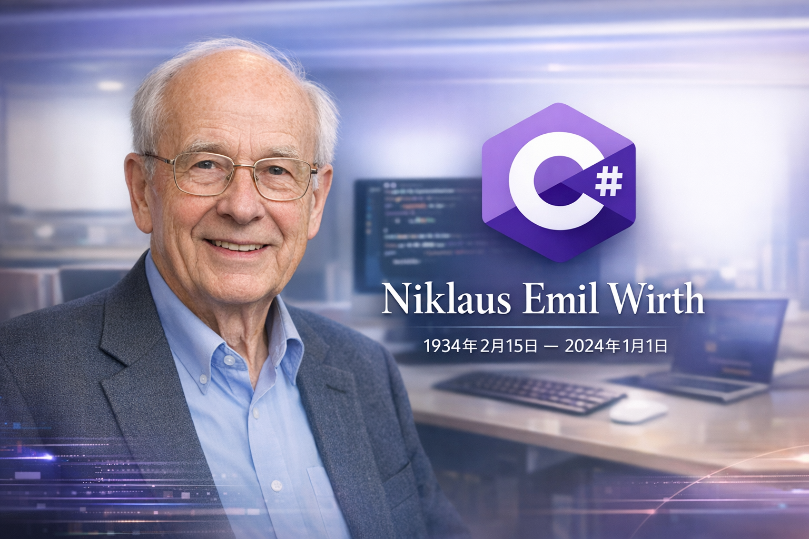

## 国内文章
### 《HelloGitHub》第 118 期

https://www.cnblogs.com/xueweihan/p/19535889

HelloGitHub 分享了有趣且入门级的开源项目，涵盖多种编程语言。用户可以快速上手，感受开源的魅力。推荐的项目包括支持 C# 的 LLPlayer，它能为视频生成双语字幕，及其他 C、C++、Go 等项目，涉及文件管理、网络监控及分布式数据库等功能。这些项目适合个人和团队，提供了丰富的实用性和创造力，定期更新内容，让用户保持对开源的兴趣。

### 复刻 ChatGPT 高级数据分析！Sdcb Chats 1.10 重磅发布：能分析Excel、做PPT

https://www.cnblogs.com/sdcb/p/19528764/chats-1-10

Sdcb Chats 1.10.0 发布了，新增内置代码执行器，支持 Docker 沙箱功能。用户可直接创建 Docker 会话上传文件，AI 模型执行代码、分析数据并生成各类文档。这样的功能可以更好地管理和使用 AI 模型，尤其适用于企业用户。为了便捷使用，开发者提供了预装工具链和依赖的镜像。此版本体现了对 ADA 方向的重视，展示了更深的技术能力。

### 使用 JYPPX.DeploySharp 高效部署 PaddleOCR，解锁多种高性能 OCR 文字识别方案

https://www.cnblogs.com/guojin-blogs/p/19545866

本文介绍了如何在.NET环境下使用JYPPX.DeploySharp高效部署PaddleOCR模型。文章分析了OCR技术的重要性，并介绍了DeploySharp的核心优势，包括统一接口和灵活部署。作者基于自己开发的OpenVINO C# API整合了多种推理引擎，提升了文字识别的性能与灵活性。文章详细阐述了PaddleOCR的工作流程及性能优化策略，为开发者提供了一套完整的解决方案。结合DeploySharp，开发者可以便捷地在不同推理引擎间切换，以满足多样化的应用需求。

### 一款基于 .NET Avalonia 开源免费、快速、跨平台的图片查看器

https://www.cnblogs.com/Can-daydayup/p/19550484

PicView是一款基于.NET Avalonia的开源图片查看器，支持macOS和Windows 10/11。它可以查看多种图像格式，如WEBP、GIF、SVG等，为用户提供干净且高效的体验。PicView使用C# .NET和Avalonia构建，采用NativeAOT编译，确保高性能且低内存分配。该工具适合个人用户和专业设计师，支持批量调整大小和文件重命名功能。项目代码可在GitHub上访问，并已收录在C#/.NET优秀项目中，便于开发者了解最新动态和最佳实践。

### .NET 10 与智能体时代的架构演进：以 File-Based Apps 为核心的 C# 生态重塑

https://www.cnblogs.com/shanyou/p/19553650

本文介绍了.NET 10的“基于文件的应用程序”功能，标志着C#在智能体时代的根本转型。此特性允许开发者在单个.cs文件中直接编写代码，省去复杂的项目结构，提升了开发效率。C#的<script>运行方式具有原子性和自包含性，支持即时执行和动态代码分发，减少了上下文复杂度。这一新模式极大地增强了C#在AI驱动开发中的灵活性，保留了其性能和类型安全的优势，标志着C#从“重型语言”向“全场景语言”的演变。

### 解密 Navicat 密码神器：NavicatPassword 的技术实现与架构解析

https://www.cnblogs.com/dingshuanglei/p/19536434

本文介绍了NavicatPassword，一款基于Avalonia框架的跨平台密码解密工具。它解决了Navicat数据库连接密码存储问题，通过AES算法加密实现安全存储。项目支持Windows、macOS、Linux平台，提供批量解析、单条解密和手动输入解密等功能，界面现代、操作简便。使用.NET 8和MVVM架构，项目具备高性能和易维护性。核心算法采用AES-128-CBC，确保解密的准确性。整体架构清晰，层次分明，有助于未来的扩展与维护。

### ZL.ParamEditor：把WinForms配置从‘苦力活’变成‘享受’！

https://www.cnblogs.com/egreen/p/19545570

ZL.ParamEditor是一个针对WinForms应用的高性能参数编辑器框架，采用声明式开发范式，简化了UI创建过程，提升开发效率70%以上。它内置多种主题，支持动态切换和完全自定义。框架提供强大的验证和权限控制机制，确保数据的准确性与安全性。通过工厂模式，可轻松扩展各种自定义控件，适配复杂参数类型。开发者只需通过简单代码配置参数结构，从而快速构建高效的交互界面，提升整体生产力。

### 基于 C# 和 Nuke 打造现代化构建系统的最佳实践

https://www.cnblogs.com/newbe36524/p/19536496

文章介绍了如何利用C#和Nuke构建现代化的自动化构建系统。传统的构建脚本复杂且难以维护，Nuke则提供了模块化、类型安全和跨平台的优势。模块化设计让构建流程简化为独立目标，提高了效率并减少了错误。类型安全确保编译时检查，避免常见的拼写错误。跨平台特性使得不同操作系统间构建一致性得以实现。此外，Nuke简化了参数与配置管理，提升了开发体验。整篇文章切合实际且深入浅出，适合软件开发者阅读。

### .NET 虚拟单体存储库 (VMR)架构演进、同步机制与统一构建策略

https://www.cnblogs.com/shanyou/p/19540873

本文详细分析了.NET 平台的构建架构转型，着重介绍了从分布式多存储库模式向虚拟单体存储库 (VMR) 的迁移过程。随着.NET 的开源进程，传统的多存储库模式暴露出严重的系统性缺陷，如一致性延迟和版本冲突问题。VMR 作为一种混合架构，旨在通过虚拟化技术，整合不同产品存储库的独立性与单体存储库带来的统一构建和版本控制的优势。这种转型不仅提升了内部工程效率，还满足了开源社区的协作需求，促进了技术的演进。

### StreamJsonRpc 在 HagiCode 中的深度集成与实践

https://www.cnblogs.com/newbe36524/p/19546448

本文讨论了 HagiCode 项目集成 Microsoft 的 StreamJsonRpc 库，以取代自定义 JSON-RPC 实现。StreamJsonRpc 提供了类型安全和自动代理生成等优点，但集成过程中面临多项挑战，如代理目标绑定和泛型参数识别。项目团队决定重构构建系统，移除旧代码并引入官方库，解决架构混乱与日志缺失等问题。这使得 AACP 协议与外部 AI 工具的通信变得更加高效，HagiCode 作为 AI 驱动的代码助手，有助于降低多技术栈下的构建成本。

### 完善基于WPF开发的标尺控件（含实例代码）

https://www.cnblogs.com/wuty/p/19559302

本文介绍了一款基于WPF的标尺控件，旨在实现更完善的鼠标坐标显示功能。作者在2021年撰写的基础上，利用腾讯Codebuddy的AI编程插件补充了代码。代码结构清晰，包含依赖属性的定义和静态构造函数的实现。同时，结合了DPI、显示类型和单位设置等属性。整体展示了对WPF开发的深入理解和实际应用。文章为程序员提供了实用的参考，有助于开发类似的控件。

### 如何实现一套.net系统集成多个飞书应用

https://www.cnblogs.com/mudtools/p/19541419

本文探讨如何统一集成不同部门的飞书应用，提出通过微服务架构和智能事件路由实现高效管理。文章讨论了多应用开发中的困境，特别是独立开发导致的效率低下和管理混乱。介绍了使用MudFeishu库与不同组件（如HTTP API、WebSocket和Webhook）来处理这些问题的解决方案。详细阐述了应用的配置过程，提供了具体的代码示例，具备实用性和清晰度。

### MWGA如何帮助7万行Winforms程序快速迁移到WEB前端

https://www.cnblogs.com/xdesigner/p/19553109

MWGA（Make Winforms Great Again）是一个将 WinForms 程序迁移到 Blazor WASM 平台的工具。本文描述了成功将一款用于医院行业的商业软件迁移至 Web 的案例，该软件包含约 7 万行 C# 代码，具有复杂的可视化功能。迁移过程采用高度标准化流程，包括创建 Blazor 项目、引用 MWGA 程序集、配置应用入口和适配性调整代码。大部分核心代码无需修改，仅对异步处理进行小范围改动。此工具展示了在复杂项目中出色的迁移能力，并在市场上证明其价值。

### 探秘 AgentRun丨动态下发＋权限隔离，重构 AI Agent 安全体系

https://www.cnblogs.com/Serverless/p/19544955

在构建Agent应用过程中，凭证管理至关重要。函数计算AgentRun提供双向凭证管理，确保只允许授权用户访问Agent，并安全调用外部服务。入站凭证控制访问权限，支持动态更新，有效防止凭证泄露。出站凭证使用加密存储，采用定时查询和缓存机制，确保凭证安全性、可用性和性能。更新过程对开发者透明，简化凭证管理。该系统在调用大模型和工具时展示了高效、灵活的凭证配置，提升了安全性与效率。

### 跨平台 UI 工程的 Agentic 转型：MCP 在 Avalonia 生态中的深度应用与架构演进

https://www.cnblogs.com/shanyou/p/19545779

本文探讨了大型语言模型（LLM）在人工智能辅助软件开发中的应用，尤其是如何通过模型上下文协议（MCP）解决AI与应用状态间的实时交互问题。文中详细介绍了MCP的架构，包括宿主、客户端和服务器的功能。这一开放标准使得AI能够更有效地连接到数据源，标志着从静态理解到动态洞察的转变。此外，Avalonia DevTools MCP Server为AI提供了强大的程序化控制能力，极大提高开发效率，尤其在复杂的企业环境中。

### 将SignalR移植到Esp32—让小智设备无缝连接.NET功能拓展MCP服务

https://www.cnblogs.com/GreenShade/p/19560338

本文探讨了小智聊天机器人与ESP32的集成，重点在于通过SignalR实现设备的实时消息推送。文章首先描述了现有MCP工具的局限性，随后阐明了SignalR的集成如何将设备转变为被动接收消息的状态。此外，讨论了扫码登录功能及其实现，提供了用户友好的认证体验。本文深入探讨了技术细节，解析了为何选择SignalR而非WebSocket，突出其在消息路由和调用体验上的优势。

---

## 国际周报

**国际周报未更新**

## 今日人物

**尼克劳斯·埃米尔·维尔特**（德语：Niklaus Emil Wirth，1934年2月15日—2024年1月1日），生于[瑞士](https://zh.wikipedia.org/wiki/瑞士)[温特图尔](https://zh.wikipedia.org/wiki/温特图尔)，是[瑞士](https://zh.wikipedia.org/wiki/瑞士)[计算机科学](https://zh.wikipedia.org/wiki/計算機科學)家。

从1963年到1967年，他成为[斯坦福大学](https://zh.wikipedia.org/wiki/斯坦福大学)的计算机科学部助理教授，之后又在[苏黎世大学](https://zh.wikipedia.org/wiki/苏黎世大学)担当相同的职位。1968年，他成为[苏黎世](https://zh.wikipedia.org/wiki/苏黎世)[联邦](https://zh.wikipedia.org/wiki/联邦)[理工](https://zh.wikipedia.org/wiki/理工)[学院](https://zh.wikipedia.org/wiki/学院)的[信息学](https://zh.wikipedia.org/wiki/信息学)教授，又往[施乐帕洛阿尔托研究中心](https://zh.wikipedia.org/wiki/施乐帕洛阿尔托研究中心)进修了两年。

他是好几种[编程语言](https://zh.wikipedia.org/wiki/編程語言)的主设计师：

- [Algol W](https://zh.wikipedia.org/wiki/Algol_W)
- [Modula](https://zh.wikipedia.org/wiki/Modula)
- [Pascal](https://zh.wikipedia.org/wiki/Pascal_(程式語言))
- [Modula-2](https://zh.wikipedia.org/wiki/Modula-2)
- [Oberon](https://zh.wikipedia.org/wiki/Oberon)

他亦是[Euler语言](https://zh.wikipedia.org/w/index.php?title=Euler_(程式語言)&action=edit&redlink=1)的发明者之一。1984年他因发展了这些语言而获[图灵奖](https://zh.wikipedia.org/wiki/图灵奖)。他亦是[Lilith电脑](https://zh.wikipedia.org/w/index.php?title=Lilith電腦&action=edit&redlink=1)和[Oberon系统](https://zh.wikipedia.org/wiki/Oberon系统)的设计和执行队伍的重要成员。

他的文章*Program Development by Stepwise Refinement*视为[软件工程](https://zh.wikipedia.org/wiki/軟體工程)中的经典之作。他写的一本书的书名*Algorithms + Data Structures = Programs*（[算法](https://zh.wikipedia.org/wiki/算法)+[数据结构](https://zh.wikipedia.org/wiki/数据结构)=[程序](https://zh.wikipedia.org/wiki/程式)）是[计算机科学](https://zh.wikipedia.org/wiki/計算機科學)的名句。

## C# .NET 交流群

相信大家在开发中经常会遇到一些性能问题，苦于没有有效的工具去发现性能瓶颈，或者是发现瓶颈以后不知道该如何优化。之前一直有读者朋友询问有没有技术交流群，但是由于各种原因一直都没创建，现在很高兴的在这里宣布，我创建了一个专门交流.NET 性能优化经验的群组，主题包括但不限于：

* 如何找到.NET 性能瓶颈，如使用 APM、dotnet tools 等工具
* .NET 框架底层原理的实现，如垃圾回收器、JIT 等等
* 如何编写高性能的.NET 代码，哪些地方存在性能陷阱

希望能有更多志同道合朋友加入，分享一些工作中遇到的.NET 问题和宝贵的分析优化经验。**目前一群已满，现在开放二群。**可以加我 vx，我拉你进群: **ls1075** 另外也创建了 **QQ Group**: 687779078，欢迎大家加入。